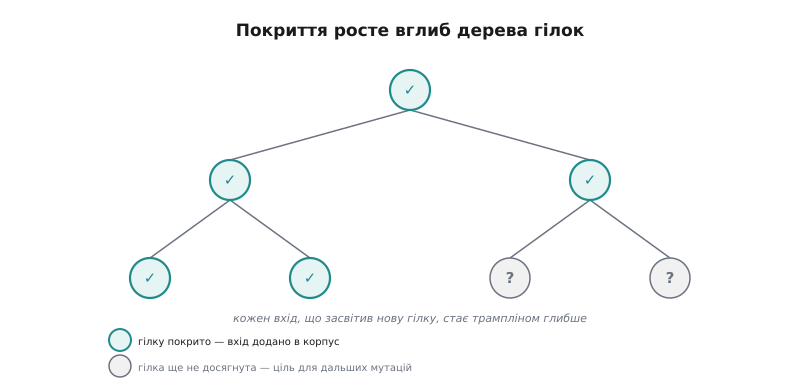
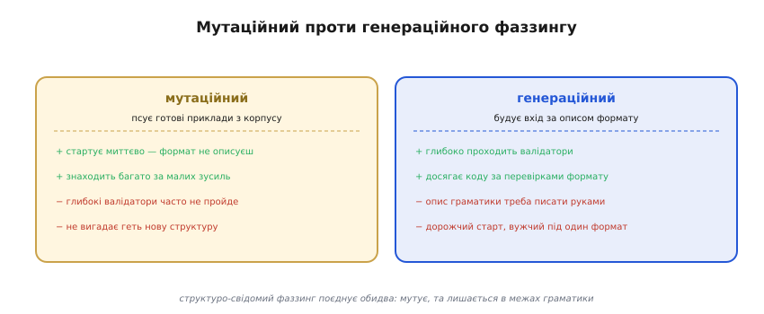
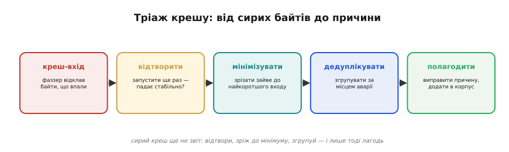

# Фаззинг: глибокий розбір

Фаззинг легко звести до гасла «кидай у програму випадкові байти, поки не впаде» — і саме так його часто й уявляють. Але між цією наївною картинкою й тим, що насправді знаходить за день тисячі багів у промисловому коді, лежить кілька неочевидних механізмів. Чому випадковий перебір майже безсилий, а керований покриттям — нищівний? Як фаззер «бачить» код зсередини? Чому без санітайзера він наполовину сліпий? Що робити з тисячею знайдених крешів, які насправді один баг? І де лежить межа, за якою фаззинг перестає допомагати? Розберемо це по черзі, від рушія до меж.

## Інструментування: як фаззер відрощує очі

Уся сила сучасного фаззингу тримається на одній ідеї — **зворотному зв'язку за покриттям коду** (англ. *coverage-guided*). Щоб її зрозуміти, почнемо з того, чого бракує сліпому фаззеру.

Сліпий фаззер працює наосліп у буквальному сенсі: він кидає вхід, дивиться лише на «впало / не впало» і кидає наступний. Уся інформація про те, що сталося **всередині** програми, для нього втрачена. Це фатально, бо реальний код — це лабіринт розгалужень, і майже кожне з них відсікає величезну частку випадкових входів на самому початку. Парсер звірив магічне число — і 65 535 із 65 536 випадкових входів полетіли в кошик, не діставшись навіть другого рядка. Сліпий фаззер про це не знає; він знову й знову штурмує перші ворота й ніколи не бачить, що за ними.

Прорив — навчити фаззер **бачити пройдені гілки**. Робиться це інструментуванням (англ. *instrumentation* — оснащення приладами): під час збірки з прапорцем `-fsanitize=fuzzer` (чи в режимі AFL++) компілятор вставляє на **кожне розгалуження** коду невеликий лічильник. Фізично це виглядає так: між базовими блоками коду — ділянками без розгалужень — компілятор вкидає виклик, що відмічає «цей перехід відбувся». Після кожного запуску фаззер читає цю мапу переходів і знає вже не одне «впало / ні», а **повний слід**: якими гілками вхід пройшов, які переходи між блоками задіяв.

Ось тут і вмикається головне правило, на якому тримається все: **вхід, що засвітив досі не пройдений перехід, фаззер вважає цінним і зберігає в корпусі — як трамплін для дальших мутацій**. Тобто фаззер не просто шукає аварію; він жадібно колекціонує входи, що відкривають новий код, і будує наступні мутації **від них**. Так він повзе вглиб дерева гілок: кожен новий цінний вхід — це сходинка трохи глибше, від якої наступні мутації сягають ще далі.

*Покриття росте вглиб. Інструментування ставить лічильник на кожну гілку; засвічені вузли (бірюзові) — це гілки, які фаззер уже відкрив і чиї входи поклав у корпус. Кожен такий вхід стає трампліном: дальші мутації від нього сягають глибших, ще не досягнутих гілок (сірі). Так фаззер не штурмує дерево навмання, а повзе по ньому крок за кроком — нова гілка веде до наступної, доки не зостанеться непокритих шляхів або не урветься час.*

Числовий приклад показує масштаб різниці. Хай вхід має дійти до коду за чотирма послідовними перевірками, кожна пропускає, скажімо, одну мутацію з тисячі. Сліпому фаззерові, щоб випадково пройти всі чотири разом, треба порядку 1000⁴ ≈ 10¹² спроб — недосяжно. Coverage-guided розкладає це на **чотири незалежні сходинки**: пройшов першу (≈1000 спроб) — зберіг вхід; від нього пройшов другу (ще ≈1000) — зберіг; і так далі. Разом — порядку 4 × 1000 = 4000 спроб замість 10¹². Та сама задача з нездоланної стає хвилинною — і саме це перетворило фаззинг з академічної цікавинки на щоденний інструмент.

## Мутаційний проти генераційного: дві школи добування входів

Звідки фаззер бере самі входи? Тут дві принципово різні школи, і їхня відмінність визначає, які баги ви знайдете.

**Мутаційний фаззинг** (англ. *mutation-based*) бере **готові приклади** з корпусу й **псує** їх: перевертає окремі біти, замінює, вставляє чи зрізає байти, копіює шматки, підставляє граничні значення (`0`, `0xFF`, `INT_MAX`). Він **нічого не знає про формат** входу — для нього це просто масив байтів. Головна перевага — миттєвий старт: дав кілька прикладів, і фаззер уже працює, не описуючи жодних правил. Саме так працюють libFuzzer і AFL++ за замовчуванням, і саме мутаційний підхід дає більшість знахідок за найменших зусиль. Слабкість — глибокі **валідатори**: якщо формат вимагає, скажімо, правильної контрольної суми в кінці, сліпа мутація її завжди ламає, і вхід відсікається перевіркою цілості, так і не дійшовши до цікавого коду за нею.

**Генераційний фаззинг** (англ. *generation-based*) заходить з іншого боку: йому дають **опис формату** — граматику, схему, модель повідомлення, — і він **будує** входи за цими правилами з нуля. Оскільки кожен згенерований вхід уже синтаксично правильний, він **глибоко проходить валідатори** й дістає коду, захованого за перевірками формату. Ціна — описувати граматику доводиться **руками**, і такий фаззер вужчий: він заточений під один конкретний формат.

*Дві школи добування входів. Мутаційний фаззер псує готові приклади з корпусу: стартує миттєво й знаходить багато за малих зусиль, але глибокі валідатори формату часто не проходить і нової структури не вигадає. Генераційний будує вхід за описом граматики: глибоко проходить валідатори й дістає коду за ними, але опис формату треба писати руками, і він вужчий. Структуро-свідомий фаззинг — компроміс: мутує, але лишається в межах граматики.*

Сучасний компроміс між ними — **структуро-свідомий фаззинг** (англ. *structure-aware*). Він мутує входи, як мутаційний, але робить це **в межах опису структури**, не ламаючи її каркас. Найпоширеніший спосіб — описати формат як повідомлення **protobuf** (бінарний формат серіалізації Google) і дати фаззерові мутувати **поля цього повідомлення**, а не сирі байти: число лишається числом, рядок рядком, обов'язкове поле не зникає. Так мутації не вилітають за межі граматики й одразу дістають глибокого коду. Інший шлях — **граматичний** фаззер, що знає правила мови (скажімо, SQL чи мови розмітки) і породжує лише структурно валідні, але семантично дикі входи. Структуро-свідомий підхід окупається саме там, де формат складний і добре захищений валідаторами: голій мутації туди не пробитися.

## Корпус, затравка, словник: три опори ефективності

Три речі визначають, як швидко фаззер занурюється вглиб, і всі три варто розуміти окремо.

**Корпус** (лат. *corpus* — зібрання) — це накопичений набір цінних входів, кожен з яких колись відкрив нову гілку. Він — **довгострокова пам'ять** фаззингу: між прогонами його зберігають і підкладають на старт, тож фаззер не починає з нуля, а одразу стрибає на досягнуту раніше глибину. Корпус росте сам собою під час прогону — фаззер докладає до нього кожен новий цінний вхід.

**Затравка** (англ. *seed* — насінина) — це початкові, **справжні валідні** приклади входу, з яких фаззер стартує: реальний кадр протоколу, коректний файл формату, типове повідомлення. Якість затравки вирішує дуже багато. Стартувати з порожнечі — означає змусити фаззер спершу **навмання вгадати** базову структуру (магічне число, обов'язкові поля), а це довго. Стартувати з доброго реального прикладу — означає дати йому майже правильний каркас, який лишається **псувати точково**. Правило просте: давайте за затравку **малі, різноманітні, валідні** приклади, що вкупі покривають різні гілки формату; один великий приклад гірший за кілька маленьких, бо мутувати малий вхід швидше й прицільніше.

**Словник** (англ. *dictionary*) — це список **магічних значень формату**: ключові слова, сигнатури, роздільники, маркери (`<html>`, `GET `, магічне число `0xA55A`). Фаззер вставляє ці фрагменти цілими під час мутації — і так миттєво долає бар'єри, які сліпою мутацією байт-за-байтом вгадувалися б цілу вічність. Словник особливо потужний для текстових і тегованих форматів, де структура тримається на впізнаваних словах: без словника фаззер витратив би мільйони спроб, складаючи `<html>` з випадкових літер, а зі словником вставляє його одним ходом.

Окремий, рутинний бік роботи з корпусом — **мінімізація**, і вона буває двох різних видів, які легко сплутати. Перший — **мінімізація корпусу** (англ. *corpus minimization*, часто «cmin»): з усього розбухлого набору лишити найменшу підмножину входів, що дає **те саме сукупне покриття**. Десятки входів світять ту саму гілку — досить лишити один; решта тільки сповільнює перебір. Другий вид — **мінімізація окремого входу** (англ. *test-case minimization*, «tmin»), і вона стосується вже знайденого крешу, про що далі.

## Санітайзер як оракул: без нього фаззинг напівсліпий

Найтонший і найважливіший для C момент: **за чим фаззер взагалі впізнає, що сталася біда?** Наївна відповідь — «програма впала, отримала сигнал». Але саме в C ця відповідь зраджує, і розуміти чому — критично.

Більшість найнебезпечніших багів C — **тихі**. Прочитали масив на один елемент за межею — майже напевно отримали значення сусідньої змінної й поїхали далі; програма **не впала**. Переповнили знакове ціле — за стандартом це [невизначена поведінка](topic:sf-lang/overflow-wraparound), але на практиці зазвичай «нічого не сталося», просто число стало іншим. Записали в звільнену пам'ять — вона ще не віддана системі, запис «пройшов». Усе це — найгірші вразливості, бо вони псують стан **тихо**, а вибухають десь зовсім інде й набагато пізніше. Голий фаззер на такому **сліпий**: аварії не було, сигналу немає, вхід зараховано як нешкідливий — і баг проходить повз.

Розв'язок — дати фаззерові **оракула** (грецьке *chrēstḗrion* — місце, де прорікають істину): незалежний механізм, що оголошує порушення **в мить його скоєння**, ще до того, як воно встигне щось мовчки зіпсувати. Цю роль грають [санітайзери](topic:sf-release/static-analysis/proj-sanitizers.md) — перевірки, які компілятор вплітає прямо в інструментований код:

- **ASan** (AddressSanitizer) обкладає кожен буфер «отруєними» зонами-вартовими й перевіряє кожен доступ до пам'яті. Вихід за межі, використання звільненої пам'яті (англ. *use-after-free*), подвійне звільнення, витік — будь-що з цього стає **негайною** аварією з точною адресою й винною змінною.
- **UBSan** (UndefinedBehaviorSanitizer) стереже невизначену поведінку обчислень: переповнення знакового цілого, зсув на завелику кількість розрядів, ділення на нуль, розіменування `NULL`.

Зв'язка фаззер+санітайзер і є справжній інструмент: фаззер **постачає** нескінченний потік дивних входів, санітайзер по кожному **виносить миттєвий вирок**. Той самий доступ на один байт за межу, що без санітайзера мовчки повернув би сусіднє значення, під ASan стає гучним падінням із координатами — і фаззер зараховує його як знайдений креш. Тому збирають fuzz-ціль завжди разом: `-fsanitize=fuzzer,address` (а часто й `,undefined`) одним прапорцем дає і рушій libFuzzer, і ASan-оракула. Без санітайзера фаззинг ловить лише ту дрібку багів, що валять процес самі собою, — а саме найпідступніші, тихі, проходять крізь нього непоміченими.

## Тріаж: від тисячі крешів до кількох справжніх багів

Уявлення, ніби знайдений креш — це готовий звіт про баг, оманливе. Тривалий фаззинг приносить **сотні й тисячі** збережених крешів, і сирий цей урожай майже некорисний, поки його не **відтріажувати** (англ. *triage* — медичне сортування поранених за пильністю). Тріаж — це окрема дисципліна, і пропустити її означає потонути.

*Сирий креш — ще не звіт. Спершу його відтворюють: запускають ще раз і перевіряють, чи падає стабільно (нестабільний натякає на прихований стан або недетермінованість). Потім мінімізують — зрізають із входу все зайве до найкоротшого, що ще валить. Далі дедуплікують — групують тисячі крешів за місцем аварії, бо за ними часто стоїть кілька справжніх багів. І лише тоді лагодять причину, а мінімізований вхід додають у корпус як регресійний тест.*

Перший крок — **відтворити**. Той самий вхід проганяють ще раз і дивляться, чи падає він **стабільно**. Стабільне падіння — добрий знак: баг детермінований, вхід цілком його визначає. Нестабільне (то падає, то ні на тих самих байтах) — тривога: десь є **прихований стан** або недетермінованість (неініціалізована пам'ять, залежність від адрес, потоки), і це окрема, важча розмова.

Другий крок — **мінімізувати окремий вхід** (англ. *test-case minimization*). Фаззер зазвичай валить код входом, **роздутим** зайвими байтами: справжню аварію спричиняють кілька ключових, а решта — баласт від мутацій. Мінімізатор раз за разом **зрізає** шматки входу й перевіряє, чи він **усе ще валить** на тому самому місці; що зрізати безпечно — викидає. На виході — найкоротший вхід, що ще відтворює креш. Різниця між роздутим і мінімізованим входом — це різниця між «незрозуміло, що тут не так» і «о, ось воно»: мінімальний вхід часто **сам показує** природу бага.

Третій крок — **дедуплікувати** (англ. *deduplicate* — прибрати дублі). Тисяча крешів **не означає** тисячу багів: один і той самий дефект фаззер знаходить безліччю різних входів. Креші **групують за місцем аварії** — зазвичай за верхівкою стека викликів (де саме впало і яким шляхом туди прийшли). Часто з тисячі сирих крешів лишається кілька унікальних справжніх багів. Без дедуплікації команда розбирала б ту саму ваду тисячу разів.

І лише після цього — **полагодити** причину. А мінімізований вхід не викидають: його кладуть у корпус як **регресійний тест**, щоб той самий баг, повернувшись колись із новою зміною, був спійманий одразу. Так знайдений креш замикає коло — від випадкового входу до постійного запобіжника.

## Неперервний фаззинг і OSS-Fuzz

Найважливіша властивість, яку легко проґавити: фаззинг — **не разова дія, а процес без кінця**. Простір входів нескінченний; глибина, якої досягає фаззер, **монотонно росте з часом**. П'ятихвилинний прогін зніме хіба поверхневу піну; рідкісні, глибокі баги — ті, до яких треба пройти десяток гілок поспіль, — спливають лише після годин і днів безперервної роботи з накопиченням корпусу. Тому фаззинг **інтегрують у [неперервну збірку](root:embedded/firmware-testing)** (англ. *continuous integration*, CI): fuzz-ціль живе поряд із тестами й проганяється на кожен внесок — недовго, але регулярно, — а окремо ведеться **довгий, тижнями** прогін на виділеній машині.

Промисловий зразок цього — **OSS-Fuzz**, служба Google, запущена 2016 року. Вона **безперервно** фаззить сотні критично важливих відкритих проєктів: бібліотеки стиснення й криптографії, парсери форматів, мережеві стеки, навіть компоненти ядра. Схема проста: супровідник проєкту додає fuzz-цілі, а інфраструктура OSS-Fuzz цілодобово ганяє їх на потужних серверах із libFuzzer і AFL++ під санітайзерами. Щойно знайдено креш — система **автоматично** заводить звіт із **мінімізованим** входом і повідомляє авторів, а коли баг полагоджено — сама це підтверджує. За роки OSS-Fuzz виявила **десятки тисяч** багів і вразливостей у коді, яким щодня користуються мільярди людей. Це найпереконливіший доказ головної тези: неперервний фаззинг систематично витягає те, що проходить повз компілятор, статичний аналіз і всі написані руками тести.

## Межі: чого фаззинг не вміє

Тверезе розуміння меж так само важливе, як і захват можливостями. Фаззинг — потужна, але **не всемогутня** сітка, і його слабкі місця цілком конкретні.

**Глибокі стани й послідовності.** Фаззер чудово смикає **один** вхід, але кепсько досліджує баги, що виникають лише за **певної довгої послідовності** дій зі станом. Якщо аварія настає тільки після «під'єднайся → авторизуйся → надішли A → надішли B у певному порядку», простий мутатор одного буфера туди майже не дістанеться: він мутує **окремий** вхід, а не **сценарій**. Це пом'якшують структуро-свідомим підходом, що генерує **послідовності** операцій, але це вже складніше й не безкоштовне.

**Семантичні, а не аварійні баги.** Фаззер ловить **аварії** (і те, на що кричить санітайзер). Він **не знає, яка відповідь правильна**: якщо парсер не падає, а **тихо повертає неправильний результат**, фаззер пройде повз — для нього все гаразд. Логічну правильність перевіряють [звичайні тести](root:embedded/firmware-testing) з відомою очікуваною відповіддю; фаззинг тут безсилий. Частковий міст — **диференційний** фаззинг: згодовувати один вхід **двом** реалізаціям того самого формату й ловити **розбіжність** відповідей; але це окремий прийом, не загальне правило.

**Бар'єри, що не беруться мутацією.** Сильні контрольні суми й криптографічні перевірки **на вході** ставлять стіну, об яку голий мутатор б'ється намарно: будь-яка мутація ламає суму, і вхід відсікається ще до цікавого коду. Обходять це або словником і структуро-свідомістю, або **тимчасовим вимкненням** перевірки суми в тестовій збірці (щоб фаззер дістав коду за нею), або згодовуванням входу **після** точки звірки.

**Залежність від заліза й недетермінованість.** Код, що чіпає реальні регістри, годинник, мережу чи крутиться в кількох потоках, фаззити **на хості** важко: креш виходить **невідтворним** (бо залежить не лише від входу), а повільні операції **крадуть швидкість**, на якій фаззинг живе. Лік той самий, що рятує й [хост-тести](root:embedded/firmware-testing): **відокремити переносну, чисту логіку** від доступу до заліза й фаззити саме її, підмінивши залізо моками.

Звідси й правильне місце фаззингу в загальній картині. Він **не заміняє** ні статичний аналіз (той бачить **увесь** код без запуску), ні написані руками тести (ті перевіряють **правильність** відповіді), ні санітайзери (без них фаззинг напівсліпий) — він **додає** до них своє, унікальне: невтомний пошук того входу, якого **не уявив жоден автор**. Найсильніший він не сам по собі, а в зв'язці: фаззер шукає згубний вхід, санітайзер виносить вирок, мінімізатор зводить вхід до зрозумілого, регресійний тест замикає діру назавжди. У цій зв'язці фаззинг закриває ту частину простору помилок, до якої жодна інша сітка не дотягується.
