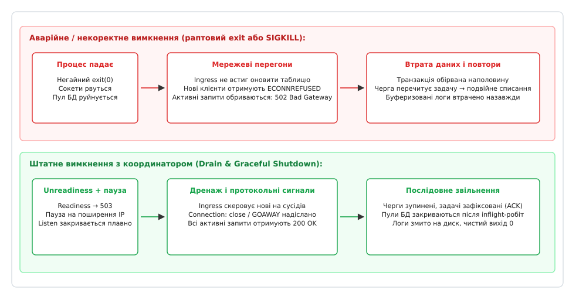
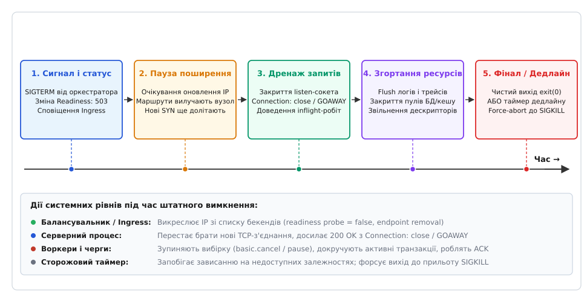

# Штатне вимкнення і drain

<preknowlist>
- [Асинхронно-сигнальна безпека](root:sys-unix/async-signal-safety) — чому всередині обробника сигналу не можна звільняти пам'ять, брати м'ютекси чи писати в логи.
- [Дванадцять факторів](root:sf-apps/twelve-factor) — одноразовість процесів (disposability), швидкий запуск і безпечна зупинка без втрати стану.
- [Перевірки живості й готовності](root:sf-distributed/health-checks) — як балансувальник дізнається, що вузол вилучається з пулу обробки.
- [Маски сигналів і signalfd](root:sys-unix/signal-mask-signalfd) — перетворення асинхронного сигналу ядра на подію дескриптора в неблокуючому циклі.
</preknowlist>

Коли на кластері з півсотні інстансів веб-сервісу запускається звичайне планове оновлення, оркестратор починає по черзі перезапускати вузли. Якщо новоприбулий процес на вимогу зупинитися миттєво викликає `exit(0)` або операційна система надсилає йому нищівний `SIGKILL`, сотні активних HTTP-запитів клієнтів обриваються посеред передачі байтів. Балансувальник навантаження ще протягом кількох секунд продовжує надсилати нові пакети на вже мертвий сокет, через що користувачі масово стикаються з помилками `502 Bad Gateway` та `Connection Refused`. Водночас фонові обробники задач, убиті посеред запису в базу даних, залишають незавершені транзакції, черги повідомлень повторно відправляють ті самі повідомлення іншим воркерам, провокуючи подвійні списання коштів, а буферизовані журнали діагностики зникають з оперативної пам'яті без сліду.

Ця проблема виникає тому, що будь-який довгоживучий серверний процес — це не ізольована математична функція, а вузол складної мережі залежностей: активні TCP-сокети клієнтів, пули відкритих підключень до сховищ, орендовані повідомлення з брокерів черг та кільцеві буфери телеметрії. Раптова зупинка ламає кожен із цих зв'язків у довільний момент часу.

Єдиним надійним вирішенням є **штатне вимкнення (англ. *graceful shutdown*)** у поєднанні з **дренажем з'єднань (англ. *connection draining*)** — узгоджений багатофазний протокол, за якого процес спочатку відмовляється від нових завдань, чекає оновлення мережевих маршрутів, доводить до кінця вже розпочату роботу, змиває накопичені журнали на диск, звільняє ресурси у строгому порядку й лише після цього повертає керування операційній системі.


*Порівняння поведінки системи: каскадні мережеві збої при раптовому падінні проти узгодженого дренажу з'єднань*

## Анатомія раптової смерті: де виникають мережеві перегони

Щоб зрозуміти, чому штатного вимкнення не можна досягти простим викликом деструкторів, простежимо шлях мережевого запиту в розподіленій системі.

У типовій хмарній інфраструктурі між клієнтом і вашим кодом стоїть кілька посередників: крайовий балансувальник (Ingress / Application Load Balancer), внутрішня таблиця маршрутизації ядра (iptables / IPVS / eBPF) та службовий проксі. Коли оркестратор вирішує зупинити контейнер або віртуальну машину (наприклад, під час релізу нової версії або масштабування вниз), відбуваються дві паралельні події:
1. Керуюча площина (Control Plane) надсилає інструкцію вилучити IP-адресу вузла з реєстру активних кінцевих точок (Endpoints / Target Group).
2. Агент вузла (Kubelet, systemd або демон віртуалізації) надсилає процесу сигнал зупинки `SIGTERM`.

Головна пастка полягає в тому, що ці дві події відбуваються **асинхронно**. Поширення інформації про вилучення вузла через розподілений кластер вимагає часу: оновлення etcd, сповіщення контролерів, перерахунок правил маршрутизації на всіх нодах кластера та інваріантний таймаут кешу DNS займають від 2 до 10 секунд.

Якщо застосунок, отримавши `SIGTERM`, негайно закриє свій слухаючий TCP-сокет (`listen_fd`), виникає стан перегонів (англ. *race condition*):
- Балансувальник навантаження ще вважає вузол «живим» і скеровує на нього черговий клієнтський запит.
- Пакет `TCP SYN` прилітає на закритий порт ядра операційної системи.
- Ядро Linux, не знайшовши процесу, прив'язаного до порту, негайно відповідає клієнту пакетом `RST` (скидання з'єднання).
- Клієнт або зворотний проксі отримує помилку `ECONNREFUSED` і фіксує відмову вузла.

Так само небезпечним є миттєвий розрив уже встановлених TCP-з'єднань. Якщо клієнт надіслав великий POST-запит (наприклад, завантаження файлу на 50 МБ) або чекає на завершення складної аналітичної вибірки, закриття сокета посеред операції призводить до відправки клієнту `502 Bad Gateway` або обриву передачі без жодного шансу на повторну спробу (retry), оскільки клієнтський стек не знає, чи встиг сервер виконати побічні ефекти запиту.


*П'ятифазний життєвий цикл штатного вимкнення сервісу: від зняття готовності до спрацьовування дедлайну*

## П'ять фаз штатного вимкнення

Надійне вимкнення процесу — це не миттєвий перемикач, а скінченний автомат із п'ятьма послідовними фазами. Кожна фаза виконує свою частину контракту взаємодії з оточенням.

### Фаза 1: Перехоплення сигналу та зняття готовності (Unreadiness)

Першим кроком є фіксація наміру зупинитися. Отримавши сигнал від операційної системи (`SIGTERM` або `SIGINT`), процес не зупиняє поточну роботу, а переводить свій внутрішній стан у режим `DRAINING`.

Головна дія на цьому етапі — зміна статусу перевірки готовності (англ. *readiness probe*):
- Ендпоінт перевірки здоров'я `/healthz/ready` (або `/ready`), який раніше повертав статус `200 OK`, тепер негайно повертає код `503 Service Unavailable`.
- Якщо застосунок використовує реєстратор сервісів (Consul, Eureka, ZooKeeper), він надсилає команду дереєстрації (Deregister).

Це сигналізує зовнішнім системам моніторингу та балансувальникам про необхідність вилучити екземпляр із пулу активних маршрутів. При цьому ендпоінт живості (`/healthz/liveness`) зобов'язаний і далі повертати `200 OK`, інакше нетерплячий оркестратор вирішить, що процес завис, і завчасно приб'є його через `SIGKILL`.

### Фаза 2: Пауза поширення (Quiescence Window)

Після зняття готовності процес робить паузу (англ. *propagation delay* або *quiescence period*). Протягом цього інтервалу (зазвичай від 5 до 15 секунд) процес **продовжує приймати нові з'єднання та обслуговувати трафік у звичайному режимі**.

Ця пауза необхідна для того, щоб усі сторонні вузли кластера, Ingress-контролери, NGINX-проксі та правила iptables встигли оновити свої таблиці маршрутизації. Якщо клієнтський пакет був відправлений балансувальником за мить до дереєстрації, він прибуде на сервер саме під час цієї паузи й буде успішно прийнятий і оброблений без помилок.

У Kubernetes цю фазу часто реалізують за допомогою хука життєвого циклу контейнера `preStop`:
```yaml
lifecycle:
  preStop:
    exec:
      command: ["/bin/sh", "-c", "sleep 10"]
```
Хук `preStop` блокує надсилання `SIGTERM` контейнеру на вказаний час, даючи мережевій інфраструктурі Kubernetes завершити оновлення об'єктів `EndpointSlice`.

### Фаза 3: Дренаж вхідного трафіку (Inbound Traffic Drain)

Щойно пауза поширення вичерпана й нові клієнти більше не скеровуються на вузол, сервер переходить до активного дренажу:

1. **Закриття слухаючого сокета:** Виклик `close(listen_fd)` видаляє слухаючий порт із мультиплексора ядра (`epoll`/`kqueue`). Сервер більше не приймає нових TCP-з'єднань.
2. **Протокольне сповіщення існуючих клієнтів:**
   - **HTTP/1.1:** Усі відповіді на активні запити надсилаються із заголовком `Connection: close`. Це повідомляє клієнтським бібліотекам та браузерам, що сокет не підтримує повторне використання Keep-Alive, і змушує їх відкривати нові TCP-з'єднання вже на інших інстансах.
   - **HTTP/2 та HTTP/3:** Сервер надсилає клієнтам керуючий фрейм `GOAWAY`. Завдяки двокроковому протоколу дренажу клієнт дізнається точний ідентифікатор останнього обробленого потоку (`Last-Stream-ID`) і може безпечно повторити нерозпочаті запити на сусідніх серверах.
   - **WebSocket / SSE:** Сервер відправляє керуючий фрейм закриття з кодом `1001 Going Away`, даючи змогу фронтенду плавно ініціювати перепідключення без виникнення користувацьких помилок.
3. **Зупинка споживачів черг (Message Consumers):** Воркери фонових задач (RabbitMQ, Kafka, SQS) відкликають підписку (`basic.cancel` в AMQP або зупинка `poll()` у Kafka). Задачі, які вже взяті в пам'ять, доводяться до кінця, а невиконані — повертаються в чергу (`nack` або зняття оренди).
4. **Очікування завершення активних завдань:** Координатор відстежує лічильник активних запитів (`inflight_requests`). Коли лічильник досягає нуля, фаза дренажу вважається успішно завершеною.

Повний перелік параметрів системних менеджерів, бінарні структури фреймів `GOAWAY`, коди закриття сокетів та специфікації завершення наведено в окремій довідці: [Протоколи та системні контракти штатного вимкнення](root:sf-release/graceful-shutdown/api-shutdown-protocol.md).

### Фаза 4: Згортання ресурсів у зворотному порядку (Teardown Order)

Коли останній клієнтський запит завершено й жоден фоновий потік більше не виконує бізнес-логіку, процес починає звільнення внутрішніх ресурсів.

Головне правило цієї фази: **порядок знищення ресурсів має бути строго зворотним до порядку їхньої ініціалізації**.

```
Ініціалізація (зверху вниз):
  Логер/Трейсер → Пул БД → Клієнти кешу/RPC → Фоновий воркер → Мережевий слухач

Згортання (знизу вгору):
  Мережевий слухач → Фоновий воркер → Клієнти кешу/RPC → Пул БД → Логер/Трейсер
```

Якщо порушити цей порядок:
- Закрити пул бази даних до зупинки воркера — воркер отримає помилку звернення до знищеного з'єднання і впаде з аварійним дампом.
- Знищити підсистему логування до закриття пулу бази даних — будь-які помилки скидання транзакцій чи таймаутів сокетів відбудуться в повній тиші, позбавивши інженерів можливості розібрати інцидент.
- Закрити процес без явного скидання буферів OpenTelemetry або Prometheus — останні спани найбільш проблемних запитів (тих, що відбувалися під час релізу) ніколи не потраплять у систему збору телеметрії.

Тому на цій фазі послідовно викликаються операції закриття клієнтів кешу (Redis, Memcached), коректне закриття пулів з'єднань із базою даних (із завершенням незафіксованих транзакцій через `ROLLBACK`), примусове змивання буферів трасування (`TracerProvider::force_flush`) та скидання буферів запису на диск (`fflush`, `fsync`).

Практичну реалізацію такого координатора мовами C і C++ із детальним розбором безпеки потоків наведено у практичній вставці: [Реалізація координатора штатного вимкнення](root:sf-release/graceful-shutdown/proj-graceful-coordinator.md).

### Фаза 5: Фінал і контроль сторожового таймера (Watchdog)

За ідеальних умов процес самостійно завершує всі чотири попередні фази й викликає системний виклик `exit(0)`. Операційна система закриває залишки дескрипторів, вивільняє адресний простір, а супервізор фіксує статус успішного штатного згортання.

Проте в реальних розподілених системах процес ніколи не повинен покладатися на те, що зовнішні ресурси дадуть йому згорнутися ідеально. Завислий сокет стороннього платіжного шлюзу, взаємне блокування у сторонній C-бібліотеці або нескінченний цикл у коді аналітики здатні заблокувати лічильник активних запитів назавжди.

Для запобігання вічному зависанню координатор штатного вимкнення обов'язково запускає **внутрішній сторожовий таймер (Watchdog Deadline)**.

Розрахунок таймауту підпорядковується суворому правилу безпечного запасу:
```
T_watchdog = T_orchestrator - T_grace_buffer
```
Якщо оркестратор (Kubernetes або systemd) виділяє на зупинку контейнера `terminationGracePeriodSeconds = 30s`, внутрішній сторожовий таймер координатора повинен бути встановлений максимум на **20–25 секунд**. 

Якщо за цей час активні запити не завершилися:
1. Координатор фіксує в системному лозі аварійне попередження із переліком завислих потоків та транзакцій.
2. Процес примусово перериває очікування і викликає `_exit(1)` або `std::quick_exit(EXIT_FAILURE)`.

Це гарантує, що процес встигне записати діагностичне повідомлення про причину зависання у вихідний потік до того, як операційна система або Kubelet раптово знищать його невідворотним сигналом `SIGKILL`.

## Мережевий стек ядра: TCP сокети, FIN та RST

Розглянемо детально, що відбувається на рівні мережевого стека ядра Linux під час закриття з'єднань.

### Механіка напівзакритого сокета (Half-Closed TCP Connection)

Коли сервер вирішує завершити роботу зі з'єднанням, у нього є два варіанти системних викликів: `close(fd)` та `shutdown(fd, how)`.

1. **Небезпека прямого виклику `close()`:** Якщо сервер викликає `close(fd)`, а в буфері прийому сокета ядра (`Receive Buffer`) ще залишилися непрочитані байти від клієнта (наприклад, конвеєризований другий HTTP-запит або фінальний пакет ACK), ядро Linux не надсилає клієнту стандартний пакет `FIN`. Замість цього воно надсилає пакет `RST` (Reset). Отримавши `RST`, клієнтський стек TCP негайно знищує сокет, стираючи вже отримані, але ще не вичитані застосунком дані з буфера прийому. Користувач бачить помилку `Connection reset by peer`, навіть якщо сервер повністю надіслав тіло відповіді 200 OK.
2. **Коректне закриття через `shutdown(fd, SHUT_WR)`:** Правильний шлях полягає в переведенні сокета в напівзакритий стан:
   - Сервер викликає `shutdown(fd, SHUT_WR)`, що генерує відправку пакета `FIN` клієнту. Це сигналізує клієнту: «сервер завершив передачу даних у свій бік».
   - Сокет переходить у стан `FIN_WAIT_1`, а після отримання ACK від клієнта — у `FIN_WAIT_2`.
   - Сервер продовжує вичитувати сокет до отримання `0` (EOF), що означає отримання зустрічного `FIN` від клієнта.
   - Лише після цього сервер викликає `close(fd)`, переводячи з'єднання у стан `TIME_WAIT` або повністю знищуючи дескриптор без генерації паразитного `RST`.

### Керування поведінкою через `SO_LINGER`

Опція сокета `SO_LINGER` дозволяє точно налаштувати поведінку виклику `close()`:

:::tabs
```c
struct linger sl = {
    .l_onoff = 1,   /* Увімкнути linger */
    .l_linger = 5   /* Чекати до 5 секунд скидання буферів */
};
setsockopt(fd, SOL_SOCKET, SO_LINGER, &sl, sizeof(sl));
```
```cpp
::linger sl{.l_onoff = 1, .l_linger = 5};
if (::setsockopt(socket_fd, SOL_SOCKET, SO_LINGER, &sl, sizeof(sl)) < 0) {
    throw std::system_error(errno, std::generic_category(), "setsockopt SO_LINGER failed");
}
```
:::

Якщо опцію увімкнено, виклик `close()` блокує потік доти, доки всі накопичені в буфері відправки дані не будуть доставлені та підтверджені клієнтом, або доки не вичерпається встановлений ліміт секунд.
 Якщо ж встановити `.l_onoff = 1, .l_linger = 0`, ядро при виклику `close()` миттєво відправить пакет `RST`, примусово скидаючи з'єднання. Останній варіант категорично заборонений під час штатного вимкнення.

## Дренаж у чергах повідомлень та потокових платформах

Для сервісів, що працюють у режимі асинхронних споживачів (Event-Driven Workers), процес штатної зупинки має специфічні виклики, пов'язані з гарантіями доставки та перебалансуванням кластера.

### Apache Kafka: Перебалансування проти тайм-ауту опитування

У клієнті Apache Kafka життєвий цикл споживача регулюється двома незалежними таймерами:
- `session.timeout.ms`: час, за який брокер вважає споживача мертвим, якщо той не надсилає фонові серцебиття (heartbeats).
- `max.poll.interval.ms`: максимальний час між викликами методу `poll()`. Якщо обробка одного батчу повідомлень перевищує цей ліміт, координатор групи вважає, що воркер завис, і примусово вилучає його з групи споживачів, ініціюючи шторм перебалансування (Rebalance Storm).

Під час штатного вимкнення воркер Kafka повинен діяти за наступним алгоритмом:
1. Виставити атомарний прапорець зупинки циклу вибірки: нові виклики `poll()` припиняються.
2. Дообробити поточний батч повідомлень до кінця.
3. Викликати синхронну фіксацію зміщень `commitSync()` для зафіксованих записів.
4. Явно викликати метод `consumer.close()`. Цей виклик надсилає координатору брокера спеціальний мережевий запит `LeaveGroupRequest`. Отримавши цей запит, брокер негайно перерозподіляє партиції між рештою живих воркерів без очікування вичерпання 45-секундного таймауту `session.timeout.ms`.

### RabbitMQ: Протокол відкликання споживача та оренда задач

У протоколі AMQP 0-9-1 споживач отримує повідомлення від брокера через push-модель на основі параметра `prefetch_count` (кількість повідомлень, попередньо завантажених у локальний буфер процесу).

Якщо воркер отримав `SIGTERM`:
1. Він негайно надсилає брокеру команду `basic.cancel(consumer_tag)`. Брокер позначає споживача як неактивного й перестає відправляти нові повідомлення з черги.
2. Воркер аналізує локальний буфер попередньої вибірки:
   - Повідомлення, які вже перебувають у стані активної обробки й можуть бути завершені в межах дедлайну, доводяться до кінця, після чого надсилається підтвердження `basic.ack(delivery_tag)`.
   - Повідомлення, які ще не почали оброблятися, негайно відхиляються за допомогою команди `basic.nack(delivery_tag, multiple=true, requeue=true)`. Брокер повертає їх у чергу, і сусідні сервери підхоплюють їх за лічені мілісекунди.
3. Лише після отримання підтверджень на всі `ack`/`nack` воркер закриває канал `channel.close()` та TCP-з'єднання `connection.close()`.

## Пули підключень до баз даних: транзакційний дренаж

Окремою критичною ланкою під час згортання сервісу є пул з'єднань із реляційною базою даних (наприклад, HikariCP у Java, pgx у Go або node-postgres у Node.js).

Коли застосунок отримує сигнал зупинки, пул з'єднань може містити підключення у трьох різних станах:
1. **Вільні з'єднання (Idle Connections):** З'єднання, які перебувають у стані очікування в пулі. Під час ініціації дренажу координатор негайно закриває всі вільні з'єднання, надсилаючи відповідні протокольні пакети завершення сесії до СУБД. Це звільняє серверні ресурси бази даних.
2. **Активні транзакції (Active Inflight Queries):** З'єднання, які утримуються робочими потоками для виконання SQL-запитів. Координатор блокує видачу нових з'єднань із пулу (заборона нових `getConnection()`) та очікує повернення зайнятих з'єднань назад у пул до закінчення дедлайну.
3. **Завислі або перервані транзакції:** Якщо робочий потік не встигає завершити транзакцію до спрацьовування таймера безпеки, пул зобов'язаний надіслати команду `ROLLBACK` перед закриттям сокета або примусово розірвати TCP-з'єднання. Розірваний сокет змушує СУБД (PostgreSQL / MySQL) автоматично відкотити незафіксовані зміни й звільнити всі рядкові блокування, усуваючи загрозу блокування таблиць для інших вузлів кластера.

## Системний рівень: сигнали, безпека та дескриптори

Реалізація штатного вимкнення вимагає глибокого розуміння того, як операційна система Linux доставляє сповіщення про необхідність зупинки.

### Чому обробник сигналу не може виконувати дренаж

Коли ядро надсилає процесу сигнал `SIGTERM`, воно перериває виконання поточного потоку в довільній точці коду. Керування негайно передається у функцію-обробник, зареєстровану через системний виклик `sigaction`.

У цей момент виникає фундаментальна небезпека: потік міг бути перерваний рівно посеред виконання функції виділення пам'яті `malloc()`, усередині форматування рядка `printf()` або під час утримання глобального блокування завантажувача динамічних бібліотек. Якщо обробник сигналу спробує викликати логування, створити об'єкт через `new` або захопити м'ютекс `pthread_mutex_lock`, він спробує вдруге увійти в ту саму нереентрабельну функцію і спричинить миттєве мертве блокування (deadlock).

Стандарт POSIX суворо обмежує набір функцій, дозволених усередині асинхронного обробника (властивість [асинхронно-сигнальної безпеки](root:sys-unix/async-signal-safety)). Жодна мережева функція, жодна операція зі стандартними потоками виводу й жоден алокатор пам'яті до цього списку не входять.

### Архітектурні мости: як перетворити сигнал на подію

Щоб виконати повноцінне штатне вимкнення, сигнал необхідно якомога швидше «вивести» з небезпечного контексту переривання ядра у звичайний контекст виконання потоків простору користувача:

1. **Системний виклик `signalfd` (Linux):** Найбільш чистий та ідіоматичний підхід у сучасних Linux-системах. Програма блокує сигнали `SIGTERM` та `SIGINT` у масці потоків через `pthread_sigmask` і відкриває дескриптор `signalfd`. Ядро більше не викликає асинхронних функцій-переривань; натомість прихід сигналу генерує стандартну подію готовності дескриптора до читання в мультиплексорі `epoll`. Головний цикл подій вичитує структуру `signalfd_siginfo` і запускає координатор вимкнення на звичайному стеку.
2. **Самоканал (Self-Pipe Trick, переносний POSIX):** Класичний патерн для BSD та UNIX-систем без підтримки `signalfd`. Створюється неблокуючий канал `pipe2`. Обробник сигналу виконує єдину дозволену дію — записує один байт у вихідний кінець каналу через системний виклик `write(pipe_fd[1], "x", 1)`. Читальний кінець `pipe_fd[0]` слухається в циклі `poll()` або `select()`, безпечно пробуджуючи сервер.
3. **Атомарний прапорець (Atomic Flag / Stop Token):** Обробник сигналу лише виставляє значення атомарної змінної `std::atomic<bool>` або викликає `std::stop_source::request_stop()`. Потоки воркерів регулярно перевіряють стан токена на межах ітерацій обробки завдань.

> 🔧 **Навіщо це.** Якщо ви розробляєте сервіс на Go, Java або Node.js, середовище виконання (runtime) уже реалізує цей сигнальний міст під капотом: канали `os.Signal` у Go, хуки `Runtime.getRuntime().addShutdownHook()` у JVM або події `process.on('SIGTERM')` у Node.js автоматично виконуються на звичайних потоках простору користувача. Проте обов'язок не блокувати ці обробники нескінченно й організувати правильний порядок закриття сокетів та пулів БД залишається цілковито на авторові архітектури.

## Двобій концепцій: Crash-Only проти Graceful Shutdown

У теорії надійності систем існує знаменита парадигма: **Crash-Only Software** (концепція аварійно-стійкого ПЗ, сформульована Джорджем Кандеа та Армандо Фоксом у 2003 році).

Прихильники Crash-Only стверджують:
> Складна логіка штатного вимкнення — це антипатерн. У реальному світі сервери падають через аварії живлення, паніку ядра, збої пам'яті та примусовий `SIGKILL`. Якщо система розраховує на збереження стану перед виходом, вона неминуче втратить дані під час справжньої аварії. Єдиний надійний спосіб писати системи — робити так, щоб будь-яке вимкнення було аварійним (crash), а запуск завжди виконував повне відновлення за журналом (WAL recovery).

Як ця концепція узгоджується зі штатним вимкненням?

Виявилося, що ці два підходи не суперечать один одному, а вирішують принципово різні завдання на різних системних рівнях:

```
┌───────────────────────────────────────────────┬───────────────────────────────────────────────┐
│           Crash-Only Architecture             │              Graceful Shutdown                │
├───────────────────────────────────────────────┼───────────────────────────────────────────────┤
│ Ціль: Гарантія цілісності даних (Correctness) │ Ціль: Доступність та якість (Availability)    │
│ Рівень: Сховище, транзакції, журнал WAL       │ Рівень: Мережевий стек, з'єднання, балансир   │
│ Захищає від: Аварій живлення, збоїв ядра      │ Захищає від: Помилок 502/504 під час релізів  │
│ Принцип: Ідемпотентність і миттєвий рестарт   │ Принцип: Ввічливий дренаж клієнтських черг    │
└───────────────────────────────────────────────┴───────────────────────────────────────────────┘
```

**Штатне вимкнення ніколи не повинно бути механізмом забезпечення цілісності даних.** Ваша база даних або файлове сховище зобов'язані витримувати раптове зникнення живлення будь-якої мікросекунди без пошкодження файлів завдяки журналам із випереджальним записом (Write-Ahead Logging).

Штатне вимкнення — це **операційна оптимізація розподіленої мережі**. Під час штатного розгортання оновлень (яке відбувається десятки разів на день) дренаж гарантує, що клієнти не відчують жодного збою, бюджети помилок (SLO) не будуть спалені марними алертами, а кластери не зазнають штормів перепідключень.

Детальний історичний розбір народження концепції Crash-Only, еволюції від сигналів SysV init до Apache HTTPD `graceful restart` та стандарту HTTP/2 наведено в історичному нарисі: [Філософія згортання: від аварійної стійкості до штатного дренажу](root:sf-release/graceful-shutdown/hist-crash-only-and-drain.md).

## Каскадне згортання у мікросервісній архітектурі та Service Mesh

У сучасних системах вимкнення окремого екземпляра сервісу не є ізольованою подією. Якщо Сервіс A під час обробки клієнтського запиту викликає по мережі Сервіс B, який, у свою чергу, звертається до Сервісу C, виникає ланцюжок залежностей:

```
Клієнт ──> [Сервіс A] ──RPC──> [Сервіс B] ──SQL──> [База даних C]
```

Якщо під час оновлення кластера сигнал `SIGTERM` приходить одночасно на всі вузли:
1. **Проблема перехресного закриття:** Якщо Сервіс B завершить роботу й закриє сокети раніше, ніж Сервіс A встигне дочекатися відповіді на свій внутрішній RPC, запит клієнта на Сервісі A завершиться помилкою 500, попри те, що сам Сервіс A намагався виконувати чесний дренаж.
2. **Контекстні таймаути (Context Deadlines):** Будь-який міжсервісний запит зобов'язаний передавати заголовки дедлайну (наприклад, `grpc-timeout` або `Request-Timeout`). Якщо Сервіс A переходить у режим вимкнення із залишком часу дренажу 5 секунд, усі його вихідні RPC повинні автоматично зменшити свій локальний таймаут до максимум 4 секунд, щоб не блокувати фінальну фазу виходу процесу.
3. **Синхронізація із Sidecar-проксі (Envoy / Istio):** У Pod-структурах Kubernetes application-контейнер та Envoy-sidecar запускаються паралельно. Якщо Kubelet надішле `SIGTERM` обом контейнерам одночасно, Envoy може закрити вихідні з'єднання раніше, ніж основний застосунок змиє останні SQL-транзакції. Для вирішення цієї проблеми на рівні Sidecar налаштовують хук `preStop` з викликом ендпоінта `/drain_listeners?graceful`, а зупинка самого проксі відкладається доти, доки основний застосунок не завершить передачу вихідного трафіку.

## Контейнери, Docker та пастка PID 1

Під час розгортання застосунків у контейнерах розробники щодня стикаються з класичною несправністю: команда `docker stop` або оновлення деплойменту в Kubernetes зависає рівно на 30 секунд, після чого контейнер гине від `SIGKILL`.

Причина криється в ізоляції просторів імен процесів (PID Namespaces) у Linux:
1. Процес, який запускається першим усередині контейнера, отримує ідентифікатор `PID 1`.
2. В операційній системі Linux процес з `PID 1` має спеціальний імунітет: ядро блокує доставку будь-яких стандартних сигналів (включно з `SIGTERM`), якщо процес явно не зареєстрував власний обробник сигналу.
3. Якщо у файлі `Dockerfile` команда запуску написана в оболонковій формі:
   ```dockerfile
   # ПОМИЛКА: запуск через sh -c
   ENTRYPOINT ./start-server.sh
   ```
   Процесом з `PID 1` стає командна оболонка `/bin/sh`. Оболонка не пересилає отриманий від Docker сигнал `SIGTERM` вашому дочірньому бінарному файлу. Застосунок навіть не підозрює, що його намагаються зупинити. Через 30 секунд Docker вичерпує ліміт терпіння і знищує весь контейнер сигналом `SIGKILL`.

Правильні способи розв'язання проблеми:
- **Форма масиву (Exec Form):** Завжди використовувати синтаксис `ENTRYPOINT ["./server"]`, щоб ваш бінарний файл сам став `PID 1` і безпосередньо приймав сигнали ядра.
- **Інструкція `exec` у скриптах:** Якщо перед стартом бінарника необхідна підготовка оточення, запускати фінальний процес через заміну образу:
  ```bash
  #!/bin/sh
  export DB_HOST=$(resolve_db)
  exec ./server  # exec замінює sh на server, зберігаючи PID 1
  ```
- **Спеціалізовані ініціалізатори:** Використання мікроініціалізаторів (наприклад, `tini` або `dumb-init`), які перехоплюють сигнали, транслюють їх усій групі процесів і коректно збирають процеси-зомбі через системний виклик `waitpid`.

## Практичний чекліст архітектора

Перед випуском будь-якого сервісу у виробничу експлуатацію перевірте його відповідність правилам надійного згортання:

1. **Сигнали:** Застосунок явно перехоплює сигнали `SIGTERM` та `SIGINT`, не залишаючи їх на стандартну обробку ядра.
2. **Мережевий міст:** Сигнали обробляються поза асинхронним контекстом (через `signalfd`, селектор або runtime-канали).
3. **Дереєстрація:** На першій фазі статус готовності змінюється на `unready` (503), інформуючи Ingress-шлюзи.
4. **Пауза поширення:** Перед закриттям сокета витримується пауза для оновлення маршрутів у кластері (`preStop`).
5. **Протокольний дренаж:** До активних клієнтів надсилаються `Connection: close` (HTTP/1.1), фрейми `GOAWAY` (HTTP/2/3) або коди закриття `1001` (WebSocket).
6. **Черги та воркери:** Споживачі відкликають підписки, доробляють орендовані задачі або повертають їх у чергу через `nack`.
7. **Зворотний порядок ресурсів:** Пули баз даних та сховищ закриваються строго після завершення всіх обробників бізнес-логіки.
8. **Телеметрія:** Викликається явне примусове змивання буферів трасування та логів на диск перед виходом.
9. **Сторожовий таймер:** Внутрішній Watchdog-таймер гарантує аварійний вихід процесу раніше, ніж спливе ліміт зовнішнього оркестратора.
10. **Ідемпотентність і Crash-Safety:** Застосунок гарантує збереження стану навіть у разі, якщо штатне вимкнення буде раптово обірване апаратним збоєм чи панікою ядра.
