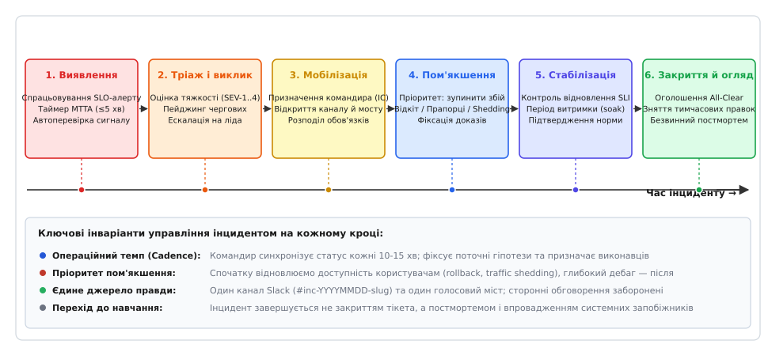
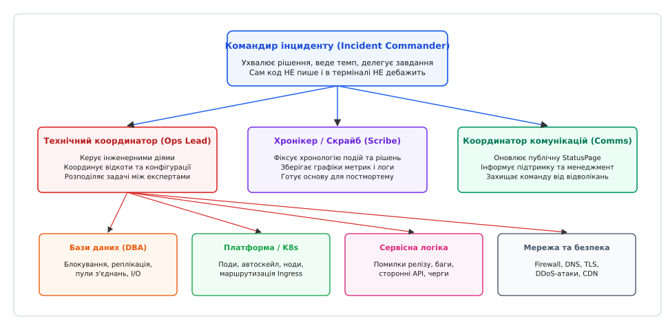
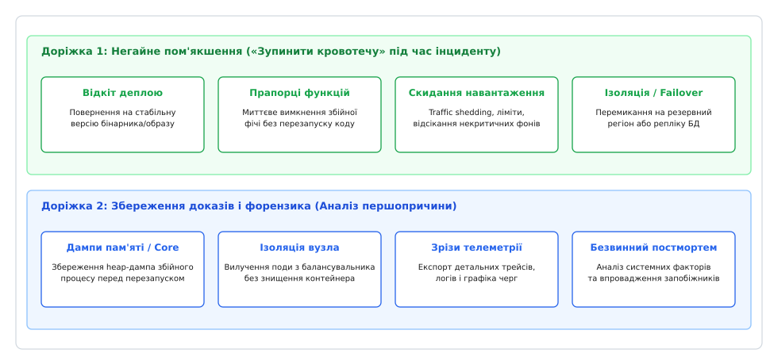
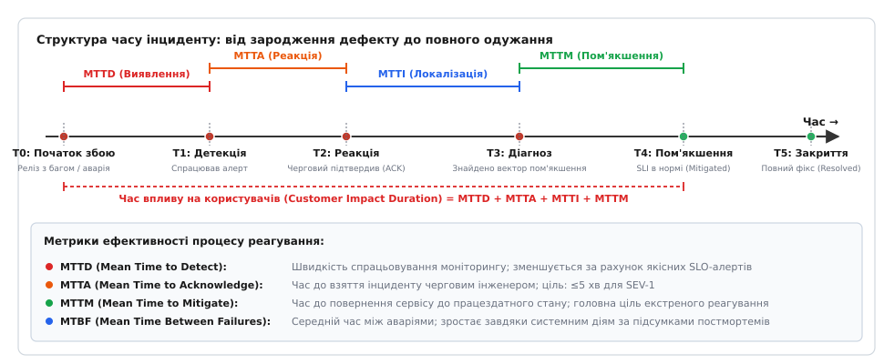

<preknowlist>
* [Алерти та моніторинг](root:sf-release/alerting)
* [SLI, SLO, SLA і бюджет помилок](root:sf-release/slo-sli-sla)
* [Постмортем без винних](root:sf-release/postmortems)
* [Прапорці функцій](root:sf-release/feature-flags)
* [Стратегії деплою: відкіт і канарейки](root:sf-release/deployment-strategies)
* [Структуровані логи](root:sf-release/structured-logging)
* [Розподілений трейсинг](root:sf-release/distributed-tracing)
</preknowlist>

# Реагування на інциденти

О 14:02:15 у понеділок навантаження на платіжний шлюз інтернет-магазину раптово зростає на 40% через запуск масштабної маркетингової акції. За 45 секунд пул з'єднань основного кластера PostgreSQL вичерпується на 100%, запити до сервісу оформлення замовлень починають накопичуватися в чергах проксі-серверів Envoy, а 99-й процентиль затримки (p99 latency) злітає з штатних 120 мілісекунд до 15 секунд. Користувачі масово бачать білі сторінки з кодом `504 Gateway Timeout`. У цей момент на телефони чотирьох інженерів одночасно надходять сповіщення від систем моніторингу. Якщо в команді відсутній суворий протокол координації, настає типова організаційна катастрофа: кожен інженер намагається перевірити власну гіпотезу, у загальному каналі месенджера починається хаотичне обговорення десятків непов'язаних логів, а технічний директор у паніці запитує щохвилини «коли все полагодиться?». Тим часом щохвилини компанія втрачає тисячі доларів виручки, а місячний бюджет помилок випаровується на очах.

**Реагування на інциденти (англ. *Incident Response*)** — це стандартизований інженерно-організаційний протокол мобілізації команди, локалізації технічного збою, швидкого пом'якшення впливу на користувачів та подальшого усунення системних вразливостей. Цей процес перетворює хаос операційної кризи на детерміновану інженерну процедуру з чіткими ролями, жорсткою дисципліною зв'язку та вимірюваними часовими метриками.

## Анатомія операційної кризи: соціотехнічні системи та неминучість збоїв

Сучасні розподілені платформи є класичними **складними соціотехнічними системами** (англ. *complex sociotechnical systems*). Їхня поведінка визначається не лише рядками вихідного коду чи надійністю фізичних накопичувачів, а й динамічною взаємодією сотень мікросервісів, конфігурацій хмарної інфраструктури, поведінкових шаблонів мільйонів користувачів та рішень інженерів, які обслуговують ці системи.

Згідно з теорією нормальних аварій Чарльза Перроу (англ. *Normal Accident Theory*) та дослідженнями надійності складних систем Річарда Кука («How Complex Systems Fail»), у середовищах із високим рівнем зв'язності компонентів (tight coupling) та складною інтерактивною взаємодією (interactive complexity) збої є не аномалією, а природною системною властивістю. Жодна організація не здатна створити абсолютно безпомилковий програмний комплекс. Справжня надійність виникає не з ілюзії запобігання всім можливим збоям, а зі здатності інженерної системи швидко виявляти деградацію, локалізувати радіус ураження та відновлювати обслуговування користувачів.

### Когнітивна ергономіка та психологічні пастки під час аварій

Коли стається аварія, головним ворогом інженерів стає не складність програмного коду, а **когнітивне перевантаження (англ. *cognitive overload*)**. Людина в умовах раптового стресу та високої відповідальності підпадає під вплив добре відомих когнітивних пасток:

1. **Тунельний зір та упередження підтвердження (Confirmation Bias):** Інженер хапається за першу-ліпшу підозрілу деталь (наприклад, випадкове попередження в лозі одного з контейнерів) і витрачає 40 хвилин на спроби довести, що проблема саме в ній, повністю ігноруючи фундаментальні системні метрики процесора, пам'яті чи мережі.
2. **Ефект свідка (англ. *bystander effect*):** Якщо сигнал тривоги надходить до загального каналу з 50 інженерами без персонального призначення, кожен вважає, що проблемою вже займається хтось інший. У результаті інцидент залишається відкритим без жодної реакції протягом десятків хвилин.
3. **Втома від сповіщень (Alert Fatigue):** Якщо система моніторингу щодня генерує сотні некритичних або хибних повідомлень, людський мозок перестає сприймати їх як сигнал небезпеки (десенсибілізація). Коли серед потоку шуму приходить справжній критичний сигнал `SEV-1`, його сприймають як чергову дрібницю.
4. **Страх покарання та психологічна небезпека:** Якщо в компанії практикується культура пошуку винних, черговий інженер боїться застосувати екстрене пом'якшення (наприклад, аварійний відкат релізу чи перезапуск кластера), побоюючись отримати догану за хибне рішення. Це призводить до катастрофічного затягування часу реагування. Навпаки, високий рівень психологічної безпеки спонукає інженерів відкрито і без зволікань повідомляти про виявлені аномалії ще до того, як вони переростуть у загальносистемний збій.

Щоб подолати ці психологічні пастки та захистити інфраструктуру, індустрія розробила спеціалізовані підходи до організації зв'язку, чергувань та координації зусиль. Детальний історичний огляд переходу від ручного пожежогасіння на ранніх комутаторах AT&T та Чорнобильській АЕС до сучасних практик Google SRE та Etsy наведено в окремому нарисі про [еволюцію практик реагування на інциденти](root:sf-release/incident-response/hist-incident-response-evolution.md).

## Життєвий цикл інциденту

Процес управління збоєм розгортається у вигляді строгого скінченного автомата з шістьма основними фазами: від першого спрацьовування правила моніторингу до закриття всіх профілактичних завдань у системі відстеження задач.


*Шість фаз життєвого циклу інциденту: від детекції та мобілізації до пом'якшення, закриття та ретроспективи*

### 1. Виявлення (Detection)
Життєвий цикл починається в момент, коли система автоматизованого моніторингу або користувачі фіксують порушення функціональності. Найефективнішим методом виявлення є алертинг на основі швидкості вигорання бюджету помилок (Error Budget Burn Rate Alerts), який реагує на реальне погіршення користувацького досвіду (висока частка 5xx або зростання затримок), відсікаючи короткочасні одиничні сплески.

### 2. Мобілізація та взяття в роботу (Mobilization & Triage)
Диспетчер чергувань надсилає екстрене сповіщення (пейдж) черговому інженеру першої лінії. Черговий підтверджує отримання виклику (ACK), оцінює масштаб ураження (Blast Radius) та визначає рівень критичності інциденту за стандартною матрицею:
- **`SEV-1` (Критичний):** Повний колапс ключових сервісів, масова втрата функціоналу або доходу (уражено >20% користувачів). Вимагає негайного збору оперативного штабу.
- **`SEV-2` (Тяжкий):** Серйозна деградація другорядних компонентів або висока затримка без доступних обхідних шляхів (уражено 5–20% користувачів).
- **`SEV-3` (Помірний):** Локальні збої з наявними обхідними шляхами; вплив на зовнішніх клієнтів мінімальний.
- **`SEV-4` (Низький):** Косметичні дефекти або внутрішні некритичні попередження моніторингу.

Якщо інцидент кваліфіковано як `SEV-1` або `SEV-2`, черговий негайно відкриває виділений канал зв'язку (Incident War Room) та ініціює збір оперативної групи.

### 3. Діагностика та локалізація (Investigation & Diagnosis)
Оперативна група висуває робочі гіпотези щодо джерела деградації, аналізує структуровані логи, розподілені трейси та недавні зміни в системі (деплої, міграції баз даних, оновлення прапорців функцій). Метою цього етапу є не пошук винних рядків коду, а швидка локалізація вузла відмови (наприклад, виявлення перевантаженого екземпляра Redis чи завислої черги RabbitMQ).

### 4. Пом'якшення впливу (Mitigation)
Застосування екстрених контрзаходів, спрямованих виключно на повернення індикаторів якості обслуговування (SLI) у допустимі межі: відкат релізу, ізоляція несправної ноди балансувальником, увімкнення режиму аварійного скидання навантаження (load shedding) або розширення пулів з'єднань.

### 5. Відновлення та стабілізація (Resolution)
Після стабілізації метрик сервіс переходить у режим витримки (soak period) тривалістю від 15 до 60 хвилин. Інженери переконуються, що відновлена система витримує реальний робочий потік запитів і не зазнає повторної регресії. Командир інциденту офіційно оголошує статус «All-Clear» та закриває аварійний режим.

### 6. Постмортем та навчання (Post-Incident Review)
Проведення структурованої ретроспективи без пошуку винних (blameless postmortem), формування незмінної хронології подій та постановка інженерних завдань щодо архітектурного запобігання подібним збоям у майбутньому.

Точні технічні специфікації схем даних для кожного переходу стану, структури вебхуків та форматів JSON-документів зафіксовано у [специфікації протоколів та схем даних управління інцидентами](root:sf-release/incident-response/api-incident-lifecycle-schema.md).

## Командна структура Incident Command System (ICS)

У повсякденній роботі інженерні організації функціонують у рамках ієрархічної структури: розробники підпорядковуються тімлідам, тімліди — інженерним менеджерам, менеджери — директорам. Проте під час масштабної аварії традиційна корпоративна ієрархія зазнає повного колапсу: менеджери намагаються захистити бізнес-показники, інженери сперечаються про технічні нюанси, а процес прийняття рішень паралізується через відсутність єдиного центру відповідальності.

Для усунення управлінського хаосу інженерні команди використовують адаптовану систему управління інцидентами — **Incident Command System (ICS)**.


*Командна ієрархія ICS: розподіл повноважень між командиром, операційним лідером, координатором комунікацій та хронікером*

### 1. Командир інциденту (Incident Commander, IC)
Командир інциденту є вищою посадовою особою з моменту оголошення надзвичайного стану. Незалежно від своєї посади в мирний час (junior-інженер чи Staff SRE), призначений IC володіє абсолютними повноваженнями щодо керування ліквідацією аварії.

Обов'язки Incident Commander:
- Утримувати цілісну ментальну картину події на макрорівні («вертолітний погляд»);
- Забороняти хаотичні дії та паралельні неконтрольовані зміни в інфраструктурі;
- Приймати однозначні рішення в умовах неповної інформації (наприклад, схвалювати або відхиляти ризикований перезапуск кластера баз даних);
- Регулярно проводити синхронізацію стану (Status Sync) кожні 15–30 хвилин;
- Керувати передачею зміни (Handoff), якщо інцидент триває понад 4 години.

Головне правило командира: **IC ніколи не пише код і не залазить у термінал власноруч під час інциденту**. Щойно командир починає виконувати консольні команди чи читати сирий стек викликів, він миттєво втрачає контроль над загальною координацією операції.

### 2. Операційний лідер (Operations Lead / Tech Lead)
Операційний лідер безпосередньо керує технічною діагностикою та застосуванням виправлень. Він призначає конкретні завдання вузькопрофільним експертам (Subject Matter Experts, SME — адміністраторам баз даних, фахівцям із мереж, бекенд-інженерам), координує виконання скриптів відновлення та доповідає командиру про результати перевірки гіпотез.

### 3. Координатор комунікацій (Communications Lead)
Координатор комунікацій бере на себе захист технічної команди від зовнішнього тиску. Він формує офіційні оновлення для публічної сторінки статусу (StatusPage), готує зведення для служби клієнтської підтримки, інформує вище керівництво компанії та відповідає на запитання менеджменту, унеможливлюючи відволікання інженерів від роботи на голосовому мосту.

### 4. Хронікер (Scribe / Recorder)
Хронікер веде безперервний протокол подій у виділеному документі або каналі чату. Він фіксує точний час кожної значущої події: коли з'явився перший симптом, яку гіпотезу було висунуто, хто саме виконав перезапуск сервісу, як на це відреагували графіки Prometheus. Якісна робота хронікера є запорукою успішного постмортему, оскільки людська пам'ять після 3 годин нічного стресу спотворює послідовність дій до невпізнаваності.

### Протокол взаємодії на голосовому мосту (Bridge Etiquette)
Під час роботи виділеного аудіозв'язку діє строгий радіопротокол:
- Фоновий мікрофон завжди вимкнено (Mute on default);
- Заборонено перебивати командира інциденту;
- Будь-яка репліка починається з самоідентифікації: «Говорить Олексій, DBA...»;
- Дотримується принцип закритих комунікацій (Closed-Loop Communication): якщо командир дає вказівку («Олексію, перевір розмір черги реплікації»), виконавець підтверджує отримання команди («Прийняв, перевіряю чергу реплікації»), а після виконання доповідає про результат («Черга реплікації становить 42 МБ, відхилень немає»).

## Золоте правило реагування: Спершу зупинити кровотечу (Mitigate First, RCA Later)

Найнебезпечніша психологічна пастка для кваліфікованого інженера під час аварії полягає у прагненні негайно знайти глибинну першопричину збою (англ. *Root Cause Analysis, RCA*). Інженер бачить незрозумілий спалах помилок і починає годинами дебажити вихідний код, читати дизасемблер або компілювати профіль пам'яті. Поки інженер шукає красиву наукову причину дефекту, тисячі клієнтів не можуть скористатися сервісом, а бізнес зазнає збитків.

Головне операційне правило управління інцидентами стверджує: **Пріоритетом номер один є швидке пом'якшення впливу на користувачів (Mitigation), а не розслідування першопричини.**


*Дві колії реагування: негайне пом'якшення впливу на сервіс проти форензіки та пошуку першопричини*

### Стандартні тактики екстреного пом'якшення

1. **Відкіт змін (Rollback):** Якщо аварія сталася невдовзі після релізу нового бінарного файлу або застосування конфігурації, 90% успішних рішень полягають у негайному відкоті до попередньої стабільної версії без спроб розібратися, який саме коміт зламав систему.
2. **Скидання другорядного навантаження (Load Shedding & Feature Flags):** Аварійне вимкнення «важких», але некритичних функцій продукту за допомогою прапорців функцій (Feature Flags) — наприклад, тимчасове вимкнення розрахунку персональних рекомендацій або модуля складної аналітики заради порятунку базового оформлення замовлень.
3. **Ізоляція та перезапуск (Isolation & Restart):** Виведення збійного інстансу або повної зони доступності з пулу балансування навантаження, перезапуск завислого процесу (з обов'язковим попереднім зняттям діагностичного зліпка пам'яті heap/thread dump для майбутньої форензіки).
4. **Обмеження швидкості та блокування аномалій (Rate Limiting):** Застосування агресивних лімітів на рівні API Gateway для відсікання збійних клієнтів, що зациклилися у безкінечному повторі запитів (Retry Storm).

Для практичного освоєння архітектури автоматизованого рушія ескалацій та таймерів перевірки ознайомтеся з [проектом побудови розподіленого диспетчера інцидентів](root:sf-release/incident-response/proj-incident-orchestrator.md).

## Наскрізний сценарій: розбір аварії SEV-1 від детекції до закриття

Щоб побачити дію протоколу на практиці, розглянемо реальний випадок ліквідації масштабного збою: відмову розподіленого кешу Redis під час пікового навантаження.

### Хронологічний перебіг ліквідації інциденту

```text
[14:00:00] Тригер збою: Маркетингова розсилка генерує 10-кратний сплеск запитів до ендпоінта /api/v1/search.
[14:01:30] Детекція: Пам'ять кластера Redis досягає ліміту maxmemory. Вмикається алгоритм allkeys-lru,
           навантаження на CPU Redis зростає до 100%, затримка операцій GET перевищує 2000 мс.
[14:02:10] Каскадний збій (Cache Stampede): Не отримавши дані з кешу, 60 000 веб-воркерів одночасно
           надсилають «важкі» SQL-запити до основного кластера PostgreSQL. Пул з'єднань вичерпано.
[14:03:00] Алертинг: Prometheus фіксує Burn Rate = 18.0 за вікно 5 хв. Спрацьовує правило SEV-1.
[14:03:15] Пейджинг: Диспетчер здійснює телефонний дзвінок черговому інженеру першої лінії (Олексію).
[14:04:30] ACK (MTTA = 75 сек): Олексій вводить код підтвердження, відкриває канал #inc-20260820-search-down.
[14:06:00] Мобілізація ICS: Олексій бере роль Incident Commander (IC). Призначає Марію на роль Ops Lead,
           Івана — на роль Scribe, Андрія — на роль Communications Lead.
[14:08:00] Комунікація: Андрій оновлює StatusPage: «Фіксуються проблеми з пошуком товарів. Ведеться діагностика».
[14:10:00] Діагностика: Ops Lead Марія доповідає: «База даних перевантажена через відмову Redis. Перезапуск Redis
           не допомагає, процесор одразу забивається під 100%».
[14:12:00] Рішення IC (Mitigate First): IC Олексій приймає рішення: «Не дебажити Redis зараз. Вмикаємо аварійний
           Feature Flag search_degraded_mode=true (повертати статичні топові товари замість повнотекстового пошуку)
           та активуємо stale-while-revalidate на балансувальнику NGINX».
[14:14:30] Застосування пом'якшення: Прапорець активовано. Навантаження на PostgreSQL миттєво падає з 500 до 45 з'єднань.
[14:16:00] Відновлення SLI (MTTM = 12 хв 45 сек): Частка помилок 5xx знизилася до 0.01%, затримка p99 = 85 мс.
[14:17:00] Стабілізація (Soak Period): Сервіс працює в режимі пом'якшення. Інженери спостерігають за телеметрією.
[14:45:00] Закриття (MTTR = 45 хв): Протягом 30 хвилин показники стабільні. Redis переналаштовано та прогріто.
           IC Олексій оголошує All-Clear. Статус на StatusPage переведено в Resolved.
```

Цей приклад демонструє ключову різницю між хаотичним дебагом та структурованим реагуванням: застосування аварійного прапорця функцій повернуло систему до життя за 12 хвилин, тоді як детальний аналіз неефективного ключа кешування було спокійно відкладено на фазу постмортему.

## Кількісні метрики надійності та часові показники

Для об'єктивного вимірювання ефективності інженерного процесу реагування використовується набір стандартизованих часових метрик.


*Хронологічна декомпозиція інциденту: співвідношення MTTD, MTTA, MTTI, MTTM та повного MTTR*

### Ключові метрики ефективності

- **MTTD (Mean Time to Detect):** Середній час від фактичного виникнення збою до спрацьовування алерту моніторингу. Показує якість та чутливість системи спостережуваності (Observability).
- **MTTA (Mean Time to Acknowledge):** Середній час від моменту відправки пейджа до підтвердження отримання черговим інженером. Відображає дисципліну чергувань та надійність каналів оповіщення.
- **MTTM (Mean Time to Mitigate):** Середній час від взяття інциденту до відновлення нормальної якості обслуговування користувачів. Є головною бізнес-метрикою операційної команди.
- **MTTR (Mean Time to Resolve):** Повний середній час до остаточного усунення проблеми та закриття інциденту.

### Зв'язок доступності та часу відновлення

У теорії надійності доступність системи `A` математично виражається через середній час безперебійної роботи (MTBF) та середній час відновлення (MTTR):

```
A = MTBF / (MTBF + MTTR)
```

З формули випливає фундаментальний інженерний закон: підвищення доступності досягається або через збільшення часу між відмовами (що стає експоненційно дорожчим із кожною новою «дев'яткою»), або через скорочення часу відновлення MTTR. Зменшення MTTR удвічі дає такий самий приріст доступності, як і подвоєння надійності всіх окремих компонентів платформи.

Детальні математичні виведення марковських процесів надійності, аналіз логнормального розподілу тривалості аварій та розрахунок швидкості спалювання бюджету помилок викладено у [математичних моделях надійності та метриках інцидентів](root:sf-release/incident-response/math-incident-metrics-reliability.md).

## Взаємодія з конвеєрами розгортання та автоматичні запобіжники

Інцидентний менеджмент не існує ізольовано від процесів розробки та розгортання програмного забезпечення. Понад 70% виробничих аварій безпосередньо провокуються змінами: релізами нових версій, модифікацією конфігураційних файлів або запуском міграцій схем баз даних.

### Заморожування релізів (Deployment Freeze / Blackout)
Під час активної фази інцидентів рівнів `SEV-1` та `SEV-2` у виробничому середовищі автоматично активується режим **Deployment Freeze**:
- Блокуються всі автоматичні пайплайни доставки коду (GitHub Actions, GitLab CI, ArgoCD);
- Злиття (merge) пул-реквестів у головну гілку забороняється захисними правилами репозиторію;
- Виняток становлять лише екстрені хотфікси (Emergency Fixes), які проходять обов'язкове подвійне підтвердження (Dual Approval) з боку Incident Commander та провідного архітектора.

Такий бар'єр захищає систему від накладання нових збоїв поверх існуючої аварії та усуває інформаційний шум під час діагностики.

### Автоматичний відкат канарейкових релізів (Automated Canary Analysis)
Сучасні платформи доставки коду використовують інтеграцію систем моніторингу з контролерами розгортання (Flagger, Argo Rollouts). Під час викачування нової версії на 1% або 5% користувацького трафіку система автоматично порівнює метрики базової версії (Baseline) та канарейки (Canary):
- Якщо частка помилок 5xx на канарейці перевищує поріг або p99 затримки зростає більш ніж на 15%, контролер негайно зупиняє розгортання, повертає 100% трафіку на стабільну версію та генерує сповіщення розробникам.
- Цей механізм повністю усуває людський фактор, локалізуючи збій ще до того, як він встигне перерости у повноцінний інцидент.

## Відмови сторонніх провайдерів та патерни автономності

Часто джерелом катастрофічного збою стає не власний сервіс, а сторонні провайдери інфраструктури (хмарний регіон AWS/GCP, платіжний шлюз Stripe, DNS-провайдер Cloudflare). У таких умовах прямі дії інженерів щодо виправлення коду безсилі.

Стійкість системи у разі відмов зовнішніх постачальників забезпечується архітектурними запобіжниками:
1. **Автоматичні вимикачі (Circuit Breakers):** Якщо зовнішній API повертає таймаути на понад 50% запитів протягом 10 секунд, клієнтська бібліотека «розмикає коло» (Open State) і негайно повертає локальну закешовану відповідь або аварійне повідомлення без надсилання нових запитів у мережу.
2. **Ізоляційні відсіки (Bulkheads):** Пул потоків або з'єднань для інтеграції з кожним зовнішнім провайдером суворо лімітується (наприклад, не більше 20 паралельних з'єднань). Навіть якщо шлюз Stripe повністю зависне, це не призведе до вичерпання загального пулу потоків веб-сервера.
3. **Асинхронні буфери та черги відкладених повідомлень (Dead-Letter Queues):** Якщо сервіс відправки сповіщень чи генерації рахунків недоступний, транзакції зберігаються в персистентній черзі повідомлень для повторної обробки після відновлення зв'язку.

## Операційна гігієна: ChatOps, Runbooks та Game Days

Надійне функціонування команди в умовах аварій не може спиратися на імпровізацію. Воно вимагає розвиненої культури операційної гігієни та підготовки.

### Дисципліна виділених каналів зв'язку (Incident War Rooms)
Кожен критичний інцидент повинен мати власний ізольований простір:
- Виділений текстовий канал у месенджері (наприклад, `#inc-20260820-payment-timeout`);
- Постійно діючий голосовий міст (Incident Video Bridge), до якого підключаються всі активні учасники;
- Заборона сторонніх дискусій: будь-які репліки, не пов'язані з поточною фазою усунення аварії, негайно зупиняються командиром інциденту.

### Стандартизовані інструкції (Runbooks / Playbooks)
Кожне правило моніторингу зобов'язане містити посилання на актуальний плейбук. Якісний плейбук відповідає трьом критеріям:
1. **Копіювальні команди:** Готові до виконання скрипти та запити з конкретними параметрами;
2. **Очікуваний результат:** Чіткий опис того, як має виглядати нормальна відповідь системи;
3. **План відкату:** Інструкція щодо безпечного скасування виконаної операції у разі погіршення ситуації.

### Тренування стійкості: Game Days та Wheel of Misfortune
Неможливо навчитися керувати аваріями, стикаючись із ними лише під час реальних нічних катастроф. Зрілі інженерні команди регулярно проводять практичні симуляції аварій:
- **Game Days:** Контрольоване відключення критичних компонентів (наприклад, аварійне гасіння ноди бази даних у робочий час) для перевірки автоматичного перемикання та готовності чергових;
- **Wheel of Misfortune (Колесо нещасть):** Рольова навчальна гра, де ведучий відтворює реальний історичний інцидент із минулого, а черговий інженер у реальному часі координує команду, озвучує гіпотези та «виконує команди», отримуючи від ведучого нові симптоми й графіки.

### Управління втомою та ротація змін (On-Call Fatigue Management)
Людський мозок після 4 годин безперервної концентрації в умовах стресу втрачає здатність до критичного мислення: зростає ймовірність помилкового введення команд та фатальних описок.
- Якщо ліквідація інциденту `SEV-1` триває понад 4 години, командир інциденту зобов'язаний провести процедуру **Handoff** — передати командування свіжому черговому ліду.
- Передача супроводжується коротким 5-хвилинним брифінгом: що вже перевірено, які гіпотези спростовано, які пом'якшення застосовано і хто залишається активним SME.
- Після важкої нічної зміни черговий інженер отримує обов'язковий відновлювальний відпочинок (Compensatory Rest), звільняючись від поточної спринтової розробки на наступний робочий день.

### Організація стійких чергувань: Follow-the-Sun та баланс праці
У глобальних технологічних організаціях чергування організовуються за моделлю **Follow-the-Sun**:
- Зміна передається між офісами у трьох різних часових поясах (Європа, Північна Америка, Азійсько-Тихоокеанський регіон).
- Інженери чергують виключно у власні денні години, що повністю усуває нічні побудки та хронічне вигорання співробітників.
- Згідно з принципами Google SRE, оперативне навантаження на підтримку сервісів (Toil) не повинно перевищувати 50% робочого часу інженера; решта часу обов'язково спрямовується на системні покращення платформи та розробку засобів автоматизації.

## Рівні зрілості організації реагування на інциденти

Розвиток культури реагування в інженерній організації проходить чотири послідовні рівні зрілості (Incident Management Maturity Levels):

1. **Рівень 1 (Героїчний хаос / Hero Culture):** Відсутні формальні ролі, класифікація критичності та виділені канали. Збої ліквідуються зусиллями окремих «героїв»-старожилів через хаотичні спроби в продакшні. Постмортеми не проводяться, збої регулярно повторюються.
2. **Рівень 2 (Реактивний порядок / Defined Response):** Впроваджено матрицю критичності (`SEV-1`–`SEV-4`), розклад чергувань та інструменти пейджингу. Команда відкриває виділені канали для аварій, проте ролі ICS часто розмиті, а комунікації з клієнтами відбуваються із запізненням.
3. **Рівень 3 (Дисципліноване управління / Managed & Measured):** Повноцінне використання структури ICS (IC, Ops, Comms, Scribe). Автоматизований алертинг на основі бюджетів помилок, регулярні Game Days та обов'язкові безвинні постмортеми з контролем виконання превентивних завдань.
4. **Рівень 4 (Проактивна стійкість / Proactive Resilience):** Автоматичний відкат канарейкових релізів без втручання людини, моделі Follow-the-Sun, безперервне тестування хаос-інжинірингом (Chaos Engineering) у продакшні та автоматичне управління залежностями за допомогою Circuit Breakers.

## Замикання контуру: від реакції до надійності

Інцидент не вважається завершеним у момент, коли сервіс повернувся до зеленого стану на моніторах. Завершальним і найважливішим етапом є проведення **безвинного постмортему (Blameless Postmortem)**.

Головна аксіома інженерної культури надійності: **Люди не ламають системи навмисно**. Якщо інженер припустився помилки в конфігурації чи виконав хибний запит до бази даних, це свідчить про те, що система надала йому таку можливість без попередження, валідації та безпечного захисного бар'єра. Замість покарання людей постмортем фокусується на дослідженні системних факторів, які призвели до аварії, та генерації конкретних превентивних завдань (Action Items).

Лише коли кожна аварія перетворюється на конкретні покращення архітектури, автоматизації та інструментів моніторингу, організація будує по-справжньому стійку інженерну платформу, здатну витримувати будь-які навантаження сучасного цифрового світу.
