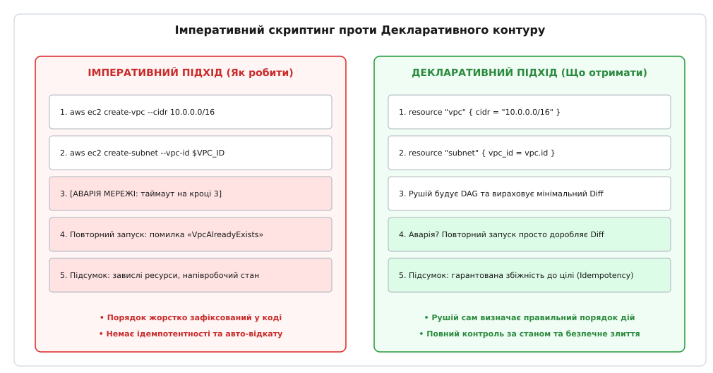
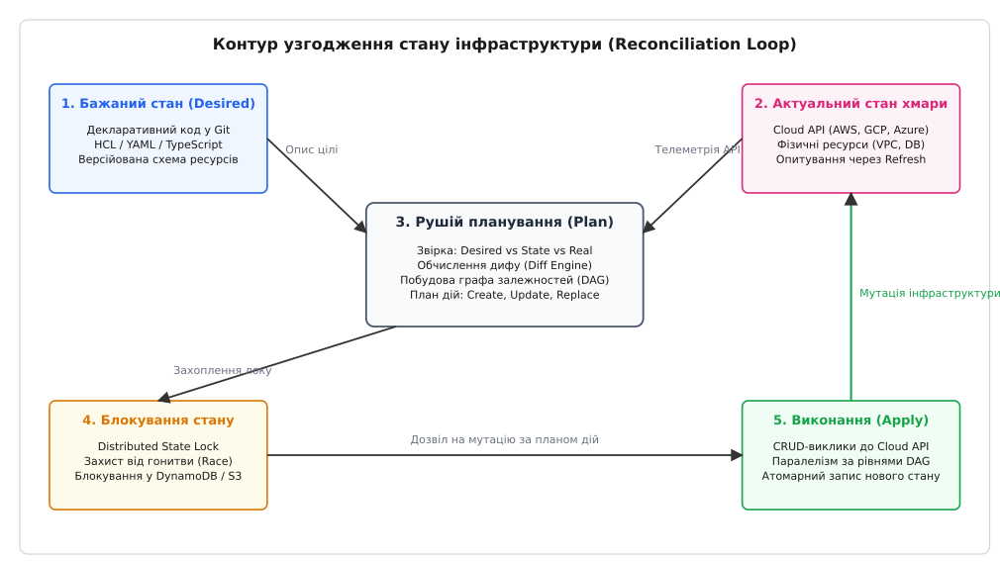
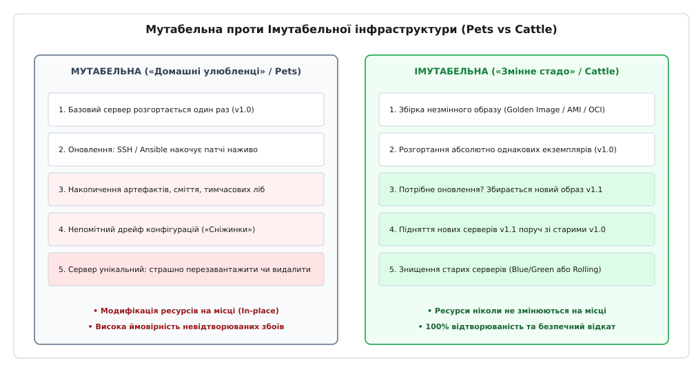
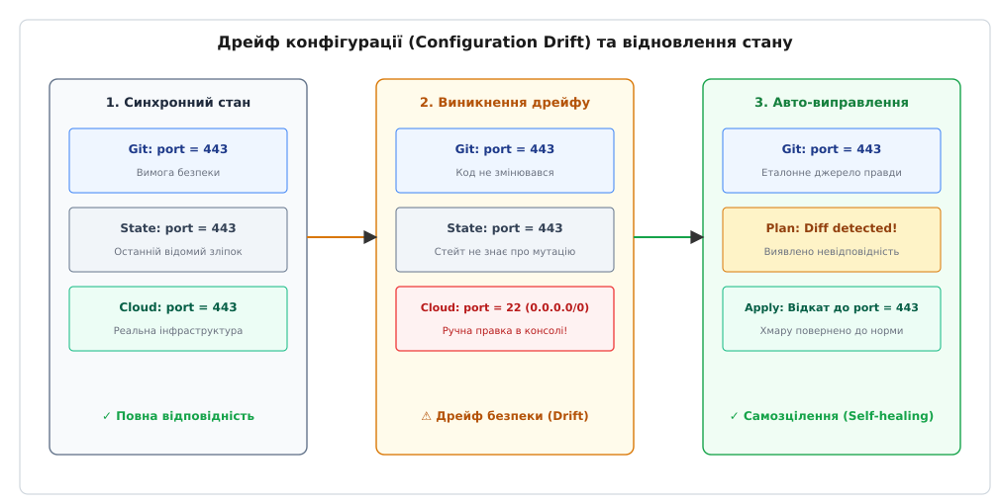

# Інфраструктура як код: декларативне керування ресурсами, стан та збіжність

<preknowlist>
- [Ідемпотентність](topic:sf-distributed/idempotency) — повторне виконання операції без зміни кінцевого результату.
- [CI/CD](topic:sf-release/ci-cd) — автоматизовані конвеєри збірки, тестування та доставки змін.
- [Контейнери](topic:sf-os/containers) — ізоляція просторів імен процесів та незмінні пакунки застосунків.
- [Бекапи і DR](topic:sf-release/disaster-recovery) — аварійне відновлення інфраструктури та розгортання в резервному регіоні.
- [Стратегії деплою](topic:sf-release/deployment-strategies) — поступова заміна вузлів без переривання сервісу (Blue/Green, Rolling).
- [Cloud cost як архітектурний драйвер](topic:sf-apps/cloud-cost-model) — оптимізація витрат на хмарні обчислення та утилізація виділених ресурсів.
</preknowlist>

У ніч перед масштабним розпродажем у міжнародному фінтех-сервісі стається збій: основний регіон хмари втрачає електроживлення в одній із зон доступності, і чергова зміна ініціює аварійне підняття інфраструктури в резервному дата-центрі за затвердженим планом відновлення (Disaster Recovery). Інженери відкривають 60-сторінковий покроковий документ у внутрішній вікі, але вже на 4-му пункті скрипти зупиняються через фатальну помилку: адреси підмереж нової віртуальної мережі конфліктують із корпоративним VPN, 18 ролей безпеки посилаються на давно видалені облікові записи, а база даних не може запуститися через несумісну групу параметрів ядра PostgreSQL. Останні 14 місяців конфігурація робочого середовища змінювалася вручну в веб-консолі хмари («ClickOps»): хтось тимчасово відкрив порт для налагодження, хтось збільшив розмір диска без внесення запису в документацію, а хтось змінив версію сертифіката TLS. У результаті копія середовища перетворилася на міраж: розгортання дубліката замість запланованих 20 хвилин займає 42 години безперервного ручного виправлення помилок, завдаючи бізнесу мільйонних збитків.

Ручне керування ресурсами через графічні панелі чи неструктуровані командні скрипти неминуче призводить до розсинхронізації середовищ і втрати контролю над топологією системи. Інфраструктура як код (Infrastructure as Code, IaC) перетворює опис обчислювальних машин, мереж, балансувальників та баз даних на структурований, типізований і версійований програмний код. Вся топологія системи зберігається в репозиторії, а спеціалізований декларативний рушій автоматично приводить реальний стан хмари у повну відповідність до коду.

> 🔧 **Навіщо це.** Команда, яка налаштовує хмару руками, живе в постійному страху перед аварією або звільненням ключового системного адміністратора, який єдиний пам'ятав, які галочки натиснуто в консолі. Інженер, який володіє принципами IaC, розгортає ідентичні копії середовищ розробки, тестування та виробництва однією командою, тестує інфраструктурні зміни в автоматизованих пул-реквестах, миттєво відкатує збої через контроль версій і гарантує абсолютну безпеку та передбачуваність контуру.

## Від «ClickOps» до декларативної збіжності: подолання кризи ентропії

Ручне адміністрування хмарних ресурсів створює фундаментальну системну проблему — **накопичення конфігураційної ентропії (Configuration Entropy)**. Кожна ручна дія залишає невидимий слід: тимчасово відкрите правило у фаєрволі забувають закрити, скрипт ініціалізації встановлює залежність нестандартної версії, а змінений розмір пулу з'єднань ніде не фіксується. Сервери перетворюються на так звані **сервери-сніжинки (Snowflake Servers)** — унікальні, неповторні екземпляри, точну конфігурацію яких не знає жодна людина в компанії.

Історично першою спробою автоматизації стало написання імперативних шел-скриптів із використанням утиліт командного рядка (наприклад, викликів `aws ec2 create-vpc` або `gcloud compute instances create`). Детальніше про цей шлях і становлення сучасних стандартів розповідає історична вставка [Еволюція автоматизації інфраструктури: від шел-скриптів до GitOps](topic:sf-release/infrastructure-as-code/hist-iac-evolution.md).

```
ІМПЕРАТИВНИЙ ПІДХІД (Скрипт послідовних команд):
Крок 1: Створити мережу VPC ──> Крок 2: Створити підмережу ──> [ПОМИЛКА МЕРЕЖІ]
(Повторний запуск падає з помилкою «VPC already exists», система в напівробочому стані)

ДЕКЛАРАТИВНИЙ ПІДХІД (Бажаний цільовий стан):
Код: [ VPC: 10.0.0.0/16, Subnet: 10.0.1.0/24 ]
Рушій: Опитування хмари ──> Обчислення розбіжності (Diff) ──> Збіжність (Convergence)
(Повторний запуск безпечний: створюються лише відсутні ресурси, результат ідентичний)
```


*Імперативний підхід фіксує послідовність дій і ламається при часткових збоях, тоді як декларативний рушій гарантує ідемпотентну збіжність до бажаного стану.*

### Імперативна парадигма проти декларативної
Принципова різниця між цими підходами полягає у фокусі опису:
- **Імперативний підхід (Як зробити):** інженер пише алгоритм конкретних кроків. Скрипт зобов'язаний самостійно перевіряти, чи існує ресурс, обробляти специфічні коди помилок (`AlreadyExists`, `ResourceNotFound`), вираховувати правильний порядок створення та вручну відкочувати зміни у разі збою на середині шляху.
- **Декларативний підхід (Що отримати):** інженер описує виключно фінальний стан інфраструктури (наприклад: «у системі має існувати база даних PostgreSQL версії 15 з пам'яттю 64 ГБ у підмережі A»). Завдання побудови алгоритму, з'ясування залежностей, аналізу поточного стану та виконання мінімальної кількості мутацій бере на себе спеціалізований рушій.

Декларативна модель спирається на математичний принцип **ідемпотентності (Idempotency)**: скільки б разів не виконувався декларативний маніфест над інфраструктурою, якщо бажаний стан збігається з реальним, рушій виконує рівно нуль змін.

## Контур узгодження стану (Reconciliation Loop)

Сучасні системи інфраструктури як коду (Terraform, OpenTofu, Pulumi, Crossplane, AWS CloudFormation) функціонують як замкнений контур зворотного зв'язку.


*Контур узгодження стану: ядро зчитує бажаний стан із коду, опитує актуальний стан хмари через API, формує план спекулятивних змін і атомарно застосовує мутації під захистом розподіленого блокування.*

Контур складається з чотирьох строго визначених фаз:

1. **Фаза зчитування та актуалізації (Refresh / Read):** рушій опитує хмарні API провайдерів за всіма ресурсами, зареєстрованими в поточному проєкті. Ця фаза виявляє зміни, що відбулися в хмарі поза кодом.
2. **Фаза спекулятивного планування (Plan / Diff):** рушій зіставляє три сутності: код у Git (бажаний стан), файл стану (попередній стан) та відповіді API (актуальний стан). Формується точний граф операцій: які ресурси необхідно створити (`+`), змінити на місці (`~`), перестворити (`-/+`) або видалити (`-`).
3. **Фаза блокування стану (State Lock):** клієнт захоплює розподілений лок у віддаленому сховищі (DynamoDB, Consul, S3 Object Lock), гарантуючи, що жоден інший розробник чи конвеєр розгортання не виконає паралельну мутацію.
4. **Фаза виконання (Apply / Convergence):** рушій відправляє асинхронні запити на створення/зміну до API постачальника ресурсів відповідно до графа залежностей і оновлює файл стану атомарно після кожної успішної операції.

## Файл стану (State File): серце та пам'ять інфраструктури

Найбільш неочевидним для початківців компонентом інструментів класу Terraform є **файл стану (State File)**. Виникає закономірне питання: якщо у нас є код у Git і живі ресурси в хмарі, навіщо зберігати проміжний JSON-файл стану?

Файл стану виконує чотири незамінні функції:

### 1. Відображення логічних імен на фізичні ідентифікатори
Хмарні платформи генерують фізичні ідентифікатори ресурсів динамічно в момент створення. Наприклад, виклик створення віртуальної машини повертає рядок `i-0987654321fedcba0`, а створення підмережі — `subnet-0123456789abcdef0`. У вихідному коді інженер оперує зрозумілими логічними іменами: `aws_instance.web_server` та `aws_subnet.frontend`.

Файл стану зберігає однозначну таблицю трансляції:

```
ЛОГІЧНЕ ІМ'Я В КОДІ (URN)         ──(State Mapping)──>   ФІЗИЧНИЙ ОБ'ЄКТ У ХМАРІ
aws_vpc.main                                              vpc-0a1b2c3d4e5f67890
aws_subnet.public_a                                       subnet-11223344556677
aws_db_instance.postgres_primary                          arn:aws:rds:eu-central-1:123456:db:prod
```

Без файлу стану рушій, зустрівши в коді оголошення `resource "aws_vpc" "main"`, не мав би жодного способу дізнатися, яка саме з 50 віртуальних мереж у цьому хмарному обліковому записі належить цьому конкретному файлу конфігурації.

### 2. Зберігання службових метаданих та неявних залежностей
Хмарні API часто не повертають порядок, у якому ресурси створювалися, або стирають внутрішні залежності після ініціалізації. Файл стану зберігає повну історію зв'язків між ресурсами, що дозволяє рушію безпечно видаляти ресурси у зворотному порядку або виявляти ресурси, видалені з вихідного коду.

### 3. Кешування для прискорення розрахунку плану
У великих інфраструктурах із 3 000+ ресурсів повне опитування всіх ендпоінтів AWS чи GCP займає 15–20 хвилин і впирається в ліміти кількості запитів (Rate Limiting). Файл стану виступає локальним кешем властивостей, дозволяючи виконувати швидкі розрахунки дифу без надмірного навантаження на шлюзи хмари.

### 4. Розподілене блокування та захист від стану гонитви (Race Condition)
Якщо два інженери одночасно виконають команду `apply` з різними гілками коду, без централізованого блокування стану вони відправлять суперечливі команди до хмари. Це призведе до пошкодження інфраструктури та дублювання ресурсів.

Для надійної роботи файл стану виносять у **віддалений бекенд (Remote Backend)** — наприклад, Amazon S3 з увімкненим версіонуванням для зберігання JSON-зліпків та таблицю Amazon DynamoDB для підтримки блокувань (Distributed Locking).

## Граф залежностей (DAG) та алгоритм топологічного виконання

Декларативний рушій інтерпретує конфігурацію не як лінійний список, а як **орієнтований ациклічний граф (Directed Acyclic Graph, DAG)**. Вершинами графа є ресурси, а спрямованими ребрами — залежності між ними.

```
                  ┌────────────────────────┐
                  │      aws_vpc.main      │ (Рівень 0)
                  └───────────┬────────────┘
                              │
             ┌────────────────┴────────────────┐
             ▼                                 ▼
┌────────────────────────┐        ┌────────────────────────┐
│  aws_subnet.database   │        │   aws_subnet.public    │ (Рівень 1)
└────────────┬───────────┘        └────────────┬───────────┘
             │                                 │
             ▼                                 │
┌────────────────────────┐                     │
│      aws_rds.main      │ (Рівень 2)          │
└────────────┬───────────┘                     │
             │                                 │
             └────────────────┬────────────────┘
                              ▼
                  ┌────────────────────────┐
                  │    aws_instance.app    │ (Рівень 3)
                  └────────────────────────┘
```

### Формування ребер залежностей
Залежності в графі виникають двома шляхами:
- **Неявні залежності (Implicit):** виникають природно, коли один ресурс використовує вихідний атрибут іншого. Наприклад, вираз `subnet_id = aws_subnet.public.id` всередині конфігурації віртуальної машини автоматично створює ребро `aws_subnet.public → aws_instance.app`.
- **Явні залежності (Explicit):** задаються примусово через мета-аргумент `depends_on = [aws_iam_role_policy.s3_access]`. Вони необхідні тоді, коли прямої передачі даних між ресурсами немає, але один ресурс не може функціонувати до завершення ініціалізації іншого (наприклад, політика доступу IAM має застосуватися до того, як застосунок спробує звернутися до сховища).

### Топологічне сортування та паралелізм
Для обчислення порядку виконання рушій застосовує **алгоритм Кана** для топологічного сортування. Алгоритм групує ресурси за рівнями незалежності:
1. Ресурси з нульовим вхідним степенем (`in_degree = 0`) створюються на Рівні 0 (`aws_vpc.main`).
2. Після створення VPC розблоковуються ресурси Рівня 1 (`aws_subnet.database` та `aws_subnet.public`). Оскільки вони не залежать один від одного, рушій створює їх **паралельно** в окремих потоках виконання.
3. Коли обидві підмережі готові, створюється база даних `aws_rds.main` (Рівень 2).
4. Останнім створюється сервер `aws_instance.app` (Рівень 3), оскільки він очікує ініціалізації як публічної підмережі, так і кінцевої точки підключення до бази даних.

Практичну програмну реалізацію такого графового рушія з повною підтримкою алгоритму Кана, виявленням циклів та тристороннім плануванням наведено у вставці [Реалізація рушія узгодження стану та графа залежностей](topic:sf-release/infrastructure-as-code/proj-state-reconciliation.md).

## Детальний аналіз життєвого циклу заміни ресурсів (Resource Replacement Mechanics)

Під час внесення змін у конфігурацію рушій стикається з фундаментальним обмеженням хмарних API: деякі атрибути є **імутабельними (незмінними на місці)**. Наприклад, в AWS EC2 неможливо змінити ідентифікатор AMI працюючого інстансу, в Azure не можна перенести віртуальну мережу в інший регіон, а в Google Cloud не можна змінити зону розміщення диска.

У таких випадках дія класифікується як **заміна (Replacement / Destroy-then-Create)**:

```
СТАНДАРТНИЙ ЖИТТЄВИЙ ЦИКЛ (Destroy-then-Create):
[ Працюючий ресурс v1 ] ──(Знищення)──> [ ПРОСТІЙ СЕРВІСУ ] ──(Створення)──> [ Новий ресурс v2 ]

ОПТИМІЗОВАНИЙ ЖИТТЄВИЙ ЦИКЛ (Create-Before-Destroy):
[ Працюючий ресурс v1 ]
         │
         ├──(Створення поруч)──> [ Новий ресурс v2 ] ──(Перемикання трафіку)──> [ Знищення v1 ]
```

### Директива `create_before_destroy`
Стандартний порядок `Destroy-then-Create` гарантує видалення старого об'єкта до створення нового (що критично, якщо вони ділять одне ім'я), але спричиняє вимушений простій (Downtime). 

Директива життєвого циклу `create_before_destroy = true` інвертує порядок:
1. Рушій створює новий ресурс із тимчасовим унікальним іменем поруч зі старим.
2. Оновлюються залежні ресурси (маршрутизація в балансувальнику навантаження або записи в DNS).
3. Після підтвердження готовності старий ресурс безпечно видаляється.

### Захисні директиви життєвого циклу
Для захисту критичної інфраструктури використовуються спеціальні мета-директиви:
- **`prevent_destroy = true`:** апаратний запобіжник у коді. Якщо в результаті рефакторингу або помилки план передбачає видалення ресурсу (наприклад, продакшн-бази даних `aws_db_instance`), рушій негайно перериває команду `plan` з фатальною помилкою, унеможливлюючи випадкове знищення даних.
- **`ignore_changes = [tags, capacity]`:** виключає певні поля з розрахунку дифу. Це необхідно, коли значеннями атрибутів динамічно керують зовнішні системи (наприклад, автоскейлер змінює кількість інстансів або зовнішня система безпеки додає власні теги аудиту).

## Мутабельна проти імутабельної інфраструктури: «Скотарство проти улюбленців» (Cattle vs Pets)

Концептуальний підхід до управління життєвим циклом серверів кардинально змінився з появою хмарних платформ. Цю зміну найкраще описує класична інженерна метафора **«Домашні улюбленці проти Змінного стада» (Pets vs Cattle)**, сформульована Ренді Біасом (Randy Bias).


*Мутабельна інфраструктура модифікує сервери на місці, накопичуючи прихований дрейф і помилки, тоді як імутабельна інфраструктура повністю замінює вузли новими стандартизованими образами.*

### Мутабельна модель («Домашні улюбленці» / Pets)
У мутабельній моделі кожен сервер має унікальне ім'я (наприклад, `db-master-prod`, `hermes`, `zeus`), постійну IP-адресу і живе роками. Коли виходить оновлення ПЗ або патч безпеки, інструменти керування конфігураціями (Ansible, Puppet, Chef) підключаються до працюючого сервера через SSH і модифікують файли на місці (In-place).

Недоліки мутабельності:
- **Невідтворюваність помилок:** якщо оновлення пакета на 12-му сервері перервалося через збій диска, сервер переходить у неконсистентний проміжний стан.
- **Дрейф бібліотек:** залишки старих версій, тимчасові файли та ручні правки роблять поведінку серверів у пулі неоднорідною.
- **Страх перед перезавантаженням:** інженери бояться перезавантажувати або замінювати вузли, оскільки ніхто не гарантує, що машина підніметься у працездатному стані.

### Імутабельна модель («Змінне стадо» / Cattle)
В імутабельній моделі сервери не мають імен — вони мають лише номери або випадкові ідентифікатори у масштабованій групі (`node-worker-8f9d2`). 

Фундаментальне правило імутабельності: **працюючий сервер ніколи не модифікується на місці**.
1. Спеціальний конвеєр збірки (наприклад, інструмент HashiCorp Packer) збирає повністю скомпільований, налаштований і протестований **«золотий образ» (Golden Image / AMI / OCI Image)**, що містить операційну систему, оптимізоване ядро, залежності та бінарний артефакт застосунку.
2. Коли потрібно оновити систему, конвеєр збирає новий образ версії `v1.2`.
3. Рушій IaC створює нові екземпляри серверів із нового образу поруч зі старими.
4. Балансувальник навантаження плавно перемикає клієнтський трафік на нові сервери (Blue/Green або Rolling Deployment).
5. Старі сервери версії `v1.1` безслідно знищуються.

Імутабельність гарантує 100% передбачуваність: тестове та виробниче середовища працюють на абсолютно однакових бінарних образах, що повністю виключає несподіванки під час релізу.

## Дрейф конфігурації (Configuration Drift) та концепція GitOps

Навіть якщо вся інфраструктура спочатку була створена за допомогою коду, з часом виникає небезпечне явище — **дрейф конфігурації (Configuration Drift)**. Це розходження між станом, зафіксованим у репозиторії Git, та реальною конфігурацією об'єктів у хмарі.


*Схема дрейфу та самозцілення: ручна правка порту в консолі виявляється під час автоматичного сканування стану і перезаписується кодом із Git.*

### Причини виникнення дрейфу
- **Невідкладні ручні виправлення (Hotfixes):** інженер під час нічної аварії змінює розмір інстансу або відкриває порт безпеки в веб-консолі, маючи намір «внести це в код завтра», але забуває про це.
- **Зовнішні мутації хмари:** хмарний провайдер автоматично застосовує оновлення сертифікатів або змінює параметри мережевих шлюзів.
- **Часткові падіння скриптів:** переривання процесу розгортання через збої мережі.

### Концепція GitOps як вищий щабель IaC
Для боротьби з дрейфом конфігурації індустрія перейшла до практики **GitOps**:
- Репозиторій Git є **єдиним джерелом істини (Single Source of Truth)**. Прямий доступ розробників до консолі хмари з правами на запис повністю блокується (режим Read-Only для людей).
- Замість зовнішніх CI/CD пайплайнів, які «штовхають» зміни (Push Model) і вимагають збереження небезпечних суперкористувацьких хмарних ключів на зовнішніх серверах збірки, всередині кластера працює спеціальний автономний агент (Pull Model, наприклад ArgoCD, Flux або Terraform Cloud Agent).
- Агент постійно (наприклад, кожні 60 секунд) порівнює стан кластера з Git. Якщо виявляється дрейф, агент або надсилає критичний алерт команді, або **автоматично відновлює конфігурацію (Self-healing)**, перезаписуючи несанкціоновані зміни еталонним кодом.

Для стандартизації взаємодії між рушіями та хмарними платформами розроблено суворий RPC-інтерфейс, детально описаний у довіднику [Специфікація інтерфейсу ресурсів і протоколу взаємодії провайдерів](topic:sf-release/infrastructure-as-code/api-declarative-resource-schema.md).

## Модуляризація та патерни компонування інфраструктурного коду

Зі зростанням проєкту прямий опис сотень ресурсів в одному файлі стає неможливим для підтримки. Інфраструктурний код структурується за допомогою **модулів (Modules)**.

Модуль — це ізольований каталог із конфігураційними файлами, який приймає строго типізовані вхідні змінні (`variables.tf`) та повертає вихідні значення (`outputs.tf`):

```hcl
# Виклик багаторазового модуля віртуальної мережі
module "vpc" {
  source             = "git::https://github.com/org/terraform-aws-vpc.git?ref=v2.4.0"
  cidr_block         = "10.0.0.0/16"
  availability_zones = ["eu-central-1a", "eu-central-1b", "eu-central-1c"]
  enable_nat_gateway = true
  environment        = var.environment
}

# Використання вихідних даних модуля у створенні кластера
module "eks_cluster" {
  source     = "git::https://github.com/org/terraform-aws-eks.git?ref=v1.8.1"
  vpc_id     = module.vpc.vpc_id
  subnet_ids = module.vpc.private_subnet_ids
}
```

### Патерн «Композиційні тонкі модулі» проти «Монолітних модулів»
Типова антипатернова помилка — створення всемогутнього модуля («God Module»), який містить 60 прапорців увімкнення (`enable_rds`, `enable_redis`, `enable_waf`). Такий модуль важко тестувати, він має величезний граф залежностей і створює надмірне зчеплення коду.

Рекомендований підхід — **композиційні тонкі модулі (Thin Composable Modules)**: кожен модуль відповідає за одну логічну підсистему (тільки мережа, тільки сховище, тільки балансувальник), а їхнє об'єднання здійснюється на рівні кореневої конфігурації конкретного середовища.

## Безпека та робота з конфіденційними даними (Secrets Management)

Файл стану за своєю природою містить повний знімок інфраструктури, включаючи відкриті паролі до баз даних, приватні ключі сертифікатів TLS та токени інтеграцій. Витік файлу стану рівнозначний повній компрометації всієї безпеки системи.

### Захист стану та динамічні секрети
1. **Заборона хардкоду секретів у Git:** паролі та ключі ніколи не записуються у вихідні `.tf` чи `.yaml` файли.
2. **Інтеграція зі сховищами секретів (HashiCorp Vault, AWS Secrets Manager):** рушій під час виконання звертається до захищеного сховища і генерує короткоживучі динамічні облікові дані (Dynamic Credentials), які автоматично відкликаються після завершення деплою.
3. **Конвертне шифрування стану (Envelope Encryption):** файл стану шифрується на стороні клієнта за допомогою ключів апаратного модуля безпеки (AWS KMS / GCP Cloud KMS) з обов'язковим аудитом усіх операцій розшифрування через CloudTrail.
4. **Суворе розмежування прав доступу (RBAC):** доступ до читання бакета з файлом стану надається виключно сервісним акаунтам автоматизованого контуру розгортання. Розробники не мають прямого доступу до сирого файлу стану виробничого середовища.

## Архітектурні стратегії ізоляції радіуса ураження (Blast Radius Isolation)

Одна з найнебезпечніших пасток у впровадженні IaC — створення **монолітного файлу стану (Monolithic State File)**, де в одному проєкті описано глобальну корпоративну мережу, 50 баз даних, балансувальники, сертифікати та сотні мікросервісів.

У монолітному стані будь-яка помилка в синтаксисі одного сервісу або випадковий запуск команди `destroy` може повністю знищити всю інфраструктуру компанії. Час розрахунку плану зростає до десятків хвилин, а блокування стану паралізує одночасну роботу різних команд розробки.

### Ізоляція за рівнями та середовищами
Зріла архітектура вимагає сегментації інфраструктурного коду на незалежні шари з мінімальним радіусом ураження (Blast Radius):

```
┌────────────────────────────────────────────────────────┐
│ 1. БАЗОВА МЕРЕЖА (Network Layer)                       │
│    VPC, підмережі, шлюзи NAT, VPN (змінюється раз на рік)│
└──────────────────────────┬─────────────────────────────┘
                           │ Експорт: vpc_id, subnet_ids
┌──────────────────────────▼─────────────────────────────┐
│ 2. РІВЕНЬ СХОВИЩ ТА ДАНИХ (Data Layer)                 │
│    RDS PostgreSQL, Redis, S3 (змінюється раз на місяць) │
└──────────────────────────┬─────────────────────────────┘
                           │ Експорт: db_endpoints, bucket_arns
┌──────────────────────────▼─────────────────────────────┐
│ 3. РІВЕНЬ ЗАСТОСУНКІВ ТА ОБЧИСЛЕНЬ (App Layer)         │
│    Kubernetes Pods, ECS, ASG (змінюється 50 разів на день)│
└────────────────────────────────────────────────────────┘
```

Правила ізоляції:
1. **Окремий файл стану для кожного шару:** падіння або блокування шару застосунків не має жодного впливу на шар баз даних чи базову мережу.
2. **Передача даних через джерела даних (Remote State Data Sources):** шар застосунків зчитує ідентифікатори підмереж та адрес баз даних у режимі «лише для читання» (`data "terraform_remote_state"` або через записи в AWS SSM Parameter Store / Consul Key-Value).
3. **Фізичне розділення середовищ:** конфігурації для `production`, `staging` та `development` зберігаються в окремих каталогах із власними віддаленими бакетами S3 та різними обліковими записами хмари (Multi-account Architecture). Помилка розробника в середовищі `dev` фізично не здатна торкнутися виробничої бази даних.

## Рефакторинг інфраструктури без простою та блок `moved`

У класичній розробці ПЗ рефакторинг коду (перейменування змінної, розбиття функції на модулі) є безпечною внутрішньою операцією. В інфраструктурі як коді будь-яка зміна логічного імені ресурсу (наприклад, перейменування `aws_instance.web` на `aws_instance.frontend` або перенесення ресурсу всередину новоствореного модуля `module.web_cluster.aws_instance.server`) змінює його ідентифікатор URN.

Без спеціальних інструментів рушій сприймає це як видалення старого ресурсу `aws_instance.web` та створення з нуля нового ресурсу `aws_instance.frontend`. Якщо це база даних або сервер додатку з локальним кешем, такий наївний рефакторинг призводить до катастрофічного видалення виробничих даних і тривалого простою сервісу.

Для розв'язання цієї проблеми сучасні рушії надають механізм **декларативного переміщення стану (блок `moved`)**:

```hcl
# Декларативне повідомлення рушію про зміну адреси ресурсу в коді
moved {
  from = aws_instance.web
  to   = module.web_tier.aws_instance.server
}
```

Коли рушій виконує фазу планування:
1. Він виявляє блок `moved` і замість генерації дій `DESTROY` та `CREATE` просто перезаписує логічний ключ у файлі стану (`state mutation`).
2. Фізичний об'єкт у хмарі (наприклад, віртуальна машина з ID `i-0987654321`) залишається абсолютно недоторканим.
3. План показує операцію `0 to add, 0 to change, 0 to destroy` з позначкою про безпечне оновлення метаданих у стані.

## Економічний контроль перед деплоєм (FinOps & Cost Estimation)

Інфраструктура як код робить створення дорогих обчислювальних ресурсів настільки простим, що один рядок коду (наприклад, зміна типу інстансу з `t3.medium` на `r6g.16xlarge` або випадкове створення бази даних із надлишковими виділеними IOPS) може збільшити щомісячний рахунок компанії на десятки тисяч доларів.

Зрілі команди впроваджують **фінансовий аналіз у контур планування (Policy-as-Cost / Infracost)**:
1. Під час створення Pull Request у репозиторії інфраструктури спеціальний аналізатор розбирає згенерований JSON-план змін.
2. Рушій зіставляє додані та змінені ресурси з публічними тарифами хмарних провайдерів (AWS Price List API, GCP Cloud Billing).
3. Бот автоматично публікує коментар у пул-реквесті з точним розрахунком фінансового диференціала:
   ```
   Monthly cost will increase by +$1,420.50 (from $3,100.00 to $4,520.50)
   + aws_db_instance.primary: instance class db.r6g.2xlarge (+$820.00/mo)
   + aws_ebs_volume.data: 2000 GB io2 10000 IOPS (+$600.50/mo)
   ```
4. Якщо прогнозований приріст перевищує встановлений фінансовий ліміт (наприклад, понад 20% від поточного бюджету сервісу), конвеєр блокує кнопку злиття коду до отримання електронного погодження від керівника інженерного підрозділу (FinOps Gate).

## Декларативні оператори Kubernetes проти зовнішнього IaC (Crossplane та CRD)

Окремою гілкою еволюції декларативного керування інфраструктурою є розширення моделі **контролерів Kubernetes** на рівень публічних хмарних ресурсів за допомогою операторів (Operators) та інструментів класу **Crossplane** або **AWS Controllers for Kubernetes (ACK)**.

Замість того, щоб запускати зовнішній бінарний інструмент (Terraform CLI) за розкладом або у відповідь на подію Git, інфраструктура описується як звичайні кастомні ресурси Kubernetes (Custom Resource Definitions, CRD):

```yaml
apiVersion: database.aws.crossplane.io/v1beta1
kind: RDSInstance
metadata:
  name: postgres-production
spec:
  forProvider:
    region: eu-central-1
    dbInstanceClass: db.r6g.xlarge
    allocatedStorage: 200
    engine: postgres
```

### Порівняння підходів:
- **Зовнішній контур (Terraform / Pulumi):** працює дискретно (запуск під час релізу в CI/CD). Не навантажує хмарні API постійними запитами, але виявляє дрейф лише під час явного запуску плану.
- **Внутрішній безперервний контур (Crossplane / Kubernetes Controllers):** контролер працює всередині кластера постійно і виконує узгодження стану кожні кілька секунд у нескінченному циклі.
- **Проблема «курки та яйця» (Bootstrap Chicken-and-Egg):** головний архітектурний виклик внутрішніх операторів полягає в тому, що для створення хмарної бази даних спочатку має існувати сам кластер Kubernetes з мережею та правами доступу. Тому в індустрії утвердився гібридний патерн: базовий рівень (VPC, IAM, сам кластер Kubernetes) створюється зовнішнім класичним IaC-рушієм, а вторинні ресурси застосунків (бази даних, черги, сховища) віддаються під контроль операторів.

## Піраміда тестування інфраструктурного коду (Infrastructure Testing)

Інфраструктурний код вимагає такої самої суворості забезпечення якості, як і прикладне програмне забезпечення. Піраміда тестування IaC складається з трьох рівнів:

1. **Статичний аналіз та валідація політик (Static Linting & Policy as Code):**
   - Утиліти `tflint` та `terraform validate` перевіряють синтаксис та типи даних до запуску.
   - Сканери безпеки (`checkov`, `tfsec`, `trivy`) виявляють відкриті порти безпеки (`0.0.0.0/0`), незашифровані диски EBS або відсутність версіонування на бакетах S3.
   - Двигуни політик безпеки (Open Policy Agent / OPA Rego) блокують мердж пул-реквестів, якщо конфігурація порушує корпоративні стандарти (наприклад, заборона створення публічних баз даних).
2. **Модульне тестування планів (Unit / Contract Testing):**
   - Фреймворки тестування перевіряють згенерований JSON-план на наявність очікуваних ресурсів без звернення до хмари.
3. **Наскрізне інтеграційне тестування (End-to-End Integration Testing):**
   - За допомогою інструментів класу Terratest автоматизований пайплайн розгортає повний ізольований стек у тимчасовому пісочному обліковому записі хмари, надсилає реальні тестові HTTP-запити до створеного сервісу, перевіряє код відповіді `200 OK` і гарантовано знищує (`destroy`) всі тимчасові ресурси після завершення тесту.

Інфраструктура як код переносить інженерну дисципліну розробки програмного забезпечення на рівень фізичних та хмарних обчислювальних ресурсів, перетворюючи експлуатацію систем на надійний, математично вивірений і повністю контрольований процес.
