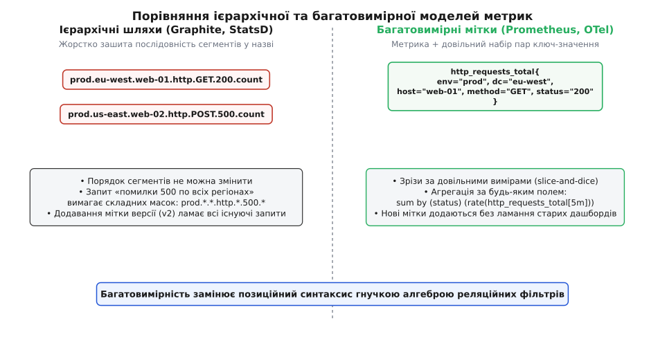
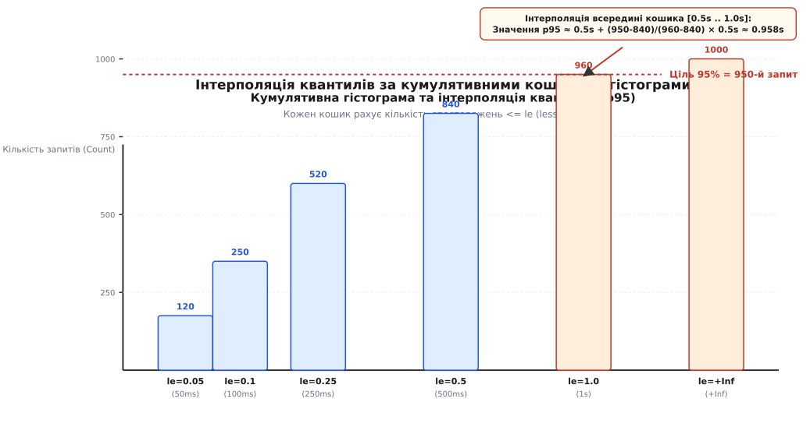
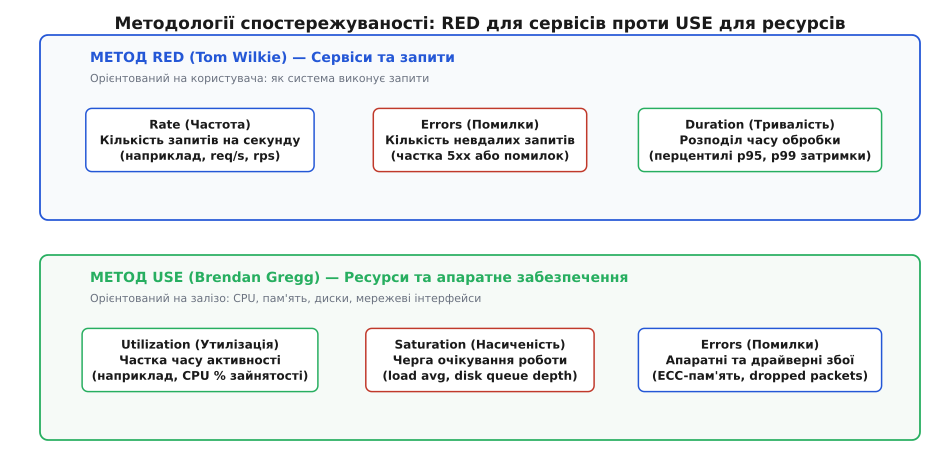
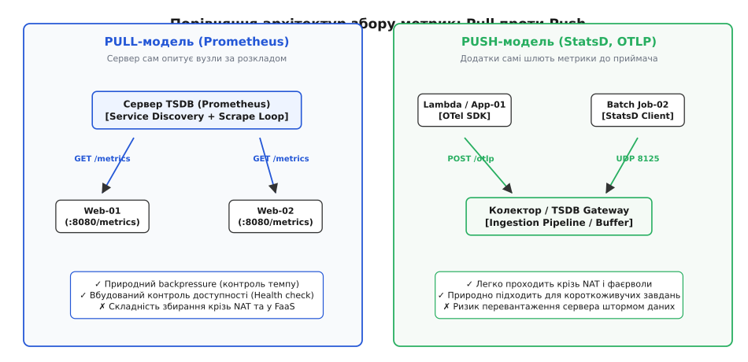

# Метрики та числовий моніторинг розподілених систем

<preknowlist>
- [Асинхронний ввід-вивід та подійні цикли](topic:programming/async-io) — розуміння неблокуючих операцій, мережевих сокетів та обробки потоків подій.
- [Багатопотоковість та синхронізація](topic:programming/concurrency-basics) — атомарні операції, стан перегонів (race condition) та взаємні блокування.
</preknowlist>

О третій годині ночі інтернет-магазин починає втрачати замовлення: платіжний шлюз відповідає з помилками для кожного четвертого покупця, черга обробки повідомлень розростається з типових 500 до 80 000 елементів, а середній час очікування відповіді на головній сторінці зростає з 80 мілісекунд до 14 секунд. У системному журналі з'являється понад 200 рядків логів на секунду. Інженер, який відкриває термінал під час інциденту, не може читати суцільний потік тексту в реальному часі. Щоб за 30 секунд локалізувати точку відмови серед 40 мікросервісів, потрібні не текстові записи окремих подій, а числовий зріз стану системи: швидкість надходження запитів, частка помилок і функція розподілу затримок.

Числове спостереження перетворює роботу програмного комплексу на набір вимірюваних параметрів, що фіксуються в часі через рівні проміжки. Якщо логування зберігає дискретні повідомлення («користувач 482 оформив замовлення»), а трейсинг простежує шлях одного запиту крізь ланцюг сервісів, то метрики фіксують узагальнену поведінку середовища за допомогою чисел, лічильників та розподілів.


*Ієрархічні точкові шляхи (Graphite/StatsD) проти багатовимірних міток (Prometheus/OpenMetrics)*

Історичний шлях від простих SNMP-покажчиків мережевих маршрутизаторів до сучасних екосистем телеметрії детально розглянуто у вставці [Еволюція систем моніторингу: від SNMP до OpenTelemetry](topic:sf-release/metrics-monitoring/hist-monitoring-evolution.md).

## Модель даних часових рядів

Будь-яка метрична система оперує базовою сутністю — **часовим рядом (Time Series)**. Часовий ряд — це послідовність пар «мітка часу — числове значення», що належить унікальному ідентифікатору:

`TimeSeries = {(t₀, v₀), (t₁, v₁), (t₂, v₂), ..., (tₙ, vₙ)}`

де `t[i]` — монотонно зростаючий час вимірювання (Unix Epoch timestamp), а `v[i] ∈ ℝ` — 64-бітне число з плаваючою комою (IEEE 754 float64).

У ранніх системах моніторингу (Graphite, StatsD) ідентифікатор метрики складався з ієрархічного рядка з крапками, наприклад:

```text
servers.us-east-1.app-01.http.GET.api-v1-users.200.latency
```

Такий підхід стає крихким при появі динамічної інфраструктури: якщо додати новий проміжний рівень (наприклад, назву середовища або версію контейнера), позиції сегментів у рядку зміщуються, а всі наявні графіки та правила сповіщень (Alerts) ламаються.

Сучасні системи застосовують **багатовимірну модель даних (Multidimensional Data Model)** на базі міток (Labels / Dimensions). Унікальний ідентифікатор часового ряду визначається парою:

`Series_ID = <Metric_Name, {(k₁ = v₁), (k₂ = v₂), ..., (kₘ = vₘ)}>`

Наприклад, показник затримки запиту кодується так:

```text
http_request_duration_seconds{env="prod", region="us-east-1", handler="/api/v1/users", method="GET", status="200"}
```

Будь-яка зміна хоча б одного значення мітки створює новий незалежний часовий ряд. Це дозволяє виконувати гнучку агрегацію у мовах запитів (наприклад, у PromQL): оператор `sum by (status)` згортає сотні рядів окремих серверів і регіонів у єдиний графік помилок для всієї системи.

## Чотири архетипи числових метрик

Промислові стандарти (Prometheus, OpenMetrics, OpenTelemetry) виділяють чотири фундаментальні типи метрик, кожен із яких призначений для конкретного математичного сценарію.

### 1. Лічильник (Counter)

Лічильник представляє монотонно зростаючу величину, значення якої може лише збільшуватися або скидатися до нуля під час перезапуску процесу.

```text
▲ Значення лічильника
│                 /
│          /|    /
│         / |   /   (скидання при рестарті)
│   /    /  |  /
│  /    /   | /
└─/────/────┴/────────► Час
```

Лічильники застосовують для накопичувальних величин: кількості оброблених запитів `http_requests_total`, обсягу надісланих байтів `network_transmit_bytes_total` або сумарної кількості помилок `task_failures_total`.

**Критичне правило лічильників:** Ніколи не використовуйте абсолютне значення лічильника на графіках. Число «4 829 104 запити» саме по собі нічого не повідомляє про поточний стан системи. До лічильників завжди застосовують функцію похідної за часом — швидкість зростання (Rate):

`rate(C, Δt) = (C(t) - C(t - Δt)) / Δt`

Система збору автоматично компенсує скидання лічильника при перезапуску процесу: якщо `C(t) < C(t - Δt)`, рушій додає значення попереднього періоду, уникаючи від'ємних стрибків швидкості.

### 2. Покажчик (Gauge)

Покажчик представляє миттєвий стан величини, яка може довільно зростати, спадати або залишатися незмінною.

Покажчики фіксують поточний рівень ресурсів: відсоток використання оперативної пам'яті `node_memory_used_ratio`, кількість активних TCP-з'єднань `http_active_connections`, розмір черги завдань `worker_queue_length` або температуру процесора `cpu_temperature_celsius`.

На відміну від лічильників, до покажчиків застосовують операції безпосереднього усереднення (`avg_over_time`), пошуку екстремумів (`max_over_time`) та лінійної екстраполяції (`predict_linear` для прогнозування вичерпання дискового простору за наступні 4 години).

### 3. Кумулятивна гістограма (Histogram)

Гістограма вимірює розподіл значень неперервної величини (наприклад, тривалості обробки запитів або розміру тіла відповідей) за попередньо сконфігурованими інтервалами — **кошиками (buckets)**.


*Кумулятивна гістограма: кошики le, розрахунок p95 та функція histogram_quantile*

Гістограма клієнтської бібліотеки експортує три типи зв'язаних часових рядів:
1. `metric_name_bucket{le="X"}` — кумулятивний лічильник кількості подій, чиє значення було меншим або дорівнювало верхній межі X (Less or Equal). Останнім кошиком обов'язково є `le="+Inf"`.
2. `metric_name_sum` — сума всіх зареєстрованих значень за весь час роботи процесу.
3. `metric_name_count` — загальна кількість спостережень (строго дорівнює значенню кошика `le="+Inf"`).

Головна математична перевага кумулятивних кошиків полягає у їхній **адитивності**: кошики з кількох серверів можна підсумувати за допомогою оператора `sum()`, після чого на сервері TSDB обчислити точний перцентиль затримки для всього кластера.

Математичні властивості квантилів, похибки інтерполяції та алгоритми компактних скетчів детально викладено у вставці [Квантилі, скетчі та математичний апарат метрик](topic:sf-release/metrics-monitoring/math-histograms-and-sketches.md).

### 4. Клієнтський підсумок (Summary)

Підсумок обчислює задані квантилі (p50, p90, p99) безпосередньо всередині додатку на ковзному часовому вікні (типово останні 10 хвилин) за допомогою алгоритмів потокової медіани (наприклад, алгоритмом T-Digest або GK-алгоритмом).

```text
rpc_duration_seconds{quantile="0.5"}  0.012
rpc_duration_seconds{quantile="0.9"}  0.045
rpc_duration_seconds{quantile="0.99"} 0.180
rpc_duration_seconds_sum               154.82
rpc_duration_seconds_count             5000
```

Підсумки забезпечують вищу точність квантилів без необхідності ручного налаштування меж кошиків. Проте вони мають фундаментальне архітектурне обмеження: **квантилі підсумків неможливо агрегувати між інстансами**. Середнє арифметичне від 99-го перцентиля трьох серверів:

`avg(p99_A, p99_B, p99_C) ≠ p99_cluster`

є математично некоректним і приховує локальні катастрофічні затримки. Тому в розподілених системах для SLA/SLO-моніторингу використовують виключно гістограми.

## Внутрішній устрій рушіїв зберігання TSDB

Сучасна спеціалізована база даних часових рядів (Prometheus TSDB, VictoriaMetrics, M3DB) оптимізована під запис мільйонів точок на секунду та миттєве виконання агрегацій. Архітектура сховища складається з чотирьох ключових компонентів:

```text
  Запис точок ──► [ WAL: Write-Ahead Log на диску ]
                         │
                         ▼
                  [ Head Block у RAM (Останні 2 години) ]
                         │
                         ▼ (Компресія кожні 2 години)
                  [ Immutable Blocks на SSD (Чанки + Індекси) ]
```

### 1. Оперативна пам'ять і Write-Ahead Log (WAL)

Нові точки вимірювань записуються в оперативний блок `Head Block`, що утримує в пам'яті дані за останні 2 години. Одночасно кожна операція запису додається до журналу випереджального запису на диску (`wal/000001`), розбитого на сегменти по 128 МБ. У разі аварійного вимкнення живлення сервер відновлює стан `Head Block` шляхом послідовного програвання журналу WAL під час старту.

### 2. Подвійне дельта-стиснення часових міток

Мітки часу вимірювань у періодичному скрейпі надходять із фіксованим інтервалом (наприклад, кожні 15 000 мс). Алгоритм **Gorilla Double-Delta** кодує не самі таймстемпи, а різницю між сусідніми дельтами:

`D = (t[i] - t[i-1]) - (t[i-1] - t[i-2])`

Якщо інтервал збору ідеально рівний (`D = 0`), у вихідний потік записується рівно **1 біт** (`0`). Якщо D відхиляється на кілька мілісекунд, число пакується у змінну кількість бітів із префіксом. Завдяки цьому 64-бітний таймстемп стискається у середньому до **1.37 біта на вибірку**.

### 3. XOR-стиснення дійсних чисел з плаваючою комою

Значення вимірювань суміжних точок зазвичай змінюються незначно. Значення `v[i]` піддається двійковій операції `XOR` із попереднім значенням:

`X = v[i] ⊕ v[i-1]`

Оскільки старші біти порядку (exponent) та мантиси (significand) у близьких чисел збігаються, операція XOR генерує довгі послідовності нулів на початку та в кінці 64-бітного слова. Алгоритм зберігає лише довжину провідних нулів, довжину значущих бітів та власне значущі біти, досягаючи ступеня компресії до **1.5–2 байтів на числове значення**.

### 4. Інвертований індекс на Roaring Bitmaps

Для забезпечення миттєвого пошуку часових рядів за довільним набором міток (`app="checkout", status="500", region="eu-central-1"`) база будує інвертований індекс (Inverted Index). Кожне унікальне значення мітки асоціюється з бітовим масивом ідентифікаторів рядів (Series ID). Застосування стиснених структур даних **Roaring Bitmaps** дозволяє перетинати списки мільйонів часових рядів за допомогою апаратних інструкцій SIMD на процесорі за кілька мікросекунд.

### 5. Багаторівневе ущільнення блоків (Compaction & Tombstones)

Кожні 2 години дані з оперативної пам'яті запечатуються в незмінний блок на диску (Immutable Block), що містить директорію `chunks/`, файл індексу `index` та файл метаданих `meta.json`. Фоновий процес компактизації (Compactor) періодично зливає сусідні 2-годинні блоки у більші 6-годинні, 24-годинні та 72-годинні блоки. Під час злиття індекс дедуплікується, порожні чанки видаляються, а ряди, помічені маркерами видалення (Tombstones), остаточно вичищаються з дискового простору, мінімізуючи фрагментацію накопичувача.

## Ментальні моделі інструментації: USE проти RED

Щоб моніторинг не перетворився на хаотичний набір випадкових графіків, інженерні команди використовують структуровані методики спостереження.


*Фреймворк RED для запито-орієнтованих сервісів проти фреймворку USE для апаратних ресурсів*

### Метод RED (для запито-орієнтованих мікросервісів)

Розроблений Томом Вілкі (Tom Wilkie), метод фокусується на користувацькому досвіді та взаємодії між сервісами:

1. **Rate (Швидкість):** Кількість запитів на секунду, що надходять до сервісу:
   ```promql
   sum(rate(http_requests_total[1m])) by (handler)
   ```
2. **Errors (Помилки):** Кількість невдалих запитів на секунду:
   ```promql
   sum(rate(http_requests_total{status=~"5.."}[1m])) by (handler)
   ```
   *Відсоток помилок:* `Error_Rate = (Errors / Rate) × 100%`.
3. **Duration (Тривалість):** Час обробки запитів, виражений через квантилі гістограм:
   ```promql
   histogram_quantile(0.99, sum(rate(http_request_duration_seconds_bucket[5m])) by (le, handler))
   ```

Якщо для кожного ендпоінта кожного мікросервісу налаштовано ці три показники, інженер отримує повну картину функціонального здоров'я архітектури.

### Метод USE (для ресурсів та інфраструктури)

Створений Бренданом Греггом (Brendan Gregg), метод застосовується до кожного окремого апаратного чи віртуального ресурсу (процесорні ядра, пам'ять, дискові масиви, мережеві інтерфейси, пули з'єднань БД):

1. **Utilization (Утилізація):** Середній час, протягом якого ресурс був зайнятий корисною роботою (наприклад, 85% завантаження CPU або 70% зайнятості пам'яті).
2. **Saturation (Насичення / Черги):** Ступінь перевантаження ресурсу, коли запити не можуть бути виконані негайно і стають у чергу (наприклад, Load Average на ядро, розмір черги дискового вводу-виводу або очікування вільного потоку в пулі).
3. **Errors (Помилки):** Кількість апаратних або системних збоїв (наприклад, биті пакети мережевої карти `rx_errors`, збійні сектори диска, відхилені виклики `malloc`).

### Діагностичний ланцюг розслідування інцидентів

Під час аварії інженер рухається згори донизу:
* **Крок 1 (RED):** Погляд на дашборд шлюзу показує, що сервіс замовлень має сплеск затримок `Duration p99 > 8s` та частку помилок `Errors > 15%`.
* **Крок 2 (USE):** Перехід до компонентів бази даних виявляє, що `Utilization` CPU становить лише 20%, проте `Saturation` пулу з'єднань PostgreSQL досягло 100% (усі 200 підключень вичерпані, нові запити блокуються у черзі).
* **Крок 3 (Локалізація):** Проблема локалізована: відмова спричинена блокуванням транзакцій у базі даних, а не вичерпанням обчислювальної потужності серверів.

### Чотири золоті сигнали (Four Golden Signals)

Книга Google Site Reliability Engineering узагальнює підходи RED та USE у чотири фундаментальні сигнали:
* **Затримка (Latency):** Час обробки запиту. Критично розділяти затримку успішних запитів та затримку запитів із помилками (наприклад, швидка відмова 500 за 2 мс через розрив з'єднання з базою приховає деградацію затримок повільних успішних запитів за 5 с).
* **Трафік (Traffic):** Обсяг попиту на систему (кількість HTTP-запитів, обсяг транзакцій або пропускна здатність мережі).
* **Помилки (Errors):** Частка запитів, що зазнали невдачі: як явних (HTTP 500, gRPC Code 14 Unavailable), так і неявних (HTTP 200 із порожнім тілом або помилковим контентом).
* **Насичення (Saturation):** Заповненість найбільш обмеженого ресурсу сервісу (пам'ять, черги завдань, дескриптори відкритих файлів).

## Мова аналізу PromQL: вектори, узгодження та підзапити

Мова PromQL призначена для роботи з часовими рядами і базується на двох фундаментальних типах даних:

1. **Миттєвий вектор (Instant Vector):** Набір часових рядів, де кожен ряд представлений рівно однією числовою точкою на заданий момент часу:
   ```promql
   http_requests_total{status="200"}
   ```
2. **Діапазонний вектор (Range Vector):** Набір часових рядів, де кожен ряд містить буфер точок за вказаний інтервал часу назад:
   ```promql
   http_requests_total{status="200"}[5m]
   ```

Функції швидкості (`rate`, `irate`, `increase`) приймають діапазонний вектор і повертають миттєвий вектор.

### Операції узгодження векторів (Vector Matching)

Під час виконання арифметичних операцій над двома векторами (наприклад, ділення кількості помилок на загальну кількість запитів) PromQL автоматично зіставляє часові ряди з однаковим набором міток:

```promql
# Один-до-одного (One-to-One matching):
rate(http_requests_total{status="500"}[5m]) / rate(http_requests_total[5m])
```

Якщо множини міток у лівому та правому векторах відрізняються, використовують модифікатори `on(...)` або `ignoring(...)`, а також відношення «багато-до-одного» (`group_left`) або «один-до-багатьох» (`group_right`):

```promql
# Збагачення метрик запитів мітками версії зі службової метрики info:
rate(http_requests_total[5m]) * on (instance) group_left(version, commit) app_build_info
```

### Прогнозування та підзапити (Subqueries)

Для завчасного виявлення вичерпання ресурсів PromQL надає функцію лінійної регресії за методом найменших квадратів `predict_linear()`:

```promql
# Прогноз заповнення диска через 4 години на основі тренду останньої 1 години:
predict_linear(node_filesystem_free_bytes[1h], 4 * 3600) < 0
```

Для аналізу динаміки похідних величин застосовують **підзапити (Subqueries)**, що обчислюють внутрішню функцію зі змінним кроком дискретизації:

```promql
# Максимальна швидкість надходження запитів за останні 30 хвилин із роздільною здатністю 1 хвилина:
max_over_time(rate(http_requests_total[5m])[30m:1m])
```

### Правила попереднього обчислення (Recording Rules)

Якщо інформаційна панель у Grafana містить складний запит квантиля затримки по 200 мікросервісах за останні 30 днів, пряме виконання PromQL вимагатиме читання мільйонів точок і займе десятки секунд.

Для оптимізації сервер Prometheus періодично виконує фонові **правила попереднього обчислення (Recording Rules)**:

```yaml
groups:
  - name: service_aggregations
    interval: 30s
    rules:
      - record: job:http_requests:rate5m
        expr: sum(rate(http_requests_total[5m])) by (job, handler)

      - record: job:http_request_latency:p99_5m
        expr: histogram_quantile(0.99, sum(rate(http_request_duration_seconds_bucket[5m])) by (le, job, handler))
```

Dashboard звертається безпосередньо до новоствореної метрики `job:http_request_latency:p99_5m`, завантажуючи графік за 5 мілісекунд замість 10 секунд.

## Архітектура SDK OpenTelemetry та життєвий цикл телеметрії

В екосистемі OpenTelemetry інструментація відокремлена від транспорту за допомогою шарів API та SDK:

```text
[ Код додатку ] ──► [ Tracer / Meter API ] ──► [ OpenTelemetry SDK ]
                                                     │
               ┌─────────────────────────────────────┴─────────────────────────────────────┐
               ▼                                                                           ▼
      [ Batch Span Processor ]                                                    [ MetricReader / Views ]
               │                                                                           │
               ▼                                                                           ▼
      [ OTLP Exporter (gRPC) ]                                                    [ OpenMetrics HTTP Server ]
```

1. **MeterProvider та Meter:** Фабрика для створення інструментів спостереження (Synchronous: Counter, UpDownCounter, Histogram; Asynchronous: ObservableCounter, ObservableGauge). Асинхронні інструменти викликають функцію зворотного виклику (callback) лише в момент опитування скрейпером.
2. **Конвеєр представлень (Views API):** Дозволяє конфігурувати поведінку метрик без зміни вихідного коду програми:
   * Зміна меж кошиків гістограми під специфіку конкретного сервісу.
   * Видалення або перейменування міток для запобігання вибуху кардинальності.
   * Агрегація та відкидання непотрібних інструментів на рівні конфігураційного файлу.
3. **Експортери (Metric Exporters):** Доставка зібраних структур через бінарний протокол OTLP/gRPC до шлюзу або запуск локального HTTP-сервера у форматі OpenMetrics.

## Синергія чотирьох стовпів спостережуваності

Метрики, розподілений трейсинг, централізоване логування та безперервне профілювання (Continuous Profiling) утворюють єдиний діагностичний ланцюг:

```text
[ Метрика: Сплеск Burn Rate p99 ] ──► [ Трейс: Конкретний повільний Span ]
                                                   │
                                                   ▼
[ Профілювання: Інструкція CPU / Алокація ] ◄── [ Логи: Повідомлення про помилку ]
```

1. **Метрики (Metrics):** Дають миттєву відповідь на питання **«Що і коли зламалося?»** із константною складністю запиту O(1) незалежно від обсягу трафіку.
2. **Трейси (Traces):** Завдяки зв'язку через **Exemplars** переводять інженера з графіка піку затримки безпосередньо до дерева викликів, показуючи **«Де саме стався збій?»** (у якому мікросервісі та методі бази даних).
3. **Логи (Logs):** Контекстна ін'єкція `trace_id` у JSON-лог дозволяє знайти точний текстовий запис винятку, відповідаючи на питання **«Чому це сталося?»**.
4. **Профілювання (Continuous Profiling):** Інструменти на зразок Parca чи Pyroscope аналізують стек викликів ядра та програми, вказуючи точний рядок коду чи алокацію пам'яті, що спричинила деградацію.

## Архітектура збору даних: Pull проти Push

Спосіб доставки метричних даних від інструментованих сервісів до централізованого сховища визначає надійність, накладні витрати та безпеку мережевої інфраструктури.


*Архітектура збору метрик: опитування Pull через HTTP проти відправки Push через черги та брокери*

### Топологія Pull (Опитування за розкладом)

Сервер моніторингу (Prometheus, VictoriaMetrics Agent) за розкладом (наприклад, кожні 15 секунд) виконує HTTP GET запит до ендпоінта `/metrics` кожного зареєстрованого екземпляра сервісу.

* **Переваги:**
  1. *Вбудований контроль працездатності (Health Check):* Якщо цільовий інстанс не відповідає на скрейп-запит або повертає помилку мережі, Prometheus негайно фіксує метрику `up == 0`. Відсутність зв'язку фіксується автоматично без необхідності надсилання додаткових heartbeat-пакетів.
  2. *Захист сервера моніторингу від перевантаження (Backpressure):* Сервер сам контролює частоту опитування. При сплеску трафіку на додатки навантаження на систему збору не збільшується.
  3. *Простота локального налагодження:* Будь-який розробник може відкрити браузер або виконати виклик `curl http://localhost:8080/metrics` і побачити поточний числовий стан додатку в текстовому вигляді.
* **Недоліки:**
  1. Потребує відкритих вхідних мережевих портів на сервісах та механізму виявлення сервісів (Service Discovery через Kubernetes API, Consul або AWS EC2 Tags).
  2. Не підходить для короткоживучих завдань (Serverless Lambda, Cron jobs), які завершуються швидше, ніж настане наступний такт скрейпу.

Для запобігання ефекту «набігаючого стада» (Thundering Herd), коли сотні екземплярів опитуються в одну й ту саму секунду, скрейпер рандомізує часовий зсув першого запиту (Scrape Interval Jitter), рівномірно розподіляючи навантаження на мережу. Крім того, сучасні версії Prometheus підтримують конфігурацію `out_of_order_time_window`, що дозволяє коректно приймати точки вимірювань із невеликим розсинхроном годинників NTP без відкидання даних.

### Топологія Push (Відправка клієнтом)

Додаток періодично відправляє батчі метрик по UDP/TCP або HTTP POST на віддалений шлюз (Pushgateway, OpenTelemetry Collector, StatsD, DataDog Agent).

* **Переваги:**
  1. Ідеально підходить для короткоживучих процесів і середовищ без прямого вхідного мережевого доступу (NAT, клієнтські мобільні додатки, IoT-пристрої).
  2. Можливість відправляти вимірювання з мітками часу події в момент її виникнення.
* **Недоліки:**
  1. *Небезпека шторму трафіку (DDoS моніторингу):* При виникненні інциденту тисячі інстансів починають одночасно надсилати масиви помилок, що може призвести до відмови самого сервера моніторингу.
  2. Складніше розрізнити падіння сервісу і звичайну відсутність активності.

Детальний формальний синтаксис ліній передачі метрик, типи метаданих, правила парсингу та еталонні пейлоади описано у вставці [Специфікація текстового формату OpenMetrics / Prometheus](topic:sf-release/metrics-monitoring/api-openmetrics-exposition.md).

## Масштабування, федерація та довгострокове зберігання

Один сервер Prometheus здатний обслуговувати до 5–10 мільйонів активних часових рядів на одній потужній машині. Для глобальних інфраструктур із сотнями тисяч мікросервісів застосовують три архітектурні патерни масштабування:

```text
┌─────────────────────────────────────────────────────────────┐
│             Глобальний шар Thanos Query / Grafana           │
└──────────────────────────────┬──────────────────────────────┘
                               │ PromQL
        ┌──────────────────────┼──────────────────────┐
        ▼                      ▼                      ▼
┌──────────────┐       ┌──────────────┐       ┌──────────────┐
│ Prometheus A │       │ Prometheus B │       │ Prometheus C │
│  (Cluster 1) │       │  (Cluster 2) │       │  (Cluster 3) │
└──────┬───────┘       └──────┬───────┘       └──────┬───────┘
       │                      │                      │
       └──────────────────────┼──────────────────────┘
                              ▼
                 [ S3 / GCS Object Storage ]
```

1. **Ієрархічна федерація (Prometheus Federation):** Центральний сервер Prometheus опитує через ендпоінт `/federate` регіональні сервери, завантажуючи виключно попередньо агреговані метрики (наприклад, `job:http_requests:rate5m`), залишаючи детальні ряди на локальних серверах.
2. **Дубльований збір високої доступності (Dual-Scrape HA):** Два абсолютно ідентичні незалежні сервери Prometheus опитують одні й ті самі сервіси. Якщо один сервер виходить із ладу чи перезавантажується під час оновлення, компонент Alertmanager виконує дедуплікацію сповіщень і усуває сліпі зони в моніторингу.
3. **Хмарні сховища довгострокового зберігання (Thanos / VictoriaMetrics / Cortex):** Спеціалізовані агенти (Thanos Sidecar) кожні дві години скидають запечатані блоки TSDB у дешеве об'єктне сховище (Amazon S3, Google Cloud Storage, MinIO). Компонент `Thanos Compactor` виконує фоновий даунсемплінг (зниження роздільної здатності до 5-хвилинних та 1-годинних точок для зберігання даних роками), а `Thanos Query` надає глобальну точку входу для виконання розподілених PromQL-запитів по всіх кластерах світу.

## Планування ресурсів сервера моніторингу

Для розрахунку необхідного обсягу оперативної пам'яті сервера моніторингу використовують емпіричну формулу:

`RAM_bytes = (Active_Series × 4096) + (Ingestion_Rate × 2 × 3600 × 2) + Query_Headroom`

де 4096 байтів — середній оверхед пам'яті на активний часовий ряд у `Head Block` (дескриптор ряду, мітки, індекси Roaring Bitmaps та буфери активних чанків). Якщо система генерує 2 000 000 активних рядів зі швидкістю надходження 150 000 вибірок/с, серверу Prometheus необхідно виділити щонайменше 16–24 ГБ виділеної оперативної пам'яті та високошвидкісний NVMe SSD накопичувач.

## Практична реалізація інструментації додатків

Розглянемо практичний приклад правильної інструментації бізнес-операції на рівні коду. Метричний рушій повинен використовувати потокобезпечні атомарні примітиви та монотонні годинники операційної системи.

:::tabs
```c
/* ============================================================================
 * Інструментація бізнес-операції на C (C11)
 * ============================================================================ */
#include <stdio.h>
#include <stdint.h>
#include <stdbool.h>
#include <time.h>
#include <stdatomic.h>

/* Дескриптори метрик сервісу */
typedef struct {
    atomic_uint_fast64_t requests_total;
    atomic_uint_fast64_t errors_total;
    _Atomic double active_workers;
} service_metrics_t;

static service_metrics_t G_METRICS = {0, 0, 0.0};

/* Обробник бізнес-транзакції з фіксацією RED-метрик */
bool process_payment_transaction(uint64_t order_id, double amount) {
    struct timespec start_time, end_time;
    clock_gettime(CLOCK_MONOTONIC, &start_time);

    /* Фіксація збільшення активних обробників */
    atomic_fetch_add_explicit(&G_METRICS.requests_total, 1, memory_order_relaxed);

    bool success = true;
    if (amount <= 0.0) {
        /* Фіксація бізнес-помилки */
        atomic_fetch_add_explicit(&G_METRICS.errors_total, 1, memory_order_relaxed);
        success = false;
    } else {
        /* Імітація обробки платежу */
        success = (order_id % 7 != 0);
        if (!success) {
            atomic_fetch_add_explicit(&G_METRICS.errors_total, 1, memory_order_relaxed);
        }
    }

    clock_gettime(CLOCK_MONOTONIC, &end_time);
    double elapsed_sec = (end_time.tv_sec - start_time.tv_sec) +
                         (end_time.tv_nsec - start_time.tv_nsec) / 1e9;

    (void)elapsed_sec; /* У повній версії записується в гістограму затримок */
    return success;
}
```
```cpp
/* ============================================================================
 * Інструментація бізнес-операції на сучасному C++20 (RAII Scoped Timer)
 * ============================================================================ */
#include <iostream>
#include <chrono>
#include <atomic>
#include <string_view>

class ScopedLatencyTimer {
public:
    using Clock = std::chrono::steady_clock;

    explicit ScopedLatencyTimer(std::atomic<uint64_t>& request_counter,
                                std::atomic<uint64_t>& error_counter) noexcept
        : requests_(request_counter),
          errors_(error_counter),
          start_time_(Clock::now()),
          is_success_(true) {
        requests_.fetch_add(1, std::memory_order_relaxed);
    }

    void mark_failure() noexcept {
        is_success_ = false;
    }

    ~ScopedLatencyTimer() {
        if (!is_success_) {
            errors_.fetch_add(1, std::memory_order_relaxed);
        }
        auto duration = Clock::now() - start_time_;
        auto duration_ms = std::chrono::duration_cast<std::chrono::microseconds>(duration).count();
        // duration_ms передається у відповідний кошик гістограми
        (void)duration_ms;
    }

private:
    std::atomic<uint64_t>& requests_;
    std::atomic<uint64_t>& errors_;
    Clock::time_point start_time_;
    bool is_success_;
};

/* Приклад використання у бізнес-сервісі */
class PaymentService {
public:
    bool process_order(uint64_t order_id, double amount) {
        ScopedLatencyTimer timer(requests_total_, errors_total_);

        if (amount <= 0.0) {
            timer.mark_failure();
            return false;
        }

        if (order_id % 7 == 0) {
            timer.mark_failure();
            return false;
        }

        return true;
    }

private:
    std::atomic<uint64_t> requests_total_{0};
    std::atomic<uint64_t> errors_total_{0};
};
```
:::

Повну архітектуру легкового lock-free метричного рушія з пулами гістограм, усуненням false sharing, оптимізацією кеш-ліній та вбудованим HTTP-експортером розібрано у вставці [Метричний рушій: атомарні лічильники, гістограми та OpenMetrics-експортер](topic:sf-release/metrics-monitoring/proj-metrics-collector.md).

## Небезпека вибуху кардинальності (Cardinality Explosion)

Кардинальність метричної системи — це загальна кількість активних часових рядів, що зберігаються в оперативній пам'яті TSDB.

Якщо метрика має k міток, а кожна мітка i може приймати N[i] унікальних значень, теоретична кількість часових рядів дорівнює декартовому добутку потужностей множин значень:

`|Series| = N₁ × N₂ × ... × Nₖ`

### Сценарій катастрофи

Уявімо веб-сервіс із базовою кількістю часових рядів:
* 5 HTTP-методів (`GET`, `POST`, `PUT`, `DELETE`, `PATCH`).
* 20 стандартних маршрутів API.
* 8 кодів HTTP-відповідей (`200`, `201`, `400`, `401`, `403`, `404`, `500`, `503`).

`Базова кардинальність = 5 × 20 × 8 = 800 рядів`

Якщо розробник для «зручності налагодження» додасть до міток `user_id` (1 000 000 користувачів) або сирий URL-шлях із параметрами замовлення `order_id` (500 000 замовлень на добу):

`|Series| = 800 × 1 000 000 = 800 000 000 часових рядів`

### Наслідки для бази даних

Кожен активний часовий ряд потребує створення запису в інвертованому індексі TSDB (наприклад, у B-дереві або Roaring Bitmap індексі Prometheus/Loki/VictoriaMetrics) та утримання буфера пам'яті для пакування точок алгоритмом Gorilla (XOR-стиснення дійсних чисел).

1. **Вичерпання пам'яті (Out of Memory Crash):** 800 мільйонів рядів потребують сотень гігабайтів оперативної пам'яті лише для збереження індексів міток. Процес Prometheus аварійно завершується ядром Linux (`OOM Killer`).
2. **Колапс дискового вводу-виводу:** Під час скидання чанків на диск (Write-Ahead Log, WAL) накопичувач SSD перевантажується мільйонами випадкових операцій запису.
3. **Непридатність до запитів:** Будь-який запит PromQL із селектором `http_requests_total` зависає, скануючи гігабайтні індекси.

### Інженерні правила захисту від високої кардинальності

| Поле даних | Придатність для мітки | Чому |
| :--- | :--- | :--- |
| HTTP Status Code (`200`, `404`, `500`) | ✅ Ідеально | Фіксований малий набір значень (≤ 15) |
| HTTP Method (`GET`, `POST`) | ✅ Ідеально | Фіксований малий набір (≤ 7) |
| Шаблонізований роут (`/api/v1/orders/{id}`) | ✅ Ідеально | Константна кількість статичних маршрутів |
| Сирий URL (`/api/v1/orders/8294021`) | ❌ Заборонено | Нескінченна кількість значень |
| User ID / Account ID / Email | ❌ Заборонено | Вибух кардинальності на мільйонах клієнтів |
| Trace ID / Span ID | ❌ Заборонено у мітках | Для зв'язку з трейсами використовують **Exemplars**, а не мітки |
| IP-адреса клієнта | ❌ Заборонено | Мільйони унікальних адрес в Інтернеті |

## Промислова стратегія алертингу та SLO

Моніторинг без дієвих правил сповіщення перетворюється на пасивне кладовище графіків. Сучасна інженерія надійності (Site Reliability Engineering, SRE) будує моніторинг навколо трьох понять:
* **SLI (Service Level Indicator):** Числовий показник якості роботи (наприклад, частка успішних запитів або відсоток операцій швидших за 200 мс).
* **SLO (Service Level Objective):** Цільовий рівень надійності, узгоджений із бізнесом (наприклад, 99.9% запитів успішні за останні 30 днів).
* **Error Budget (Бюджет помилок):** Допустима частка збоїв (100% - SLO = 0.1%).

### Пастка сповіщень за статичними порогами

Наївне правило сповіщення:
```promql
# ⚠️ Погане правило: постійні хибні спрацьовування або пропуск аварій
cpu_usage_percent > 90
```

Високе завантаження процесора під час фонового перерахунку індексів о 4-й ранку не впливає на користувачів, але будить чергового інженера. І навпаки: падіння бази даних за низького завантаження CPU залишиться непоміченим.

### Правильний підхід: сповіщення за швидкістю вичерпання бюджету помилок (Multi-Window Multi-Burn-Rate Alerts)

Замість випадкових системних метрик сповіщення налаштовують на швидкість спалювання бюджету помилок (Burn Rate).

Burn Rate 1.0 означає, що за 30 днів сервіс витратить рівно 100% свого бюджету помилок. Якщо Burn Rate становить 14.4, сервіс вичерпає місячний бюджет надійності за 2 дні (5% бюджету згорає за 1 годину). Це вимагає негайного виклику чергового інженера:

```yaml
# Промислове правило Prometheus Alertmanager:
alert: HighErrorBudgetBurnRate
expr: |
  (
    sum(rate(http_requests_total{status=~"5.."}[1h]))
    /
    sum(rate(http_requests_total[1h]))
  ) > (1 - 0.999) * 14.4
  and
  (
    sum(rate(http_requests_total{status=~"5.."}[5m]))
    /
    sum(rate(http_requests_total[5m]))
  ) > (1 - 0.999) * 14.4
for: 2m
labels:
  severity: page
annotations:
  summary: "Висока швидкість вичерпання бюджету помилок (Burn Rate 14.4x)"
```

Використання двох вікон (довгого 1h та короткого 5m) гарантує швидку реакцію на катастрофічні збої та миттєве зняття тривоги при відновленні працездатності, усуваючи втому від сповіщень (Alert Fatigue). Числовий моніторинг, побудований на SLI/SLO, гарантує захист користувацького досвіду та швидку діагностику відмов у будь-яких масштабах інфраструктури.
