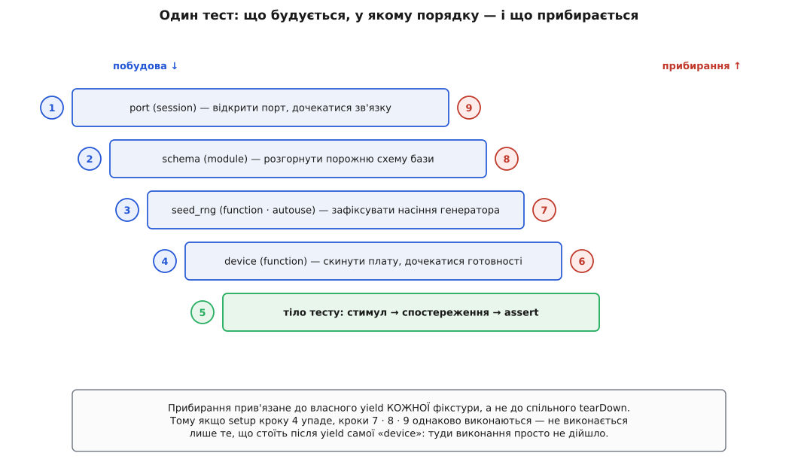
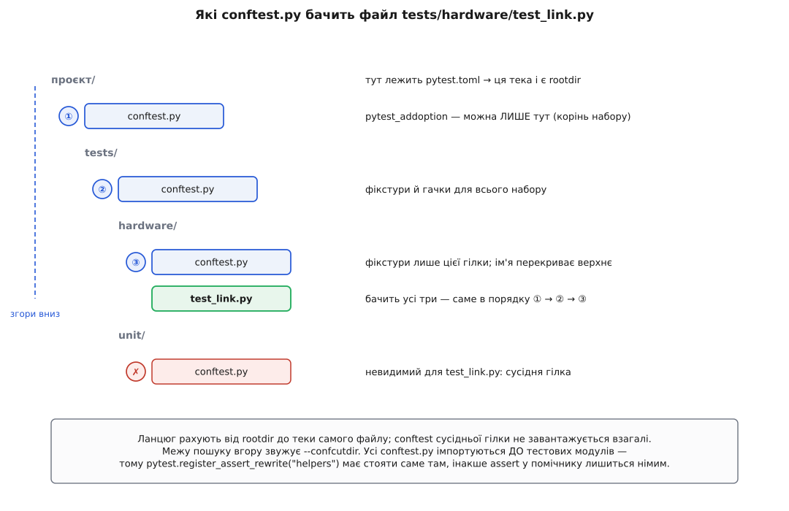

# 📋 Контракт запуску pytest: усе, що переходить межу між набором і конвеєром

Набір тестів стикується з системою складання через п'ять речей: ім'я, яким адресують окрему перевірку; вираз, яким вибирають підмножину; прапорці, що обмежують прогін; число, яке процес повертає оболонці; і файл, у якому все це закріплено як домовленість проєкту. Нижче — точна довідка на кожну з них, разом із місцями, де тихий недогляд перетворює червоне на зелене.

Усе нижче — про [конвеєр складання й доставки](topic:sf-release/ci-cd), який приймає рішення «пускати чи ні» автоматично, без людини перед екраном.

## Ідентифікатор вузла

Одиниця, яку можна назвати, запустити окремо й знайти в історії. Синтаксис:

```
<шлях-до-файлу>[::<клас>][::<функція>][[<ід-параметрів>]]
```

| Форма | Що адресує |
|---|---|
| `tests/` | усе, що зібралося в теці й нижче |
| `tests/hw/test_link.py` | усі вузли модуля |
| `tests/hw/test_link.py::TestEcho` | усі методи класу |
| `tests/hw/test_link.py::TestEcho::test_short` | один метод |
| `tests/hw/test_link.py::test_baud[921600]` | один параметризований випадок |
| `tests/hw/test_link.py::test_echo[921600-1024]` | випадок із двох параметрів |

Розділювач `::` спускає на рівень нижче деревом збирання; шлях беруть відносно теки запуску або абсолютний. Квадратні дужки містять **ідентифікатор параметрів** — рядок, який каркас будує сам: числа й короткі рядки він вставляє як є, а об'єкт без очевидного представлення перетворює на `<ім'я-аргументу>0`, `<ім'я-аргументу>1`. Кілька параметрів зшиваються дефісом.

Порядок усередині дужок не збігається з порядком декораторів, і це регулярно ламає скрипти:

**Умова: два `parametrize` на одній функції — три швидкості й дві довжини пакета.**

```py
@pytest.mark.parametrize("baud", [9600, 115200, 921600])   # верхній
@pytest.mark.parametrize("size", [16, 1024])               # нижній, ближчий до функції
def test_echo(device, baud, size):
    ...
```

```
вузлів     = 3 · 2 = 6
ім'я       = test_echo[<нижній>-<верхній>]  →  test_echo[16-9600]
перебір    = найближчий до функції параметр змінюється НАЙШВИДШЕ:
             [16-9600] [1024-9600] [16-115200] [1024-115200] [16-921600] [1024-921600]
```

Ближчий до тіла функції декоратор дає **перший** сегмент імені й змінюється найшвидше. Ставити ці рядки в конвеєр напам'ять не варто; єдине надійне джерело — сам каркас:

```bash
pytest tests/ --collect-only -q          # по одному ідентифікатору в рядок
```

Це і є перелік для будь-якого скрипта: карантинних списків, розбиття по агентах, звірки з учорашнім прогоном.

Три властивості імені, від яких залежить, чи буде з нього користь.

**Стійкість.** Ім'я, породжене зі значень, змінюється разом зі значеннями: додали швидкість — зсунулися дужки в частині вузлів. Якщо ім'я потрапляє в карантинний список чи в панель статистики, його закріплюють явно: `@pytest.mark.parametrize("baud", [...], ids=["low", "mid", "fast"])`. Тоді значення можна правити, не ламаючи посилань.

**Екранування.** У POSIX-оболонках `[` і `]` — символи взірця імен файлів. Ідентифікатор із дужками передають у лапках: `pytest 'tests/hw/test_link.py::test_baud[921600]'`.

**Доступність зсередини.** У коді те саме ім'я лежить у `request.node.nodeid`; його ж пишуть у назви файлів-артефактів, щоб дамп порту й журнал прив'язувалися до конкретного вузла, а не до прогону загалом.

Зняти окремі вузли з уже вибраного набору можна повторюваним `--deselect <ідентифікатор>`.

## Вибірка: `-k` і `-m`

Два різні механізми, які легко переплутати, бо синтаксис виразу в них однаковий: `and`, `or`, `not`, дужки.

| | `-k ВИРАЗ` | `-m ВИРАЗ` |
|---|---|---|
| Проти чого зіставляє | набір **ключових слів** вузла | лише **позначки** (`@pytest.mark.*`) |
| Вид збігу | підрядок, регістр не важить | точне ім'я позначки |
| Що входить у набір | ім'я файлу, класу, функції, ідентифікатор параметрів, атрибути функції, **а також імена позначок** | тільки позначки самого вузла та успадковані |
| Аргументи позначки | недоступні | доступні: `-m "slow(phase=1)"` |
| Захист від одруку | немає | `strict_markers` — незареєстрована позначка стає помилкою |

Головна пастка тут — рядок «а також імена позначок». Каркас складає імена позначок у той самий набір, по якому працює `-k`, і звідси йде найтиповіша плутанина: `-k "not slow"` викине і тести з позначкою `slow`, і тест на ім'я `test_slowdown_recovery`, якого ніхто не позначав. Зворотного не буває: `-m` імен ніколи не бачить.

```bash
pytest -k "link and not 921600"      # за іменами й ідентифікаторами параметрів
pytest -m "hardware and not slow"    # за позначками
pytest -m "not hardware" -k "echo"   # обидва працюють разом: перетин
```

Вибрані, але відкинуті вузли каркас рахує окремо й друкує рядком `N deselected` — це число варто читати в журналі CI, бо саме воно виявляє вираз, який відсік більше, ніж планувалося.

Позначки оголошують у файлі налаштувань або гачком `pytest_configure`; повний перелік чинних показує `pytest --markers`.

## Прапорці, що визначають прогін

| Прапорець | Дія | Навіщо в конвеєрі |
|---|---|---|
| `-x`, `--exitfirst` | зупинитися після першого падіння; те саме, що `--maxfail=1` | швидкий зворотний зв'язок на «димових» прогонах |
| `--maxfail=N` | зупинитися після N падінь (помилки setup рахуються теж) | не палити хвилини агента на лавину однакових падінь |
| `-q`, `-v`, `-vv` | менше / більше / ще більше подробиць; `-vv` показує повні різниці порівнянь | `-q` для журналу, `-vv` для перезапуску впалого |
| `-rA` | підсумок наприкінці по **всіх** вузлах; літери `f E s x X p` вибирають категорії | зведення, яке читають першим |
| `-p no:cacheprovider` | не вантажити плагін кеша: `.pytest_cache` не створюється | робоча тека лишається чистою; ціна — `--lf`/`--ff` перестають працювати |
| `--junitxml=ШЛЯХ` | машиночитний звіт XML із переліком вузлів, статусами й часом | звідси система складання бере таблицю результатів |
| `--durations=N` | N найповільніших вузлів із розбивкою по фазах | пошук того, що з'їдає прогін |
| `-n auto\|logical\|N` | розвести набір по процесах (плагін `pytest-xdist`) | справжня паралельність і межа аварії |
| `--dist=load\|loadfile\|loadscope\|loadgroup\|worksteal` | правило, за яким вузли роздають робітникам | тримати разом те, що ділить дорогу фікстуру |
| `-o ключ=значення` | перекрити опцію налаштувань, не чіпаючи файл | разові відхилення в окремій задачі конвеєра |
| `--co`, `--collect-only` | зібрати й не запускати | перевірка, що вибірка не порожня |
| `--deselect ІД` | зняти конкретний вузол | карантин без правки коду |
| `--basetemp=ТЕКА` | корінь тимчасових тек (`tmp_path`) | складати сміття туди, звідки агент його прибере |
| `--import-mode=importlib` | імпортувати тестові модулі без гри зі `sys.path` | однакові імена файлів у різних теках перестають конфліктувати |
| `-W ФІЛЬТР` | фільтр попереджень поверх налаштувань | разово підняти конкретне попередження до помилки |
| `-c ФАЙЛ` | взяти саме цей файл налаштувань | прогін з іншим профілем |
| `-s` | не перехоплювати stdout/stderr (те саме, що `--capture=no`) | коли треба бачити друк у момент зависання |
| `--lf`, `--ff`, `--nf`, `--cache-clear` | лише впалі минулого разу / впалі спершу / нові спершу / очистити кеш | локальна робота; у конвеєрі кеш зазвичай не переживає прогін |

Мінімальний робочий виклик, з якого варто починати задачу конвеєра:

```bash
pytest tests/ \
  -m "not hardware" \
  -q -rA \
  --maxfail=10 \
  --durations=15 \
  --junitxml=reports/junit.xml \
  -p no:cacheprovider \
  -n auto --dist=loadfile
```

Дві пастки цього рядка. Перша: `-x` разом із `-n` не зупиняє прогін миттєво — кожен робітник уже тримає в роботі свій вузол, тож після першого падіння прилетить ще до N результатів. Друга: `--dist=load` роздає вузли врозсип, і два тести, що ділять модульну фікстуру, легко потраплять у різні процеси — фікстура побудується двічі. `loadfile` і `loadscope` існують саме для цього.

## Коди повернення

Число, яке процес віддає оболонці, — і є рішення. Значення закріплені як перелічуваний тип `pytest.ExitCode`:

| Код | Ім'я в `pytest.ExitCode` | Що сталося | Пускати? |
|---|---|---|---|
| `0` | `OK` | усі зібрані тести пройшли | так — і лише тут «так» |
| `1` | `TESTS_FAILED` | зібрано й запущено, частина впала | ні: є справжній сигнал |
| `2` | `INTERRUPTED` | прогін урвано (сигнал, `KeyboardInterrupt`, внутрішня зупинка) | ні: результат неповний |
| `3` | `INTERNAL_ERROR` | помилка всередині самого каркаса чи плагіна | ні: зламано інструмент |
| `4` | `USAGE_ERROR` | помилка у виклику: невідомий прапорець, битий файл налаштувань | ні: прогону не було |
| `5` | `NO_TESTS_COLLECTED` | не зібрано **жодного** тесту | ні — і саме тут ламаються ворота |

Коди `4` і `5` — головна причина, з якої зелений конвеєр буває брехнею. Обидва означають «нічого не перевірено», а не «все гаразд»: одрук у виразі `-m`, перейменована тека, невстановлений плагін — і набір мовчки не запускається. Ворота, написані як «валимо, якщо код дорівнює одиниці», пропускають такий прогін як успішний.

Правильна форма перевіряє на **нуль**, а не на одиницю:

```bash
set -o pipefail
pytest tests/ --junitxml=reports/junit.xml
rc=$?

case "$rc" in
  0) echo "усі перевірки пройшли" ;;
  1) echo "є падіння — не пускати";                       exit 1 ;;
  5) echo "жоден тест не зібрано: вибірка порожня";        exit 1 ;;
  *) echo "прогін не відбувся (код $rc) — не пускати";     exit 1 ;;
esac
```

Окремо варто знати межу цього механізму: якщо агент убиває процес власним таймаутом, каркас коду не повертає взагалі — оболонка бачить `128 + номер сигналу` (звідси знайомі `137` для `SIGKILL` і `143` для `SIGTERM`). Загальні правила поводження з цим числом описані в темі про [код виходу як інтерфейс програми](topic:sys-unix/exit-status).

Буває, що порожня вибірка законна: нічна задача, яка ганяє лише позначені `hardware`, на стенді без плати справді має нічого не знайти. Тоді код міняють свідомо й точково — гачком, а не мовчазним `|| true` довкола всього виклику:

```py
# conftest.py у корені набору; сам прапорець --allow-empty реєструє pytest_addoption
import pytest


def pytest_sessionfinish(session, exitstatus):
    if (exitstatus == pytest.ExitCode.NO_TESTS_COLLECTED
            and session.config.getoption("--allow-empty")):
        session.exitstatus = pytest.ExitCode.OK
```

## Файл налаштувань проєкту

Каркас шукає файл налаштувань угору від спільного предка переданих шляхів і бере **перший знайдений**; опції з різних файлів ніколи не змішуються. Тека знайденого файлу стає `rootdir` — коренем, відносно якого рахуються ідентифікатори вузлів і ланцюг `conftest.py`.

| Пріоритет | Файл | Секція | Модель значень |
|---|---|---|---|
| 1 | `pytest.toml` / `.pytest.toml` | `[pytest]` | рідний TOML: списки — списки, булеві — булеві |
| 2 | `pytest.ini` / `.pytest.ini` | `[pytest]` | INI: усе рядки |
| 3 | `pyproject.toml` | `[tool.pytest]` | рідний TOML |
| 3 | `pyproject.toml` | `[tool.pytest.ini_options]` | INI-сумісний режим; із рідною таблицею не поєднується |
| 4 | `tox.ini` | `[pytest]` | INI |
| 5 | `setup.cfg` | `[tool:pytest]` | INI |

Перші два збігаються **навіть порожні** — порожній `pytest.ini` у корені репозиторію є найдешевшим способом жорстко зафіксувати `rootdir`.

| Опція | Що робить | Ціна недогляду |
|---|---|---|
| `testpaths` | де шукати тести, коли шлях не передано аргументом | без неї каркас обходить усе дерево від `rootdir`: повільне збирання й випадковий імпорт нетестового коду |
| `addopts` | прапорці, що додаються до **кожного** запуску | сюди легко покласти те, що заважає розробникові локально |
| `markers` | реєстр позначок: ім'я плюс однорядковий опис | без реєстру одрук у назві позначки мовчки нікого не вибирає |
| `filterwarnings` | фільтри попереджень на весь прогін; `error` підіймає попередження до падіння | застаріле API роками лишається непоміченим |
| `xfail_strict` (з 9.0 — `strict_xfail`) | тест, позначений як очікувано невдалий, що **пройшов**, вважається падінням | полагоджений баг назавжди лишається під позначкою `xfail` |
| `strict` (з 9.0) | один вимикач, що вмикає `strict_config`, `strict_markers`, `strict_parametrization_ids`, `strict_xfail` | накопичення тихих послаблень |
| `required_plugins` | перелік плагінів із версіями, без яких прогін не починається | набір «проходить» на агенті без потрібного плагіна, бо частина семантики просто зникла |
| `norecursedirs` | теки, у які не спускатися під час збирання | збирання лізе у `build/`, `.venv`, дані |
| `python_files`, `python_classes`, `python_functions` | взірці, за якими каркас упізнає тести | успадкований набір з іншими домовленостями не збирається зовсім |
| `cache_dir` | де тримати `.pytest_cache` | кеш пишеться в робочу теку, яку агент вважає чистою |
| `junit_family`, `junit_suite_name`, `junit_logging` | діалект і наповнення XML-звіту | система складання читає звіт, але бачить не ті поля |
| `minversion` | мінімальна версія каркаса | мовчазна зміна поведінки на старішому агенті |

Рідний TOML і класичний INI поруч, щоб було видно різницю моделі значень:

```toml
# pytest.toml — pytest ≥ 9: списки є списками, булеві є булевими
[pytest]
minversion = "9.0"
testpaths = ["tests"]
addopts = ["-ra", "--import-mode=importlib"]
strict = true
required_plugins = ["pytest-xdist>=3.5"]
markers = [
  "slow: іде довше за 5 секунд",
  "hardware: потребує підключеної плати (--dev)",
]
filterwarnings = [
  "error",
  "ignore::DeprecationWarning:serial.*",
]
```

```ini
# pytest.ini — класична форма: значення завжди рядки, список задають рядками
[pytest]
minversion = 7.0
testpaths = tests
addopts = -ra --import-mode=importlib
xfail_strict = true
markers =
    slow: іде довше за 5 секунд
    hardware: потребує підключеної плати (--dev)
filterwarnings =
    error
    ignore::DeprecationWarning:serial.*
```

Одне правило про `addopts`, яке економить години: прапорці **строгості** надійніше задавати опціями файлу (`strict`, `strict_markers`, `strict_config`), а не через `addopts`. Вони впливають на розбір самої конфігурації — тобто на етап, що вже минув на момент, коли вміст `addopts` розкривається в аргументи командного рядка. Загальні міркування про те, що взагалі варто виносити в налаштування, а що лишати в коді, зібрані в темі про [проєктування конфігурації](topic:sf-apps/config-design).

## Області фікстур і порядок прибирання

| Область | Живе, доки | Скільки разів на N тестів | Типовий вміст |
|---|---|---|---|
| `function` (типова) | триває один тест | N | скидання пристрою, тимчасова тека, дублер |
| `class` | ідуть методи одного класу | за кількістю класів | стан, спільний для групи методів |
| `module` | ідуть тести одного файлу | за кількістю файлів | схема бази під набір тестів файлу |
| `package` | ідуть тести теки й підтек | за кількістю пакетів | стенд, спільний для гілки набору |
| `session` | триває весь прогін | 1 | відкритий порт, піднятий сервер, з'єднання |

Область задають рядком: `@pytest.fixture(scope="module")`. Її можна обчислювати — замість рядка передають функцію `(fixture_name, config) -> str`, і тоді, наприклад, важкий ресурс стає сесійним у нічному прогоні й функційним у прогоні з ізоляцією.

Порядок побудови визначають три правила, застосовані саме в такій черзі:

1. **Ширша область — раніше.** `session` → `package` → `module` → `class` → `function`.
2. **Залежність — раніше залежного.** Фікстура, яку запитали за іменем параметра, будується першою.
3. **`autouse` — раніше решти своєї області.** І її власні залежності стають фактично автоматичними в межах тієї ж області.

Прибирання йде **точно у зворотному порядку**: побудоване першим прибирається останнім.


*Номери ліворуч — порядок побудови, номери праворуч — порядок прибирання. Гарантія тут не в самому порядку, а в тому, що кожна фікстура прибирає лише **своє**.*

Ця гарантія випливає з форми `yield`: код після нього прив'язаний до конкретної фікстури, а не до спільного методу завершення. Тому падіння в підготовці четвертої фікстури не заважає прибрати перші три — і саме тому корисне правило «одна фікстура — одна зміна стану». Фікстура, що робить три речі підряд, повертає ту саму проблему, від якої `yield` рятував: її код прибирання мусить сам з'ясовувати, що встигло створитися.

Дві дрібниці контракту, які варто знати:

- `request.addfinalizer(fn)` реєструє прибирання явно; кілька фіналізаторів однієї фікстури виконуються теж у зворотному порядку реєстрації.
- `@pytest.fixture(params=[...])` розмножує **всі** залежні тести й дописує значення до ідентифікатора вузла — тобто параметризована фікстура так само розширює простір імен, як і `parametrize` на функції.

Механіку оголошення ресурсу іменем параметра — тобто те, чим фікстура є за природою, — розібрано в темі про [впровадження залежностей](topic:sf-apps/dependency-injection).

## Порядок пошуку `conftest.py`

`conftest.py` ніде не імпортують явно: каркас знаходить і вантажить його сам. Правило одне — для кожного тестового файлу завантажуються всі `conftest.py` **на шляху від `rootdir` до власної теки файлу**, згори вниз.


*Видимість тут вертикальна й однобічна: униз дерева фікстури течуть, убік — ніколи.*

| Правило | Наслідок |
|---|---|
| Вантажаться згори вниз, від `rootdir` до теки файлу | ближчий `conftest.py` перекриває однойменну фікстуру дальшого |
| Сусідня гілка невидима | винести спільне можна лише **вгору**, у спільного предка |
| Усі `conftest.py` імпортуються **до** тестових модулів | `pytest.register_assert_rewrite("helpers")` має стояти саме тут, інакше `assert` у модулі-помічнику лишиться німим |
| `pytest_addoption` — лише в кореневому `conftest.py` набору або в установленому плагіні | глибший файл реєструє прапорець уже після розбору аргументів, тож прапорця просто не існуватиме |
| `--confcutdir=ТЕКА` звужує пошук угору | корисно, коли набір лежить усередині чужого дерева з власними `conftest.py` |

Плагінами керують окремо від `conftest.py`: `-p ім'я` вантажить плагін раніше за розбір аргументів, `-p no:ім'я` забороняє — і це працює навіть для вбудованих, звідки й береться `-p no:cacheprovider`.

## Гачки

Гачок — іменована функція, яку каркас викликає у визначений момент; сама [архітектура плагінів](topic:sf-apps/plugin-architecture) тут звичайна, з однією особливістю виклику: **параметри зіставляються за іменем**. Оголошувати треба лише ті, що вам потрібні; зайвий параметр — помилка, пропущений — норма. Тому `def pytest_addoption(parser)` цілком законний, хоча повна специфікація має два аргументи.

| Гачок | Сигнатура | Коли |
|---|---|---|
| `pytest_addoption` | `(parser: Parser, pluginmanager: PytestPluginManager) -> None` | один раз на старті, до розбору аргументів |
| `pytest_configure` | `(config: Config) -> None` | після розбору, до збирання |
| `pytest_generate_tests` | `(metafunc: Metafunc) -> None` | під час збирання кожної тестової функції |
| `pytest_collection_modifyitems` | `(session: Session, config: Config, items: list[Item]) -> None` | після збирання, до запуску; `items` правлять **на місці** |
| `pytest_runtest_setup` | `(item: Item) -> None` | перед фазою підготовки кожного вузла |
| `pytest_runtest_makereport` | `(item: Item, call: CallInfo[None]) -> TestReport \| None` — перший результат виграє | тричі на вузол: `setup`, `call`, `teardown` |
| `pytest_runtest_logreport` | `(report: TestReport) -> None` | на кожен готовий звіт |
| `pytest_sessionfinish` | `(session: Session, exitstatus: int \| ExitCode) -> None` | наприкінці; тут міняють `session.exitstatus` |

Порядок реалізацій одного гачка: спершу обгортки (до `yield`), далі `tryfirst`, далі звичайні, далі `trylast`, і наприкінці обгортки після `yield`. Задають це декоратором `@pytest.hookimpl(wrapper=True)`, `(tryfirst=True)`, `(trylast=True)`.

Робочий приклад — три гачки в одному кореневому `conftest.py`, які разом дають набору власний прапорець і чесну поведінку на машині без заліза:

```py
# conftest.py у корені набору
import pytest


def pytest_addoption(parser):
    parser.addoption("--dev", action="store", default=None,
                     help="послідовний порт плати, напр. /dev/ttyUSB0")
    parser.addoption("--allow-empty", action="store_true", default=False,
                     help="порожня вибірка не є приводом валити прогін")


def pytest_configure(config):
    config.addinivalue_line("markers", "hardware: потребує підключеної плати")


def pytest_collection_modifyitems(session, config, items):
    if config.getoption("--dev"):
        return
    skip = pytest.mark.skip(reason="плату не вказано: запустіть із --dev=/dev/ttyUSB0")
    for item in items:
        if "hardware" in item.keywords:
            item.add_marker(skip)
```

Тут видно межу між двома схожими діями. `add_marker(skip)` лишає вузол у наборі — він з'явиться у звіті як пропущений, тобто його видно й полічено. Якби замість цього ми викинули вузли з `items`, вони зникли б безслідно, а набір без жодного залізного тесту повернув би код `5`.

Гачок `pytest_runtest_makereport` розв'язує задачу, яку інакше не розв'язати нічим: **фікстура не знає, чи впав тест**. Вона бачить лише, що виконання дійшло до коду після `yield`. Міст будують обгорткою, яка кладе готовий звіт у сховище вузла:

```py
# той самий conftest.py
phase_report_key = pytest.StashKey[dict[str, pytest.TestReport]]()


@pytest.hookimpl(wrapper=True)
def pytest_runtest_makereport(item, call):
    report = yield                    # звіт, який зібрали інші реалізації
    item.stash.setdefault(phase_report_key, {})[report.when] = report
    return report                     # обгортка МУСИТЬ повернути результат далі
```

І тепер прибирання може дивитися на результат:

```py
@pytest.fixture
def device(port, request):
    reset(port)
    wait_ready(port, timeout=3.0)
    yield Device(port)

    report = request.node.stash.get(phase_report_key, {})
    failed = ("call" not in report) or report["call"].failed
    if failed:
        dump_logs(port, request.node.nodeid)   # артефакт лише там, де він потрібен
```

Ключ `"call"` **відсутній**, якщо тест не дійшов до тіла — підготовка впала або вузол пропустили; тому перевірка починається саме з наявності ключа, а не зі `.failed`. Практична вигода пряма: журнали, дампи й знімки збираються лише для впалих вузлів, іменуються ідентифікатором вузла — і червоний прогін у конвеєрі віддає інженерові рівно два рядки: ім'я, яке відтворює падіння, і файл, який пояснює його причину.
