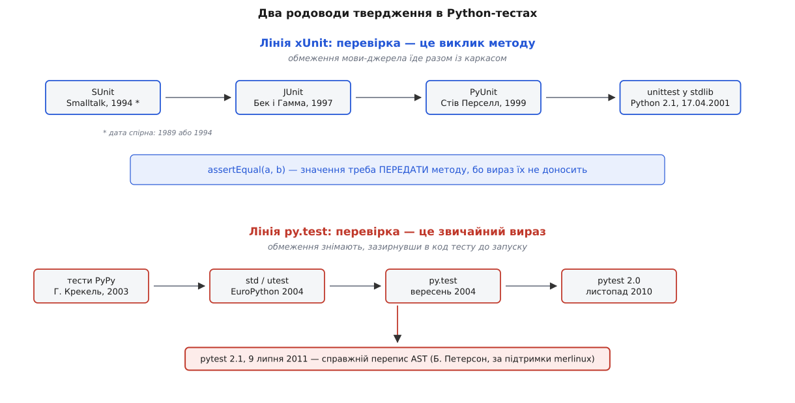

# 📜 Звідки в Python-тестах узявся `assertEqual` — і хто зняв це обмеження

У Python є оператор `assert`, і все ж понад двадцять років тестові каркаси вимагали писати `self.assertEqual(a, b)`. Ця історія — про те, як обмеження чужої мови приїхало в Python разом із каркасом, прожило тут два десятиліття, і що саме довелося побудувати, щоб повернути в тест звичайний вираз. Не мода змінилася — змінилося те, що інструмент став здатен робити з кодом тесту.

## Твердження, яке не вміє розповісти

Почнімо з болю, а не з дат. Перевірка в тесті має два обов'язки: сказати «так» або «ні» — і, якщо «ні», пояснити чому. Перший обов'язок виконує будь-який булевий вираз. Другий не виконує жоден.

Подивіться, що лишається від виразу після обчислення. `a == b` перетворюється на одне значення — `False`. Ані `a`, ані `b` в цьому значенні вже немає: порівняння їх спожило. Коли далі спрацьовує механізм падіння, він тримає в руках лише голе `False` і не має звідки взяти рядки, які не збіглися.

У Python це видно просто:

```python
>>> a, b = "OK\r\n", "OK\n"
>>> assert a == b
Traceback (most recent call last):
  File "<stdin>", line 1, in <module>
AssertionError
```

Одне слово `AssertionError` — і все. Ні того, що порівнювали, ні того, чим воно виявилося. Байт-код тут чесний до кінця: `assert x` компілюється у обчислення `x`, стрибок через порушення, якщо істина, і `raise AssertionError` інакше. Значень підвиразів у цьому ланцюжку ніхто не зберігає, бо навіщо — мова не знає, що ви пишете тест.

Звідси єдиний вихід, доступний авторові **бібліотеки**: не покладатися на вираз, а забрати значення собі до порівняння. Тобто передати їх у функцію:

```python
def assertEqual(first, second, msg=None):
    if not first == second:
        raise AssertionError(msg or f"{first!r} != {second!r}")
```

Тепер `first` і `second` живуть у кадрі функції, і звіт можна скласти який завгодно докладний. Ціна — мова викликів замість мови виразів: `assertEqual`, `assertTrue`, `assertIn`, `assertAlmostEqual`, `assertRaises`, і так далі на кілька десятків імен. Кожне ім'я в цьому переліку — не примха, а один спосіб порівнювати, для якого хтось захотів людський звіт.

> 🔧 **Навіщо це.** Запам'ятайте форму цього обмеження: значення треба перехопити **до** того, як їх з'їв вираз. Усе, що буде далі — і те, чому обмеження трималося двадцять років, і те, як його зняли, — це варіації на одну цю тезу.

## Родовід: Smalltalk, Java, Python

Мова методів-тверджень не народилася в Python. Вона приїхала з родини каркасів, яку прийнято називати **xUnit**.

Початок — **SUnit**, каркас для Smalltalk, який написав **Кент Бек** (англ. *Kent Beck*, американець). З датою тут чесна плутанина: сам Бек і більшість оглядів називають **1994** рік (стаття «Simple Smalltalk Testing: With Patterns»), тоді як англійська Вікіпедія відносить створення каркаса до **1989-го**. *Статус: атрибуція дати суперечлива; суть — «тестовий каркас у Smalltalk від Бека, перша половина 1990-х» — не оскаржується.* Для нашої лінії важлива не дата, а форма: у SUnit перевірка була **повідомленням до об'єкта-тесту**, тобто викликом, а не самостійним виразом мови.

Далі — **JUnit**. Його написали Кент Бек і **Еріх Гамма** (нім. *Erich Gamma*, швейцарець, співавтор «Design Patterns») 1997 року, і зробили це в літаку з Цюриха до Атланти, летячи на конференцію OOPSLA. *Статус: широко переказана історія, джерело — спогади самих учасників; конференція OOPSLA'97 справді проходила в Атланті на початку жовтня, дата й авторство сумнівів не викликають.* Перенесення було свідомо буквальним: реалізувати SUnit у Java, зберігши дух оригіналу.

І ось тут обмеження, м'яко кажучи, загострилося. Java 1997 року **взагалі не мала оператора `assert`** — його додали лише в J2SE 1.4, 2002 року. Тобто Бек і Гамма не обирали між виразом і методом: вибору не існувало, метод був єдиною формою, у якій перевірка могла бути записана. А коли `assert` у Java нарешті з'явився, він успадкував ту саму ваду, що й у Python: жодних подробиць про підвирази. Мова методів у Java була не стилем, а необхідністю.

Наступний крок зробив **Стів Перселл** (англ. *Steve Purcell*), який наприкінці 1990-х переніс JUnit у Python під назвою **PyUnit**; перший випуск — кінець 1999-го. Далі — вирішальна подія: **23 березня 2001 року**, у день виходу **Python 2.1**, PyUnit увійшов у стандартну бібліотеку під іменем `unittest`. *Статус: задокументовано — новина цією датою висить на сайті PyUnit, поява `unittest` зафіксована в «What's New in Python 2.1».* Разом із каркасом у стандартну бібліотеку в'їхали й `assertEqual` з ріднею — успадковані з мови, де вони були неминучі.



*Верхня доріжка везе обмеження Java до стандартної бібліотеки Python; нижня — знімає його, зазирнувши в код тесту до запуску. Дати SUnit джерела подають по-різному.*

Варто зупинитися на тому, що це **не була помилка**. Перселл переносив каркас, а не переписував мову. Для автора бібліотеки методи-твердження — єдине рішення, яке взагалі доступне: бібліотека працює зі значеннями, які їй передали, і не має жодного стосунку до того, як виглядав код, з якого ці значення прийшли. Щоб дістатися до самого коду тесту, треба перестати бути бібліотекою — і почати втручатися в те, як Python завантажує модулі. Це інший клас інструмента.

## Другий бік: тести, яких було забагато

Зняття прийшло звідти, де тестів стало нестерпно багато, — з проєкту **PyPy**, реалізації Python на самому Python. Розробники PyPy писали тести на все й одразу, тож обв'язка з класами-нащадками, довгими іменами методів і `self.assert…` у кожному рядку почала коштувати помітної частки робочого дня.

**Гольгер Крекель** (нім. *Holger Krekel*), співзасновник PyPy, узявся за це вже 2003 року, коли перебрав тестову оснастку проєкту (`pypy.tool.test`) — усе ще поверх `unittest`. Наприкінці 2003-го Штефан Шварцер (нім. *Stefan Schwarzer*) зробив ще один захід під назвою `pypy.tool.newtest`. А в середині 2004-го з'явився `utest` — і саме там уперше свідомо поставили метою **звичайні твердження** замість `assertXYZ`.

Того ж 2004 року, на **EuroPython**, Крекель оголосив ширший задум — «додаткову стандартну бібліотеку» на ім'я `std`, і серед її засад було рівно те, про що ця вставка: мінімум обв'язки, кращі трасування й **звичайний `assert` із докладним розбором** замість переліку спеціальних методів. У **вересні–жовтні 2004-го** проєкт `std` перейменували на `py` (бо `std` надто плуталося зі стандартною бібліотекою), а `std.utest` став **`py.test`**. *Статус: задокументовано супровідниками pytest в офіційному нарисі історії проєкту, який спирається на архіви розсилок і репозиторіїв; сам нарис чесно зазначає, що точну «дату народження» назвати важко, і бере за орієнтир 2004 рік.*

Зверніть увагу на порядок подій: **теза прозвучала 2004-го, а повноцінна реалізація з'явилася 2011-го**. Сім років між заявою наміру й інструментом, який робить обіцяне надійно, — це не лінощі. Це час, потрібний, щоб дозріли механізми, без яких обіцянку не виконати.

## Перше зняття — і чому воно було хистке

Перший `py.test` таки показував підвирази, але робив це найдоступнішим способом: **переінтерпретацією**. Схема така — виконуємо `assert`; якщо впало, беремо вихідний текст цього рядка й обчислюємо його частини **ще раз**, аби дізнатися, чим вони були.

Хиба тут видна одразу, щойно у виразі є будь-яка дія, що змінює стан:

```python
# файл уже відкритий, курсор на початку
assert f.readline() == "OK\n"

# 1-й прогін: прочитали "OK\r\n", порівняли, не збіглося → падіння
# 2-й прогін (заради звіту): курсор уже зсунувся, readline() віддає інший рядок
# у звіті опиниться порівняння, якого насправді не було
```

Тобто звіт міг брехати саме тоді, коли він найпотрібніший. Офіційне формулювання супровідників pytest не м'якше: твердження з побічними діями «можуть давати дивні результати, бо на падінні обчислюються двічі».

Крім того, лишалася друга вада успадкованого `assert`: під прапорцем оптимізації (`python -O`) інтерпретатор **викидає** оператори `assert` із байт-коду. Прогін тестів під `-O` мовчки проходив би цілком, нічого не перевіривши, — небезпека, від якої мова методів була вільна за побудовою.

## Що мусило дозріти

Правильний спосіб зняти обмеження очевидний: не обчислювати вираз двічі, а **переписати код тесту ще до першого обчислення** — так, щоб він сам складав значення підвиразів у тимчасові змінні. Для цього потрібні дві речі, яких на 2004 рік просто не було під рукою.

Перша — доступ до [абстрактного синтаксичного дерева](topic:sf-lang/abstract-syntax-tree) розібраного модуля, тобто до структури коду, а не до його тексту. Модуль `ast`, який дає цю структуру на рівні мови, з'явився лише в **Python 2.6** (жовтень 2008). Друга — законний спосіб втрутитися в завантаження модуля між читанням файлу і його виконанням; його дає механізм гаків імпорту з PEP 302.

Тим часом сам інструмент відокремився: **у листопаді 2010-го вийшов pytest 2.0.0** — перший випуск, що більше не був частиною бібліотеки `py` (та лишалася на версії 1.3.4) і містив тільки код тестового каркаса. Це вже був самостійний проєкт із власним темпом.

А **9 липня 2011 року** вийшов **pytest 2.1.0**, і головною новиною в оголошенні названо саме «доведені до пуття твердження» — роботу зробив **Бенджамін Петерсон** (англ. *Benjamin Peterson*, розробник ядра CPython), частково за фінансової підтримки компанії **merlinux GmbH**, що належала Крекелю. *Статус: задокументовано — усе це прямо сказано в офіційному оголошенні випуску 2.1.0, включно з подякою й згадкою про спонсорство.*

Механізм в оголошенні описано так само прямо: твердження в тестових модулях (на Python 2.6 і новіших) обробляються **переписуванням AST**, а результат зберігається у файл байт-коду **до того, як модуль буде імпортовано**. Гак PEP 302 перехоплює імпорт, розібране дерево модуля змінюють, змінене компілюють, кешують — і далі виконується вже воно.

Що саме бачить інтерпретатор, спрощено:

```python
# ви написали:
assert f.readline() == "OK\n"

# після перепису дерева виконується приблизно таке:
@ліве  = f.readline()          # обчислено РІВНО ОДИН раз і збережено
@праве = "OK\n"
@рез   = @ліве == @праве
if not @рез:
    raise AssertionError(пояснити(@ліве, "==", @праве))
```

Одне обчислення — і повний звіт. Побічні дії більше нічого не псують, бо другого прогону немає. Прапорець `-O` теж перестає бути пасткою: після перепису це вже не оператор `assert`, а звичайне `if`, і оптимізатор його не викидає. Обидві вади зняті одним ходом — не хитрішою бібліотекою, а виходом на рівень, де інструмент бачить **код**, а не тільки значення.

## Що з цього видно

Найкорисніший висновок цієї історії не про Python і не про pytest. Він про те, як довго живуть обмеження, що втратили причину.

Мова `assertEqual` була **правильною відповіддю** на реальну перешкоду: у Java 1997 року іншої форми не існувало, у Python 2001-го автор бібліотеки не мав доступу до коду тесту. Перешкода зникла не тоді, коли комусь набридло довге ім'я методу, а тоді, коли зійшлися три речі: `ast` у стандартній бібліотеці, гак імпорту й людина, якій оплатили місяці роботи над цим конкретним вузлом. Між тезою на EuroPython і працездатним переписом AST лежить сім років саме тому, що теза була дешева, а зняття обмеження — ні.

І окремо варто розділяти щаблі, які легко злипаються в переказі. **Ідея** «нехай тест пише звичайний вираз» звучала 2004-го. **Груба реалізація** — переінтерпретація — жила з 2004-го й давала недостовірні звіти на побічних діях. **Справжня реалізація** — перепис дерева при імпорті — з'явилася 2011-го. Той, хто розповідає цю історію як «Крекель придумав звичайний assert», не бреше, але пропускає найдорожчу її частину.

Обидві гілки, до речі, живі й досі. `unittest` лишається в стандартній бібліотеці, і його [модульні тести](topic:sf-release/unit-testing) з методами-твердженнями чудово запускаються тим самим pytest. Стару мову ніхто не забороняв — просто зникла причина, з якої вона була єдиною.
