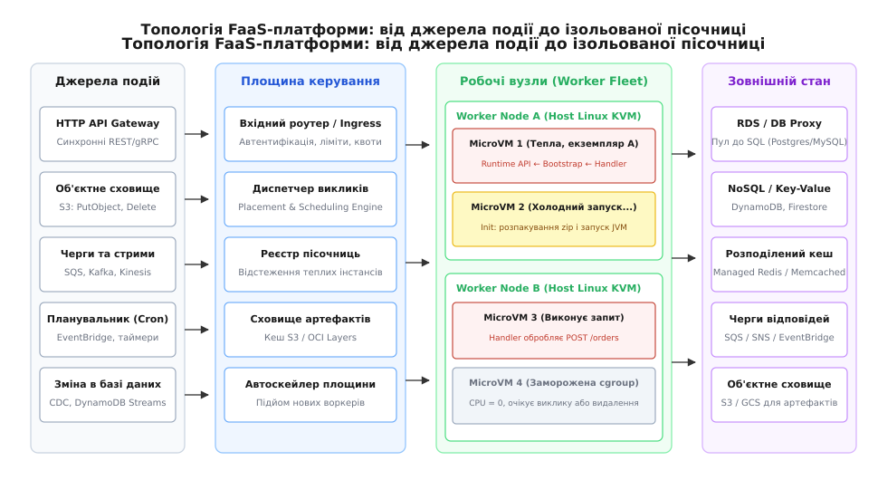
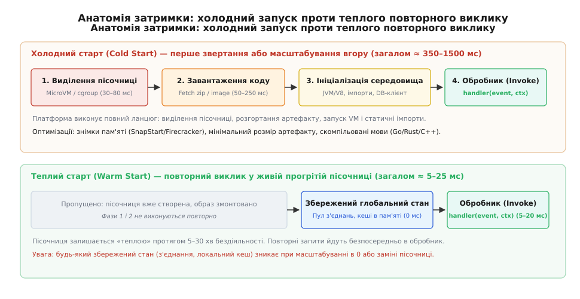
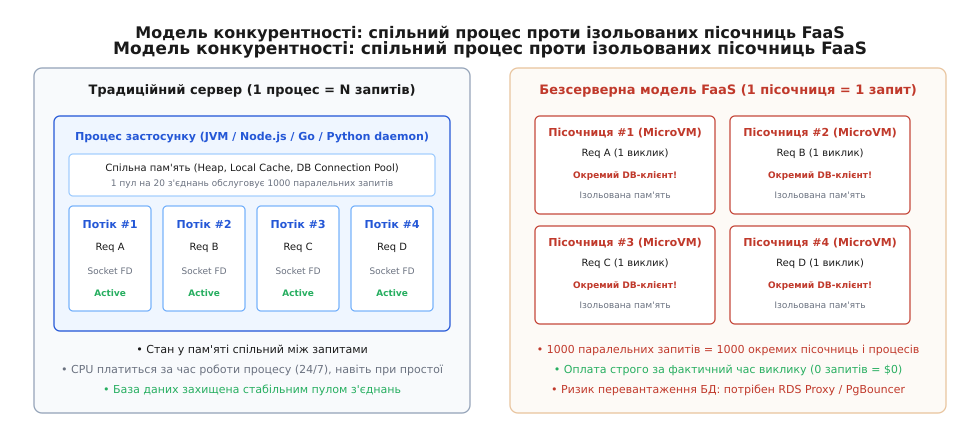

# Serverless/FaaS: виконання функцій і життєвий цикл без власного процесу

<preknowlist>
- [Контейнери](root:sf-os/containers) — простори назв (namespaces), контрольні групи (cgroups) та ізоляція середовища виконання.
- [Автоскейл](root:sf-release/autoscaling) — реактивне та предиктивне масштабування обчислювальних ресурсів під навантаженням.
- [Штатне вимкнення і drain](root:sf-release/graceful-shutdown) — безпечне завершення обробки запитів і звільнення ресурсів перед зупинкою процесу.
- [Об'єктне сховище](root:sf-data/object-storage) — незмінні двійкові об'єкти (blob) та сповіщення про зміну стану.
</preknowlist>

Сервіс прийому платіжних вебхуків отримує вночі в середньому 2 запити на хвилину, споживаючи менше ніж 0.3% потужності одного процесорного ядра. О дев'ятій ранку під час старту святкового розпродажу навантаження миттєво стрибає до 1200 запитів на секунду. Якщо розгорнути такий сервіс на двох віртуальних машинах або подах Kubernetes для забезпечення відмовостійкості 99.9%, процесорні ядра та гігабайти оперативної пам'яті простоюватимуть 22 години на добу, а бізнес щомісяця сплачуватиме повну вартість оренди заліза. 

Коли ж о 09:00 настає сплеск трафіку, автоскейл класичного кластера віртуальних машин потребує від 3 до 7 хвилин на ініціалізацію вузлів, завантаження шарів образів контейнерів і проходження перевірок готовності (Readiness Probes), через що вхідні вебхуки платіжних систем відпадають за тайм-аутом, втрачаючи транзакції.

Ця суперечність між ціною простою та швидкістю масштабування породила парадигму **Serverless** (англ. *server* від лат. *servire* — служити + *-less* — безсерверний) та її обчислювальне ядро — **FaaS** (англ. *Function-as-a-Service* — функція як послуга). Замість оренди постійно працюючого сервера розробник передає платформі чисту функцію-обробник, а система бере на себе повне керування життєвим циклом процесу: миттєвий запуск пісочниці під вхідну подію, паралельне масштабування кожного виклику та автоматичне згортання в нуль при відсутності навантаження.

## Інверсія володіння життєвим циклом: чому FaaS відкидає `main()`

У традиційній архітектурі бекенду розробник повністю володіє процесом операційної системи. Кодова база містить функцію точки входу `main()`, яка самостійно зчитує файли конфігурації, відкриває мережевий сокет через системний виклик `bind()`, переводить його в режим прослуховування `listen()`, виділяє статичний пул з'єднань до бази даних і запускає нескінченний цикл обробки подій (Event Loop) або пул робочих потоків.

```
Традиційний сервіс (розробник володіє процесом):
[main()] → [bind(8080)] → [Пул з'єднань] → [while(true) accept()] → (24/7/365 увімкнений)

FaaS (платформа володіє процесом):
(Подія з черги/HTTP) → [Платформа підіймає MicroVM] → handler(event, context) → [Заморожування/Знищення]
```

Ця модель змушує інженера вирішувати завдання, які не мають стосунку до бізнес-логіки: контролювати витоки пам'яті, стежити за розміром пулу потоків, налаштовувати метрики для груп автоскейлу та оновлювати ядро операційної системи.

У безсерверній моделі FaaS відбувається повна інверсія контролю (англ. *Inversion of Control*). У програмі більше немає точки входу `main()`, немає відкритого сокета і немає довгоживучого фонового процесу. Одиницею розгортання стає чистий обробник:

```
(event, context) → response
```

Де `event` — це серіалізоване корисне навантаження події (JSON-документ HTTP-запиту, сповіщення про створення файлу в сховищі, повідомлення з черги чи таймер), а `context` — об'єкт системних метаданих, що містить ідентифікатор виклику, залишок ліміту часу до примусового завершення та параметри автентифікації.

Платформа FaaS повністю бере на себе всі низькорівневі обов'язки: виділення віртуальної машини, налаштування мережевих інтерфейсів, маршрутизацію трафіку, автентифікацію викликів, логування та ізоляцію пам'яті. Детально про те, як індустрія пройшла шлях від перших скриптів CGI та платформи Zimki до сучасних стандартів хмарних обчислень, розбирає [історичний шлях розвитку FaaS](root:sf-release/serverless-faas/hist-serverless-evolution.md).

## Топологія та внутрішній устрій FaaS-платформи

Щоб зрозуміти поведінку безсерверної функції у виробничому середовищі, необхідно простежити шлях виклику через усі шари розподіленої платформи:



*Шлях виклику від джерела події (HTTP, S3, SQS, Cron) через площину керування (control plane), планувальник розміщення (placement engine) до ізольованих пісочниць на пулі воркерів.*

Архітектура FaaS-платформи складається з чотирьох чітко розмежованих площин:

### 1. Джерела подій та вхідна площина (Ingress Plane)
Виклик FaaS-функції ніколи не відбувається безпосередньо. Він завжди породжується подією з одного з трьох джерел:
- **Синхронні тригери**: HTTP API Gateway або балансувальник навантаження Application Load Balancer (ALB). Клієнт відкриває TCP-з'єднання і блокується в очікуванні відповіді від функції;
- **Асинхронні подієві тригери**: сховища файлів (Amazon S3 при завантаженні об'єкта), брокери повідомлень (SNS, EventBridge) або таймери планувальника (Cron). Платформа негайно повертає клієнту статус `202 Accepted` і поміщає виклик у внутрішню чергу;
- **Потокові джерела даних (Stream-based)**: черги повідомлень (SQS, RabbitMQ) та розподілені журнали подій (Kafka, Kinesis). Платформа запускає внутрішні демони опитування (Poller Fleet), які забирають пачки повідомлень (Batch) і передають їх у функцію.

### 2. Площина керування та диспетчеризація (Control Plane)
Серцем платформи є розподілений планувальник (Placement & Scheduling Engine). Коли надходить новий запит, планувальник виконує послідовність дій:
1. Автентифікує виклик та перевіряє права доступу через IAM-політики;
2. Зчитує метадані функції: ліміт пам'яті, максимальний тайм-аут, змінні оточення та шлях до образу артефакту;
3. Звертається до реєстру пісочниць (Instance Registry), перевіряючи, чи є на робочих вузлах вільна прогріта («тепла») пісочниця для цієї функції;
4. Якщо теплий екземпляр знайдено, запит негайно перенаправляється на нього. Якщо ні — планувальник обирає фізичний сервер із достатнім обсягом вільної пам'яті та ініціює створення нової пісочниці («холодний старт»).

### 3. Робочі вузли та мікровіртуалізація (Worker Fleet)
Робочі вузли — це потужні фізичні сервери (часто із сотнями ядер процесора та терабайтами оперативної пам'яті), які керують пулом ізольованих пісочниць. Для забезпечення суворої безпеки між різними клієнтами (Multi-tenancy) сучасні платформи не використовують звичайні Docker-контейнери зі спільним ядром Linux через ризик атак сторонніми каналами (Spectre/Meltdown). 

Замість цього застосовуються **мікровіртуальні машини** (англ. *MicroVM*), такі як **AWS Firecracker** або пісочниці **Google gVisor**. MicroVM завантажує власне мінімальне ядро Linux за 5 мілісекунд через апаратний модуль KVM, споживає менше ніж 5 МБ пам'яті та надає повну апаратну ізоляцію таблиць сторінок пам'яті.

### 4. Середовище виконання та контракт взаємодії (Runtime API)
Усередині кожної пісочниці працює процес `bootstrap`, який спілкується з локальним HTTP-сервером хоста через стандартизований інтерфейс **Runtime API**. Середовище в нескінченному циклі запитує чергову подію (`GET /runtime/invocation/next`), викликає обробник користувача і повертає результат (`POST /runtime/invocation/{id}/response`). 

Повний протокол взаємодії, схеми вхідних JSON-документів та механізми підключення розширень детально описані у документі [специфікація контракту середовища виконання](root:sf-release/serverless-faas/api-runtime-contract.md).

## Холодний проти теплого старту: фізика ініціалізації

Ключова експлуатаційна характеристика FaaS, яка безпосередньо впливає на затримку (latency) системи — це різниця між холодним і теплим запуском функції:



*Холодний старт платить за створення пісочниці, мережеве завантаження артефакту та запуск мовної віртуальної машини; теплий старт повторно використовує вже прогрітий процес.*

Розглянемо фізичну сутність процесів, що відбуваються на кожному етапі:

### Фази холодного старту (Cold Start)
Холодний старт відбувається, коли запит приходить до функції, яка не має вільних прогрітих екземплярів (перший виклик після простою або поява паралельних запитів, що перевищують поточну кількість пісочниць):

1. **Виділення пісочниці (Sandbox Placement)** (`30–80 мс`): планувальник знаходить фізичний хост, виділяє ресурси ядра Linux (cgroups v2, простори назв) і запускає нову мікровіртуальну машину Firecracker;
2. **Завантаження коду (Download & Mount)** (`50–250 мс`): хост завантажує zip-архів функції або шари OCI-образу контейнера з розподіленого кешу сховища S3 і монтує їх у файлову систему пісочниці через OverlayFS;
3. **Статична ініціалізація (Runtime & Function Init)** (`10–1500 мс`): стартує мовне середовище (запуск JVM, інтерпретатора Python чи рушія V8), виконується код поза тілом функції (імпорт бібліотек, створення клієнтів AWS SDK, відкриття пулів TCP-з'єднань, компіляція шаблонів). Для скомпільованих мов (Go, Rust, C++) ця фаза триває 5–15 мс, тоді як для важких фреймворків Java (Spring Boot) може сягати 3–10 секунд;
4. **Виконання обробника (Handler Invoke)** (`5–50 мс`): безпосередній виклик функції `handler(event, context)` з передачею вхідної події.

Сумарна затримка холодного старту становить від **150 мс до 2–5 секунд**, що робить його неприпустимим для чутливих до затримок інтерактивних користувацьких API.

### Механіка теплого старту (Warm Start)
Після того, як функція повертає результат, платформа не знищує пісочницю. Вона призупиняє планування процесора для цієї cgroup (заморожує стан через `cgroup.freeze` або `SIGSTOP`) і залишає її в пам'яті хоста на період бездіяльності (зазвичай від 5 до 30 хвилин).

Коли надходить наступний запит:
- Фази виділення пісочниці, завантаження коду та статичної ініціалізації **повністю пропускаються**;
- Процес миттєво розморожується;
- Усі створені раніше глобальні об'єкти (клієнти баз даних, кешовані HTTP-з'єднання, прочитані файли конфігурації) залишаються в оперативній пам'яті в готовому стані;
- Запит відразу потрапляє в обробник.

Тривалість теплого виклику падає до **5–25 мілісекунд**.

### Інженерні методи боротьби з холодним стартом

Для мінімізації впливу холодного старту застосовують чотири архітектурні стратегії:

```
Стратегії оптимізації холодного старту:
├── 1. Знімки пам'яті (SnapStart / MicroVM Snapshotting): відновлення RAM за 10 мс
├── 2. Виділена конкурентність (Provisioned Concurrency): постійно прогрітий пул
├── 3. Мінімізація артефакту (Slim Bundles): видалення зайвих пакетів, tree-shaking
└── 4. Скомпільовані мови (Go/Rust/C++): старт без накладних витрат важких VM
```

- **Знімки пам'яті (SnapStart)**: під час публікації нової версії коду платформа виконує фазу `Init`, заморожує повний стан оперативної пам'яті MicroVM і записує його у вигляді знімка. При холодному виклику стан пам'яті відновлюється з диска за 10–15 мс замість повного проходження ініціалізації JVM чи Node.js;
- **Попередньо виділена конкурентність (Provisioned Concurrency)**: розробник явно вказує кількість постійно працюючих прогрітих пісочниць (наприклад, 20 екземплярів). Це повністю ліквідує холодний старт для базового навантаження, але повертає фіксовану щомісячну плату за простій цих 20 інстансів;
- **Лінива ініціалізація (Lazy Initialization)**: важкі клієнти та модулі, які потрібні лише для рідкісних гілок коду, ініціалізуються не в глобальному просторі файлу, а всередині відповідних блоків `if` під час першого звернення.

## Модель конкурентності та проблема вичерпання стану

Найглибша архітектурна відмінність FaaS від традиційних веб-серверів полягає в моделі конкурентності:



*Традиційний сервер обслуговує сотні запитів в одному процесі зі спільним пулом з'єднань; FaaS створює окрему пісочницю на кожен одночасний виклик.*

### Розрахунок конкурентності за законом Літтла
У FaaS одна пісочниця обробляє **рівно один запит в один момент часу**. Якщо до функції одночасно надходить 100 запитів, платформа підіймає 100 окремих незалежних екземплярів пісочниць (100 процесів у 100 MicroVM).

Кількість одночасно необхідних пісочниць (конкурентність, `C`) описується законом Літтла (Little's Law):

```
C = RPS · D
де:
RPS — інтенсивність надходження запитів (запитів на секунду);
D   — середня тривалість обробки одного виклику (в секундах).
```

Порівняємо два сценарії з однаковим трафіком у 1000 RPS:

**Сценарій А (Швидкий обробник із кешу):**
```
RPS = 1000 запитів/с
D   = 0.050 с (50 мс)
C   = 1000 · 0.050 = 50 одночасних пісочниць
```

**Сценарій Б (Повільний виклик із блокуючим запитом до зовнішнього API):**
```
RPS = 1000 запитів/с
D   = 2.000 с (2000 мс)
C   = 1000 · 2.000 = 2000 одночасних пісочниць
```

Збільшення тривалості запиту всього до 2 секунд під тим самим навантаженням призводить до розростання інфраструктури з 50 до 2000 паралельних екземплярів пісочниць.

### Пастка вичерпання пулу з'єднань баз даних (Connection Pool Exhaustion)
Ця модель конкурентності створює смертельну небезпеку для класичних реляційних систем керування базами даних (PostgreSQL, MySQL).

У класичній архітектурі три сервери застосунків тримають пул із 10 підключень кожен — сумарно 30 стабільних TCP-з'єднань, які обслуговують тисячі запитів завдяки чергам пулу.

У безсерверній архітектурі FaaS при сплеску до 2000 паралельних запитів:
- 2000 ізольованих пісочниць одночасно намагаються відкрити пряме TCP-з'єднання з базою даних;
- PostgreSQL використовує модель «процес на кожне з'єднання» (process-per-connection), де кожне відкрите підключення споживає від 5 до 10 МБ оперативної пам'яті сервера бази даних;
- 2000 з'єднань вимагають `2000 · 10 МБ = 20 ГБ` пам'яті лише на утримання дескрипторів сокетів та буферів сесій;
- Сервер бази даних миттєво вичерпує ліміт `max_connections`, відкидає всі нові запити з помилкою `FATAL: sorry, too many clients already` і падає через нестачу пам'яті.

```
FaaS (2000 пісочниць) ──> [2000 direct TCP] ──> [PostgreSQL: CRASH / OOM]

FaaS (2000 пісочниць) ──> [RDS Proxy / PgBouncer] ──> (20-50 pooled TCP) ──> [PostgreSQL: OK]
```

### Рішення проблеми стану в FaaS
Щоб будувати надійні безсерверні системи, інженери дотримуються правила **«Стан завжди живе зовні»** (State Lives Outside):
1. **Проксі-пулери з'єднань**: між FaaS та базою встановлюється проміжний кешуючий проксі (AWS RDS Proxy, PgBouncer), який утримує постійний невеликий пул підключень до бази й мультиплексує тисячі короткоживучих запитів від FaaS;
2. **HTTP-орієнтовані сховища (Database-over-HTTP)**: використання хмарних NoSQL баз даних (Amazon DynamoDB, Google Firestore, PlanetScale), які працюють за протоколом HTTP/HTTPS без необхідності утримання постійних з'єднань TCP;
3. **Розподілений спільний кеш**: сесії користувачів, лічильники та проміжні результати зберігаються в кешах (Managed Redis / Memcached) або в об'єктному сховищі. Локальний диск `/tmp` пісочниці використовується виключно як тимчасовий буфер для поточного виклику і ніколи не розглядається як надійне сховище.

Як під капотом влаштовані низькорівневі процеси ізоляції, створення каналів введення-виведення та неблокуючого контролю тайм-аутів, розглядає [практична реалізація власного FaaS-виконавця](root:sf-release/serverless-faas/proj-faas-worker.md).

## Ідемпотентність та семантика повторних спроб (At-least-once Delivery)

В асинхронних подієвих системах (черги SQS, сповіщення S3, топіки Kafka) платформа FaaS забезпечує семантику доставки **«щонайменше один раз»** (англ. *At-least-once delivery*). 

Це означає, що при мережевих збоях, перезавантаженні пісочниці або тайм-аутах одна й та сама подія може надійти у функцію повторно. Якщо функція списує кошти з банківської картки або відправляє повідомлення користувачу, дублювання виклику призведе до подвійного списання грошей.

Тому кожен безсерверний обробник зобов'язаний бути **ідемпотентним** (від лат. *idem* — той самий + *potentia* — здатність, сила): повторний виклик з тими самими вхідними даними повинен давати той самий результат без повторення побічних ефектів.

### Патерн ідемпотентного споживача (Idempotency Key Pattern)

```
[Подія з EventId / TransactionId]
               ↓
 ┌──────────────────────────────────────────────────────────┐
 │ 1. Перевірка наявності TransactionId у DynamoDB / Redis  │
 │    Умовний запис: INSERT IF NOT EXISTS (Status = IN_FLIGHT)
 └──────────────────────────────────────────────────────────┘
        /                                  \
 (Запис успішний: перший виклик)      (Запис існує: дублікат!)
       ↓                                    ↓
 2. Виконання списання коштів        Якщо Status == COMPLETED:
       ↓                                повернення збереженої відповіді
 3. Оновлення статусу на COMPLETED   Якщо Status == IN_FLIGHT:
       ↓                                очікування або відхилення
 4. Повернення успішної відповіді
```

Для реалізації патерна використовують умовні атомарні записи (Conditional Writes) у швидкісні розподілені сховища (DynamoDB або Redis) із часом життя запису (TTL, наприклад, 24 години). Якщо запис із таким ідентифікатором транзакції вже існує, функція повертає раніше збережену відповідь без повторного виклику платіжного шлюзу.

## Локальна розробка, емуляція та тестування FaaS

Одна з головних інженерних труднощів під час переходу на FaaS — відсутність звичного локального сервера (`localhost:8080`), до якого можна підключити відладчик (Debugger).

Для швидкого циклу розробки (Inner Dev Loop) застосовують три інструменти емуляції:
- **Емуляція через контейнери (AWS SAM CLI / Serverless Framework)**: інструмент запускає локальний Docker-контейнер з офіційним образом середовища виконання (Runtime Image), монтує каталог із вихідним кодом і підіймає локальний емулятор API Gateway (`sam local start-api`), транслюючи HTTP-запити в JSON-події;
- **Емулятори хмарних сервісів (LocalStack)**: підіймають у локальному Docker повний стек сервісів (S3, SQS, DynamoDB, SNS), дозволяючи функції надсилати та приймати події без підключення до реального хмарного акаунта;
- **Юніт-тестування чистих функцій**: оскільки функція FaaS є чистим обробником `(event, context) -> response`, бізнес-логіку тестують класичними модульними тестами (JUnit, PyTest, Jest), передаючи статичні JSON-файли зі збереженими зразками подій без запуску будь-якої інфраструктури.

## Маршрутизація трафіку та безпечне розгортання без переривання сервісу

Оновлення коду в традиційній архітектурі вимагає складних процедур Rolling Update з поступовою заміною контейнерів у кластері Kubernetes. У FaaS-платформах розгортання реалізується на рівні незмінних артефактів та псевдонімів (Aliases).

### Версіонування та псевдоніми (Versions & Aliases)
Кожен деплой коду у FaaS створює нову, строго незмінну версію (англ. *Immutable Version*, наприклад, `v1`, `v2`, `v3`). Псевдонім (Alias, наприклад, `prod` або `staging`) виступає покажчиком на конкретну версію.

```
Маршрутизація трафіку через псевдонім:
[API Gateway] ──> Alias: "prod" ──┬── 90% трафіку ──> Version 1 (Стабільна)
                                  └── 10% трафіку ──> Version 2 (Канареечна)
```

### Поступове канареечне розгортання (Canary Deployment & Traffic Shifting)
Платформа FaaS дозволяє налаштовувати вагову маршрутизацію трафіку безпосередньо у площині керування:
1. **Canary 10% / 15m**: 10% вхідних запитів спрямовуються на нову версію `v2`, тоді як 90% залишаються на стабільній `v1`. Протягом 15 хвилин система моніторингу аналізує відсоток помилок (5xx) та час затримки (p99 latency);
2. Якщо метрики в нормі, 100% трафіку перемикається на `v2`. Якщо виявлено сплеск помилок — планувальник миттєво відкочує маршрутизацію на `v1` за 0 мілісекунд, не вимагаючи повторного деплою.

## Спостережність та розподілений трейсинг (Observability)

Традиційні агенти моніторингу (Datadog, New Relic), які працюють у вигляді фонових демонів (Sidecars) і раз на секунду надсилають зібрані метрики по мережі, **не можуть працювати у FaaS**. Причина — заморожування процесора пісочниці між викликами: фоновий потік агента просто не отримує квантів часу CPU для відправки телеметрії.

Для вирішення цієї проблеми застосовують три підходи:

1. **Embedded Metric Format (EMF)**: функція записує метрики у вигляді спеціально відформатованих JSON-рядків безпосередньо у стандартний потік виводу `stdout`. Платформа хоста асинхронно вичитує ці логи та самостійно перетворює їх на графіки метрик CloudWatch без затримки виконання самої функції;
2. **Розширення телеметрії (Telemetry API)**: зовнішні розширення підписуються на локальний HTTP-порт пісочниці і скидають зібрані логи безпосередньо перед заморожуванням або завершенням виклику;
3. **Розподілений трейсинг (Distributed Tracing)**: платформа автоматично інжектує контекст трейсингу (W3C TraceContext або AWS X-Ray) у заголовки виклику, дозволяючи бачити повний шлях запиту від браузера через API Gateway, FaaS, черги SQS та виклики баз даних.

## Порівняльна матриця моделей обчислень

| Характеристика | Bare-Metal / IaaS (Віртуальні машини) | CaaS (Контейнери в Kubernetes) | FaaS / Serverless (Безсерверні функції) |
| :--- | :--- | :--- | :--- |
| **Одиниця розгортання** | Образ ОС (AMI / ISO) | Контейнер (Docker / OCI) | Функція-обробник / Zip / MicroVM |
| **Володіння процесом** | Повне (ініціалізація OS, systemd) | Повне (`main()`, відкритий сокет) | Віддано платформі (Stateless handler) |
| **Швидкість масштабування**| Повільна (3–10 хвилин на підйом VM)| Середня (10–60 секунд на новий под)| Миттєва (10–100 мс на нову пісочницю)|
| **Згортання в нуль** | Неможливе (плата за резерв) | Складне (KEDA, затримка запуску) | Автоматичне і вбудоване ($0 при 0 RPS)|
| **Модель оплати** | Фіксована за годину роботи VM | За виділені ресурси нод кластера | Строго за фактом (мс · ГБ пам'яті)|
| **Управління станом** | Локальна пам'ять і диски процесу | Локальна пам'ять / StatefulSet | Стан ЗАВЖДИ зовні (DB, Redis, S3)|
| **Максимальний час життя**| Необмежений (місяці/роки) | Необмежений | Жорсткий ліміт (15 хвилин)|
| **Експлуатаційні витрати** | Високі (патчі ядра, безпека ОС) | Високі (оновлення K8s, мережі CNI)| Нульові (управління залізом у вендора)|

## Економічна модель: де FaaS виграє, а де руйнує бюджет

Білінгова модель FaaS базується на двох складових: кількості викликів та спожитому обсязі обчислювальних ресурсів, що вимірюється в **гігабайт-секундах** (GB-seconds):

```
Загальна вартість (Total Cost):
Cost_FaaS = N_invocations · P_inv + ∑ (Duration_i · Memory_GB_i · P_gb_s)
```

Типові індустріальні тарифи (станом на 2026 рік):
- Ціна за 1 мільйон викликів (`P_inv`): **$0.20**;
- Ціна за 1 ГБ-секунду (`P_gb_s`): **$0.0000166667** (або $0.0000133334 на архітектурі ARM Graviton).

Порівняємо вартість двох діаметрально протилежних систем:

### Сценарій 1: Спорадичне навантаження (Обробник вебхуків / нічні задачі)
- Середня кількість запитів: **100 000 запитів на добу** (≈ 3 мільйони на місяць);
- Середній час виконання: **100 мс** (0.1 с);
- Виділена пам'ять: **128 МБ** (0.125 ГБ).

Розрахунок вартості на FaaS:
```
1. Оплата за виклики:   3 000 000 · ($0.20 / 1 000 000)       = $0.60
2. Сумарні ГБ-секунди:  3 000 000 · 0.1 с · 0.125 ГБ           = 37 500 ГБ-с
3. Оплата за ресурси:   37 500 · $0.0000166667                 = $0.625
4. Безкоштовний ліміт:  перші 400 000 ГБ-с та 1 млн викликів   = БЕЗКОШТОВНО ($0)
Разом на FaaS:          $0.00 (з урахуванням free tier) або $1.22/місяць без нього.
```

Вартість альтернативи на виділених серверах:
- Дві мінімальні віртуальні машини (для HA) + балансувальник навантаження (ALB): **≈ $35–45 / місяць**.
- **Виграш FaaS: у 30–40 разів дешевше**, плюс повна відсутність витрат на оновлення та адміністрування ОС.

---

### Сценарій 2: Постійне високе навантаження (Стрічка новин / Highload API)
- Постійне навантаження: **5000 запитів на секунду (RPS)** цілодобово;
- Сумарно за місяць (30 днів): `5000 · 86400 · 30 = 12 960 000 000` викликів (≈ 13 мільярдів);
- Середній час виконання: **80 мс** (0.08 с);
- Виділена пам'ять: **256 МБ** (0.25 ГБ).

Розрахунок вартості на FaaS:
```
1. Оплата за виклики:   12 960 000 000 · ($0.20 / 1 000 000)  = $2 592.00
2. Сумарні ГБ-секунди:  12 960 000 000 · 0.08 с · 0.25 ГБ     = 259 200 000 ГБ-с
3. Оплата за ресурси:   259 200 000 · $0.0000166667            = $4 320.00
Разом на FaaS:          $6 912.00 / місяць.
```

Вартість альтернативи на кластері Kubernetes (EKS / GKE):
- Необхідна потужність: `5000 RPS · 0.08 с = 400` паралельних потоків обчислень;
- Достатньо 4–6 віртуальних машин розміру `c6i.2xlarge` (8 vCPU, 16 ГБ RAM кожна) із завантаженням ядер на 70%;
- Вартість 6 серверів EC2 + EKS Control Plane + ALB: **≈ $650–850 / місяць**.
- **FaaS у цьому сценарії у 8–10 разів дорожчий за кластер серверів!**

### Точка беззбитковості (Break-even Point)
FaaS має чітку економічну межу ефективності. Графік залежності вартості від інтенсивності навантаження показує, що:
- При низькому, нерівномірному або сплесковому навантаженні (коефіцієнт використання потужності < 15%) FaaS радикально виграє завдяки відсутності плати за простій;
- При стабільному, насиченому цілодобовому трафіку (коефіцієнт використання > 40–50%) вартість націнки FaaS за гігабайт-секунду багаторазово перевищує вартість оренди постійно завантажених віртуальних машин або вузлів Kubernetes.

## Архітектурні межі, пастки та антипатерни

Незважаючи на потужність безсерверної парадигми, FaaS має суворі системні обмеження, порушення яких призводить до архітектурних збоїв:

### 1. Жорсткі ліміти тривалості виконання (Execution Timeout)
Максимальний час життя одного виклику в більшості хмарних провайдерів обмежений **15 хвилинами** (AWS Lambda) або **9–10 хвилинами** (Google Cloud Functions, Azure Functions). 

Будь-яка задача, що вимагає тривалого безперервного виконання (транскодування багатогодинного відео, навчання моделей машинного навчання, міграція великих баз даних), не може виконуватися в одній функції. Для таких задач необхідно або використовувати оркестратори розподілених станів (Step Functions, Temporal, Durable Workflows), або запускати контейнери в пакетних сервісах (AWS Batch, ECS/Fargate).

### 2. Заморожування фонової асинхронності (Background Thread Freezing)
Найпоширеніша помилка розробників, які переходять із традиційних серверів у FaaS — запуск фонових задач без очікування їхнього завершення:

```javascript
// Типова катастрофічна помилка у FaaS
export async function handler(event) {
  // Асинхронний виклик без await!
  sendAnalyticsLogToElasticsearch(event); 
  
  // Функція негайно повертає відповідь
  return { statusCode: 200, body: "OK" };
}
```

Щойно функція повертає значення, платформа вважає виклик завершеним і **негайно заморожує процесор пісочниці**. Фоновий потік чи Promise не встигає відправити дані по мережі: виконання зупиняється на півслові. Якщо через 10 хвилин надійде новий виклик, задача прокинеться і спробує відправити старий лог уже з новими даними, створюючи хаотичні спотворення бізнес-логіки. Усі асинхронні операції в FaaS зобов'язані бути завершені (`await`) до повернення результату з обробника.

### 3. Непридатність для довгоживучих з'єднань (WebSockets & Long-Polling)
Оскільки пісочниця оплачується за кожну мілісекунду утримання пам'яті, підключення WebSockets чи gRPC Streaming із постійно відкритими сокетами у FaaS стає фінансово руйнівним. 

Для роботи з WebSockets застосовують архітектурне розділення: постійні з'єднання тримає окремий керований шлюз (API Gateway WebSocket API), який транслює кожне окреме вхідне повідомлення у швидкий короткий виклик FaaS-функції.

### 4. Посилення затримок «хвоста» (p99 Tail Latency)
У системах із мікросервісною архітектурою, де один вхідний запит користувача послідовно викликає 10 різних сервісів, наявність навіть 1% холодних стартів у кожному сервісі призводить до того, що підсумковий запит натрапить на холодний старт з імовірністю:

```
P(холодний старт) = 1 − (1 − 0.01)¹⁰ = 1 − 0.9044 = 0.0956 ≈ 9.6%
```

Майже кожен десятий клієнт отримуватиме затримку у 2–3 секунди замість 50 мс, що руйнує угоди про рівень обслуговування (SLA/SLO).

---

> 🔧 **Навіщо це.**
>
> Парадигма Serverless/FaaS — це інструмент радикальної оптимізації вартості розробки та експлуатації для систем із **подієвою, спорадичною або непередбачуваною природою навантаження**.
>
> Обирай FaaS, коли:
> 1. Навантаження має виражений сплесковий або епізодичний характер (обробка вебхуків, генерація звітів, інтеграції між сервісами, фонові задачі за розкладом);
> 2. Необхідно мінімізувати час виходу продукту на ринок (Time-to-Market) та усунути витрати на адміністрування інфраструктури;
> 3. Система проектується як реакція на події в хмарних сховищах, базах даних або чергах повідомлень.
>
> Обирай постійно запущені контейнери (Kubernetes / ECS / Bare-metal), коли:
> 1. Система має стабільний, передбачуваний високий трафік цілодобово (> 1000 RPS), де вартість FaaS за гігабайт-секунди значно перевищує вартість заліза;
> 2. Застосунок вимагає жорстких гарантій низької затримки (p99 < 10 мс) без ризику холодних стартів;
> 3. Задачі вимагають тривалих обчислень (> 15 хвилин) або постійного утримання сотень тисяч прямих WebSocket-з'єднань у пам'яті.
