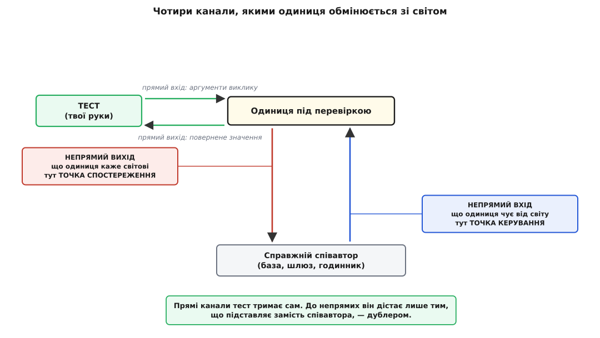

# Дублери: стаб, мок, фейк, спай

<preknowlist>
- [Модульний тест](topic:sf-release/unit-testing) — що таке одиниця перевірки й чому від тесту вимагають швидкості, ізоляції та повторюваності.
- [Впровадження залежностей](topic:sf-apps/dependency-injection) — залежність приходить ззовні, а не народжується всередині; без цього дубля нікуди вставити.
- [Інтерфейс проти реалізації](topic:sf-apps/interface-vs-implementation) — що саме обіцяє абстракція й чим обіцянка відрізняється від способу її виконати.
- [Проєктування за контрактом](topic:sf-release/design-by-contract) — передумова, постумова, інваріант: у чому полягає зобов'язання виклику.
- [Розділення команд і запитів](topic:sf-apps/command-query-separation) — виклик або повертає значення, або міняє світ; на цій різниці стоїть вибір способу перевірки.
</preknowlist>

Функцію, що рахує суму замовлення, перевірити легко: подав числа — звірив результат. Складно стає тоді, коли одиниця не рахує сама, а **розмовляє**: питає ціну в бази, шле листа, знімає гроші через платіжний шлюз, дивиться, котра година. Об'єкт, до якого одиниця звертається, щоб виконати свою роботу, називають її **співавтором (англ. *collaborator*)**.

Перша думка про співавторів — «вони повільні». Думка правильна, але дрібна. Ось вимога з живого технічного завдання: *якщо платіжний шлюз не відповів за дві секунди, замовлення не підтверджувати, а поставити в чергу на повтор*. Спробуй перевірити її на справжньому шлюзі. У нього немає ручки «а тепер відповідай таймаутом»: він відповідає, коли захоче, і майже завжди вчасно. Ти проженеш тест хоч тисячу разів і жодного разу не потрапиш у ту гілку, заради якої писав код. Швидкість тут ні до чого — бракує **керування**.

Друга половина біди дзеркальна. Візьми іншу вимогу: *після успішної оплати клієнтові йде лист із підтвердженням*. Надісланий лист — не значення, що звідкись повертається; це подія, яка сталася **назовні**. Усередині процесу від неї не лишається сліду: одиниця покликала чужий метод, той пішов у мережу — і все. Дивитися нема на що. Бракує **спостереження**.

Обидві потреби впираються в одне й те саме місце. Поки між одиницею й світом стоїть справжній співавтор, обидві ручки — і та, якою задають, що одиниця почує, і та, якою бачать, що вона сказала, — у нього, а не в тебе. Тому підміняють не задля швидкості. Підміняють, щоб забрати ці дві ручки собі.

## Куди підміну взагалі можна вставити

Підміна не з'являється в тесті — вона мусить бути передбачена в самому коді. Якщо всередині методу написано `new PostgresOrders()`, то жодним тестом ти цього рядка не обійдеш: одиниця сама породжує собі співавтора й не лишає нікому шпарини. А якщо сховище приходить параметром конструктора, шпарина є: підставляй що завгодно, аби воно тримало той самий інтерфейс.

Таке місце — де можна змінити поведінку програми, **не редагуючи саме це місце**, — Майкл Фізерс у книзі *Working Effectively with Legacy Code* (2004) назвав **швом (англ. *seam*)**. Різновиди швів, точки їх увімкнення й те, як шви прорізають у коді, який їх не має, розібрано в [тактиках тестовності](topic:sf-apps/testability-tactics). Тут важить один наслідок: **дублер живе рівно там, де є шов**, і ніде більше. Розмова про дублерів — це завжди наполовину розмова про будову коду.

## Чотири канали, якими одиниця обмінюється зі світом

Тепер придивімося, що саме дає підміна, — бо звідси, а не зі списку назв, виростає вся класифікація.

Розклади спілкування одиниці на канали, і їх виявиться чотири, а не два. **Прямі** канали видно з боку тесту: аргументи, які ти передав, і значення, яке повернулося. **Непрямі** проходять через співавтора: те, що одиниця від нього **чує** (відповідь на запит), і те, що вона йому **каже** (виклик, який щось міняє у світі). Цю пару назв — **непрямий вхід** і **непрямий вихід** — увів Джерард Мезарош у *xUnit Test Patterns: Refactoring Test Code* (Addison-Wesley, 2007), і разом із ними ще дві: місце, де тест керує непрямим входом, — **точка керування**, а місце, де він бачить непрямий вихід, — **точка спостереження**.



*Прямі канали тест тримає своїми руками. Непрямі проходять через співавтора — і дістатися до них можна лише одним способом: поставити на його місце щось своє.*

Ось чому таймаут шлюзу нездоланний, а надісланий лист невидимий: перше — це непрямий вхід без точки керування, друге — непрямий вихід без точки спостереження. Підставний співавтор дає і те, і те. Мезарош дав усьому підставному спільну назву — **тестовий дублер (англ. *test double*)**, і метафора тут пряма: кінодублер, каскадер, що заміщає актора там, де справжній актор не може або не має ризикувати.

## П'ять дублерів як відповіді на два питання

Слово «мок» у щоденній розмові проковтнуло всі підміни підряд, і плутанина ця не безневинна: різні дублери по-різному прив'язують тест до коду, і ціна помилки платиться потім, під час рефакторингу. Тому варто рознести їх точно — але не заучувати п'ять означень, а вивести їх із двох питань, які ти й так собі ставиш перед кожним тестом.

Питання перше: **чи треба керувати тим, що одиниця почує?** Відповіді три: не треба взагалі; треба, і вистачить заготованого; треба, і заготованого замало — потрібна справжня, хоч і спрощена, поведінка. Питання друге: **чи треба бачити те, що одиниця скаже?** Теж три: не треба; треба, але звірю сам після дії; треба, і хай підміна судить негайно, за очікуваннями, заданими наперед.

Перетни ці дві осі — і п'ять усталених назв стануть просто клітинками.


*Назви — не сходинки якості, а координати. Дублера обирають не за модою, а за тим, яка пара відповідей потрібна саме в цій перевірці.*

**Пустушка (англ. *dummy*)** не вміє нічого й на те й розрахована: вона затуляє параметр, якого цей тест не торкається. Її ніколи не питають і ніколи не звіряють; щойно тест починає в неї щось читати — це вже не пустушка.

**Заглушка (англ. *stub*, «затичка»; у жаргоні — «стаб»)** відповідає наперед заготованим. Вона віддає рівно те, що ти в неї вклав, і не має жодної думки про те, скільки разів її кликали. Це чиста точка керування: заглушка годує одиницю непрямим входом.

**Фейк (англ. *fake*)** — теж джерело непрямого входу, але робить це чесно: він **справді працює**, тільки на спрощеній основі. Сховище в пам'яті замість бази — канонічний фейк: `save` справді кладе, `find` справді знаходить. Різниця із заглушкою принципова: заглушка **віддає** те, що ти в неї заклав, фейк **робить** те, що робив би справжній.

**Шпигун (англ. *spy*; у жаргоні — «спай»)** додає точку спостереження: він тихо веде журнал викликів, а вирок виносиш ти сам, після дії, звичайним звірянням.

**Мок (англ. *mock*, «підробка, кривляння»)** відрізняється від шпигуна двома рисами. Очікування в нього закладають **до** дії, а не звіряють після. І судить він **сам**: несправджене чи зайве очікування валить тест його ж руками, часом просто в мить неправильного виклику.

Ці п'ять на робочому коді — з наскрізним прикладом сервісу замовлень і тестами, які видно рядок за рядком, — розібрано в [проєкті про п'ять дублерів](topic:sf-apps/testability-tactics/proj-test-doubles.md). У мовах, де підміну роблять не через віртуальний виклик, а на етапі компіляції, механіка інша й повчальна: як прорізають шов шаблонним параметром, скільки це коштує на гарячому шляху та як писати фейк і мок на C++, показано в [дублерах без віртуальних викликів](topic:sf-release/test-doubles/proj-cpp-doubles.md).

Не кожен співавтор — об'єкт із твого коду. Годинник, генератор випадкових чисел, змінна оточення, поточний каталог — теж джерела непрямого входу, тільки заховані за глобальними функціями. Виклик `now()` посеред логіки — це співавтор без шва: підмінити його нічим, і тест приречений залежати від того, коли його запустили. Ліки ті самі — зробити залежність явною, щоб у бою приходив системний годинник, а в тесті — керований; докладніше про самі пастки часу — у [прикладному часі](topic:sf-apps/time-and-scheduling).

## Що насправді доводить зелений тест із дублем

Тепер головне, і воно рідко проговорюється вголос. Тест із дублем прогнав **не ту** систему, яку ти збираєш у бою. Він прогнав іншу: ту саму одиницю, але в парі з підміною. Отже, зелений результат чесно доводить одне твердження — **одиниця працює з дублем**. А потрібне тобі інше — що одиниця працює зі справжнім.


*Перенесення висновку з верхнього рядка в нижній — окремий крок, і він законний лише за умови. Дубль — це записана гіпотеза про співавтора, а тест правдивий рівно настільки, наскільки правдива ця гіпотеза.*

Умова переносу формулюється точно: дубль мусить тримати **той самий контракт**, що й справжній, у тій його частині, якою одиниця користується. Не «бути схожим», не «мати ті самі методи», а поводитися так, щоб усе, на що одиниця має право розраховувати, лишалося правдою. Це та сама вимога, яку [поведінкова підтипізація](topic:sf-lang/behavioral-subtyping) ставить до будь-якої заміни: підміна не сміє вимагати від клієнта більше, ніж вимагав оригінал, і не сміє обіцяти менше, ніж він обіцяв. Дубль — це підтип, поставлений замість справжнього; коли він контракту не тримає, тест перевіряє вигадану систему.

А проривається ця умова буденно. Ось найчастіший випадок — і найпідступніший, бо тест виглядає бездоганно.

**Реєстрація користувача: пошта має бути унікальною.** Одиниця питає сховище, чи пошта вільна, і якщо вільна — зберігає. Фейк-сховище на звичайній мапі поводиться слухняно; справжня таблиця має обмеження унікальності й на повторний запис кидає помилку.

:::tabs
```ts
interface Users {
  findByEmail(email: string): Promise<User | undefined>;
  save(user: User): Promise<void>;     // справжня база: кидає UniqueViolation
}

class InMemoryUsers implements Users {             // ФЕЙК
  private readonly rows = new Map<string, User>();
  async findByEmail(email: string) { return this.rows.get(email); }
  async save(user: User) { this.rows.set(user.email, user); }   // тихо перезапише
}

async function register(email: string, users: Users): Promise<User> {
  if (await users.findByEmail(email)) throw new EmailTaken(email);
  const user = { id: newId(), email };
  await users.save(user);              // між перевіркою і записом — вікно
  return user;
}
```
```py
class InMemoryUsers:                                  # ФЕЙК
    def __init__(self) -> None:
        self._rows: dict[str, User] = {}

    async def find_by_email(self, email: str) -> "User | None":
        return self._rows.get(email)

    async def save(self, user: User) -> None:
        self._rows[user.email] = user                 # тихо перезапише

async def register(email: str, users: Users) -> User:
    if await users.find_by_email(email):
        raise EmailTaken(email)
    user = User(id=new_id(), email=email)
    await users.save(user)                            # між перевіркою і записом — вікно
    return user
```
:::

Тест зелений: перший виклик реєструє, другий кидає `EmailTaken`. У бою два запити приходять майже одночасно, обидва встигають дочекатися відповіді «пошта вільна» ще до того, як перший дійшов до `save`, — і другий дістає `UniqueViolation`, якої код не ловить, бо в тестах її ніколи не бувало. Помилка не в одиниці й не в тесті: **фейк не змоделював обмеження**, а разом із ним і цілу гілку поведінки. Зазор вірності проліг рівно там, де дубль виявився поблажливішим за справжнього.

Способів зробити дубля неправдивим небагато, і всі вони мають одну природу — дубль знає про співавтора менше, ніж співавтор знає про себе. Він **не вміє падати**, тому гілка помилки лишається неперевіреною, хоч тест на неї ніби є. Він **дозволяє заборонене** — порушену унікальність, запис поза транзакцією, виклик у неправильному порядку. Він **відстає**: справжній змінив поведінку, а дубль лишився вчорашнім і далі зеленіє. І найгірше — він **кодує здогад**, коли підміняють чуже: твій мок стороннього SDK записує не контракт того SDK, а твоє про нього уявлення, вичитане з документації, яка бреше в дрібницях.

Проти кожного з цих проривів є хід, і жоден із них не робиться в самому тесті з дублем.

Найсильніший — **один набір перевірок на обох**. Пишеш перелік тверджень про контракт сховища («після `save` знайдеться», «повторна пошта — помилка», «порожній запит — порожній результат») і ганяєш той самий перелік і на фейку, і на справжній базі. Фейк проходить за мілісекунди в кожному прогоні, справжня база — рідше й повільніше, але саме вона й ловить розбіжність. Так дубль перестає бути приватною вигадкою тесту й стає перевіреною реалізацією того самого контракту; докладніше — у [контрактних тестах](topic:sf-release/contract-testing).

Другий хід стосується чужого коду: **не став дубля прямо на сторонній API**. Обгорни його власним вузьким портом — таким, який описує потрібну **тобі** роль, а не весь чужий інтерфейс, — і дублюй уже свій порт. Правило «мокай лише те, чим володієш» сформулювали Стів Фрімен, Нат Прайс, Тім Мак-Кіннон і Джо Волнс у праці *Mock Roles, not Objects* (OOPSLA 2004) і розгорнули в книжці *Growing Object-Oriented Software, Guided by Tests* (2009). Причина проста: контракт власного порту ти визначаєш сам і тримаєш його правдивим, а контракт чужого — ні. Механіку такого обгортання описує [архітектура портів і адаптерів](topic:sf-apps/hexagonal-architecture).

Третій — просто визнати, що **фейк є виробничим кодом**. У ньому є логіка, отже, в ньому є помилки; він заслуговує власних тестів і власного супроводу нарівні з рештою.

І чесна межа, яку не обійти жодним прийомом: **дубль не вміє засвідчити сам себе**. Хоч скільки тестів із дублями зеленітиме, жоден із них не скаже, що дубль правдивий, — на це здатен лише прогін проти справжнього співавтора, тобто [інтеграційний тест](topic:sf-release/integration-testing) на межі системи. Дублери не заміняють таких прогонів; вони лише роблять так, щоб дорогих прогонів вистачало кілька, а не тисячі.

Звідси наслідок, протилежний до звички: **найдешевший спосіб не мати зазору вірності — не мати дубля**. Співавтор швидкий, передбачуваний і нічого незворотного не робить — бери справжнього. Таким є майже весь твій власний код по цей бік межі: калькулятор суми, політика знижки, валідатор. Підміна на ньому не купує нічого — керування ти й так маєш, бо це твій код, — а платиш двічі: зазором вірності й зчепленням тесту з тим, як саме ти нарізав класи. Дублери належать **межі зі світом**: мережі, базі, годиннику, грошам, пошті. Там справжній співавтор або дорогий, або недетермінований, або незворотний, і підміна купує щось, чого інакше не дістати.

> 🔧 **Навіщо це.** Коли тест зелений, а в бою те саме місце падає, шукай не в одиниці — шукай **різницю між дублем і справжнім**. Практично: випиши, чим справжній співавтор має право відповісти (помилка, порожнеча, повільність, відмова в записі), і спитай про кожен пункт — чи вміє це твій дубль. Кожне «не вміє» — це гілка коду, яку тести не бачили жодного разу, хоч покриття показує зелень.

## Що звіряти: стан чи взаємодію — і чим за це платять

Друге рішення, яке дублер тягне за собою, — не «кого підставити», а «на що дивитися після дії». Тут два способи, і вибирає між ними не смак, а природа співавтора.

Якщо виклик **запитує** — повертає значення й нічого назовні не міняє, — його природний слід у **результаті**: у поверненому значенні чи в стані, що осів. Тоді співавтора заглушують і звіряють **стан**. Питати «а чи покликали `priceOf`?» безглуздо: важить не виклик, а порахована сума. Якщо виклик **наказує** — уся його суть у зовнішній дії, якої зсередини процесу не спостерегти, — то єдине спостережуване тут і є сам факт правильного виклику. Тоді ставлять шпигуна чи мок і звіряють **взаємодію**. Ця межа тримається на [розділенні команд і запитів](topic:sf-apps/command-query-separation): доки виклик або питає, або наказує, спосіб перевірки випадає з його природи однозначно; виклик, що робить одразу те й те, залишає тебе без ясної відповіді — і це вже сигнал про сам інтерфейс.

Різницю між двома школами перевірки різко провів Мартін Фаулер у статті «Mocks Aren't Stubs» (опублікована 8 липня 2004-го, істотно перероблена 2 січня 2007-го): **класична** школа звіряє стан і бере справжні об'єкти всюди, де це дешево, **мокістська** звіряє взаємодію й підставляє дублі на кожного співавтора. Фаулер згадує й прізвиська — «детройтська» проти «лондонської»: перша від початкового проєкту C3 у Детройті, де народилося екстремальне програмування, друга від лондонських розробників, що першими розвинули мокістський стиль. Історію самих моків — від доповіді *Endo-Testing: Unit Testing with Mock Objects* на конференції XP2000 до бібліотек, що зробили їх щоденним інструментом, — розказано в [народженні моків](topic:sf-release/test-doubles/hist-mock-objects.md).

Плата за перевірку взаємодії конкретна. **Кожне очікування — це записана обіцянка не міняти цю деталь.** Твердження про стан каже, **що** система зробила; твердження про виклик каже, **як** вона це зробила, — а «як» рефакторинг має право міняти вільно, доки «що» стале. Ось та сама перевірка, записана двома способами:

```ts
// Крихко: тест заморозив і кількість звернень, і точний вигляд аргументу
expect(gateway.charge).toHaveBeenCalledTimes(1);
expect(gateway.charge).toHaveBeenCalledWith(
  { amount: 59000, currency: "UAH", idempotencyKey: "ORD-7:1" });

// Стійко: тест вимагає рівно того, що обіцяно контрактом
const [charge] = gateway.charges;
expect(charge.amount).toBe(59000);
expect(charge.idempotencyKey).toBeTruthy();   // ключ є — вигляд його не наш клопіт
```

Перший варіант упаде, щойно ти зміниш формат ключа ідемпотентності з `ORD-7:1` на UUID — хоч поведінка, яку бачить клієнт, не зміниться ані на йоту. Другий переживе цю зміну, бо звіряє те, що справді обіцяно: гроші зняли раз, на потрібну суму, з ключем, що захищає від повтору. Різниця не косметична: перший тест зчепив себе з внутрішнім рішенням, яке ніхто нікому не обіцяв, — і тепер це рішення не змінити безкоштовно. Помножена на сотні тестів, ця дрібниця перетворюється на набір, що червоніє від кожного рефакторингу й не ловить жодної справжньої помилки; такий набір команда зрештою просто перестає читати.

Звідси робоче правило, що складає обидва рішення докупи: **бери найслабший дубль, який дає потрібне керування чи спостереження, і звіряй рівно те, що обіцяно контрактом**. Церемонія й зчеплення ростуть уздовж ряду пустушка → заглушка → фейк → шпигун → мок; мок там, де вистачило б заглушки, — це куплена задарма крихкість. І окремо про звичну пастку інструмента: `jest.fn()`, `unittest.mock.Mock` чи `Mockito` — це знаряддя, а не роль. Один і той самий об'єкт без відповіді працює шпигуном, із заданою відповіддю — заглушкою, а з `toHaveBeenCalledWith` — уже перевіркою взаємодії. Роль вирішуєш ти, а не бібліотека.

## Дубль як інструмент проєктування

Лишається поворот, через який дублери взагалі здобули таку вагу. Праця *Mock Roles, not Objects* казала не «як підмінити наявний клас», а щось несподіване: підміняй **роль**, якої ти потребуєш, — навіть якщо об'єкта, що її виконує, ще не існує. Пишучи тест на одиницю раніше за її співавторів, ти змушений назвати, **чого саме** від них хочеш: не «весь інтерфейс бази», а «дай мені знайти користувача за поштою». Так інтерфейс народжується з боку **клієнта**, а не з боку реалізації, і виходить вужчим та чеснішим, ніж якби його виводили з можливостей бази.

Тому дублер — ще й вимірювальний прилад для дизайну, і показання його читаються прямо. Знадобилося п'ять дублів на одну одиницю — у неї забагато співавторів, і ділити треба клас, а не додавати шостий мок. Кортить підмінити половину самої одиниці, лишивши другу справжньою, — межа проведена не там: те, що ти хочеш підмінити, просилося окремим об'єктом. Дубля нікуди вставити — немає шва, і це не проблема тесту, а проблема залежності, схованої всередині. Саме цей зворотний зв'язок робить дублерів частиною [розробки через тести](topic:sf-release/test-driven-development), а не лише способом обійти повільну базу.

## Синтез

Дублер — не дешева копія співавтора й не спосіб прискорити прогін. Це **виконуваний запис того, у що ти віриш щодо співавтора**: заглушка каже «він може відповісти отак», фейк — «він поводиться отак», мок — «він мусить отримати саме це». Тест бере цей запис на віру й будує на ньому свій вирок, а тому правдивий рівно настільки, наскільки правдивий запис.

Отже, справжнє питання не «мокати чи не мокати» і навіть не «який із п'яти взяти». Воно таке: **яку частину контракту співавтора я беру на віру — і чим я цю віру перевірю?** Усе, що дублери вміють, — це перенести перевірку з дорогого місця в дешеве. Але місце, де віру таки звіряють зі світом, мусить лишитися хоч одне: контрактний набір, що ганяється на дублі й на справжньому, або прогін на межі. Прибери його — і в тебе не набір тестів, а тисяча зелених тверджень про систему, якої ти не збираєш.
