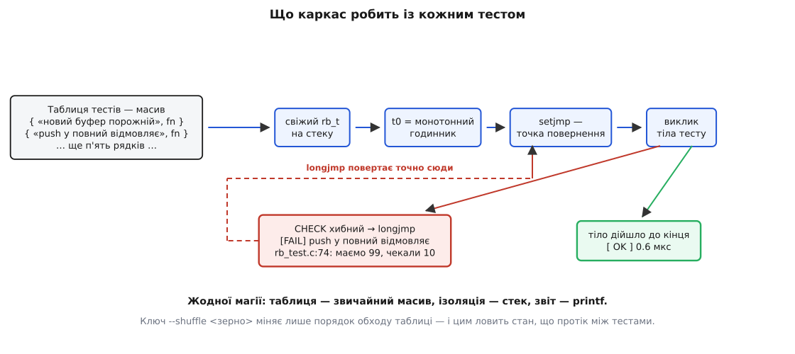
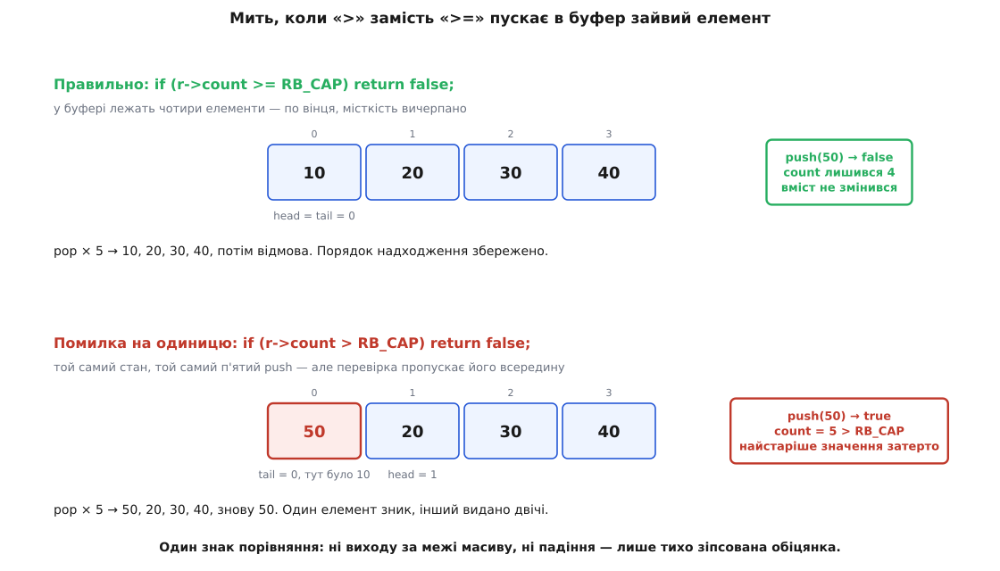

# ⚙️ Кільцевий буфер, помилка на одиницю і каркас тестів на сто рядків

Зберімо поруч дві робочі речі: драйверний кільцевий буфер на C, у якому живе одна справжня помилка на межі заповнення, і власний каркас, що ганяє тести, — щоб побачити зсередини, з чого взагалі складається такий інструмент і як червоне світло звужується від назви тесту до одного рядка коду. Каркас тут не іграшковий макет, а те саме, що роблять справжні: таблиця реєстрації, свіжий стан на кожен тест, зупинка на першому провалі, звіт із місцем падіння й секундомір на кожному прогоні.

## Задача

Потрібен буфер сталої місткості між обробником переривання, який приймає відліки з давача тиску, і повільним споживачем, що їх розбирає. Сама структура тут не головна — її будову й три способи розрізнити повний буфер від порожнього розібрано окремо, у статті про [кільцевий буфер](topic:sf-algorithms/ring-buffer). Нам вона потрібна як **одиниця з чіткою обіцянкою назовні**:

- `rb_push` кладе відлік у хвіст; коли місця немає — **відмовляє й нічого не міняє**;
- `rb_pop` віддає відліки **в порядку надходження**; коли буфер порожній — відмовляє й не чіпає вихідну змінну;
- `rb_count` каже, скільки лежить зараз, і ніколи не перевищує місткості.

Три речення — і жодного слова про `head`, `tail` чи остачу від ділення. Це і є та межа, по якій ітимуть тести.

Другу річ — каркас — доведеться написати самому, і не з упертості. Готовий каркас виглядає як магія: пишеш функцію з дивним макросом угорі, а звідкись береться звіт. Магії там немає, і сто рядків коду це доводять: усе, що відбувається між «запустив» і «побачив червоне», складається з таблиці, циклу, годинника й одного нелокального переходу.

## Одиниця під тестом

Заголовок описує тільки обіцянку. Місткість винесена в макрос, який тестова збірка може підмінити, — інакше до межі заповнення довелося б добиратися двома сотнями викликів замість чотирьох.

```c
/* rb.h — обіцянка назовні, і більше нічого */
#ifndef RB_H
#define RB_H

#include <stdbool.h>
#include <stddef.h>

#ifndef RB_CAP
#  define RB_CAP 256u          /* у прошивці 256; тестова збірка ставить своє */
#endif
_Static_assert((RB_CAP & (RB_CAP - 1u)) == 0u, "RB_CAP має бути степенем двійки");

typedef struct {
    int    data[RB_CAP];
    size_t head;               /* куди писати наступний  */
    size_t tail;               /* звідки читати наступний */
    size_t count;              /* скільки лежить зараз    */
} rb_t;

void   rb_init (rb_t *r);
bool   rb_push (rb_t *r, int x);        /* false — повний, вміст не змінено */
bool   rb_pop  (rb_t *r, int *out);     /* false — порожній, *out не чіпано */
size_t rb_count(const rb_t *r);

#endif
```

Перевірка `_Static_assert` тут не прикраса: далі індекс братимуть маскою, а маска працює лише для степеня двійки. Помилку такого роду [ловлять на етапі компіляції](topic:sf-lang/static-assert), бо в рантаймі вона просто мовчки дасть неправильну адресу.

Реалізація — двадцять рядків, які написав хтось із команди й на які ніхто не дивився пильно:

```c
/* rb.c */
#include "rb.h"

void rb_init(rb_t *r) { r->head = 0; r->tail = 0; r->count = 0; }

bool rb_push(rb_t *r, int x) {
    if (r->count > RB_CAP) return false;
    r->data[r->head] = x;
    r->head = (r->head + 1u) % RB_CAP;
    r->count++;
    return true;
}

bool rb_pop(rb_t *r, int *out) {
    if (r->count == 0u) return false;
    *out = r->data[r->tail];
    r->tail = (r->tail + 1u) % RB_CAP;
    r->count--;
    return true;
}

size_t rb_count(const rb_t *r) { return r->count; }
```

Помилка тут є, і вона одна. Шукати її очима — не наше завдання: нехай її назве прогін.

## Каркас: із чого складається інструмент

Каркас має вміти рівно чотири речі, і кожна випливає з попередньої.

**Знати, які тести існують.** Отже, потрібен список. У C немає нічого, що само збирало б функції докупи, тож список — це масив структур, який пишуть руками. Кожен запис тримає **обіцянку людською мовою** й покажчик на тіло тесту. Саме обіцянка, а не ім'я функції: в ідентифікатор C речення не влазить, а звіт має читатися без відкривання коду.

**Дати кожному тестові свіжий світ.** Тут C робить подарунок задарма: якщо стан тесту оголошений як звичайна змінна в тілі функції, він народжується на стеку на вході й помирає на виході. Ніякого «прибирання» не треба — треба лише не заводити нічого статичного.

**Зупинити тест на першому провалі, але не зупинити набір.** Твердження, що не справдилося, робить решту тесту безглуздою: далі підуть похідні від зіпсованого стану. Але сусідні тести ні до чого й мусять доїхати. Потрібен спосіб вискочити з глибини викликів одразу назовні — [нелокальний перехід](topic:sf-lang/nonlocal-jump): `setjmp` запам'ятовує точку в стеку, `longjmp` повертає виконання туди з будь-якої глибини. Це рівно те, на чому тримаються справжні каркаси для C: в Unity макрос `TEST_PROTECT()` розкривається в `setjmp(Unity.AbortFrame) == 0`, а `TEST_ABORT()` — у `longjmp(Unity.AbortFrame, 1)`.

**Сказати, скільки це коштувало.** Годинник — монотонний, а не настінний: тривалість, поміряну годинником, який може стрибнути назад від синхронізації часу, читати не можна ([монотонний проти настінного](topic:sf-apps/monotonic-vs-wall-time)).

Ось заголовок каркаса цілком.

```c
/* tinytest.h — увесь каркас: одна структура, три макроси, один прогін */
#ifndef TINYTEST_H
#define TINYTEST_H

#include <setjmp.h>
#include <stddef.h>
#include <stdint.h>
#include <stdio.h>

typedef void (*tt_fn)(void);

typedef struct {
    const char *promise;       /* обіцянка людською мовою — вона піде у звіт */
    tt_fn       body;
} tt_case;

extern jmp_buf     tt_abort;
extern const char *tt_file;
extern int         tt_line;
extern char        tt_msg[192];

_Noreturn void tt_fail(const char *file, int line);

#define CHECK(cond)                                                        \
    do {                                                                   \
        if (!(cond)) {                                                     \
            snprintf(tt_msg, sizeof tt_msg, "CHECK(%s)", #cond);           \
            tt_fail(__FILE__, __LINE__);                                   \
        }                                                                  \
    } while (0)

#define CHECK_EQ_INT(actual, expected)                                     \
    do {                                                                   \
        long tt_a = (long)(actual), tt_e = (long)(expected);               \
        if (tt_a != tt_e) {                                                \
            snprintf(tt_msg, sizeof tt_msg,                                \
                     "%s: маємо %ld, чекали %ld  (%s)",                    \
                     #actual, tt_a, tt_e, #expected);                      \
            tt_fail(__FILE__, __LINE__);                                   \
        }                                                                  \
    } while (0)

int tt_run(const tt_case *cases, size_t n, uint32_t seed);

#endif
```

Два макроси замість одного — не надмірність, а прямий наслідок того, чим каркас володіє. `CHECK` бачить лише **текст** умови: він може надрукувати `CHECK(x == 10)`, але не те, чим `x` виявився насправді. `CHECK_EQ_INT` бере обидві сторони окремо й тому друкує значення — а це різниця між звітом, після якого треба лізти в налагоджувач, і звітом, після якого все зрозуміло з першого погляду.

Тіло каркаса.

```c
/* tinytest.c */
#include "tinytest.h"
#include <stdlib.h>

#if defined(_WIN32)
#  include <windows.h>
static double now_us(void) {
    static LARGE_INTEGER f;
    LARGE_INTEGER t;
    if (f.QuadPart == 0) QueryPerformanceFrequency(&f);
    QueryPerformanceCounter(&t);
    return (double)t.QuadPart * 1e6 / (double)f.QuadPart;
}
#else
#  include <time.h>
static double now_us(void) {
    struct timespec ts;
    clock_gettime(CLOCK_MONOTONIC, &ts);
    return (double)ts.tv_sec * 1e6 + (double)ts.tv_nsec / 1e3;
}
#endif

jmp_buf     tt_abort;
const char *tt_file;
int         tt_line;
char        tt_msg[192];

_Noreturn void tt_fail(const char *file, int line) {
    tt_file = file;
    tt_line = line;
    longjmp(tt_abort, 1);
}

/* Власний генератор, а не rand(): те саме зерно мусить давати той самий
   порядок на будь-якій машині, інакше «відтвори падіння» не працює. */
static uint32_t rnd(uint32_t *s) {
    uint32_t x = *s;
    x ^= x << 13;
    x ^= x >> 17;
    x ^= x << 5;
    return *s = x;
}

/* Єдине місце з setjmp — і воно навмисно крихітне: тут немає жодної
   локальної змінної, яка міняється між стрибком і поверненням, тож
   питання «чи вціліло її значення» просто не виникає. */
static int run_one(const tt_case *c, double *us) {
    double t0 = now_us();
    int    bad;
    if (setjmp(tt_abort) == 0) { c->body(); bad = 0; }
    else                       {            bad = 1; }
    *us = now_us() - t0;
    return bad;
}

/* printf рахує байти, а не літери: кирилична літера — два байти, тож
   "%-44s" пустив би стовпчики врозтіч. Рахуємо початки літер самі. */
static void print_padded(const char *s, int width) {
    const unsigned char *p = (const unsigned char *)s;
    int chars = 0;
    fputs(s, stdout);
    for (; *p; p++)
        if ((*p & 0xC0) != 0x80) chars++;
    for (; chars < width; chars++) putchar(' ');
}

int tt_run(const tt_case *cases, size_t n, uint32_t seed) {
    size_t *order = malloc(n * sizeof *order);
    size_t  i, k, failed = 0;
    double  total = 0.0;

    if (order == NULL) return 2;
    for (i = 0; i < n; i++) order[i] = i;

    if (seed != 0) {                          /* перемішування Фішера — Єйтса */
        uint32_t s = seed;
        for (i = n; i > 1; i--) {
            size_t j = (size_t)(rnd(&s) % (uint32_t)i);
            size_t t = order[i - 1];
            order[i - 1] = order[j];
            order[j] = t;
        }
    }

    for (k = 0; k < n; k++) {
        const tt_case *c = &cases[order[k]];
        double us;
        int    bad = run_one(c, &us);

        fputs(bad ? "[FAIL] " : "[ OK ] ", stdout);
        print_padded(c->promise, 44);
        printf("%7.1f мкс\n", us);
        if (bad) {
            printf("        %s:%d: %s\n", tt_file, tt_line, tt_msg);
            failed++;
        }
        total += us;
    }

    printf("\n%zu тестів, %zu провалів, %.1f мкс усього, %.2f мкс на тест\n",
           n, failed, total, total / (double)n);
    free(order);
    return failed != 0;                       /* код виходу побачить складач */
}
```



*Увесь інструмент — це цикл по масиву. Ізоляцію дає стек, зупинку на першому провалі — нелокальний перехід, звіт — `printf`. Ключ `--shuffle` міняє лише порядок обходу таблиці, і саме цим виявиться корисним.*

Останній рядок `tt_run` заслуговує окремої уваги: ненульовий код виходу — це єдине, чим набір говорить із машиною. [Складач у неперервній інтеграції](topic:sf-release/ci-cd) не читає гарний звіт; він дивиться на код повернення. Каркас, який красиво друкує провали й повертає нуль, у конвеєрі мовчить.

## Обіцянки, записані тестами

Тепер найголовніше: кожна обіцянка з розділу «Задача» стає одним тестом, і жоден тест не заглядає всередину структури.

```c
/* rb_test.c */
#include "tinytest.h"
#include "rb.h"
#include <stdlib.h>
#include <string.h>

static void new_buffer_is_empty(void) {
    rb_t rb; rb_init(&rb);
    int  x = -1;
    CHECK_EQ_INT(rb_count(&rb), 0);
    CHECK(rb_pop(&rb, &x) == false);
    CHECK_EQ_INT(x, -1);                       /* відмова нічого не пише */
}

static void fifo_order(void) {
    rb_t rb; rb_init(&rb);
    int  x = 0;
    CHECK(rb_push(&rb, 10));
    CHECK(rb_push(&rb, 20));
    CHECK(rb_push(&rb, 30));
    CHECK(rb_pop(&rb, &x));  CHECK_EQ_INT(x, 10);
    CHECK(rb_pop(&rb, &x));  CHECK_EQ_INT(x, 20);
    CHECK(rb_pop(&rb, &x));  CHECK_EQ_INT(x, 30);
    CHECK_EQ_INT(rb_count(&rb), 0);
}

static void holds_exactly_cap(void) {
    rb_t rb; rb_init(&rb);
    for (int i = 0; i < (int)RB_CAP; i++)
        CHECK(rb_push(&rb, i));
    CHECK_EQ_INT(rb_count(&rb), RB_CAP);
}

static void push_on_full_is_rejected(void) {
    rb_t rb; rb_init(&rb);
    for (int i = 0; i < (int)RB_CAP; i++) rb_push(&rb, i);
    CHECK(rb_push(&rb, 99) == false);
    CHECK_EQ_INT(rb_count(&rb), RB_CAP);
}

static void rejected_push_keeps_contents(void) {
    rb_t rb; rb_init(&rb);
    int  x = 0;
    for (int i = 0; i < (int)RB_CAP; i++) rb_push(&rb, 10 * (i + 1));
    rb_push(&rb, 99);                          /* мусить бути відкинутий */
    for (int i = 0; i < (int)RB_CAP; i++) {
        CHECK(rb_pop(&rb, &x));
        CHECK_EQ_INT(x, 10 * (i + 1));
    }
    CHECK(rb_pop(&rb, &x) == false);
}

static void pop_on_empty_writes_nothing(void) {
    rb_t rb; rb_init(&rb);
    int  x = 777;
    CHECK(rb_pop(&rb, &x) == false);
    CHECK_EQ_INT(x, 777);
}

static void pop_frees_a_slot(void) {
    rb_t rb; rb_init(&rb);
    int  x = 0;
    for (int i = 0; i < (int)RB_CAP; i++) rb_push(&rb, i);
    CHECK(rb_pop(&rb, &x));  CHECK_EQ_INT(x, 0);
    CHECK(rb_push(&rb, 42));                   /* місце звільнилося */
    CHECK_EQ_INT(rb_count(&rb), RB_CAP);
}

static const tt_case CASES[] = {
    { "новий буфер порожній",             new_buffer_is_empty },
    { "віддає в порядку надходження",     fifo_order },
    { "вміщає рівно RB_CAP елементів",    holds_exactly_cap },
    { "push у повний буфер відмовляє",    push_on_full_is_rejected },
    { "відмова не псує вмісту",           rejected_push_keeps_contents },
    { "pop із порожнього нічого не пише", pop_on_empty_writes_nothing },
    { "після pop звільняється місце",     pop_frees_a_slot },
};

int main(int argc, char **argv) {
    uint32_t seed = 0;                         /* 0 — не перемішувати */
    if (argc == 3 && strcmp(argv[1], "--shuffle") == 0)
        seed = (uint32_t)strtoul(argv[2], NULL, 10);
    return tt_run(CASES, sizeof CASES / sizeof CASES[0], seed);
}
```

Зверніть увагу на дві дрібниці, які насправді не дрібниці. Перша: `rb_t rb;` — звичайна змінна в тілі функції, і цього досить, щоб кожен тест дістав власний буфер. Друга: жоден тест не пише `rb.head` чи `rb.count` — вони питають `rb_count()`. Ціна цієї стриманості з'ясується згодом.

## Червоне світло називає рядок

```
cc -std=c11 -O2 -Wall -Wextra -DRB_CAP=4 rb.c tinytest.c rb_test.c -o rb_test
./rb_test
```

Місткість у тестовій збірці — чотири, і це не «спрощення для прикладу». Межа заповнення при 256 комірках лежить за 257 викликами, тобто перевірити її можна тільки циклом, а цикл у звіті означає «щось зламалося на якійсь ітерації». Параметр, який тестова збірка може підкрутити, — теж шов: він підводить межу впритул до перевірки.

```
[ OK ] новий буфер порожній                            0.4 мкс
[ OK ] віддає в порядку надходження                    0.6 мкс
[ OK ] вміщає рівно RB_CAP елементів                   0.5 мкс
[FAIL] push у повний буфер відмовляє                   0.7 мкс
        rb_test.c:58: CHECK(rb_push(&rb, 99) == false)
[FAIL] відмова не псує вмісту                          0.9 мкс
        rb_test.c:71: x: маємо 99, чекали 10  (10 * (i + 1))
[ OK ] pop із порожнього нічого не пише                0.3 мкс
[ OK ] після pop звільняється місце                    0.6 мкс

7 тестів, 2 провали, 4.0 мкс усього, 0.57 мкс на тест
```

Тепер ланцюг звуження, заради якого все й будувалося, проходиться за три кроки — і жоден із них не потребує здогадок.

**Червоне світло називає тест.** Не «щось не так у прошивці», а два конкретні рядки звіту з двох конкретних обіцянок.

**Тест називає обіцянку.** «Push у повний буфер відмовляє» — і одразу видно, що зламано не читання, не порядок і не лічильник, а поведінка **рівно на межі заповнення**. Другий провал додає різкості: перший вийнятий елемент виявився не десяткою, а дев'яносто дев'яткою — тобто відкинутий відлік не просто прослизнув усередину, а **затер найстаріший**.

**Обіцянка називає рядок.** Єдина функція, що вирішує, чи є місце, — це `rb_push`, і рішення в ній ухвалює один рядок: `if (r->count > RB_CAP)`. Коли `count` уже дорівнює `RB_CAP`, буфер повний по вінця, а умова `4 > 4` хибна — і функція пускає п'ятий відлік усередину. Треба `>=`.



*Наслідок одного знака порівняння: `head` уже загорнувся на нуль, тож зайвий запис лягає точно на найстаріше значення. Виходу за межі масиву немає, падіння немає — тільки тихо зіпсована обіцянка й `count`, що переріс місткість.*

Останнє тут важливе окремо. Помилка не виходить за межі масиву — `head` завжди в діапазоні `0…RB_CAP−1`. Отже, її не спіймають [санітайзери пам'яті](topic:sf-release/address-sanitizer), не спіймає падіння, не спіймає рев'ю, яке дивиться на «чи немає тут переповнення буфера». Вона видима **тільки через поведінку**: з буфера вийшло не те, що в нього клали.

> 🔧 **Навіщо це.** Прогін тривав чотири мікросекунди й закінчився двома реченнями українською, кожне з яких — зламана обіцянка з місцем падіння. Порівняйте з тим, як цю саму помилку знаходять без тестів: у прошивці вона прокидається лише тоді, коли споживач забарився і буфер устиг набратися вщерть, — тоді найстаріший відлік зникає, а найновіший приходить двічі; тиск у графіку смикається раз на кілька годин, і хтось три дні вивчає журнал, підозрюючи сам давач.

Правимо `>` на `>=` — і той самий прогін:

```
[ OK ] новий буфер порожній                            0.4 мкс
[ OK ] віддає в порядку надходження                    0.6 мкс
[ OK ] вміщає рівно RB_CAP елементів                   0.5 мкс
[ OK ] push у повний буфер відмовляє                   0.5 мкс
[ OK ] відмова не псує вмісту                          0.8 мкс
[ OK ] pop із порожнього нічого не пише                0.3 мкс
[ OK ] після pop звільняється місце                    0.6 мкс

7 тестів, 0 провалів, 3.7 мкс усього, 0.53 мкс на тест
```

## Що показує секундомір

Пів мікросекунди на тест — це не привід для гордості, а **вимірювальний прилад**. Ось що з ним робити.

**Умова: бюджет із розрахунку «8000 тестів мусять укластися в 10 секунд».**

```
бюджет на один тест   = 10 000 мс / 8000 = 1.25 мс = 1250 мкс
маємо                 = 0.53 мкс
частка бюджету        = 0.53 / 1250 ≈ 1/2400

8000 таких тестів     = 8000 · 0.53 мкс = 4240 мкс ≈ 4.2 мс
```

Запас у дві з половиною тисячі разів означає просту річ: доки тест лишається в пам'яті, про його час можна взагалі не думати. Цікаво стає, коли він перестає там лишатися. Допишімо тест, що виглядає цілком невинно, — перевірку, що драйвер дописує рядок у свій журнал:

```
[ OK ] журнал драйвера дописується у файл           1913.4 мкс
[ OK ] новий буфер порожній                            0.4 мкс
```

```
один такий тест = 1913.4 / 0.53 ≈ 3600 звичайних
8000 таких      = 8000 · 1.9134 мс ≈ 15.3 с
```

Прилад спрацював. Число `1913.4` — не «трохи повільніше»; це на три з половиною порядки більше, і воно однозначно каже, що всередину тесту потрапило щось із зовнішнього світу: справжній файл, справжній диск, справжнє чекання. Далі є два чесні виходи — підставити [дублер](topic:sf-release/test-doubles) замість файлової системи або визнати, що цей тест перевіряє стик із диском і належить до іншого, повільнішого шару набору. Немає лише третього виходу: лишити його серед швидких і не помітити, як через рік набір іде хвилину.

Чого секундомір **не** робить: він не є вимірювачем швидкодії. Одноразовий прогін тіла на пів мікросекунди — це переважно шум планувальника й самого годинника, а на `-O2` компілятор ще й може згорнути частину тесту. Ці числа корисні як пожежна сигналізація («тест раптом подорожчав у тисячу разів»), а не як [профіль](topic:sf-release/profiling).

## Три пастки, які видно тільки на живому коді

### Статична змінна, що протікає між тестами

Драйверу знадобилася діагностика: скільки відліків утрачено через переповнення. Найкоротший спосіб — лічильник у модулі:

```c
/* rb.c */
static size_t g_dropped;                  /* «ну це ж просто лічильник» */

bool rb_push(rb_t *r, int x) {
    if (r->count >= RB_CAP) { g_dropped++; return false; }
    ...
}

size_t rb_dropped(void) { return g_dropped; }
```

І тест до нього, восьмий у таблиці, поставлений першим рядком:

```c
static void refused_push_is_counted(void) {
    rb_t rb; rb_init(&rb);
    for (int i = 0; i < (int)RB_CAP; i++) rb_push(&rb, i);
    rb_push(&rb, 99);
    CHECK_EQ_INT(rb_dropped(), 1);
}
```

Прогін зелений — усі вісім:

```
[ OK ] відмовлений push потрапляє в лічильник          0.5 мкс
[ OK ] новий буфер порожній                            0.4 мкс
[ OK ] віддає в порядку надходження                    0.6 мкс
[ OK ] вміщає рівно RB_CAP елементів                   0.5 мкс
[ OK ] push у повний буфер відмовляє                   0.5 мкс
[ OK ] відмова не псує вмісту                          0.8 мкс
[ OK ] pop із порожнього нічого не пише                0.3 мкс
[ OK ] після pop звільняється місце                    0.6 мкс

8 тестів, 0 провалів, 4.2 мкс усього, 0.53 мкс на тест
```

Тепер той самий набір, той самий код — інший порядок:

```
$ ./rb_test --shuffle 1

[ OK ] віддає в порядку надходження                    0.6 мкс
[ OK ] push у повний буфер відмовляє                   0.5 мкс
[ OK ] відмова не псує вмісту                          0.8 мкс
[ OK ] після pop звільняється місце                    0.6 мкс
[FAIL] відмовлений push потрапляє в лічильник          0.5 мкс
        rb_test.c:84: rb_dropped(): маємо 3, чекали 1  (1)
[ OK ] pop із порожнього нічого не пише                0.3 мкс
[ OK ] вміщає рівно RB_CAP елементів                   0.5 мкс
[ OK ] новий буфер порожній                            0.4 мкс

8 тестів, 1 провал, 4.2 мкс усього, 0.53 мкс на тест
```

Трійка замість одиниці — це не загадка: два тести, що бігли раніше, теж уперлися в повний буфер, і кожен додав по одиниці. `rb_t` на стеку помирає разом із тестом, а `g_dropped` — ні: він живе стільки, скільки процес.

Спокуса тут — залатати тест: скинути лічильник перед перевіркою або зафіксувати порядок і ніколи не перемішувати. Обидва латання ховають справжню знахідку. **Лічильник глобальний, а буферів у прошивці два** — один на порт давача, другий на радіоканал. Вони вже ділять один лічильник утрат, і в діагностиці це прямо неправда: побачивши «втрачено 40», інженер не дізнається, на якому з двох. Тест не «зламався від порядку» — він знайшов [глобальний стан](topic:sf-apps/global-state) у коді, там, де його не мало бути.

Тому правильна правка — перенести лічильник у структуру:

```c
typedef struct {
    int    data[RB_CAP];
    size_t head, tail, count;
    size_t dropped;                        /* свій на кожен буфер */
} rb_t;

size_t rb_dropped(const rb_t *r) { return r->dropped; }
```

Після цього тест зеленіє за будь-якого порядку, бо скидати вже нічого: `rb_init` і є скиданням. А перемішування залишається в каркасі назавжди — воно коштує п'ять рядків і є єдиним автоматичним детектором цього класу помилок.

### Тест, що тримається за нутрощі

Другий тест виглядає навіть ретельнішим за решту — він перевіряє, що індекси після загортання стали правильні:

```c
/* ТАК РОБИТИ НЕ ТРЕБА */
static void internals_after_wraparound(void) {
    rb_t rb; rb_init(&rb);
    int i, x;
    for (i = 0; i < (int)RB_CAP; i++) rb_push(&rb, i);
    for (i = 0; i < (int)RB_CAP; i++) rb_pop(&rb, &x);
    rb_push(&rb, 7);
    rb_push(&rb, 8);
    CHECK_EQ_INT(rb.head,  2);
    CHECK_EQ_INT(rb.tail,  0);
    CHECK_EQ_INT(rb.count, 2);
}
```

Він зелений. Він навіть правильний. А тепер до буфера доходять руки з іншого боку: лічильники за модулем заважають зробити доступ без замка, і структуру переписують на монотонні лічильники — ті, що ніколи не загортаються, а зайнятість дають різницею.

```c
typedef struct {
    int      data[RB_CAP];
    uint32_t written;                      /* скільки всього покладено */
    uint32_t read;                         /* скільки всього забрано  */
    uint32_t dropped;
} rb_t;

#define RB_IDX(pos) ((size_t)((pos) & (RB_CAP - 1u)))

void rb_init(rb_t *r) { r->written = 0; r->read = 0; r->dropped = 0; }

bool rb_push(rb_t *r, int x) {
    if (r->written - r->read >= RB_CAP) { r->dropped++; return false; }
    r->data[RB_IDX(r->written)] = x;
    r->written++;
    return true;
}

bool rb_pop(rb_t *r, int *out) {
    if (r->written == r->read) return false;
    *out = r->data[RB_IDX(r->read)];
    r->read++;
    return true;
}

size_t rb_count(const rb_t *r) { return (size_t)(r->written - r->read); }
```

Різниця `written − read` рахується в беззнакових числах, тому лишається правильною навіть у мить, коли лічильник перевалює через свою стелю; чому саме — з інваріантами й доведенням — розібрано в [індексній арифметиці кільця](topic:sf-algorithms/ring-buffer/math-ring-buffer-indexing.md).

Обіцянка не змінилася **ані на йоту**: та сама черга, та сама місткість, та сама відмова на повному. Сім контрактних тестів зеленіють без єдиної правки. А восьмий не просто червоніє — він **не компілюється**: полів `head`, `tail`, `count` більше не існує.

```
rb_test.c:97:18: error: 'rb_t' has no member named 'head'
```

Ось у чому справжня ціна тесту на нутрощі. Він не «іноді дає хибну тривогу» — він приварений до конкретної реалізації й перетворює будь-яку її заміну на переписування тестів. Тобто гасить детектор рівно тієї миті, коли той найпотрібніший: під час переробки коду.

### Звірка чисел із рухомою комою на точну рівність

Драйвер має віддавати середній тиск із того, що зараз лежить у буфері. Відліки — цілі числа з АЦП, ціна молодшого біта — 0.1 паскаля.

```c
double rb_avg_pa(const rb_t *r, double lsb_pa) {
    double   acc = 0.0;
    uint32_t p;
    if (r->written == r->read) return 0.0;
    for (p = r->read; p != r->written; p++)
        acc += (double)r->data[RB_IDX(p)] * lsb_pa;
    return acc / (double)(r->written - r->read);
}
```

Тест пишеться сам собою: чотири відліки, середнє яких у відліках — рівно 1013257, отже в паскалях — рівно 101325.7.

```c
static void average_of_four_samples(void) {
    rb_t rb; rb_init(&rb);
    rb_push(&rb, 1013256);
    rb_push(&rb, 1013257);
    rb_push(&rb, 1013258);
    rb_push(&rb, 1013257);
    CHECK(rb_avg_pa(&rb, 0.1) == 101325.7);
}
```

Червоне. І код правильний.

```
маємо              = 101325.70000000001164153218269348…
чекали (літерал)   = 101325.69999999999708961695432662…
розбіг             = 1.46·10⁻¹¹ Па
відносний розбіг   = 1.44·10⁻¹⁶ ≈ 0.65 від кроку подвійної точності (ε = 2.22·10⁻¹⁶)
```

Пояснення «числа з рухомою комою неточні» тут нічого не пояснює: обидві сторони точні, кожна у своєму сенсі. Річ у тім, що **порівнюються два різні шляхи обчислення**. Ліворуч — множення й додавання в двійковій системі; праворуч — десятковий літерал, який компілятор перевів у найближче двійкове число. Двом різним шляхам немає жодної причини зійтися біт у біт, і чекати цього — те саме, що чекати, ніби два різні маршрути дадуть однакове показання одометра до сантиметра. Чому саме так влаштоване подання — у темі про [числа з рухомою комою](topic:hw-arch/floating-point).

Отже, потрібне порівняння з допуском:

```c
#include <math.h>                          /* fabs */

#define CHECK_NEAR(actual, expected, tol)                                  \
    do {                                                                   \
        double tt_a = (actual), tt_e = (expected), tt_t = (tol);           \
        double tt_d = fabs(tt_a - tt_e);                                   \
        if (!(tt_d <= tt_t)) {                                             \
            snprintf(tt_msg, sizeof tt_msg,                                \
                     "%s: маємо %.17g, чекали %.17g (±%g), розбіг %g",     \
                     #actual, tt_a, tt_e, tt_t, tt_d);                     \
            tt_fail(__FILE__, __LINE__);                                   \
        }                                                                  \
    } while (0)
```

Умова записана як `!(tt_d <= tt_t)`, а не `tt_d > tt_t`, і це не примха. Якщо в обчисленні народився `NaN`, усі порівняння з ним хибні: `tt_d > tt_t` дасть «неправда» і тест зеленітиме на числі, якого не існує. Заперечення переставляє відповідь у правильний бік — `NaN` провалює перевірку, як і має.

Лишається питання, **яким має бути допуск**, і воно не про арифметику. Спокуса взяти «якесь маленьке число» ламається на першому ж переході через масштаб:

```
ті самі чотири відліки, той самий код, різні величини:

  відліки ≈ 12         → середнє 1.2000000000000002,   розбіг 2.2·10⁻¹⁶
  відліки ≈ 1013257    → середнє 101325.70000000001,   розбіг 1.5·10⁻¹¹

розбіг виріс у 65 000 разів, ВІДНОСНИЙ лишився той самий (≈ 1 крок подвійної точності)
допуск 10⁻¹⁵: на малих величинах проходить, на великих червоніє — а код той самий
```

Абсолютний допуск, підібраний на одних числах, бреше на інших. Але й «правильна» відповідь — не відносний допуск сам по собі, а питання зі світу, а не з арифметики: **наскільки різними мають бути два тиски, щоб це щось означало?** Молодший біт давача — 0.1 Па; отже, будь-який допуск, менший за 0.1 Па й помітно більший за похибку накопичення, каже те саме. Візьмімо 10⁻⁶ Па:

```
допуск 10⁻⁶ Па  ≈ у 70 000 разів більший за спостережений розбіг (не червонітиме дарма)
                ≈ у 100 000 разів менший за молодший біт давача (не пропустить справжньої вади)

CHECK_NEAR(rb_avg_pa(&rb, 0.1), 101325.7, 1e-6);
```

Якщо ж такого числа назвати не вдається — це не проблема тесту. Це означає, що обіцянка функції недописана: не сказано, з якою точністю вона рахує середнє, а отже, невідомо, що взагалі вважати правильною відповіддю.

## Той самий каркас на C++

Мовні механізми C++ забирають на себе рівно ті три місця, де в C доводилося працювати руками: реєстрацію, свіжий стан і вихід із провалу.

:::tabs
```c
/* C: свіжий стан — змінна на стеку, помирає сама */
static void push_on_full_is_rejected(void) {
    rb_t rb; rb_init(&rb);
    for (int i = 0; i < (int)RB_CAP; i++) rb_push(&rb, i);
    CHECK(rb_push(&rb, 99) == false);
    CHECK_EQ_INT(rb_count(&rb), RB_CAP);
}

/* реєстрація — масив, який пишуть руками, після всіх тіл */
static const tt_case CASES[] = {
    { "новий буфер порожній",          new_buffer_is_empty },
    { "push у повний буфер відмовляє", push_on_full_is_rejected },
};

/* вихід із провалу — нелокальний перехід */
_Noreturn void tt_fail(const char *file, int line) {
    tt_file = file; tt_line = line;
    longjmp(tt_abort, 1);
}
```
```cpp
// C++: реєстрація — статичний об'єкт, що сам себе вписує в список
struct TestCase { const char *promise; void (*body)(); };

inline std::vector<TestCase> &registry() {
    static std::vector<TestCase> r;   // народжується при першому зверненні
    return r;                         // — а не в невизначену мить старту
}

struct Registrar {
    Registrar(const char *promise, void (*body)()) {
        registry().push_back({promise, body});
    }
};

#define TEST(ident, promise)                          \
    static void ident();                              \
    static const Registrar reg_##ident{promise, ident}; \
    static void ident()

// обстава (англ. fixture — оснастка): свіжий стан у конструкторі,
// прибирання — у деструкторі, і тест про це не думає
struct Ring {
    rb_t rb;
    Ring()  { rb_init(&rb); }
    ~Ring() { /* тут звільняли б файл, сокет, пам'ять */ }
};

TEST(push_on_full_is_rejected, "push у повний буфер відмовляє") {
    Ring f;
    for (int i = 0; i < static_cast<int>(RB_CAP); ++i) rb_push(&f.rb, i);
    CHECK(rb_push(&f.rb, 99) == false);
    CHECK(rb_count(&f.rb) == RB_CAP);
}

// вихід із провалу — виняток: він розкручує стек і кличе ~Ring()
struct CheckFailed { const char *file; int line; std::string what; };

#define CHECK(cond) \
    do { if (!(cond)) throw CheckFailed{__FILE__, __LINE__, #cond}; } while (0)
```
:::

Прогін виглядає так само, тільки замість `setjmp` стоїть `try`:

```cpp
inline int runAll(std::uint32_t seed) {
    auto &cases = registry();
    if (seed) std::shuffle(cases.begin(), cases.end(), std::mt19937{seed});

    std::size_t failed = 0;
    double      total  = 0.0;

    for (const auto &c : cases) {
        using clock = std::chrono::steady_clock;   // монотонний за означенням
        CheckFailed fail{nullptr, 0, {}};
        bool   bad = false;
        double us  = 0.0;

        const auto t0 = clock::now();
        try {
            c.body();
            us = std::chrono::duration<double, std::micro>(clock::now() - t0).count();
        } catch (const CheckFailed &e) {
            us = std::chrono::duration<double, std::micro>(clock::now() - t0).count();
            bad = true; fail = e;                  // копію робимо ПІСЛЯ засічки
        }

        std::fputs(bad ? "[FAIL] " : "[ OK ] ", stdout);
        printPadded(c.promise, 44);
        std::printf("%7.1f мкс\n", us);
        if (bad) {
            std::printf("        %s:%d: CHECK(%s)\n",
                        fail.file, fail.line, fail.what.c_str());
            ++failed;
        }
        total += us;
    }
    std::printf("\n%zu тестів, %zu провалів, %.1f мкс усього, %.2f мкс на тест\n",
                cases.size(), failed, total, total / static_cast<double>(cases.size()));
    return failed != 0;
}
```

Три різниці варті того, щоб їх назвати.

**Виняток, а не `longjmp`, — не питання смаку.** `longjmp` просто переставляє покажчик стека й не виконує нічого по дорозі: деструктори не покличуться. У C++ це пряма [невизначена поведінка](topic:sf-lang/undefined-behavior) — стандарт каже, що коли заміна `setjmp`/`longjmp` на `try`/`throw` покликала б хоч один нетривіальний деструктор, поведінка не визначена. Саме тому кожен каркас для C++ кидає виняток, а кожен каркас для C стрибає. І саме тому [обстава на RAII](topic:sf-lang/raii) працює лише з винятками: вона тримається на обіцянці, що деструктор виконається на будь-якому шляху виходу.

**Список, що збирається сам.** Статичний `Registrar` конструюється до `main` і вписує свій тест у реєстр. Але тут ховається класична пастка: якби реєстр був звичайною глобальною змінною, порядок його ініціалізації відносно `Registrar`-ів з інших одиниць трансляції не визначений — тести могли б реєструватися в ще не збудований `vector` ([static initialization order fiasco](topic:sf-lang/cpp-static-init-order)). Статична змінна **всередині функції** знімає це повністю: вона будується при першому зверненні, тобто гарантовано раніше за перше використання.

**Перемішування в один рядок — але не відтворюване.** `std::mt19937` специфіковано до біта, а от те, як `std::shuffle` бере з нього числа, — ні, тож те саме зерно на іншій стандартній бібліотеці дасть інший порядок. Для «відтвори мені це падіння» цього не досить, і власне перемішування Фішера — Єйтса на п'ять рядків, як у C-версії, виявляється не примітивізмом, а вимогою.

## Чого цей каркас не вміє

Сто рядків дають дуже багато, але межу треба знати поіменно — інакше вона знайдеться сама, у найгірший момент.

**Падіння вбиває весь прогін.** Розіменування нульового покажчика в одному тесті кладе процес, і звіту не буде **зовсім** — ані про цей тест, ані про решту. Саме тому каркас Check для C за замовчуванням запускає кожен тест у власному процесі через `fork()`: тоді сигнал убиває нащадка, а батько спокійно записує «цей тест упав із SIGSEGV» і йде далі. Ізоляція процесом дає й другий подарунок — тести перестають ділити геть усе, включно з глобальними змінними. Ціна — форк коштує десятки мікросекунд і росте з розміром адресного простору, тобто в сотні разів більше за сам тест; ось чому в мовах із винятками типовим вибором лишається прогін в одному процесі.

**`longjmp` нічого не прибирає.** Усе, що тест устиг виділити на купі до провалу, лишається виділеним: стрибок пролітає повз будь-який `free`. У наборі, де всі тести зелені, цього не видно; у наборі, де тести червоніють, витік росте. Ліки прості — не тримати в тестах ручного керування ресурсами; коли без нього не обійтися, деструктор із C++ або окремий список прибирання.

**Макрос бачить текст, а не значення.** `CHECK(a == b)` надрукує `CHECK(a == b)` і ні слова про те, чим `a` виявилося. Саме тому знадобилися `CHECK_EQ_INT` і `CHECK_NEAR`, і саме тому справжні каркаси або розкладають вираз на частини вбудованими засобами мови, або дають довгий список готових тверджень на кожен тип.

**`assert()` замість `CHECK` — тиха катастрофа.** Стандартний `assert` вимикається макросом `NDEBUG`, який складачі люблять додавати у збірки з оптимізацією. Набір тестів, побудований на `assert`, у такій збірці стане зеленим цілком і назавжди: перевірок у ньому просто не буде. Різницю між `assert` як інструментом розробника й перевіркою як частиною контракту розібрано в темі [assert і паніка](topic:sf-apps/assert-panic).

**Дублерів немає взагалі.** Усе, що бере одиниця, вона бере по-справжньому. Для кільцевого буфера це й не потрібно — він нічого не бере, — але щойно під тест піде код, що читає годинник чи мережу, знадобиться шов і [дублер](topic:sf-release/test-doubles), а це вже інша конструкція.

**Звіт не форматується сам.** Історія з `print_padded` показова: `printf` вирівнює за байтами, і будь-який неанглійський звіт розсипається, доки хтось не порахує літери. Дрібниця коштує дорого, бо нечитабельний звіт читають по діагоналі — а звіт, який читають по діагоналі, вже не детектор.

Що з цього списку варто дописувати самому — залежить від одного питання: скільки тестів попереду. Для одного модуля прошивки, який складається трьома файлами й бігає за чотири мікросекунди, сто рядків каркаса цілком розумні: усе видно, нічого не приховано, і жодна залежність не тягнеться в збірку для мікроконтролера. Для проєкту зі згаданими вісьмома тисячами тестів кожен пункт доведеться закрити — і це вже переписування Unity, Check або Catch2 з нуля, тільки повільніше й з власними помилками замість чужих, уже виловлених.
