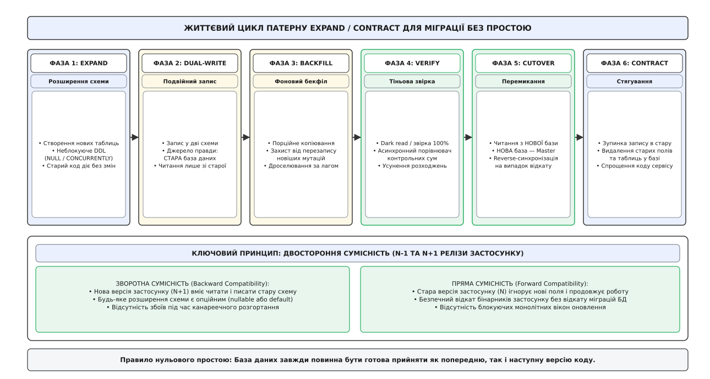
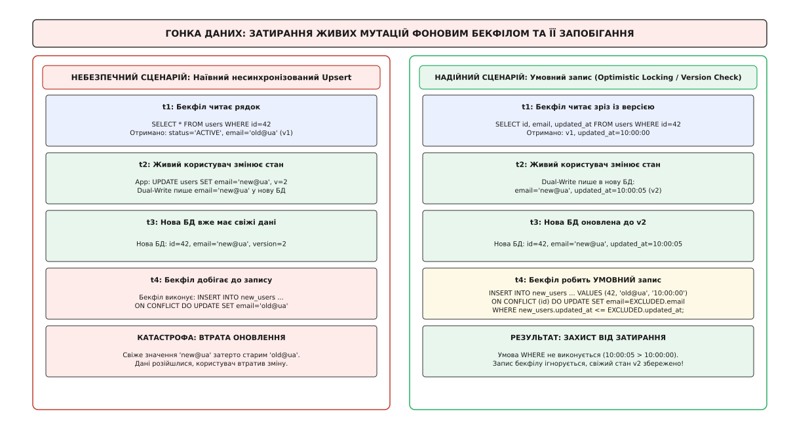
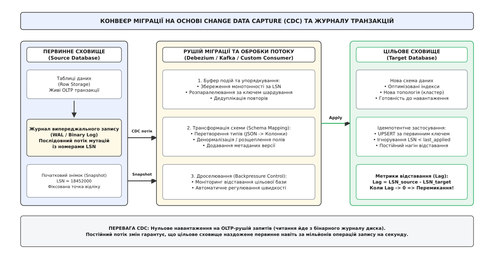
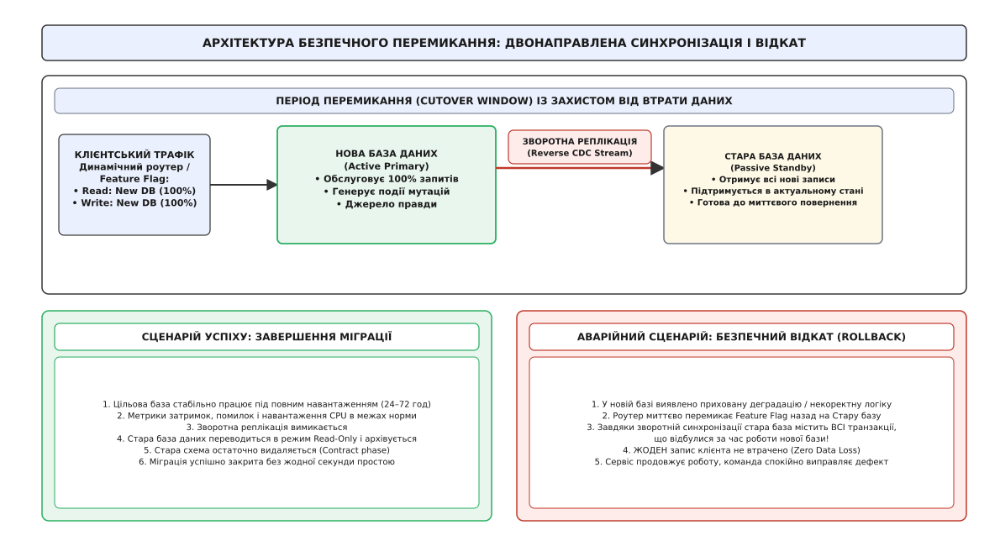

# Zero-downtime міграції даних

<preknowlist>
- [Омани розподілених обчислень](topic:sf-distributed/distributed-fallacies) — чому мережа ненадійна, пакети губляться і виникають часткові відмови.
- [Гарантії доставки](topic:sf-distributed/delivery-guarantees) — семантика at-most-once, at-least-once та чому прикладний рівень спирається на effectively-once.
- [Ідемпотентність](topic:sf-distributed/idempotency) — властивість операцій залишати стан системи незмінним при повторному виконанні запитів.
- [Журнал подій](topic:sf-distributed/event-log) — впорядкована послідовність незмінних записів у системах масштабування потоків даних.
- [Реплікаційний лаг і сесійні гарантії](topic:sf-distributed/replication-lag) — природа відставання реплік та забезпечення узгодженості читань.
- [Спектр консистентності](topic:sf-distributed/consistency-models) — від строгої лінеаризовності до причинної та підсумкової узгодженості.
- [Звірка](topic:sf-distributed/reconciliation) — виявлення та автоматичне усунення розходжень між розподіленими джерелами даних.
- [Патерн вихідної скриньки](topic:sf-distributed/outbox-pattern) — атомарне поєднання локальної мутації бази даних та публікації події.
</preknowlist>

Міжнародна платіжна платформа обслуговує 25 000 фінансових транзакцій на секунду. В процесі розвитку продукту виникає необхідність розширити структуру таблиці `accounts`: розділити єдине монолітне поле `balance` на окремі рахунки для мультивалютних балансів та додати новий обов'язковий стовпчик `currency_code` із типом `VARCHAR(3) NOT NULL`. Інженер виконує стандартну команду `ALTER TABLE accounts ADD COLUMN currency_code VARCHAR(3) NOT NULL DEFAULT 'UAH'`. У ту саму мілісекунду реляційна СКБД захоплює ексклюзивне блокування таблиці (`ACCESS EXCLUSIVE`), блокуючи будь-які операції читання та запису для всіх активних клієнтів. За 400 мілісекунд черга вхідних запитів переповнює пул з'єднань вебсерверів, балансувальники навантаження починають повертати помилки `504 Gateway Timeout`, а платіжний шлюз зазнає повної відмови, генеруючи тисячі фінансових претензій за втрачені операції.

Спроба провести міграцію за допомогою «технологічного вікна» з повною зупинкою сервісу опівночі також зазнає фіаско. У сучасних глобальних системах користувачі розподілені по всіх часових поясах планети, а угода про рівень обслуговування (*Service Level Agreement, SLA*) із показником доступності «чотири дев'ятки» (99.99%) дозволяє не більше 4.38 хвилин сумарного простою на місяць. Якщо ж обсяг бази даних перевищує сотні гігабайтів або десятки терабайтів, просте копіювання чи перебудова індексів займає багато годин.

Ця інженерна проблема вимагає принципово іншого підходу — **міграції даних без простою** (*Zero-Downtime Migration*). Це сукупність архітектурних патернів, протоколів асинхронної реплікації та дисципліни роботи з метаданими СКБД, які дозволяють трансформувати структури сховищ і переносити мільярди записів прямо під живим навантаженням, не відхиляючи жодного користувацького запиту та гарантуючи нульову втрату даних (*Zero Data Loss*).

## Анатомія блокувань СКБД та пастки DDL під навантаженням

Головною причиною простоїв при наївних спробах змінити схему бази даних є механізм блокувань на рівні словника метаданих (*Data Definition Language, DDL*).

### Ескалація блокувань та черга очікування в PostgreSQL

У реляційній СКБД PostgreSQL кожна SQL-команда вимагає блокування відповідного рівня. Звичайне читання (`SELECT`) захоплює блокування `ACCESS SHARE`, яке дозволяє іншим процесам паралельно читати й модифікувати таблицю. Натомість більшість структурних змін (`ALTER TABLE`, додавання індексів без спеціальних прапорців, валідація зовнішніх ключів) вимагають блокування найвищого рівня — `ACCESS EXCLUSIVE`.

Небезпека полягає у функціонуванні внутрішньої черги блокувань СКБД:

```
[Потік 1: Довгий SELECT (ACCESS SHARE)] ──► Утримує блокування (працює 15 секунд)
                                                ▲
[Потік 2: ALTER TABLE (ACCESS EXCLUSIVE)] ───► Чекає завершення Потоку 1 у черзі
                                                ▲
[Потік 3: Швидкий SELECT (ACCESS SHARE)] ────► ЗАБЛОКОВАНО Потоком 2 у черзі!
[Потік 4: Швидкий INSERT (ROW EXCLUSIVE)] ───► ЗАБЛОКОВАНО Потоком 2 у черзі!
```

Навіть якщо сама команда `ALTER TABLE` виконується за 1 мілісекунду, вона стає в чергу позаду довгого фонового аналітичного запиту `SELECT`. Усі наступні звичайні короткі запити застосунку, яким потрібне навіть слабке блокування `ACCESS SHARE`, вишиковуються **позаду** `ALTER TABLE` і не можуть виконатися, доки не завершиться довгий запит і наступна за ним зміна схеми. За лічені секунди вичерпується ліміт відкритих з'єднань `max_connections`, сервіс перестає відповідати, і настає каскадна відмова.

### Правила безпечного виконання DDL

Щоб запобігти колапсу системи, DDL-операції у високоінтенсивних базах даних підпорядковуються суворим правилам:

1. **Встановлення ліміту очікування блокування (`lock_timeout`):**
   Перед виконанням структурної зміни сесія зобов'язана обмежити максимальний час очікування в черзі. Якщо блокування не вдалося захопити за безпечний проміжок (наприклад, 1–2 секунди), операція негайно скасовується, не створюючи черги для прикладних транзакцій:
   ```sql
   SET lock_timeout = '2s';
   ALTER TABLE accounts ADD COLUMN status VARCHAR(16);
   ```

2. **Неблокуюче створення індексів (`CONCURRENTLY`):**
   Звичайна команда `CREATE INDEX` блокує всі операції запису (`INSERT`, `UPDATE`, `DELETE`) до повного сканування таблиці. Модифікатор `CONCURRENTLY` виконує побудову індексу у два проходи без блокування мутацій:
   * Перший прохід: створення структури індексу зі статусом `INVALID` та реєстрація початку відстеження нових змін.
   * Другий прохід: сканування історичних даних і наповнення індексу.
   * Фіналізація: переведення індексу в статус `VALID`.

3. **Розщеплення додавання обмежень цілісності (Constraints):**
   Додавання перевірочного обмеження `NOT NULL` або `FOREIGN KEY` до таблиці з мільярдами рядків змушує СКБД просканувати всі сторінки під ексклюзивним блокуванням. Безпечний патерн полягає у двох ізольованих кроках:
   ```sql
   -- Крок 1: Миттєве додавання правила без перевірки старих даних (короткий lock)
   ALTER TABLE accounts ADD CONSTRAINT check_currency_not_null 
   CHECK (currency_code IS NOT NULL) NOT VALID;

   -- Крок 2: Фонова валідація історичних рядків під слабким блокуванням SHARE UPDATE EXCLUSIVE
   ALTER TABLE accounts VALIDATE CONSTRAINT check_currency_not_null;
   ```

Детальний аналіз того, як індустрія перейшла від тригерних інструментів Percona до сучасних безтригерних рушіїв і бінарних журналів, викладено в [історичному нарисі еволюції онлайн-міграцій](topic:sf-release/zero-downtime-migration/hist-online-migration-evolution.md).

## Життєвий цикл патерну Expand / Contract

Коли міграція виходить за межі простої модифікації окремої колонки і вимагає розділення сутностей, денормалізації або перенесення даних в іншу фізичну базу, застосовується фундаментальний патерн **Expand / Contract** (також відомий як *Parallel Run* або фазова міграція).



*Поетапний перехід від старої схеми до нової без зупинки обслуговування трафіку. База даних завжди зберігає пряму та зворотну сумісність із релізами застосунку.*

### Фаза 1: Розширення (Expand)

На першому етапі в базі даних створюється нова структура (новий стовпчик, нова таблиця або нова схема в цільовому кластері). Головна умова фази Expand — **абсолютна неблокуюча природа та опційність**:
* Нові поля створюються як `NULLABLE` або мають визначені замовчування (*Default values*).
* Нова таблиця створюється поруч зі старою без внесення змін до поточного коду застосунку.
* Застосунок поточної версії (N) продовжує працювати виключно зі старою структурою, повністю ігноруючи нові сутності.

### Фаза 2: Подвійний запис (Dual-Write)

Розгортається нова версія застосунку (N+1), яка переходить у режим паралельного запису:
1. Будь-яка бізнес-операція клієнта (`INSERT`, `UPDATE`, `DELETE`) виконує запис у **стару схему** (первинне джерело правди) і дублює відповідну мутацію в **нову схему** (тіньове джерело).
2. Читання (`SELECT`) продовжує виконуватися **виключно зі старої схеми**.
3. Якщо запис у нову тіньову схему зазнає помилки через відмінність форматів, це логується, але не перериває основну клієнтську транзакцію (джерело правди лишається неушкодженим).

### Фаза 3: Ретроспективне наповнення (Backfill)

У новій схемі тепер з'являються всі свіжі мутації, але відсутні історичні дані, створені до запуску подвійного запису. Для їх перенесення запускається фоновий воркер бекфілу (*Backfill Worker*):
* Рушій читає історію невеликими пачками за первинним ключем: `WHERE id > :last_seen_id ORDER BY id ASC LIMIT :batch_size`.
* Заборонено використовувати зміщення `OFFSET`, оскільки при зростанні номера сторінки СКБД змушена сканувати всі попередні рядки з диска, що призводить до квадратичної деградації `O(N)`.
* Швидкість роботи воркера адаптивно регулюється: якщо реплікаційний лаг бази зростає або завантаження процесора перевищує 70%, бекфіл автоматично сповільнюється або робить паузу.

Математичне обґрунтування оптимального розміру пачки, швидкості збіжності черги та динаміки реплікаційного лагу наведено у [математичній моделі збіжності бекфілу](topic:sf-release/zero-downtime-migration/math-backfill-convergence.md).

### Фаза 4: Тіньова верифікація (Validation / Dark Reading)

Коли історичний бекфіл наздоганяє точку старту подвійного запису, обидва сховища повинні містити ідентичний набір даних. Для підтвердження узгодженості застосовується механізм тіньового читання (*Dark Reads*):
1. Застосунок виконує читання зі старої схеми для обслуговування користувацького запиту.
2. Асинхронно у фоновому потоці виконується паралельне читання того самого запису з нової схеми.
3. Обидва результати серіалізуються, і порівнюються їхні контрольні суми (*Checksum / Hash*).
4. У разі виявлення розходжень генерується алертинг і запускається процедура автоматичної [звірки](topic:sf-distributed/reconciliation). Перехід до наступної фази дозволяється лише після досягнення 100% збігу на мільйонах запитів протягом фіксованого вікна спостереження (наприклад, 24–48 годин).

### Фаза 5: Перемикання трафіку (Cutover)

За допомогою динамічних прапорців функціоналу (*Feature Flags*) трафік плавно перемикається:
1. **Перемикання читань (Read Switch):** читання починає виконуватися з нової бази даних (канареечно: 1% → 10% → 50% → 100%).
2. **Перемикання первинного запису (Write Switch):** нова база даних стає єдиним джерелом правди.
3. **Зворотна синхронізація (Reverse Replication):** у ту саму мить вмикається запис із нової бази в стару на випадок, якщо знадобиться екстрений відкат.

### Фаза 6: Стягування та очищення (Contract)

Після того, як нова система успішно відпрацювала під повним навантаженням без інцидентів, міграція закривається:
* Припиняється запис у стару схему.
* Видаляється застарілий код адаптерів і прапорців у застосунку.
* Старі таблиці та колонки видаляються з бази даних, вивільняючи дисковий простір.

## Гонка між фоновим бекфілом та живим подвійним записом

Найнебезпечніша помилка під час реалізації фази бекфілу — це стан перегонів (*Race Condition*), що призводить до непомітної втрати оновлень користувачів (*Lost Update Anomaly*).



*Сценарій втрати даних при наївному копіюванні рядків та механізм умовного збереження за міткою часу/версією, що захищає свіжі мутації.*

### Механіка виникнення катастрофи затирання

Розглянемо послідовність подій у часі:
1. **Момент `t1`:** Фоновий воркер бекфілу зчитує з вихідної бази пачку рядків. Для користувача `id = 42` прочитано стан: `email = 'old@company.ua'`, версія `v1`.
2. **Момент `t2`:** Живий користувач заходить в особистий кабінет і змінює адресу на `email = 'new@company.ua'`. Застосунок виконує подвійний запис: зберігає оновлення в стару базу і негайно оновлює нову базу до стану `v2`.
3. **Момент `t3`:** У новій базі рядок `id = 42` має актуальний статус `v2` зі значенням `'new@company.ua'`.
4. **Момент `t4`:** Воркер бекфілу, який через мережеву затримку чи розмір пачки виконував обробку кілька секунд, нарешті дістається до збереження прочитаного на кроці `t1` зрізу і виконує несинхронізований `INSERT ... ON CONFLICT DO UPDATE`.

Якщо запис бекфілу є безумовним, він **затирає** свіжий стан `v2` застарілим значенням `v1`. Користувач втрачає щойно змінену пошту, а система переходить у стан розсинхронізації.

### Розв'язання: Умовне збереження (Conditional Upsert)

Для запобігання затиранню запис бекфілу повинен бути строго умовним, спираючись на монотонний лічильник версій або мітку часу модифікації (`updated_at`):

```sql
-- БЕЗПЕЧНЕ ЗАСТОСУВАННЯ ПАЧКИ БЕКФІЛУ З ЗАХИСТОМ ВІД ЗАТИРАННЯ
INSERT INTO new_users (id, email, updated_at)
VALUES (42, 'old@company.ua', '2026-08-20 10:00:00')
ON CONFLICT (id) DO UPDATE 
SET 
    email = EXCLUDED.email,
    updated_at = EXCLUDED.updated_at
WHERE new_users.updated_at <= EXCLUDED.updated_at;
```

Якщо паралельний подвійний запис уже встановив `updated_at = '2026-08-20 10:00:05'`, умова `WHERE new_users.updated_at <= EXCLUDED.updated_at` поверне `FALSE`. СКБД проігнорує спробу оновлення, і свіжий користувацький стан залишиться неушкодженим.

Повну програмну реалізацію воркера з умовним записом, курсорною пагінацією та контролем лагу наведено у [проекті промислового рушія міграції](topic:sf-release/zero-downtime-migration/proj-zero-downtime-engine.md).

## Архітектура на основі Change Data Capture (CDC)

При міграції між принципово різними технологічними стеками (наприклад, із реляційної PostgreSQL у колоночну ClickHouse або документно-орієнтовану MongoDB) реалізація подвійного запису всередині коду застосунку створює надмірну зв'язність і суттєво сповільнює критичний шлях виконання бізнес-транзакцій.

Сучасним промисловим стандартом для таких задач є архітектура **Change Data Capture (CDC)** на основі читання журналів транзакцій.



*Асинхронний конвеєр перенесення даних через вилучення подій із журналу транзакцій (WAL / Binlog). Навантаження на первинний OLTP-рушій зводиться до нуля.*

### Принцип роботи CDC-конвеєра:

1. **Читання бінарного журналу (Transaction Log Mining):**
   Спеціалізований конектор (наприклад, Debezium або Kafka Connect) підключається до вихідної СКБД як звичайна репліка. Він не виконує важких SQL-запитів `SELECT`, а напряму зчитує бінарний журнал випереджального запису (*Write-Ahead Log, WAL* у PostgreSQL або *Binary Log* у MySQL).
2. **Публікація потоку подій:**
   Кожна зафіксована транзакція перетворюється на структуровану подію (*Row-Level Mutation Event*), що містить старий і новий стан рядка, а також монотонний порядковий номер журналу (*Log Sequence Number, LSN*). Події публікуються у топік брокера повідомлень (Apache Kafka).
3. **Шардована обробка та трансформація:**
   Потік подій партиціонується за хешем первинного ключа (`hash(id)`), що гарантує суворе збереження порядку мутацій для кожного окремого запису.
4. **Ідемпотентне застосування в цільовому сховищі:**
   Споживачі читають потік і застосовують [ідемпотентні](topic:sf-distributed/idempotency) операції `UPSERT` до нової бази даних, автоматично фільтруючи події з застарілими LSN.

## Двонаправлена реплікація та архітектура безпечного відкату

Головне правило проєктування міграцій без простою стверджує: **міграція, яка не має плану миттєвого відкату без втрати даних, є спланованою аварією**.

Якщо після перемикання 100% трафіку на нову базу даних через дві години виявляється прихована деградація продуктивності під піковим навантаженням або критична логічна помилка, наївна спроба повернути трафік назад на стару базу призведе до втрати всіх даних, створених клієнтами за ці дві години.



*Двонаправлена синхронізація у вікні перемикання. Стара база підтримується в гарячому резерві, що дозволяє виконати безшовний відкат у будь-яку секунду.*

### Організація зворотного потоку (Reverse Sync)

У момент виконання Cutover (перемикання основного джерела правди на нову базу) система зобов'язана негайно розгорнути зворотний потік реплікації:
* Нова база даних починає транслювати свої мутації через CDC-конектор назад у стару базу даних.
* Стара база даних виступає в ролі «гарячого резерву» (*Standby Replica*). Вона не приймає користувацьких запитів, але містить 100% актуальний стан.

### Запобігання реплікаційним петлям (Echo Loop Prevention)

При одночасній роботі прямого та зворотного потоків синхронізації виникає ризик утворення нескінченного циклу відлуння: зміна з бази А потрапляє в базу Б, звідки знову зчитується конектором і відправляється назад у базу А.

Для запобігання петлям використовуються два механізми:
1. **Маркування сесії реплікації:** у PostgreSQL застосовується параметр `SET LOCAL session_replication_role = 'replica'`, що дозволяє CDC-агенту ігнорувати транзакції, згенеровані самим процесом реплікації.
2. **Метадані походження (*Provenance Metadata*):** кожна подія супроводжується заголовком `origin_node_id`. Якщо обробник бачить у події власний ідентифікатор вузла, він скидає повідомлення без повторної публікації.

Повні контракти станів координатора, HTTP API керування та схему конфігурації наведено у [специфікації координатора міграції](topic:sf-release/zero-downtime-migration/api-migration-coordinator-spec.md).

> 🔧 **Навіщо це.** Zero-downtime міграція перетворює ризиковані інженерні релізи з нічними авралами на контрольований, вимірюваний інженерний процес. Завдяки розщепленню змін на сумісні фази, адаптивному бекфілу та зворотній реплікації команда отримує можливість змінювати фундаментальні структури зберігання терабайтних систем у робочий полудень, залишаючи користувачів у повному невіданні про масштабні внутрішні перетворення.
