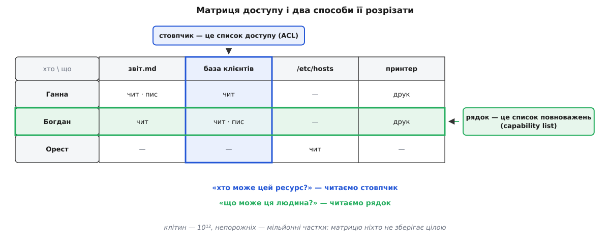
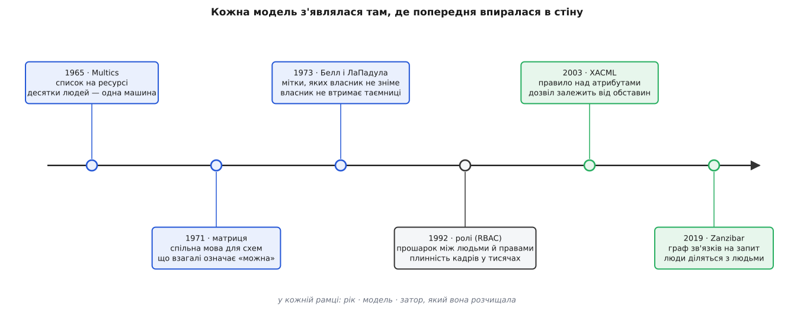

# 📜 Затори, з яких народилися моделі авторизації

Ні список на ресурсі, ні ролі, ні правила над атрибутами не вигадали заради краси схеми: кожна модель з'являлася тоді, коли попередня впиралася в конкретну стіну — то в кількість людей на одній машині, то в плинність кадрів, то в звичайне бажання поділитися текою з колегою. Історія авторизації і є історією тих стін: від машини, яку наприкінці 1960-х уперше довелося ділити, до системи Google, що 2019 року відповідала на мільйони перевірок за секунду.

## Машина, яку раптом стало ділити

Поки машина виконувала одне завдання за раз, питання доступу було організаційним, а не програмним: хто приніс операторові колоду перфокарт, того й програма рахується. Захищати всередині не було чого — у пам'яті жила одна робота.

Розподіл часу зламав це припущення. З початку 1960-х у машині одночасно жили десятки чужих одне одному програм, а файли їхніх власників лежали на одних дисках ([розподіл часу](topic:sf-devices/time-sharing-history) — процесор швидко перемикається між користувачами, і кожен має враження, що машина його). Раптом знадобилося правило, яке машина застосовує сама: цей сегмент Ганнин, і Богдан його не читає.

Перша розгорнута відповідь прийшла з Multics — її оприлюднили 1965 року, у першому пакеті праць про систему, задовго до того, як вона запрацювала наживо. На кожному сегменті тримали список доступу: перелік, хто саме і що саме з ним може. Цю файлову систему й вважають першою реалізацією ACL. Поруч працював другий, грубіший механізм — апаратні кільця привілеїв ([кільця захисту](topic:hw-arch/protection-rings) — вкладені рівні, де внутрішнє може все, що зовнішнє, і ще трохи). Два механізми відповідали на два різні питання: кільця — «наскільки привілейований код зараз виконується», списки — «кому належить оцей конкретний шматок даних».

## Матриця, якої ніхто не зберігає

Механізмів побільшало, і кожен описував себе своїми словами. Бракувало спільної мови — способу сказати, що взагалі означає «можна», байдуже, чи це сегмент Multics, чи запис у базі.

Її дав Батлер Лемпсон (Butler W. Lampson): у праці «Dynamic protection structures» (AFIPS, 1969) і виразніше у «Protection» (5-та Прінстонська конференція з інформаційних наук і систем, 1971; передрук — ACM Operating Systems Review 8(1), січень 1974) він запропонував дивитися на захист як на матрицю. Рядки — суб'єкти, стовпці — об'єкти, у клітині — права, що їх цей суб'єкт має до цього об'єкта.

Матриця нічого не винаходить, вона лише називає координати. І саме тому вона показує головну проблему одразу, щойно підставити числа:

```
користувачів        10⁵
об'єктів            10⁷
клітин у матриці    10⁵ · 10⁷ = 10¹²
непорожніх клітин   ~10⁷  (кожен файл цікавий одиницям людей)
заповненість        10⁷ / 10¹² = 10⁻⁵
```

Трильйон клітин, з яких зайнята одна стотисячна. Матрицю ніхто не зберігає цілою — зберігають лише непорожні клітини. А згрупувати їх можна двома способами, і третього немає: по стовпчиках або по рядках.

Стовпчик — це все про один ресурс: хто і що з ним може. Так виходить список доступу (ACL), той самий, що в Multics. Рядок — це все про одного суб'єкта: що він може з усім на світі. Так виходить список повноважень: суб'єкт носить із собою «квитки», і кожен квиток сам собою дає право на щось конкретне. Термін *capability* у цьому значенні ввели Джек Денніс і Ерл Ван Горн (Jack B. Dennis, Earl C. Van Horn) у «Programming semantics for multiprogrammed computations» (CACM 9(3), 1966).



*Один і той самий факт «Богдан пише в базу клієнтів» лежить і в стовпчику бази, і в рядку Богдана. Що з двох ти зберігаєш — те й вирішує, яке питання буде дешевим.*

Різниця не косметична. Зі списками на ресурсах питання «хто може цей файл?» — один погляд, а «що може ця людина?» — обхід усіх файлів; із повноваженнями рівно навпаки. Unix зробив свій вибір радикально: на початку 1970-х він стиснув стовпчик до дев'яти бітів — rwx для власника, групи й решти (клас групи додався в четвертій редакції, кінець 1973-го). Це вже не список, а його дуже груба апроксимація, зате вона влазить в інод і перевіряється однією операцією.

У повноважень є перевага, яку помітили не одразу, — і Норм Гарді (Norm Hardy) описав її від зворотного в замітці «The Confused Deputy (or why capabilities might have been invented)» (ACM SIGOPS Operating Systems Review 22(4), жовтень 1988). Він згадав випадок у компанії Tymshare років на одинадцять раніше: компілятор мав право писати у файл обліку, а користувач назвав свій вихідний файл так само — і компілятор затер облік, від свого імені та на прохання чужого ([заплутаний заступник](topic:sf-security/confused-deputy) — програма з власними правами виконує чужу вказівку й тим позичає їй свою владу). Коли право приходить разом із запитом, а не висить на виконавцеві, така плутанина не виникає взагалі — на цьому й тримається [підхід повноважень](topic:sf-security/capability-based-security), у якому передане право можна відкликати, звузити чи делегувати як звичайну річ.

## Питання, на яке відповіді немає

Матриця дала мову — і одразу породила питання. Права в живій системі не стоять на місці: власник віддає право іншому, той третьому. Отже, розумно спитати: чи може за якийсь ланцюжок передач право на секретний файл дістатися того, кому не можна?

Майкл Гаррісон, Волтер Руззо і Джеффрі Ульман (Michael A. Harrison, Walter L. Ruzzo, Jeffrey D. Ullman) відповіли у «Protection in Operating Systems» (CACM 19, 1976, с. 461–471): у загальному випадку невідомо. Задача безпеки для їхньої моделі (тепер її звуть HRU) нерозв'язна — не існує алгоритму, який для довільної системи з довільними правилами передачі скаже, чи витече колись право.

Висновок практичний і невеселий. Якщо дозволити описувати правила як завгодно, за них не поручиться ніхто — ні людина, ні програма. Тому всі корисні моделі далі йшли одним шляхом: обмежували виразність рівно настільки, щоб на важливі питання можна було відповісти.

## Затор таємниці: власник — не той, кому можна довіряти

Перша стіна вдарила у військових. І в Multics, і в Unix правами розпоряджався власник файлу: захотів — відкрив, захотів — закрив. Це дискреційний доступ (англ. *discretionary access control*, DAC), тобто «на власний розсуд».

Розсуд ламається просто. Програма, яку запустив власник, працює з його правами. Досить підсунути йому корисну на вигляд програму — і вона від його імені перепише секрет туди, звідки його забере хтось інший. Власник нічого не порушив, він просто щось запустив; проти цього дискреційність безсила за побудовою.

Тож знадобилися правила, яких сам власник не скасовує. Девід Белл і Леонард ЛаПадула (David E. Bell, Leonard J. LaPadula) з корпорації MITRE описали таку систему в «Secure Computer Systems: Mathematical Foundations» (листопад 1973), а 1976-го звели виклад докупи разом із тлумаченням для Multics. Кожен суб'єкт і кожен об'єкт дістає мітку рівня таємності, а правила стосуються міток, а не осіб: не читати вище за свій рівень і не писати нижче за нього. Друга половина спершу дивує — доки не згадаєш підсунуту програму: саме заборона писати вниз не дає їй винести секрет назовні.

Цю гілку назвали обов'язковим доступом ([мітки й обов'язковий доступ](topic:sf-security/mandatory-access-control) — рівень чіпляють до даних, а не до людини, і зняти його користувач не може, бо правило накладає система). 1983 року Міністерство оборони США видало «Критерії оцінки довірених комп'ютерних систем» (TCSEC, «Помаранчева книга»; оновлення — 1985), де DAC і MAC стали офіційними категоріями, а модель Белла–ЛаПадули — тією самою моделлю, якої вимагали від рівня B2 і вище.

Затор розчищено: таємниця тепер переживає необережного власника. Ціна — етикетувати доводиться геть усе, а сувора драбина рівнів лягає лише на ту організацію, у якої вона вже є.

## Затор адміністрування: люди приходять і йдуть

Комерційний світ мав інший біль. Там рідко буває «цілком таємно» — там буває сорок тисяч працівників, у кожного десятки прав, і плинність кадрів. Ані DAC, ані MAC на це не відповідали: перший розкидав рішення по власниках, другий вимагав ієрархії таємності, якої в банку немає.

Першим натяком стала практика баз даних. Роберт Болдвін (Robert W. Baldwin) у «Naming and Grouping Privileges to Simplify Security Management in Large Databases» (IEEE Symposium on Security and Privacy, 1990, с. 116–132) запропонував іменовані домени захисту: згрупувати привілеї, дати групі ім'я — і видавати ім'я, а не привілеї поштучно. Механізм реалізували в Oracle і подали до стандарту SQL.

Узагальнили це Девід Ферайоло і Девід Річард Кун (David F. Ferraiolo, D. Richard Kuhn) з NIST у доповіді «Role-Based Access Controls» (15-та Національна конференція з комп'ютерної безпеки, Балтимор, 13–16 жовтня 1992, с. 554–563). Теза була майже зухвала: для цивільних організацій дискреційність узагалі не годиться за основний механізм, а потрібна третя річ — не DAC і не MAC. Ключ був у тому, що саме брати за проміжну сутність: не групу людей і не набір файлів, а посаду — те, що людина в організації робить. Посада живе довше за людину, тому права до неї чіпляють раз, а людей до посад пересаджують хоч щодня.

Далі модель дошліфували. Раві Сандху з колегами (Ravi Sandhu, Edward Coyne, Hal Feinstein, Charles Youman) у «Role-Based Access Control Models» (IEEE Computer 29(2), лютий 1996, с. 38–47) розклали її на чотири рівні — від базового до ієрархій ролей і обмежень на кшталт розділення обов'язків, коли той, хто виписує платіж, не може його ж і підтвердити. 2000 року Сандху, Ферайоло і Кун звели обидві лінії в один запропонований стандарт, а 2004-го його ухвалили як ANSI INCITS 359-2004 — рідкісний випадок, коли модель доступу дійшла до формального стандарту й там і залишилася.

Розчистилося ось що: питання «що може ця людина?» знову стало дешевим — замість обходу всіх ресурсів достатньо переглянути кілька ролей. Заплатили точністю: роль однакова для всіх, хто її має.

## Затор ролей: «редактор, але лише у своєму відділі»

Ціна виявилася зростаючою. Умови, через які ролі починають розмножуватися, мають спільну рису: вони стосуються не людини, а обставин запиту — часу, суми, відділу, того, чи збігається власник документа з тим, хто питає. Перелічити їх наперед неможливо, бо вони з'являються з кожним новим правилом бізнесу.

Відповідь галузі — описати умову мовою, яку виконує окремий рушій. Консорціум OASIS затвердив XACML (eXtensible Access Control Markup Language) 1.0 18 лютого 2003 року, 2.0 — 1 лютого 2005-го, 3.0 — 22 січня 2013-го. Разом із мовою прийшов словник, що пережив саму мову: точка застосування (PEP), яка перехоплює запит; точка рішення (PDP), яка обчислює відповідь; точка інформації (PIP), звідки беруться атрибути; точка адміністрування (PAP), де правила пишуть. Розділення на «хто перехоплює» і «хто вирішує» — це рівно та сама ідея одних воріт, тільки названа й записана в стандарт.

Назву гілці закріпив NIST: «Guide to Attribute Based Access Control (ABAC) Definition and Considerations» (SP 800-162, січень 2014) визначив доступ за атрибутами як окрему методологію — рішення обчислюють, звіряючи атрибути суб'єкта, об'єкта, операції й середовища з правилом.

XACML розчистив затор обставин, але приніс власний: політики писали в XML, і людині вони давалися важко. Наступний виток — ті самі правила, але як звичайний код, який лежить у сховищі, проходить рев'ю й покривається тестами. Open Policy Agent, створений 2016 року в компанії Styra, з мовою Rego, пройшов CNCF від пісочниці (29 березня 2018) до випуску (29 січня 2021) і став першим випускником фонду, цілком присвяченим авторизації ([політики як код](topic:sf-security/policy-as-code) — правила живуть поряд із застосунком і катяться як код, а не правляться в консолі).

## Затор ділення: чужа тека, у якій ти редактор

Останню стіну поставила не безпека, а звичка. У вебі другої половини 2000-х люди почали ділитися одне з одним: фото з друзями, документ із колегою, тека з відділом. Правило тут не про атрибути людини — воно про зв'язок між нею і річчю: ти редактор оцієї теки, а документ лежить у ній.

Термін «доступ за зв'язками» (англ. *relationship-based access control*, ReBAC) увела Керрі Ґейтс (Carrie Gates) 2007 року в доповіді «Access Control Requirements for Web 2.0 Security and Privacy». Формальну модель і мову політик дав Філіп Фонг (Philip W. L. Fong) у «Relationship-Based Access Control: Protection Model and Policy Language» (CODASPY, Сан-Антоніо, 21–23 лютого 2011, с. 191–202), відштовхуючись від того, як доступ влаштований у соціальній мережі.

Що з цього виходить у промисловому масштабі, Google описав у праці «Zanzibar: Google's Consistent, Global Authorization System» (USENIX ATC, липень 2019; Ruoming Pang та співавтори). Числа звідти:

```
кортежів зв'язку           трильйони
перевірок                  мільйони за секунду
клієнтських служб          сотні (Calendar, Cloud, Drive, Maps, Photos, YouTube)
затримка, 95-й процентиль  < 10 мс
доступність                > 99.999 %
у промисловій роботі       3 роки на час публікації
```

Тримають цю систему дві ідеї. Перша: увесь стан зводиться до однорідних кортежів «об'єкт#відношення@суб'єкт», а похідні відношення описують правилами перезапису — «редактор документа це також той, хто редактор теки, що його містить». Друга: узгодженість у часі. Коли доступ у когось забрали, система не сміє показати старішу відповідь, тому клієнт носить із собою мітку версії й отримує рішення, не старіше за неї. Без другої ідеї перша була б небезпечною: скасування доступу спрацьовувало б із затримкою, і саме в цю щілину пролізло б те, від чого доступ і закривали.

Стаття вийшла назовні — і за нею пішов відкритий код у тому ж дусі: SpiceDB від AuthZed (сховище відкрито в серпні 2021) і OpenFGA від Auth0/Okta (червень 2022), згодом переданий у CNCF. Уперше механізм такого масштабу став доступним не лише тим, хто його придумав.



*Ліворуч — час, коли доступ перелічували явно; праворуч — коли його почали обчислювати. Зміщення по осі щоразу оплачене конкретною стіною, а не модою.*

## Жодна з них не померла

Цей ряд легко прочитати як драбину, де кожна модель заміняє попередню. Насправді розчищений затор не з'являється знову — і механізм, що його розчистив, лишається на місці.

Дев'ять бітів Unix живуть у кожному контейнері. Мітки MAC пішли не в архів, а в широкий вжиток: NSA відкрило SELinux 22 грудня 2000 року, з ядра 2.6 (серпень 2003) воно в основній гілці Linux, і сьогодні обов'язкові мітки стоять між застосунками на кожному телефоні — рішення, придумане для державної таємниці, тепер розділяє два месенджери. Ролі стали стандартом інфраструктури: у Kubernetes RBAC став стабільним у версії 1.8 (2017). Атрибути й зв'язки не витіснили ролей, а лягли шаром поверх них.

Тримає ж усе це та сама матриця Лемпсона. Жодна система її не зберігає — кожна лише обирає, як її стиснути: по стовпчиках, по рядках, через посаду, через правило над атрибутами, через шлях у графі. Вибір стиснення завжди означає одне й те саме: яке питання ти хочеш ставити за мілісекунди, а за яке згоден платити повним обходом.
