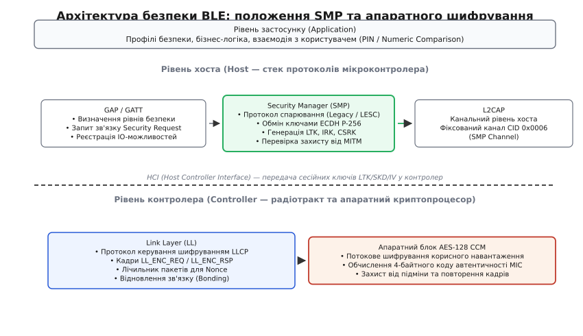
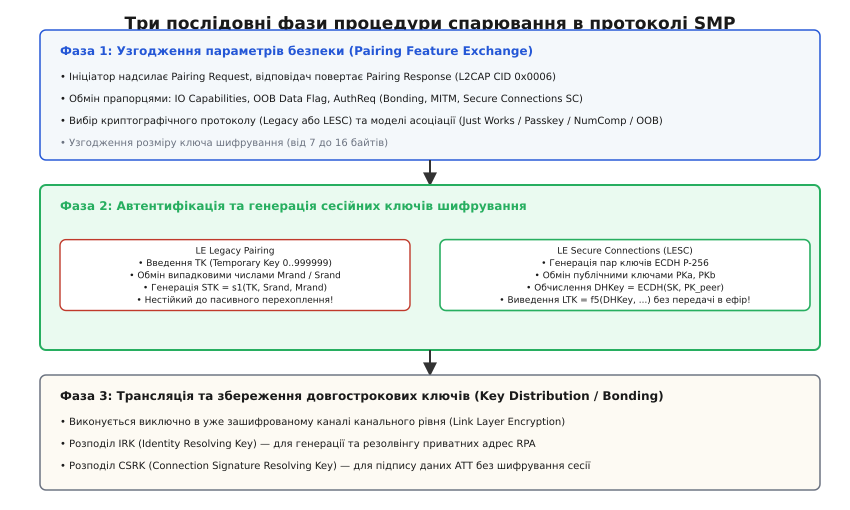
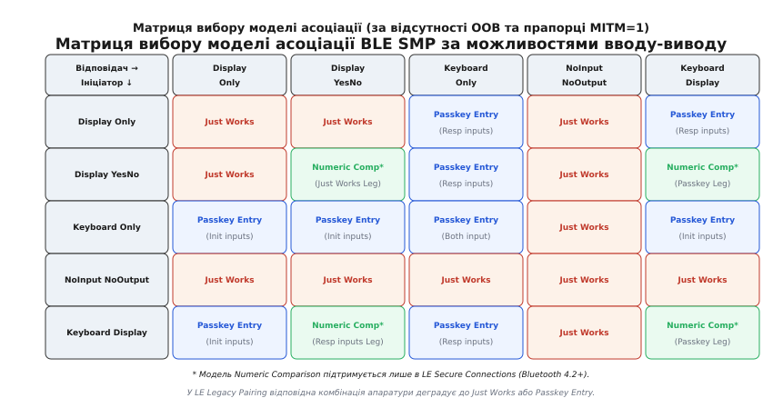
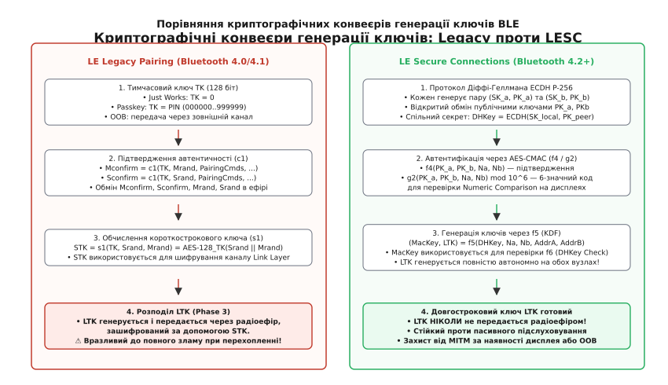
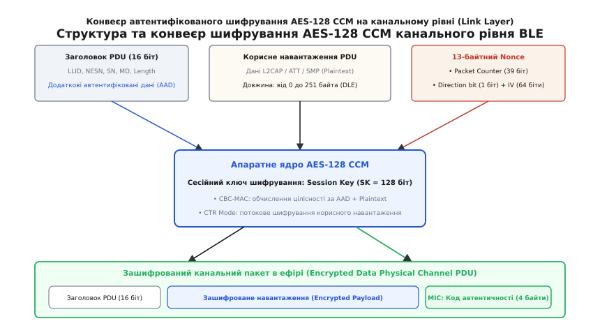

# Безпека й спарювання BLE

<preknowlist>
- [BLE GAP](topic:com-transport/ble-gap) — ролі пристроїв, рекламування, сканування та типи адрес.
- [BLE GATT](topic:com-protocol/ble-gatt) — модель сервісів, характеристик і дескрипторів для структурованого обміну даними.
- [BLE ATT](topic:com-protocol/ble-att) — транзакції протоколу атрибутів, операції запису з підписом та коди помилок авторизації.
- [Дизайн пакетів](topic:com-transport/packet-design) — канальні блоки PDU, заголовки, корисне навантаження та контроль цілісності CRC.
</preknowlist>

Коли медичний інсуліновий дозатор, бездротовий кардіостимулятор або автомобільний цифровий ключ передає керуючу команду в неліцензованому радіодіапазоні 2.4 ГГц ISM, електромагнітна хвиля поширюється у відкритому просторі на десятки метрів у всіх напрямках. На відміну від дротових інтерфейсів (UART, RS-485 чи CAN-шини), де фізичний доступ до лінії обмежено корпусом приладу або кабельною трасою, радіоефір є принципово загальнодоступним середовищем. Будь-який сторонній приймач вартістю в кілька доларів або програмно-визначена радіосистема (SDR, англ. *Software-Defined Radio*) може безперешкодно захопити кожний біт інформації, що транслюється в радіусі досяжності сигналу.

Якщо протокол зв'язку не містить математично строгих криптографічних бар'єрів, бездротова система наражається на повний спектр мережевих загроз. Зловмисник може здійснювати пасивне перехоплення конфіденційного трафіку (Passive Eavesdropping), непомітно відстежувати фізичні переміщення власника за незмінною MAC-адресою пристрою, впроваджуватися у сесію як активний посередник (Man-in-the-Middle, MITM), модифікувати пакети на льоту або записувати фальшиві значення в керуючі характеристики GATT.

Для розв'язання цих проблем специфікація Bluetooth Low Energy визначає багаторівневу криптографічну архітектуру, що забезпечує конфіденційність, автентичність відправника, цілісність повідомлень та приватність радіоадрес. Основним координатором процесів безпеки на рівні хоста виступає протокол **Security Manager** (SMP, від англ. *security* — безпека, та *manager* — керівник), тоді як апаратне автентифіковане шифрування радіокадрів виконується контролером канального рівня (Link Layer) у режимі реального часу.


*Архітектура безпеки BLE: протокол Security Manager функціонує на рівні хоста поверх фіксованого каналу L2CAP, контролюючи процес спарювання та генерацію ключів, тоді як апаратний блок AES-CCM контролера шифрує радіокадри Link Layer.*

---

### Архітектура безпеки та рівні доступу: Security Modes

У стеку BLE засоби захисту чітко розмежовані на дві ортогональні площини: безпеку самого радіоз'єднання (Connection Security) та політику доступу до окремих елементів бази атрибутів (Attribute Permissions). Профіль загального доступу GAP формалізує ці вимоги за допомогою двох режимів безпеки (Security Modes), кожен із яких поділяється на кілька суворих рівнів (Security Levels).

#### 1. Security Mode 1: Шифрування радіоканалу

Режим Security Mode 1 керує шифруванням усього потоку даних на канальному рівні Link Layer і є базовим стандартом захисту для більшості комерційних та промислових пристроїв:

* **Level 1: No Security (Безпека відсутня)**. З'єднання функціонує у повністю відкритому вигляді без шифрування та без автентифікації. Усі пакети L2CAP, ATT та SMP транслюються відкритим текстом;
* **Level 2: Unauthenticated Pairing with Encryption (Неавтентифіковане шифрування)**. Трафік шифрується симетричним алгоритмом AES-128, проте сесійні ключі узгоджено без участі користувача (модель *Just Works*). Цей рівень надійно захищає від пасивного запису ефіру сторонніми приймачами, проте є цілком вразливим до активної підміни пристроїв посередником під час початкового спарювання;
* **Level 3: Authenticated Pairing with Encryption (Автентифіковане шифрування)**. З'єднання зашифровано ключем, сформованим у результаті підтвердженої автентифікації за участю користувача (введення 6-значного PIN-коду *Passkey Entry* або позасмуговий обмін *OOB*). Гарантує математичний захист від атак Man-in-the-Middle;
* **Level 4: Authenticated LE Secure Connections (Максимальна безпека)**. Введено у специфікації Bluetooth 4.2. Вимагає обов'язкового застосування асиметричної криптографії на еліптичних кривих (ECDH P-256) та автентифікації за моделями *Numeric Comparison*, *Passkey Entry* або *OOB*. Довжина ключа шифрування повинна становити строго 128 бітів (16 байтів). Будь-яка спроба використання застарілих алгоритмів Legacy Pairing або скорочених ключів на цьому рівні негайно блокується стеком.

#### 2. Security Mode 2: Підпис даних на рівні ATT

Режим Security Mode 2 розроблено для специфічних сенсорних систем із жорстким лімітом енергоспоживання, де встановлення повноцінної шифрованої сесії є надто витратним (наприклад, автономний датчик температури, що прокидається раз на годину для передачі одного вимірювання). У цьому режимі радіоканал залишається відкритим, проте окремі команди запису підписуються криптографічним кодом:

* **Level 1: Unauthenticated Data Signing**. Команда `ATT_SIGNED_WRITE_CMD` супроводжується кодом автентичності повідомлення MAC (Message Authentication Code), обчисленим за допомогою 128-бітного ключа `CSRK`, узгодженого без захисту від MITM;
* **Level 2: Authenticated Data Signing**. Підпис даних базується на ключі `CSRK`, згенерованому за участю автентифікованої процедури (Passkey або OOB).

#### Змішані режими безпеки та права доступу GATT (Attribute Permissions)

Сам по собі факт встановлення зашифрованого з'єднання ще не відкриває доступу до внутрішніх ресурсів пристрою. Кожна характеристика та дескриптор у базі даних GATT мають власні бітові прапорці прав доступу (*Permissions*), що визначаються розробником прошивки:

```
                              Права доступу до характеристики GATT
                                                │
         ┌────────────────────────┬─────────────┴────────────┬────────────────────────┐
         ▼                        ▼                          ▼                        ▼
     Readable                 Writable              Encryption Required      Authentication Req
  Дозволено читання      Дозволено запис          Вимагає активного         Вимагає спарювання
  значення клієнтом      значення клієнтом        шифрування каналу         не нижче Level 3/4
```

Коли центральний пристрій намагається прочитати або змінити характеристику, сервер GATT перевіряє відповідність поточного стану з'єднання заданим вимогам:
1. Якщо характеристика вимагає шифрування, а з'єднання перебуває на рівні Security Mode 1 Level 1, сервер GATT повертає помилку протоколу ATT `Insufficient Encryption` (`0x0F`). Отримавши цей код, клієнт зобов'язаний ініціювати процедуру спарювання через протокол SMP;
2. Якщо характеристика вимагає автентифікації, а спарювання було виконано за неавтентифікованою моделлю Just Works (Level 2), сервер відхиляє запит кодом `Insufficient Authentication` (`0x05`);
3. Якщо на додаток вимагається авторизація на рівні бізнес-логіки застосунку (наприклад, підтвердження на екрані чи натискання фізичної кнопки на корпусі приладу), сервер сигналізує кодом `Insufficient Authorization` (`0x08`);
4. Якщо ключ шифрування коротший за порогове значення, визначене сервером, повертається помилка `Insufficient Encryption Key Size` (`0x0C`).

---

### Процедура спарювання (Pairing): три послідовні фази

Спарювання (англ. *Pairing*) — це стандартизований динамічний протокольний процес між двома підключеними BLE-пристроями, під час якого вони обмінюються вимогами безпеки, автентифікують один одного, генерують спільні короткострокові сесійні ключі та, за необхідності, зберігають довгостроковий зв'язок (Bonding).

Процедура спарювання реалізується протоколом Security Manager (SMP) над виділеним фіксованим каналом L2CAP із CID `0x0006` і складається з трьох строго впорядкованих фаз.


*Три фази спарювання BLE: від узгодження апаратних можливостей на Фазі 1 через автентифікацію та генерацію сесійних ключів на Фазі 2 до захищеного розподілу довгострокових ключів зв'язку на Фазі 3.*

#### Фаза 1: Узгодження параметрів безпеки (Pairing Feature Exchange)

Ініціатор зв'язку (Central) надсилає 7-байтний пакет `Pairing Request`, а відповідач (Peripheral) повертає пакет `Pairing Response`. У цих кадрах вузли узгоджують криптографічні можливості та вимоги до майбутньої сесії:

1. **Можливості вводу-виводу (IO Capabilities)**:
   * `DisplayOnly` — пристрій має лише екран (наприклад, розумний пульсометр або датчик із сегментним дисплеєм);
   * `DisplayYesNo` — екран та дві апаратні кнопки для відповіді «Так/Ні» (підтримка числового порівняння);
   * `KeyboardOnly` — цифрова або повна клавіатура без власного екрана;
   * `NoInputNoOutput` — відсутні будь-які інтерфейси взаємодії з людиною (мініатюрний маячок, датчик вібрації чи бездротове реле);
   * `KeyboardDisplay` — повноцінний екран та клавіатура (смартфон, планшет, робоча станція);
2. **Прапорець позасмугових даних (OOB Data Flag)**: вказує на наявність попередньо отриманих криптографічних секретів через альтернативний фізичний канал (наприклад, через інтерфейс NFC або оптичний QR-код);
3. **Вимоги до автентифікації (AuthReq)**: 8-бітна маска, яка задає:
   * `Bonding Flags` (біти 0..1): прапорець вимоги збереження зв'язку в незалежній пам'яті NVM;
   * `MITM` (біт 2): вимога обов'язкового захисту від активного втручання;
   * `SC` (біт 3): підтримка сучасного стандарту LE Secure Connections (якщо хоча б один вузол має `SC=0`, стек деградує до Legacy Pairing);
   * `Keypress` (біт 4): генерація подій натискання клавіш під час введення Passkey;
   * `CT2` (біт 5): підтримка крос-транспортного виведення ключів для класичного Bluetooth BR/EDR;
4. **Максимальний розмір ключа шифрування (Maximum Encryption Key Size)**: значення від 7 до 16 байтів. Підсумковий розмір сесійного ключа встановлюється як мінімум з обох запитів: `KeySize = min(InitKeySize, RespKeySize)`;
5. **Маски розподілу ключів (Key Distribution Masks)**: бітові маски `InitKeyDist` та `RespKeyDist`, які визначають, які саме довгострокові ключі (`LTK`, `IRK`, `CSRK`, `LinkKey`) сторони зобов'язуються надіслати одна одній на Фазі 3.

Для детального бітового опису кожного кадру SMP, включно з розміткою заголовків, масками прапорців AuthReq та повною таблицею кодів помилок Pairing Failed, зверніться до довідника [Формат пакетів PDU та опкоди протоколу Security Manager](topic:sf-security/ble-security/api-smp-pdus.md).

#### Матриця вибору моделі асоціації (Association Models)

Комбінація апаратних можливостей вводу-виводу (IO Capabilities) обох пристроїв та наявність позасмугових даних (OOB) однозначно визначає, яка саме модель асоціації буде застосована для автентифікації на Фазі 2:


*Матриця вибору моделі асоціації: наявність апаратних інтерфейсів вводу-виводу автоматично визначає рівень захищеності процедури спарювання.*

1. **Just Works (Просто працює)**: обирається автоматично, якщо хоча б один із пристроїв має конфігурацію `NoInputNoOutput`. Ключі шифрування узгоджуються фоново без сповіщення людини. **Модель Just Works не забезпечує захисту від MITM**, оскільки активний посередник може перехопити та підмінити відкриті параметри сесії;
2. **Passkey Entry (Введення PIN-коду)**: один пристрій виводить на екран 6-значний десятковий PIN-код (число від `000000` до `999999`), а користувач вручну вводить це значення на клавіатурі другого пристрою. Ця модель гарантує захист від MITM;
3. **Numeric Comparison (Порівняння чисел)**: підтримується **виключно в LE Secure Connections** (Bluetooth 4.2+), коли обидва пристрої оснащені дисплеями (`DisplayYesNo` або `KeyboardDisplay`). Обидва вузли незалежно обчислюють однаковий 6-значний код і виводять його на екран. Користувач візуально звіряє числа і натискає «Так» на обох апаратах. Numeric Comparison повністю усуває загрозу пасивного перехоплення та активного посередника, будучи значно зручнішим за ручне введення Passkey;
4. **Out-of-Band (OOB)**: криптографічні секрети та одноразові коди передаються через фізично ізольований зовнішній канал малого радіуса дії (наприклад, зчитування мітки NFC під час торкання смартфона до корпусу приладу). Це забезпечує найвищий рівень захисту від перехоплення в радіоефірі.

---

### Криптографічні конвеєри: LE Legacy Pairing проти LESC

Справжня стійкість системи безпеки BLE визначається криптографічним конвеєром, який виконується на Фазі 2. Специфікація Bluetooth підтримує дві кардинально відмінні схеми: застарілу `LE Legacy Pairing` (Bluetooth 4.0/4.1) та криптографічно стійку `LE Secure Connections` (Bluetooth 4.2+).


*Порівняння криптографічних конвеєрів: у Legacy Pairing ключ STK вразливий до перебору простору TK, а LTK транслюється в ефір; у LESC асиметричний протокол ECDH P-256 генерує DHKey локально, унеможливлюючи пасивне розшифрування сесії.*

#### 1. LE Legacy Pairing: математична слабкість та вразливість до сніфінгу

У застарілому протоколі Legacy Pairing безпека зв'язку базується на симетричному короткостроковому ключі `STK` (Short Term Key, 128 бітів), який обчислюється за допомогою функції `s1` на основі AES-128:

```
STK = s1(TK, Srand, Mrand) = AES-128_TK(Srand[0..7] || Mrand[0..7])
```

де `Mrand` та `Srand` — це 128-бітні псевдовипадкові числа, якими ініціатор та відповідач відкрито обмінюються через ефір у кадрах `Pairing Random`, а `TK` (Temporary Key) — це 128-бітний тимчасовий ключ.

Для підтвердження володіння ключем `TK` сторони попередньо обмінюються 128-бітними хешами `Mconfirm` та `Sconfirm`, обчисленими функцією `c1`:

```
Confirm = c1(TK, Random, PairingRequest, PairingResponse, InitAddrType, RespAddrType, InitAddr, RespAddr)
```

Фундаментальний дефект безпеки Legacy Pairing полягає в мізерній ентропії ключа `TK`:
1. У моделі *Just Works* тимчасовий ключ завжди дорівнює нулю (`TK = 0`). Будь-який пасивний радіосканер (Ubertooth One, Ellisys, Wireshark із nRF Sniffer), перехопивши відкриті кадри спарювання, миттєво підставляє `TK = 0` у функцію `s1`, отримує сесійний ключ `STK` і повністю розшифровує поточний радіотрафік;
2. У моделі *Passkey Entry* значення `TK` обмежене 6-значним числом від `000000` до `999999` (рівно `1 000 000` варіантів, що відповідає криптографічній ентропії менше 20 бітів). Зловмисник, перехопивши з ефіру пакети `Pairing Request`, `Pairing Response`, `Mrand` та `Mconfirm`, запускає офлайн-перебір функції `c1` за простором з 1 мільйона значень `TK`. На сучасному процесорі або графічному прискорювачі цей перебір займає менше 50 мілісекунд;
3. На Фазі 3 довгостроковий ключ `LTK` генерується периферійним пристроєм і **передається через радіоефір**, будучи зашифрованим цим самим скомпрометованим ключем `STK`. У результаті пасивне перехоплення початкового спарювання Legacy Pairing дає зловмиснику постійний довгостроковий ключ `LTK`, що дозволяє розшифровувати всі майбутні підключення пристрою.

#### 2. LE Secure Connections (LESC): протокол Діффі-Геллмана на еліптичних кривих

Стандарт LE Secure Connections повністю ліквідує загрозу пасивного перехоплення. Замість передачі симетричних паролів через ефір сторони застосовують асиметричний криптографічний протокол узгодження ключів Діффі-Геллмана на еліптичній кривій NIST P-256 (`secp256r1`, від англ. *Elliptic Curve Diffie-Hellman*, ECDH).

Еліптична крива NIST P-256 задається рівнянням у короткій формі Вейєрштрасса над скінченним простим полем `F_p`:

```
y² ≡ x³ - 3x + b (mod p)
```

де `p = 2²⁵⁶ - 2²²⁴ + 2¹⁹² + 2⁹⁶ - 1` — 256-бітне просте число, а `b` — стандартизований коефіцієнт кривої.

Процедура автентифікації та виведення ключів у LESC проходить наступні етапи:

1. **Генерація та обмін відкритими ключами**:
   Ініціатор генерує криптографічно стійке випадкове число — приватний ключ `SKa ∈ [1, n-1]` довжиною 256 бітів і обчислює відповідну точку відкритого ключа на кривій:
   ```
   PKa = (Xa, Ya) = SKa · G
   ```
   де `G` — фіксована базова точка кривої. Відповідач генерує власну пару `(SKb, PKb)`. Пристрої обмінюються 64-байтними відкритими ключами `PKa` та `PKb` через кадри `Pairing Public Key` (`0x0C`);
2. **Перевірка валідності точки та обчислення спільного секрету (DHKey)**:
   Отримавши чужу точку `PK_peer`, стек зобов'язаний перевірити, що координати належать полю `[0, p-1]` і точка задовольняє рівняння кривої (захист від атак на підгрупи малого порядку Invalid Curve Attack). Після перевірки вузли множать власний приватний ключ на публічну точку сусіда:
   ```
   P_shared = SKa · PKb = SKa · (SKb · G) = SKb · (SKa · G) = SKb · PKa
   DHKey = P_shared.x
   ```
   Спільний секрет `DHKey` є 256-бітною координатою X результуючої точки. Пасивний спостерігач в ефірі бачить відкриті точки `PKa` та `PKb`, але не здатний обчислити `DHKey` через нерозв'язність задачі дискретного логарифму на еліптичній кривій (ECDLP);
3. **Автентифікація через AES-CMAC (Функції f4, f5, f6, g2)**:
   Для захисту від активної підміни точок посередником (MITM) протокол SMP використовує криптографічні функції на базі коду автентичності AES-CMAC (RFC 4493):
   * `f4` — функція підтвердження: обчислює хеш зобов'язання `Confirm = AES-CMAC_N(PKa.x || PKb.x || Z)`, що прив'язує відкриті ключі до випадкових чисел `Na` та `Nb`;
   * `g2` — функція числового порівняння: генерує 6-значне число `Code = AES-CMAC_Na(PKa.x || PKb.x || Nb) mod 10⁶` для візуального звірення на екранах;
   * `f5` — генератор виведення ключів (KDF). З 256-бітного `DHKey`, випадкових чисел та адрес пристроїв `f5` генерує:
     * `MacKey` (128 бітів) — ключ перевірки автентичності;
     * `LTK` (128 бітів) — довгостроковий ключ шифрування радіоканалу;
   * `f6` — фінальна перевірка спільного секрету `Pairing DHKey Check` (`0x0D`). Сторони надсилають значення `Ea` та `Eb`, обчислені на основі `MacKey`, підтверджуючи коректність обчислення `DHKey`.

У результаті довгостроковий ключ `LTK` виводиться автономно всередині контролерів обох вузлів і **ніколи не транслюється в радіоефір**. Навіть якщо весь трафік процедури спарювання записано сніфером, розшифрувати сесію математично неможливо.

Практичну реалізацію криптографічних примітивів SMP — від розрахунку контрольних сум підтвердження та виведення сесійних ключів до відновлення реальної ідентичності пристрою за приватними адресами RPA — наведено у посібнику [Криптографічний тулбокс BLE](topic:sf-security/ble-security/proj-smp-crypto.md).

---

### Розподіл ключів та довгостроковий зв'язок (Bonding)

Процедура **Bonding** (від англ. *bond* — зв'язок, зобов'язання) — це процес збереження згенерованих криптографічних ключів у постійній енергонезалежній пам'яті (Flash/EEPROM/NVM) обох пристроїв. Завдяки Bonding повторне підключення пристроїв виконується миттєво без повторного виконання фаз спарювання та без відволікання користувача.

На Фазі 3 спарювання (яка виконується виключно після переходу канального рівня Link Layer у зашифрований стан) сторони розподіляють три види ключів:

```
                            Розподіл ключів на Фазі 3
                                        │
             ┌──────────────────────────┼──────────────────────────┐
             ▼                          ▼                          ▼
     Ключ шифрування            Ключ ідентичності             Ключ підпису
          (LTK)                       (IRK)                      (CSRK)
   • 128-бітний ключ           • 128-бітний корінь         • 128-бітний симетричний
   • Шифрування радіоканалу      ідентичності                ключ
   • У LESC виводиться         • Генерація та резолвінг    • Підпис окремих команд
     локально з DHKey            приватних адрес RPA         ATT Signed Write
   • У Legacy передається      • Захист від стеження       • Працює без шифрування
     зашифрованим STK            в ефірі                     каналу
```

1. **Long Term Key (LTK)**: основний 128-бітний сесійний корінь, за допомогою якого контролер Link Layer ініціалізує апаратне шифрування AES-CCM при кожному наступному підключенні;
2. **Identity Resolving Key (IRK)**: 128-бітний корінь ідентичності, необхідний для генерації та резолвінгу приватних адрес RPA (Resolvable Private Addresses). Периферійний пристрій змінює свою мережеву адресу кожні 15 хвилин, генеруючи новий `prand` і обчислюючи 24-бітний хеш `hash = ah(IRK, prand)`. Центральний вузол, знаючи `IRK`, перевіряє хеш і безпомилково розпізнає свій пристрій, тоді як для сторонніх спостерігачів адреса виглядає як абсолютно випадковий білий шум;
3. **Connection Signature Resolving Key (CSRK)**: симетричний ключ для перевірки цифрового підпису даних у командах `ATT_SIGNED_WRITE_CMD`.

---

### Приватність та апаратні списки резолвінгу адрес (Resolving Lists)

Однією з найважливіших функцій ключа `IRK` є захист від фізичного профілювання користувача. Якщо бездротові навушники або фітнес-трекер транслюватимуть постійну заводську публічну адресу (Public IEEE Address), комерційні або шпигунські трекери можуть фіксувати пересування людини між торговими центрами, офісами та транспортом.

Для унеможливлення такого стеження GAP використовує приватні адреси `RPA` (Resolvable Private Address). Структура 48-бітної адреси RPA формується з двох частин:
* `prand` (24 біти) — псевдовипадкове число, де біти 23..22 завжди мають значення `01b`;
* `hash` (24 біти) — криптографічний хеш, згенерований за формулою `hash = ah(IRK, prand)`.

```
+---------------------------------------------------+-----------------------------------+
| prand (Випадковий вектор із префіксом 01b)        | hash = ah(IRK, prand) mod 2²⁴     |
| 24 біти (3 байти: BD_ADDR[3..5])                  | 24 біти (3 байти: BD_ADDR[0..2])  |
+---------------------------------------------------+-----------------------------------+
```

#### Апаратний проти програмного резолвінгу адрес

У ранніх версіях Bluetooth (4.0–4.1) резолвінг адрес виконувався на рівні хоста (Host-based Privacy). Це означало, що мікроконтролер був змушений прокидатися на кожний прийнятий рекламний пакет з ефіру, передавати його в центральний процесор і виконувати програмне шифрування AES-128 для перевірки хешу за всіма збереженими ключами IRK. Такий підхід катастрофічно збільшував енергоспоживання батарейних пристроїв.

Починаючи з Bluetooth 4.2, специфікація впровадила апаратний резолвінг на рівні контролера (Controller-based Privacy). Контролер містить апаратну таблицю — **Resolving List**, куди хост заздалегідь завантажує пари `(Peer IRK, Local IRK, Identity Address)`:

```
                            Апаратна таблиця Resolving List у контролері
+-------+--------------------+----------------------------------+----------------------------------+
| Запис | Identity Address   | Peer IRK (Ключ віддаленого вузла)| Local IRK (Власний ключ хоста)   |
+-------+--------------------+----------------------------------+----------------------------------+
| #0    | F4:CE:36:12:34:56  | 9B 7B 63 41 1A 29 55 B1 ... 0B 7A| 4C 89 22 01 EF AA 71 83 ... 12 34|
| #1    | 00:1A:7D:DA:71:02  | A1 02 F3 88 19 BC 44 20 ... 99 FE| 4C 89 22 01 EF AA 71 83 ... 12 34|
+-------+--------------------+----------------------------------+----------------------------------+
```

Коли радіотракт приймає рекламний пакет із невідомою адресою RPA, апаратний криптоакселератор Link Layer самостійно за кілька мікросекунд перевіряє хеш за всіма записами Resolving List. Якщо адреса належить відомому вузлу, контролер автоматично підставляє його справжню публічну адресу в події HCI, фільтрує білі списки (Filter Accept List) і будить головний процесор лише за умови приходу цільового повідомлення.

---

### Канальний рівень Link Layer: автентифіковане шифрування AES-128 CCM

Після того як протокол SMP завершив спарювання або вилучив збережений ключ `LTK` із бази Bonding, цей ключ через стандартизований інтерфейс контролера HCI передається в апаратний радіомодуль Link Layer.

Для захисту радіокадрів специфікація Bluetooth вимагає використання стандартизованого режиму **AES-128 CCM** (від англ. *Counter with CBC-MAC*, RFC 3610). Режим CCM належить до класу схем автентифікованого шифрування з приєднаними даними (AEAD, англ. *Authenticated Encryption with Associated Data*) і виконує дві нероздільні криптографічні операції:
1. **Потокове шифрування (CTR Mode)**: корисне навантаження кадру PDU шифрується шляхом побайтового додавання за модулем 2 (XOR) із псевдовипадковою послідовністю ключів (Keystream), згенерованою блоковим шифром AES над послідовними блоками лічильника;
2. **Контроль цілісності та автентичності (CBC-MAC)**: поверх 16-бітного заголовка PDU (який передається відкрито як додаткові автентифіковані дані AAD) та відкритого навантаження обчислюється 32-бітний (4 байти) код автентичності повідомлення — **MIC** (англ. *Message Integrity Check*).


*Конвеєр автентифікованого шифрування Link Layer: заголовок кадру слугує додатковими автентифікованими даними (AAD), корисне навантаження шифрується в режимі CTR, а апаратний блок обчислює 4-байтний код автентичності MIC.*

#### Формування 13-байтного вектора Nonce

Фундаментальною вимогою математичної стійкості режиму лічильника AES-CTR є категорична заборона повторного використання однакового вектора `Nonce` (одноразового коду) для двох різних повідомлень на одному сесійному ключі. Якщо два кадри зашифровано з однаковим Nonce, зловмисник, виконавши побітовий XOR двох перехоплених шифротекстів `C1 ⊕ C2`, отримує відкритий XOR двох відкритих повідомлень `P1 ⊕ P2`, що призводить до повного розкриття даних.

Для гарантування абсолютної унікальності Nonce канальний рівень BLE конструює 13-байтний вектор за суворою схемою:

```
 0                   1                   2                   3
 0 1 2 3 4 5 6 7 8 9 0 1 2 3 4 5 6 7 8 9 0 1 2 3 4 5 6 7 8 9 0 1
+-+-+-+-+-+-+-+-+-+-+-+-+-+-+-+-+-+-+-+-+-+-+-+-+-+-+-+-+-+-+-+-+
|                  Packet Counter (Bytes 0..3)                  |
+-+-+-+-+-+-+-+-+-+-+-+-+-+-+-+-+-+-+-+-+-+-+-+-+-+-+-+-+-+-+-+-+
|PktCnt(B4)|Dir |               IV (Bytes 0..2)                 |
+-+-+-+-+-+-+-+-+-+-+-+-+-+-+-+-+-+-+-+-+-+-+-+-+-+-+-+-+-+-+-+-+
|                         IV (Bytes 3..6)                       |
+-+-+-+-+-+-+-+-+-+-+-+-+-+-+-+-+-+-+-+-+-+-+-+-+-+-+-+-+-+-+-+-+
|    IV (B7)    |
+-+-+-+-+-+-+-+-+
```

* `Packet Counter` (39 бітів): апаратний лічильник переданих пакетів даних. Він ініціалізується нулем під час старту шифрування та інкрементується на `1` після кожного відправленого кадру з корисним навантаженням;
* `Direction Bit` (1 біт, біт 7 п'ятого байта): прапорець напрямку потоку. Дорівнює `1` для пакетів від Master до Slave, та `0` — від Slave до Master. Це повністю виключає колізію Nonce між зустрічними пакетами;
* `Initialization Vector (IV)` (64 біти / 8 байтів): псевдовипадковий сесійний вектор, сформований шляхом конкатенації `IV = IVm[0..3] || IVs[0..3]`, де `IVm` та `IVs` незалежно генеруються ведучим та веденим контролерами на початку сесії.

#### Протокол активації шифрування (LLCP Handshake)

Перехід канального рівня в зашифрований стан виконується за допомогою протоколу керування Link Layer Control Protocol (LLCP):

```
       Master (Central Controller)                   Slave (Peripheral Controller)
                   │                                               │
                   ├───────────── LL_ENC_REQ (0x03) ──────────────►│
                   │  (Rand, EDIV, SKDm, IVm)                      │
                   │                                               │
                   │◄──────────── LL_ENC_RSP (0x04) ───────────────┤
                   │  (SKDs, IVs)                                  │
                   │                                               │
                   │ [Обчислення SK = AES_LTK(SKDs || SKDm)]       │ [Запит LTK у хоста через EDIV/Rand]
                   │ [Обчислення IV = IVm[0..3] || IVs[0..3]]      │ [Обчислення SK та IV]
                   │                                               │
                   │◄────────── LL_START_ENC_REQ (0x05) ───────────┤ (Зашифровано SK!)
                   ├─────────── LL_START_ENC_RSP (0x06) ──────────►│ (Зашифровано SK!)
                   │◄────────── LL_START_ENC_RSP (0x06) ───────────┤ (Зашифровано SK!)
                   │                                               │
                   │  ====== УСІ НАСТУПНІ КАДРИ ЗАШИФРОВАНО ====== │
```

1. Ведучий надсилає кадр `LL_ENC_REQ` (`0x03`), що містить 64-бітне число `Rand`, 16-бітний `EDIV`, а також половину випадкових даних диверсифікації сесії `SKDm` (64 біти) та `IVm` (32 біти);
2. Ведений повертає `LL_ENC_RSP` (`0x04`) із власними половинками випадкових даних `SKDs` (64 біти) та `IVs` (32 біти);
3. Обидва контролери обчислюють сесійний ключ шифрування `SessionKey (SK)`:
   ```
   SK = AES-128_LTK(SKDs || SKDm)
   ```
4. Ведений активує апаратний блок шифрування і надсилає перший зашифрований кадр `LL_START_ENC_REQ` (`0x05`);
5. Ведучий перевіряє 4-байтний код MIC, вмикає власний передавач у режим шифрування та відповідає кадром `LL_START_ENC_RSP` (`0x06`), після чого ведений підтверджує отримання аналогічним кадром. З цього моменту кожний кадр захищено апаратно.

---

### Відновлення зв'язку (Re-encryption) та аналіз вразливостей

Коли два спарені (Bonded) пристрої повторно підключаються після розриву зв'язку, вони не виконують процедуру спарювання SMP наново:
* У **LE Legacy Pairing** ведучий надсилає збережені значення `EDIV` та `Rand` у першому кадрі `LL_ENC_REQ`. Ведений за цими маркерами знаходить відповідний `LTK` у таблиці зв'язків Flash-пам'яті та активує шифрування LLCP;
* У **LE Secure Connections** поля `EDIV` та `Rand` завжди обнулені (`0x0000` та `0x0000000000000000`). Оскільки пристрої ідентифікують один одного за ключем `IRK` та статичною адресою, ведений контролер негайно вилучає збережений ключ `LTK` і запускає процедуру шифрування.

#### Захист від атак ретрансляції: Channel Sounding у Bluetooth 6.0

Класичне криптографічне шифрування гарантує, що повідомлення не було модифіковано, проте воно безсиле проти атак ретрансляції (Relay Attacks / Ghost Attacker). У таких атаках зловмисники розміщують два швидкісні радіоподовжувачі (тунелі) між власником автомобільного BLE-ключа, який п'є каву в кафе, та автомобілем на стоянці. Автомобіль надсилає виклик, ретранслятор миттєво пересилає його через Wi-Fi/LTE на сотні метрів до ключа, ключ генерує валідну шифровану відповідь, і ретранслятор повертає її автомобілю. Система безпеки вважає, що ключ поруч, і відчиняє двері.

Для нейтралізації атак ретрансляції специфікація Bluetooth 6.0 представила технологію **Channel Sounding**:
1. **Вимірювання фази сигналу (Phase-Based Ranging, PBR)**: пристрої швидко перемикають несучі радіочастоти на десятках каналів і вимірюють зсув фази відбитого сигналу, обчислюючи точну фізичну відстань із точністю до сантиметрів;
2. **Вимірювання часу польоту (Round-Trip Time, RTT)**: вимірювання затримки поширення радіохвилі зі швидкістю світла на наносекундному рівні. Ретрансляційний тунель неминуче вносить затримку в десятки мікросекунд, що призводить до негайного відхилення авторизації;
3. **Криптографічний захист тонів (Cryptographic Tone Exchange)**: послідовність частотних стрибків і фазових вимірювань рандомізується та шифрується ключем сесії, унеможливлюючи випереджувальну генерацію радіосигналів зловмисником.

#### Зведення атак на протоколи BLE та практичні заходи протидії

| Вектор атаки | Механізм реалізації та вразливі компоненти | Інженерні заходи протидії в BLE |
|---|---|---|
| **Пасивне підслуховування (Eavesdropping)** | Захоплення відкритих кадрів спарювання та перебір 20-бітного PIN-коду у Legacy Pairing (утиліти CrackLE / Ubertooth) | **Повна відмова від Legacy Pairing**. Примусове встановлення режиму **Security Mode 1 Level 4 (LESC)** у прошивці |
| **Активний посередник (MITM)** | Підміна відкритих ключів або перехоплення сесії під час спарювання за моделлю Just Works | Заборона моделі Just Works для конфіденційних сервісів. Застосування **Numeric Comparison**, **Passkey** або **NFC OOB** |
| **Атака повторення (Replay Attack)** | Запис зашифрованого радіокадру керування та повторна трансляція його в ефір пізніше | Апаратний **Packet Counter (39 бітів)** у складі Nonce кадру та 32-бітний **SignCounter** у ATT Signed Write |
| **Скорочення ентропії ключа (KNOB)** | Маніпуляція полем `Max Encryption Key Size` на Фазі 1 для примусового скорочення довжини сесійного ключа до 7 байтів (або 1 байта в уразливих чипах) | Жорстка перевірка на рівні хоста: негайне відхилення спарювання з кодом `Encryption Key Size` (`0x06`), якщо розмір ключа менший за **16 байтів** |
| **Підміна ідентичності (BIAS)** | Зловмисник примушує пристрій до зміни ролей (Role Reversal) під час повторного підключення, імітуючи відсутність підтримки взаємної автентифікації | Заборона переходу в неавтентифікований стан для характеристик, що вимагають Security Mode 1 Level 4 |
| **Ретрансляція сигналу (Relay / Ghost Attack)** | Передача радіосигналів між віддаленим брелоком та автомобілем через швидкісний цифровий тунель | Впровадження захисту від ретрансляції на основі вимірювання часу польоту радіосигналу (**Channel Sounding** у Bluetooth 6.0) або суворих тайм-аутів запит-відповідь |
| **Відстеження фізичного переміщення** | Сканування постійних публічних MAC-адрес пристрою стаціонарними радіоприймачами | Використання **Resolvable Private Addresses (RPA)** із регулярною ротацією випадкового префіксу `prand` кожні 15 хвилин |

> 🔧 **Навіщо це.** Безпека вбудованої BLE-системи визначається найслабшою ланкою в конфігурації профілів GAP та GATT. Якщо розробник залишає для критичної характеристики прапорець `No Security` або дозволяє автоматичне спарювання Just Works, будь-яке подальше шифрування Link Layer втрачає практичний сенс. Інженерний канон вимагає обов'язкової конфігурації стека на **Security Mode 1 Level 4**, обмеження мінімального розміру ключа 16 байтами (128 бітів), активації захисту від MITM та регулярної ротації приватних адрес RPA на основі ключа IRK.
