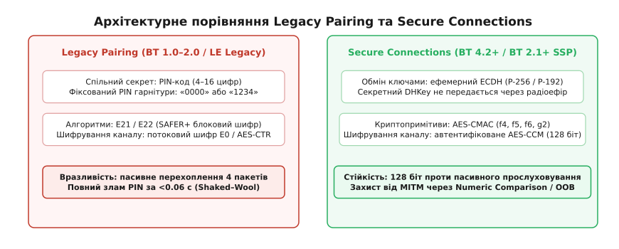
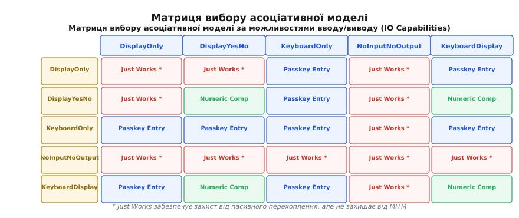
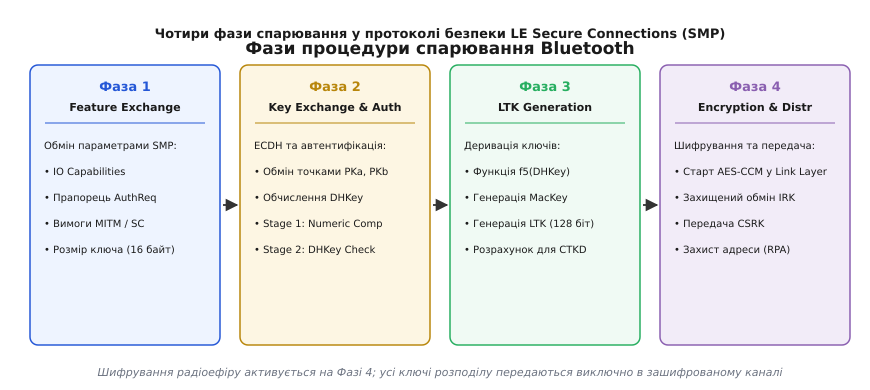
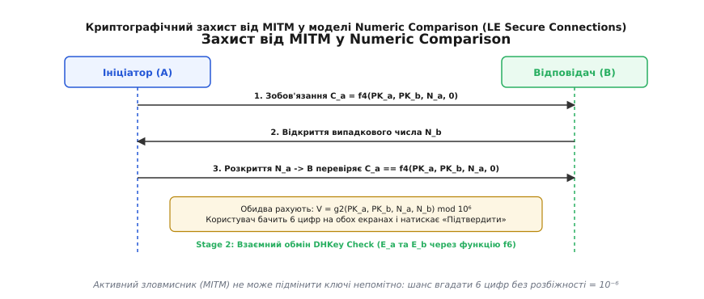

# Безпека спарювання Bluetooth

<preknowlist>
- [Криптосистема Діффі — Геллмана](root:sf-security/diffie-hellman) — принцип узгодження спільного таємного ключа у відкритому каналі через асиметричну математику.
- [Проблема дискретного логарифма](root:sf-security/discrete-log-problem) — обчислювальна односторонність та математична стійкість операцій на еліптичних кривих.
- [Стек Bluetooth Classic](root:com-transport/bluetooth-classic-stack) — рівні протоколів HCI, L2CAP та радіоканал між пристроями.
- [Bluetooth SPP](root:com-transport/bluetooth-spp) — принципи адресації BD_ADDR, встановлення з'єднання та роль у радіопросторі.
</preknowlist>

Коли два бездротові вузли встановлюють зв'язок у діапазоні 2.4 ГГц ISM, кожен радіочастотний пакет фізично поширюється у вільному просторі в усіх напрямках. Будь-який приймач із копійчаним SDR-тюнером у радіусі кількох десятків метрів безперешкодно фіксує кожен біт початкового рукостискання. Якщо довгострокові криптографічні ключі виводяться з короткого числового PIN-коду, введеного користувачем, пасивний спостерігач отримує змогу перебрати всі 10 000 можливих комбінацій 4-значного коду менш ніж за 0.06 секунди й отримати повний доступ до сеансового шифру. Захист бездротового каналу без попередньо узгодженої секретної інформації вимагає кардинальної перебудови архітектури: переходу від симетричних паролів до протоколу Діффі — Геллмана на еліптичних кривих, жорсткої автентифікації фізичного каналу та блокового шифрування AES.

---

### 1. Фізична відкритість радіоканалу та крах Legacy Pairing

У ранніх версіях Bluetooth (від 1.0 до 2.0+EDR) та в базовому режимі LE Legacy Pairing автентифікація спиралася на протокол **Legacy Pairing**. Його фундаментом був спільний секрет — PIN-код (Personal Identification Number) довжиною від 4 до 16 десяткових цифр або 128-бітний бінарний ключ.

Процедура створення спільного довгострокового ключа зв'язку (Link Key, `K_ab`) виконувалася в чотири послідовні кроки з використанням пропрієтарних алгоритмів на основі 128-бітного блокового шифру SAFER+:

```
1. Генерація тимчасового ключа ініціалізації:
   IN_RAND ───► [Алгоритм E22(PIN, IN_RAND, L_pin)] ───► Тимчасовий ключ K_init

2. Генерація випадкових часток Link Key:
   Пристрій A: LK_RAND_A ───► [E21(LK_RAND_A, BD_ADDR_A)] ───► LK_K_A
   Пристрій B: LK_RAND_B ───► [E21(LK_RAND_B, BD_ADDR_B)] ───► LK_K_B

3. Передача часток через радіоефір під маскою K_init:
   A ───► B: LK_RAND_A ⊕ K_init
   B ───► A: LK_RAND_B ⊕ K_init

4. Взаємне обчислення підсумкового ключа зв'язку:
   K_ab = LK_K_A ⊕ LK_K_B
```

Після розрахунку `K_ab` пристрої перевіряли правильність взаємного знання ключа за допомогою протоколу «запит-відповідь» `E1` (де пристрій надсилає випадковий виклик `AU_RAND`, а партнер повертає відгук `SRES = E1(K_ab, BD_ADDR, AU_RAND)`) і запускали потокове шифрування кадрів шифром `E0`.

Шифр SAFER+ (Secure and Fast Encryption Routine), розроблений Джеймсом Мессі, використовував 16 раундів підстановок на базі піднесення до степеня `45^x mod 257` у полі Байт та псевдоперетворення Адамара (PHT). Проте вразливість полягала не в самому ядрі шифру, а в протокольній композиції функцій `E21` та `E22`.

В ефір відкрито передаються псевдовипадкове число `IN_RAND`, замасковані величини `LK_RAND_A ⊕ K_init`, `LK_RAND_B ⊕ K_init` та контрольні пари виклику й відгуку автентифікації `E1` (`AU_RAND` та `SRES`). Єдиною невідомою змінною для зовнішнього радіоперехоплювача залишається короткий PIN-код.

```
+-----------------------------------------------------------------------------------+
|                        ПАСИВНИЙ ПЕРЕХОПЛЮВАЧ (SNIFFER)                            |
|                                                                                   |
|  Зафіксовано в ефірі:                                                             |
|  • IN_RAND                                                                        |
|  • Замасковані випадкові числа: (LK_RAND_A ⊕ K_init), (LK_RAND_B ⊕ K_init)        |
|  • Пакет перевірки взаємної автентифікації E1: AU_RAND, SRES                      |
|                                                                                   |
|  Алгоритм офлайн-атаки:                                                           |
|  Для кожного PIN_кандидат ∈ [0000 .. 9999]:                                       |
|    1. K_init' = E22(PIN_кандидат, IN_RAND)                                        |
|    2. LK_RAND_A' = (LK_RAND_A ⊕ K_init) ⊕ K_init'                                 |
|    3. LK_RAND_B' = (LK_RAND_B ⊕ K_init) ⊕ K_init'                                 |
|    4. K_ab' = E21(LK_RAND_A', BD_ADDR_A) ⊕ E21(LK_RAND_B', BD_ADDR_B)             |
|    5. SRES' = E1(K_ab', BD_ADDR_B, AU_RAND)                                       |
|    6. Якщо SRES' == SRES ──► ПРАВИЛЬНИЙ PIN ЗНАЙДЕНО!                             |
+-----------------------------------------------------------------------------------+
```

Для стандартного 4-значного PIN-коду простір пошуку налічує лише 10 000 комбінацій. Офлайн-перебір не потребує жодної радіовзаємодії з пристроями, обчислюється на одному процесорному ядрі за 0.06 секунди й миттєво відкриває доступ до довгострокового ключа `K_ab`. Ситуація погіршувалася тим, що масові периферійні пристрої без дисплеїв і клавіатур (гарнітури, автомобільні системи Hands-Free) постачалися з жорстко прошитими заводськими PIN-кодами «0000» чи «1234», що зводило практичну криптостійкість до нуля.

Детальний історичний контекст зламу Шакіда–Вула та подальших криптографічних ревізій висвітлено у вставці [📜 Еволюція криптографічного захисту Bluetooth: від PIN-кодів до еліптичних кривих](root:sf-security/bt-pairing-security/hist-pairing-evolution.md).


*Архітектурне порівняння застарілого Legacy Pairing на базі симетричного PIN-коду та сучасного Secure Connections на базі еліптичної криптографії P-256.*

---

### 2. Secure Simple Pairing: перехід до еліптичних кривих (ECDH)

Щоб назавжди усунути вразливість до пасивного перехоплення, консорціум Bluetooth SIG у специфікації Bluetooth Core 2.1+EDR ввів протокол **Secure Simple Pairing (SSP)**, який згодом еволюціонував у **LE Secure Connections** (Bluetooth 4.2+).

Замість симетричного пароля генерація ключів зв'язку спирається на асиметричний протокол обміну ключами Діффі — Геллмана на еліптичних кривих (Elliptic Curve Diffie-Hellman, ECDH):

1. **Генерація ефемерних пар:** Кожен пристрій створює одноразовий таємний скаляр `SK ∈ [1, n-1]` (де `n` — порядок базової точки) та обчислює відповідну відкриту точку на кривій:
   ```
   PK = SK · G
   ```
   де `G = (G_x, G_y)` — стандартизована генераторна точка еліптичної кривої.
2. **Відкритий обмін:** Вузли відкрито пересилають свої координати `PK_a = (X_a, Y_a)` та `PK_b = (X_b, Y_b)` через радіоефір.
3. **Обчислення спільного секрету:** Обидві сторони множать отриману відкриту точку партнера на свій таємний скаляр:
   ```
   Точка Z = SK_a · PK_b = SK_b · PK_a = (SK_a · SK_b) · G
   ```
4. **Спільний ключ:** 32-байтна координата `x` результуючої точки `Z = (x_z, y_z)` стає таємним спільним секретом — **`DHKey`**.

У специфікації Bluetooth 4.2+ застосовується стандартизована крива **NIST P-256** (secp256r1), визначена рівнянням Вейєрштрасса над простим полем `F_p`:
```
y² ≡ x³ - 3x + b (mod p)
```
де простий модуль `p = 2²⁵⁶ - 2²²⁴ + 2¹⁹² + 2⁹⁶ - 1`.

Для швидкого обчислення кратної точки `SK · P` без дорогих операцій ділення за модулем сучасні криптографічні бібліотеки переводять афінні координати `(x, y)` у проєктивні координати Якобі `(X : Y : Z)`, де `x = X / Z²` та `y = Y / Z³`. Алгоритм драбини Монтгомері (Montgomery Ladder) гарантує константний час множення точки незалежно від значення бітів скаляра, що унеможливлює атаки за побічними каналами (Simple/Differential Power Analysis).

Пасивний перехоплювач бачить в ефірі лише точки `PK_a` та `PK_b`. Щоб обчислити `DHKey`, він змушений знайти скаляр `SK_a` або `SK_b` із рівняння `PK = SK · G`, що вимагає розв'язання задачі дискретного логарифма на еліптичній кривій (ECDLP). Для кривої P-256 найкращі відомі алгоритми (метод ρ-Поларда) вимагають близько 2¹²⁸ групових операцій, що гарантує абсолютний криптографічний імунітет до пасивного радіошпигунства.

---

### 3. Проблема людини посередині (MITM) та моделі асоціації

Сам по собі протокол ECDH захищає **виключно від пасивного прослуховування**. Якщо активний зловмисник (атакуючий «Єва») перебуває між вузлами A та B у радіоефірі, він може підмінити відкриті ключі на власні точки:

```
Пристрій A (PK_a) ───► [ Єва перехоплює PK_a, надсилає PK_e1 ] ───► Пристрій B
Пристрій A ◄─── [ Єва надсилає PK_e2, перехоплює PK_b ] ◄─── Пристрій B (PK_b)
```

У результаті пристрій A узгодить спільний ключ `DHKey_1 = SK_a · PK_e2` з Євою, а пристрій B узгодить `DHKey_2 = SK_b · PK_e1` також із Євою. Атакуючий отримає змогу прозоро дешифрувати, модифікувати та повторно зашифровувати кожен пакет каналу.

Оскільки персональні пристрої Bluetooth не мають глобальної інфраструктури відкритих ключів (PKI) та цифрових сертифікатів, автентифікація каналу покладається на **допоміжний фізичний канал взаємодії з людиною**.

Залежно від апаратних можливостей вводу/виводу (наявність екрана, клавіатури, кнопок вибору) стандарт визначає **чотири асоціативні моделі (Association Models)**:

#### 1. Числове порівняння (Numeric Comparison)
Застосовується, коли обидва пристрої мають дисплей та клавіші «Так/Ні» (або один має дисплей і клавіші, а інший — клавіатуру та дисплей).
* Обидва вузли розраховують 6-значне десяткове число `V` від відкритих ключів та випадкових величин:
  ```
  V = g2(PK_a, PK_b, N_a, N_b) mod 10⁶
  ```
* Згенероване число одночасно виводиться на дисплеях обох пристроїв.
* Людина візуально порівнює значення й натискає кнопку «Підтвердити» на обох вузлах.
* Якщо зловмисник спробував підмінити точки на `PK_e1` та `PK_e2`, згенеровані числа на екранах виявляться різними. Ймовірність випадкового збігу 6 цифр при атаці становить лише 10⁻⁶ (один шанс на мільйон).

#### 2. Введення цифрового пароля (Passkey Entry)
Застосовується, коли один пристрій має лише цифрову клавіатуру (наприклад, бездротова клавіатура), а інший — екран (смартфон/ноутбук).
* Пристрій з екраном генерує випадковий 6-значний десятковий пароль `Passkey ∈ [000000 .. 999999]`.
* Користувач вручну набирає цей пароль на клавіатурі другого пристрою.
* Автентифікація виконується **порозрядно (bit-by-bit)** через 20 послідовних раундів підтвердження для кожного біта `r[i] ∈ {0, 1}` числа `Passkey = ∑ r[i] · 2ⁱ`. У кожному раунді сторони обмінюються зобов'язаннями `C_a[i] = f4(PK_a, PK_b, N_a[i], r[i])` та `C_b[i] = f4(PK_b, PK_a, N_b[i], r[i])`, після чого розкривають випадкові числа `N_a[i]` та `N_b[i]`. Спроба підбору біта на льоту викривається на першому ж хибному раунді з імовірністю 50%, а успіх обходу всіх 20 раундів становить 2⁻²⁰ ≈ 10⁻⁶.

#### 3. Позасмуговий обмін (Out of Band, OOB)
Використовує сторонній фізичний бездротовий або оптичний канал (зазвичай NFC або зчитування динамічного матричного QR-коду камерою).
* Відкриті ключі, випадкові числа `Nonce` та криптографічні зобов'язання передаються через NFC у форматі стандартного NDEF-запису (MIME-тип `application/vnd.bluetooth.le.oob`).
* Оскільки фізичні властивості ближнього поля NFC унеможливлюють непомітне перехоплення на відстані більше 4 см, модель гарантує абсолютний захист від MITM без необхідності ручного введення чи звірки цифр людиною.

#### 4. Просто працює (Just Works)
Застосовується, коли хоча б один із пристроїв не має ані екрана, ані клавіатури (профіль `NoInputNoOutput` — бездротові навушники, маячки, прості датчики).
* Процедура математично ідентична Numeric Comparison, але 6-значний код не відображається людині й підтверджується автоматично стеком.
* Режим надійно захищає від пасивного прослуховування завдяки ECDH P-256, але **принципово не захищає від активної атаки людини посередині (MITM)**.


*Матриця визначення моделі асоціації на основі комбінації IO Capabilities ініціатора та відповідача.*

Повний перелік структур кадрів SMP, бітові поля прапорців та коди помилок наведено у вставці [📋 Специфікація інтерфейсу: матриця IO Capabilities та структури пакетів SMP/HCI](root:sf-security/bt-pairing-security/api-pairing-matrix.md).

---

### 4. Криптографічний базис Secure Connections: сімейство функцій AES-CMAC

У специфікації Bluetooth 4.2+ весь криптографічний стек уніфіковано довкола стандартизованого алгоритму імітовставки **AES-CMAC** (RFC 4493), побудованого на базі блокового шифру AES-128:

```
1. Функція зобов'язання f4 (Commitment):
   f4(U, V, X, Z) = AES-CMAC_X(U || V || Z)
   де U, V — 32-байтні координати X відкритих ключів сторін,
      X — 16-байтний випадковий Nonce,
      Z — 1-байтний прапорець (для Numeric Comparison Z = 0x00).

2. Функція деривації ключів f5:
   f5(W, N_a, N_b, A_1, A_2) ──► генерує 256 біт виходу:
     • MacKey = f5_out[128 .. 255] (128-бітний ключ взаємної автентифікації f6);
     • LTK    = f5_out[0 .. 127]   (128-бітний довгостроковий ключ шифрування каналу AES-CCM).

3. Функція перевірки автентифікації f6 (DHKey Check):
   E_a = AES-CMAC_MacKey(N_a || N_b || R || IOCap_A || A_1 || A_2)
   E_b = AES-CMAC_MacKey(N_b || N_a || R || IOCap_B || A_2 || A_1)
   де R — випадковий вектор або пароль, IOCap — 3 байти параметрів спарювання.

4. Функція генератора коду Numeric Comparison g2:
   g2(U, V, X, Y) = AES-CMAC_X(U || V || Y)[0..3] mod 10⁶
```

Практичну реалізацію цих алгоритмів мовами C та C++ з урахуванням константного часу виконання представлено у вставці [⚙️ Практика: Криптографічні примітиви LE Secure Connections на C та C++](root:sf-security/bt-pairing-security/proj-pairing-crypto.md).

---

### 5. Покроковий протокол процедури спарювання (Pairing Protocol Sequence)

Процедура встановлення безпечного з'єднання в протоколі Security Manager Protocol (SMP) складається з чотирьох послідовних фаз.

```
       Ініціатор (Master / Initiator)                      Відповідач (Slave / Responder)
                     │                                                     │
   ══════════════════╪═════════════════════════════════════════════════════╪══════════════════
   ФАЗА 1: ОБМІН ХАРАКТЕРИСТИКАМИ (Pairing Feature Exchange)
                     │                                                     │
                     │ ──── Pairing Request (IOCap, AuthReq, KeySz) ────► │
                     │ ◄─── Pairing Response (IOCap, AuthReq, KeySz) ──── │
                     │                                                     │
   ══════════════════╪═════════════════════════════════════════════════════╪══════════════════
   ФАЗА 2: АСИМЕТРИЧНИЙ ОБМІН КЛЮЧАМИ ТА АВТЕНТИФІКАЦІЯ (ECDH & Auth)
                     │                                                     │
                     │ ──── Pairing Public Key (PK_a) ──────────────────► │
                     │ ◄─── Pairing Public Key (PK_b) ─────────────────── │
                     │                                                     │
                     │ [Обидва перевіряють точки на кривій та рахують DHKey]
                     │                                                     │
                     │ ─── Stage 1: Numeric Comparison / Passkey / OOB ─── │
                     │                                                     │
                     │ ─── Pairing DHKey Check (E_a = f6(...)) ──────────► │
                     │ ◄── Pairing DHKey Check (E_b = f6(...)) ─────────── │
                     │                                                     │
   ══════════════════╪═════════════════════════════════════════════════════╪══════════════════
   ФАЗА 3: ДЕРИВАЦІЯ ДОВГОСТРОКОВОГО КЛЮЧА (Long Term Key Generation)
                     │                                                     │
                     │ [Розрахунок LTK = f5(DHKey, N_a, N_b, A, B)[0..127]]
                     │                                                     │
   ══════════════════╪═════════════════════════════════════════════════════╪══════════════════
   ФАЗА 4: ЗАПУСК ШИФРУВАННЯ ТА РОЗПОДІЛ КЛЮЧІВ (Encryption & Distribution)
                     │                                                     │
                     │ ──── LL_ENC_REQ (Rand, EDIV, SKD_m) ──────────────► │
                     │ ◄─── LL_ENC_RSP (SKD_s) ─────────────────────────── │
                     │ ◄─── LL_START_ENC_REQ ───────────────────────────── │
                     │ ──── LL_START_ENC_RSP ────────────────────────────► │
                     │ ◄─── LL_START_ENC_RSP ───────────────────────────── │
                     │                                                     │
                     │   ╔═════════════════════════════════════════════╗   │
                     │   ║   УВІМКНЕНО ШИФРУВАННЯ КАНАЛУ AES-CCM       ║   │
                     │   ╚═════════════════════════════════════════════╝   │
                     │                                                     │
                     │ ◄─── Identity Information (IRK, Identity Addr) ─── │ (зашифровано)
                     │ ◄─── Signing Information (CSRK) ─────────────────── │ (зашифровано)
                     ▼                                                     ▼
```


*Послідовність виконання чотирьох фаз процедури спарювання у стеку Bluetooth.*

#### Детальний аналіз Фази 2: Автентифікація Stage 1 та Stage 2
1. **Перевірка валідності точок на кривій (Point Validation):** Отримавши відкриту точку партнера `PK = (X, Y)`, стек зобов'язаний переконатися, що координати задовольняють рівняння кривої `Y² ≡ X³ - 3X + b (mod p)` і точка не є нейтральним елементом. Це унеможливлює атаки типу Invalid Curve Attack, коли зловмисник надсилає точку слабкої підгрупи для вилучення бітів таємного скаляра `SK`.
2. **Криптографічне зобов'язання (Commitment):** Ініціатор A генерує псевдовипадкове 128-бітне число `N_a`, обчислює зобов'язання `C_a = f4(PK_a, PK_b, N_a, 0)` і надсилає `C_a` відповідачу. На цьому кроці саме число `N_a` залишається прихованим.
3. **Відповідь відповідача:** Відповідач B генерує випадкове число `N_b` і передає його у відкритому вигляді ініціатору.
4. **Розкриття зобов'язання:** Ініціатор A передає відкрите число `N_a`. Відповідач B самостійно обчислює `f4(PK_a, PK_b, N_a, 0)` і порівнює результат із раніше отриманим `C_a`. Якщо результати не збігаються, процедура негайно припиняється пакетом `Pairing Failed (Confirm Value Failed)`.
5. **Розрахунок числа звірки:** Обидва вузли розраховують `V = g2(PK_a, PK_b, N_a, N_b) mod 10⁶` та відображають 6 цифр людині.
6. **Автентифікація Stage 2 (DHKey Check):** Сторони обмінюються пакетами `Pairing DHKey Check` зі значеннями `E_a` та `E_b`, обчисленими за функцією `f6`. Це остаточно доводить, що обидва вузли володіють ідентичним спільним секретом `DHKey`, виведеним із автентичних відкритих точок.


*Криптографічна схема запобігання підміні ключів у моделі Numeric Comparison.*

#### Фаза 4: Управління шифруванням Link Layer та розподіл ключів
Після завершення Фази 3 хост передає згенерований довгостроковий ключ `LTK` контролеру. Контролер Link Layer переводить радіоканал у режим апаратного шифрування **AES-CCM** (Counter with CBC-MAC):

* Ініціатор та відповідач обмінюються 64-бітними випадковими векторами диверсифікації `SKD_m` та `SKD_s`.
* Обчислюється 128-бітний сеансовий ключ `SK = AES-128_LTK(SKD_m || SKD_s)`.
* Для кожного кадру даних формується унікальний 13-байтний вектор ініціалізації (Nonce):
  ```
  Nonce = Packet_Counter (39 біт) || Direction_Bit (1 біт) || IV (64 біти)
  ```
  де `IV = IV_m || IV_s` — вектор ініціалізації, а `Packet_Counter` інкрементується з кожним переданим кадром, що повністю виключає можливість атак повторного відтворення (Replay Attacks).
* До кожного кадру додається 4-байтний код контролю цілісності (Message Integrity Check, MIC).

Після активації шифрування сторони безпечно передають конфіденційні ключі:
* **Identity Resolving Key (IRK, 128 біт):** Використовується для генерації та розв'язання псевдовипадкових приватних адрес (Resolvable Private Addresses, RPA). Пристрій кожні 15 хвилин генерує нову випадкову MAC-адресу, що складається з 24-бітного випадкового числа `prand` та 24-бітного гешу `hash = ah(IRK, prand)[0..23]`. Сторонній спостерігач бачить постійно змінювані випадкові адреси, що унеможливлює радіолокаційне стеження за користувачем, тоді як довірений партнер за допомогою `IRK` миттєво ідентифікує пристрій.
* **Connection Signature Resolving Key (CSRK, 128 біт):** Застосовується для генерації цифрових підписів нешифрованих пакетів на рівні ATT.

---

### 6. Крос-транспортна деривація ключів (Cross-Transport Key Derivation, CTKD)

Сучасні комбіновані чипи (Dual-Mode Bluetooth / BR/EDR/LE) одночасно підтримують як класичний Bluetooth (профілі потокового аудіо A2DP, гучного зв'язку HFP), так і Bluetooth Low Energy (передача сенсорних даних GATT).

Щоб користувачеві не доводилося виконувати дві окремі процедури спарювання для одного фізичного пристрою, стандарт передбачає механізм **Cross-Transport Key Derivation (CTKD)**:

```
Спарювання через LE Secure Connections ──► Згенеровано LTK_LE (128 біт)
                                                  │
                                                  ▼
                                   [Функція деривації h6 / h7]
                                                  │
                                                  ▼
                                   Link Key для BR/EDR (K_classic)
```

Функція `h6` виводить класичний ключ зв'язку через алгоритм:
```
LinkKey = AES-CMAC_LTK("tmp1" || "br/edr")
```
Якщо обидва пристрої підтримують прапорець `CT2` (у полі `AuthReq`), застосовується вдосконалена функція `h7`, яка забезпечує підвищену криптографічну стійкість до атак відкату версій:
```
LinkKey = AES-CMAC_IL("br/edr"), де IL = AES-CMAC_Salt(LTK)
```

---

### 7. Сучасні вектори атак: KNOB, BIAS та BLUFFS

Попри математичну довершеність кривої P-256 та алгоритмів AES-CMAC, у 2019–2023 роках наукова спільнота виявила серію фундаментальних архітектурних вразливостей у механізмах зворотної сумісності та узгодження параметрів сеансу:

#### 1. Атака KNOB (Key Negotiation of Bluetooth, CVE-2019-9506)
У класичному протоколі Link Manager Protocol (LMP) розмір ключа шифрування узгоджується між контролерами за допомогою незахищених відкритих кадрів `LMP_encryption_key_size_req`. Специфікація допускала довжину ключа від 1 до 16 байтів.
* Активний зловмисник перехоплює кадр узгодження в ефірі та примусово змінює запропонований розмір на `1 байт` (8 біт ентропії).
* Обидва легітимні пристрої вважають, що їхній партнер підтримує лише 1 байт ентропії, і обрізають ключ шифрування до 8 біт.
* Атакуючий перебирає всі 256 можливих значень ключа (2⁸) за лічені мілісекунди та повністю розшифровує весь трафік сеансу.

#### 2. Атака BIAS (Bluetooth Impersonation Attack, CVE-2020-10135)
Експлуатує процедуру повторного підключення (Reconnection). Коли раніше спарені пристрої знову з'єднуються, вони пропускають повне спарювання і виконують лише швидку автентифікацію.
* Протокол дозволяв перемикання ролей (Master-Slave Switch) до завершення взаємної автентифікації.
* Якщо пристрій підтримував відкат до односторонньої автентифікації застарілих версій, зловмисник міг видати себе за відсутнього легітимного партнера, заявивши про відсутність підтримки Secure Connections.

#### 3. Атака BLUFFS (CVE-2023-24023)
Спрямована на процедуру деривації сеансових ключів у Bluetooth Classic BR/EDR. Маніпулюючи незахищеними випадковими числами `Nonce` під час ініціалізації сеансу шифрування, атакуючий може змусити пристрої вивести однаковий або слабкий сеансовий ключ шифрування, що дозволяє розшифрувати як поточні, так і збережені минулі сеанси (порушення властивості Forward Secrecy).

#### 4. Атаки зниження безпеки (Downgrade Attacks)
Якщо один із пристроїв налаштовано в гнучкому режимі підтримки застарілих стандартів, активний зловмисник може перехопити початковий кадр `Pairing Request` та скинути біт `SC (Secure Connections)` з `1` на `0`. Якщо жертва не вимагає обов'язкового режиму Secure Connections Only, стек автоматично відкочується до вразливого протоколу LE Legacy Pairing, де довгостроковий ключ `LTK` перехоплюється з ефіру за лічені мілісекунди.

---

### 8. Практична конфігурація та політика безпеки

Для гарантування надійного захисту бездротового зв'язку сучасне програмне забезпечення мікроконтролерів та операційних систем повинно спиратися на жорсткі правила конфігурації.

> 🔧 **Навіщо це.**
> У реальній розробці вбудованих систем (ESP-IDF, Zephyr OS, Linux BlueZ, Nordic nRF Connect SDK) некоректне налаштування прапорців безпеки призводить до того, що пристрій непомітно для розробника погоджується на застаріле неавтентифіковане спарювання. Щоб повністю закрити вразливості KNOB, BIAS та пасивного перехоплення, стек конфігурують у режимі **Secure Connections Only Mode (LE Security Mode 1, Level 4)**:
> 
> 1. **Заборона застарілого спарювання:** Встановлення обов'язкового біта `SC = 1` та відхилення з'єднань, якщо партнер намагається використати LE Legacy Pairing або криву P-192. У Zephyr OS це активується прапорцем `CONFIG_BT_SMP_SC_ONLY=y`, а в стеку Linux BlueZ — параметром `SecureConnections = true` у файлі `/etc/bluetooth/main.conf`.
> 2. **Мінімальна довжина ключа 16 байтів:** Стек зобов'язаний жорстко скидати з'єднання помилкою `Pairing Failed (Encryption Key Size)`, якщо узгоджена довжина ключа шифрування менша за 128 біт (повне нівелювання атаки KNOB).
> 3. **Обов'язковий захист від MITM для чутливих характеристик:** Для операцій запису в критичні характеристики GATT (оновлення прошивки OTA, керування реле або замком) встановлюється вимога прав доступу `ESP_GATT_PERM_WRITE_ENCRYPTED_MITM`. Якщо спарювання відбулося в режимі `Just Works`, спроба доступу до характеристики відхиляється стеком з кодом помилки `Insufficient Authentication (0x05)`.
> 4. **Зберігання ключів Bonding в апаратно захищеній пам'яті:** Довгострокові ключі `LTK` та `IRK` зберігаються в криптографічно захищених розділах Flash (NVS Encryption на базі апаратного ключа eFuse у чипах ESP32 або CC310/CryptoCell у Nordic nRF52/nRF53), що запобігає їх вилученню при фізичному викраденні пристрою.
