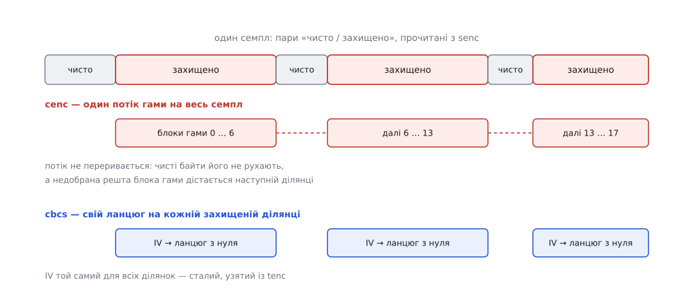

# ⚙️ Розшифровуємо один семпл: із `tenc` і `senc` до чистих байтів

Маючи фрагмент fMP4 і шістнадцять байтів ключа, від зашифрованого семпла до придатних для декодера байтів лишається менше сотні рядків — і кілька місць, де помиляється майже кожен, хто пише це вперше. Розберімо саме ці рядки.

## Задача

На вході — один фрагмент: `moof` з описом семплів і `mdat` з їхніми байтами. Ключ уже здобутий і лежить у пам'яті. Треба взяти один семпл і повернути його чистим, байт у байт таким, яким його бачив кодувальник.

Одразу про те, де такий код узагалі виконують. У живому програвачі його немає у звичайній пам'яті: ключ не покидає захищеного середовища чипа, і байти проходять шифр усередині нього. Але той самий код пишуть у пакувальнику, який перевіряє власну роботу; в аналізаторі, що дивиться, чи справді зашифровано те, що мало бути; у тесті сумісності; у програмному шляху з відкритим ключем, який браузери дають для налагодження. Тобто це не вправа — це те, що виконують усі інструменти навколо конвеєра.

## Що дістаємо з файла

Потрібні два описи, і вони лежать у різних місцях, бо мають різний час життя.

`tenc` оголошують один раз на доріжку, у сегменті ініціалізації. Там номер ключа, розмір початкового значення, а для візерункових схем — ще й самі числа візерунка та стале початкове значення. `senc` лежить у кожному фрагменті й описує кожен семпл окремо: його початкове значення й перелік пар «стільки чистих байтів, стільки захищених».

Головна пастка розбору сидить рівно тут: **`senc` не описує сам себе**. Скільки байтів займає початкове значення перед парами — у `senc` не написано; це знає лише `tenc`. Розбирач, що дістався фрагмента, не прочитавши сегмента ініціалізації, не має жодного способу пройти `senc` правильно.

Ось усе, що знадобиться далі:

```cpp
#include <algorithm>
#include <array>
#include <cstdint>
#include <cstring>
#include <vector>

using Block = std::array<uint8_t, 16>;

// AES-128: одне оборотне перетворення 16-байтового блока під ключем.
// Реалізація — з бібліотеки або з апаратного блока; тут потрібен лише інтерфейс.
struct Aes128 {
    explicit Aes128(const Block& key);
    void encrypt_block(const uint8_t in[16], uint8_t out[16]) const;
    void decrypt_block(const uint8_t in[16], uint8_t out[16]) const;
};

struct Subsample { uint32_t clear_bytes = 0, enc_bytes = 0; };

struct TrackEnc {                            // з tenc — типове на всю доріжку
    uint8_t is_protected = 0, per_sample_iv_size = 0;
    uint8_t crypt_byte_block = 0, skip_byte_block = 0;
    Block   kid{};
    std::vector<uint8_t> constant_iv;
};

struct SampleEnc {                           // з senc — на кожен семпл
    std::vector<uint8_t>   iv;
    std::vector<Subsample> subsamples;       // порожньо → захищений увесь семпл
};
```

:::tabs
```cpp
struct Reader {
    const uint8_t* p;
    uint8_t  u8()  { return *p++; }
    uint16_t u16() { uint16_t v = uint16_t(p[0] << 8 | p[1]); p += 2; return v; }
    uint32_t u32() { uint32_t v = uint32_t(p[0]) << 24 | uint32_t(p[1]) << 16
                                | uint32_t(p[2]) << 8  | p[3];  p += 4; return v; }
    void skip(size_t n) { p += n; }
};

// tenc — типові параметри доріжки: moov → … → stsd → encv → sinf → schi → tenc
TrackEnc parse_tenc(Reader r) {
    TrackEnc t;
    const uint32_t vf = r.u32();               // FullBox: 1 Б версія + 3 Б прапорці
    r.u8();                                    // reserved
    if ((vf >> 24) == 0) {
        r.u8();                                // версія 0 — ще один reserved
    } else {
        const uint8_t b = r.u8();              // версія 1 — візерунок у двох півбайтах
        t.crypt_byte_block = b >> 4;           // скільки блоків шифрувати
        t.skip_byte_block  = b & 0x0F;         // скільки лишити чистими
    }
    t.is_protected       = r.u8();
    t.per_sample_iv_size = r.u8();             // 0, 8 або 16 — БЕЗ цього senc не розібрати
    for (uint8_t& b : t.kid) b = r.u8();       // номер ключа, а не сам ключ
    if (t.is_protected && t.per_sample_iv_size == 0) {
        const uint8_t n = r.u8();              // саме випадок cbcs
        t.constant_iv.assign(r.p, r.p + n);
        r.skip(n);
    }
    return t;
}

// senc — на кожен семпл: початкове значення й пари «чисто / захищено»
std::vector<SampleEnc> parse_senc(Reader r, const TrackEnc& t) {
    const uint32_t vf = r.u32();
    const bool has_subsamples = (vf & 0x000002) != 0;   // прапорець, не версія
    const uint32_t count = r.u32();

    std::vector<SampleEnc> out(count);
    for (SampleEnc& s : out) {
        s.iv.assign(r.p, r.p + t.per_sample_iv_size);
        r.skip(t.per_sample_iv_size);
        if (!has_subsamples) continue;                  // захищений увесь семпл
        const uint16_t m = r.u16();
        s.subsamples.resize(m);
        for (Subsample& ss : s.subsamples) {
            ss.clear_bytes = r.u16();                   // 16 бітів
            ss.enc_bytes   = r.u32();                   // а тут уже 32
        }
    }
    return out;
}
```
```python
import struct

def parse_tenc(b):
    ver, off = b[0], 4          # FullBox: версія + прапорці
    off += 1                    # reserved
    if ver == 0:
        crypt = skip = 0
        off += 1
    else:
        crypt, skip = b[off] >> 4, b[off] & 0x0F
        off += 1
    is_protected, iv_size = b[off], b[off + 1]
    kid = b[off + 2:off + 18]
    off += 18
    const_iv = b''
    if is_protected and iv_size == 0:
        n = b[off]
        const_iv = b[off + 1:off + 1 + n]
    return dict(crypt=crypt, skip=skip, iv_size=iv_size, kid=kid, const_iv=const_iv)


def parse_senc(b, iv_size):
    has_subsamples = int.from_bytes(b[1:4], 'big') & 0x000002
    count, = struct.unpack_from('>I', b, 4)
    off, out = 8, []
    for _ in range(count):
        iv, off = b[off:off + iv_size], off + iv_size
        pairs = []
        if has_subsamples:
            m, = struct.unpack_from('>H', b, off)
            off += 2
            for _ in range(m):
                pairs.append(struct.unpack_from('>HI', b, off))   # 16 бітів і 32
                off += 6
        out.append((iv, pairs))
    return out
```
:::

Дрібниця, на якій ловляться: чисті байти рахують шістнадцятьма бітами, захищені — тридцятьма двома. Це не примха. Чиста частина — це заголовки, вони короткі назавжди; захищена — це тіло кадру, і воно легко переростає 65 535 байтів. Прочитаєш обидва поля однаково — розбір поїде на першому ж семплі й далі даватиме беззмістовні, але правдоподібні числа.

## Ідея: один прохід із перемиканням

Семпл — це стрічка: чисто, захищено, чисто, захищено. Пройти її можна за один раз, ведучи зсув від початку й вмикаючи-вимикаючи шифр. Уся різниця між двома схемами — у тому, що відбувається **всередині захищеної ділянки** і **що переживає стрибок через чисту**.

Яку саме процедуру викликати, каже сусідній блок `schm`: у ньому чотирибайтовий код схеми — `cenc` або `cbcs`. Це не одна процедура з прапорцем: спільний у них лише прохід по парах, а все, що всередині захищеної ділянки, різне з першого рядка.


*Стрічка вгорі — та сама для обох схем. Різниця лише в тому, що дешифратор несе із собою через сірі проміжки.*

## `cenc`: один наскрізний потік

У режимі лічильника [блоковий шифр](topic:sf-security/block-cipher) виробляє гаму — потік байтів, який накладають на дані порозрядним додаванням за модулем 2. Лічильний блок збирають так: старші вісім байтів — початкове значення з `senc`, молодші вісім — номер блока, що починається з нуля.

Ключове слово — **потік**. Не «шифр для ділянки», а один потік байтів на весь семпл. І це змушує зробити з нього об'єкт зі станом.

```cpp
class CtrKeystream {
public:
    CtrKeystream(const Aes128& aes, const uint8_t* iv, size_t iv_size)
        : aes_(aes), pos_(16) {                 // pos_ == 16 → блок гами ще не породжено
        counter_.fill(0);
        std::memcpy(counter_.data(), iv, iv_size);   // 8 Б лягають у СТАРШІ вісім байтів
    }

    // Накладає гаму на n байтів. Стан живе МІЖ викликами — і номер блока, і позиція в ньому.
    void apply(uint8_t* data, size_t n) {
        for (size_t i = 0; i < n; ++i) {
            if (pos_ == 16) {
                aes_.encrypt_block(counter_.data(), pad_.data());
                bump();
                pos_ = 0;
            }
            data[i] ^= pad_[pos_++];
        }
    }

private:
    void bump() {                               // +1 до молодших восьми байтів
        for (int i = 15; i >= 8; --i)           // старший байт — лівіший, як усюди в ISO BMFF
            if (++counter_[i] != 0) break;      // далі йдемо лише тоді, коли байт перекотився через нуль
    }
    const Aes128& aes_;
    Block  counter_{}, pad_{};
    size_t pos_;
};

void decrypt_cenc(const Aes128& aes, const SampleEnc& s, uint8_t* sample, size_t size) {
    CtrKeystream ks(aes, s.iv.data(), s.iv.size());   // ОДИН на весь семпл

    if (s.subsamples.empty()) { ks.apply(sample, size); return; }

    size_t off = 0;
    for (const Subsample& ss : s.subsamples) {
        off += ss.clear_bytes;                  // чисті байти просто перестрибуємо
        ks.apply(sample + off, ss.enc_bytes);   // потік продовжується з того місця, де спинився
        off += ss.enc_bytes;
    }
}
```

Зверніть увагу, що́ саме переживає стрибок. Не тільки номер блока — ще й `pos_`, позиція всередині поточного блока гами. Якщо захищена ділянка скінчилася посеред блока, недобрані байти цього блока дістануться наступній ділянці. Потік гами — це стрічка байтів, а не послідовність незалежних порцій по шістнадцять.

**Семпл: 32 Б чисто, 100 Б захищено, 5 Б чисто, 64 Б захищено:**

```
лічильний блок для блока номер i:
  байти 0…7   = початкове значення з senc   (сталі на весь семпл)
  байти 8…15  = i, старшим байтом уперед     (0, 1, 2, …)

перша захищена ділянка — 100 Б:
  повних блоків гами         = ⌊100 ÷ 16⌋ = 6    (номери 0…5)
  з блока 6 узято            = 100 − 96 = 4 Б
  у блоці 6 лишилося         = 12 Б

п'ять чистих байтів — лічильник їх НЕ бачить

друга захищена ділянка — 64 Б:
  12 Б       — решта блока 6
  48 Б       — блоки 7, 8, 9
   4 Б       — початок блока 10
```

Скинути потік на початку другої ділянки — і вона перетвориться на шум, хоч перша була бездоганна. На практиці більшість пакувальників роблять захищені ділянки кратними шістнадцяти, тож перехід зазвичай припадає рівно на межу блока; покладатися на це не можна, а правильна поведінка коштує одного поля `pos_`.

## `cbcs`: ланцюг заново на кожній ділянці

Тут усе навпаки. Початкове значення одне на всю доріжку — сталий IV із `tenc`, той самий для кожного семпла. Але **ланцюг зчеплення починається заново на кожній захищеній ділянці**: стандарт вимагає прикладати IV до першого зашифрованого блока кожної підділянки. Незалежність ділянок і дає ту саму паралельність, яку в `cenc` дає лічильник.

```cpp
void decrypt_cbcs(const Aes128& aes, const SampleEnc& s,
                  const TrackEnc& t, uint8_t* sample, size_t size) {
    const std::vector<uint8_t>& iv = s.iv.empty() ? t.constant_iv : s.iv;
    const unsigned crypt = t.crypt_byte_block ? t.crypt_byte_block : 1u;
    const unsigned skip  = t.skip_byte_block;          // 9 для відео, 0 — суцільно

    auto range = [&](uint8_t* p, size_t n) {
        Block chain{};
        std::memcpy(chain.data(), iv.data(), iv.size());   // ланцюг — З НУЛЯ, від сталого IV
        const size_t blocks = n / 16;                  // неповний хвіст лишається чистим
        for (size_t i = 0; i < blocks; ) {
            const size_t take = std::min<size_t>(crypt, blocks - i);
            for (size_t k = 0; k < take; ++k, ++i) {
                uint8_t* b = p + i * 16;
                Block cipher;
                std::memcpy(cipher.data(), b, 16);     // запам'ятати ДО розшифрування
                aes.decrypt_block(b, b);
                for (int j = 0; j < 16; ++j) b[j] ^= chain[j];
                chain = cipher;                        // наступна ланка — попередній ШИФРОТЕКСТ
            }
            if (skip == 0) break;                      // візерунка немає — шифруємо все
            i += skip;                                 // пропущені блоки ланцюг не рвуть
        }
    };

    if (s.subsamples.empty()) { range(sample, size); return; }

    size_t off = 0;
    for (const Subsample& ss : s.subsamples) {
        off += ss.clear_bytes;
        range(sample + off, ss.enc_bytes);             // IV і візерунок — заново на КОЖНІЙ
        off += ss.enc_bytes;
    }
}
```

Два місця в цьому циклі варті окремого погляду. Перше: `blocks = n / 16` — якщо захищена ділянка не кратна шістнадцяти, останні кілька байтів лишаються відкритим текстом. Доповнювати їх нема куди, бо довжина не має права змінитися, а неповний блок зчеплення не шифрують. Друге: `i += skip` не чіпає `chain`. Дев'ять пропущених блоків не розривають ланцюг — наступний зашифрований блок зчіплюється з попереднім **зашифрованим**, ніби чистих між ними не було. Ланцюг рветься лише на межі підділянки.

## Пастки

**Потік один на весь семпл.** Найчастіша помилка `cenc` — створити `CtrKeystream` усередині циклу по підділянках; цей рядок пишуть знову й знову. Симптом упізнаваний: перша захищена ділянка розшифровується бездоганно, решта — сміття. У картинці це кілька правильних рядків макроблоків угорі кадру й зелена каша нижче.

**Вісім байтів чи шістнадцять.** Восьмибайтове значення кладуть у **старші** вісім байтів лічильного блока, молодші вісім лишають нулями під номер блока. Доповнити зліва замість справа — і навіть нульовий блок гами вийде інший. Шістнадцятибайтові значення стандарт теж дозволяє: тоді всі шістнадцять байтів — це вже готовий початковий лічильний блок, а поширені реалізації нарощують у ньому ті самі молодші вісім.

**Порядок байтів лічильника.** Число росте від **останнього** байта — старшим байтом уперед, як і все інше в контейнері ([порядок байтів](topic:sf-algorithms/bits-bytes-endianness)). Нарощувати байт 8 замість байта 15 — це правильні перші шістнадцять захищених байтів і шум далі; помилка тим підступніша, що на короткому тесті з одного блока вона не проявляється взагалі.

**Довжина не змінюється — ніколи.** Розміри семплів записані в контейнері наперед, і покажчик побудований на них. Тому бібліотечний CBC треба брати в режимі **без доповнення**: типовий PKCS#7 або зажадає кратності, або відкине останній блок як службовий. У `cenc` цієї біди немає взагалі — гама накладається побайтово.

**`senc` може не бути.** Дані шифрування семплів — це «допоміжна інформація семплів», і законне місце для неї — `mdat`; знайти її дозволяють `saiz` із розмірами записів і `saio` зі зсувами. `senc` — лише зручна копія у фрагменті. Трапляється й старий блок PIFF: `uuid` з ідентифікатором `A2394F52-5A9B-4F14-A244-6C427C648DF4` і тим самим умістом. Розбирач, що шукає рівно `senc`, оголосить бездоганний файл незашифрованим — і мовчки віддасть декодеру шифротекст.

**Типове — не значить завжди.** Значення з `tenc` називаються типовими не для краси. У фрагменті може стояти пара `sbgp` і `sgpd` з описом групи `seig`, і для семплів цієї групи інші номер ключа, розмір початкового значення й візерунок — аж до того, що семпл узагалі не зашифрований. Саме цим роблять зміну ключа в польоті й чисті вставки посеред захищеної доріжки. Розбирач, що прочитав `tenc` і на цьому спинився, візьме на такому файлі не той ключ або почне «розшифровувати» чистий семпл — і в обох випадках мовчки видасть сміття.

**Пари мають зійтися.** Сума всіх `clear_bytes` і `enc_bytes` дорівнює розміру семпла — рівно, без залишку. Не зійшлося — ти вже читаєш не той шматок пам'яті. Перевірити це один раз дешевше, ніж потім шукати причину, чому «іноді ламається на деяких файлах».

## Чого це коштує

Обидві процедури лінійні за розміром семпла й працюють на місці, без жодного виділення пам'яті: буфер приходить із `mdat` і повертається розшифрованим у собі ж. Різниця тільки в кількості звернень до шифру. Для кадру 1080p із захищеною ділянкою близько 48 кілобайтів `cenc` викликає AES приблизно три тисячі разів, `cbcs` із візерунком один до дев'яти — близько трьохсот. На процесорі з апаратним AES це в обох випадках частки мілісекунди на кадр; на слабкому чипі приставки різниця вже відчутна.

Розпаралелити можна обидві, але з різною зернистістю. У `cenc` незалежний кожен шістнадцятибайтовий блок — треба лише знати його наскрізний номер, і ширший апаратний блок бере їх пачками. У `cbcs` ланцюг послідовний усередині ділянки, зате самі ділянки незалежні: одиниця роботи — підсемпл, а їх у кадрі стільки, скільки одиниць у закодованому кадрі ([медіаконтейнер](topic:com-signal/media-container) описує, як вони туди потрапляють).
