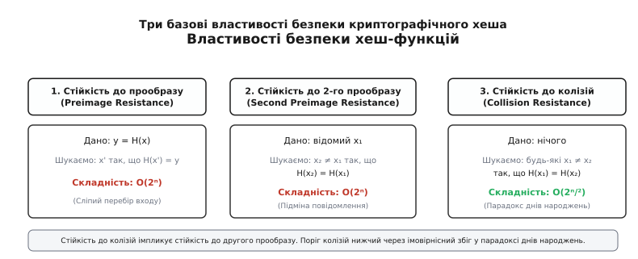
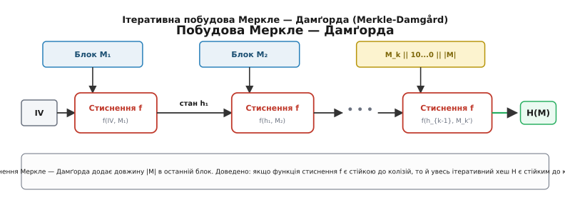
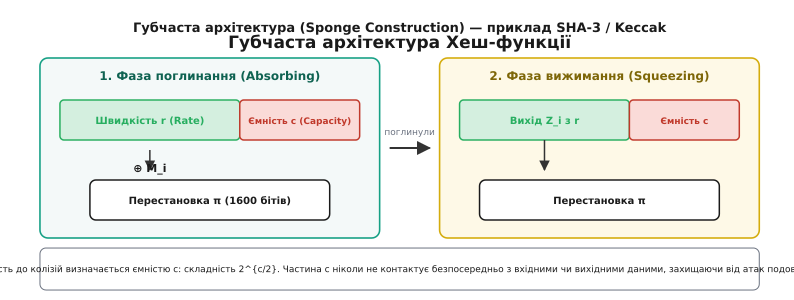
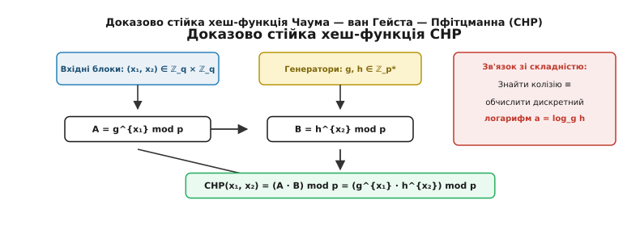

# Криптографічні хеш-функції

<preknowlist>
- [Модульна арифметика](root:math-number-theory/modular-arithmetic) — дії за модулем цілого числа, обчислення остач та кільцева структура `ℤ_n`.
- [Дискретне логарифмування](root:math-number-theory/discrete-logarithm) — математична складність обернення показникової функції у скінченних групах.
- [Хеш і цифровий підпис](root:sf-security/hash-and-digital-signature) — базові поняття відбитка даних, асиметричних ключів та цілісності інформації.
</preknowlist>

Під час передачі 4-гігабайтного образу операційної системи через мережу Інтернет або збереження пароля користувача у базі даних виникає одна й та сама фундаментальна математична потреба: стиснути потік бітів довільної неограниченої довжини у короткий відбиток строго фіксованого розміру (наприклад, 256 бітів), за яким неможливо відновити вихідні дані й який неможливо підробити. Якщо для перевірки цілісності взяти звичайну арифметичну суму байтів або контрольний код CRC-32, то зловмисник без жодних складних обчислень вирахує математичну різницю `Δ` і додасть її до підробленого файла, повністю зануливши її вплив на підсумкову контрольну суму. Для захисту від свідомого й обчислювально потужного супротивника потрібен математичний об'єкт із зовсім іншим рівнем безпеки — криптографічна хеш-функція.

Криптографічна хеш-функція — це детерміноване математичне відображення `H: {0,1}* → {0,1}ⁿ`, яке приймає бітовий рядок довільної довжини та повертає бітовий рядок строго фіксованої довжини `n`. На відміну від звичайних некриптографічних хеш-функцій у хеш-таблицях (де вимагається лише рівномірність розподілу ключових значень для мінімізації колізій у пам'яті), криптографічна хеш-функція повинна витримувати цілеспрямоване математичне протиборство з боку супротивника, який володіє повним знанням алгоритму та потужними обчислювальними ресурсами.

Оскільки область визначення хеш-функції `{0,1}*` є безкінечною, а область значень `{0,1}ⁿ` містить строго `2ⁿ` елементів, за принципом Діріхле (принципом ящиків) існує нескінченна кількість різних вхідних повідомлень, що дають абсолютно однакове хеш-значення. Тому безпека криптографічної хеш-функції полягає не у фізичній відсутності колізій, а в тому, що їх пошук є **обчислювально неможливим** за реальний час.

## Три математичні стовпи безпеки

Формальна криптографічна стійкість хеш-функції визначається трьома базовими вимогами, кожна з яких захищає свій вектор застосування криптографії.

### 1. Первинна стійкість (Preimage Resistance або Однобічність)

Якщо супротивнику надано лише підсумкове хеш-значення `y = H(x)`, то обчислювальна складність знаходження будь-якого вхідного повідомлення `x'`, для якого виконується рівність `H(x') = y`, повинна становити `O(2ⁿ)` операцій.

Ця властивість означає, що функція є математично незворотною. Знаючи хеш-відбиток, неможливо пройти розрахунки у зворотному напрямку та відновити вміст вихідного документа чи пароля. Єдиним універсальним способом відновлення вхідного повідомлення лишається прямий повний перебір усіх можливих комбінацій бітів. Для 256-бітового хеша складність `2²⁵⁶` означає, що навіть якщо об'єднати обчислювальну потужність усіх комп'ютерів Землі, розрахунок триватиме більше часу, ніж існує наш Всесвіт.

### 2. Друга первинна стійкість (Second Preimage Resistance або Стійкість до підміни)

Якщо супротивнику відомо конкретне вхідне повідомлення `x₁`, то обчислювальна складність знаходження *іншого* повідомлення `x₂ ≠ x₁` такого, що їхні хеш-значення збігаються (`H(x₁) = H(x₂)`), повинна становити `O(2ⁿ)` операцій.

Ця властивість гарантує, що якщо користувач підписав або зафіксував хеш юридичного контракту чи виконання програми `x₁`, ніхто не зможе підібрати альтернативний підроблений файл `x₂`, який матиме той самий відбиток і прослизне під виглядом оригінального.

### 3. Стійкість до колізій (Collision Resistance)

Обчислювальна складність знаходження *будь-якої* пари різних вхідних повідомлень `(x₁, x₂)` таких, що `x₁ ≠ x₂` та `H(x₁) = H(x₂)`, повинна становити не менше `O(2ⁿ/²)` операцій.

Зверни увагу на математичне співвідношення: складність пошуку колізії становить не `2ⁿ`, а `2ⁿ/²`. Ця суттєва різниця обумовлена ймовірнісним ефектом, відомим як [парадокс днів народжень](root:sf-security/hash-and-digital-signature).


*Три базові математичні властивості безпеки: первинна стійкість (однобічність), друга первинна стійкість (стійкість до підміни) та стійкість до колізій. Останній поріг становить 2ⁿ/² через парадокс днів народжень.*

Між цими властивостями існує строга математична імплікація: якщо хеш-функція є стійкою до колізій, вона автоматично є стійкою до другого прообразу.

Доведемо це математично методом від супротивного:
```
1. Припустимо, що функція H не є стійкою до другого прообразу.
2. Це означає існування алгоритму A, який для будь-якого даного входу x₁ знаходить x₂ ≠ x₁ з H(x₁) = H(x₂).
3. Побудуємо алгоритм B для пошуку колізій:
   a. Алгоритм B обирає довільне випадкове повідомлення x₁.
   b. Алгоритм B викликає алгоритм A(x₁) й отримує значення x₂.
   c. Оскільки x₂ ≠ x₁ та H(x₁) = H(x₂), пара (x₁, x₂) є колізією для H.
4. Отже, якщо зламано другу первинну стійкість, зламано й стійкість до колізій.
5. Звідси за законом контрапозиції: Стійкість до колізій ⇒ Друга первинна стійкість.
```

## Математика колізій та парадокс днів народження

Чому поріг пошуку колізій становить саме `O(2ⁿ/²)`?

Розглянемо множину можливих виходів хеш-функції `Y = {0,1}ⁿ`. Загальна кількість можливих хеш-значень дорівнює `N = 2ⁿ`. Припустимо, ми обчислили хеш-значення для `k` випадкових різних вхідних повідомлень.

Знайдемо ймовірність того, що серед `k` обчислених значень **немає жодної колізії** (тобто всі `k` хешів є унікальними).

Для першого повідомлення існує `N` вільних значень з `N`. Для другого повідомлення, щоб воно не збіглося з першим, є `N - 1` вільних значень з `N`. Для `k`-го повідомлення лишається `N - k + 1` вільних значень.

За правилом добутку ймовірностей незалежних подій:

```
P(немає колізії)
= (N / N) · ((N - 1) / N) · ((N - 2) / N) · ... · ((N - k + 1) / N)
= ∏_{i=0}^{k-1} (1 - i / N)
```

Застосуємо аналітичне наближення `1 - x ≈ exp(-x)` для малого `x = i / N`:

```
P(немає колізії)
≈ ∏_{i=0}^{k-1} exp(- i / N)
= exp(- ∑_{i=0}^{k-1} i / N)                      [властивість показника степеня]
```

Сума арифметичної прогресії перших `k - 1` цілих чисел дорівнює `(k · (k - 1)) / 2`. При великих `k` маємо `k · (k - 1) ≈ k²`. Отже:

```
P(немає колізії) ≈ exp(- k² / (2 · N))
```

Тоді ймовірність того, що **бодай одна колізія виникне**, становить:

```
P(колізія) = 1 - P(немає колізії) ≈ 1 - exp(- k² / (2 · N))
```

Прирівняємо ймовірність появі колізії до `0.5` (50% шанс знайти збіг):

```
1 - exp(- k² / (2 · N)) = 0.5
exp(- k² / (2 · N)) = 0.5
- k² / (2 · N) = ln(0.5) = - ln(2)
k² / (2 · N) = ln(2) ≈ 0.693
k² = 2 · ln(2) · N
k = √(2 · ln(2) · N) ≈ 1.177 · √N
```

Підставивши `N = 2ⁿ`, отримуємо фундаментальний поріг колізій:

```
k ≈ 1.177 · √(2ⁿ) = 1.177 · 2ⁿ/² = O(2ⁿ/²)
```

Цей результат визначає практичні розміри хеш-відбитків:
- **64-бітовий хеш:** поріг колізій `2³² ≈ 4.29 · 10⁹` операцій. Знаходиться за секунди на звичайному ноутбуці.
- **128-бітовий хеш (MD5):** поріг колізій `2⁶⁴ ≈ 1.84 · 10¹⁹` операцій. Пройдено криптоаналітиками у 2004 році.
- **160-бітовий хеш (SHA-1):** поріг колізій `2⁸⁰` операцій, зламано у 2017 році (атака SHAttered за `2⁶³` операцій).
- **256-бітовий хеш (SHA-256):** поріг колізій `2¹²⁸ ≈ 3.4 · 10³⁸` операцій. Перебуває далеко за межами будь-яких обчислювальних можливостей нашої цивілізації.

## Закони розсіювання: Строгий лавинний ефект (SAC) та BIC

Які саме статистичні властивості гарантують, що зміна хоча б одного біта на вході руйнує будь-яку схожість вихідного хеша?

У 1985 році дослідники Вебстер та Таварес (*A. F. Webster, S. E. Tavares*) сформулювали поняття **строгого лавинного ефекту** (**SAC**, *Strict Avalanche Criterion*):

> **Означення SAC:** Функція `H` задовольняє критерій строгого лавинного ефекту, якщо при зміні будь-якого одного біта вхідного повідомлення `x` кожен біт вихідного хеша `H(x)` змінює своє значення на протилежне з ймовірністю рівно `1/2`.

Математично це виражається через різницевий вектор `Δy`:

```
Δy = H(x) ⊕ H(x ⊕ e_i)
P(Δy_j = 1) = 0.5   для всіх вхідних індексів i та вихідних індексів j
```

де `e_i` — одиничний вектор, що містить `1` лише в `i`-й позиції.

Якщо ймовірність змінення будь-якого біта виходу відхиляється від `0.5`, супротивник отримує статистичний орієнтир для побудови диференціального криптоаналізу.

Другим важливим критерієм є **незалежність вихідних бітів** (**BIC**, *Bit Independence Criterion*): при інвертуванні будь-якого одного біта входу будь-яка пара вихідних бітів `(y_j, y_k)` повинна змінюватися абсолютно незалежно одна від одної.

Саме для досягнення SAC та BIC у хеш-функціях застосовують багатораундове змішування, де кожен раунд комбінує нелінійні підстановки, додавання за модулем `2³²` та циклічні зсуви на взаємно прості відстані.

## Анатомія симетричних алгоритмів: ARX та S-блоки

Усі практичні симетричні хеш-функції діляться на дві великі архітектурні родини за способом створення лавинного ефекту та нелінійності.

### 1. ARX-архітектура (Add-Rotate-XOR)

Алгоритми MD4, MD5, SHA-1, SHA-2 та BLAKE спираються на три найшвидші операції процесора над 32-бітовими або 64-бітовими словами:
- **Add:** додавання за модулем `2³²` або `2⁶⁴`.
- **Rotate:** циклічний зсув бітів слова на фіксовану відстань `ROTRⁿ(x)` чи `ROTLⁿ(x)`.
- **XOR:** побітове виключне або `a ⊕ b`.

Нелінійність урухомлюється арифметичним додаванням за модулем `2³²`. Оскільки перенос розрядів у додаванні `a + b` є нелінійною булевою функцією `c_{i+1} = (a_i ∧ b_i) ∨ (a_i ∧ c_i) ∨ (b_i ∧ c_i)`, систематичний ланцюг переносу розрядів у поєднанні з циклічними зсувами швидко розмазує кожен вхідний біт по всьому стану.

Алгебраїчний ступінь полінома в алгебраїчній нормальній формі (ANF) над `GF(2)` зростає з кожним переносом розряду. Уже після 3–4 раундів ARX алгебраїчний ступінь вихідних бітів досягає максимуму `n - 1`, що унеможливлює розв'язання системи рівнянь хеша методами обчислення базисів Ґрьобнера (алгоритми F4 та F5).

### 2. Архітектура на основі підстановок (S-Box / Substitution-Permutation Network)

Алгоритми MD2, RIPEMD, Grøstl та SHA-3 (Keccak) застосовують таблиці замін (S-блоки) або нелінійні булеві операції ступеня 2. Наприклад, у Keccak використовується нелінійна трансформація `χ` (Chi):

```
A'[x, y] = A[x, y] ⊕ ((¬A[x+1, y]) ∧ A[x+2, y])
```

Ця операція приймає 5 бітів строки та інвертує перший біт тоді й лише тоді, коли другий дорівнює 0, а третій 1. Завдяки цій алгебраїчній формі алгебраїчний ступінь стану зростає експоненційно з кожним раундом, унеможливлюючи рішення системи рівнянь методом лінеаризації.

## Внутрішній механізм SHA-256: від розкладу повідомлення до 64 раундів

Щоб зрозуміти, як ARX-операції перетворюють біти у практичних стандартах, розглянемо повний внутрішній цикл обробки одного 512-бітового блоку у хеш-функції **SHA-256**.

Хеш-функція зберігає 256-бітовий стан у вигляді 8 32-бітових змінних `(a, b, c, d, e, f, g, h)`. Ініціалізаційні значення `IV` беруться з дробових частин квадратних коренів перших 8 простих чисел (від 2 до 19).

### 1. Розклад повідомлення (Message Schedule Expansion)

Вхідний 512-бітовий блок розбивається на 16 32-бітових слів `W₀...W₁₅`. Потім цей масив розширюється до 64 слів `W₀...W₆₃` за формулою:

```
σ₀(x) = ROTR⁷(x) ⊕ ROTR¹⁸(x) ⊕ SHR³(x)
σ₁(x) = ROTR¹⁷(x) ⊕ ROTR¹⁹(x) ⊕ SHR¹⁰(x)

W_i = σ₁(W_{i-2}) + W_{i-7} + σ₀(W_{i-15}) + W_{i-16}  (mod 2³²)    [для i = 16...63]
```

Цей розклад гарантує, що навіть якщо два блоки повідомлення відрізняються лише в одному біті, розширені масиви `W` матимуть суттєво відмінні слова вже з 16-го раунду.

### 2. Основні раундові трансформації

Для кожного з 64 раундів обчислюються дві проміжні величини `T₁` та `T₂`:

```
Σ₀(a) = ROTR²(a) ⊕ ROTR¹³(a) ⊕ ROTR²²(a)
Σ₁(e) = ROTR⁶(e) ⊕ ROTR¹¹(e) ⊕ ROTR²⁵(e)

Ch(e, f, g)  = (e ∧ f) ⊕ (¬e ∧ g)                     [функція вибору Choice]
Maj(a, b, c) = (a ∧ b) ⊕ (a ∧ c) ⊕ (b ∧ c)             [функція більшості Majority]

T₁ = h + Σ₁(e) + Ch(e, f, g) + K_i + W_i              (mod 2³²)
T₂ = Σ₀(a) + Maj(a, b, c)                             (mod 2³²)
```

де `K_i` — 64 фіксовані раундові константи (дробові частини кубічних коренів перших 64 простих чисел).

Після цього стан зміщується за схемою:

```
h = g
g = f
f = e
e = d + T₁
d = c
c = b
b = a
a = T₁ + T₂
```

Після проведення всіх 64 раундів підсумкові значення `(a,b,c,d,e,f,g,h)` додаються до вхідного стану даного блоку (feed-forward).

## Ітеративні апарати: Побудова Меркле — Дамґорда

Як перетворити функцію стиснення, яка приймає лише входи фіксованого розміру, на хеш-функцію, здатну обробляти файли неограниченої довжини?

Класичною відповіддю стала **побудова Меркле — Дамґорда** (*Merkle-Damgård Construction*), розроблена незалежно Ральфом Меркле та Іваном Дамґордом у 1989 році.


*Схема ітеративної побудови Меркле — Дамґорда. Повідомлення розбивається на блоки однакові за розміром, до останнього додається підкладка зі зміцненням (довжиною |M|). Кожен крок виконує функція стиснення f.*

Процес обробки складається з трьох послідовних етапів:

### 1. Підкладка та зміцнення (Padding & Merkle-Damgård Strengthening)

Нехай вхідне повідомлення `M` має довжину `L = |M|` бітів.

Розмір блоку обробки позначимо через `b` бітів (у SHA-256 `b = 512` бітів = 64 байти).

До повідомлення `M` приєднується:
1. Один біт `1` (`0x80`).
2. Кількість нульових бітів `0` (позначимо через `k`), де `k` — найменше невід'ємне ціле число таке, що `(L + 1 + k) mod b = b - 64`.
3. 64-бітове ціле число без знаку, що дорівнює точній початковій довжині `L` у бітах.

Така підкладка гарантує, що доповнене повідомлення ділиться на блоки розміром `b` бітів: `M' = M₁ || M₂ || ... || M_m`. Додавання суфікса довжини `L` називається **зміцненням Меркле — Дамґорда** й відіграє вирішальну роль у доведенні теореми про безпеку.

### 2. Ітеративна обробка блоків

Визначається фіксований початковий вектор ініціалізації `IV` (англ. *Initialization Vector*) розміру `c` бітів.

Обчислення хеша відбувається за рекурентною схемою:

```
h₀ = IV
h₁ = f(h₀, M₁)
h₂ = f(h₁, M₂)
...
h_m = f(h_{m-1}, M_m)
H(M) = h_m
```

де `f: {0,1}ᶜ × {0,1}ᵇ → {0,1}ᶜ` — внутрішня однобічна функція стиснення.

Для створення самісінької функції стиснення `f` найчастіше застосовують **структуру Давіса — Майєра** (*Davies-Meyer Construction*), яка перетворює блоковий шифр `E_K(X)` на функцію стиснення:

```
f(h_{i-1}, M_i) = E_{M_i}(h_{i-1}) ⊕ h_{i-1}
```

Додавання `⊕ h_{i-1}` на виході називається зв'язком feed-forward й гарантує незворотність шифру навіть при знанні ключа.

### Теорема про редукцію безпеки Меркле — Дамґорда

Фундаментальне значення побудови Меркле — Дамґорда полягає у тому, що вона дає строге математичне доведення безпеки:

**Теорема.** Якщо функція стиснення `f` є стійкою до колізій, то й побудована ітеративна хеш-функція `H` є стійкою до колізій.

Доведемо цю теорему шляхом конструктивної побудови колізії для `f` із колізії для `H`.

Нехай ми знайшли колізію для хеш-функції `H`, тобто два різних повідомлення `X ≠ Y` такі, що `H(X) = H(Y)`.

Нехай після підкладки повідомлення `X` розбивається на `m` блоків `X₁...X_m`, а повідомлення `Y` — на `k` блоків `Y₁...Y_k`.

Розглянемо два випадки:

**Випадок 1: Довжини повідомлень різні (`|X| ≠ |Y|`).**

Оскільки довжини різні, останні 64-бітові блоки зміцнення в `X_m` та `Y_k` містять різні значення довжини, отже `X_m ≠ Y_k`.

Однак за умовою колізії `H(X) = H(Y)`, що означає `f(h_{m-1}, X_m) = f(g_{k-1}, Y_k)`.

Це означає, що пара `(h_{m-1}, X_m)` та `(g_{k-1}, Y_k)` є прямою колізією для внутрішньої функції стиснення `f`!

**Випадок 2: Довжини повідомлень однакові (`|X| = |Y|`), отже `m = k`.**

Оскільки `H(X) = H(Y)`, маємо `f(h_{m-1}, X_m) = f(g_{m-1}, Y_m)`.

Якщо `(h_{m-1}, X_m) ≠ (g_{m-1}, Y_m)`, ми негайно отримали колізію для `f`.

Якщо ж `(h_{m-1}, X_m) = (g_{m-1}, Y_m)`, то `X_m = Y_m` та `h_{m-1} = g_{m-1}`.

Тоді переходимо на один крок назад: `f(h_{m-2}, X_{m-1}) = f(g_{m-2}, Y_{m-1})`.

Оскільки повідомлення `X` та `Y` за умовою є **різними** (`X ≠ Y`), існує бодай один індекс `i` (де `1 ≤ i ≤ m`), на якому `X_i ≠ Y_i`.

Рухаючись назад від `m` до `1`, ми обов'язково натрапимо на найперший з кінця індекс `j`, де `(h_{j-1}, X_j) ≠ (g_{j-1}, Y_j)`, але `f(h_{j-1}, X_j) = f(g_{j-1}, Y_j)`.

Це дає точну колізійну пару для внутрішньої функції стиснення `f`. ∎

Детальніше про історію розвитку алгоритмів від MD4 до новітніх конкурсів читай у [еволюції криптографічних хеш-функцій](root:sf-security/cryptographic-hash-functions/hist-hash-evolution.md).

### Багатоколізійна атака Жу (Joux's Multicollisions)

У 2004 році французький криптоаналітик Антуан Жу (*Antoine Joux*) відкрив вражаючий математичний недолік усіх хеш-функцій Меркле — Дамґорда.

У ідеальній хеш-функції (випадковому оракулі) для знаходження `2ᵏ` повідомлень з однаковим хешем потрібно витратити `O(2^{n · (2ᵏ - 1) / 2ᵏ})` операцій. Тобто для `2²` (чотирьох) колізій знадобилося б `2^{3/4 · n}` зусиль.

Жу довів, що для будь-якої хеш-функції Меркле — Дамґорда складність знаходження `2ᵏ` колізій становить лише:

```
Складність(2ᵏ колізій) = k · 2ⁿ/²
```

Механізм атаки Жу є ітеративним:
1. Спочатку шукають дві різні блоки `M₁` та `M₁'` такі, що `f(IV, M₁) = f(IV, M₁') = h₁`. На це витрачається `2ⁿ/²` операцій.
2. Потім з нового стану `h₁` шукають блоки `M₂` та `M₂'` такі, що `f(h₁, M₂) = f(h₁, M₂') = h₂`. На це витрачається ще `2ⁿ/²` операцій.
3. Повторивши процес `k` разів, ми маємо `k` незалежних пар колізійних блоків.

Будь-яка комбінація з обраного блоку `(M_i або M_i')` для всіх `i = 1...k` дасть точнісінько один і той самий підсумковий хеш `h_k`! Це дає `2ᵏ` колізійних повідомлень всього за `k · 2ⁿ/²` обчислень замість астрономічних оцінок.

### Вразливість Меркле — Дамґорда: Атака подовження повідомлення

Незважаючи на теоретичну стійкість до колізій, побудова Меркле — Дамґорда володіє суттєвою структурною особливістю — **атакою подовження повідомлення** (*Length Extension Attack*).

Якщо секретне значення `K` хешується шляхом простої конкатенації `H(K || M)`, супротивник, знаючи хеш `h = H(K || M)` та довжину `|K || M|`, може обчислити правильне значення `H(K || M || pad || M')` для будь-якого свого доповнення `M'`, навіть не знаючи секретного ключа `K`!

Це можливо тому, що вихід хеша `h` є повним внутрішнім станом функції стиснення на останньому кроці. Прийнявши `h` за новий вектор ініціалізації `IV'`, супротивник може продовжувати обчислення наступних блоків.

Для вирішення цієї проблеми було створено захищену конструкцію **HMAC** (*Hash-based Message Authentication Code*):

```
HMAC(K, M) = H((K ⊕ opad) || H((K ⊕ ipad) || M))
```

де `ipad = 0x3636...36`, `opad = 0x5C5C...5C`. Подвійне ортагональне обгортання повністю закриває внутрішній стан від зовнішнього продовження.

Практичний код алгоритму Меркле — Дамґорда та реалізацію атаки разом з HMAC розібрано у [реалізації Меркле — Дамґорда та HMAC](root:sf-security/cryptographic-hash-functions/proj-merkle-damgard.md).

## Деревні хеш-структури та паралельне хешування (BLAKE3)

Класична послідовна обробка Меркле — Дамґорда створює вузьке місце у сучасних багатоядерних обчислювальних системах: блок `M_2` неможливо обчислити, доки не завершиться обчислення `h_1 = f(h_0, M_1)`.

Для усунення цього обмеження розроблено **деревні хеш-структури** (*Tree Hashing*), яскравим представником яких є новітній алгоритм **BLAKE3** (2020 рік).

У деревній хеш-структурі:
1. Вхідний файл розбивається на незалежні блоки по 1024 байти (листя дерева).
2. Кожен блок хешується незалежно на окремому ядрі процесора чи векторному SIMD-регістрі (AVX-512 / NEON).
3. Сусідні відбитки об'єднуються у батьківські вузли `H(node_left || node_right)` у вигляді двійкового дерева Меркле.

Деревна структура забезпечує не лише лінійне прискорення обчислень зі збільшенням кількості ядер CPU, але й дозволяє інкрементальне оновлення хеша терабайтних файлів (при зміні 1 байта перераховується лише одна гілка дерева висоти `log₂ N`).

## Губчаста архітектура (Sponge Construction) та SHA-3

Прагнучи позбутися структурних недоліків побудови Меркле — Дамґорда, бельгійські науковці Гвідо Бертоні, Йоан Демен, Міхаель Пітерс та Жиль Ван Аше розробили **губчасту архітектуру** (*Sponge Construction*), втілену в алгоритмі Keccak (стандарт **SHA-3**).


*Губчаста архітектура SHA-3/Keccak. Внутрішній стан b = r + c ділиться на швидкість r та ємність c. У фазі поглинання дані додаються через XOR до r; фаза вижимання зчитує вихідні блоки з r.*

Внутрішній стан `S` губчастої функції має велику фіксовану довжину `b = r + c` бітів (у SHA-3 `b = 1600` бітів):
- **Rate (`r`, швидкість):** частина стану, що безпосередньо приймає вхідні байти й видає хеш-значення.
- **Capacity (`c`, ємність):** прихована частина стану, яка ніколи не відкривається назовні й не контактує з вхідними чи вихідними даними.

Процес обробки ділиться на дві фази:

### 1. Фаза поглинання (Absorbing Phase)

1. Вхідне повідомлення `M` доповнюється підкладкою й ділиться на блоки по `r` бітів: `M₁...M_k`.
2. Внутрішній стан `S` ініціалізується нулями.
3. Для кожного блоку `M_i`:
   - Блок `M_i` додається за операцією XOR до перших `r` бітів стану: `S[0...r-1] = S[0...r-1] ⊕ M_i`.
   - До всього стану `S` застосовується псевдовипадкова безключова перестановка `π: {0,1}ᵇ → {0,1}ᵇ`: `S = π(S)`.

### 2. Фаза вижимання (Squeezing Phase)

1. Перші `r` бітів стану `S[0...r-1]` повертаються як перший блок вихідного хеша `Z₁`.
2. Якщо потрібна більша довжина хеша, до стану `S` знову застосовується перестановка `S = π(S)`, і зчитується наступний блок `Z₂`.
3. Процес повторюється до отримання потрібної довжини виходу `n`.

Математична перевага губчастої архітектури полягає у тому, що стійкість до колізій визначається виключно ємністю `c`: складність пошуку колізій дорівнює `O(2^{c/2})`, а стійкість до первинного прообразу становить `O(2^{\min(n, c)})`. Оскільки частина `c` схована від зовнішнього спостерігача, губчаста архітектура є математично імунною до атак подовження повідомлення.

Крім того, губчаста архітектура природно підтримує функції з виходом довільної довжини (XOF, *Extendable-Output Functions*), такі як SHAKE128 та SHAKE256, де користувач може вижати стільки байтів хеша, скільки вимагає його криптографічний протокол.

## Хешування у протоколах консенсусу (Proof-of-Work)

Окремим вагомим вектором застосування криптографічних хеш-функцій стали розподілені протоколи консенсусу у блокчейн-мережах.

У механізмі **Proof-of-Work (PoW)**, розробленому Адамом Беком у системі Hashcash (1997) та розширеному Сатоші Накамото у Bitcoin (2008), хеш-функція SHA-256 використовується як обчислювальний бар'єр:

```
SHA256(SHA256(BlockHeader || Nonce)) < Target
```

Майнер повинен підбирати одноразове число `Nonce` доти, доки подвійне хеш-значення заголовку блоку не виявиться меншим за поточний складний поріг `Target`. Оскільки вихід SHA-256 задовольняє критерій SAC і розподілений абсолютно рівномірно, єдиним способом знайти такий `Nonce` є сліпий перебір. Очікувана кількість хешувань для знаходження блоку становить `2³² · Difficulty`.

Для захисту від спеціалізованих інтегральних схем (ASIC) у новіших блокчейнах розроблено **пам'ятно-важкі Proof-of-Work хеші** (Ethash, Equihash), які вимагають випадкового зчитування гігабайтів даних із RAM (DAG-файли), роблячи швидкі обчислення на вузьких реєстрах ASIC недоцільними.

## Доказово стійкі хеш-функції на основі теорії чисел

Усі розглянуті вище симетричні хеш-функції (SHA-2, SHA-3) спираються на евристичне змішування бітів. Їхня безпека обґрунтована тим, що за роки криптоаналізу ніхто не знайшов ефективної атаки.

Однак існує альтернативний напрямок — **доказово стійкі хеш-функції** (*Provably Secure Hash Functions*), де стійкість до колізій строго зводиться до відомих важких математичних задач теорії чисел (дискретне логарифмування, факторизація N, пошук найкоротшого вектора у решітках).

### Хеш-функція Чаума — ван Гейста — Пфітцманна (CHP)

У 1991 році Девід Чаум, Ежен ван Гейст та Біргіт Пфітцманн запропонували хеш-функцію, стійкість якої строго базується на складності обчислення дискретного логарифма у скінченних групах.


*Схема хеш-функції Чаума — ван Гейста — Пфітцманна (CHP). Вхідні блоки підносяться до степеня генераторів g та h за модулем безпечного простого числа p.*

Математична побудова CHP:

1. Обирають безпечне просте число `p = 2q + 1`, де `q` — також просте число.
2. Обирають підгрупу `G ⊂ ℤ_p*` простого порядку `q`.
3. Обирають два випадкові генератори `g` та `h` підгрупи `G` такі, що дискретний логарифм `a = log_g h (mod q)` є невідомим для всіх.
4. Вхідне повідомлення ділять на блоки з двох чисел `(x₁, x₂)`, де `0 ≤ x₁, x₂ < q`.

Функція хешування обчислюється як:

```
CHP(x₁, x₂) = (g^{x₁} · h^{x₂}) mod p
```

### Теорема про зведення до дискретного логарифма

**Теорема.** Знаходження колізії для CHP є еквівалентним обчисленню дискретного логарифма `a = log_g h (mod q)`.

**Доведення.** Нехай знайдено дві різні пари `(x₁, x₂) ≠ (y₁, y₂)` такі, що `CHP(x₁, x₂) = CHP(y₁, y₂)`.

Тоді за модулем `p` маємо:

```
g^{x₁} · h^{x₂} ≡ g^{y₁} · h^{y₂} (mod p)
```

Підставимо `h = gᵃ mod p`:

```
g^{x₁} · (gᵃ)^{x₂} ≡ g^{y₁} · (gᵃ)^{y₂} (mod p)
g^{x₁ + a·x₂} ≡ g^{y₁ + a·y₂} (mod p)
```

Оскільки `g` має порядок `q`, рівність степенів за модулем `p` означає порівняння показників за модулем `q`:

```
x₁ + a·x₂ ≡ y₁ + a·y₂ (mod q)
x₁ - y₁ ≡ a · (y₂ - x₂) (mod q)
```

Якщо `y₂ ≢ x₂ (mod q)`, ми можемо помножити обидві частини на обернений елемент `(y₂ - x₂)⁻¹ mod q`:

```
a ≡ (x₁ - y₁) · (y₂ - x₂)⁻¹ (mod q)
```

Таким чином, маючи колізію `(x₁, x₂)` та `(y₁, y₂)`, ми за мить знайшли секретний дискретний логарифм `a`! ∎

Детальніше доведення та приклад обчислень у скінченному полі дивись у [математичному виведенні та аналізі функції CHP](root:sf-security/cryptographic-hash-functions/math-chp-proof.md).

Головним недоліком теорії-числових хеш-функцій є швидкість: обчислення модульних піднесень до степеня `g^{x₁} mod p` вимагає значно більше тактів процесора, ніж побітові операції SHA-256. Тому CHP застосовується там, де теоретичне доведення безпеки є критичнішим за абсолютну швидкість.

## Хешування у системах із нульовим розголошенням (ZK-Hashes)

З розвитком криптографічних доведень із нульовим розголошенням (ZK-SNARKs та ZK-STARKs) виникла потреба у хеш-функціях нового типу.

У ZK-доведеннях будь-яка обчислювальна операція перетворюється на систему алгебраїчних рівнянь над скінченним полем `𝔽_p` (системи R1CS або PlonKish arithmetization).

Звичайні хеш-функції типу SHA-256 оперують побітовими зсувами та додаваннями `mod 2³²`. Перетворення одного 32-бітового побітового зсуву в арифметичне рівняння над полем `𝔽_p` вимагає розбиття числа на біти, що породжує тисячі арифметичних обмежень (constraints). Хешування одного блоку SHA-256 у ZK-доведенні вимагає близько 25 000 обмежень.

Для вирішення цієї проблеми було створено **ZK-дружні хеш-функції** (*ZK-friendly Hashes*): **Poseidon**, **Rescue**, **Anemoi** та **Monolith**.

Ці хеш-функції побудовані прямо над полем `𝔽_p` й застосовують математичні S-блоки у вигляді піднесення до малого степеня:

```
S(x) = xᵃ mod p,   де gcd(α, p-1) = 1 (зазвичай α = 3 або α = 5)
```

Для прикладу, у полів `𝔽_p` піднесення `x⁵` є нелінійним алгебраїчним степенем 5, проте кодується всього **одним** R1CS-обмеженням: `y = x²`, `z = y²`, `out = z · x`. Завдяки цьому Poseidon вимагає лише близько 200 обмежень на один блок — у 100 разів менше за SHA-256!

## Квантова стійкість криптографічних хеш-функцій

Окремим важливим питанням для довгострокової безпеки даних є стійкість хеш-функцій до атак із використанням квантових комп'ютерів.

У той час як асиметричні алгоритми RSA та ЕК-підписи (ECDSA) повністю ламаються квантовим алгоритмом Шора за поліноміальний час, симетричні хеш-функції показують суттєво вищу стійкість:

1. **Пошук прообразу (Алгоритм Ґровера):** Квантовий алгоритм Ґровера (*Grover's Search Algorithm*) дає квадратичне прискорення перебору універсальної однобічної функції. Складність знаходження первинного прообразу зменшується з `O(2ⁿ)` до `O(2ⁿ/²)`. Це означає, що 128-бітовий хеш MD5 у квантовому світі матиме лише 64 біти стійкості (що зламується миттєво), тоді як 256-бітовий хеш SHA-256 дає 128 бітів квантової стійкості, що лишається цілком надійним і неприступним.
2. **Пошук колізій (Алгоритм BHT):** Квантовий алгоритм Брассара — Гоєра — Таппа (*BHT Algorithm*) поєднує парадокс днів народжень із пошуком Ґровера й дозволяє знаходити колізії за `O(2ⁿ/³)` операцій.

Таким чином, для забезпечення стійкості проти майбутніх квантових обчислювачів криптографічні стандарти (NIST PQC) вимагають переходу на 256-бітові та 512-бітові хеш-функції (SHA-256, SHA3-256, SHA-512, SHAKE256), які задовільняють вимоги квантової безпеки без зміни самої математичної конструкції.

## Порівняльний аналіз архітектур та застосування

Для швидкого орієнтування при виборі хеш-функції у реальних системах зведемо основні параметри сучасних архітектур у порівняльну таблицю:

```
Алгоритм     Архітектура           Розмір виходу (біти)  Стійкість до колізій  Імунітет до Length Extension  Основна сфера застосування
-----------------------------------------------------------------------------------------------------------------------------------------
MD5          Merkle-Damgård        128                   Зламано (2³⁹)         Ні                            Застарілий (не застосовувати)
SHA-1        Merkle-Damgård        160                   Зламано (2⁶³)         Ні                            Застарілий (не застосовувати)
SHA-256      Merkle-Damgård        256                   2¹²⁸                  Ні (потрібен HMAC)            TLS, Bitcoin, системні відбитки
SHA3-256     Губчаста (Sponge)     256                   2¹²⁸                  Так                           Ethereum, криптопротоколи
BLAKE3       Паралельне дерево     256                   2¹²⁸                  Так                           Високопродуктивна цілісність
Poseidon     Алгебраїчна (𝔽_p)     256                   2¹²⁸                  Так                           Zero-Knowledge (ZK-SNARKs)
CHP          Теорія чисел (DLP)    log₂ q                2^{|q|/2}             Так                           Доказова криптографія
```

> 🔧 **Навіщо це у розробці.**
> 1. **Вибір алгоритму:** Для загальних завдань цілісності (TLS, підпис коду, блокчейн) використовують **SHA-256**, **SHA-384** або **SHA3-256**. Якщо потрібна надвища швидкість на терабайтах даних — застосовують **BLAKE3**.
> 2. **Автентифікація повідомлень:** Ніколи не хешуй secret key як `SHA256(key + message)` через вразливість до атак подовження. Використовуй тільки **HMAC-SHA256** або губчасті функції (KMAC).
> 3. **Збереження паролів:** Ніколи не зберігай відбитки паролів у базі даних через прямий `SHA256(password)`. Для захисту від перебору на GPU/ASIC застосовують спеціалізовані функції з пам'ятно-важкою розтяжкою ключа: **Argon2id**, **bcrypt** або **PBKDF2**.
