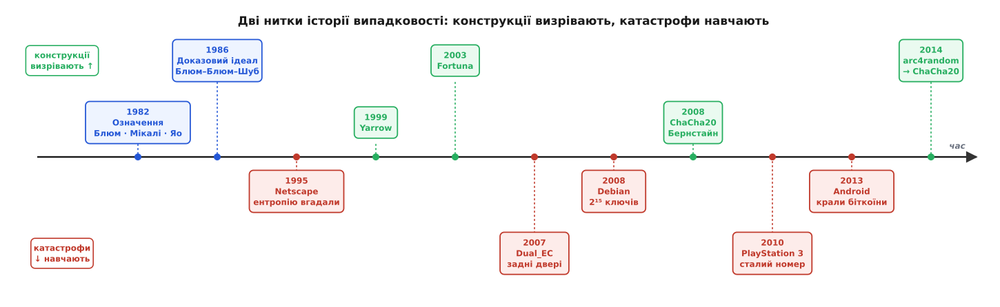

# 🕰️ Катастрофи випадковості: історія, писана зламами

Правило «на випадковість не можна просто подивитися й переконатися, що вона надійна» галузь вивела не з теорем, а з розслідувань: кожен гучний злам генератора коштував реальних ключів, грошей або зламаних пристроїв — і майже кожен доводив ту саму думку, яку теоретики проголосили ще на початку 1980-х. Тут — дві переплетені нитки. Одна: як математики врешті сформулювали, що взагалі означає «непередбачний», і збудували перші строгі конструкції. Друга: як інженери раз по раз промахувалися повз це означення, і кожен промах ставав уроком, з якого визрівала наступна, міцніша машина.


*Дві нитки одної історії. Угорі теорія й конструкції поволі визрівають; унизу практика раз по раз падає. Кожне падіння штовхало вгору наступну конструкцію: після Netscape прийшли Yarrow і Fortuna, після Dual_EC галузь відвернулася до відкритих схем на ChaCha20.*

## Спершу означення: Блюм, Мікалі і Яо (1982)

До 1982 року «випадкове число» в комп'ютері означало просто «статистично рівне»: рівномірне, без видимих періодів, придатне для симуляцій. Чого бракувало — це способу сказати математично строго, що потік ще й **непередбачний**, а не лише рівний. Цю прогалину закрили двоє в Берклі: Мануель Блюм (Manuel Blum, народився в Каракасі) і Сільвіо Мікалі (Silvio Micali, з Палермо). У праці «How to generate cryptographically strong sequences of pseudo-random bits» (доповідь на FOCS 1982, журнальна версія в SIAM Journal on Computing, 1984) вони запропонували мірило, яке тепер зветься **тестом наступного біта**: генератор надійний, якщо жоден ефективний алгоритм, побачивши будь-скільки перших бітів, не вгадає наступний помітно краще за монету. І показали робочу конструкцію, чия непередбачність зводиться до складності **дискретного логарифма** — задачі обернути піднесення до степеня за модулем, яку не вміють розв'язувати швидко.

Того ж 1982-го Ендрю Яо (Andrew Chi-Chih Yao, 姚期智) у праці «Theory and application of trapdoor functions» (FOCS 1982) довів річ, що зробила означення практичним: генератор, який проходить тест наступного біта, проходить **усі** ефективні статистичні тести взагалі. Тобто закрити одну щілину — вгадування наступного біта — означало закрити геть усі можливі атаки на розрізнення від справжнього шуму. Це перетворило туманне «щоб не можна було передбачити» на єдину перевірку, яку можна аналізувати математично.

Троє отримали за ці роботи премію Тюрінга — Блюм у 1995-му, Яо у 2000-му, Мікалі у 2012-му (спільно з Шафі Ґолдвассер, Shafi Goldwasser). Історична вага моменту не в конкретній схемі, яку майже ніхто не впроваджував, а в **яскравій лінії**, проведеній між двома значеннями слова «випадковий». Уся дальша історія — це історія того, як практика цю лінію постійно переступала.

## Доказовий ідеал: генератор Блюма–Блюма–Шуба (1986)

Означення є — а чи можна збудувати генератор, чию непередбачність не просто **віриться**, а **доводиться**? У 1986-му відповідь дали Ленор Блюм (Lenore Blum), Мануель Блюм і Майкл Шуб (Michael Shub) у праці «A Simple Unpredictable Pseudo-Random Number Generator» (SIAM Journal on Computing, том 15, № 2). Уся конструкція — один рядок:

```
xₙ₊₁ = xₙ² mod N,   N = p·q
```

де `p` і `q` — великі прості, конгруентні 3 за модулем 4 (їх звуть **простими Блюма**), а виходом беруть молодший біт кожного `xₙ`. Краса в тому, що надійність тут не постулюють по аналогії, а **зводять** до конкретної задачі: розпізнати молодший біт означало б розв'язати задачу про [квадратичні лишки](root:math-number-theory/quadratic-residues) за модулем `N` — розпізнати, чи є число чиїмось квадратом у цій арифметиці, коли множники `N` невідомі. А цього не вміють робити швидше, ніж розкласти `N` на прості. Зламати генератор = факторизувати велике число; віковічно важка задача стоїть на сторожі кожного біта.

Це був теоретичний вінець: перший генератор із **доведеною** непередбачністю. І водночас урок про ціну строгості — одне множення великих чисел заради одного вихідного біта надто повільне для практики. Блюма–Блюма–Шуба лишився еталоном, до якого рівняються, але яким не користуються: реальні генератори проміняли доказ на швидкість, спершись на віру, що обернути SHA чи AES так само важко, як факторизувати. Наступні тридцять років показали, що небезпека чаїться не в цій вірі, а деінде — значно ближче до землі.

## 1995: Netscape, або як ентропію вгадали двоє студентів

Перша гучна катастрофа прийшла звідти, де теорія й не дивилася, — з **фізичного зерна**. Браузер Netscape Navigator 1.1 захищав з'єднання протоколом SSL, і безпека кожної сесії трималася на секретному ключі, взятому з генератора. Восени 1995-го двоє аспірантів Каліфорнійського університету в Берклі, Ієн Ґолдберґ (Ian Goldberg, канадець) і Девід Ваґнер (David Wagner), розібрали, звідки той ключ береться. Код був закритий — вони відновили алгоритм із бінарника. І побачили, що зерно генератора склеюється всього з трьох легко вгадних величин:

```
seed = MD5( a, b )
  a = mklcpr( microseconds )
  b = mklcpr( pid + seconds + (ppid << 12) )
```

тобто з поточного часу (секунди й мікросекунди), номера процесу (`pid`) та номера батьківського процесу (`ppid`). Для того, хто має обліковий запис на тій самій машині, `pid`, `ppid` і секунди відомі або легко звужуються — невідомими лишаються тільки мікросекунди, а це якийсь мільйон варіантів. Перебрати мільйон зерен і для кожного відтворити ключ — близько **25 секунд** на робочій станції HP 712/80 тих років. Навіть віддаленому нападнику, що не має рахунку на машині, лишалося заледве 47 бітів невизначеності замість обіцяних 128.

Уся математика SSL була бездоганна; впало те, що під нею. Урок, який галузь винесла в січні 1996-го, коли розбір вийшов у Dr. Dobb's Journal, подвійний. По-перше, **найслабша ланка — збір ентропії**, а не сам шифр. По-друге, таємність устрою генератора не боронить нічого: Ґолдберґ і Ваґнер відновили все з бінарника за кілька днів, і саме цей епізод став раннім аргументом за **відкритий** розгляд криптографічного коду проти «безпеки через невідомість».

## 1999–2003: інженерна відповідь — Yarrow і Fortuna

Netscape показав, що ентропією треба керувати всерйоз, а не збирати абияк на старті. Відповіддю стали перші **задокументовані, придатні до повторного вжитку** конструкції генераторів — не таємні саморобки всередині одного продукту, а відкриті схеми з проаналізованими властивостями.

У 1999-му Джон Келсі (John Kelsey), Брюс Шнаєр (Bruce Schneier) і Нільс Фергюсон (Niels Ferguson) опублікували **Yarrow** (у втіленні Yarrow-160, на SHA-1). Його заслуга — чіткий поділ генератора на частини, які тепер вважають обов'язковими: накопичувач ентропії, механізм пересіву, вихідний розширювач і **контроль пересіву**, що вирішує, коли підмішувати свіжу ентропію. Слабина Yarrow крилася в тому, що він вимагав **оцінювати**, скільки ентропії дало кожне джерело, — а надійно оцінити ентропію майже неможливо, і саме на цій оцінці нападник міг грати.

Тому в 2003-му Фергюсон і Шнаєр у книжці «Practical Cryptography» подали наступника — **Fortuna**. Його головна ідея прибрала небезпечну потребу оцінювати ентропію взагалі: замість одного резервуара — **32 пули**, у які подія кладе ентропію по черзі, а пересіви беруть пули з різною частотою (перший — щоразу, другий — удвічі рідше, і так геометрично). Навіть якщо нападник частково отруює швидкі пули, повільні рано чи пізно вливають дозу чистої непередбачності, і генератор гарантовано оговтується, **не знаючи наперед**, скільки в чому ентропії. Fortuna лягла в основу генератора FreeBSD і стала взірцем того, як керувати ентропією чесно. Обидві схеми — приклад того, як конкретна катастрофа (хаотичний збір у Netscape) виштовхує вгору дисципліновану конструкцію.

## 2006–2008: Debian, два викинуті рядки

Наступний обвал показав, що навіть бездоганний генератор можна вбити **однією добромисною правкою**. У квітні 2006-го хтось із користувачів Debian поскаржився: інструмент Valgrind, що ловить звертання до неініціалізованої пам'яті, лається на код генератора в OpenSSL. Лаявся він недарма — там був хитрий прийом: у пул ентропії свідомо домішували **неініціалізовані** байти пам'яті як дрібку додаткової непередбачності. Для Valgrind це виглядало як помилка; насправді це була частина задуму.

Супровідник пакета, Курт Рекс (Kurt Roeckx), відстежив «винні» рядки — два виклики `MD_Update(&m, buf, j)` у файлі `crypto/rand/md_rand.c` — і, щоб приглушити попередження, запитав на списку розсилки openssl-dev, чи можна їх прибрати. Дістав мляве «якщо це лише один із багатьох входів, то нічого страшного» — і закоментував обидва. Але це були не «один із багатьох» входів: разом вони викидали **майже всю** ентропію. Після правки в зерно генератора йшло по суті єдине джерело — номер процесу.

```
Було:  у зерно йде багато джерел ентропії
Стало: у зерно йде лише PID ∈ [1, 32768]
       → 2¹⁵ = 32768 можливих ключів на архітектуру й тип
```

Уся криптографія на цих системах трималася на числі з-поміж 32768. Ключі SSH, сертифікати SSL, ключі OpenVPN, згенеровані на Debian, Ubuntu та похідних від них **з 17 вересня 2006-го по 13 травня 2008-го**, належали до крихітної множини, яку можна повністю перерахувати за хвилини — і люди публікували готові набори всіх можливих ключів. Діру знайшов Лучано Белло (Luciano Bello), аргентинський розробник Debian; їй дали номер CVE-2008-0166, а виправлення вийшло бюлетенем DSA-1571 13 травня 2008 року. Урок закарбувався подвійний: «негарні» частини криптокоду бувають **несучими**, а глушити попередження інструмента, не розуміючи, що саме воно виявляє, — прямий шлях до катастрофи. Це, до слова, і є той обвал до `32768`, на якому будь-хто може відчути, що ламають не шифр, а генератор під ним.

## 2007–2015: Dual_EC_DRBG — задні двері у стандарті

Найтривожніша історія — не про недогляд, а про ймовірний **умисел**, і не в чиємусь коді, а в самому **стандарті**. У 2006-му NIST — інститут стандартів США — затвердив набір генераторів SP 800-90, і серед них був дивний: `Dual_EC_DRBG`, збудований на еліптичній кривій. Дивний тим, що працював у сотні разів повільніше за сусідів по стандарту й спирався на дві наперед задані сталі точки кривої, `P` і `Q`, походження яких ніхто не пояснював.

На «вечірній» неформальній сесії конференції CRYPTO 2007 двоє дослідників Microsoft, Ден Шумоу (Dan Shumow) і Нільс Фергюсон, показали, чому це важить. Якщо той, хто обирав `P` і `Q`, знав між ними таємне співвідношення (число `d`, для якого `P = d·Q`), то, побачивши **близько 32 байтів** виходу, він відновлював увесь внутрішній стан генератора й передбачав увесь дальший потік. Це — математично **доведена спроможність** до задніх дверей. Шумоу й Фергюсон були обережні: вони прямо **не** звинувачували NIST чи АНБ, лише показали, що конструкція таку кишеню має.

Підозра тліла шість років, доки у вересні 2013-го документи Едварда Сноудена (Edward Snowden) не описали програму АНБ під назвою BULLRUN — зусилля навмисно послаблювати криптографічні стандарти — і не вказали на стандарт, ухвалений 2006 року. У грудні 2013-го агентство Reuters (журналіст Джозеф Менн, Joseph Menn) повідомило, що компанія RSA Security прийняла **10 мільйонів доларів** за те, щоб зробити `Dual_EC_DRBG` типовим генератором у своїй бібліотеці BSAFE. NIST відкликав алгоритм рекомендацією у вересні 2013-го й остаточно вилучив його з переглянутого стандарту SP 800-90A Rev. 1 у червні 2015-го.

Тут важливо чесно назвати статус доказів. Що конструкція **дозволяє** задні двері — доведено строго. Що їх вставило саме АНБ — дуже переконливо свідчать документи Сноудена й угода з RSA, але саме таємне число `d` ніколи не оприлюднили, тож у сенсі криптографічного доказу авторство лишається сильно обґрунтованим припущенням, а не теоремою. Урок безпрецедентний: вразливістю може виявитися не реалізація, а **стандарт**, і саме після цієї історії галузь стала вимагати, щоб константи в схемах мали прозоре походження («нічого в рукаві»), а самі схеми — відкритий розгляд. Це й підштовхнуло масовий відхід до простих, відкрито збудованих генераторів на ChaCha20.

## 2010 і 2013: той самий номер двічі — PlayStation 3 і Android

Останні дві катастрофи показали найтонше: генератор може видавати бездоганні числа, а система однаково впаде, якщо **одне** з них ужити двічі не там. Обидві сталися на [цифровому підписі](root:sf-security/hash-and-digital-signature) (EC)DSA — способі довести авторство повідомлення таємним ключем. Кожен підпис вимагає свіжого **одноразового секретного номера** `k` (його звуть nonce), і вся безпека тримається на тому, що `k` щоразу новий і таємний. Підпис має вигляд:

```
r = (k·G).x mod n
s = k⁻¹·(z + r·d) mod n
```

де `z` — геш повідомлення, `d` — таємний ключ, `G` — задана точка. Тепер уявіть два підписи з **однаковим** `k` і тим самим ключем. Оскільки `r` залежить лише від `k`, у них збігається `r` — це видно неозброєним оком. А далі — проста алгебра ([ділення за модулем](root:math-number-theory/modular-inverse) — це множення на обернений елемент):

```
s₁ − s₂ = k⁻¹·(z₁ − z₂)   →   k = (z₁ − z₂)·(s₁ − s₂)⁻¹ mod n
далі:                          d = (s₁·k − z₁)·r⁻¹ mod n
```

Два підписи з повтореним номером — і таємний ключ **випадає** сам, без жодного перебору.

Саме це зробила Sony. У грудні 2010-го на конгресі 27C3 група fail0verflow (серед учасників — Гектор Мартін, Hector Martin «marcan», та інші) у доповіді «Console Hacking 2010» показала: PlayStation 3 підписувала код **сталим** `k` — тим самим для кожного підпису. Досить було двох прошивок — і приватний ключ, яким Sony підписувала весь дозволений код консолі, витягли алгеброю. Консоль відкрилася повністю: тепер будь-хто міг підписати що завгодно так, ніби це зробила Sony.

Тристоронню ту саму пастку зачепив Android у серпні 2013-го, тільки з іншого боку. Тут `k` не був сталим навмисне — його мав давати системний генератор `java.security.SecureRandom`, але через ваду реалізації (клас на основі Apache Harmony часом не досіювався як слід) генератор на деяких пристроях віддавав **однакові** `k`. Біткоїн-гаманці підписують транзакції саме (EC)DSA, тож повтор номера лишав у блокчейні дві підписи з однаковим `r` — публічно, назавжди. Нападники просто **сканували блокчейн** у пошуках однакових `r`, розв'язували рівняння вище й спорожняли гаманці; украли десятки тисяч доларів. Під удар потрапили Bitcoin Wallet for Android, Bitcoin Spinner, мобільний blockchain.info, Mycelium; ваду залатали в Android 4.4. Спільний урок обох: одноразовий номер за критичністю дорівнює ключу, а генератор, що **тихо** провалює пересів, небезпечніший за очевидно зламаний, бо вихід і далі виглядає бездоганно.

## Куди зійшлася галузь: від RC4 до ChaCha20

Кожна з цих історій штовхала практику в один бік — до **малого набору відкрито перевірених примітивів**, відданих у руки системи. Видно це на долі функції `arc4random`. Її ім'я — слід від шифру RC4, який Рон Рівест (Ron Rivest) створив у RSA 1987 року: `arc4random` була «замінним викликом для випадковості на базі RC4». Але з роками в RC4 знайшли статистичні зсуви — його вихід трохи відхилявся від рівномірного, і для генератора це погана прикмета.

Заміну дав Деніел Бернстайн (Daniel J. Bernstein, djb): його потоковий шифр Salsa20 (2005) і вдосконалений варіант **ChaCha20** (2008) швидкі суто програмно, не течуть за часом виконання й не мають слабких місць у розкладі ключа. У 2013-му OpenBSD переписала нутро `arc4random` з RC4 на ChaCha20 (у бібліотеці — жовтень, у ядрі — листопад), і зміна вийшла у OpenBSD 5.5 в травні 2014-го — **зберігши історичну назву**, хоча RC4 всередині вже не лишилося. Тим самим шляхом пішов Linux: Тед Цо переклав ядро на ChaCha20 близько 2016-го, а 2022-го Джейсон Доненфельд переписав усю підсистему наново (BLAKE2s для пула, ChaCha20 для виходу).

Так замкнулася дуга. Означення дали в 1982-му; доказовий ідеал — у 1986-му; далі кожна катастрофа — Netscape, Debian, Dual_EC, PlayStation, Android — по-своєму порушувала його й лишала по собі конкретну конструкцію-відповідь: накопичувачі ентропії, прозорі константи, храповики, системні генератори на ChaCha20. Історія випадковості — це один урок, повторений під різними приводами: непередбачність не можна перевірити, дивлячись на вихід, тож її роблять **раз, ретельно, у відкриту** — і більше не сперечаються з цим.
