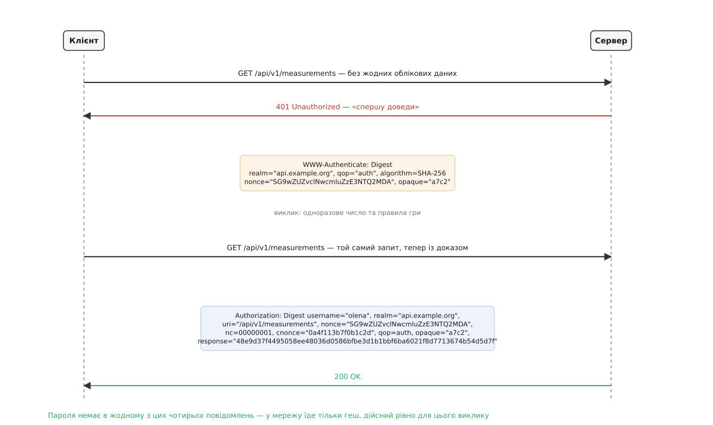
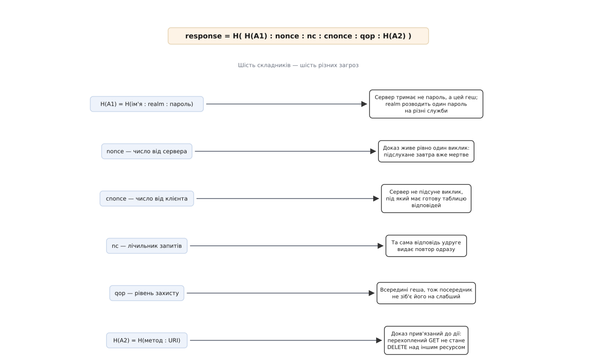
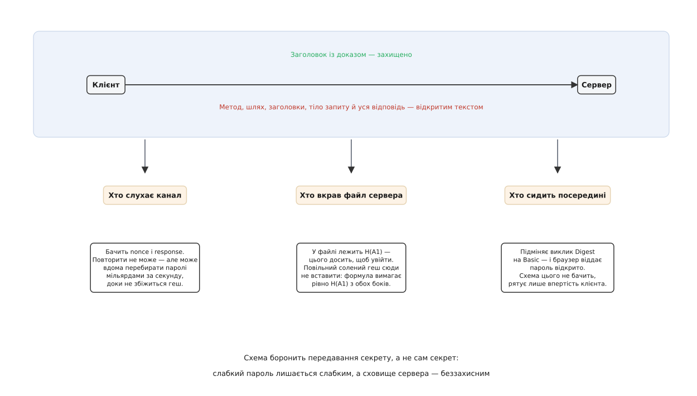

# Дайджест-автентифікація: одноразове число, виклик і доказ без пароля в мережі

<preknowlist>
- [Криптографічні гешфункції](root:sf-security/cryptographic-hash) — одностороннє перетворення: з результату не відновити вхід, а знайти два входи з однаковим результатом практично неможливо.
- [HTTP](root:com-protocol/http) — запит із методом і шляхом, відповідь із кодом стану; сервер нічого не пам'ятає між запитами.
- [Автентифікація](root:sf-security/authentication) — доведення, що ти саме той, за кого себе видаєш, і чим це відрізняється від питання «що тобі дозволено».
- [Захист від повтору](root:sf-security/replay-protection) — перехоплене повідомлення можна надіслати ще раз, і воно спрацює вдруге.
- [Криптографічний генератор випадкових чисел](root:sf-security/csprng) — чому «випадкове» має означати «непередбачуване», а не просто «щоразу інше».
</preknowlist>

Служба має пускати лише тих, хто знає пароль. Найпряміший спосіб — хай клієнт надішле пароль, а служба звірить його зі своїм записом. Саме так працює найстаріша схема доступу в HTTP: рядок `ім'я:пароль` пакують у base64 і кладуть у заголовок. Base64 тут не шифр, а спосіб безпечно перевезти двокрапку й нелатинські літери; розгорнути його назад — один рядок коду. Тому кожен, хто бачить трафік — власник точки Wi-Fi, адміністратор проміжного вузла, той, хто просто слухає ефір, — читає пароль без жодних зусиль.

Висновок неминучий: пароль не має їхати каналом. Але служба все одно мусить переконатися, що клієнт його знає. У цій напрузі й народжується вся конструкція: як довести знання секрету, не показавши секрет?

## Чому геша замало

Перше, що спадає на думку, — надсилати замість пароля його геш. Пароль справді зникає з мережі: геш односторонній, з нього паролю не відновити. Але подивімося очима того, хто слухає. Він бачить рядок, і цей рядок щоразу той самий. Йому не потрібно розгадувати пароль — досить дослівно повторити побачене, і служба впустить його так само охоче, як і власника. Геш перестав бути гешем пароля й став самим паролем.

Звідси перша тверда вимога: **стале значення не може бути доказом**. Хоч би що ви послали незмінним, воно повторюване. Доказ мусить бути щоразу інший — і скласти саме сьогоднішній варіант має вміти тільки той, хто знає секрет.

## Виклик

Зробити доказ щоразу іншим може лише той бік, який його перевіряє: якщо змінне число вигадує клієнт, то й підслуховувач вигадає своє. Отже, число вигадує служба. Перед тим як пустити, вона кидає клієнтові свіже, ніколи раніше не вживане число й каже: «поверни мені геш свого пароля разом ось із цим». Таке число називають **одноразовим** — nonce (англ. *number used once*).

Тепер погляньмо на здобич підслуховувача. Він має пару «число — відповідь». Повторити її нікуди: наступного разу служба назве інше число, і стара відповідь до нього не пасує. Обчислити відповідь на нове число він не може — для цього треба знати пароль, а геш назад не розгортається.

Ця пара кроків — служба питає, клієнт відповідає так, що відповідь придатна лише тут і зараз — і є [схема «виклик-відповідь»](root:sf-security/challenge-response): доказ знання секрету без його передавання, спільний скелет для CHAP, SCRAM, Kerberos і того, про що йдеться тут. Дайджест-автентифікація — її втілення в HTTP: слово *digest* (англ. «стислий витяг») тут означає геш, той самий стислий відбиток даних.

## Танець із кодом 401

HTTP не пам'ятає нічого між запитами, тож виклик мусить бути частиною самого обміну. Клієнт надсилає звичайний запит. Служба, побачивши, що доказу немає, відповідає кодом `401 Unauthorized` і заголовком `WWW-Authenticate`, у якому лежить виклик і правила гри. Клієнт рахує відповідь і повторює **той самий** запит, додавши заголовок `Authorization`.



*Пароль не з'являється в жодному з чотирьох повідомлень; у мережу їде лише геш, дійсний рівно для цього виклику.*

Ціна цієї конструкції — зайвий оберт: перший запит завжди марний. Клієнти її пом'якшують, запам'ятовуючи виклик і додаючи `Authorization` наперед до наступних запитів у ту саму область.

Поле `realm` (англ. «володіння») — це ім'я захищеної області, яке клієнт показує людині у вікні входу; воно ж входить у геш. Поле `opaque` (англ. «непрозорий») служба вигадує для себе: клієнт зобов'язаний повертати його незмінним і не має права в нього заглядати. Це зручний спосіб покласти в клієнта дрібний шматок серверного стану.

## З чого складають доказ

Лишилося головне питання: що саме гешувати. Кожен складник формули з'явився тому, що без нього лишалася конкретна дірка.

Секретну частину відокремлюють одразу:

```
A1 = ім'я : realm : пароль
```

Служба зберігає не пароль, а `H(A1)`. Навіщо туди `realm`: та сама людина з тим самим паролем у двох різних областях дає два різні `H(A1)`, тож витік з однієї не відчиняє другу. І навіщо взагалі ім'я всередині: без нього два користувачі з однаковим паролем мали б однаковий секрет.

Другу частину складають із того, **що саме** клієнт просить зробити:

```
A2 = метод : URI            (при qop=auth)
```

Без цього доказ підтверджував би тільки особу. Тоді, перехопивши відповідь на невинний `GET /public`, посередник переклав би її в `DELETE /api/v1/measurements` — доказ той самий, дія інша. Уклавши метод і шлях усередину геша, ми прив'язуємо доказ до конкретної дії: змініть у запиті хоч літеру шляху — геш перестане збігатися.

І нарешті все змішують разом:

```
response = H( H(A1) : nonce : nc : cnonce : qop : H(A2) )
```



*Формула не «на всяк випадок» довга: приберіть будь-який складник — і відкриється саме та атака, проти якої він стоїть.*

Три з них варті окремої уваги, бо їхня потреба не очевидна.

**`cnonce` — одноразове число від клієнта.** Виклик обирає служба. А що, як службу підмінили або вона сама недоброзичлива? Тоді вона назве не випадкове число, а те, для якого вже має заготовлену таблицю «пароль → відповідь», і одним обміном перетворить ваш пароль на запис у словнику. Клієнт ламає цей задум, домішуючи власне випадкове число: заздалегідь порахувати таблицю під невідоме `cnonce` неможливо.

**`nc` — лічильник запитів із цим викликом**, вісім шістнадцяткових цифр, що починаються з `00000001`. Служба бачить, що з одним викликом номери мають лише зростати. Побачивши той самий `nc` удруге, вона розуміє: це повтор, а не новий запит.

**`qop`** (англ. *quality of protection*, «рівень захисту») лежить усередині геша не випадково. Якби рівень оголошували тільки заголовком, посередник переписав би його на слабший варіант, і клієнт слухняно порахував би простішу відповідь. Усередині геша значення підмінити неможливо: будь-яка правка ламає збіг.

> 🔧 **Навіщо це.** Той самий прийом рятує всюди, де сторони домовляються про параметри захисту: **усе, про що ви домовилися, має бути накрите доказом цілісності**. Домовленість, яку видно, але яку ніщо не підписує, — це не домовленість, а пропозиція для того, хто сидить посередині. Так само влаштований фінальний обмін у TLS, де сторони підтверджують геш усього попереднього листування.

## Порахуймо

**Умова.** Користувач `olena` у володінні `api.example.org` із паролем `Winter-Rain-42` робить `GET /api/v1/measurements`. Служба назвала виклик `SG9wZUZvclNwcmluZzE3NTQ2MDA` і `qop="auth"`, `algorithm=SHA-256`; клієнт узяв `cnonce=0a4f113b7f0b1c2d`, `nc=00000001`.

```
A1     = olena:api.example.org:Winter-Rain-42
H(A1)  = c9e8031651f3577127a74b78a5d00bd1f283414ae0fedd240206b555bc43e7a6

A2     = GET:/api/v1/measurements
H(A2)  = a7f3a09fa10c8c3ae2e666e27dcf192c6cffc9d77239762ff42c75a1dbdf9b76

вхід   = c9e80316…e7a6 : SG9wZUZvclNwcmluZzE3NTQ2MDA : 00000001
         : 0a4f113b7f0b1c2d : auth : a7f3a09f…9b76
response = 48e9d37f4495058ee48036d0586bfbe3d1b1bbf6ba6021f8d7713674b54d5d7f
```

Тепер підмінімо в тому самому запиті лише метод — `GET` на `DELETE`, решта незмінна:

```
A2     = DELETE:/api/v1/measurements
H(A2)  = 70e102822a1f5a0bc9c4389d62d1e5b7c24c5d2c93e9ceb8e6ded030e7d0a62f
response = 176cd55013e97d7e39a8dc4f44345b0d135e6574f1c9840ae16666d4a058fbd7
```

Спільного між двома відповідями — нічого. Одна літера в назві методу дає геть інший доказ, і саме тому перехоплений `GET` неможливо перетворити на `DELETE`.

Служба перевіряє доказ найпрямішим способом: бере зі свого сховища `H(A1)` для названого імені, підставляє в ту саму формулу значення з заголовка — виклик, `nc`, `cnonce`, `qop` — і звіряє результат із полем `response`. Пароля вона при цьому не бачить і не потребує. Одна деталь тут вирішальна: метод і шлях служба бере **не з заголовка, а з самого запиту**. Інакше нападник вписав би в `Authorization` старий шлях, під який має доказ, а виконати змусив би зовсім інший.

Готовий клієнт і перевіряльник із боку служби — з розбором заголовка, лічильником `nc` і самоперевірним викликом — розібрані окремо: [клієнт і сервер дайджест-автентифікації в коді](root:sf-security/digest-authentication/proj-digest-client.md). Повний перелік полів обох заголовків, правила лапок і те, що саме має збігатися з рядком запиту, — у [довіднику полів](root:sf-security/digest-authentication/api-digest-headers.md).

## Звідки береться виклик і чому служба його не пам'ятає

Виклик має бути непередбачуваним і недовговічним. Найпростіше — зберігати видані числа в таблиці, але тоді кожна машина за балансувальником мусить знати чужі виклики, і схема, створена для служби без пам'яті, обростає станом.

Вихід — зробити виклик самоперевірним. Стандарт радить будувати його так:

```
nonce = Base64( мітка_часу ‖ H( мітка_часу : ETag : серверний_секрет ) )
        де ‖ — просте склеювання двох рядків
```

Мітка часу їде відкрито, а гешем служба підписує саму себе. Отримавши виклик назад, вона бере мітку, перераховує геш зі своїм секретом і бачить, чи це справді її число й чи не застаріло воно. Зберігати нічого не треба — секрет однаковий на всіх машинах.

Що робити, коли виклик протух? Просити пароль удруге було б знущанням: людина його вже ввела. Тому служба відповідає `401` із позначкою `stale=true` — «твій доказ правильний, просто виклик старий». Клієнт мовчки перераховує відповідь на новий виклик, не турбуючи людину. Різниця між `stale=true` і звичайним `401` — це різниця між «оновися» і «ти помилився паролем».

## Ключ на сеанс

Той, хто перевіряє доказ, мусить мати `H(A1)` — вічне значення, виведене з пароля. У великій службі перевіркою займається не кожен вузол сам, а окрема машина автентифікації; роздати `H(A1)` десяткам вузлів означає роздати ключ від входу кожному з них.

Тому кожен алгоритм має різновид із суфіксом `-sess` (від *session*, «сеанс»), у якому `A1` рахують інакше:

```
A1 = H( ім'я : realm : пароль ) : nonce : cnonce
```

Пароль тут гешують один раз, а далі домішують числа цього конкретного обміну. Виходить значення, прив'язане до одного виклику: його можна віддати вузлові, який перевірятиме запити, і воно не стане ключем на завтра. Довговічний секрет лишається там, де йому місце.

## Чого доказ не накриває

`qop=auth` бере в геш метод і шлях, але не тіло запиту. Тому посередник не може перетворити `GET` на `DELETE`, зате може підмінити вміст `POST`, лишивши доказ дійсним. Проти цього є режим `auth-int` (англ. *integrity*, «цілісність»), де в `A2` додають геш тіла:

```
A2 = метод : URI : H(тіло)
```

Живуть із ним рідко, і причина технічна: щоб порахувати геш тіла, треба мати все тіло **до** початку відсилання. Це закриває передавання потоком, коли розмір заздалегідь невідомий, і ламається на будь-якому проміжному вузлі, що чіпає вміст — стискає його чи перекодовує.

Симетричний хід дозволяє й службі довести, що вона знає `H(A1)`: у відповідь вона кладе заголовок `Authentication-Info` з полем `rspauth`, порахованим за тією самою формулою, але з `A2 = : URI` — без методу, бо метод обирала не вона. Клієнт перевіряє це поле й переконується, що говорив зі справжньою службою. Туди ж службі зручно покласти наступний виклик, щоб клієнт не витрачав зайвий оберт на прострочення.

## Ціна схеми

Усе описане досі боронить пароль у дорозі. Але в схеми є вади, до дороги не дотичні, — і саме вони вирішили її долю.



*Три різні супротивники — і схема має відповідь лише для першого з них, та й то часткову.*

**Служба мусить зберігати `H(A1)`.** Обидві сторони рахують ту саму формулу, тож служба зобов'язана мати рівно те саме значення. А `H(A1)` — це вже повноцінний ключ від входу: хто вкрав файл, той заходить не розгадуючи пароля. І це не недогляд реалізації, а наслідок самої конструкції: сюди неможливо вставити повільний солений геш, яким [зберігають паролі](root:sf-security/password-hashing) у нормальній системі, бо клієнт мусив би повторити ту саму сіль і ті самі десятки тисяч ітерацій, а формула цього не передбачає.

**Підслуховувач отримує матеріал для офлайнового перебору.** Одна перехоплена пара «виклик — відповідь» дає йому змогу перевіряти здогади вдома, з будь-якою швидкістю, без жодного запиту до служби. Ані блокування після п'яти невдалих спроб, ані затримки на вході тут не працюють — сервер про цей перебір навіть не знає. Схема боронить **передавання** секрету, а не сам секрет: слабкий пароль лишається слабким.

**Захищений лише заголовок.** Метод, шлях, тіло запиту й уся відповідь ідуть відкритим текстом. Дайджест-автентифікація ніколи не була заміною шифрованому каналу — лише заміною тому, щоб класти пароль у той самий відкритий текст.

**Зловмисний посередник просить простіше.** Він викидає виклик `Digest` і кладе замість нього виклик найстарішої схеми — а та везе пароль відкрито. Ніякої криптографії тут не зламано; допомагає лише правило клієнта «ніколи не знижувати рівень захисту самотужки». Те саме правило потрібне й усередині схеми: служба, що переходить на новий геш, якийсь час пропонує два виклики поспіль — на SHA-256 і на MD5, — і саме клієнт зобов'язаний узяти перший, а не той, що трапився ближче в заголовку. Вибір алгоритму нічим не захищений, бо робиться до того, як з'явився перший доказ.

Додайте до цього історію з гешем: до 2015 року стандарт знав тільки MD5. Пізніша редакція додала SHA-256 і SHA-512/256, лишивши MD5 хіба задля сумісності, і навіть дозволила гешувати ім'я користувача заради приватності — але структурних вад це не прибрало.

Тут варто бути точним, бо MD5 звично називають головним винуватцем. Зламали в ньому стійкість до **колізій**: 2004 року Ван Сяоюнь із співавторами показали, як добирати два різні входи з однаковим гешем, і сьогодні це робиться на звичайному комп'ютері за секунди. А формула доказу тримається не на колізіях, а на **необоротності**: щоб підробити відповідь, треба з геша дістати вхід, а найкраща відома атака такого роду на повний MD5 (Сасакі й Аокі, 2009) коштує близько 2¹²³ операцій — тобто нездійсненна. Дайджест-автентифікацію повалив не зламаний геш, а перелічені вище властивості самої конструкції; заміна MD5 на SHA-256 жодну з них не лікує. [Як схема з'явилася і чому її обійшли](root:sf-security/digest-authentication/hist-digest-birth.md) — окрема історія.

Ті самі вади підштовхнули до наступного покоління: [SCRAM](root:sf-security/scram-authentication) лишає виклик-відповідь, але робить так, щоб на сервері лежало значення, солене й повільно виведене з пароля, і щоб воно саме по собі не пускало всередину. Проблему відкритого каналу натомість закрив [TLS](root:sf-security/tls), після чого мережа перейшла на пароль у шифрованому каналі й [сесійні механізми](root:sf-web/session-management).

## Де вона живе досі

Попри все це, дайджест-автентифікація не зникла — і причини цілком практичні. Вона не потребує ані сертифікатів, ані інфраструктури ключів, вміщається в кількасот рядків коду й працює поверх будь-якого протоколу з заголовками, зокрема поверх UDP.

Тому її обов'язково вміє [SIP](root:com-protocol/sip) — сигналізація телефонії, де вона є основним способом автентифікації абонента, а пізніша редакція стандарту додала туди ті самі SHA-256 і SHA-512/256. Тому нею користуються мережеві камери й реєстратори за профілями ONVIF, вебінтерфейси маршрутизаторів і безліч вбудованих пристроїв, яким ніхто не видасть сертифіката. У всіх цих випадках схему справедливо вважають не самостійним захистом, а мінімумом поверх каналу, який захищають окремо.

Урок, що лишається за межами HTTP, простіший за протокол. Доказ знання секрету можна побудувати так, що секрет ніколи не покине власника, — і це працює. Але **симетрична перевірка змушує обидві сторони тримати одне й те саме значення**, а отже, робить сховище перевіряльника таким самим цінним, як сам пароль. Уся подальша криптографія автентифікації — від солених викликів до відкритих ключів — це спроби розірвати саме цю симетрію.
