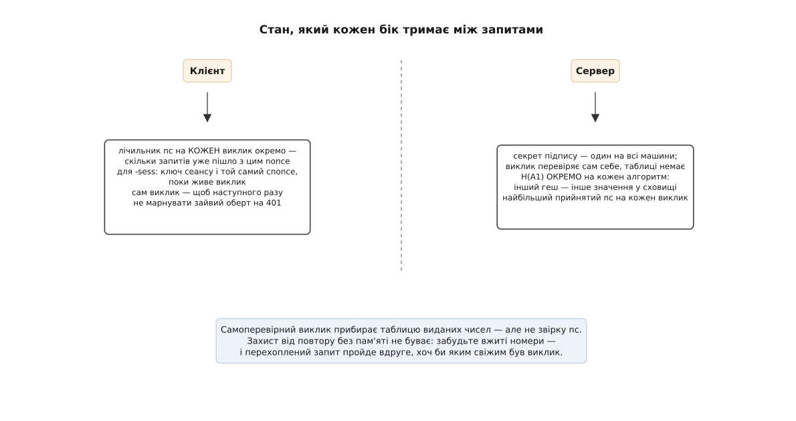

# ⚙️ Клієнт і сервер дайджест-автентифікації в коді

Формула доказу — три рядки гешування, і саме на ній ніхто не спотикається. Реалізації ламаються на іншому: на заголовку, який не ріжеться комами, на лічильнику, що мусить пережити запит, і на виклику, який службі нема де тримати. Ось обидва боки цілком — разом із тими місцями, де очевидне рішення виявляється хибним.

## Заголовок ріжеться не комами

Виклик приїздить одним рядком:

```
WWW-Authenticate: Digest realm="api.example.org", qop="auth,auth-int",
    algorithm=SHA-256, nonce="MTc4NjE1NzM2MC45Mj…", opaque="s7f1", stale=false
```

Спокуса розрізати його комами, а кожен шматок навпіл по знаку рівності, живе рівно до першої зустрічі зі справжньою службою. Кома всередині лапок — не роздільник: `qop="auth,auth-int"` це одне поле, а не два. У лапках трапляється й екранована лапка, після якої наївний розбір з'їжджає на весь решту рядка.

Але справжня халепа інша. Служба має право покласти в один заголовок кілька викликів поспіль, і **жодного роздільника між ними не передбачено** — вони йдуть через ту саму кому, що й поля всередині:

```
WWW-Authenticate: Digest realm="api", algorithm=SHA-256, nonce="new",
                  Digest realm="api", algorithm=MD5, nonce="old"
```

Де закінчується перший виклик? Ознака рівно одна: слово, за яким **не** стоїть знак рівності, — це назва схеми, а отже, початок нового виклику. Тому заголовок треба проходити потоком лексем, а не розрізанням: пробігти рядок один раз, видаючи пари «ім'я — значення», і вважати новим викликом кожне ім'я, що прийшло без значення.

Навіщо службі два виклики одразу — зрозуміло: вона переходить із MD5 на SHA-256 і якийсь час мусить розуміти обох. [RFC 7616](https://www.rfc-editor.org/rfc/rfc7616.html) вимагає перелічувати їх у порядку переваги, найкращий перший, а клієнтові радить брати перший, який той уміє. Тут ми робимо строгіше — ранжуємо самі, за власною таблицею сили. Причина проста: порядок у заголовку не накритий жодним доказом, бо доказу ще нема, і посередник вільно міняє виклики місцями. Своя таблиця коштує три рядки, а помилка в цьому місці не видима ніяк — запит успішно проходить, просто на MD5.

:::tabs
```python
import base64, hashlib, hmac, os, re, time

_ITEM = re.compile(r'''
    \s*(?:,\s*)*                        # роздільники й порожні місця
    (?P<key>[A-Za-z][A-Za-z0-9_.-]*)    # назва схеми АБО ім'я поля
    (?:\s*=\s*(?:                       # значення — необов'язкове!
          "(?P<q>(?:[^"\\]|\\.)*)"      # у лапках: кома всередині — не роздільник
        | (?P<t>[^\s,]*) ))?            # або голий токен
''', re.VERBOSE)


def _items(header):
    """Заголовок → потік (ім'я, значення). Значення None ⇒ це назва схеми."""
    pos = 0
    while True:
        m = _ITEM.match(header, pos)
        if not m or m.end() == pos:
            return
        pos = m.end()
        q, t = m.group('q'), m.group('t')
        yield m.group('key').lower(), (re.sub(r'\\(.)', r'\1', q) if q is not None else t)


def parse_challenges(header):
    """WWW-Authenticate → виклики в тому порядку, як їх дала служба."""
    out = []
    for key, value in _items(header):
        if value is None:
            out.append({'scheme': key, 'params': {}})   # слово без «=» → нова схема
        elif out:
            out[-1]['params'][key] = value
    return out


def parse_params(header):
    """Authentication-Info і подібні — самі поля, без назви схеми."""
    return {k: v for k, v in _items(header) if v is not None}


ALGORITHMS = {                            # назва в заголовку → (ім'я в hashlib, сила)
    'SHA-512-256': ('sha512_256', 3),     # це SHA-512/256 з FIPS 180-4,
    'SHA-256':     ('sha256',     2),     # а НЕ обрізаний sha512
    'MD5':         ('md5',        1),
}


def split_alg(name):
    sess = name.upper().endswith('-SESS')
    return (name[:-5] if sess else name).upper(), sess


def pick(challenges):
    """Найсильніший Digest-виклик із тих, що ми вміємо: порядок у заголовку не захищений."""
    best, best_strength = None, 0
    for ch in challenges:
        if ch['scheme'] != 'digest':
            continue
        known = ALGORITHMS.get(split_alg(ch['params'].get('algorithm', 'MD5'))[0])
        if known and known[1] > best_strength:
            best, best_strength = ch, known[1]
    return best
```
```ts
import { createHash, createHmac, randomBytes, timingSafeEqual } from 'node:crypto';

const ITEM =
  /\s*(?:,\s*)*([A-Za-z][A-Za-z0-9_.-]*)(?:\s*=\s*(?:"((?:[^"\\]|\\.)*)"|([^\s,]*)))?/y;

export type Challenge = { scheme: string; params: Record<string, string> };

/** Заголовок → потік [ім'я, значення]. Значення null ⇒ це назва схеми. */
function* items(header: string): Generator<[string, string | null]> {
  ITEM.lastIndex = 0;
  for (let m = ITEM.exec(header); m !== null; m = ITEM.exec(header)) {
    const [, key, quoted, token] = m;
    const value =
      quoted !== undefined ? quoted.replace(/\\(.)/g, '$1')  // кома в лапках — не роздільник
      : token !== undefined ? token
      : null;
    yield [key.toLowerCase(), value];
  }
}

/** WWW-Authenticate → виклики в тому порядку, як їх дала служба. */
export function parseChallenges(header: string): Challenge[] {
  const out: Challenge[] = [];
  for (const [key, value] of items(header)) {
    if (value === null) out.push({ scheme: key, params: {} }); // слово без «=» → нова схема
    else if (out.length) out[out.length - 1].params[key] = value;
  }
  return out;
}

/** Authentication-Info і подібні — самі поля, без назви схеми. */
export const parseParams = (header: string): Record<string, string> =>
  Object.fromEntries([...items(header)].filter((e): e is [string, string] => e[1] !== null));

const ALGORITHMS: Record<string, { hash: string; strength: number }> = {
  'SHA-512-256': { hash: 'sha512-256', strength: 3 },  // SHA-512/256 з FIPS 180-4,
  'SHA-256':     { hash: 'sha256',     strength: 2 },  // а НЕ обрізаний sha512
  'MD5':         { hash: 'md5',        strength: 1 },
};

const splitAlg = (name: string) => {
  const sess = name.toUpperCase().endsWith('-SESS');
  return { base: (sess ? name.slice(0, -5) : name).toUpperCase(), sess };
};

/** Найсильніший Digest-виклик із тих, що ми вміємо: порядок у заголовку не захищений. */
export function pick(challenges: Challenge[]): Challenge | null {
  let best: Challenge | null = null, bestStrength = 0;
  for (const ch of challenges) {
    if (ch.scheme !== 'digest') continue;
    const known = ALGORITHMS[splitAlg(ch.params.algorithm ?? 'MD5').base];
    if (known && known.strength > bestStrength) { best = ch; bestStrength = known.strength; }
  }
  return best;
}
```
:::

## Клієнт: те, що мусить пережити запит

Схему задумано для служби без пам'яті, але клієнт без пам'яті працювати не може: два значення мусять жити довше за один запит.

**Лічильник `nc`** ведуть **на кожен виклик окремо**, а не один на все з'єднання: новий `nonce` — і відлік починається з `00000001`. У геш іде рядок із провідними нулями, точнісінько такий, як поїде в заголовок: `00000002` і `2` — різні тексти, а отже, різні геші. Тому лічильник зберігають числом, форматують один раз, і те саме значення кладуть і в геш, і в заголовок.

**`cnonce`** мусить бути **непередбачуваним**, а не просто щоразу іншим. Уся його робота — не дати недоброзичливій службі назвати той виклик, під який у неї вже готова таблиця «пароль → відповідь». Лічильник чи мітка часу цієї роботи не виконують, бо їх обчислюють наперед. Тому джерело тут — тільки [криптографічний генератор](root:sf-security/csprng): `os.urandom`, `randomBytes` — і жодного `random()` зі звичайної бібліотеки загального призначення.

Різновид **`-sess`** додає третє. Ключ сеансу рахують **один раз** на виклик, і в нього входить `cnonce` — отже, з цієї миті `cnonce` заморожений: доки живе цей `nonce`, у кожному запиті їде той самий. Клієнт, який чесно генерує свіжий `cnonce` щоразу, з `-sess` не працюватиме, і зламається це не на першому запиті, а на другому.

:::tabs
```python
QUOTED = ('username', 'realm', 'nonce', 'uri', 'response', 'cnonce', 'opaque')


def _field(k, v):
    if k not in QUOTED:
        return f'{k}={v}'                 # algorithm, qop, nc — БЕЗ лапок
    return '{}="{}"'.format(k, v.replace('\\', '\\\\').replace('"', '\\"'))


class DigestClient:
    def __init__(self, username, password):
        self.username, self.password = username, password
        self._counts = {}                 # nonce → скільки запитів уже пішло
        self._sess = {}                   # nonce → (ключ сеансу, його cnonce)

    def authorization(self, ch, method, target, body=b''):
        p = ch['params']
        declared = p.get('algorithm', 'MD5')
        base, sess = split_alg(declared)
        name = ALGORITHMS[base][0]
        Hb = lambda b: hashlib.new(name, b).hexdigest()
        H = lambda s: Hb(s.encode('utf-8'))          # пароль — саме UTF-8

        nonce = p['nonce']
        self._counts[nonce] = self._counts.get(nonce, 0) + 1
        nc = '%08x' % self._counts[nonce]            # рівно 8 шістнадцяткових цифр
        cnonce = os.urandom(16).hex()                # непередбачуване, не «щоразу інше»

        secret = H(f'{self.username}:{p["realm"]}:{self.password}')
        if sess:                                     # ключ сеансу рахуємо ОДИН раз на виклик
            if nonce not in self._sess:
                self._sess[nonce] = (H(f'{secret}:{nonce}:{cnonce}'), cnonce)
            secret, cnonce = self._sess[nonce]       # і cnonce більше не міняємо

        offered = [x.strip() for x in p.get('qop', 'auth').split(',')]
        qop = 'auth' if 'auth' in offered else 'auth-int'
        a2 = f'{method}:{target}' + (f':{Hb(body)}' if qop == 'auth-int' else '')
        response = H(f'{secret}:{nonce}:{nc}:{cnonce}:{qop}:{H(a2)}')

        fields = {'username': self.username, 'realm': p['realm'], 'uri': target,
                  'algorithm': declared, 'nonce': nonce, 'nc': nc,
                  'cnonce': cnonce, 'qop': qop, 'response': response}
        if 'opaque' in p:
            fields['opaque'] = p['opaque']           # повертаємо як є, не заглядаючи
        ctx = {'H': H, 'secret': secret, 'nonce': nonce, 'nc': nc,
               'cnonce': cnonce, 'qop': qop, 'uri': target}
        return 'Digest ' + ', '.join(_field(k, v) for k, v in fields.items()), ctx

    def verify_rspauth(self, ctx, info_header):
        """Authentication-Info: чи знає співрозмовник те саме H(A1)."""
        p = parse_params(info_header)
        if 'rspauth' not in p:
            return False
        H = ctx['H']
        ha2 = H(':' + ctx['uri'])                    # ← БЕЗ методу: його обирали не ми
        want = H(f'{ctx["secret"]}:{ctx["nonce"]}:{ctx["nc"]}:{ctx["cnonce"]}:{ctx["qop"]}:{ha2}')
        return hmac.compare_digest(want, p['rspauth'])
```
```ts
const QUOTED = new Set(['username', 'realm', 'nonce', 'uri', 'response', 'cnonce', 'opaque']);
const field = (k: string, v: string) =>
  QUOTED.has(k)
    ? `${k}="${v.replace(/\\/g, '\\\\').replace(/"/g, '\\"')}"`
    : `${k}=${v}`;                       // algorithm, qop, nc — БЕЗ лапок

export type Ctx = { H: (d: string) => string; secret: string; nonce: string;
                    nc: string; cnonce: string; qop: string; uri: string };

export class DigestClient {
  readonly #counts = new Map<string, number>();      // nonce → скільки запитів уже пішло
  readonly #sess = new Map<string, { key: string; cnonce: string }>();
  readonly #user: string;
  readonly #password: string;

  constructor(user: string, password: string) { this.#user = user; this.#password = password; }

  authorization(ch: Challenge, method: string, target: string, body = Buffer.alloc(0)) {
    const p = ch.params;
    const declared = p.algorithm ?? 'MD5';
    const { base, sess } = splitAlg(declared);
    const name = ALGORITHMS[base].hash;
    const Hb = (b: Buffer) => createHash(name).update(b).digest('hex');
    const H = (s: string) => Hb(Buffer.from(s, 'utf8'));   // пароль — саме UTF-8

    const nonce = p.nonce;
    const n = (this.#counts.get(nonce) ?? 0) + 1;
    this.#counts.set(nonce, n);
    const nc = n.toString(16).padStart(8, '0');            // рівно 8 шістнадцяткових цифр
    let cnonce = randomBytes(16).toString('hex');          // непередбачуване, не «щоразу інше»

    let secret = H(`${this.#user}:${p.realm}:${this.#password}`);
    if (sess) {                                    // ключ сеансу рахуємо ОДИН раз на виклик
      if (!this.#sess.has(nonce))
        this.#sess.set(nonce, { key: H(`${secret}:${nonce}:${cnonce}`), cnonce });
      const kept = this.#sess.get(nonce)!;
      secret = kept.key; cnonce = kept.cnonce;             // і cnonce більше не міняємо
    }

    const offered = (p.qop ?? 'auth').split(',').map((s) => s.trim());
    const qop = offered.includes('auth') ? 'auth' : 'auth-int';
    const a2 = qop === 'auth' ? `${method}:${target}` : `${method}:${target}:${Hb(body)}`;
    const response = H(`${secret}:${nonce}:${nc}:${cnonce}:${qop}:${H(a2)}`);

    const fields: Record<string, string> = {
      username: this.#user, realm: p.realm, uri: target, algorithm: declared,
      nonce, nc, cnonce, qop, response,
      ...(p.opaque !== undefined ? { opaque: p.opaque } : {}),   // повертаємо як є
    };
    const header = 'Digest ' + Object.entries(fields).map(([k, v]) => field(k, v)).join(', ');
    return { header, ctx: { H, secret, nonce, nc, cnonce, qop, uri: target } as Ctx };
  }

  /** Authentication-Info: чи знає співрозмовник те саме H(A1). */
  verifyRspauth(ctx: Ctx, infoHeader: string): boolean {
    const rspauth = parseParams(infoHeader).rspauth;
    if (!rspauth) return false;
    const ha2 = ctx.H(`:${ctx.uri}`);              // ← БЕЗ методу: його обирали не ми
    const want = ctx.H(`${ctx.secret}:${ctx.nonce}:${ctx.nc}:${ctx.cnonce}:${ctx.qop}:${ha2}`);
    const a = Buffer.from(want), b = Buffer.from(rspauth);
    return a.length === b.length && timingSafeEqual(a, b);
  }
}
```
:::

## Оберт, який клієнт робить мовчки

Коли служба відповідає `401` із позначкою `stale=true`, вона каже: доказ правильний, застарів лише виклик. Питати людину нема про що — клієнт бере новий `nonce` із того самого `401`, рахує доказ наново й повторює запит сам. Оскільки `authorization()` — чиста функція від виклику, методу й шляху, увесь повтор зводиться до другого виклику тієї самої функції.

Дві осторо́ги. Перша: лічити оберти. Служба зі зламаним годинником оголосить `stale` навіть на щойно виданий виклик, і клієнт без обмеження крутитиметься вічно; двох-трьох спроб цілком досить. Друга: мовчазний повтор дозволено **тільки** за наявності `stale=true`. Звичайний `401` без цієї позначки означає «пароль не той», і повторювати його мовчки — це перебирати паролі, доки обліковий запис заблокують.

Симетричний бік — заголовок `Authentication-Info` з полем `rspauth`. Служба рахує його за тією самою формулою, але з `A2 = ":" URI` — без методу, бо метод обирала не вона. Перевіривши це поле, клієнт переконується, що співрозмовник знає `H(A1)`. Межу варто розуміти чітко: доведено знання секрету, а не цілісність відповіді — тіло лишається неприкритим. Туди ж служба часто кладе `nextnonce`, і клієнт, який його підхопить, заощадить наступний зайвий оберт.

## Служба: виклик, що перевіряє сам себе

Таблиці виданих чисел служба не тримає — вона кладе в саме число власний підпис. Мітка часу їде відкрито, поруч із нею тег, порахований із секретом, який знають усі машини за балансувальником і не знає ніхто зовні. Виклик повернувся — тег перерахували, зіставили, глянули на вік мітки. Стандарт описує тег як `H(мітка:ETag:секрет)`; тут узято [HMAC](root:sf-security/hmac) — той самий намір, але без питань про те, як гешфункція поводиться, коли секрет доточують до даних.

Далі йде порядок перевірок, і він не косметичний: спершу дешеве й безпечне, гешування останнім. П'ять рішень у цьому коді варті окремої уваги.

`uri` із заголовка звіряють із рядком запиту, а `A2` рахують **із самого запиту**. Візьміть шлях із заголовка — і нападник впише туди той, під який має доказ, а виконати змусить зовсім інший.

`algorithm` беруть зі свого списку дозволених. Повірити заголовку означає дозволити клієнтові обрати нам MD5.

`H(A1)` лежить у сховищі **окремо на кожен алгоритм**, бо гешфункція сидить усередині самого значення. Саме тому перехід на SHA-256 не буває миттєвим: доки нові значення не набралися, служба мусить пропонувати обидва виклики й тримати обидва записи.

`nc` записують до «бачених» **лише після** того, як доказ зійшовся. Інакше будь-хто спалить чужі номери, надіславши сміття.

Порівнюють постійним часом — `hmac.compare_digest`, `timingSafeEqual`. Звичайне `==` на рядках виходить на першій розбіжності, і за часом відповіді доказ добирають байт за байтом: це [атака за часом](root:sf-security/timing-attack).

:::tabs
```python
NONCE_TTL = 30.0                                     # с — скільки живе виклик
ALLOWED = 'SHA-256'                                  # рівень захисту обираємо МИ


def make_nonce(secret, etag=''):
    """Виклик, який нікуди не треба класти: мітка часу відкрито + підпис її ж."""
    stamp = '%.6f' % time.time()
    mark = hmac.new(secret, f'{stamp}:{etag}'.encode(), 'sha256').hexdigest()
    return base64.b64encode(f'{stamp}:{mark}'.encode()).decode()


def check_nonce(secret, etag, nonce, ttl=NONCE_TTL):
    """'fresh' | 'stale' | 'bad' — без жодного звертання до сховища."""
    try:
        stamp, mark = base64.b64decode(nonce, validate=True).decode().split(':', 1)
        age = time.time() - float(stamp)
    except Exception:
        return 'bad'
    want = hmac.new(secret, f'{stamp}:{etag}'.encode(), 'sha256').hexdigest()
    if not hmac.compare_digest(want, mark):
        return 'bad'                                 # не наш виклик або підроблений
    return 'fresh' if 0 <= age < ttl else 'stale'


def authenticate(secret, ha1_store, seen, method, target, header, etag=''):
    """method і target беремо З САМОГО ЗАПИТУ; заголовок — лише заявка."""
    chs = parse_challenges(header or '')
    if not chs or chs[0]['scheme'] != 'digest':
        return 'challenge'
    p = chs[0]['params']

    if p.get('uri') != target:                       # доказ порахований під інший шлях
        return 'bad-request'
    if p.get('algorithm', 'MD5').upper() != ALLOWED:
        return 'challenge'                           # зниження рівня не обговорюється

    state = check_nonce(secret, etag, p.get('nonce', ''))
    if state != 'fresh':
        return 'stale' if state == 'stale' else 'challenge'

    try:
        nc = int(p['nc'], 16)
    except (KeyError, ValueError):
        return 'challenge'
    if nc <= seen.get(p['nonce'], 0):                # номер не зріс → це повтор
        return 'challenge'

    ha1 = ha1_store.get((p.get('username'), p.get('realm'), ALLOWED))
    if ha1 is None:
        return 'challenge'                           # хто це — не пояснюємо

    H = lambda s: hashlib.new(ALGORITHMS[ALLOWED][0], s.encode('utf-8')).hexdigest()
    ha2 = H(f'{method}:{target}')                    # ← з запиту, не з p['uri']
    want = H('{}:{}:{}:{}:{}:{}'.format(ha1, p['nonce'], p['nc'],
                                        p.get('cnonce', ''), p.get('qop', ''), ha2))
    if not hmac.compare_digest(want, p.get('response', '')):
        return 'challenge'

    seen[p['nonce']] = nc                            # запам'ятовуємо ЛИШЕ підтверджений
    return 'ok'
```
```ts
const NONCE_TTL = 30_000;              // мс — скільки живе виклик
const ALLOWED = 'SHA-256';             // рівень захисту обираємо МИ

/** Виклик, який нікуди не треба класти: мітка часу відкрито + підпис її ж. */
export function makeNonce(secret: Buffer, etag = ''): string {
  const stamp = String(Date.now());
  const mark = createHmac('sha256', secret).update(`${stamp}:${etag}`).digest('hex');
  return Buffer.from(`${stamp}:${mark}`).toString('base64');
}

export type NonceState = 'fresh' | 'stale' | 'bad';

export function checkNonce(secret: Buffer, etag: string, nonce: string,
                           ttl = NONCE_TTL): NonceState {
  const raw = Buffer.from(nonce, 'base64').toString('utf8');
  const i = raw.indexOf(':');
  if (i < 0) return 'bad';
  const [stamp, mark] = [raw.slice(0, i), raw.slice(i + 1)];
  const want = createHmac('sha256', secret).update(`${stamp}:${etag}`).digest('hex');
  const a = Buffer.from(want), b = Buffer.from(mark);
  if (a.length !== b.length || !timingSafeEqual(a, b)) return 'bad';  // не наш виклик
  const age = Date.now() - Number(stamp);
  return Number.isFinite(age) && age >= 0 && age < ttl ? 'fresh' : 'stale';
}

export type Verdict = 'ok' | 'stale' | 'challenge' | 'bad-request';

/** method і target беремо З САМОГО ЗАПИТУ; заголовок — лише заявка. */
export function authenticate(
  secret: Buffer, ha1Store: Map<string, string>, seen: Map<string, number>,
  method: string, target: string, header: string | undefined, etag = '',
): Verdict {
  const ch = parseChallenges(header ?? '')[0];
  if (!ch || ch.scheme !== 'digest') return 'challenge';
  const p = ch.params;

  if (p.uri !== target) return 'bad-request';        // доказ порахований під інший шлях
  if ((p.algorithm ?? 'MD5').toUpperCase() !== ALLOWED) return 'challenge';

  const state = checkNonce(secret, etag, p.nonce ?? '');
  if (state !== 'fresh') return state === 'stale' ? 'stale' : 'challenge';

  const nc = /^[0-9a-fA-F]{8}$/.test(p.nc ?? '') ? parseInt(p.nc, 16) : NaN;
  if (!Number.isFinite(nc) || nc <= (seen.get(p.nonce) ?? 0)) return 'challenge';

  const ha1 = ha1Store.get(`${p.username} ${p.realm} ${ALLOWED}`);
  if (!ha1) return 'challenge';                      // хто це — не пояснюємо

  const H = (s: string) => createHash(ALGORITHMS[ALLOWED].hash).update(s, 'utf8').digest('hex');
  const ha2 = H(`${method}:${target}`);              // ← з запиту, не з p.uri
  const want = H(`${ha1}:${p.nonce}:${p.nc}:${p.cnonce ?? ''}:${p.qop ?? ''}:${ha2}`);
  const a = Buffer.from(want), b = Buffer.from(p.response ?? '');
  if (a.length !== b.length || !timingSafeEqual(a, b)) return 'challenge';

  seen.set(p.nonce, nc);                             // запам'ятовуємо ЛИШЕ підтверджений
  return 'ok';
}
```
:::



*Самоперевірний виклик прибирає таблицю виданих чисел, але не звірку `nc`: остання дрібка стану лишається саме там, де її найменше хочеться бачити.*

## Скільки це коштує

Обчислень тут майже немає. Клієнт на запит гешує три короткі рядки, служба — стільки ж плюс один HMAC на перевірку виклику; на будь-якому процесорі це мікросекунди, і вузьким місцем воно не стає ніколи. Уся справжня ціна схеми — той зайвий оберт, який клієнт робить раз на кожен новий виклик, і зменшують її не швидшим гешем, а довшим життям виклику та полем `nextnonce`.

А от пам'ять недогледіти легко. Мапа `seen` росте на кожен виданий виклик і сама по собі не зменшується — за добу жвавого руху це мільйони записів і рівний, повільний витік. Рятує те, що запис має сенс рівно доти, доки живий його виклик: `nc` старішого за `NONCE_TTL` числа перевіряти нема потреби, бо таке число вже відкидає `check_nonce`. Оскільки мітка часу лежить у самому ключі, чистка зводиться до того, щоб зрідка пройтися мапою й викинути все, що старіше за строк життя. Іронія в тому, що єдина таблиця, яку самоперевірний виклик не зміг прибрати, — це та сама таблиця, яку тепер треба не забути прибирати вручну.

## Пастки

**Лапки.** `nc`, `qop` і `algorithm` їдуть **без лапок**, решта — у лапках. Це не питання стилю: RFC 7616 прямо забороняє брати `qop` і `nc` у лапки — «for historical reasons», — і суворі служби відкидають запит із `nc="00000001"`. Дзеркальна пастка на розборі: не забути зняти екранування зі значень, що прийшли в лапках.

**Точний збіг `uri`.** Значення має дослівно збігатися з тим, що стоїть у рядку запиту, разом із частиною після `?`. Нормалізація шляху, дописаний скісний у кінці, прибраний порожній параметр — і доказ не зійдеться, хоча пароль правильний.

**Кодування пароля.** RFC 7616 додав параметр `charset=UTF-8`: ім'я й пароль перед гешуванням переводять у нормальну форму NFC і кодують [у UTF-8](root:sf-data/ascii-utf8). Без цього пароль із не-латинкою дає різний `H(A1)` на різних клієнтах — а старіші реалізації мовчки беруть ISO-8859-1 і не збігаються ні з ким.

**`SHA-512-256` — це не обрізаний SHA-512.** Це окремий алгоритм із FIPS 180-4, з іншими початковими значеннями. У бібліотеках він так і зветься (`sha512_256`, `sha512-256`); написати `sha512(…)[:32]` означає тихо порахувати не те.

**Відсутній `qop`.** RFC 7616 вимагає `qop` від усіх реалізацій і скасував сумісність із найпершою редакцією схеми, де відповідь рахували без `nc`, `cnonce` і `qop` узагалі. Стандарт стандартом, а камери й маршрутизатори, випущені до 2015 року, досі говорять саме так — тож клієнт, що йде до вбудованої техніки, мусить бути готовий до виклику без цього поля й до старішої формули, а служба — свідомо вирішити, чи взагалі його підтримувати.
