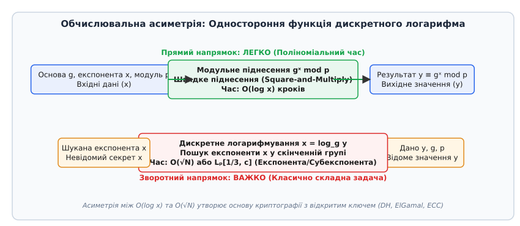
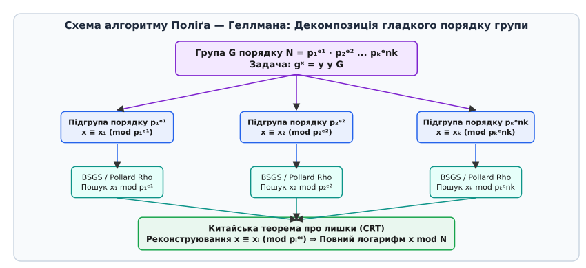
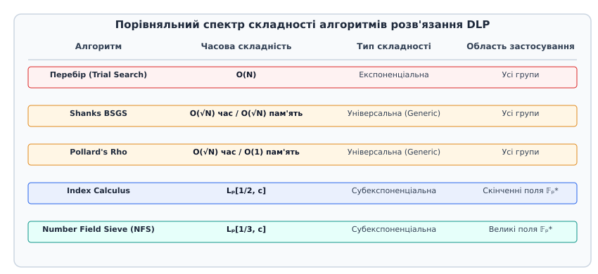
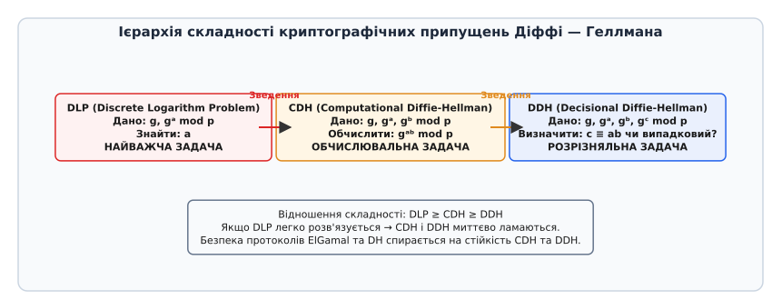

# Проблема дискретного логарифма

<preknowlist>
- [Асимптотична складність](topic:computability/asymptotic-complexity) — O-нотація, поліноміальний та експоненціальний ріст складності.
- [Класи P та NP](topic:computability/p-vs-np) — поліноміальна перевіряльність та важкість обчислень.
- [Теорія груп](topic:math-algebra/group-theory) — алгебраїчна структура скінченних циклічних груп та генератори.
- [Ймовірнісний клас BPP](topic:computability/bpp) — ймовірнісна складність та ампліфікація помилки.
- [Скінченні поля](topic:math-algebra/finite-field-arithmetic) — алгебраїчна структура полів Галуа 𝔽ₚ та 𝔽_{p^k}, незвідні многочлени та мультиплікативна група.
- [Китайська теорема про остачі](topic:math-number-theory/chinese-remainder-theorem) — декомпозиція порівнянь за взаємно простими модулями та редукція Поліґа — Геллмана.
- [Еліптичні криві](topic:math-number-theory/elliptic-curves) — груповий закон додавання точок над скінченними полями та дискретний логарифм у E(𝔽ₚ).
- [Розширений алгоритм Евкліда](topic:math-number-theory/gcd-euclidean) — обчислення НСД, співвідношення Безу та шукання модульного оберненого.
</preknowlist>

Коли сервер електронного банку або зашифрованого месенджера узгоджує секретний сеансовий ключ із мобільним клієнтом через відкриту мережу Інтернет, він спирається на обчислювальний дисбаланс між двома напрямками однієї й тієї самої арифметичної операції. Піднесення 256-бітного числа до степеня у скінченному полі за допомогою послідовного піднесення до квадрата займає менше 1000 мікропроцесорних операцій (декілька мікросекунд). У той самий час зворотна операція — вирахування показника степеня за відомою основою та результатом — вимагає виконання понад `10³⁸` операцій для найкращих класичних алгоритмів. Ця обчислювальна асиметрія становить зміст **проблеми дискретного логарифма** (англ. *Discrete Logarithm Problem, DLP*), на якій тримається безпека цифрових протоколів TLS, SSH, IPsec, ElGamal та криптографії на еліптичних кривих.

Назва поняття походить від латинського *discretus* — розділений, переривчастий та грецьких слів *logos* (відношення) і *arithmos* (число). На відміну від неперервного логарифма над дійсними числами, який легко обчислюється наближеними чисельними методами завдяки монотонності та гладкості функції `f(x) = aˣ`, дискретний логарифм функціонує у скінченній алгебраїчній структурі (групі або полі), де послідовність степенів `g¹, g², g³...` поводиться подібно до псевдовипадкової перестанови елементів.


*Обчислювальна асиметрія між логарифмічним часом прямого піднесення до степеня O(log x) та складною зворотною задачею пошуку дискретного логарифма.*

## 1. Формальна алгебраїчна постановка та структура поняття

Розглянемо скінченну циклічну групу `G` порядку `N = |G|`, записану в мультиплікативній нотації. Оскільки група `G` є циклічною, у ній існує твірний елемент (генератор) `g ∈ G` такий, що його послідовні степені породжують усі елементи групи:

```
G = ⟨g⟩ = {g⁰, g¹, g², ..., gᴺ⁻¹}    [циклічна група порядку N]
```

Загальна кількість генераторів у циклічній групі порядку `N` дорівнює значенню функції Ейлера `φ(N)`. Якщо `N` є простим числом `q`, то кожен ненульовий елемент групи (окрім нейтрального `1`) є генератором, і кількість генераторів становить `q - 1`.

Для довільного елемента `y ∈ G` **проблема дискретного логарифма** полягає у знаходженні єдиного цілого числа `x` у межах `0 ≤ x < N`, яке задовольняє групове рівняння:

```
gˣ = y      [основне рівняння дискретного логарифмування]
```

Число `x` називається дискретним логарифмом елемента `y` за основою `g` у групі `G` і позначається як `x = log_g y` або `x = ind_g y`.

З математичної точки зору відображення `f: ℤ_N → G`, задане формулою `f(x) = gˣ`, встановлює **ізоморфізм** між аддитивною групою залишків `(ℤ_N, +)` та мультиплікативною групою `(G, ·)`. Знаходження дискретного логарифма відповідає обчисленню оберненого ізоморфізму `f⁻¹: G → ℤ_N`.

### Головні алгебраїчні середовища застосування DLP

1. **Мультиплікативна група скінченного простого поля `𝔽ₚ*`:** Елементами є ненульові лишки `{1, 2, ..., p - 1}` за модулем простого числа `p`. Порядок групи дорівнює `N = p - 1`. Рівняння набуває вигляду:
   ```
   gˣ ≡ y (mod p)      [DLP у полі 𝔽ₚ*]
   ```
   Група `𝔽ₚ*` є завжди циклічною. Порядок `N = p - 1` є парним числом для всіх простих `p > 2`, що робить можливим застосування спеціалізованих алгебраїчних атак.

2. **Мультиплікативна група розширеного поля `𝔽_{p^k}*`:** Використовується у деяких спеціалізованих криптографічних конструкціях, кодах виправлення помилок та спарюваннях (англ. *pairings*).

3. **Група точок еліптичної кривої `E(𝔽ₚ)`:** Елементами є геометричні точки `P = (x, y)`, що задовольняють канонічне рівняння Вайєрштрасса:
   ```
   y² ≡ x³ + a·x + b (mod p)      [рівняння еліптичної кривої]
   ```
   разом із додатковою точкою на нескінченності `O`, яка виконує роль нейтрального елемента. Груповою операцією є геометричне додавання точок `P + Q`. За теоремою Гассе (Hasse's theorem), кількість точок на еліптичній кривій `|E(𝔽ₚ)|` задовольняє нерівність:
   ```
   | |E(𝔽ₚ)| - (p + 1) | ≤ 2·√p      [межа Гассе]
   ```
   Рівняння DLP у групі точок еліптичної кривої записується в аддитивній нотації:
   ```
   x · P = Q      [ECDLP: дискретний логарифм на еліптичній кривій]
   ```
   де `x · P` означає скалярне множення точки `P` на ціле число `x` (додавання точки `P` до себе `x` разів).

Фундаментальна відмінність між цими середовищами полягає в тому, що представлення елементів у `𝔽ₚ*` містить додаткову арифметичну структуру (поняття простого множника та розкладу чисел у кільці цілих чисел), тоді як група точок еліптичної кривої `E(𝔽ₚ)` такої додаткової структури розкладу не має.

## 2. Складносна класифікація та місце DLP у теорії обчислень

У теорії обчислювальної складності задача дискретного логарифма розглядається як розв'язувальна задача (або задача пошуку), перетворена на задача мовної розпізнаваності: «Чи існує таке `x ≤ k`, що `gˣ = y` у групі `G`?».

З точки зору класів складності DLP володіє унікальними фундаментальними властивостями:

1. **Належність до класу NP ∩ coNP:** Задача перевірки підтвердження (свідка) є поліноміальною. Якщо пропоненту надано значення `x`, перевірити тотожність `gˣ = y` можна за поліноміальний час `O(log N)` за допомогою двоічного піднесення до степеня. Аналогічно, твердження про відсутність логарифма у даному інтервалі також має короткий поліноміальний сертифікат.

2. **Відсутність доведення NP-повноти:** На відміну від задачі здійсненності булевих формул (SAT) або задачі комбіявояжера, проблема дискретного логарифма **не вважається NP-повною**. Якщо б DLP виявилася NP-повною, це призвело б до колапсу поліноміальної ієрархії `NP = coNP`, що за загальноприйнятою гіпотезою вважається малоймовірним.

3. **Середня складність збігається з найгіршою (Random Self-Reducibility):** DLP володіє властивістю **випадкового самозведення**. Якщо існує алгоритм `A`, який ефективно розв'язує DLP лише для певної помітної частки `ε` випадкових елементів групи `G`, то за допомогою цього алгоритму можна побудувати імовірнісний алгоритм, який ефективно розв'язує DLP для **довільного** елемента `y ∈ G`.

### Механізм випадкового самозведення

Для розв'язання задачі `gˣ = y` обираємо випадковий зсув `r ∈ ℤ_N` і формуємо новий елемент `y' = y · gʳ`. Якщо алгоритм `A` здатний обчислити `x' = log_g y'`, то шуканий логарифм відновлюється миттєво:

```
g^{x'} = y' = y · gʳ = gˣ · gʳ = g^{x + r}
x' ≡ x + r (mod N)  ⇒  x = (x' - r) mod N      [випадкове самозведення]
```

Ця властивість гарантує відсутність «легких» або «важких» екземплярів у межах однієї групи: усі елементи групи є однаково складними для логарифмування.

> 🔧 **Навіщо це.** Властивість випадкового самозведення є гарантом криптографічної надійності. Вона означає, що розробникам не потрібно побоюватися, що випадково згенерований приватний ключ `x` виявиться «слабким» з точки зору алгоритмів перебору. Якщо проблема DLP у даній групі є складною в середньому, вона є однаково складною для будь-якого обраного ключа.

Детальний нарис про те, як ідея обчислювальної асиметрії пройшла шлях від математичних таблиць Ґаусса 1801 року до стандартів Internet Engineering Task Force (IETF), описано у вставці [📜 Історія відкриття проблеми дискретного логарифма](topic:sf-security/discrete-log-problem/hist-diffie-hellman-dlog.md).

## 3. Універсальні (Generic) алгоритми розв'язання та їхні межі

Універсальні алгоритми (англ. *generic group algorithms*) розглядають групу `G` як **«чорну скриньку»** (англ. *black box*). Вони не спираються на конкретне цифрове представлення елементів групи, а використовують лише базові операції множення двох елементів, інверсії та перевірки двох елементів на рівність.

У 1997 році Віктор Шоуп (Victor Shoup) довів нижню межу складності для будь-якого універсального алгоритму дискретного логарифмування:

```
Ω(√p)    [абсолютна нижня межа Шоупа для абстрактної групи порядку p]
```

Це означає, що жоден алгоритм, який працює з групою як із чорною скриньку, не спроможний розв'язати DLP швидше, ніж за `O(√p)` групових операцій, де `p` — найбільший простий дільник порядку групи.

### 3.1. Перебір (Trial Multiplication)
Найпростіший підхід полягає у послідовному обчисленні `g⁰, g¹, g², ..., gˣ` до зустрічі з елементом `y`. 
- Часова складність: `O(N)`.
- Пам'ять: `O(1)`.

Для реальних криптографічних модулів `N ≈ 2²⁵⁶` цей алгоритм вимагає `10⁷⁷` кроків, що перевершує кількість атомів у спостережуваному Всесвіті.

### 3.2. Алгоритм «Крок немовляти — крок велетня» (Shanks BSGS)
Алгоритм Деніела Шенкса спирається на розкладання шуканого логарифма `x` за параметром `m = ⌈√N⌉`:

```
x = i·m - j    [де 1 ≤ i ≤ m  та  0 ≤ j < m]
```

Рівняння `gˣ = y` перетворюється на тотожність:

```
g^{i·m} = y · gʲ      [тотожність Шенкса]
```

Алгоритм будує хеш-таблицю для всіх «кроків немовляти» `y · gʲ` (для `0 ≤ j < m`), після чого послідовно обчислює «кроки велетня» `(gᵐ)ⁱ` для `1 ≤ i ≤ m` і шукає збіг ключів у хеш-таблиці.
- Часова складність: `O(√N)` операцій.
- Просторова складність (пам'ять): `O(√N)` елементів групи.

Хоча BSGS досягає теоретичного оптимуму Шора `O(√N)` за часом, його застосування для `N = 2²⁵⁶` вимагає зберігання `2¹²⁸` елементів у пам'яті (мільйони петабайтів RAM), що робить його непридатним для великих полів.

### 3.3. `ρ`-алгоритм Полларда (Pollard's Rho Algorithm)
Імовірнісний алгоритм Майкла Полларда усуває критичний недолік BSGS, зберігаючи часову складність `O(√N)`, але зменшуючи потребу в пам'яті до константи `O(1)`.

Алгоритм будує псевдовипадкову послідовність елементів `wₖ = g^{aₖ} · y^{bₖ}` у групі `G`. За парадоксом днів народження (англ. *Birthday Paradox*) у скінченній множині з `N` елементів псевдовипадкове блукання з високою ймовірністю перетне власну траєкторію (утворить колізію `wₖ = wₘ`) за час порядку `O(√N)`.

Знайшовши колізію `g^{aₖ} · y^{bₖ} = g^{aₘ} · y^{bₘ}`, шуканий логарифм `x` обчислюється шляхом розв'язання лінійного порівняння:

```
(bₘ - bₖ) · x ≡ aₖ - aₘ (mod N)    [рівняння колізії Полларда]
```

Завдяки використанню методу двох вказівників Флойда («черепаха і заєць»), пошук колізії виконується взагалі без збереження попередніх станів траєкторії.
- Часова складність: `O(√N)` в середньому.
- Пам'ять: `O(1)`.

### 3.4. Алгоритм Полларда «Кенгуру» (Pollard's Kangaroo / Lambda Algorithm)
Якщо заздалегідь відомо, що логарифм `x` лежить у короткому підінтервалі `[A, B]` довжини `W = B - A` (наприклад, при відновленні частково розкритого ключа), Майкл Поллард розробив алгоритм «Кенгуру» (англ. *Pollard's Kangaroo Algorithm*).

Алгоритм запускає два псевдовипадкові блукання («свійський кенгуру» з відомої точки та «дикий кенгуру» з цільової точки `y`).
- Часова складність: `O(√W)` групових множень.
- Пам'ять: `O(1)` (потребує зберігання лише кількох розставильних пасток).

Це робить алгоритм Кенгуру ідеальним інструментом для криптоаналізу ключів із обмеженою ентропією.

Детальний математичний апарат, точні формули оцінок та крокові виведення методів BSGS та Pollard's Rho наведено у вставці [𝔮 Математичний апарат алгоритмів дискретного логарифмування](topic:sf-security/discrete-log-problem/math-pohlig-hellman.md). 

Готові програмні реалізації цих алгоритмів мовами C та C++ з використанням 64-бітної арифметики та хеш-таблиць доступні у практичній вставці [⚙️ Практична реалізація алгоритмів розв'язання дискретного логарифма](topic:sf-security/discrete-log-problem/proj-dlog-solvers.md).

## 4. Алгоритм Поліґа — Геллмана: вразливість гладких порядків

Універсальні алгоритми типу BSGS та Pollard's Rho вимірюють складність через загальний порядок групи `N`. Однак у 1978 році Стівен Поліґ та Мартін Геллман довели, що якщо порядок групи `N` розкладається на малі прості множники (є так званим *гладким числом*), складність DLP падає до складності найзапеклішого простого дільника.

Нехай канонічний розклад порядку групи має вигляд:

```
N = p₁ᵉ¹ · p₂ᵉ² · ... · pₖᵉnk      [розклад порядку групи N]
```

Алгоритм Поліґа — Геллмана зводить задачу обчислення `x = log_g y mod N` до серії окремих задач обчислення `xᵢ = x mod pᵢᵉⁱ` у підгрупах значно меншого простого порядку `pᵢ`. 


*Декомпозиція групи гладкого порядку N на підгрупи простого порядку pᵢᵉⁱ з подальшою реконструкцією за Китайською теоремою про лишки.*

Алгоритм працює за такою схемою:
1. Для кожного простого дільника `p = pᵢ` початкове рівняння `gˣ = y` підноситься до степеня `N / p`. Оскільки `gᴺ = 1`, це вилучає всі компоненти порядку, окрім `p`, і дає рівняння відносно наймолодшого біта `x mod p`:
   ```
   (g^{N/p})^{z₀} = y^{N/p}      [DLP у підгрупі порядку p]
   ```
2. Знайшовши `z₀` за допомогою BSGS або Pollard's rho за час `O(√p)`, процес повторюється для знаходження всіх `eᵢ` цифр `p`-адичного розкладу `x mod pᵢᵉⁱ`.
3. Отримавши системи порівнянь `x ≡ xᵢ (mod pᵢᵉⁱ)` для всіх `i = 1, ..., k`, підсумковий логарифм `x mod N` реконструюється за допомогою **Китайської теореми про лишки (CRT)**.

Загальна складність алгоритму Поліґа — Геллмана дорівнює:

```
O(∑ eᵢ · (log N + √pᵢ))      [складність Поліґа — Геллмана]
```

> ⚠️ **Криптографічний висновок.** Якщо порядок групи `N = p - 1` складається лише з малих простих множників (наприклад, `N = 2³²`), то DLP у такій групі розв'язується за частки секунди, навіть якщо сам модуль `p` є 2048-бітним числом! Щоб запобігти цій атаці, у криптографії використовують **безпечні прості числа** (англ. *safe primes*) виду `p = 2q + 1`, де `q` — також велике просте число (так зване просте число Софі Жермен). У такій групі порядок `p - 1 = 2q` містить великий простий дільник `q`, що робить редукцію Поліґа — Геллмана недієвою.

## 5. Субекспоненціальні алгоритми у скінченних полях: Index Calculus та NFS

Коли ми переходимо від абстрактної чорної скриньки до конкретного скінченного поля `𝔽ₚ*`, елементи групи являють собою звичайні цілі числа `{1, 2, ..., p - 1}`. Це дозволяє криптоаналітикам застосувати потужніші алгебраїчні методи, які обходять універсальну межу Шоупа `O(√p)`.

Головним інструментом атак на скінченні поля є метод **індексу факторів** (англ. *Index Calculus*), розроблений Леонардом Адлеманом.

Суть методу полягає у використанні **факторної бази** `S = {p₁, p₂, ..., p_B}` — множини перших `B` малих простих чисел:

1. **Генерація співвідношень:** Обираються випадкові значення `k` і обчислюється `v = gᵏ mod p`. Намагаємося розкласти `v` на прості множники з бази `S`. Якщо `v` розкладається (є `S`-гладким), це дає лінійне рівняння відносно невідомих логарифмів елементів бази `xⱼ = log_g pⱼ`:
   ```
   k ≡ c₁·(log_g p₁) + c₂·(log_g p₂) + ... + c_B·(log_g p_B) (mod p - 1)
   ```
2. **Лінійна алгебра:** Накопичивши понад `B` таких рівнянь, розв'язуємо розріджену систему лінійних порівнянь за модулем `p - 1` і знаходимо дискретні логарифми всіх простих чисел з факторної бази.
3. **Обчислення індивідуального логарифма:** Для знаходження `log_g y` шукаємо зсув `s` такий, щоб `y · gˢ mod p` розклалося по факторній базі `S`.

Складність методів індексу факторів описується за допомогою спеціальної **L-нотації**:

```
Lₚ[α, c] = exp((c + o(1)) · (ln p) α · (ln ln p) 1-α)    [L-нотація складності]
```

Параметр `α ∈ [0, 1]` визначає характер складності: `α = 1` відповідає повністю експоненціальному росту, а `α = 0` — поліноміальному росту.


*Спектр складності алгоритмів дискретного логарифмування від універсальних O(√N) до субекспоненціальних методів Lₚ[1/3].*

Еволюція складності атак на скінченні поля `𝔽ₚ*`:
- **Базовий Index Calculus:** `Lₚ[1/2, 1]` — субекспоненціальний час.
- **Загальний метод сита поля чисел (GNFS):** `Lₚ[1/3, (64/9)¹/³] ≈ Lₚ[1/3, 1.923]` — найшвидший сучасний класичний алгоритм для `𝔽ₚ*`.

Наявність алгоритмів складності `Lₚ[1/3]` означає, що для забезпечення криптографічної стійкості у `𝔽ₚ*` розмір модуля `p` доводиться нарощувати до 2048, 3072 або 4096 бітів.

## 6. Еліптичні криві (ECDLP) та спарювальні атаки (MOV Reduction)

Криптографія на еліптичних кривих (англ. *Elliptic Curve Cryptography, ECC*), запропонована Віктором Міллером та Нілом Кобліцом у 1985 році, базується на перенесенні DLP у групу точок еліптичної кривої `E(𝔽ₚ)`.

Головна алгебраїчна перевага еліптичних кривих полягає в тому, що точки `P = (x, y)` на кривій **не мають природного аналога арифметичного розкладу на прості множники**. У групі `E(𝔽ₚ)` відсутнє поняття «гладких точок» або факторної бази.

У результаті цього:
1. Методи Index Calculus та Number Field Sieve (NFS) **не працюють** у групі точок еліптичних кривих.
2. Найкращими відомими класичними алгоритмами для ECDLP залишаються універсальні алгоритми типу Pollard's rho зі складністю `O(√N)`.

Це дає величезну перевагу у довжині ключів при однаковому рівні криптографічного захисту:

| Рівень безпеки (біти) | Розмір модуля `𝔽ₚ*` або RSA (біти) | Розмір ключа Еліптичної кривої ECDLP (біти) | Співвідношення розміру ключів |
| :--- | :--- | :--- | :--- |
| **80** (застарілий) | 1024 | 160 | 1 : 6.4 |
| **128** (сучасний стандарт) | 3072 | 256 | 1 : 12 |
| **192** (високий захист) | 7680 | 384 | 1 : 20 |
| **256** (військовий рівень) | 15360 | 512 | 1 : 30 |

### Атака Менезеса — Окамото — Ванстоуна (MOV Reduction)
Єдиним винятком із високої стійкості ECDLP є так звані суперсигулярні криві або криві з малим **ступенем занурення** (англ. *embedding degree* `k`).

Атака MOV розроблена Альфредом Менезесом, Тацуакі Окамото та Скоттом Ванстоуном. Вона спирається на білінійне спарювання Вейля (Weil pairing) `e: E(𝔽_q) × E(𝔽_q) → 𝔽_{q^k}*`.

Спарювання переносить проблему дискретного логарифма з групи точок кривої `E(𝔽_q)` у мультиплікативну групу розширеного поля `𝔽_{q^k}*`:

```
e(x·P, Q) = e(P, Q)ˣ      [зведення MOV]
```

Якщо ступінь занурення `k` є малим (`k ≤ 6`), зловмисник може перенести ECDLP у поле `𝔽_{q^k}*` і розв'язати її за субекспоненціальний час за допомогою методів Index Calculus. Щоб запобігти цій атаці, у криптографічних стандартах обирають криві з високим ступенем занурення (`k ≥ 12`) або некоактивні звичайні криві.

## 7. Практичне застосування DLP у криптографічних протоколах

Складність розв'язання проблеми дискретного логарифма є основою для побудови трьох фундаментальних класів практичних криптографічних систем:

### 7.1. Протоколи обміну ключами (Diffie-Hellman Key Exchange)
Протокол Діффі — Геллмана дозволяє двом сторонам сформувати спільний таємний ключ у відновимому закритому каналі:
- **Аліса** обирає випадковий приватний ключ `a ∈ ℤ_N` і надсилає публічний ключ `A = gᵃ mod p`.
- **Боб** обирає випадковий приватний ключ `b ∈ ℤ_N` і надсилає публічний ключ `B = gᵇ mod p`.
- Спільний сеансовий секрет обчислюється як `K = Bᵃ mod p = Aᵇ mod p = gᵃᵇ mod p`.

У сучасному протоколі **ECDHE** (Ephemeral Elliptic Curve Diffie-Hellman) ключі `a` та `b` генеруються заново для кожного нового сеансу зв'язку. Це забезпечує властивість **досконалої прямої секретності** (англ. *Perfect Forward Secrecy, PFS*): навіть якщо зловмисник у майбутньому викраде довгостроковий приватний ключ сервера, він не зможе розшифрувати минулі сеанси зв'язку, збережені з мережевого трафіку.

### 7.2. Асиметричне шифрування ElGamal
Система шифрування Ель-Ґамаля перетворює обмін ключами на схему з відкритим ключем:
- Публічний ключ отримувача: `(p, g, Y = gˣ mod p)`. Приватний ключ: `x`.
- Шифрування повідомлення `m ∈ 𝔽ₚ*`: відправник обирає випадкове число `k ∈ ℤ_N` і формує шифротекст із двох елементів `(C₁, C₂) = (gᵏ mod p, m · Y ᵏ mod p)`.
- Розшифрування: отримувач обчислює `m = C₂ · (C₁ˣ)⁻¹ mod p`.

### 7.3. Цифрові підписи (DSA, ECDSA, Ed25519) та пастка повторного використання одноразового числа
Схеми цифрового підпису на основі DLP (Schnorr, DSA, ECDSA) спираються на доказ володіння приватним ключем `x` без його розкриття.

Підпис параметра `h = Hash(message)` складається з двох чисел `(r, s)`:
```
r = (gᵏ mod p) mod q
s = k⁻¹ · (h + x · r) mod q    [де k — одноразовий випадковий nonce]
```

> 🚨 **Критична криптографічна пастка повторного використання nonce `k`.**
> Якщо розробник криптографічного модуля повторно використає одне й те саме одноразове число `k` для підпису двох різних повідомлень `h₁` та `h₂`, приватний ключ `x` витікає миттєво!
> 
> Нехай маємо два підписи `(r, s₁)` та `(r, s₂)` з однаковим `r` (що сигналізує про однаковий `k`):
> ```
> s₁ - s₂ ≡ k⁻¹ · (h₁ - h₂) (mod q)
> k ≡ (h₁ - h₂) · (s₁ - s₂)⁻¹ (mod q)    [відновлення одноразового секрету k]
> ```
> Знаючи `k`, приватний ключ `x` обчислюється миттєво за формулою `x = (s₁·k - h₁) · r⁻¹ mod q`.
> Саме ця помилка у реалізації алгоритму ECDSA у консолі Sony PlayStation 3 у 2010 році дозволила хакерам повністю витягти головний закритий ключ компанії Sony.

## 8. Атаки на малі підгрупи та техніки інженерного захисту

При розробці криптографічних протоколів на основі DLP виникає додатковий клас атак, пов'язаний із точністю перевірки вхідних публічних ключів.

### 8.1. Атака обмеження малих підгруп (Small Subgroup Confinement Attack)
Нерідко порядок групи `N = |G|` має вигляд `N = h · q`, де `q` — великий простий порядок криптографічної підгрупи, а `h` — малий кофактор (наприклад, `h = 8` для кривої Ed25519).

Якщо зловмисник надсилає повідомлення з публічним елементом `P' = (q / d) · P`, де `d` — малий дільник `h`, то елемент `P'` має малий порядок `d`. При обчисленні спільного секрету `K = x · P'` значення `K` потрапляє у малу підгрупу розміром `d`.

Перехоплювач може легко вирахувати `x mod d` за допомогою повного перебору. Повторюючи атаку для різних малих дільників `dᵢ`, криптоаналітик за допомогою Китайської теореми про лишки відновлює `x mod h`, що частково або повністю розкриває приватний ключ `x`.

### 8.2. Метод захисту: перевірка порядку та множення на кофактор
Для запобігання атакам на малі підгрупи застосовуються два інженерні підходи:
1. **Явна перевірка належності підгрупі (Subgroup Validation):** Перед обчисленням секрету модуль перевіряє, що вхідна точка `P` задовольняє умову `q · P = O`. Якщо ця умова не виконується, виклик відхиляється.
2. **Множення на кофактор (Cofactor Diffie-Hellman):** Замість обчислення `x · P` обидві сторони обчислюють `(h · x) · P`. Оскільки `h · P` повністю обнуляє всі компоненти малих порядків, результат гарантовано належить до безпечної підгрупи простого порядку `q`.

## 9. Апаратні реалізації та оптимізації обчислень у криптомодулях (HSM)

У реальних захищених процесорах, криптокартках та апаратних модулях безпеки (HSM) обчислення модульного піднесення до степеня `gˣ mod p` або скалярного множення точки `x · P` є найбільш затратними операціями.

### 9.1. Редукція Монтгомері (Montgomery Multiplication)
Класичне обчислення `(a · b) mod p` вимагає виконання цілочисельного ділення `/ p`, яке на апаратному рівні виконується в 10-30 разів повільніше за множення.

Метод Монтгомері переводить числа у так звану форму Монтгомері `a' = a · R mod p` (де `R = 2⁶⁴` або `2²⁵⁶`). У цій формі множення `(a' · b') / R mod p` виконується взагалі **без операції ділення**, лише за допомогою додавання, множення та побітового зсуву:

```
MontgomeryMul(A, B) = (A · B + q · p) / R    [операція без ділення]
```

Це дозволяє прискорити виконання TLS-хендшейків та генерації підписів ECDSA на серверному обладнанні у кілька разів.

### 9.2. Захист від атак по сторонніх каналах (Side-Channel Attacks)
При виконанні піднесення до степеня `Square-and-Multiply` або скалярного множення `Double-and-Add` послідовність виконаних інструкцій залежить від бітів приватного ключа `x`:
- Якщо біт дорівнює `0`, виконується лише квадрат (Square).
- Якщо біт дорівнює `1`, виконується квадрат та множення (Square + Multiply).

Зловмисник, вимірюючи електромагнітне випромінювання або енергоспоживання процесора (Simple Power Analysis, SPA), може напряму прочитати біти приватного ключа `x`.

Для захисту від цих атак застосовуються алгоритми **сталого часу (Constant-Time execution)**:
1. **Алгоритм Монтгомері Сходинки (Montgomery Ladder):** При обробці кожного біта ключа виконується однакова кількість операцій додавання та подвоєння точок, незалежно від значення біта.
2. **Засліплення коефіцієнтів (Exponent Blinding):** Замість обчислення `gˣ mod p` обчислюється `g^{x + r·(p-1)} mod p`, де `r` — випадкове число, що змінюється при кожному виклику.

## 10. Квантовий прорив: Алгоритм Шора та клас BQP

У класичній теорії обчислень проблема дискретного логарифма вважається складною задачею, що лежить поза межами класу **P**. Проте ситуація кардинально змінюється у квантовій моделі обчислень.

У 1994 році Пітер Шор довів, що квантовий комп'ютер спроможний розв'язати проблему дискретного логарифма за **поліноміальний час**:

```
O((log N)³)    [поліноміальний час алгоритму Шора]
```

Це ставить проблему дискретного логарифма у квантовий клас складності **BQP** (англ. *Bounded-Error Quantum Polynomial-Time*).

### Схема функціонування алгоритму Шора

Квантовий алгоритм Шора розв'язує DLP за допомогою квантового перетворення Фур'є:

1. **Ініціалізація квантового регістру:** Готується дворегістрова суперпозиція станів:
   ```
   |Ψ₀⟩ = 1/N · ∑ ∑ |a⟩ |b⟩ |0⟩    [суперпозиція за всіма a, b ∈ ℤ_N]
   ```
2. **Квантоване обчислення:** Обчислюється функція `f(a, b) = gᵃ · y⁻ᵇ mod p` в унітарному квантовому вентилі:
   ```
   |Ψ₁⟩ = 1/N · ∑ ∑ |a⟩ |b⟩ |gᵃ · y⁻ᵇ mod p⟩
   ```
3. **Застосування Двовимірного Квантового Перетворення Фур'є (QFT):** QFT перетворює часову суперпозицію у спектральну, концентруючи квантову амплітуду на точках `(u, v)`, що відповідають точній періодичності `a + x·b ≡ 0 (mod N)`.
4. **Вимірювання та алгоритм неперервних дробів:** Вимірювання квантового стану дає значення `u, v`, з яких за допомогою класичного алгоритму неперервних дробів миттєво обчислюється логарифм `x = log_g y`.

Отже, створення повномасштабного квантового комп'ютера з кількома тисячами фізично стабільних кубітів повністю зламає усю криптографію, базовану на DLP та ECDLP (DH, ECDH, ElGamal, DSA, ECDSA). Це зумовило поточний глобальний перехід світової індустрії на **постквантову криптографію** (Post-Quantum Cryptography, PQC), базовану на задачах теорії ґраток (LWE, Module-LWE), які залишаються складними і для квантових обчислювачів.

## 11. Ієрархія складності припущент Діффі — Геллмана

У практичній криптографії безпека конкретних протоколів часто спирається не на саму задачу DLP, а на пов'язані з нею обчислювальні проблеми Діффі — Геллмана:

1. **Проблема дискретного логарифма (DLP):** Дано `g, gᵃ`. Обчислити приватне `a`.
2. **Обчислювальна проблема Діффі — Геллмана (CDH):** Дано `g, gᵃ, gᵇ`. Обчислити спільне значення `gᵃᵇ`.
3. **Розрізняльна проблема Діффі — Геллмана (DDH):** Дано `g, gᵃ, gᵇ, gᶜ`. Визначити, чи `c ≡ a·b (mod N)` (тобто чи є `gᶜ` справжнім ключем `gᵃᵇ`), чи `c` є випадковим елементом.


*Відношення складності між фундаментальною проблемою DLP, обчислювальною CDH та розрізняльною DDH.*

Ієрархія складності між цими припущеннями визначається відношенням поліноміального зведення:

```
DLP ≥ CDH ≥ DDH    [ієрархія складності припущент]
```

- Якщо хтось розв'яже **DLP**, він миттєво зламає **CDH** та **DDH** (бо з `gᵃ` обчислить `a`, після чого легко піднесе `(gᵇ)ᵃ = gᵃᵇ`).
- Зворотне доведення (чи зводиться DLP до CDH) є відкритим математичним запитанням, хоча для багатьох груп доведено їхню обчислювальну еквівалентність.
- Безпека підпису ElGamal спирається на важкість **DLP**, безпека обміну ключами Діффі — Геллмана спирається на **CDH**, а семантична безпека шифрування ElGamal (нерозрізняваність шифротекстів) вимагає виконання суворішої гіпотези **DDH**.

Згідно з сучасними рекомендаціями регуляторів криптографічного захисту (NIST SP 800-57, BSI TR-02102), класичні криптосистеми на основі дискретного логарифма у полях `𝔽ₚ*` підлягають плановому виведенню з експлуатації на користь еліптичних кривих (ECDH, Ed25519) та постквантових алгоритмів (ML-KEM, ML-DSA). Національний інститут стандартів і технологій США (NIST) вже затвердив підсумкові стандарти FIPS 203 (ML-KEM на основі ґраток) та FIPS 204 (ML-DSA), які замінюють класичний обмін ключами Діффі — Геллмана та цифрові підписи DSA/ECDSA у відповідальних інфраструктурах.

Повну технічну специфікацію С/C++ API для розробки криптографічних модулів розв'язання DLP, коди статусів помилок, параметри конфігурації та специфікацію командного рядка CLI-інструменту `dlog-solver` наведено у довідникові [📋 Специфікація інтерфейсу та командного рядка модулів розв'язання DLP](topic:sf-security/discrete-log-problem/api-dlog-interface.md).
