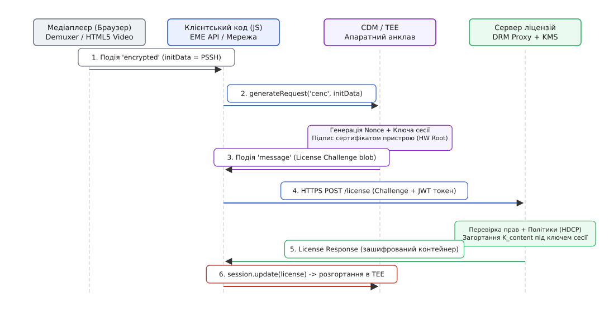
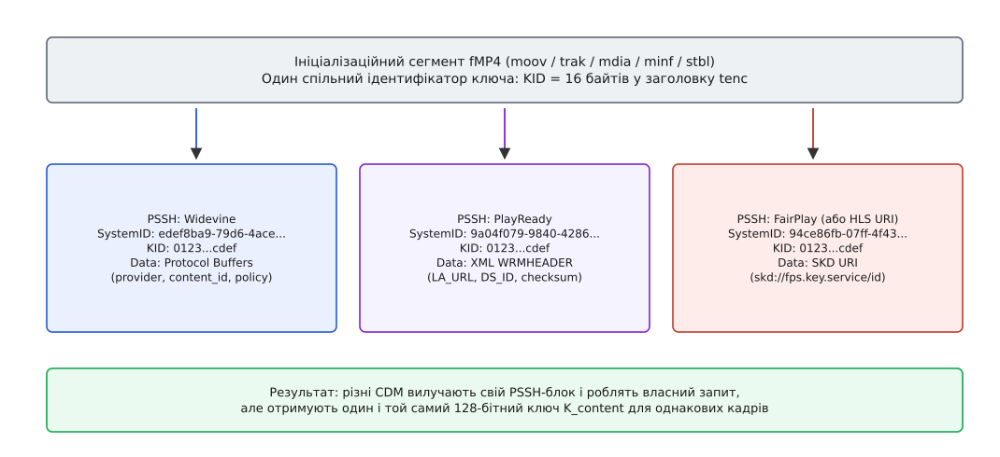
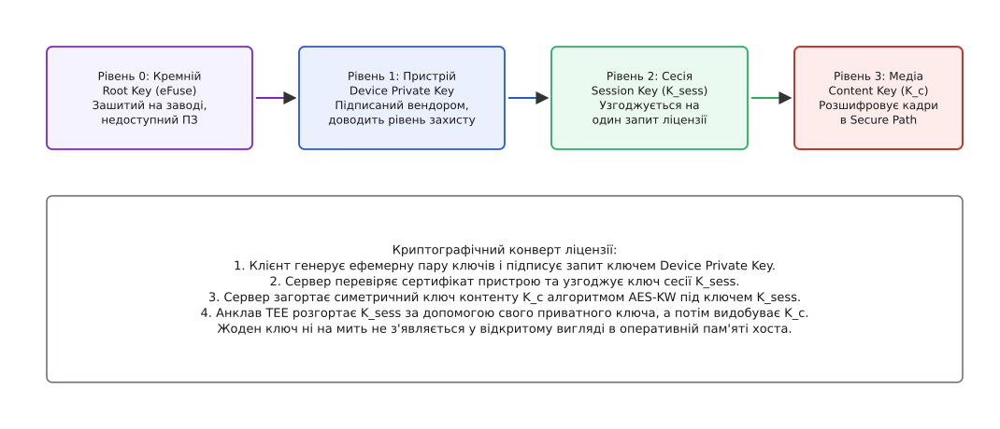
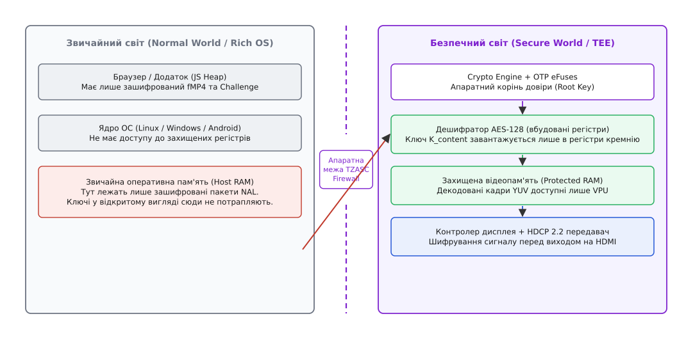

# DRM: як ключ контенту потрапляє в пристрій

<preknowlist>
- [Спільне шифрування медіа (CENC)](topic:sf-security/common-encryption) — як симетричний ключ AES-128 розшифровує кадри у файлі, залишаючи заголовки контейнера відкритими.
- [Криптографія з відкритим ключем](topic:sf-security/public-key-crypto) — асиметричні пари ключів, цифрові сертифікати пристроїв та доведення автентичності.
- [HLS і DASH](topic:com-protocol/hls-dash) — потокова доставка адаптивного відео окремими сегментами за маніфестом.
- [Обмін ключами Діффі — Геллмана](topic:sf-security/diffie-hellman) — принцип узгодження сесійного ключа через відкритий мережевий канал.
</preknowlist>

Користувач сплатив місячну передплату на онлайн-кінотеатр, відкрив браузер і натиснув кнопку відтворення фільму з роздільною здатністю 4K. Через захищене TLS-з'єднання на комп'ютер надходять зашифровані відеосегменти fMP4 зі швидкістю 25 мегабітів на секунду. Корисне навантаження кожного відеокадру зашифроване симетричним алгоритмом AES-128 під 16-байтовим ключем контенту. Щоб показати зображення на екрані, пристрій зобов'язаний розшифровувати 60 кадрів щосекунди в режимі реального часу.

І тут виникає головний архітектурний парадокс цифрового захисту медіа (Digital Rights Management, DRM; від лат. *directio* — «керування» та англ. *rights* — «права»): програвач *мусить* розшифровувати кадри, але програмне середовище програвача *ні за яких умов не має права дізнатися ключ*, яким це розшифрування виконується.

Якщо 16 байтів ключа контенту хоча б на мікросекунду з'являться у відкритому вигляді в оперативній пам'яті браузера, об'єктній купі JavaScript (Heap) або пам'яті ядра звичайної операційної системи, будь-який користувач із правами адміністратора, системний відлагоджувач або модифікований відеодрайвер зможе прочитати цей ключ. Отримавши ключ одного разу, зловмисник розшифрує весь відеопотік за кілька секунд і збереже ідеальну цифрову копію фільму.

Розв'язання цього парадоксу вимагає побудови наскрізного криптографічного конвеєра, який з'єднує хмарну базу ключів правовласника з фізичним кремнієм процесора в пристрої кінцевого споживача. Цей конвеєр працює так, що ключ контенту подорожує відкритим інтернетом усередині багаторівневого криптографічного конверта, потрапляє безпосередньо в ізольований апаратний анклав (від лат. *inclavare* — «замикати на ключ») чипа і розпаковується виключно всередині захищеного відеотракту, куди операційна система не має доступу.


*Шлях доставки ліцензії: браузерний рушій перехоплює контейнерні метадані, JavaScript слугує асинхронним мережевим насосом, а розпакування ключа та дешифрування відео відбуваються виключно всередині ізольованого апаратного контуру TEE.*

Історія появи цього конвеєра та його драматична стандартизація через [війни за захист медіа та компроміс W3C EME](topic:sf-security/drm-key-delivery/hist-drm-wars.md) показує, як індустрія відмовилася від небезпечних двійкових плагінів 2000-х років на користь єдиного архітектурного розрізу.

---

## Контейнерні підказки: звідки пристрій дізнається, що просити

Відеоплеєр завантажує перший сегмент потоку fMP4 (ініціалізаційний сегмент із боксом `moov` або черговий медіафрагмент із боксом `moof`). Щоб запустити процедуру отримання дозволу, програвач повинен відповісти на два запитання: який саме ключ потрібен для цих кадрів і за якими правилами та адресами його запитувати.

### Ідентифікатор ключа (`KID`)

У стандарті [спільного шифрування CENC](topic:sf-security/common-encryption) кожна захищена доріжка містить заголовок `tenc` (Track Encryption Box). У ньому відкрито записано 16-байтовий ідентифікатор ключа — `KID` (Key Identifier):

```
KID = 0x0123456789ABCDEF0123456789ABCDEF
```

`KID` не є таємницею. Це відкрите ім'я ключа. Знаючи `KID`, зловмисник не може розшифрувати ані байта, але цей ідентифікатор дозволяє системі однозначно зрозуміти, яку саме криптографічну пару шукати в базі даних. Проте сам по собі `KID` не містить інформації про те, який саме DRM-сервер обслуговує цей контент, які протоколи він підтримує та які параметри авторизації вимагає.

### Бокс специфічного заголовка системи захисту (`pssh`)

Для передачі службових даних конкретних DRM-систем стандарт ISO/IEC 23001-7 визначає контейнерний бокс `pssh` (Protection System Specific Header).


*Один спільний аудіо- та відеопотік містить кілька паралельних боксів PSSH. Кожна DRM-система вилучає свій блок за унікальним SystemID, але в результаті отримує однаковий 128-бітний ключ контенту.*

Кожен бокс `pssh` має стандартизований заголовок:
1. **`SystemID` (16 байтів)**: Унікальний 128-бітний UUID системи захисту. Наприклад:
   - Google Widevine: `edef8ba9-79d6-4ace-a3c8-27dcd51d21ed`
   - Microsoft PlayReady: `9a04f079-9840-4286-ab92-e65be0885f95`
   - Apple FairPlay: `94ce86fb-07ff-4f43-adb8-93d2fa968ca2`
2. **Список `KID`**: Перелік ідентифікаторів ключів, до яких застосовуються наведені метадані.
3. **`Data` (непрозоре корисне навантаження)**: Бінарний блок, який розуміє виключно цільова DRM-система.

Усередині поля `Data` кожна компанія розміщує власну структуру:
- Widevine пакує повідомлення Protocol Buffers (`WidevineCencHeader`), де записано назву контент-провайдера, унікальний `content_id` фільму та номер періоду ротації ключів.
- PlayReady записує XML-документ `WRMHEADER`, що містить пряму URL-адресу сервера ліцензій (`LA_URL`) та контрольну суму ключа.
- FairPlay передає URI сервісу ключів формату `skd://...` разом із сертифікатом застосунку.

Детальний двійковий розклад полів обох версій боксу та форматів корисного навантаження наведено у [довіднику двійкового формату PSSH та інтерфейсів EME](topic:sf-security/drm-key-delivery/api-eme-interfaces.md).

---

## Архітектурний шлюз: W3C Encrypted Media Extensions (EME)

Коли демультиплексор браузера виявляє в потоці бокс `pssh`, виникає необхідність передати ці дані модулю розшифрування. У минулому браузери вирішували це за допомогою закритих двійкових плагінів (Adobe Flash, Microsoft Silverlight), які мали прямий доступ до пам'яті системи. Це призводило до регулярних збоїв, дірок у безпеці та відсутності підтримки на мобільних пристроях.

Сучасний веб вирішує цю задачу через специфікацію **W3C Encrypted Media Extensions (EME)**. 

### Принцип «недовіреного посильного»

Головний принцип архітектури EME полягає в тому, що прикладний код мовою JavaScript та інтерфейс користувача розглядаються як потенційно скомпрометоване, відкрите середовище. Тому EME позбавляє JavaScript будь-якої можливості торкатися ключів або криптографічних алгоритмів.

JavaScript у моделі EME виконує роль виключно «посильного» (Message Pump):
1. Браузер перехоплює бокс `pssh` і генерує для JavaScript подію `encrypted` з корисним навантаженням `initData`.
2. JavaScript не парсить `initData`. Він просто передає цей масив байтів у захищений модуль розшифрування — **CDM (Content Decryption Module)** через виклик `session.generateRequest("cenc", initData)`.
3. CDM самостійно генерує бінарний запит ліцензії — **License Challenge**, зашифровує його власними засобами та повертає у JavaScript у формі події `message`.
4. JavaScript забирає бінарний челендж, додає до нього заголовки авторизації користувача (JWT-токен або сесійні cookies) і відправляє його через стандартний мережевий виклик `fetch()` на проксі-сервер ліцензій.
5. Отримавши бінарну відповідь сервера (**License Response**), JavaScript передає її назад у CDM через виклик `session.update(licenseResponse)`.

Уся криптографія, перевірка автентичності, збереження та застосування ключів відбуваються за межами досяжності браузерного рушія.

> 🔧 **Навіщо це.** Завдяки такій повній ізоляції розробник відеоплеєра на JavaScript пише один і той самий мережевий код для Chrome на Android, Safari на iPhone та Edge на Windows. Плеєр просто перекачує байти між CDM та сервером, навіть не знаючи, яка саме математика зашита всередині ліцензійного челенджу.

Повний цикл роботи плеєра з обробкою помилок мережі та зміною станів ключів показано в практичному розборі [клієнтського EME-конвеєра мовою TypeScript](topic:sf-security/drm-key-delivery/proj-license-exchange.md).

---

### Процедура індивідуалізації та первинної сертифікації (Provisioning)

Що робити, якщо новий пристрій щойно зійшов із заводського конвеєра або користувач уперше встановив чистий браузер? У деяких випадках модуль CDM ще не має унікального сертифіката пристрою або фабричний сертифікат замінюється тимчасовим пулом анонімних сертифікатів задля захисту приватності.

Для цього EME підтримує спеціальний тип повідомлення: `messageType: "individualization-request"`.

Конвеєр індивідуалізації працює за такою схемою:
1. Модуль CDM генерує запит індивідуалізації, що містить апаратний ідентифікатор чипа або заводський серійний номер.
2. JavaScript перехоплює цей запит і надсилає його до спеціального сервера сертифікації вендора (Google Provisioning Server або Microsoft Individualization Service).
3. Сервер вендора перевіряє справжність чипа за заводською базою даних, створює нову пару асиметричних ключів пристрою, випускає підписаний цифровий сертифікат `Cert_device` і повертає його у відповіді.
4. Метод `session.update()` завантажує новий сертифікат у захищену енергонезалежну пам'ять TEE. Лише після цього CDM стає здатним генерувати повноцінні ліцензійні запити для медіаконтенту.

---

## Формування запиту ліцензії: доказ довіри в кремнії

Що відбувається всередині CDM, коли JavaScript викликає `generateRequest()`? Модуль CDM не може просто надіслати на сервер текстовий запит «будь ласка, дайте мені ключ для KID такий-то». Сервер ліцензій ніколи не віддасть ключ невідомому клієнту. CDM зобов'язаний надати математичний доказ того, що:
1. Запит надходить від автентичного, сертифікованого пристрою, а не від емулятора чи скрипта на Python.
2. Прошивка та криптографічний модуль чипа не були модифіковані або зламані.
3. Пристрій гарантує відповідний рівень апаратної ізоляції (наприклад, апаратний Secure Video Path).

Ця процедура називається **атестацією пристрою** (від лат. *attestatio* — «свідчення, підтвердження»).

### Апаратний корінь довіри (Hardware Root of Trust)

Під час виробництва процесора на напівпровідниковому заводі в кремній впаюється енергонезалежна пам'ять на електронних запобіжниках — **eFuses / OTP** (One-Time Programmable). В OTP зашивається:
- **Унікальний секретний ключ пристрою (`SK_device`)**: Приватний асиметричний ключ або симетричний корінь, який неможливо зчитати ззовні чипа.
- **Сертифікат пристрою (`Cert_device`)**: Цифровий сертифікат, підписаний проміжним центром сертифікації виробника чипа (OEM CA), який, у свою чергу, підписаний кореневим центром сертифікації DRM-провайдера (наприклад, Google Widevine Root CA або Apple FairPlay CA).

### Побудова ліцензійного челенджу (License Challenge)

Коли CDM отримує `initData`:
1. Модуль вилучає з PSSH ідентифікатор `KID` та параметри сесії.
2. Внутрішній апаратний генератор випадкових чисел генерує криптографічний нонс (одноразове випадкове число, `N_client`) для захисту від атак повторного відтворення (Replay Attack).
3. CDM генерує тимчасову ефемерну пару ключів для цієї сесії (`SK_client_eph`, `PK_client_eph`).
4. Усі ці поля — версія клієнта, рівень безпеки (L1 або L3), список `KID`, нонс `N_client` та публічний ключ `PK_client_eph` — поєднуються в структуру запиту.
5. CDM підписує все повідомлення закритим ключем пристрою `SK_device` за допомогою алгоритму асиметричного підпису (RSA-PSS або ECDSA).
6. Якщо плеєр попередньо завантажив публічний сертифікат сервера ліцензій, CDM додатково зашифровує все тіло челенджу цим сертифікатом, унеможливлюючи перехоплення параметрів пристрою в мережі.

Отриманий бінарний блок передається у JavaScript у вигляді події `message`.

---

## Мережевий рівень: роль проксі-сервера авторизації

Клієнтський плеєр ніколи не звертається до ядра DRM-сервера напряму. Між клієнтом та сервером ліцензій завжди стоїть **License Proxy**.

Чому пряме звернення неможливе?
Криптографічний сервер ліцензій (Key Management System, KMS) спеціалізується виключно на математиці: перевірці сертифікатів чипів, вилученні ключів контенту та їхньому шифруванні. Проте KMS нічого не знає про користувачів: він не знає, чи заплатив конкретний глядач за фільм, чи діє його підписка, з якої країни він зайшов (Geo-blocking) і скільки пристроїв одночасно дивляться це відео.

License Proxy бере на себе всю бізнес-логіку:
1. Отримує від клієнта HTTPS POST-запит, що містить бінарний Challenge та заголовок `Authorization: Bearer <JWT>`.
2. Валідує цифровий підпис JWT-токена та вилучає ідентифікатор користувача.
3. Звертається до білінгової бази даних сервісу: перевіряє тарифний план, наявність активної передплати та ліміт паралельних потоків (Concurrency Limit).
4. Формує **бізнес-політику ліцензії**:
   - **Подвійні таймери експірації**: час оренди (наприклад, ліцензія дійсна протягом 30 днів із моменту завантаження) та час перегляду (рівно 48 годин із моменту натискання кнопки Play).
   - **Дозволена роздільна здатність**: якщо тариф користувача передбачає базовий план (SD), проксі дозволяє видачу ключа лише для доріжки 480p, навіть якщо клієнт запитує 4K.
   - **Вимоги до захисту виводу (HDCP Output Control)**: для відео 4K встановлюється обов'язкова вимога наявності інтерфейсу HDCP 2.2 із типом потоку Type 1 (заборона ретрансляції на повторювачі нижчого рівня HDCP 1.4).
   - **Заборона аналогового виводу (Analogue Sunset / CGMS-A)**: блокування передачі сигналу на застарілі роз'єми VGA, SCART чи компонентні виходи RCA.
5. Проксі передає бінарний челендж клієнта та сформовані правила політики до внутрішнього ядра DRM KMS через захищений RPC-інтерфейс.

### Апаратний контроль часу (Secure Monotonic Clock)

Один із найпоширеніших способів обходу часових обмежень оренди — переведення системного годинника операційної системи назад. Якби модуль перевірки ліцензій орієнтувався на системний час Linux чи Windows, користувач міг би нескінченно продовжувати термін оренди фільму.

Для запобігання цьому всередині TEE реалізовано **апаратний монотонний таймер (Secure RTC / Monotonic Clock)**:
- Таймер тактується від незалежного апаратного генератора або захищеного лічильника мікросхеми керування живленням (PMIC).
- Лічильник може лише зростати; ядро звичайної ОС не має інструкцій для його скидання чи модифікації.
- Під час активації ліцензії TEE фіксує поточне значення захищеного лічильника. Якщо користувач змінює системний час у налаштуваннях операційної системи, TEE виявляє розсинхронізацію та негайно переводить ліцензію в статус `"internal-error"`, блокуючи відтворення.

---

## Сервер ліцензій та криптографічний конверт (Key Wrapping)

Отримавши челендж від проксі, DRM License Server виконує перевірку довіри та пакування ключа.

### Перевірка автентичності

1. Сервер видобуває з челенджу сертифікат пристрою `Cert_device` і перевіряє повний ланцюг довіри аж до власного кореневого сертифіката (DRM Root CA).
2. Сервер перевіряє підпис челенджу: якщо підпис збігається, це гарантує, що запит створено автентичним кремнієвим чипом, який володіє секретним ключем `SK_device`.
3. Сервер перевіряє глобальні списки відкликання (Certificate Revocation List, CRL): якщо в інтернеті було опубліковано апаратний злам конкретної моделі процесора, сертифікати цієї лінійки потрапляють до чорного списку, і сервер відмовляє у видачі ліцензії.

### Загортання ключа (Key Wrapping)

Сервер знаходить у базі даних 128-бітний симетричний ключ контенту `K_content`, що відповідає запитаному `KID`.

Тепер постає головне криптографічне завдання: як доставити `K_content` через відкритий інтернет та операційну систему клієнта так, щоб розгорнути його зміг лише апаратний анклав цього конкретного чипа?


*Багаторівневий криптографічний конверт: ключ контенту запечатується на сесійному ключі за алгоритмом AES Key Wrap, сесійний ключ шифрується публічним ключем пристрою, а розпакування відбувається поетапно всередині кремнію.*

Ця процедура виконується за схемою **ієрархії криптографічних конвертів**:
1. **Узгодження сесійного ключа**: На основі ефемерного публічного ключа клієнта `PK_client_eph` та власного ефемерного ключа сервер генерує спільний симетричний сесійний ключ — **`K_session`** (використовуючи схему Діффі — Геллмана або пряме асиметричне шифрування публічним ключем пристрою `PK_device`).
2. **Загортання ключа контенту (AES Key Wrap)**: Сервер зашифровує 16-байтовий ключ `K_content` на сесійному ключі `K_session` за стандартом NIST SP 800-38F / RFC 3394:
```
Загорнутий_K_content = AES_KeyWrap(K_session, K_content)
```
Результатом є 24-байтовий захищений блок, що містить вбудований 64-бітний вектор контролю цілісності `0xA6A6A6A6A6A6A6A6`.
3. **Запечатування політики**: Сервер додає структуровані правила ліцензії (час життя, вимоги HDCP, прапорці дозволу виводу на аналогові монітори) та підписує весь ліцензійний контейнер власним закритим ключем ліцензійного сервера `SK_server`.

Отриманий бінарний пакет — **License Response** — повертається назад через проксі та браузерний JavaScript у виклик `session.update()`.

Еталонний алгоритм загортання та розгортання ключів мовами C та C++ розібрано у [проєкті з реалізації обміну ліцензіями](topic:sf-security/drm-key-delivery/proj-license-exchange.md).

---

## Розпакування в кремнії: TEE та Secure Video Path

JavaScript передає отриману відповідь ліцензійного сервера в метод `session.update(licenseData)`. Модуль CDM приймає ці байти і негайно перенаправляє їх через шлюз безпеки процесора (інструкція `SMC` на процесорах ARM) у захищене середовище виконання — **TEE (Trusted Execution Environment)**.

Усі подальші дії відбуваються всередині ізольованого апаратного світу.


*Розділення світів у чипі: оперативна пам'ять хоста бачить лише шифротекст fMP4, тоді як дешифрування, декодування VPU та вивід на дисплей через HDCP відбуваються у фізично ізольованій захищеній пам'яті.*

### Дії всередині TEE

1. **Перевірка підпису сервера**: TEE перевіряє цифровий підпис ліцензійного контейнера за допомогою вшитого сертифіката DRM-сервера.
2. **Розпакування сесійного ключа**: Апаратний криптопроцесор розшифровує `K_session` за допомогою закритого ключа пристрою `SK_device`, що зберігається в регістрах кремнію.
3. **Розгортання ключа контенту (AES Key Unwrap)**: Під ключем `K_session` співпроцесор виконує 6 раундів зворотного розгортання блоку, перевіряє вектор цілісності `0xA6A6A6A6A6A6A6A6` і видобуває відкритий 128-бітний ключ `K_content`.
4. **Фіксація в захищених регістрах (Key Ladder)**: Отриманий ключ `K_content` записується **виключно у внутрішній регістр апаратного дешифратора AES**. Жодна програма, жодна інструкція ОС і навіть сама безпечна операційна система TEE не можуть прочитати цей ключ назад із регістра. Ключ може використовуватися лише як параметр для апаратного конвеєра шифрування.

### Конвеєр Secure Video Path (SVP)

Тепер ключ контенту готовий до роботи. Але як розшифрувати гігабайти відеопотоку, не давши операційній системі перехопити розкодовані кадри?

Для цього в кремнії реалізовано технологію **Secure Video Path (SVP)**:
1. Браузер перекачує зашифровані пакети NAL із мережі у звичайну оперативну пам'ять (Host RAM).
2. За допомогою прямого доступу до пам'яті (DMA) зашифровані байти надходять на вхід апаратного блоку Crypto Engine.
3. Crypto Engine розшифровує байти під завантаженим ключем `K_content` і записує розшифрований стиснений потік NAL у **захищену відеопам'ять (Protected RAM)**.
4. Доступ до цього регіону фізичної пам'яті апаратно контролюється контролером **TZASC (TrustZone Address Space Controller)**. Якщо процесор зі звичайного світу (Android Linux або Windows) спробує прочитати хоча б один байт із цього діапазону адрес, TZASC апаратно скидає транзакцію шини та викликає помилку Bus Error.
5. Апаратний відеодекодер (**VPU — Video Processing Unit**) зчитує стиснений потік із захищеної пам'яті, декодує кодеки H.264/HEVC/AV1 і записує готові нестиснені піксельні площини (кадри YUV420) в інший захищений буфер.
6. Контролер дисплея забирає пікселі через ізольовану шину, накладає користувацький інтерфейс і передає сигнал передавачу **HDCP 2.2/2.3**.
7. Передавач HDCP зашифровує цифровий потік на льоту безпосередньо перед виходом на кабель HDMI або DisplayPort.

Таким чином, у звичайній пам'яті хоста відео існує лише у двох станах: зашифроване AES-128 fMP4 на вході та зашифрований HDCP цифровий сигнал на виході порту. Відкритий ключ і відкриті кадри існують лише у вигляді електричних сигналів усередині захищеного контуру кремнію.

Детальну апаратну схему регістрів, захисних перемичок та контролерів пам'яті наведено у [розборі апаратного контуру TEE та рівнів захисту](topic:sf-security/drm-key-delivery/comp-tee-secure-path.md).

---

## Рівні стійкості: чому 4K не працює на звичайному ПК

Різні пристрої мають різний ступінь апаратної захищеності. Тому сервіси Widevine та PlayReady ділять клієнтів на рівні стійкості (Security Levels):

```
+-------------------------------------------------------------------------+
| Widevine L1 / PlayReady SL3000                                          |
| - Ключі завантажуються виключно в апаратні регістри eFuse + TEE         |
| - Повний Secure Video Path (Protected RAM + ізольований VPU)            |
| - Дозволено 4K UHD, HDR, нові релізи кінотеатрів                        |
+-------------------------------------------------------------------------+
                                    |
                                    v
+-------------------------------------------------------------------------+
| Widevine L3 / PlayReady SL2000                                          |
| - Програмний CDM працює в пам'яті користувацького простору (User Space) |
| - Розшифрування виконується в звичайній пам'яті хоста                   |
| - Обмежено роздільною здатністю SD (480p) або 720p                      |
+-------------------------------------------------------------------------+
```

Якщо користувач відкриває браузер Google Chrome на операційній системі Linux або звичайному ПК без підтримки апаратного захисту, браузер використовує програмну бібліотеку Widevine CDM (рівень **L3**). Оскільки в системі L3 пам'ять процесу можна проінспектувати або зняти копію через відлагоджувач, студії забороняють видавати для таких сесій ключі до потоків високої чіткості. Плеєр автоматично обмежує якість відео роздільною здатністю 480p або 720p.

Повноцінна роздільна здатність 4K стає доступною лише на пристроях із рівнем **Widevine L1** (сертифіковані смартфони Android, смарт-телевізори, приставки Apple TV, або браузер Edge на Windows за наявності апаратного модуля PlayReady SL3000 та підтримки HDCP 2.2 на моніторі).

### Динамічна зміна статусу ключів та гаряче перемикання дисплеїв

У процесі відтворення фізичне середовище виводу може раптово змінитися: користувач висмикнув кабель HDMI з монітора з підтримкою HDCP 2.2 і підключив проектор із застарілим HDCP 1.4 або взагалі під'єднав бездротовий ретранслятор.

У цей момент контролер дисплея апаратно виявляє зміну топології та ініціює повторне узгодження ключів HDCP. Якщо новий екран не задовольняє вимоги безпеки, TEE негайно оновлює стан відповідного ключа у внутрішній мапі сесії на `"output-restricted"`. Браузерний EME генерує подію `keystatuseschange`. Плеєр перехоплює цю подію та миттєво перемикає адаптивний потік на роздільну здатність 1080p або 720p, де вимоги HDCP 2.2 відсутні, зберігаючи плавне відтворення для користувача без аварійної зупинки.

---

## Ротація ключів (Key Rotation) та архітектура Multi-DRM

У масштабних трансляціях наживо (Live Streaming), наприклад під час трансляції футбольних матчів чи олімпійських ігор, виникають дві додаткові вимоги: захист від тривалого злому та підтримка всього розмаїття пристроїв.

### Ротація ключів на льоту (Key Rotation)

Використовувати один статичний ключ контенту для тригодинної трансляції небезпечно: якщо ключ якимось чином буде скомпрометовано, глядачі зможуть нелегально ретранслювати весь матч. Крім того, оператору необхідно періодично перевіряти, чи не закінчилася попередня оплата користувача (наприклад, підписка з погодинною тарифікацією).

Для цього застосовується **ротація ключів**:
1. Потік ділиться на криптографічні періоди (Crypto Periods) тривалістю від 10 секунд до кількох хвилин.
2. Кожен період шифрується власним унікальним ключем контенту (`KID_1`, `KID_2`, `KID_3` ...).
3. Медіафрагменти (бокси `moof`) містять оновлені бокси `pssh` для наступного періоду.
4. Модуль CDM заздалегідь надсилає запит оновлення ліцензії (`license-renewal`) через активну сесію EME, отримує новий загорнутий ключ і завантажує його в регістр апаратного дешифратора до того, як закінчиться поточний сегмент.
5. Перемикання ключів відбувається безшовно на межі кадрів без буферизації чи затримок відтворення.

### Архітектура Multi-DRM у хмарі

Сучасний сервіс потокового відео не створює окремі файли для різних пристроїв. Фільм кодується та шифрується **рівно один раз** за стандартом CENC:
- Усі відеосегменти fMP4 зашифровані єдиним симетричним ключем `K_content`.
- В ініціалізаційний сегмент записується одразу три бокси `pssh`: для Widevine, PlayReady та FairPlay.
- Усі три DRM-сервери звертаються до єдиного хмарного сховища ключів (KMS) через стандартизований інтерфейс обміну ключами **SPEKE** (Secure Preshared Key Exchange) або **CPIX** (Content Protection Information Exchange).

Коли пристрій Android звертається до Widevine, консоль Xbox — до PlayReady, а iPhone — до FairPlay, кожен із трьох серверів ліцензій виконує власну специфічну атестацію пристрою та загортає **один і той самий 128-бітний ключ `K_content`** у власний захищений конверт.

Усі три пристрої завантажують абсолютно однакові зашифровані байти з єдиної мережі доставки контенту (CDN), але отримують ключ до них через три незалежні, апаратно ізольовані криптографічні шляхи.
