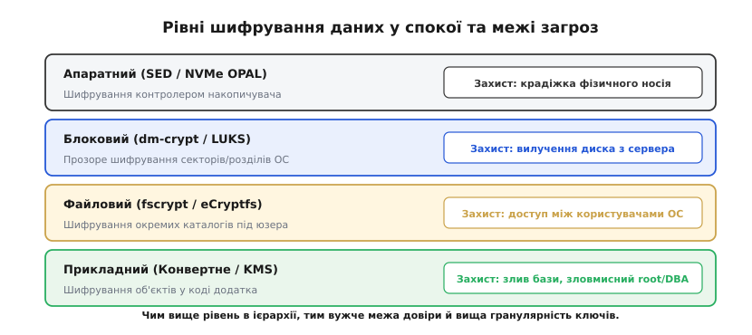
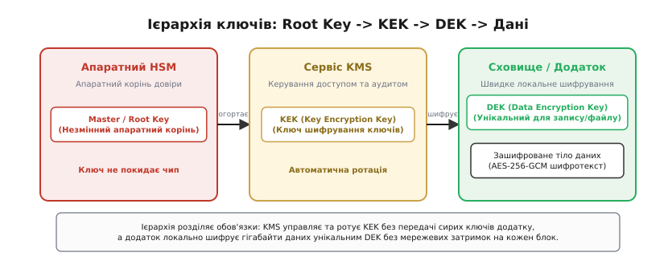
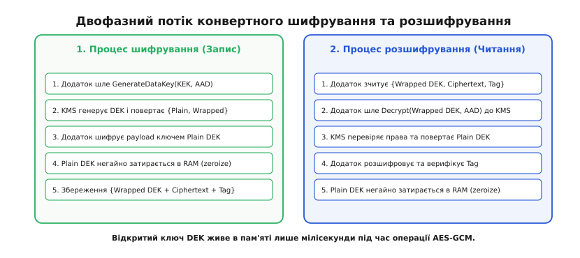
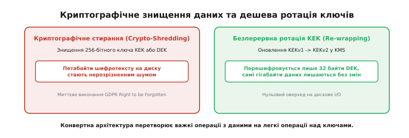

# Шифрування даних у спокої (Encryption at Rest) та ієрархія ключів KMS

<preknowlist>
- [Блоковий шифр](topic:sf-security/block-cipher) — оборотне перетворення блоків фіксованої довжини під ключем; основа AES-GCM.
- [Секрети й ротація](topic:sf-security/secrets-management) — життєвий цикл ключів, оновлення без простою та ризики витоку.
- [Апаратний корінь довіри (TPM / HSM)](topic:sf-security/tpm-root-of-trust) — ізольовані кремнієві сховища, звідки ключі неможливо вилучити зовні.
</preknowlist>

Викрадений серверний накопичувач, забута резервна копія на магнітній стрічці, публічно доступний знімок дискового тому EBS або списаний утилізатором жорсткий диск, проданий на вторинному ринку. Якщо байти на фізичних секторах записані у відкритому вигляді, будь-хто з прямим апаратним або інфраструктурним доступом зчитує таблиці баз даних, приватні листування та конфіденційні облікові записи найпростішою посекторною утилітою `dd`. Мережевий трафік надійно захищається протоколом TLS під час передачі, але щойно байти опускаються на магнітні доріжки чи кремнієві комірки NVMe-флешпам'яті, вони залишаються там на місяці й роки. Захистом від цього класу компрометації є **шифрування даних у спокої** (англ. *encryption at rest*).

Головна інженерна складність шифрування у спокої полягає не у виборі криптографічного алгоритму — симетричний стандарт AES-256 (англ. *Advanced Encryption Standard*) або потоковий шифр ChaCha20 забезпечують абсолютну математичну стійкість. Справжня проблема полягає у **керуванні ключами**: де саме зберігати ключ шифрування, як захистити його від вилучення тим самим зловмисником, який отримав доступ до накопичувача, як забезпечити пропускну здатність у мільйони дискових операцій на секунду та як безпечно оновлювати або знищувати ключі без переписування петабайтних сховищ.

### Модель загроз: межі відповідальності шифрування у спокої

Щоб правильно побудувати архітектуру захисту сховища, необхідно чітко окреслити [модель загроз](topic:sf-security/threat-modeling). Шифрування даних у спокої проектується проти цілком конкретного вектора компрометації: **несанкціонованого доступу до носія в обхід працюючої операційної системи та автентифікованого прикладного стека**.

Цей механізм гарантує безпеку у таких ситуаціях:
1. **Фізичне вилучення носія:** Зловмисник демонтує накопичувач із серверної стійки або викрадає корпоративний ноутбук і підключає диск до власного стенда.
2. **Неналежна утилізація (Decommissioning):** Накопичувачі виводяться з експлуатації після завершення терміну служби в датацентрі та передаються стороннім підрядникам без попереднього розмагнічування або фізичного подрібнення.
3. **Витік знімків стану (Snapshots) та бекапів:** Резервні копії віртуальних машин або блокових пристроїв помилково зберігаються з відкритими правами доступу на об'єктних сховищах або перехоплюються під час архівування.
4. **Зловмисний персонал датацентру:** Інженер хостинг-провайдера отримує прямий доступ до гіпервізора чи полиці SAN (англ. *Storage Area Network*).

Водночас критично важливо розуміти, від чого шифрування у спокої **не захищає**. Воно не створює жодного захисного бар'єра, якщо атака відбувається через легітимний працюючий додаток. Якщо вебсервіс містить вразливість SQL-ін'єкції або скомпрометовано сесійний токен адміністратора, серверний процес вичитує дані через штатний драйвер, операційна система прозоро розшифровує їх у пам'яті, і зловмисник отримує відкритий текст. Так само шифрування дисків безсиле проти атак на оперативну пам'ять (вичитування через `/proc/$PID/mem`, апаратне сканування шини через DMA або атака холодного перезавантаження Cold Boot). Шифрування у спокої захищає дані винятково тоді, коли вони **перебувають у пасивному стані на носії**.

### Чотири рівні впровадження шифрування у стеку

Захист даних у спокої може бути реалізований на різних шарах обчислювальної системи. Місце впровадження визначає [межу довіри](topic:sf-security/trust-boundaries), продуктивність, гранулярність ключів та стійкість до компрометації окремих компонентів операційної системи.


*Чотири рівні шифрування у спокої: від фізичного контролера накопичувача до коду додатку. Чим вище рівень, тим вужча межа довіри й вища гранулярність ключів, але більша відповідальність покладається на логіку програми.*

#### 1. Апаратний рівень: самошифровані накопичувачі (SED)

Самошифрований накопичувач (англ. *Self-Encrypting Drive*, SED за специфікаціями TCG Opal або Enterprise) містить криптографічний співпроцесор безпосередньо всередині контролера SSD або HDD. Контролер генерує внутрішній ключ шифрування носія (англ. *Media Encryption Key*, MEK) і апаратно шифрує кожен сектор під час запису за алгоритмом [AES-XTS](topic:sf-security/aes-xts) на повній швидкості шини PCIe або SATA без участі центрального процесора.

Для авторизації використовується ключ аутентифікації (англ. *Authentication Key*, AK), який передається контролеру під час завантаження BIOS/UEFI. Щойно накопичувач розблоковано, він прозоро віддає відкриті сектори на всі запити хоста. Це забезпечує нульове навантаження на CPU, проте створює широку межу довіри: будь-який шкідливий код, що проник в операційну систему, отримує безперешкодний доступ до всіх даних, доки комп'ютер увімкнено.

#### 2. Блоковий рівень: шифрування розділів ОС (dm-crypt / LUKS)

Шифрування блокових пристроїв функціонує як проміжний шар у ядрі операційної системи (підсистема `dm-crypt` з форматом заголовків `LUKS` у Linux або `BitLocker` у Windows). Драйвер віртуального пристрою перехоплює всі операції вводу-виводу: при записі сектор шифрується перед відправкою на реальний диск, при читанні — розшифровується перед передачею файловій системі.

Блоковий рівень не залежить від виробника диска й захищає всі структури файлової системи (зокрема каталоги, суперблоки та журнальні логи). Проте він оперує єдиним ключем на весь розділ: якщо процес виконується з привілеями адміністратора (`root`), він має повний доступ до вмісту віртуального розшифрованого блокового пристрою.

#### 3. Рівень файлової системи: ізоляція користувачів (fscrypt)

Такі підсистеми, як `fscrypt` (нативно вбудована у файлові системи `ext4`, `f2fs` та `btrfs`) або шифрування датасетів у `ZFS`, здійснюють шифрування на рівні окремих файлів і каталогів. Кожен каталог може шифруватися власним ключем, прив'язаним до пароля або сесії конкретного користувача ОС.

Метадані файлової системи (розподіл дискового простору, розміри файлів, права доступу та часові мітки) залишаються відкритими для драйвера ОС, тоді як вміст файлів та їхні імена шифруються. Це дозволяє безпечно обслуговувати мультикористувацькі сервери: адміністратор бачить структуру каталогів, але не може прочитати файли користувача без його ключа доступу в пам'яті.

#### 4. Прикладний рівень: клієнтське та конвертне шифрування

При шифруванні на рівні додатку дані шифруються безпосередньо у вихідному коді програми перед відправкою у базу даних, на об'єктне сховище (наприклад, AWS S3) чи у чергу повідомлень. Для середовища збереження (СУБД чи сховища) зашифроване поле або файл є просто непрозорим масивом випадкових байтів.

Це найвищий рівень захисту: компрометація операційної системи бази даних, зловживання з боку адміністратора СУБД (DBA) або випадковий витік SQL-дампу не розкривають жодної інформації, оскільки ключі знаходяться винятково у пам'яті бізнес-додатку. Саме тут реалізується концепція [найменших привілеїв](topic:sf-security/least-privilege) та ізоляція окремих орендарів у хмарних архітектурах.

### Парадокс зберігання ключа та обмеження прямого шифрування через KMS

Спроба реалізувати шифрування на рівні додатку одразу стикається з фундаментальним парадоксом: **де зберігати ключ шифрування?**

Якщо зберегти ключ шифрування у тому самому конфігураційному файлі або в тій самій базі даних поруч із зашифрованими полями, безпека анулюється: зловмисник, викравши дамп бази чи диск, забирає і дані, і ключ для їх розшифрування. Якщо ж винести ключ на зовнішній сервер керування ключами — KMS (англ. *Key Management Service*) або апаратний модуль безпеки HSM (англ. *Hardware Security Module*), виникає проблема архітектурного масштабування.

Уявімо високонавантажену систему, яка зберігає мільйони файлів або виконує десятки тисяч операцій запису на секунду. Якщо додаток надсилатиме кожен відкритий файл чи запис бази даних через мережевий RPC-запит до центрального сервісу KMS (`KMS.Encrypt(payload)`):

1. **Вузьке місце пропускної здатності (Throughput Bottleneck):** Апаратні модулі HSM виготовляються у вигляді фізично захищених чипів із датчиками розкриття корпусу та захистом від перепадів напруги (стандарти FIPS 140-2 / 140-3 Level 3). Через складну кремнієву ізоляцію криптопроцесори HSM мають обмежену обчислювальну потужність і здатні виконувати лише від кількох сотень до кількох тисяч криптографічних операцій на секунду.
2. **Мережева затримка (Network Latency):** Кожна операція запису додає щонайменше 5–30 мілісекунд мережевого накладного часу на виклик KMS через TLS.
3. **Обмеження на розмір корисного навантаження:** Інтерфейси KMS забороняють передавати великі обсяги даних: наприклад, метод `Encrypt` в AWS KMS або Google Cloud KMS має жорсткий ліміт на розмір вхідного блоку відкритого тексту — не більше 4 кілобайтів.
4. **Катастрофічний радіус ураження:** Якщо всі гігабайти даних шифруються одним статичним майстер-ключем, витік цього ключа означає повну втрату таємності всієї корпоративної історії даних.

Архітектурною відповіддю, що елегантно вирішує всі ці протиріччя, є **конвертне шифрування** (англ. *envelope encryption*).

### Конвертне шифрування (Envelope Encryption) та ієрархія ключів

Ідея конвертного шифрування нагадує фізичний лист у запечатаному конверті: дані запечатуються швидким одноразовим ключем, а сам цей ключ захищається важким довгостроковим замком. 

У цій схемі вводиться сувора дво- або трирівнева ієрархія ключів:


*Ієрархія ключів: кореневий ключ у захищеному модулі HSM огортає ключ KEK у сервісі KMS, який шифрує одноразові ключі DEK. Корисні дані шифруються локально ключем DEK на максимальній швидкості.*

1. **Ключ шифрування даних — DEK (англ. *Data Encryption Key*):**
   Симетричний 256-бітний ключ (зазвичай для алгоритмів [AES-256-GCM](topic:sf-security/block-cipher) або ChaCha20-Poly1305). DEK генерується динамічно і є **одноразовим або вузькоспецифічним**: кожен окремий об'єкт, файл, рядок таблиці або дисковий том шифрується своїм власним унікальним DEK. Шифрування виконується локально в оперативній пам'яті додатку з використанням векторних інструкцій процесора (Intel AES-NI або ARMv8 Cryptography Extensions) зі швидкістю кілька гігабайтів на секунду.

2. **Ключ шифрування ключів — KEK (англ. *Key Encryption Key* або Master Key):**
   Довгостроковий симетричний або асиметричний ключ, який створюється та зберігається **винятково всередині сервісу KMS / HSM**. KEK **ніколи за жодних умов не покидає захищений периметр апаратного модуля**. Його єдина роль — шифрувати (обгортати, англ. *wrap*) та розшифровувати (розгортати, англ. *unwrap*) короткі 32-байтні ключі DEK.

3. **Кореневий ключ — Root / Master Key:**
   Апаратний корінь довіри, вбудований у кремній HSM або [модуль TPM](topic:sf-security/tpm-root-of-trust), який захищає системні KEK та базу автентифікації сховища.

### Двофазний життєвий цикл конверта: запис та читання

Конвертне шифрування розділяє роботу з даними на дві чіткі послідовності дій.


*Двофазний потік конвертного шифрування: запис запитує одноразовий DEK у KMS, шифрує дані локально й затирає відкритий ключ; читання передає загорнутий DEK до KMS на розпакування.*

#### Фаза 1: Запечатування конверта (Процес запису)

Коли додатку необхідно зберегти новий файл або запис:

1. **Запит до KMS:** Додаток надсилає RPC-запит до KMS з ідентифікатором цільового ключа KEK: `GenerateDataKey(KEK_ID)`.
2. **Генерація пари ключів у KMS:** HSM генерує високоентропійний випадковий 256-бітний ключ DEK. Далі модуль шифрує цей DEK за допомогою KEK. KMS повертає клієнту відповідь, що містить дві копії ключа:
   - `Plaintext DEK` — відкритий ключ у відкритому вигляді (32 байти);
   - `Wrapped DEK (Ciphertext Blob)` — той самий ключ, зашифрований KEK (зазвичай 48–64 байти з метаданими).
3. **Локальне шифрування даних:** Додаток бере `Plaintext DEK` і локально шифрує тіло даних (наприклад, 500 мегабайтів відео чи JSON-документ) за алгоритмом AES-256-GCM, отримуючи шифротекст, вектор ініціалізації `IV` та автентифікаційний тег `Tag`.
4. **Негайне затирання DEK у пам'яті:** Додаток негайно вичищає `Plaintext DEK` з оперативної пам'яті (занулення буфера), унеможливлюючи його витік у майбутньому.
5. **Збереження конверта:** Додаток записує у сховище (диск, базу даних, S3) структуру єдиного пакету:
   `[Загорнутий DEK] + [IV] + [Шифротекст даних] + [Автентифікаційний Tag]`.

Зауважте фундаментальну деталь: **зашифрований ключ DEK зберігається поруч із зашифрованими даними**. Це абсолютно безпечно, оскільки без доступу до KEK усередині KMS розшифрувати `Wrapped DEK` неможливо.

#### Фаза 2: Розпечатування конверта (Процес читання)

Коли авторизований додаток вичитує раніше збережений конверт:

1. **Вичитування зі сховища:** Додаток завантажує з диску пакет із зашифрованими даними та виділяє поле `Wrapped DEK`.
2. **Запит на розгортання до KMS:** Додаток надсилає загорнутий ключ до KMS: `Decrypt(Wrapped_DEK)`.
3. **Авторизація та розгортання в HSM:** KMS перевіряє права доступу клієнта (політики IAM), витягує відповідний KEK у захищену пам'ять HSM, розшифровує `Wrapped DEK` і повертає відкритий `Plaintext DEK` клієнту через захищений канал TLS.
4. **Локальне розшифрування:** Додаток отримує `Plaintext DEK`, локально розшифровує шифротекст корисного навантаження та перевіряє автентифікаційний тег `Tag`.
5. **Зачищення пам'яті:** Щойно відкритий текст отримано, `Plaintext DEK` знову негайно стирається з пам'яті.

Детальні структури запитів, формати заголовків та коди відповідей зафіксовані у вставці [Контракт викликів KMS](topic:sf-security/encryption-at-rest/api-kms-envelope.md). Практичну програмну реалізацію конвертного пакування та розпакування наведено у вставці [Реалізація конвертного шифратора](topic:sf-security/encryption-at-rest/proj-envelope-crypto.md).

### Контекст шифрування (AAD) та запобігання підміні шифротекстів

Одного лише шифрування корисних даних та ключів недостатньо для побудови захищеної системи: необхідно гарантувати, що зашифрований конверт не буде підмінено або використано в не призначеному для нього місці. 

Уявімо атаку на багатокористувацьку базу даних: зловмисник із правами на зміну записів копіює зашифроване поле зарплати директора `user_id = 1` і вставляє його в поле власної зарплати `user_id = 99`. Коли додаток вичитує запис зловмисника, він відправляє `Wrapped DEK` до KMS. KMS бачить валідний конверт, успішно розшифровує DEK, і додаток розшифровує суму директора в профілі зловмисника. Це класична атака класу «заплутаний заступник» ([confused deputy](topic:sf-security/confused-deputy)) або атака підміни шифротексту (англ. *ciphertext transplantation*).

Щоб унеможливити подібні маніпуляції, сучасні автентифіковані шифри (AEAD, зокрема AES-GCM) та сервіси KMS використовують **додаткові автентифіковані дані — AAD (англ. *Additional Authenticated Data*)**, які в термінології KMS називаються **контекстом шифрування (англ. *Encryption Context*)**.

Контекст шифрування — це набір відкритих пар «ключ-значення», що описують семантичну прив'язку даних:
```json
{
  "tenant_id": "org_4812",
  "table": "user_salaries",
  "record_id": "usr_99",
  "created_at": "2026-08-20"
}
```

AAD **не шифрується**, проте криптографічно підмішується у розрахунок автентифікаційного тегу як під час обгортання DEK у KMS, так і під час локального шифрування тіла даних за алгоритмом GCM. Якщо зловмисник перенесе конверт у запис з іншим `record_id` або спробує розшифрувати дані іншого орендаря `tenant_id`, контекст розшифрування не співпаде з контекстом запису: KMS поверне помилку `InvalidCiphertextException`, а локальний AES-GCM дешифратор відхилить пакет через невідповідність тегу `Tag`.

> 🔧 **Навіщо це.** Контекст автентифікації AAD перетворює зашифрований блок із безликого масиву байтів на суворо прив'язаний до свого місця документ. Без перевірки AAD база даних вразлива до перестановки полів, навіть якщо криптографія шифру ідеальна.

### Ротація ключів та криптографічне стирання (Crypto-Shredding)

Конвертна архітектура докорінно змінює дві найскладніші операції в життєвому циклі даних: [ротацію ключів](topic:sf-security/secrets-management) та гарантоване знищення інформації.


*Криптографічне стирання та безперервна ротація: знищення 256 бітів ключа миттєво робить весь масив шифротексту нерозрізненним шумом, а ротація KEK потребує перешифрування лише 32 байтів DEK замість петабайтів даних.*

#### Дешева ротація ключів (Re-wrapping)

Регуляторні стандарти (PCI DSS, HIPAA) вимагають регулярної зміни ключів шифрування (наприклад, кожні 12 місяців). Якщо сховище містить 50 терабайтів даних, перешифрування кожного байта новим ключем вимагає вичитування 50 ТБ, розшифрування, повторного шифрування та запису назад. Це створює колосальне навантаження на дискову підсистему, ризик збоїв під час міграції та години деградації продуктивності.

У конвертній схемі самі 50 терабайтів даних **не чіпають узагалі**. Коли KMS створює нову версію KEK (`KEK_v2`), додаток викликає легковагову операцію `ReEncrypt(Wrapped_DEK, KEK_v2)`. Сервіс KMS розгортає 32 байти DEK старим ключем `KEK_v1` і негайно загортає їх новим `KEK_v2`. Самі гігабайти корисних даних залишаються зашифрованими незмінним ключем DEK. Ротація петабайтного сховища зводиться до оновлення крихітних 48-байтних заголовків метаданих.

#### Миттєве криптографічне стирання (Crypto-Shredding)

Коли клієнт вимагає видалити обліковий запис відповідно до вимог GDPR («право бути забутим») або коли дисковий масив виводиться з експлуатації, фізичний багаторазовий перезапис носіїв нулями на SSD-накопичувачах не працює через внутрішні алгоритми вирівнювання зносу (Wear Leveling).

Криптографічне стирання (англ. *crypto-shredding*) розв'язує цю задачу: замість переписування гігабайтів інформації система знищує **ключ шифрування**. Достатньо видалити 256-бітний DEK або анулювати специфічний KEK у KMS — і всі зашифровані гігабайти даних, де б вони не знаходилися (на дисках, у репліках, на резервних копіях в іншому регіоні чи на магнітних стрічках в архіві), миттєво й незворотно перетворюються на математично нерозрізненний випадковий шум.

Історичну трансформацію методів очищення накопичувачів та відмову від фізичного розмагнічування детально розкрито у вставці [Історія виникнення криптографічного стирання](topic:sf-security/encryption-at-rest/hist-crypto-shredding.md).

### Математичні ліміти та безпека режимів шифрування

Використання симетричних автентифікованих шифрів вимагає суворого дотримання математичних обмежень на кількість повідомлень, зашифрованих одним ключем.

У режимі AES-GCM довжина вектора ініціалізації становить 96 бітів. Якщо система використовує один фіксований ключ і генерує випадкові вектори `IV`, відповідно до парадоксу днів народження ймовірність повторення хоча б одного `IV` сягає критичного порогу стандарту NIST SP 800-38D вже після `2¹⁹` (приблизно 524 тисяч) операцій шифрування. Повтор пари «ключ + IV» у режимі лічильника призводить до негайного розкриття відкритого тексту та компрометації автентичності.

Конвертне шифрування усуває цю межу: оскільки кожен об'єкт отримує свій **власний унікальний ключ DEK**, під кожним ключем виконується рівно одне шифрування (`q = 1`). Ризик колізії векторів ініціалізації зводиться до абсолютного нуля, що дозволяє безпечно масштабувати сховище до будь-якої кількості мільярдів об'єктів.

Повний математичний вивід імовірностей колізій, меж стандарту NIST та оцінку переваги зловмисника наведено у вставці [Математичні межі стійкості AES-GCM у конвертах](topic:sf-security/encryption-at-rest/math-envelope-limits.md).

### Порівняння криптографічних режимів: XTS на блоковому рівні проти AEAD/GCM у додатку

Фундаментальна різниця між блоковим шифруванням диска (dm-crypt, LUKS, BitLocker) та конвертним шифруванням у додатку проявляється у виборі режиму роботи блокового шифру та форматі даних на носії.

На блоковому рівні розмір сектора диска є жорстко фіксованим (традиційно 512 байтів або 4096 байтів у стандартах Advanced Format). Драйвер файлової системи очікує, що запис сектора розміром 4 КБ займе рівно 4 КБ на фізичному носії: **розширення розміру даних неприпустиме** (англ. *zero length expansion*). Через це на блоковому рівні неможливо зберегти 16-байтний автентифікаційний тег або окремий вектор ініціалізації для кожного блоку.

Стандартом для блокових пристроїв є режим **[AES-XTS](topic:sf-security/aes-xts)** (IEEE 1619). Режим XTS використовує два незалежні 256-бітні ключі та адресу логічного сектора (LBA) як твік (англ. *tweak*). XTS забезпечує високу швидкість та унеможливлює знаходження однакових секторів у різних місцях диска. Проте XTS **не забезпечує автентичності та цілісності даних**: якщо зловмисник маніпулює зашифрованими секторами на диску (наприклад, інвертує байти), під час читання XTS розшифрує пошкоджений сектор у псевдовипадкове сміття без жодного криптографічного попередження.

На противагу цьому, на рівні додатку та в конвертній моделі жорсткого обмеження на розмір сектора немає. Додаток може дозволити мінімальне розширення пакету на 28 байтів (12 байтів IV + 16 байтів автентифікаційного тегу `Tag`). Це дозволяє використовувати повноцінне **автентифіковане шифрування з прив'язаними даними (AEAD)** у режимі **AES-256-GCM** або **ChaCha20-Poly1305**. Режим AEAD одночасно гарантує таємність і цілісність: будь-яка спроба модифікації шифротексту чи контексту AAD миттєво відхиляється на етапі перевірки автентифікаційного тегу ще до передачі розшифрованих байтів у бізнес-логіку.

```
Порівняння режимів шифрування у спокої:
┌──────────────────────────────┬────────────────────────┬─────────────────────────┐
│ Властивість                  │ Блоковий AES-XTS (Диск)│ Прикладний AES-GCM (KMS)│
├──────────────────────────────┼────────────────────────┼─────────────────────────┤
│ Розширення розміру (Overhead)│ Строго 0 байтів        │ 28–44 байти (IV + Tag)  │
│ Автентифікація та цілісність │ Відсутня               │ Повна (128-бітний тег)  │
│ Прив'язка контексту (AAD)    │ Тільки номер сектора   │ Довільний словник полів │
│ Гранулярність ключів         │ Один ключ на весь том  │ Унікальний DEK на об'єкт│
│ Захист від зловмисного root  │ Немає                  │ Повний                  │
└──────────────────────────────┴────────────────────────┴─────────────────────────┘
```

### Рівні сертифікації апаратних модулів KMS (FIPS 140-2 / FIPS 140-3)

Надійність усієї піраміди конвертного шифрування спирається на непорушність кореневих ключів KEK усередині сервісу KMS. Щоб гарантувати, що ключ KEK неможливо витягти навіть за умови фізичного доступу зловмисника до серверів датацентру, хмарні провайдери та корпоративні сховища використовують спеціалізовані модулі безпеки HSM, сертифіковані за стандартом **FIPS 140-2 / FIPS 140-3** (англ. *Federal Information Processing Standards*).

Стандарт визначає чотири рівні захисту:

1. **Level 1 (Базовий програмний захист):** Використовує стандартні протестовані криптографічні алгоритми у загальному програмному середовищі операційної системи без обов'язкових апаратних механізмів захисту.
2. **Level 2 (Фізичний контроль доступу):** Вимагає наявності захисних оболонок та пломб контролю розкриття (англ. *tamper-evident seals*), які фіксують факт несанкціонованого фізичного відкриття корпусу сервера або пристрою.
3. **Level 3 (Апаратне реагування на розкриття):** Золотий стандарт для хмарних KMS (зокрема AWS KMS, Google Cloud HSM, Azure Dedicated HSM). Модуль HSM містить активну електронну сітку (tamper-detection envelope), датчики тиску, температури, освітлення та перепаду напруги. При спробі свердління корпусу, охолодження рідким азотом або рентгенівського просвічування модуль миттєво закорочує шини живлення та безповоротно стирає всі ключі KEK з енергозалежної пам'яті (zeroization) за частки мікросекунди.
4. **Level 4 (Повний екологічний захист):** Забезпечує абсолютний захист від будь-яких екстремальних факторів навколишнього середовища, включаючи потужні електромагнітні імпульси та радіаційне опромінення.

### Мультирегіональна реплікація ключів та географічна відмовостійкість

У глобальних розподілених системах резервні копії даних постійно реплікуються між різними датацентрами та континентами для забезпечення високої доступності (Disaster Recovery). Це створює виклик для конвертної моделі: якщо файл зашифровано ключем DEK, загорнутим KEK у регіоні Франкфурт (`eu-central-1`), то у разі повної відмови цього регіону додаток у регіоні Дублін (`eu-west-1`) не зможе розшифрувати `Wrapped DEK`, оскільки KEK існує лише у німецькому HSM.

Для вирішення цієї проблеми провайдери KMS підтримують архітектуру **мультирегіональних ключів (англ. *Multi-Region Keys, MRK*)**:

```
Мультирегіональна ієрархія ключів:
[Первинний KEK: eu-central-1] <── (Захищена синхронізація через TLS+mTLS) ──> [Репліка KEK: eu-west-1]
           │                                                                               │
  [Wrapped DEK: 0x4A81...]                                                       [Wrapped DEK: 0x4A81...]
```

Первинний KEK генерується в одному регіоні, після чого його ключевий матеріал безпечно переноситься в HSM цільового регіону за протоколом експорту/імпорту ключів (Key Wrapping за стандартом PKCS#11). Обидва KEK мають однаковий ключевий матеріал та спільний ідентифікатор, проте керуються незалежними політиками доступу IAM у кожному регіоні. Це дозволяє розгортати `Wrapped DEK` у будь-якому регіоні світу без зниження безпеки конвертної моделі.

### Інженерна практика: пам'ять, кешування та компроміси

Впровадження шифрування даних у спокої у виробничих сервісах вимагає врахування низки критичних системних факторів:

1. **Гарантоване занулення пам'яті (Memory Sanitization):**
   Ключ DEK повинен жити в оперативній пам'яті лише під час виконання поточної операції шифрування. Використання стандартного `memset(key, 0, 32)` є помилкою, оскільки оптимізувальний компілятор викидає такий виклик як мертвий код (Dead-Store Elimination). Необхідно застосовувати захищені функції `OPENSSL_cleanse()` або `explicit_bzero()`, а також блокувати витіснення сторінок пам'яті у swap через системний виклик `mlock()`.

2. **Клієнтське кешування ключів (Data Key Caching):**
   Якщо сервіс обробляє сотні запитів на читання одного й того самого ресурсу за секунду, постійні виклики `KMS.Decrypt` призводять до вичерпання квот KMS (Throttling) та зростання фінансових витрат. Для оптимізації використовують клієнтські кеші відкритих DEK у пам'яті. Такий кеш обов'язково обмежується жорстким часом життя (TTL, наприклад, 60 секунд) та лімітом на кількість повідомлень, щоб мінімізувати час присутності ключа в RAM.

3. **Пошук за зашифрованими полями:**
   Шифрування за алгоритмом AES-GCM є ймовірнісним (рандомізованим через випадковий IV): однаковий текст, зашифрований двічі, дає два абсолютно різні шифротексти. Це унеможливлює виконання стандартних SQL-запитів `WHERE email = '...'` або побудову B-дерев індексів. Для вирішення цієї проблеми застосовують сліпе індексування (англ. *blind indexing*): поруч із шифротекстом зберігається детермінований HMAC-відбиток поля, обчислений на окремому секретному ключі пошуку.

4. **Аудит та моніторинг аномалій розшифрування:**
   Оскільки кожна операція розгортання конверта вимагає звернення до KMS або запису в аудит-лог, система безпеки отримує можливість виявляти атаки масового викрадення даних (Data Exfiltration). Раптовий сплеск викликів `KMS.Decrypt` від сервісу, який зазвичай читає кілька десятків записів на годину, автоматично викликає блокування облікових даних та сповіщення чергової команди безпеки.

---

Конвертна архітектура шифрування даних у спокої перетворює нерозв'язну проблему захисту гігабайтних розподілених баз даних і неструктурованих файлових сховищ на компактну й керовану задачу контролю доступу до апаратного кореня ключів у сервісі KMS. Розподіл обов'язків між швидкими локальними ключами DEK та захищеними апаратними ключами KEK гарантує безкомпромісну швидкість дискового вводу-виводу, математичну надійність криптографічного захисту, прозору ротацію та миттєве криптографічне стирання інформації за першою вимогою.
