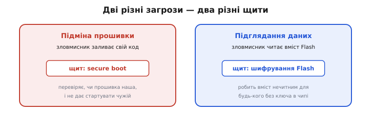
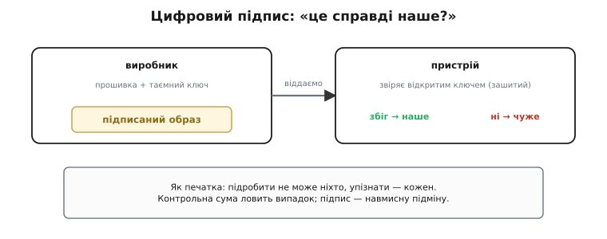
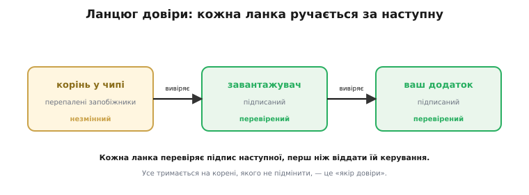
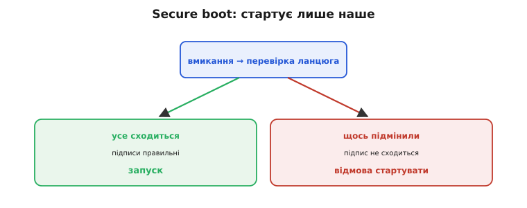
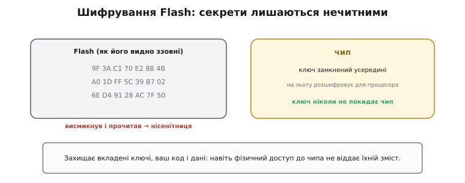
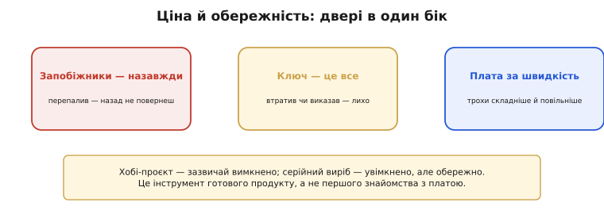

# Secure boot і шифрування Flash: захист прошивки й даних

Зберігати дані в постійній пам'яті доводиться, оберігаючи їх від **випадку**: від зносу, від обірваного живлення, від недописаного запису. Та є й інша загроза, геть іншої природи — **зловмисник**. Людина, що навмисно хоче або **підмінити** нашу прошивку своєю (щоб пристрій робив, що їй заманеться), або **вичитати** з Flash наші секрети — ключі, паролі, цінний код. Випадок не має наміру; зловмисник має. І від нього потрібні інші щити. ESP32 несе два таких: **secure boot** — проти підміни прошивки, і **шифрування Flash** — проти читання секретів. Розгляньмо обидва якісно, без занурення в математику, щоб уловити саму ідею.

Перш ніж почати, одне зауваження, щоб не лякатися слова «безпека». Усе, що тут буде, — це **прості, людські ідеї**, одягнені в технічні назви: «впізнати своє за печаткою», «тримати таємницю в замкненій скриньці», «не довіряти, доки не перевірив». Математика, що робить ці ідеї непробивними, лишається під капотом. Нам же зараз важливо вхопити **зміст**: що від чого боронить і чому працює.

### Дві різні загрози — два різні щити

Найперше треба чітко **розрізнити** дві загрози, бо їх легко сплутати, а щити від них зовсім різні.

Перша загроза — **підміна**. Зловмисник хоче, щоб пристрій виконував **його** код: перепрошив термостат, щоб той відмикав двері, або щоб камера слала картинку йому. Щит від цього — **secure boot** (англ. *secure* — «захищений», *boot* — «завантаження», тобто «захищене завантаження»): він стежить, щоб пристрій запускав **лише прошивку, яка справді наша**, і відмовлявся стартувати з чужої.

Друга загроза — **підглядання**. Зловмисник не хоче нічого міняти — він хоче **прочитати** вміст Flash: вивудити вкладений ключ шифрування, пароль від хмари, секрет вашого алгоритму. Щит від цього — **шифрування Flash**: воно робить вміст чипа **нечитним** для будь-кого, хто не має ключа, замкненого всередині.


*Дві різні загрози: підміна прошивки (зловмисник заливає свій код) і підглядання (читає вміст Flash). Два різні щити: secure boot перевіряє, чи прошивка наша; шифрування Flash робить вміст нечитним. Один про справжність, другий — про таємність.*

Затямте цю різницю раз і назавжди: secure boot — про **справжність** (чи це наше?), шифрування — про **таємність** (чи зможуть прочитати?). Один не замінює іншого: можна підписати прошивку, та лишити її відкритою для читання, або зашифрувати, та не перевіряти підпис. Серйозний захист вмикає **обидва**.

Щоб це не лишалось абстракцією, ось два побутові приклади. Підміна: хтось дістав ваш розумний замок, залив у нього свою прошивку — і тепер замок відмикається з його телефона; secure boot не дав би тій прошивці навіть стартувати. Підглядання: ви викинули стару Wi-Fi-розетку, а хтось підібрав її, висмикнув Flash і вичитав звідти пароль вашої домашньої мережі, що там зберігався; шифрування Flash лишило б йому в руках саму нісенітницю. Різні біди — різні щити, і кожен закриває те, проти чого інший безсилий.

### Підпис: «це справді наше?»

Серце secure boot — **цифровий підпис**. Ідея спирається на хитру, та доступну річ: пару ключів, що працюють у парі, — **таємний** і **відкритий**.

Виробник, складаючи прошивку, **підписує** її своїм **таємним** ключем, який тримає в найбільшому секреті й нікому не віддає. Підпис — це особлива позначка, яку можна поставити **лише** цим таємним ключем. А в сам пристрій назавжди зашивають **відкритий** ключ — пару до таємного. Цим відкритим ключем пристрій **перевіряє** підпис: збігся — образ справді від виробника; не збігся — чужий або підроблений, геть його.


*Виробник підписує прошивку таємним ключем (його має лише він); пристрій звіряє підпис відкритим ключем, зашитим у нього. Як печатка: підробити не може ніхто, упізнати — кожен. Контрольна сума ловить випадкове псування, підпис — навмисну підміну.*

Найкраща аналогія — **печатка**. Колись король скріплював листи відбитком персня, якого мав лише він: підробити такий відбиток ніхто не міг, а **впізнати** — кожен, хто бачив справжній. Таємний ключ — це той перстень (лише у виробника), відкритий — знання, як виглядає справжня печатка (зашите в пристрої). Тут варто розрізнити підпис і звичайну [контрольну суму](topic:sf-data/write-integrity): сума ловить **випадкове** псування, але зловмисник легко перерахував би її під свою підробку. Підпис інакший: його **не підробити** без таємного ключа. Сума боронить від випадку, підпис — від злого наміру.

Чому ж відкритий ключ дозволяє **перевірити** підпис, але не дозволяє його **підробити**? У цьому й уся магія пари ключів: дії таємного й відкритого несиметричні. Таємним ключем підпис **ставлять**, відкритим — лише **звіряють**; а знаючи відкритий, обчислити таємний практично неможливо (на цьому стоїть ціла галузь математики). Тому відкритий ключ можна сміливо роздавати хоч усьому світу — вкласти в кожен пристрій, надрукувати в книжці, — і це анітрохи не наблизить нікого до підробки підпису. Секрет один-єдиний, і він лишається у виробника.

### Ланцюг довіри

Та виникає підступне питання: пристрій перевіряє прошивку — а хто перевіряє **самого перевіряльника**? Що, як зловмисник підмінить ту частину, яка робить перевірку? Відповідь — **ланцюг довіри** (*chain of trust*), і це одна з найкрасивіших ідей у безпеці.

Влаштовано його як естафету довіри. На самому дні є **корінь довіри** (англ. *root of trust* — «корінь довіри»): щось у чипі, чого **неможливо змінити**, — відкритий ключ (чи його відбиток), назавжди «перепалений» у крихітних одноразових запобіжниках (англ. *fuses* — «запобіжники») усередині кристала. Цей корінь незмінний — це **якір**, до якого прив'язана вся довіра. Корінь вивіряє підпис [**завантажувача**](topic:hw-arch/bootloader): лише справжній завантажувач піде в роботу. Перевірений завантажувач вивіряє підпис **вашого додатка**. І так ланка за ланкою: кожна, **перш ніж** передати керування наступній, переконується, що та — справжня, підписана.


*Ланцюг довіри: незмінний корінь у чипі (перепалені запобіжники) вивіряє підпис завантажувача, той — підпис вашого додатка. Кожна ланка перевіряє наступну, перш ніж віддати їй керування. Усе тримається на корені, якого не підмінити, — «якорі довіри».*

Виходить нерозривний ланцюг від незмінного кореня до вашого коду. Підмінити середину не вийде: щойно одна ланка не пройде перевірку в попередньої, естафета обірветься. Уся міцність тримається на тому, що **найперша** ланка — корінь — лежить там, куди зловмисникові не дотягтися: у перепалених запобіжниках, яких не переписати. Прибери незмінний корінь — і весь ланцюг повисне в повітрі; саме тому його й «випікають» у кремнії раз і назавжди.

Дві тонкощі роблять ланцюг по-справжньому міцним. Перша: кожна ланка перевіряє наступну **до того**, як віддати їй керування, — бо віддати спершу, а перевірити потім було б пізно: зловмисний код, уже отримавши владу, просто збрехав би про себе. Друга: найперший перевіряльник — не сам завантажувач (його ж теж перевіряють!), а крихітна, **незмінна** програмка, «випечена» в чипі ще на заводі, у недоторканній пам'яті ROM. Вона стартує першою й саме вона звіряє підпис завантажувача коренем. Від цього непорушного зерна й розгортається вся довіра — знизу вгору, ланка за ланкою.

Образ для цього такий: уявіть низку вартових, що передають із рук у руки запечатаний лист. Кожен, перш ніж віддати лист наступному, перевіряє на ньому печатку — і лише впевнившись, що вона справжня, передає далі. Найперший вартовий стоїть біля незмінних, замурованих воріт (це наш корінь у запобіжниках), і саме від нього починається довіра. Підмінити будь-кого в низці марно: наступний одразу побачить чужу печатку й не візьме листа. Так довіра тече від замурованих воріт аж до вашого коду, ніде не розриваючись.

Як ця естафета виглядає в коді — видно з форми, до якої зводиться кожна ланка. ROM звіряє завантажувач, завантажувач тим самим рухом звіряє додаток: **спершу перевірити підпис коренем, і лише при збігу — стрибнути на наступну ланку**.

> 🔧 **Перевірити, тоді стрибати.** Кожна ланка ланцюга — це той самий код: добути образ, звірити його підпис відкритим ключем кореня, і **тільки** при збігу віддати йому керування. Один порядок дій тримає всю безпеку.

**Умова: ROM перевіряє підпис завантажувача коренем; той самий код потім веде завантажувач до додатка.** Корінь — відбиток відкритого ключа в запобіжниках; перехід — лише після збігу.

```c
// Одна ланка ланцюга довіри: перевірити наступний образ — і лише тоді стрибнути.
// root_key_digest — відбиток відкритого ключа, «перепалений» у запобіжниках (незмінний).

typedef void (*entry_fn)(void);   // точка входу наступної ланки

bool verify_image(const image_t *img, const uint8_t root_key_digest[32]) {
    // 1. відкритий ключ лежить у блоці підпису образу — та довіряти йому ще зарано:
    //    звіряємо його відбиток із тим, що «перепалений» у запобіжниках.
    uint8_t key_digest[32];
    sha256(img->pubkey, img->pubkey_len, key_digest);
    if (memcmp(key_digest, root_key_digest, 32) != 0)
        return false;             // ключ не той, що в запобіжниках → образ чужий

    // 2. ключу можна вірити — тепер ним звіряємо підпис над тілом образу
    uint8_t body_digest[32];
    sha256(img->body, img->body_len, body_digest);
    return rsa_pss_verify(img->pubkey, img->signature, body_digest);  // збіг → справжній
}

void boot_next(const image_t *img, const uint8_t root_key_digest[32]) {
    if (!verify_image(img, root_key_digest)) {
        halt();                   // підпис не той → НЕ стартуємо, ланцюг обірвано
    }
    entry_fn next = (entry_fn) img->entry;
    next();                       // перевірено → лише тепер віддаємо керування
}
```

Ланцюг розгортається тим самим рухом: ROM кличе `boot_next(&bootloader, root)` — і керування перейде до завантажувача, лише якщо його підпис збігся з коренем; уже він кличе `boot_next(&app, root)` для додатка. Жодна ланка не отримує владу, **доки** попередня не звірила її підпис; перша ж розбіжність зупиняє все на `halt()`. Один порядок дій — перевірити, тоді стрибати — і повторений на кожній ланці, він тримає весь ланцюг.

### Secure boot: стартує лише наше

**Secure boot** — це і є робота всього ланцюга при **кожному** вмиканні. Щойно подали живлення, чип не кидається сліпо виконувати те, що лежить у Flash, а спершу **проходить ланцюг** і звіряє підписи згори донизу. Усе сходиться — пристрій стартує. Хоч щось не на місці — підпис не той, образ підмінено — чип **відмовляється запускатися**.


*При кожному вмиканні чип проходить ланцюг і звіряє підписи. Усе сходиться — запуск. Щось підмінили, підпис не той — відмова стартувати. Тому навіть перезаписавши Flash своїм кодом, зловмисник не змусить його виконатися: без правильного підпису він мертвий.*

Ось чому secure boot такий потужний: навіть якщо зловмисник якось **перезапише** Flash своєю прошивкою, вона **не має правильного підпису** — і чип просто не дасть їй стартувати. Здобути фізичний доступ і залити свій код уже **недостатньо**; без таємного ключа виробника чужа прошивка лишається мертвою. Підміна знешкоджена.

Звідси випливає й тиха вимога до [оновлень по повітрю](topic:sf-devices/ota-slots): **кожен** новий OTA-образ теж мусить бути підписаний — інакше secure boot чесно відмовиться його запускати, прийнявши за чужий. Тобто два механізми складаються в один лад: подвійний слот дбає, щоб оновлення не лишило цеглини, а secure boot — щоб під виглядом оновлення не проскочила ворожа прошивка. Зловмисник не обдурить пристрій, підсунувши «оновлення» зі своїм кодом: без правильного підпису воно не пройде ту саму перевірку при старті, що й первісна прошивка.

### Шифрування Flash: секрети лишаються нечитними

Другий щит закриває другу загрозу — **підглядання**. **Шифрування** (від *шифр* — таємний запис; англ. *cipher* походить від арабського *ṣifr*, «нуль, порожнеча») Flash означає, що вміст чипа зберігається не відкрито, а **переплутаним** особливим ключем. Висмикнув зловмисник чип, зчитав його байти — і дістав **нісенітницю**, безладну купу, з якої нічого не виловиш.


*Вміст Flash зберігається переплутаним; ключ розшифрування замкнений усередині чипа й назовні не виходить. Висмикнув чип, зчитав байти — дістав нісенітницю. Чип сам на льоту розшифровує дані для процесора, та ключ нікому не віддає.*

Уся хитрість у тому, **де** живе ключ розшифрування: він **замкнений усередині чипа** й ніколи не виходить назовні. Чип сам, на льоту, розшифровує дані для процесора, коли той їх читає, — але назовні віддати ключ не може. Тому навіть фізичний доступ до Flash не зраджує таємниць: без ключа, схованого в кремнії, дамп — це сміття. Так бережуть і вкладені ключі, і паролі, і ваш цінний код, і особисті дані користувача: усе, що не має потрапити в чужі руки, навіть якщо пристрій украдено.

Варто чесно окреслити, від чого шифрування Flash **не** боронить. Воно береже дані **в спокої** — поки вони лежать у мікросхемі. Якщо ж пристрій працює й сам має право користуватися своїм секретом (скажімо, ходить із ним у мережу), то, хитро **обдуривши живий пристрій**, зловмисник інколи може змусити його зробити щось від свого імені — і тут шифрування на диску вже не зарадить, це інша лінія оборони. Тож пам'ятайте межу: шифрування Flash закриває «висмикнув і прочитав», а не «обманув робочий пристрій».

### Ціна й обережність

Така сила вимагає поваги, бо ці щити — **двері в один бік**. Запобіжники, якими «випікають» корінь і вмикають захист, — **одноразові**: перепалив — назад не повернеш, чип уже не стане «звичайним». Ключ стає **найціннішим** у всій системі: загубив його — можеш утратити змогу оновлювати пристрій; виказав — упав увесь захист. А ще за все це платять трохи **швидкістю** й **складністю**.


*Захист — двері в один бік: запобіжники одноразові (назад не повернути), ключ стає найціннішим (втратив — лихо), є плата за швидкість і складність. Тому хобі-проєкт зазвичай лишає це вимкненим, а серійний виріб вмикає — обережно.*

Тому практичне правило таке: для **хобі-проєкту**, де ви блимаєте світлодіодом на столі, ці щити зазвичай **вимкнені** — вони лише заважали б. А от **серійний виріб**, що піде в люди й нестиме чужі секрети, їх **вмикає** — але обережно, із належним поводженням із ключами. Це інструмент зрілого продукту, а не першого знайомства з платою; знати про нього варто змолоду, а вмикати — коли справді розумієш, навіщо й якою ціною.

Найважче в усьому цьому — не ввімкнути захист, а **берегти ключ**. Таємний ключ підпису — серце всієї безпеки: уся міцність ланцюга важить рівно стільки, скільки важить його таємність. Виробники тримають такі ключі в особливих захищених сховищах, не дають їм потрапити у звичайні файли чи репозиторії, обмежують, хто має доступ. Бо вкрадений ключ підпису означає, що зловмисник зможе підписати свою прошивку «від вашого імені» — і всі ваші пристрої радо її приймуть. Захист надійний рівно настільки, наскільки надійно схований ключ, — і ні на крихту більше.

> 🧮 **Трохи математики.** Як саме підпис «не підробити», що таке хеш і чому пара ключів працює, — якісно, без формул-страшилок — у вставці [Хеш і цифровий підпис](topic:sf-security/hash-and-digital-signature).

> 🔧 **Навіщо це.** Підключений пристрій — це не лише зручність, а й **мішень**: розумний замок, камера, лічильник. Secure boot не дає зробити з нього знаряддя проти вас, шифрування — не дає вкрасти те, що в ньому сховано. Навіть якщо ви ще не вмикаєте їх у своїх перших проєктах, розуміти, **від чого** вони бороняться, треба вже зараз: безпека, прибудована потім, майже завжди гірша за продуману змалку.

Найсильніші ж обидва щити **разом**, бо закривають проломи один одного. Сама лише перевірка підпису без шифрування лишає секрети відкритими для читання; саме лише шифрування без підпису не завадить запустити чужий код. Увімкнені вкупі, вони дають те, що інженери звуть «обороною вглиб»: щоб зламати пристрій, ворогові довелося б подолати **обидва** незалежні рубежі, а не один. Саме тому в серйозному виробі їх ставлять у парі, а не вибирають котрийсь один.

Звідси й головний урок про захист прошивки й даних: постійна пам'ять — це не просто «місце, куди кладуть байти», а ціла дисципліна дбайливого, надійного й **захищеного** поводження з ними. Secure boot відповідає за справжність того, що виконується, шифрування Flash — за таємність того, що зберігається, а корінь довіри в перепалених запобіжниках тримає все це на незмінній основі. Де б не лежали дані, їх треба берегти від зносу, від збою живлення — і від чужих рук.
