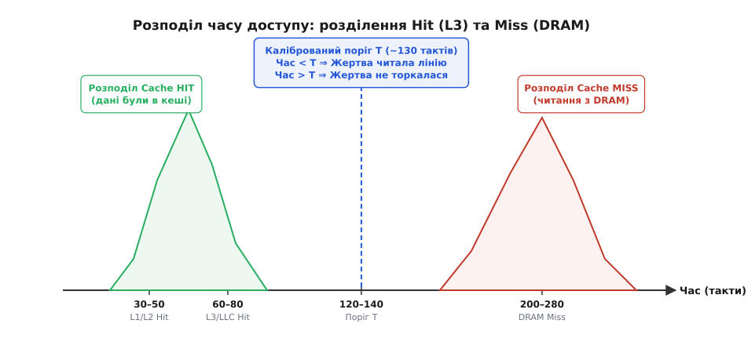
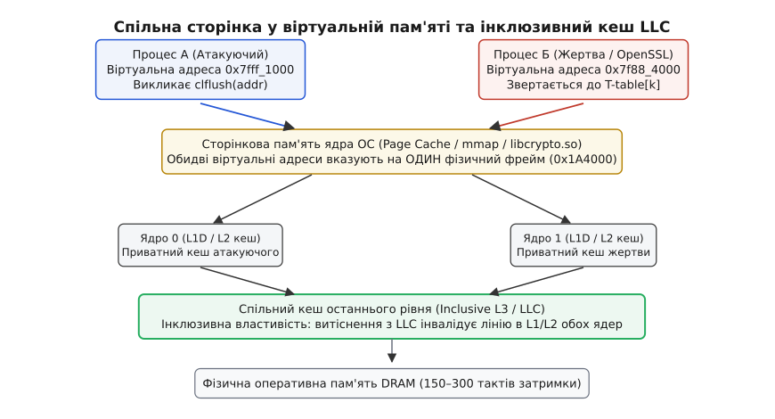
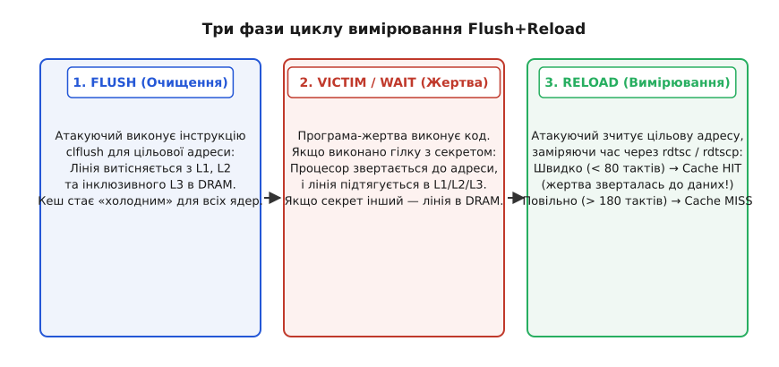
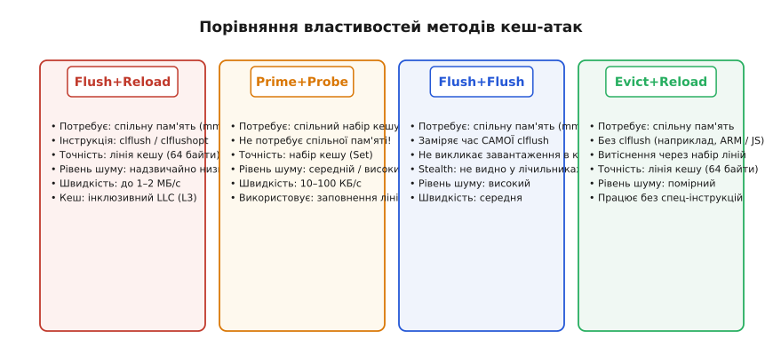

# Сайд-канал атаки Flush+Reload

<preknowlist>
- [Кеш-пам'ять](topic:hw-arch/cache) — ієрархія кешів L1/L2/L3, розмір кеш-лінії (64 байти) та різниця в затримках доступу (L1 hit проти DRAM miss).
- [Віртуальна пам'ять](topic:hw-arch/virtual-memory) — трансляція віртуальних адрес у фізичні, сторінковий кеш ОС та спільне використання пам'яті (mmap / shared libraries).
- [Бар'єри пам'яті](topic:hw-arch/memory-barrier-instructions) — упорядкування інструкцій та запобігання позачерговій перестановці операцій читання/запису.
- [Когерентність кешів](topic:hw-arch/cache-coherence) — механізми синхронізації стану кеш-ліній між різними процесорними ядрами (протокол MESI).
</preknowlist>

Сучасна операційна система гарантує кожному процесу цілковиту ізоляцію: процес `A` не може прочитати жодного байта з адресного простору процесу `B`. Апаратний блок керування пам'яттю (MMU) перевіряє права доступу на кожному зверненні, і будь-яка спроба зазирнути в чужу пам'ять негайно викликає апаратне виключення захисту сторінки. Проте заради економії гігабайтів фізичної оперативної пам'яті ядро системи постійно об'єднує однакові сторінки коду різних процесів: спільні системні бібліотеки (наприклад, `libc.so` чи `libcrypto.so`) відображаються у віртуальні адресні простори десятків програм через **один і той самий фізичний фрейм RAM**.

Ця оптимізація створює приховану апаратну шпарину. Хоча процес `A` не має права змінювати або підглядати приватні змінні процесу `B`, обидва процеси неминуче ділять між собою фізичні транзистори кеш-пам'яті процесора. Якщо зловмисник може примусово видалити спільний фрагмент коду з кешу, а згодом виміряти, як швидко цей фрагмент знову зчитується, він дізнається, до яких саме функцій або таблиць зверталася програма-жертва.

Такий метод отримав назву **Flush+Reload** (англ. *flush* — «змити, очистити», *reload* — «перезавантажити, прочитати знову»). Він перетворює різницю у швидкості роботи кремнієвих комірок на прецизійний побічний канал (англ. *side-channel*, сайд-канал), здатний відновлювати ключі шифрування, стежити за натисканням клавіш та передавати дані в обхід будь-яких програмних пісочниць.

```
Процес-атакуючий                    Спільна пам'ять                    Процес-жертва
(не має прав доступу)               (libc.so / mmap)               (володіє секретом)
        │                                  │                               │
        │── 1. clflush(addr) ─────────────>│                               │
        │   (викидає лінію з кешу)         │                               │
        │                                  │<── 2. Виконує функцію(addr) ──│
        │                                  │   (підтягує лінію назад)      │
        │── 3. rdtsc + read(addr) ────────>│                               │
        │   (час < 80 тактів ⇒ HIT!)       │                               │
        ▼                                  ▼                               ▼
```

### Фізичний фундамент: ієрархія пам'яті та часовий розрив

Щоб зрозуміти дієвість сайд-каналу, необхідно розглянути фізичні часові затримки, з якими процесор зчитує дані з різних рівнів пам'яті. Сучасний кристал процесора містить кілька шарів кремнієвої кеш-пам'яті:

* **Кеш першого рівня (L1D / L1I):** найшвидша статична пам'ять (SRAM), розташована впритул до виконавчих конвеєрів ядра. Затримка доступу становить лише `4–5` процесорних тактів (`~1–1.5 нс`).
* **Кеш другого рівня (L2):** проміжний кеш ядра. Затримка становить `12–14` тактів (`~3–4 нс`).
* **Кеш останнього рівня (L3 / LLC, Last Level Cache):** спільний для всіх ядер великий масив пам'яті (від 16 до 64 МБ). Затримка становить `35–60` тактів (`~10–18 нс`).
* **Оперативна пам'ять (DRAM):** зовнішні мікросхеми динамічної пам'яті, підключені через системну шину на материнській платі. Затримка зчитування досягає `150–300` тактів (`~50–100 нс`).

Різниця в затримці між знаходженням лінії в кеші процесора (подія **Cache Hit**) та зверненням до оперативної пам'яті (подія **Cache Miss**) становить **понад 200 процесорних тактів** — майже два порядки величини.

```
Рівень пам'яті                 Затримка (такти ядра)
─────────────────────────────────────────────────────────────────
L1 Data Cache (L1D)           [ 4–5 ]
L2 Cache                      [ 12–14 ]
L3 / Last Level Cache (LLC)   [ 35–60 ]
──────────────────────────────────────────── Поріг відсікання T (~120–140 тактів)
DRAM Main Memory              [ 150–300 ]
```

Якщо програма виконує інструкцію читання, час завершення цієї операції однозначно викриває, де саме перебували дані на момент запиту.


*Гістограма часу читання лінії пам'яті: чіткий розрив між потраплянням у кеш L3 та холодним промахом у DRAM дозволяє встановити безпомилковий поріг класифікації.*

Детальний математичний аналіз гаусових розподілів часу та автоматичний розрахунок оптимального порогу відсікання наведено у вставці [Математична модель калібрування порогу](topic:sf-security/flush-reload/math-timing-threshold.md).

### Архітектура спільного кешу та властивість інклюзивності

Чому дія над кешем в одному процесі взагалі впливає на інший процес, що працює на іншому процесорному ядрі? Відповідь криється у двох архітектурних рішеннях: організації спільного кешу та апаратній інструкції примусового скидання.

У більшості багатоядерних процесорів архітектури x86 (зокрема Intel Core та багатьох серверних Xeon) кеш останнього рівня L3 є **інклюзивним** (англ. *inclusive*, від лат. *includere* — «включати, містити в собі»). Інклюзивність означає суворе апаратне правило: **будь-яка лінія пам'яті, що присутня у швидкому приватному кеші L1 або L2 будь-якого ядра, обов'язково дублюється в кеші L3**.

```
Ядро 0 (Атакуючий)                     Ядро 1 (Жертва)
┌───────────────────────┐             ┌───────────────────────┐
│ L1D Cache   (32 КБ)   │             │ L1D Cache   (32 КБ)   │
│ L2 Cache    (512 КБ)  │             │ L2 Cache    (512 КБ)  │
└───────────┬───────────┘             └───────────┬───────────┘
            │                                     │
            └──────────────────┬──────────────────┘
                               │
            ┌──────────────────┴──────────────────┐
            │   Спільний Інклюзивний Кеш L3 (LLC) │
            │   (містить копії всіх ліній L1/L2)  │
            └──────────────────┬──────────────────┘
                               │
            ┌──────────────────┴──────────────────┐
            │        Оперативна пам'ять DRAM      │
            └─────────────────────────────────────┘
```

Якщо лінію пам'яті видалити з кешу L3, апаратний контролер когерентності (протокол MESI/MOESI) змушений негайно надіслати сигнал інвалідації до приватних кешів L1 та L2 **усіх ядер системи**.

Для цього процесори x86 надають спеціальну інструкцію **`CLFLUSH`** (англ. *Cache Line Flush*). На відміну від операцій налаштування віртуальної пам'яті, інструкція `CLFLUSH` є **непривілейованою** — її може вільно виконувати будь-яка звичайна програма користувача (Ring 3). Операндом інструкції є віртуальна адреса:

```
clflush [rax]
```

Процесор транслює віртуальну адресу у фізичну, знаходить відповідну 64-байтну лінію в кеш-ієрархії, скидає незбережені зміни в оперативну пам'ять (якщо лінія була брудною) і повністю видаляє її з усіх рівнів кешу кристала.


*Атакуючий і жертва використовують спільну сторінку фізичної пам'яті через механізм Page Cache. Виклик clflush атакуючим витісняє лінію з кешів обох ядер завдяки інклюзивності L3.*

Повний довідник інструкцій витіснення кешу та системних лічильників для архітектур x86, ARMv8 та RISC-V зібрано у вставці [Специфікація інструкцій ISA](topic:sf-security/flush-reload/api-cache-flush.md).

### Трифазний протокол атаки Flush+Reload

Атака Flush+Reload функціонує як циклічний протокол вимірювання, що складається з трьох послідовних кроків:


*Послідовність виконання циклу Flush+Reload: примусове охолодження кешу інструкцією clflush, інтервал очікування активності жертви та замірювання затримки повторного читання.*

#### Фаза 1: Flush (Очищення)

Атакуючий вибирає у спільному адресному просторі (наприклад, у спільній бібліотеці `libcrypto.so`) адресу пам'яті `target_addr`, яка відповідає критичній операції жертви (наприклад, зверненню до рядка таблиці шифрування чи виклику секретної функції).

Атакуючий виконує інструкцію витіснення:

```
clflush (target_addr)
```

Після виконання цієї інструкції цільова 64-байтна лінія повністю зникає з кешів L1, L2 та L3 усіх ядер. Лінія стає «холодною»: наступне звернення до неї вимагатиме тривалого завантаження з DRAM (~200 тактів).

#### Фаза 2: Wait / Victim Execution (Очікування жертви)

Атакуючий робить паузу або поступається квантом часу процесора, дозволяючи програмі-жертві виконати свій код.

Тут можливі два варіанти розвитку подій:

1. **Жертва зверталася до цільової адреси:** наприклад, біт секретного ключа спричинив виконання розгалуження, що веде до функції за адресою `target_addr`. Процесор жертви зчитує цю адресу, автоматично підтягуючи 64-байтну лінію пам'яті з DRAM у кеш L3 та свій приватний кеш L1D/L1I. Лінія стає «гарячою».
2. **Жертва НЕ зверталася до адреси:** секретний ключ мав інше значення, тому код пішов іншою гілкою. Лінія пам'яті залишається неторканою в повільній DRAM.

#### Фаза 3: Reload (Вимірювання)

Атакуючий повторно звертається до тієї самої віртуальної адреси `target_addr` у своєму просторі й надзвичайно точно вимірює час виконання цієї операції за допомогою апаратного лічильника тактів:

```
t_start = rdtscp()
read(target_addr)
t_end   = rdtscp()

latency = t_end - t_start
```

Атакуючий порівнює виміряне значення `latency` з попередньо відкаліброваним порогом `T` (зазвичай `120–140` тактів):

* **`latency < T` (Cache Hit):** дані завантажилися миттєво (`30–60` тактів). Це прямий доказ того, що під час інтервалу очікування жертва звернулася до цієї адреси і завантажила її в спільний кеш!
* **`latency ≥ T` (Cache Miss):** дані зчитувалися довго (`200–280` тактів). Це означає, що жертва не торкалася цієї адреси, і лінію довелося підтягувати з оперативної пам'яті.

Повторюючи цей трифазний цикл тисячі разів на секунду, атакуючий отримує неперервну часову трасу активності жертви з точністю до окремих інструкцій.

> 🔧 **Навіщо це.** Утиліти діагностики продуктивності (профайлери пам'яті) використовують той самий механізм для виявлення рідко використовуваного коду у спільних бібліотеках: заміряючи затримку повторного завантаження сторінок після витіснення, профайлер без перекомпіляції та налагоджувальних пасток фіксує точні моменти виклику функцій різними процесами в системі.

### Мікроархітектурні бар'єри та боротьба з апаратним шумом

На практиці реалізація таймінг-зонду стикається з трьома апаратними явищами процесора, які можуть спотворити вимірювання: позачерговим виконанням команд, апаратним випереджальним завантаженням (префетчером) та колізіями ліній.

#### Небезпека позачергового виконання `RDTSC`

Інструкція `RDTSC` (Read Time-Stamp Counter) зчитує поточне значення 64-бітного лічильника тактів ядра в регістри `EDX:EAX`. Проте `RDTSC` **не є серіалізувальною інструкцією**.

У сучасному процесорі з позачерговим виконанням (Out-of-Order) планувальник станцій резервування може переставити інструкцію вимірювання часу місцями з операцією читання пам'яті. У результаті таймер зафіксує час *до* того, як дані дійдуть з кешу, або *після* того, як вони вже будуть прочитані іншими командами:

```
Початковий код:                  Позачергова реальність у конвеєрі:
1. RDTSC (старт)                 1. Читання пам'яті (почалося завчасно!)
2. Читання пам'яті       ──>     2. RDTSC (старт)
3. RDTSC (кінець)                3. RDTSC (кінець)  ──> виміряний інтервал = 0 тактів!
```

Щоб гарантувати строгий хронологічний порядок, використовують інструкцію **`RDTSCP`** (яка очікує завершення всіх попередніх команд конвеєра) у комбінації з бар'єром завантаження **`LFENCE`**:

:::tabs
```c
_mm_lfence();
start_tsc = __rdtscp(&aux);
_mm_lfence();

(void)*(volatile uint8_t *)target_addr;

_mm_lfence();
end_tsc = __rdtscp(&aux);
_mm_lfence();
```
```cpp
_mm_lfence();
const std::uint64_t start_tsc = __rdtscp(&aux);
_mm_lfence();

(void)*static_cast<const volatile std::uint8_t*>(target_addr);

_mm_lfence();
const std::uint64_t end_tsc = __rdtscp(&aux);
_mm_lfence();
```
:::

Бар'єр `LFENCE` наказує конвеєру процесора зупинити розкодування наступних інструкцій доти, доки всі попередні операції завантаження даних та читання таймера не зафіксуються в буфері перевпорядкування (ROB).

#### Апаратні префетчери та крок у 4096 байтів

Сучасні процесори містять блоки апаратного випереджального завантаження (англ. *Hardware Stream / Spatial Prefetchers*). Якщо префетчер помічає послідовні звернення до сусідніх 64-байтних ліній пам'яті, він автоматично підтягує наступні лінії з DRAM у кеш L2, передбачаючи потреби програми.

Якщо вимірювальний масив-зонд організовано як суцільний блок пам'яті, префетчер завантажить контрольні лінії завчасно, викликавши масові хибні спрацьовування (False Hits).

Щоб повністю нейтралізувати префетчер, контрольні адреси масиву розносять з кроком **4096 байтів (4 КБ)** — розмір стандартної сторінки віртуальної пам'яті:

```
probe_address = &probe_array[index * 4096]
```

Оскільки апаратні префетчери процесора x86 не здійснюють випереджальну вибірку крізь межі віртуальних сторінок (Page Boundaries), кожна точка зонда залишається фізично ізольованою.

Практичну реалізацію високоточного зонда на C та C++ з урахуванням усіх бар'єрів серіалізації наведено у проєкті [Практична реалізація вимірювального зонда](topic:sf-security/flush-reload/proj-flush-reload-probe.md).

### Вектори практичних атак

Завдяки просторовій точності в одну лінію кешу (64 байти) та мінімальному рівню шуму, Flush+Reload став базою для низки класичних атак на програмне забезпечення:

```
Застосування Flush+Reload:
├── 1. Криптографія: викрадення ключів AES (T-tables) та RSA (Square-and-Multiply)
├── 2. Шпигування: відстеження інтервалів між натисканнями клавіш користувача
├── 3. Приховані канали (Covert Channels): передача даних між ізольованими VM
└── 4. Спекулятивне виконання: механізм зчитування даних у Spectre та Meltdown
```

#### 1. Атака на табличний AES (T-table Attacks)

У класичних програмних реалізаціях симетричного шифрування AES операція підстановки SubBytes та змішування стовпчиків MixColumns об'єднуються в чотири попередньо обчислені таблиці `T0, T1, T2, T3` (кожна розміром 1 КБ, тобто 16 ліній кешу по 64 байти).

Під час першого раунду шифрування індекс звернення до таблиці формується як побітове виключне «АБО» (XOR) між байтом відкритого тексту `p[i]` та байтом секретного ключа `k[i]`:

```
індекс = p[i] ⊕ k[i]
```

Атакуючий витісняє всі 16 ліній таблиці `T0` за допомогою `clflush`. Далі він надсилає жертві відомий відкритий текст `p[i]` на шифрування. У фазі Reload атакуючий заміряє, яка саме лінія таблиці опинилася в кеші. Знаючи номер лінії `L` та відкритий текст `p[i]`, зловмисник звужує можливий простір байта ключа `k[i]` до кількох значень. Зібравши кількасот таких вимірювань, повний 128-бітний ключ AES відновлюється за частки секунди.

#### 2. Відновлення ключів RSA та ECDSA

В алгоритмах з асиметричним ключем операція піднесення до степеня за модулем традиційно реалізувалася як послідовність операцій множення та піднесення до квадрата:

:::tabs
```c
for (int i = key_length - 1; i >= 0; --i) {
    montgomery_square(r);
    if (secret_key_bit(i) == 1) {
        montgomery_multiply(r);
    }
}
```
```cpp
for (int i = key_length - 1; i >= 0; --i) {
    montgomery_square(r);
    if (secret_key_bit(i) == 1) {
        montgomery_multiply(r);
    }
}
```
:::

Атакуючий ставить зонд Flush+Reload на адресу функції `montgomery_multiply` у спільній бібліотеці `libcrypto.so`. Щоразу, коли під час фази Reload фіксується потрапляння в кеш, це означає, що поточний біт приватного ключа дорівнює `1`. Якщо ж у кеші з'являється лише функція `montgomery_square`, біт дорівнює `0`. Таким чином, 2048-бітний ключ RSA зчитується безпосередньо з одного сеансу цифрового підпису.

#### 3. Приймач транзитних атак (Meltdown і Spectre)

Flush+Reload став основним інструментом зчитування даних у процесорних уразливостях спекулятивного виконання:

:::tabs
```c
/* Спекулятивний фрагмент коду (транзитна операція) */
if (x < array1_size) {
    uint8_t secret_byte = kernel_memory[offset];
    uint8_t temp = probe_array[secret_byte * 4096];
}
```
```cpp
/* Спекулятивний фрагмент коду (транзитна операція) */
if (x < array1_size) {
    const std::uint8_t secret_byte = kernel_memory[offset];
    const std::uint8_t temp = probe_array[secret_byte * 4096];
}
```
:::

Хоча процесор згодом виявляє помилку передбачення переходу або порушення прав доступу і скидає результат виконання з регістрів, лінія `probe_array[secret_byte * 4096]` **залишається в кеші L1D**. Атакуючий негайно запускає фазу Reload для всіх 256 сторінок масиву `probe_array` і за найменшим часом доступу визначає точне значення байта `secret_byte` з пам'яті ядра.

Історію відкриття сайд-каналу та його еволюцію в катастрофу Spectre/Meltdown викладено у вставці [Історія відкриття Flush+Reload](topic:sf-security/flush-reload/hist-flush-reload.md).

### Порівняння з іншими методами кеш-атак

Flush+Reload — не єдиний спосіб видобування даних через процесорний кеш. Залежно від умов доступу до пам'яті дослідники застосовують різні мікроархітектурні примітиви:


*Характеристики чотирьох базових технік атак на кеш-пам'ять: компроміс між вимогами до спільної пам'яті, рівнем шуму та просторовою роздільною здатністю.*

| Властивість | Flush+Reload | Prime+Probe | Flush+Flush | Evict+Reload |
| :--- | :--- | :--- | :--- | :--- |
| **Потреба у спільній пам'яті** | Так (`mmap` / dll) | **Ні** (працює без спільних сторінок) | Так (`mmap` / dll) | Так (`mmap` / dll) |
| **Необхідні інструкції** | `CLFLUSH` / `CLFLUSHOPT` | Звичайні `MOV` (читання) | `CLFLUSH` | Звичайні `MOV` (читання) |
| **Просторова точність** | Лінія кешу (64 байти) | Набір кешу (Set, кілька КБ) | Лінія кешу (64 байти) | Лінія кешу (64 байти) |
| **Рівень апаратного шуму** | Надзвичайно низький | Середній / високий | Високий | Помірний |
| **Швидкість каналу витоку** | До 1–2 МБ/с | 10–100 КБ/с | До 1 МБ/с | До 500 КБ/с |
| **Скритність (Stealth)** | Видно у лічильниках подій | Видно промахи кешу | **Невидима** (не викликає промахів) | Видно промахи кешу |

* **Prime+Probe:** не потребує спільної пам'яті між процесами. Атакуючий заповнює набори кешу своїми даними («Prime»), чекає на жертву, а потім повторно зчитує свої лінії («Probe»). Метод універсальніший, але володіє значно вищим рівнем шуму.
* **Flush+Flush:** модифікація Flush+Reload, яка у фазі вимірювання заміряє **час виконання самої інструкції `CLFLUSH`**. Виявляється, якщо лінія вже була в кеші, `CLFLUSH` виконується на кілька тактів довше, ніж коли лінія була відсутня. Оскільки атакуючий не здійснює операцій читання пам'яті, атака не генерує промахів кешу і є невидимою для систем моніторингу безпеки.
* **Evict+Reload:** застосовується на платформах, де інструкція `CLFLUSH` недоступна (наприклад, у веббраузерах на базі JavaScript або на деяких процесорах ARM). Замість `CLFLUSH` лінію витісняють із кешу шляхом завантаження великого конфліктного масиву пам'яті (англ. *Eviction Set*).

### Методи захисту та протидії

Боротьба із сайд-каналом Flush+Reload ведеться на трьох рівнях обчислювальної системи: криптографічному, операційному та апаратному.

```
Архітектура захисту від Flush+Reload:
├── 1. Програмний рівень: константний час (Constant-Time), AES-NI, бітслайсинг
├── 2. Рівень ядра ОС: вимкнення дедуплікації (KSM), розділення сторінок
└── 3. Апаратний рівень: партиціонування кешу (Intel CAT), заборона CLFLUSH
```

#### 1. Константне програмування (Constant-Time Cryptography)

Головний захист від таймінг-атак — повна ліквідація залежності між секретними даними та адресами пам'яті:

* **Відмова від таблиць на користь апаратних інструкцій:** сучасні криптографічні бібліотеки більше не використовують масиви `T-table` для AES. Замість цього застосовують апаратні процесорні інструкції **AES-NI** (`aesenc`, `aesdec`), які виконують усі раунди шифрування всередині захищених регістрів процесора за фіксовану кількість тактів без жодного звернення до оперативної пам'яті.
* **Бітслайсинг (Bitslicing):** реалізація алгоритмів виключно через базові логічні операції (`AND`, `XOR`, `OR`, `NOT`) над 128/256-бітними SIMD-регістрами без розгалужень та таблиць.
* **Константні розгалуження (Montgomery Ladder):** заміна умовних переходів `if (secret_bit)` на арифметичні маски та операції умовного копіювання (`CMOV`), які виконують однаковий обсяг інструкцій незалежно від бітів ключа.

#### 2. Захист на рівні операційної системи

* **Вимкнення міжпроцесної дедуплікації сторінок:** операційні системи за замовчуванням вимикають агресивне об'єднання пам'яті (наприклад, Kernel Samepage Merging у Linux), або забороняють спільне використання сторінок між різними віртуальними машинами в хмарних гіпервізорах.
* **Рандомізація адресного простору бібліотек (Per-process ASLR):** якщо кожен процес завантажує копію бібліотеки з випадковим зміщенням і власною копією фізичних сторінок, виклик `clflush` в одному процесі більше не впливає на кеш іншого.

#### 3. Апаратні механізми процесора

* **Апаратне партиціонування кешу (Intel CAT — Cache Allocation Technology):** дозволяє гіпервізору жорстко закріпити окремі набори кешу L3 за конкретними ядрами або віртуальними машинами, фізично унеможливлюючи витіснення ліній між ізольованими доменами.
* **Обмеження непривілейованого `CLFLUSH`:** деякі новітні процесорні архітектури додають біти конфігурації для заборони виклику інструкцій скидання кешу з простору користувача без відповідних прав системного адміністратора.
