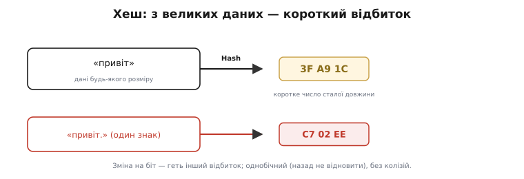
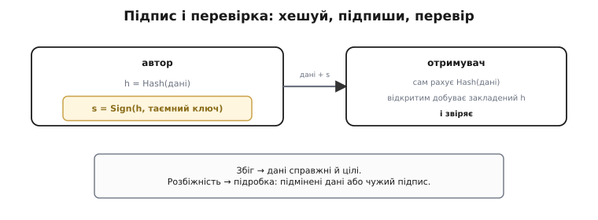
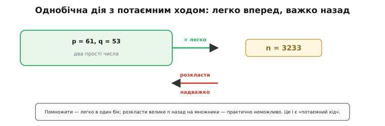

# Хеш і цифровий підпис

<preknowlist>
- [Модульна арифметика](topic:math-number-theory/modular-arithmetic) — дії із залишками від ділення, «годинниковий» світ, де живе вся арифметика підпису.
- [Функція Ейлера і теорема Ейлера](topic:math-number-theory/euler-totient) — чому піднесення до взаємно обернених степенів за модулем повертає початкове число; математичне серце RSA.
- [Прості числа](topic:math-number-theory/prime-numbers) — неподільні «цеглинки» цілих; на важкості відновити їх із добутку й тримається таємний ключ.
</preknowlist>

Тобі надійшов файл — оновлення програми, лист, запис у гаманці. Перш ніж на нього покластися, треба відповісти на два різні питання. Перше: **чи не змінили його дорогою** — байдуже, випадкова завада на дроті чи навмисна рука. Друге, підступніше: **чи він справді від того**, від кого має бути, а не від самозванця, що видає своє за чуже.

Здавалося б, перше питання давно закрите. Проста [контрольна сума](topic:sf-data/write-integrity) складає байти в одне коротке число, і якщо при передачі щось спотворилося, сума не зійдеться. Та вона боронить лише від **випадку**. Обдурити її навмисно легко: підмінив дані — тут-таки перерахував суму, і вона знову сходиться. А проти самозванця вона й геть безсила: сума нічого не знає про те, **хто** її поставив.

Отже, треба щось міцніше: відбиток, який не підробиш, і печатка, яку може поставити лише один, а впізнати — кожен. Обидва інструменти виростають із двох математичних ідей — **хеша** і **цифрового підпису**. Розберімо, чому кожна мусить бути саме такою.

## Хеш: відбиток, який не обдурити

Спершу випишімо, чого ми хочемо від «відбитка даних». Дані бувають будь-якого розміру — три байти чи три гігабайти, а ми хочемо згорнути їх у **коротке число сталої довжини**, з яким зручно оперувати. Просте згортання (як у контрольній сумі) ненадійне, тож додаймо вимоги — кожну з причини.

**Перша: за відбитком не можна відновити дані.** Інакше він видавав би вміст, а має лише **засвідчувати** його, нічого не розкриваючи. Цю властивість звуть **однобічністю** (англ. *one-way* — «в один бік»; строгіше — *preimage resistance*, стійкість до прообразу).

Звідки взагалі береться однобічність? Хеш (англ. *hash* — «дрібно посікти, перемішати») робить багато простих, але **перемішувальних** кроків: ріже дані на блоки й на кожному кроці змішує біти так, що кожен біт виходу заплутано залежить від багатьох бітів входу. Уперед ці кроки пройти легко — просто порахувати. А назад незмірно важче: щоб відновити вхід, довелося б розплутати всі змішування одночасно, а їх навмисне дібрано так, що прямого зворотного шляху немає — лишається хіба сліпий перебір. Тому з «3F A9 1C» не дістати «привіт»: відбиток зберігає **факт** даних, а не самі дані.

**Друга: зміна навіть на біт має дати геть інший відбиток.** Якби схожі дані давали схожі відбитки, то, підправивши файл трішки, зловмисник лишив би відбиток майже тим самим — і сподівався прослизнути. Тому доброму хешу властивий **лавинний ефект** (англ. *avalanche* — «лавина»): один перевернутий біт входу перекидає приблизно половину бітів виходу, і два майже однакові входи дають два цілком незалежні відбитки.

**Третя: практично неможливо знайти двоє різних даних з однаковим відбитком.** Такий збіг звуть **колізією** (лат. *collisio* — «зіткнення»). Якби колізію було легко знайти, уся будова завалилася б: зловмисник підшукав би нешкідливий на вигляд файл з тим самим відбитком, що й шкідливий, і підмінив один одним непомітно.


*Хеш згортає дані будь-якого розміру в коротке число сталої довжини. Зміна навіть на знак («привіт» проти «привіт.») дає цілком інший відбиток. Він однобічний (назад не відновити) і практично без колізій.*

Чому ж колізію так важко знайти? Тут працює сама довжина відбитка. Стійкий хеш дає, скажімо, 256 бітів — це 2²⁵⁶ можливих значень, число астрономічне. Найшвидший відомий спосіб напоротися на збіг — не цілеспрямований розрахунок, а **випадкове** натрапляння, і тут грає [парадокс днів народжень](topic:math-probability/birthday-paradox): збіги трапляються раніше, ніж підказує чуття, — приблизно після квадратного кореня з кількості всіх значень. Для 256-бітового хеша це порядку 2¹²⁸ ≈ 3.4·10³⁸ спроб. Це більше, ніж устигла б будь-яка мислима техніка за час життя Всесвіту. Тому колізія лишається теоретично можливою, а практично — ні.

Ось де хеш переростає контрольну суму. Сума міняється від псування — але її легко підробити навмисно. Хеш так просто не обдуриш: щоб лишити той самий відбиток після підміни, треба знайти колізію, а це практично неможливо. **Сума ловить випадок; хеш ловить і намір.**

## Чому самого хеша замало

Здавалося б, справу зроблено: додай до даних їхній відбиток — і кожен перевірить цілість. Але тут криється діра. Хеш — **відкритий алгоритм**, той самий для всіх. Зловмисник підмінює дані, **сам** рахує від них новий, чесний відбиток, і кладе поруч. Отримувач порахує хеш, звірить із доданим — усе сходиться, бо підроблено **і те, і те разом**.

Отже, голий хеш ручається за цілість лише проти випадку — рівно як контрольна сума, тільки надійніше. Проти зловмисника він працює **тільки** тоді, коли сам відбиток чимось захищений так, що чужий не зуміє підставити свій. Потрібна **асиметрія**: дія, яку може виконати лише один — власник секрету, — а перевірити її результат може будь-хто. Саме сюди й входить цифровий підпис.

## Цифровий підпис: печатка, яку не підробити

Ідея — **пара ключів**: таємний і відкритий. Таємний тримає при собі лише автор; відкритий роздано всім. Ключі пов'язані математично, але з відкритого **не вивести** таємний. Далі — два дійства:

- **підписати:** автор бере відбиток даних і таємним ключем ставить на нього позначку — **підпис**. Це може зробити лише той, у кого таємний ключ.
- **перевірити:** будь-хто відкритим ключем звіряє, чи ця позначка справді породжена відповідним таємним ключем саме для цього відбитка.

Підпис ставлять не на самі дані, а на їхній **відбиток** — і то з двох причин. По-перше, зі швидкості: підписувати великий образ дорого, а короткий хеш дешево. По-друге, зі стійкості: хеш уже згорнув цілий образ у число, що змінюється від кожного біта, тож одна печатка на відбитку накриває **і справжність** (хто підписав), **і цілість** (що саме підписав). Підмінити бодай байт даних — і їхній свіжий хеш поїде вбік від того, що накритий підписом.


*Автор рахує h = Hash(дані) і підписує відбиток таємним ключем: s = Sign(h). Отримувач сам хешує отримані дані, відкритим ключем добуває з підпису закладений відбиток і звіряє. Збіг — дані справжні й цілі; розбіжність — підробка.*

Формально три дії виглядають так:

```
відбиток:    h = Hash(дані)
підпис:      s = Sign(h, таємний_ключ)      ← лише автор
перевірка:   Verify(s, відкритий_ключ) = h  ← будь-хто
             звірити h з Hash(дані):  збіг → справжнє;  ні → підробка
```

Зверни увагу: отримувач **не розшифровує** дані відкритим ключем — дані лежать відкрито, їх ховати не треба. Відкритий ключ робить одне: з підпису `s` добуває назад той відбиток `h`, що його автор туди «запечатав». А далі — просте порівняння двох коротких чисел: добутого з підпису й порахованого щойно самим отримувачем.

## Звідки береться асиметрія: потаємний хід

Лишається головне питання: як влаштована дія, яку відкритим ключем можна **перевірити**, але не **повторити**? Відповідь — **однобічна функція з потаємним ходом** (англ. *trapdoor function*, де *trapdoor* — «люк, потаємний хід»): дію легко зробити вперед, а назад — практично неможливо, **якщо** не знаєш секрету.

Класичний потаємний хід — перемноження двох великих простих чисел. Помножити їх легко; а розкласти велетенський добуток назад на множники — надважко. У цьому й уся сіль: знаючи множники (таємний ключ), автор легко ставить підпис; не знаючи — підробити його так само важко, як розкласти те число, а це нікому не до снаги. На цій задачі стоїть **RSA** (за прізвищами Rivest, Shamir, Adleman — трьох, хто оприлюднив схему 1977 року). Інша родина спирається на дії над **еліптичною кривою**, де так само легко піти вперед і майже неможливо повернутися без секрету, — на ній стоїть **ECDSA** (*Elliptic Curve Digital Signature Algorithm*). Обидві родини різні всередині, але однакові за духом: таємний ключ — це «потаємний хід» до задачі, яку без нього не розв'язати.


*Однобічна дія з потаємним ходом: 61·53 = 3233 порахувати легко, а відновити з 3233 множники 61 і 53 — важко (для справжніх сотнязначних чисел — практично неможливо). Хто знає множники, той володіє секретом.*

## Як це рахують: RSA на крихітних числах

Проглянемо всю механіку на числах, які ще влазять у голову. У справжньому RSA прості мають сотні цифр; тут візьмемо `p = 61` і `q = 53`, щоб побачити самий кістяк.

**Підпишімо відбиток h = 65 і переконаймося, що перевірка повертає саме його.**

```
ключі:   p = 61,  q = 53              ← два прості (таємні)
         n = p·q = 3233               ← модуль (відкритий)
         φ = (p−1)·(q−1) = 3120       ← скільки чисел до n взаємно прості з n
         e = 17                       ← відкритий показник (взаємно простий з φ)
         d = 2753                     ← таємний показник: 17·d ≡ 1 (mod 3120)

підпис:  s = h^d mod n = 65^2753 mod 3233 = 588       ← поставити може лише власник d

перевірка (лише відкриті e, n):
         h' = s^e mod n = 588^17 mod 3233
         588^2  ≡ 3046 (mod 3233)
         588^4  ≡ 2639
         588^8  ≡ 439
         588^16 ≡ 1974
         588^17 = 588^16 · 588 ≡ 1974·588 ≡ 65
         h' = 65 = h   →   підпис справжній
```

Пара `(e, n)` — відкритий ключ, `d` — таємний. Підпис `s = 588` міг поставити лише той, хто знає `d = 2753`; а перевірити його, звівши `588` у степінь `17` за модулем `3233`, здатен будь-хто, і повертається рівно вихідний відбиток `65`.

Чому перевірка повертає саме `h`? Показники дібрано так, що `e·d ≡ 1 (mod φ)`, тобто `e·d = 1 + kφ` за деякого цілого `k`. Тоді

```
s^e = (h^d)^e = h^(e·d) = h^(1 + kφ) = h · (h^φ)^k ≡ h · 1^k = h  (mod n)
```

бо за [теоремою Ейлера](topic:math-number-theory/euler-totient) `h^φ ≡ 1 (mod n)` для взаємно простого з `n` числа `h`. Ось де ховається вся математика: піднесення до взаємно обернених за модулем `φ` степенів `e` і `d` повертає початок. А самі ці великі степені рахують не наївним множенням, а швидким [піднесенням до степеня за модулем](topic:math-number-theory/modular-exponentiation) — послідовним піднесенням до квадрата, як у стовпчику вище: `17` = `10001₂`, тому досить квадрату 4 рази й одного домноження, а не 16 множень.

І тут-таки видно, де потаємний хід. Таємний показник `d` ми дістали з `φ = 3120`, а `φ = (p−1)(q−1)` вимагає знати множники `61` і `53`. Хто бачить лише відкрите `n = 3233`, той, щоб добути `d`, мусить спершу розкласти `n` на прості. Для крихітного `3233` це легко; для справжнього `n` завдовжки в 600 цифр — практично неможливо. Ось чому відкритий ключ можна роздавати без остраху: він дає рівно стільки, щоб **перевірити** підпис, і анітрохи — щоб його **підробити**.

## Чому це не зламати

Складімо докупи. Щоб підсунути чужі дані з чинним підписом, зловмисникові треба або:

- знайти **інші** дані з тим самим хешем, що й у справжніх, — цього не дає стійкість до колізій; або
- поставити **новий** підпис під свої дані — а для цього потрібен таємний ключ, якого в нього немає, і добути його з відкритого так само важко, як розв'язати ту саму математичну задачу (розкласти `n` чи здолати еліптичний логарифм).

Обидва шляхи закриті — доти, доки таємний ключ у секреті. **Хеш ручається за цілість, підпис — за справжність**, і жодну з цих гарантій не обійти, не зламавши задачу, яку людство поки що ламати не вміє.

> 🔧 **Навіщо це.** Уся міць тримається не на тому, що алгоритм таємний — він якраз відкритий, стандартний і відомий усім, — а на одному-єдиному секреті: **таємному ключі**. Це давній принцип Керкгоффса: система має лишатися надійною, навіть коли ворог знає про неї все, крім ключа. Практичний висновок для кожного, хто будує захищений зв'язок: стійкість схеми важить рівно стільки, скільки важить таємність ключа, — тож бережи ключ як найбільшу цінність, а не покладайся на «нехай ніхто не здогадається, як воно влаштоване».

## Де це живе

Та сама пара ідей стоїть під безліччю речей, які здаються геть різними. Коли браузер відкриває захищений сайт, він перевіряє **цифровий підпис** сертифіката — так упевнюється, що говорить із тим сервером, а не з підставним. Коли менеджер пакунків ставить оновлення, він звіряє **хеш** і підпис автора — так відхиляє підмінений пакунок. Коли мікроконтролер вмикається й запускає прошивку, [secure boot](topic:sf-security/firmware-secure-boot) перевіряє її підпис — так не дає стартувати чужому коду. Коли ти робиш підписаний коміт чи переказ у гаманці, знову працює той самий зчеп: хеш згортає вміст, підпис засвідчує автора.

Скрізь, де треба впевнитися «це справді від того, від кого має бути, і не змінене дорогою», відповідь одна — хеш плюс підпис. Різняться лише алгоритми та довжини ключів; кістяк той самий.

Так дві функції розтинають одне розпливчасте слово «довіра» на дві частини, кожну з яких можна **довести**: хеш засвідчує, що дані ті самі, а підпис — що вони від того самого. Разом вони перетворюють «сподіваюся, що це справжнє» на «можу перевірити, що справжнє», — і саме тому той самий зчеп мовчки працює під кожним захищеним з'єднанням у мережі.
