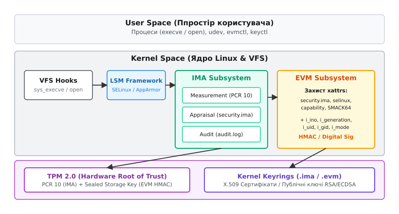
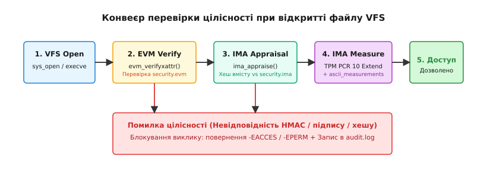

# Підсистема цілісності IMA/EVM

<preknowlist>
- [Віртуальна файлова система VFS](topic:sys-unix/vfs-layer) — абстракція inodes, dentry та розширені атрибути файлових систем.
- [Розширені атрибути файлів xattr](topic:sys-unix/acl-and-xattr) — механізм збереження безпекових метаданих у просторі `security.*`.
- [Фреймворк LSM](topic:sys-unix/lsm-framework) — архітектура хуків ядра для розмежування доступу та перехоплення VFS-операцій.
- [Підсистема Keyrings](topic:sys-unix/kernel-keyrings) — збереження асиметричних і симетричних ключів у пам'яті ядра.
- [Вимірюване завантаження та PCR](topic:sys-unix/measured-boot-pcr) — апаратний корінь довіри TPM та регістри PCR.
</preknowlist>

Якщо зловмисник із правами суперкористувача (`root`) або через фізичний доступ до сервера завантажує сторонню операційну систему з флеш-накопичувача, він може безпосередньо змонтувати блок-пристрій і змінити вміст бінарного файлу `/usr/bin/sudo` чи розширений атрибут `security.selinux`. При наступному завантаженні штатної системи класичні механізми контролю доступу Discretionary Access Control (DAC) та Mandatory Access Control (MAC) вважатимуть такі файли повністю легітимними: власник `root` збережений, дозволи `0755` на місці, а контекст безпеки SELinux збігається. Базова модель прав перевіряє *хто* запитує доступ, але принципово не здатна перевірити, *що саме* лежить на диску під виглядом системного компонента.

Для усунення цієї фундаментальної прогалини у ядрі Linux реалізовано двокомпонентний фреймворк цілісності (з латинської *integritas* — недоторканність, повнота): **Integrity Measurement Architecture (IMA)** та **Extended Verification Module (EVM)**. IMA перевіряє вміст самого файлу перед його завантаженням у пам'яті або виконанням, а EVM захищає метадані файлу (розширені атрибути `xattr` та індексні вузли `inode`) від несанкціонованої офлайн-модифікації.

## Фундаментальна проблема: офлайн-підміна та межа DAC/MAC

Більшість атак на цілісність ОС орієнтовані на створення постійної присутності (persistence) шляхом впровадження руткітів у виконувані файли (`/usr/bin/login`, `/usr/sbin/sshd`) або конфігурації. При цьому зловмисник використовує дві основні уразливості традиційної моделі розмежування доступу:

1. **Довіра до носія даних при завантаженні**: Ядро Linux під час виконання перевіряє маску прав UID/GID та контекст SELinux/AppArmor, що зберігаються в структурі файлової системи (ext4, xfs, btrfs). Якщо диск модифіковано офлайн, ядро не має штатного способу дізнатися, що бінарний код на диску більше не відповідає коду, зібраному дистрибутивом.
2. **Всемогутність суперкористувача**: Процес із привілеями `CAP_SYS_ADMIN` чи `CAP_DAC_OVERRIDE` може переписати будь-який файл чи змінити його розширений атрибут безпосередньо через системні виклики `write(2)` або `setfattr(2)`.

Підсистема цілісності вирішує цю проблему за допомогою криптографічного прив'язування файлів до апаратного кореня довіри (Hardware Root of Trust) — мікроконтролера **TPM 2.0** (Trusted Platform Module) — та вбудованих у ядро ключів перевірки цифрових підписів.

Історію створення та еволюції цих підсистем від перших проєктів IBM Research до сучасного стандарту TCG викладено в окремому матеріалі [📜 Еволюція підсистем IMA та EVM](topic:sf-security/ima-evm-deployment-and-tooling/hist-evm-tpm-evolution.md).


*Архітектура підсистеми цілісності Linux: перехоплення системних викликів у VFS, взаємодія з модульними перевірочними хуками IMA/EVM, залучення апаратного TPM та системного брелока ключів Kernel Keyrings.*

## Integrity Measurement Architecture (IMA): три стовпи захисту

IMA інтегрована безпосередньо у віртуальну файлову систему (VFS) і діє на рівні файлових хуків ядра. Кожного разу, коли процес намагається виконати файл (`execve`), змонтувати образ або відкрити файл для читання (`open`), IMA перехоплює виклик та виконує одну або декілька із трьох основних операцій:

```
                  ┌─────────────────────────────────────────┐
                  │            VFS System Call              │
                  └────────────────────┬────────────────────┘
                                       │
                                       ▼
                  ┌─────────────────────────────────────────┐
                  │          IMA Policy Evaluation          │
                  └──────┬───────────────────┬──────────────┘
                         │                   │
            [Measure]    │      [Appraise]   │   [Audit]
                         ▼                   ▼              ▼
┌──────────────────────────┐ ┌────────────────────────┐ ┌────────────────────────┐
│  Обчислення SHA-256      │ │ Зчитування атрибута    │ │ Запис події у системний│
│  Запис у runtime log     │ │ security.ima           │ │ журнал auditd          │
│  TPM PCR 10 Extend       │ │ Перевірка RSA/ECDSA    │ │ (AUDIT_INTEGRITY_*)    │
└──────────────────────────┘ └────────────────────────┘ └────────────────────────┘
```

### 1. Вимірювання (Measurement)

Механізм вимірювання (з англійської *measurement*) призначений для криптографічного фіксування фактів завантаження або виконання файлів у системі.

Коли файл відкривається, IMA обчислює його криптографічний дайджест (за замовчуванням SHA-256). Результат зберігається у системному списку вимірювань у пам'яті ядра (`runtime measurement list`), до якого можна звернутися через псевдо-файлову систему `securityfs`: `/sys/kernel/security/ima/ascii_runtime_measurements`.

Паралельно ядро передає обчислений хеш до апаратного мікроконтролера TPM, де виконується операція **PCR Extend** для регістра PCR 10 (Platform Configuration Register 10):

```
PCR[10]_new = SHA256( PCR[10]_old || Measurement_Digest )
```

У мікроконтролерах TPM 2.0 підтримується концепція криптографічних банків (crypto banks). Одне вимірювання IMA може одночасно розширювати кілька паралельних банків PCR (наприклад, банк SHA-256 та банк SHA-384). Це забезпечує апаратно-криптографічну гнучкість системи при переході на сильніші алгоритми хешування без зламу існуючих процедур атестації.

Оскільки регістри PCR не підтримують операції прямого запису чи скидання (reset можливий лише при перезавантаженні платформи), регістр PCR 10 формує акумулятивний криптографічний ланцюг усіх файлів, виміряних із моменту ввімкнення живлення комп'ютера.

Якщо зловмисник із правами `root` видалить запис із журналу ядра у пам'яті, підробити стан PCR 10 у мікроконтролері TPM він не зможе. При проведення **віддаленої атестації (Remote Attestation)** зовнішній сервер запитує підписану цитату `TPM2_Quote` над PCR 10 та журнал `ascii_runtime_measurements`. Сервер послідовно переобчислює ланцюг хешів із журналу: якщо підсумкове значення не збігається з підписаним значенням з TPM, система вважається скомпрометованою.

### 2. Оцінка (Appraisal)

Вимірювання лише фіксує події для подальшого аналізу. Механізм оцінки (з англійської *appraisal*) забезпечує локальне виконання політики (Local Enforcement) — він порівнює обчислений під час виконання хеш файлу з еталонним значенням, збереженим у розширеному атрибуті `security.ima`.

Атрибут `security.ima` може підтримувати один із двох форматів:

- **Простий хеш (`EVM_IMA_XATTR_DIGEST_NG`)**: Хеш файлу зберігається у самому xattr. Цей режим захищає лише від випадкового пошкодження секторів диска (аналог автоматичного `fsck`), але не захищає від зловмисника, який може легко переобчислити хеш та оновити xattr через `setfattr`.
- **Цифровий підпис (`EVMSIG_XATTR_DIGEST` / `IMA_ASYM_DIGSIG`)**: Еталонний хеш файлу підписано закритим RSA або ECDSA ключем розробника дистрибутиву/збірки. Відкритий ключ завантажується у системний брелок ключів ядра `.ima` під час завантаження.

При спробі запуску файлу IMA зчитує підпис із `security.ima`, знаходить відповідний відкритий ключ у брелоку `.ima` за його `keyid`, перевіряє підпис і порівнює дайджест із фактично обчисленим хешем вмісту. У разі найменшої розбіжності системний виклик переривається з помилкою `EACCES` (Permission denied).

Політика Appraisal підтримує режими роботи, що задаються параметром ядра `ima_appraise=`:
- `enforce`: Строгий режим блокування доступу при невідповідності підпису/хешу.
- `log`: Запис порушень у журнал без блокування (режим аудиту).
- `fix`: Автоматичне переобчислення та заміна вмісту `security.ima` при модифікаціях (використовується виключно при первинному інсталюванні чи оновленні ОС у захищеному середовищі).

### 3. Аудит (Audit)

Режим аудиту генерує форматовані повідомлення у системному журналі `auditd` про всі події перевірки цілісності (успішні чи відхилені виклики, оновлення атрибутів, зміни політики). Повідомлення містять UID, PID, процес, хеш файлу та статус перевірки.

Детальний специфічний формат заголовків та бінарну структуру атрибута `security.ima` наведено у довідникові [📋 Структура розширених атрибутів security.ima та security.evm](topic:sf-security/ima-evm-deployment-and-tooling/api-evm-xattr-format.md).

## Extended Verification Module (EVM): криптографічний щит метаданих

Перевірки IMA достатньо для захисту вмісту файлу, але вона залишає незахищеними метадані файлової системи. Припустімо, шкідливий файл має власний дійсний підпис `security.ima`. Зловмисник в офлайн-режимі може скопіювати xattr-атрибути `security.selinux` або `security.capability` з привілейованого бінарника `/usr/bin/sudo` і присвоїти їх своєму файлу, отримавши права `SUID root` чи контекст `setuid_exec_t`.

**Extended Verification Module (EVM)** розроблено для захисту метаданих від атак підміни та перенесення атрибутів між файлами.

EVM обчислює криптографічний дайджест (HMAC або асиметричний підпис) над фіксованим набором метаданих файлу:

1. **Вміст захищених розширених атрибутів**: `security.ima`, `security.selinux`, `security.SMACK64`, `security.capability`.
2. **Структурні поля індексного вузла (inode)**:
   - `i_ino` — унікальний номер inode на даній файловій системі.
   - `i_generation` — лічильник генерації inode (змінюється при видаленні та повторному виділенні inode).
   - `i_uid` та `i_gid` — ідентифікатори власника та групи.
   - `i_mode` — права доступу та прапори типів файлу (SUID, SGID, Sticky bit).

Результат зберігається у розширеному атрибуті **`security.evm`**.

```
EVM_Data = security.ima || security.selinux || security.capability || i_ino || i_generation || i_uid || i_gid || i_mode
security.evm = HMAC-SHA256( Master_EVM_Key, EVM_Data )
```

### Захист від атаки перенесення атрибутів (Cross-Inode Swapping)

Прив'язка `i_ino` та `i_generation` є ключовим інженерним рішенням EVM. Якщо зловмисник спробує скопіювати дійсний атрибут `security.selinux` разом із дійсним `security.evm` з файлу A (inode 1042) на файл B (inode 8911), перевірка EVM провалиться: ядро обчислить HMAC із використанням номера inode 8911, що дасть геть інший результат, ніж підпис у `security.evm`, згенерований для inode 1042.

### Двохрежимність EVM: Симетричний HMAC проти Portable Digital Signatures

EVM підтримує два режими захисту метаданих:

- **HMAC (Hash-based Message Authentication Code)**: Використовує симетричний 256-бітний майстер-ключ, який завантажується в системний брелок ядра `.evm` під час завантаження (зазвичай розпаковується з TPM за допомогою механізму TPM Sealed Storage). Завдяки наявності ключа у пам'яті ядра, легітимні операції оновлення метаданих (наприклад, виконання `chmod` чи `chown` адміністратором) автоматично переобчислюють і переписують `security.evm`.
- **Portable Digital Signatures (Асиметричні підписи EVM)**: Метадані підписуються закритим ключем на етапі збірки дистрибутиву. Оскільки ядро має лише відкритий ключ, воно не здатне переобчислити підпис при зміні атрибутів. У цьому режимі метадані файлів стають абсолютно **незмінними (immutable)**. Якщо операційна система намагається змінити власника чи SELinux-мітку, EVM відхиляє операцію. Для забезпечення переносності (portability) між різними дисками з підпису Portable EVM виключаються `i_ino` та `i_generation`, тому цей режим застосовується переважно для оновлення образотворчих незмінних файлових систем (ReadOnly RootFS).

## Конвеєр перевірки цілісності у Virtual File System

При зверненні процесу до файлу ядро здійснює суворо впорядкований конвеєр перевірок, де EVM та IMA працюють у каскаді:


*Послідовність перевірок VFS при виконанні системного виклику open/execve: каскадна верифікація метаданих через EVM перед зчитуванням і перевіркою вмісту через IMA.*

Покрокове виконання перевірки в ядрі Linux складається з наступних етапів:

1. **VFS Path Resolution**: Системний виклик `execve()` або `open()` переходить через VFS, розділяючи шлях до конкретного dentry та об'єкта `struct inode`.
2. **LSM Hooks Evaluation**: Виклики стандартних модулів контролю доступу (SELinux, AppArmor, SMACK). Якщо операція відхиляється на рівні MAC, ядро негайно перериває обробку та повертає `-EACCES`.
3. **EVM Verification (`evm_verifyxattr`)**: Перевірка цілісності атрибутів. EVM викликає `evm_verify_current_integrity()`, який зчитує `security.evm`, обчислює HMAC над inode та `security.ima`/`security.selinux` і порівнює дайджести. Якщо атрибути було підроблено або змінено офлайн, EVM повертає помилку `INTEGRITY_FAIL`.
4. **IMA Appraisal (`ima_appraise_measurement`)**: Якщо EVM підтвердив автентичність метаданих, IMA переходить до самого вмісту. Функція зчитує блоки файлу з диска, обчислює дайджест SHA-256 і перевіряє цифровий підпис RSA/ECDSA з атрибута `security.ima` через відкритий ключ у брелоку `.ima`.
5. **IMA Measurement (`ima_store_measurement`)**: За наявності правила вимірювання, обчислений хеш файлу реєструється в журналі `ascii_runtime_measurements` і відправляється в апаратний TPM для розширення регістра PCR 10 викликом `tpm_pcr_extend()`.
6. **Надання дескриптора**: За умови успішного проходження всіх вищезазначених перевірок ядро виділяє файл-дескриптор і передає його процесу простору користувача.

### Оптимізація продуктивності: Кешування iint (Integrity Inode Cache)

Постійне обчислення SHA-256 для великих файлів (наприклад, динамічних бібліотек на сотні megabytes) при кожному виклику `open()` викличе катастрофічну деградацію продуктивності.

Для нейтралізації накладних витрат IMA/EVM використовує підсистему кешування `integrity_iint_cache`:

:::tabs
```c
/* Кеш-структура цілісності inode в ядрі Linux */
struct integrity_iint_cache {
    struct rb_node rb_node;
    struct inode *inode;
    unsigned long version;
    enum integrity_status ima_file_status:4;
    enum integrity_status evm_status:4;
    u8 ima_hash[IMA_MAX_DIGEST_SIZE];
};
```
```cpp
// Концептуальне C++20 представлення кешу цілісності для утиліт простору користувача
struct IntegrityIintCache {
    std::uintptr_t inode_ptr;
    std::uint64_t version;
    std::uint8_t ima_file_status;
    std::uint8_t evm_status;
    std::array<std::uint8_t, 64> ima_hash;
};
```
:::

При першій успішній перевірці результати оцінки IMA та EVM зберігаються в кеш-структурі, прив'язаній до об'єкта `inode` у RAM. При наступних читаннях ядро порівнює лічильник модифікації inode `i_version` (або прапор зміни `ctime`). Якщо файл не відкривався на запис і прапор не змінювався, перевірка завершується миттєво з кешу за `O(1)`, минаючи повторне хешування дискових блоків.

## Налаштування політик IMA та системних ключів

Поведінка IMA контролюється правилами політики, які завантажуються у псевдо-файл `/sys/kernel/security/ima/policy`. Політика складається з послідовного набору правил, де перше правило, що збіглося з параметрами виклику, визначає дію.

### Завантаження відкритих ключів у ранньому завантаженні (initramfs)

Критичним етапом для роботи IMA Appraisal є своєчасне завантаження X.509 сертифікатів у системний брелок `.ima`. Завантаження повинно відбуватися на ранньому етапі ініціалізації (в `initramfs`) до того, як буде змонтовано реальну кореневу файлову систему і запущено PID 1 (`systemd` / `init`).

Для додавання ключа у брелок використовується системний виклик `add_key(2)` або утиліта `keyctl`:
`keyctl padd asymmetric "IMA-Key" %keyring:.ima < /etc/keys/x509_ima.der`

Після завантаження сертифікатів скрипт ініціалізації надсилає сигнал блокування брелока. Після цього жоден процес у просторі користувача (навіть із привілеями `root`) не зможе додати нові ключі до брелока `.ima` без перезавантаження ОС.

### Синтаксис правил політики IMA

Правила описують умови за збігом операції (`func`), типу суб'єкта/об'єкта (UID, FOWNER, LSM label) та дії (`measure`, `appraise`, `audit`, `dont_measure`, `dont_appraise`):

```text
# Заборона вимірювання тимчасових файлових систем
dont_measure fsmtype=tmpfs
dont_measure fsmtype=sysfs

# Вимірювання всіх виконуваних файлів (BPRM) та завантажуваних модулів ядра
measure func=BPRM_CHECK
measure func=MODULE_CHECK
measure func=FIRMWARE_CHECK

# Вимога перевірки цифрових підписів для всіх бінарних файлів виконуваних від імені root
appraise func=BPRM_CHECK uid=0 appraise_type=imasig

# Вимога підпису для всіх завантажувальних бібліотек (MMAP_CHECK)
appraise func=MMAP_CHECK mask=MAY_EXEC appraise_type=imasig
```

Завантаження політики можливе лише один раз за сесію завантаження системи. Після записати у файл `policy` кінцевого правила або закриття файлу політика **блокується від подальших змін (immutable policy)** до наступного перезавантаження ядра.

### Політики за замовчуванням: tcb та appraise_tcb

Ядро Linux містить декілька вбудованих шаблонів політик, які можна активувати через параметри завантаження ядра в GRUB/Systemd-boot:

- **`ima_policy=tcb` (Trusted Computing Base)**: Активує вимірювання всіх виконуваних файлів, завантажуваних модулів ядра та бінарних бібліотек, які запускаються від імені `root` (UID 0).
- **`ima_policy=appraise_tcb`**: Активує вимогу оцінки цілісності (Appraisal) для всіх файлів, що належать суперкористувачу.
- **`ima_policy=critical_data`**: Включає вимірювання критичних даних ядра та SELinux-політик безпосередньо під час їх завантаження у пам'яті.

## Інструментарій простору користувача та інтеграція пакетних менеджерів

Для роботи з підсистемою цілісності у просторі користувача застосовується набір утиліт `ima-evm-utils` із центральною утилітою **`evmctl`**.

Основні задачі `evmctl`:
1. **Накладання цифрових підписів IMA**:
   `evmctl ima_sign --key /etc/keys/x509_ima.der /usr/bin/sudo`
   Команда обчислює SHA-256 дайджест файлу, підписує його закритим ключем та записує бінарну структуру `signature_v2_hdr` в атрибут `security.ima`.
2. **Генерація атрибутів EVM**:
   `evmctl sign --ima --key /etc/keys/x509_evm.der /usr/bin/sudo`
   Обчислює дайджест над inode та захищеними розширеними атрибутами, після чого записує підпис в атрибут `security.evm`.

Сучасні дистрибутивні менеджери пакетів (RPM у RedHat/Fedora та DPKG у Debian/Ubuntu) інтегрують розширення `rpm-plugin-ima` та `dpkg-ima`. Під час встановлення пакета менеджер не просто копіює файли на диск, а й автоматично проставляє еталонні підписи `security.ima` та `security.evm`, надані дистрибутивом. Це забезпечує наскрізну цілісність системи відразу після завершення процедури оновлення.

## Контейнеризація та еволюція IMA Namespaces

У класичній архітектурі Linux підсистема IMA мала лише один глобальний журнал вимірювань та єдину глобальну політику для всього екземпляра ядра. Це створювало фундаментальну проблему для ізоляції контейнерів: ізольований контейнер у `user_namespace` не міг мати власної політики оцінки файлів або окремого журналу для віддаленої атестації. Будь-які вимірювання всередині контейнера потрапляли до хостового журналу `/sys/kernel/security/ima/ascii_runtime_measurements`, що створювало ризики витоку даних між сусідніми контейнерами (multi-tenancy) та перевантажувало глобальний журнал.

Починаючи з ядра Linux 5.19+, у ядрі впроваджено підтримку **IMA Namespaces**. Кожен новий простір імен цілісності (ізольований через `clone(CLONE_NEWUSER)`) отримує власні віртуальні файли в `securityfs`:

- Окремий журнал вимірювань `ascii_runtime_measurements`, доступний лише процесам даного контейнера.
- Ізольований файл `policy`, що дозволяє оператору контейнера завантажувати специфічні правила Appraisal незалежно від хостової системи.
- Своє коло кешування `integrity_iint_cache`, прив'язане до конкретного `user_ns`.

Це дозволяє будувати довірені хмарні середовища (Confidential Containers / Pods у Kubernetes), де робоче навантаження кожного контейнера криптографічно верифікується незалежно від хостового вузла.

## Порівняння механізмів цілісності Linux

Для обрання оптимального архітектурного рішенняважливо розуміти відмінності IMA/EVM від інших технологій перевірки цілісності у ядрі Linux:

| Характеристика | IMA / EVM | dm-verity | fs-verity |
| :--- | :--- | :--- | :--- |
| **Рівень захисту** | Файловий рівень (VFS / inode / xattr) | Блок-пристрій (Block layer) | Окремі файли (VFS read-only) |
| **Режим роботи диска** | Читання та запис (Read/Write) | Суворо лише для читання (Read-Only) | Читання після замороження (Read-Only) |
| **Апаратний корінь довіри** | Вбудована підтримка TPM 2.0 PCR | Захист кореневого хешу через UEFI/Secure Boot | Сертифікати у брелоку `.fs-verity` |
| **Гнучкість політики** | Висока (правила за UID, LSM label, path) | Статична (весь блок-пристрій цілком) | Пофайлова (вмикається через `ioctl`) |
| **Динамічне оновлення** | Підтримується (через HMAC або `evmctl`) | Вимагає повної перезбірки образу диска | Не підтримується (файл замикається) |

Практичний приклад написання програм простору користувача для аналізу розширених атрибутів та журналу вимірювань наведено у матеріалі [⚙️ Практичний аналізатор атрибутів цілісності IMA/EVM](topic:sf-security/ima-evm-deployment-and-tooling/proj-inspect-ima-evm.md).

> 🔧 **Навіщо це.**
> Підсистема IMA/EVM є обов'язковим стандартом безпеки у системах з підвищеними вимогами до цілісності:
> 1. **Automotive Grade Linux (AGL) та Аерокосмічні ОС**: Гарантує, що прошивка автомобіля чи критичного контролера не була підроблена при зверненні до дискових накопичувачів.
> 2. **Confidential Computing та Серверна Атестація**: Дозволяє хмарним провайдерам надавати клієнтам математичний доказ того, що віртуальна машина завантажилася в еталонному стані без впроваджених шпигунських модулів.
> 3. **Захист від Ransomware**: При налаштованій IMA Appraisal у режимі `enforce` шифрувальник або шкідливий бінарник, завантажений з мережі, не зможе виконатися, оскільки він не має цифрового підпису, завіреного приватним ключем розробника системи.
