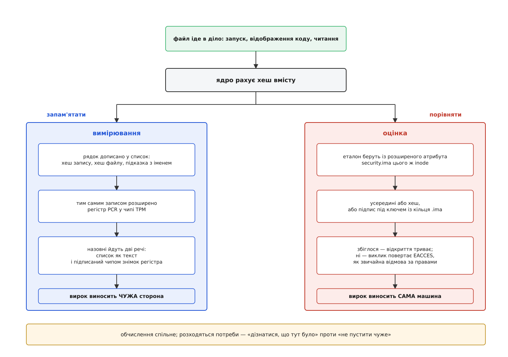
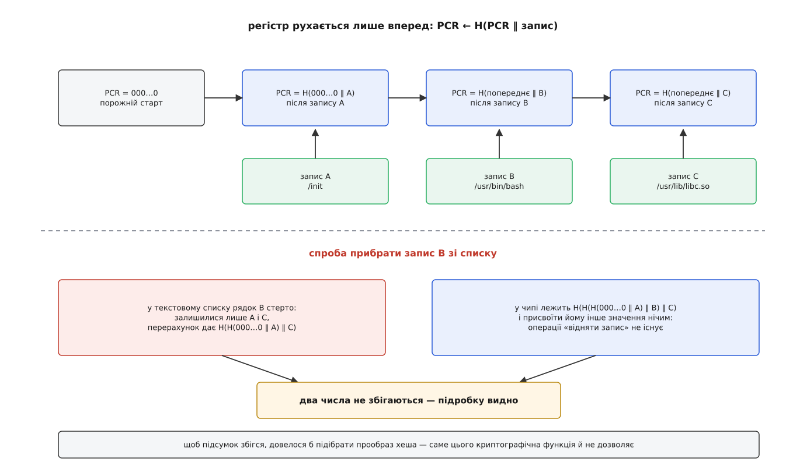
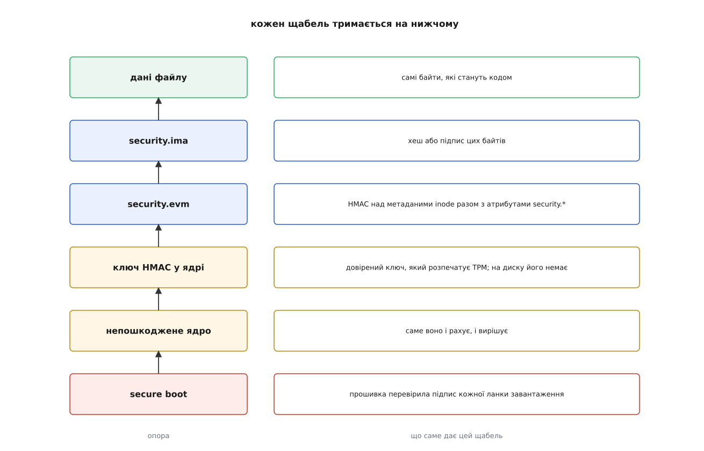

# IMA: вимірювання й оцінка цілісності файлів у ядрі

<preknowlist>
- [Біти прав і як їх перевіряють](root:sys-unix/permission-bits) — рішення про доступ дивиться на того, хто просить, і на об'єкт, який просять, через трійку «власник / група / решта».
- [exec: заміна образу](root:sys-unix/exec-semantics) — `exec` не створює процес, а заливає в нього вміст виконуваного файлу; після цього байти файлу і є код процесу.
- [Inode: файл без імені](root:sys-unix/inode-model) — файл це inode з даними й метаданими, а ім'я лежить окремо, у каталозі.
- [Розширені права (ACL) і атрибути (xattr)](root:sys-unix/acl-and-xattr) — до inode можна причепити іменовані шматки даних; у простір `security.*` пише лише привілейований.
- [Хеш і цифровий підпис](root:sf-security/hash-and-digital-signature) — хеш зводить довільні дані до короткого числа, підпис прив'язує це число до власника ключа.
- [Кільця ключів ядра](root:sys-unix/kernel-keyrings) — ядро тримає власні ключі, якими простір користувача може скористатися, але не може їх прочитати.
- [TPM і TrustZone: апаратний корінь довіри](root:embedded/tpm-trustzone) — окремий чип із регістрами, яким не можна присвоїти значення, і ключем, що з нього не виходить.
- [Secure boot](root:sf-security/firmware-secure-boot) — прошивка перевіряє підпис наступної ланки завантаження, і так аж до ядра.
- [LSM: каркас гачків безпеки в ядрі](root:sys-unix/lsm-framework) — місця в ядрі, де перед виконанням дії питають окрему підсистему.
</preknowlist>

На машині крутиться служба, яку запускає root із `/usr/sbin/`. Права виставлені бездоганно: власник root, група root, права `755`, каталог теж чужому не піддається. Уночі хтось, хто на кілька хвилин дістав можливість писати в цей каталог, підмінює виконуваний файл. Уранці служба перезапускається — і ядро слухняно її запускає.

Жодна перевірка не спрацювала, і це не недогляд. Власник файлу той самий, біти ті самі, мітка SELinux та сама, обмеження на системні виклики ті самі. Уся машинерія прав відповідає на питання «**хто** що робить із **яким об'єктом**», і на це питання відповідь не змінилася ні на йоту. Питання «а чи це та сама програма, що була вчора» не ставить ніхто, бо в моделі прав його просто немає: вміст файлу для неї — непрозорий вантаж, який вона переносить, не заглядаючи всередину.

Заперечення напрошується: пакунок же підписаний, менеджер пакетів перевірив підпис під час встановлення. Перевірив — один раз. А виконують цей файл потім тисячі разів, місяцями, і між тією єдиною перевіркою й черговим запуском лежить увесь час життя системи, протягом якого файл лежить на диску й доступний тому, хто дістанеться до диска. Перевірка, зроблена задовго до вжитку, нічого не каже про момент ужитку.

Отже, потрібна перевірка **над самим вмістом**, **у ту мить, коли вміст іде в діло**, і зроблена **тим, хто цей вміст читає** — тобто ядром. Саме цю відсутню деталь додає підсистема IMA (англ. *Integrity Measurement Architecture* — архітектура вимірювання цілісності).

## Одне обчислення, дві різні потреби

Звести вміст файлу до чогось коротшого, ніж він сам, вміє криптографічний хеш: мільйони байтів перетворюються на тридцять два, і будь-яка зміна вмісту дає інше число. Обчислити його ядро може в момент, коли читає файл, — це дешева операція над даними, які й так проходять крізь руки.

А от що робити з отриманим числом — питання, на яке є дві незалежні відповіді, і саме звідси росте вся конструкція.

Перша: **записати його й нікуди не подіти**. Тоді нагромаджується журнал усього, що на цій машині виконувалося, — і хтось ззовні, кому ця машина має щось довести, зможе подивитися, що на ній робилося від самого ввімкнення. Це **вимірювання** (measurement): ядро нічого не забороняє, воно веде протокол.

Друга: **порівняти з еталоном і винести вирок просто зараз**. Збігається — пускаємо, ні — відмова. Це **оцінка** (англ. *appraise* — оцінити вартість, дати офіційний висновок): ядро вирішує саме, локально, і рішення вбудовується в звичайний шлях відкриття файлу.

Різниця не в обчисленні, а в споживачеві. Вимірювання працює на **зовнішню сторону**, якій треба **дізнатися** стан машини. Оцінка працює на **саму машину**, якій треба **не пустити** чуже. Тому й вимоги різні: вимірюванню потрібен журнал, якому повірить недовірливий чужинець; оцінці потрібен еталон під рукою в момент відкриття файлу. Дві половини IMA — це дві відповіді на це «що робити з хешем», і далі вони розходяться майже повністю.



*Хеш вмісту рахують один раз, а споживають двічі: ліворуч — накопичення історії для того, хто питає ззовні, праворуч — негайне рішення пустити чи ні.*

## Журнал, якому можна вірити

Почнімо з вимірювання — воно й з'явилося першим, як спосіб дати віддаленій стороні підстави довіряти чужій машині; оцінка доросла до ядра лише наприкінці 2012-го, за вісім років після самої ідеї, коли стало ясно, що те саме обчислення розв'язує зовсім іншу задачу. Як задача атестації породила підсистему, а потім розділилася надвоє, розказано окремо: [звідки взялася IMA і чому вирок спізнився на вісім років після статті, що її породила](root:sf-security/ima-measurement-vs-appraisal/hist-ima-birth.md).

Ядро додає в список рядок на кожен файл, який щойно став кодом; список видно через `securityfs`:

```
$ head -2 /sys/kernel/security/ima/ascii_runtime_measurements
10 f7bd2e8a…  ima-ng sha256:9b3c41d0…  boot_aggregate
10 3ac1b74e…  ima-ng sha256:5d8e0f22…  /usr/bin/bash
```

І тут же виникає заперечення, яке вбиває всю ідею: список лежить у пам'яті тієї самої машини, яку ми підозрюємо. Той, хто підмінив файл і має досить прав, витре з журналу свій рядок — і журнал покаже ідеальну чистоту. Протокол, який може виправити підозрюваний, не вартий нічого.

Виправити це програмно неможливо: будь-який захист журналу — це знову код на тій самій машині. Потрібна опора **поза** нею — маленький пристрій, який уміє одну-єдину річ: **не давати задати собі значення**. Такий пристрій — TPM, а його регістри конфігурації платформи (PCR) мають рівно цю властивість. Записати в PCR число не можна взагалі; єдина операція над ним — *розширення* (extend):

```
PCR ← H(PCR ‖ x)
```

Новий вміст регістра — це хеш від склейки старого вмісту з тим, що дописують. Регістр стартує з нулів і рухається лише вперед. Хочете, щоб він показав якесь конкретне число, — доведеться підібрати послідовність, яка до нього приведе, а це задача про прообраз хеша, тобто задача нездійсненна.

Наслідок, заради якого все й затіяно: **підсумок неможливо відмотати назад**. Прибрати з журналу рядок мало — треба ще й повернути PCR у стан, у якому він був до цього рядка, а такої операції немає. Ядро на кожен доданий рядок розширює один регістр (за домовленістю це PCR 10), і в ньому нагромаджується згорнута історія всього списку.



*Регістр не зберігає записів — він зберігає слід від них; будь-яка правка списку робить перерахований підсумок несхожим на той, що лежить у чипі.*

Тепер видно, як цим користується зовнішній перевіряч. Він просить у машини дві речі: сам журнал (текст, який машина може підробити скільки завгодно) і **підписаний чипом** знімок значення PCR 10 — підпис робить ключ, який із TPM не виходить. Далі перевіряч бере журнал і повторює обчислення в себе:

```py
import hashlib

pcr = b"\x00" * 20                                     # регістр стартує з нулів
with open("/sys/kernel/security/ima/ascii_runtime_measurements") as f:
    for line in f:
        template_hash = bytes.fromhex(line.split()[1])  # друге поле рядка
        pcr = hashlib.sha1(pcr + template_hash).digest()

print(pcr.hex())
```

Цей десяток рядків — навмисне спрощення: справжній перевіряч читає двійковий журнал, а не текстовий переказ, тримає кілька банків хешів одночасно й мусить окремо впоратися з отруєними записами, про які мова далі. Робочий перевіряч, який розбирає двійковий формат, повторює ланцюг і показує, на якому саме рядку історія розійшлася з чипом, зібрано окремо: [перерахувати список вимірювань і зловити розбіжність](root:sf-security/ima-measurement-vs-appraisal/proj-replay-measurements.md).

Збігся результат зі знімком із чипа — журнал справжній, і його можна читати. Не збігся — журнал брехливий, і всі рядки в ньому нічого не варті. Перевіряч не мусить довіряти машині ні на крихту: він довіряє лише чипу й власній арифметиці. Цей же спосіб — коли одна сторона доводить іншій, у якому вона стані, — має власне ім'я й ширше застосування, ніж IMA: [віддалена атестація](root:sf-security/remote-attestation) стоїть за допуском машини в мережу, за видачею їй ключа шифрування диска, за рішенням хмарного клієнта, чи довіряти орендованому вузлу.

> 🔧 **Навіщо це.** Ланцюг розширень — не деталь чипа, а причина, чому список вимірювань має сенс лише з початку завантаження. Перший рядок журналу, `boot_aggregate`, — це згорнутий підсумок регістрів, які заповнила прошивка до старту ядра. Розірвіть ланцюг у будь-якому місці — і все, що нижче, перестає щось доводити, хоч би яким чистим воно виглядало.

## Що саме лежить у рядку

Дивлячись на журнал, легко подумати, що в регістр іде хеш файлу. Ні — і причина повчальна.

Рядок журналу складається за **шаблоном** (template): у типового `ima-ng` це хеш даних файлу і підказка з іменем шляху, а `ima-sig` додає ще й підпис, якщо він у файлі є. У PCR розширюють хеш **усього рядка за шаблоном**, а не хеш самих даних. Інакше перевіряч не міг би довіряти імені: підмінивши шлях у текстовому журналі, машина показала б, ніби небезпечний файл виконувався під безневинним іменем, а підсумок у чипі лишився б той самий. Правило просте й загальне: у регістр іде хеш рівно того, що перевіряч потім читатиме.

Цим же пояснюється друге поле в рядку — саме його, а не хеш файлу, бере наведений вище цикл.

## Вікно між виміром і вжитком

Хеш беруть у момент T, а вміст ідуть використовувати в момент T плюс щось. Якщо між ними хтось встиг переписати файл, виміряно було одне, а виконано інше — класичний [розрив між перевіркою й використанням](root:sf-security/toctou-race), тільки тут він знецінює не рішення про доступ, а весь журнал.

Замкнути файл на час використання ядро не може: це означало б забороняти запис у будь-який виконуваний файл на всій машині, і система стала б непридатною. Тому IMA чинить інакше — **чесно зізнається**, що конкретно цей вимір ненадійний. Ситуацій дві, і вони дзеркальні:

- **open_writers** — файл беруть на читання, поки його вже тримає відкритим той, хто пише. Вимір робиться над вмістом, який може мінятися просто в процесі вимірювання.
- **ToMToU** (*time of measure, time of use* — час виміру й час ужитку) — файл уже виміряно, і тільки після цього його відкривають на запис. Виміряне більше не є тим, що лежить у файлі.

І тут — найкрасивіша деталь усієї конструкції. Порушення теж потрапляє в журнал, але вміст запису й те, чим розширюють регістр, **навмисно різні**: у список кладуть нулі, а в TPM відправляють байти `0xff`. Значення регістра після цього гарантовано розходиться з тим, що дасть чесний перерахунок списку, і жоден наступний правильний запис цього не виправить — ланцюг же незворотний. Машина не може приховати, що в її історії була діра: вона отруїла собі підсумок і сама про це повідомила.

## Оцінка: рішення тут і зараз

Друга половина живе за іншими правилами. Тут ядро мусить винести вирок **у момент відкриття файлу**, а отже, мати еталон **під рукою**: жодних запитів до сервера, жодного пошуку в центральній базі — інакше кожен `exec` чекав би на мережу.

Куди покласти еталон, щоб він завжди був поруч із файлом, переживав перейменування, копіювання й резервну копію? Відповідь у Unix уже є: до inode можна причепити розширений атрибут. IMA бере `security.ima`, і в ньому лежить одне з двох.

**Хеш вмісту.** Ядро рахує хеш файлу під час відкриття, порівнює з тим, що в атрибуті, і при розбіжності повертає `EACCES` — те саме «Permission denied», яке дає звичайна відмова за правами. Ця однаковість не випадкова: вміст файлу тепер такий самий учасник рішення про доступ, як власник і біти.

**Цифровий підпис.** Той самий хеш, але підписаний закритим ключем, а перевіряють підпис відкритим ключем із кільця `.ima`, яке живе в ядрі. Туди можна покласти лише сертифікати, підписані ключем із вбудованих кілець довіри, — тобто зрештою тим самим ключем, яким підписане ядро.

Різниця між двома варіантами — це різниця в тому, від кого захист. Голий хеш зупиняє випадкове псування й того, хто дістався до диска повз працююче ядро. Але той, хто може переписати файл на живій системі, зазвичай може переписати й атрибут поруч — і підставити хеш нового вмісту. Підпис цього не дозволяє: підробити його без закритого ключа неможливо, а закритого ключа на машині немає взагалі, він лишається в того, хто збирає систему.

Режим роботи задають при завантаженні: `ima_appraise=enforce` відмовляє, `log` лише пише в журнал, а `fix` — це разовий режим розмітки, у якому ядро саме проставляє атрибути тим файлам, у яких їх немає. Саме так систему один раз позначають цілком, замість того щоб обходити її файл за файлом.

## Захистити саму мітку

Лишається дірка, і вона очевидна: `security.ima` — це метадані, і той, хто змінює файл, зазвичай має до них доступ. Якщо еталон — голий хеш, вся конструкція тримається на чесності того, кого ми якраз і не вважаємо чесним.

Звідси другий шар, EVM (англ. *Extended Verification Module* — модуль розширеної перевірки). Він рахує код автентичності HMAC над **метаданими inode** — власником, групою, режимом, номером inode і його поколінням — **разом з атрибутами** `security.*`, і кладе результат у `security.evm`. Ключ для HMAC ядро тримає в себе; типово це довірений ключ, який розпечатує TPM, тож із вимкненої машини його не дістати.

Виходить рекурсія, і в ній уся суть: **EVM охороняє метадані, метадані охороняють дані**. Переписати вміст файлу мало — треба переписати `security.ima`; переписати його мало — треба перерахувати `security.evm`; а для цього потрібен ключ, якого немає. Прив'язка до номера inode і покоління додає ще одну дрібницю: мітку не можна зняти з одного файлу й почепити на інший, вона рахувалася саме для цього inode.

Чого EVM не ловить — так це підміни на рівні імен: файли можна поміняти місцями, і кожен лишиться внутрішньо узгодженим. Шлях у мітку не входить свідомо, інакше жодне перейменування не пережило б перевірки.



*Кожен щабель тримається на наступному нижчому; зникає найнижчий — розсипається все, що над ним, скільки б підписів не стояло зверху.*

## Політика: у які моменти й для яких файлів

Ні вимірювання, ні оцінка не вмикаються самі собою — обидві керуються політикою, яку записують у `securityfs`. Правило складається з дії (`measure`, `appraise`, `audit`, `hash` і їхні заперечення `dont_*`), з **гачка** — моменту, коли правило застосовують, — і з умов добору файлів:

```
measure func=BPRM_CHECK
measure func=MMAP_CHECK mask=MAY_EXEC
appraise func=BPRM_CHECK appraise_type=imasig
dont_appraise fsmagic=0x9fa0
```

Перелік гачків цікавий сам собою, бо це, по суті, повний список моментів, коли байти в системі стають чимось довіреним: `BPRM_CHECK` — запуск програми, `MMAP_CHECK` — відображення файлу з правом виконання (бібліотека теж код), `FILE_CHECK` — звичайне відкриття на читання, `MODULE_CHECK` — завантаження модуля ядра, `FIRMWARE_CHECK` — прошивка, що їде в пристрій, `KEXEC_KERNEL_CHECK` — наступне ядро, `POLICY_CHECK` — сама політика, `KEY_CHECK` — ключ, що лягає в кільце.

Гачок `POLICY_CHECK` пояснює одну неочевидну поведінку: політику IMA теж вимірюють, а файл політики за звичайних налаштувань приймає запис один раз за завантаження. Причина не в обережності, а в логіці: політика визначає, що саме потрапить у журнал, тож журнал без вимірювання політики нічого не доводить — прочитавши його, перевіряч не знає, чи не викинули з-під нагляду половину системи посеред роботи. Готові набори правил вмикають прямо з командного рядка ядра, `ima_policy=tcb` чи `ima_policy=secure_boot`, — тоді політика діє з першої секунди, ще до того, як хоч щось із простору користувача встигне виконатися.

Повний синтаксис правил, перелік умов добору, формати шаблонів і параметри завантаження зібрано окремо: [мова політики IMA та її поверхня керування](root:sf-security/ima-measurement-vs-appraisal/api-ima-policy.md).

## Скільки це коштує

Хешувати файл на кожному відкритті — божевілля: `/usr/bin/bash` за годину роботи системи відкривають сотні разів. Тому результат кешують у структурі, прив'язаній до inode: там лежать позначки «вже виміряно», «вже оцінено» й самі значення. Друге й наступні відкриття не рахують нічого.

Кеш дійсний, поки файл не змінився, і тут ядру потрібна від файлової системи одна послуга — лічильник версій inode, який зростає на кожну зміну. Файлова система, яка його не веде, змушує або перехешовувати щоразу, або втрачати гарантію. Тож фактична ціна IMA — це одне хешування на inode за завантаження.

Але з великими файлами й це стіна: щоб оцінити образ на чотири гігабайти, ядро мусить прочитати всі чотири, перш ніж віддати перший байт. Обхід є, і він лежить поруч: [fs-verity](root:sys-unix/fs-verity) будує над файлом дерево Меркла, у якому перевіряють кожен блок окремо, у міру читання, а весь файл описано одним коренем. IMA вміє оцінювати саме цей корінь замість звичайного хеша — тоді підпис накриває дешеве коротке значення, а перевірка вмісту розтягується в часі й платиться тільки за прочитане.

## Де межа

IMA судить про вміст **у мить завантаження**, і далі її повноваження закінчуються. Процес, який згенерував код у себе в пам'яті, інтерпретатор, що прочитав скрипт, не накритий політикою, програма, чия поведінка вирішується даними, — усе це проходить повз. Вимірювання відповідає на питання «що було завантажено», а не «що воно робило».

Уся конструкція стоїть на непошкодженому ядрі: і журнал, і вирок робить код, який зламане ядро підмінить першим. Тому IMA не є самостійним захистом — це продовження ланцюга довіри в простір користувача, і без надійної ланки під ним воно захищає рівно від нічого. Так само вимірювання без TPM — просто список у пам'яті: корисний, щоб побачити, що взагалі виконувалося, і безсилий проти того, хто має root.

Окремо стоїть біда з контейнерами. Журнал один на машину, PCR один на машину, а вимірювання з десятка контейнерів злипаються в один потік, у якому зовнішній перевіряч не відрізнить, що звідки. Спроби розвести IMA по просторах імен подають у ядро десятками версій ще з другої половини 2010-х, і головна перешкода не в коді, а в тому, до чого прикріпити журнал контейнера: апаратний корінь довіри на машині один, і поділити його між ізольованими світами нема на що.

І все ж головне тут не в переліку обмежень. Модель прав Unix десятиліттями відповідала на одне питання — хто чого вартий, — а вміст файлу лишався поза розмовою. IMA додала в це рішення ще один вимір: файл тепер має право стати кодом не тому, що в нього правильний власник, а тому, що він **той самий**.
