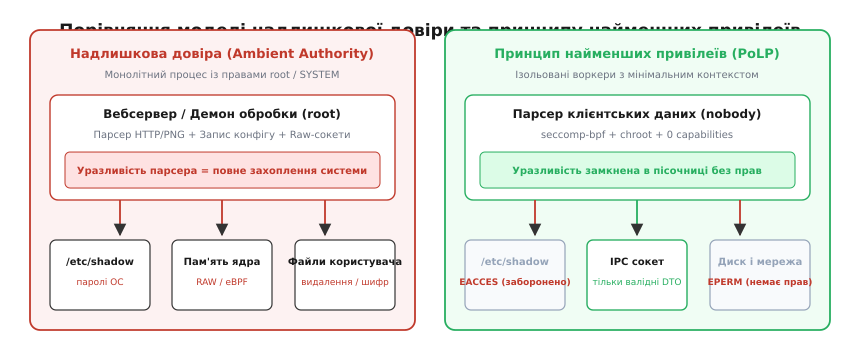
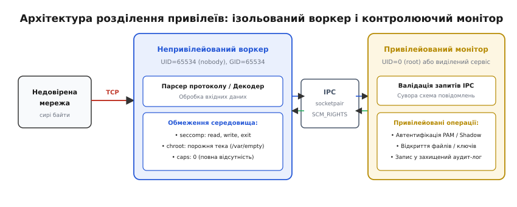
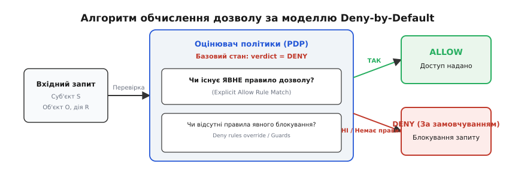

# Принцип найменших привілеїв та політика Deny-by-Default

<preknowlist>
- [Кільця захисту й рівні привілеїв](root:hw-arch/protection-rings) — апаратний поділ режимів виконання процесора та ізоляція ядра від простору користувача.
- [Системний виклик](root:hw-arch/system-call) — механізм переходу в режим ядра для виконання контрольованих операцій.
- [Межі довіри](root:sf-security/trust-boundaries) — розмежування середовищ із різними рівнями довіри та правами суб'єктів.
- [Поверхня атаки](root:sf-security/attack-surface) — сукупність точок входу, інтерфейсів і ресурсів, доступних потенційному нападнику.
</preknowlist>

Вебсервер, запущений від імені суперкористувача `root`, обробляє вхідний HTTP-запит клієнта. У коді розбору заголовків або декодування зображень трапляється помилка читання буфера поза межами виділеної пам'яті. Оскільки процес володіє необмеженими правами в операційній системі, зловмисник, перехопивши потік виконання інструкцій, негайно отримує повний контроль над машиною: читає хеші паролів із `/etc/shadow`, перехоплює сирий мережевий трафік інших процесів, модифікує системні двійкові файли та завантажує шкідливі модулі ядра. Катастрофа сталася не тому, що парсер містив помилку, а тому, що компоненту розбору тексту було надано право керувати всім апаратним комплексом.

Ця вразливість викриває фундаментальну проблему традиційних систем — модель надлишкової довіри або фонового авторитету (англ. *ambient authority*). Процес отримує доступ до ресурсів не тому, що цей конкретний крок обчислення дійсно потребує запису на диск чи зміни конфігурації мережі, а тому, що він успадкував усі привілеї користувача або демона, який його ініціалізував.

Історично операційні системи Unix створювалися для довірених університетських терміналів, де суперкористувач (`root` з UID 0) був єдиним засобом адміністрування. Проте перенесення цієї моделі в мережеві демони перетворило будь-яку прикладну помилку на фатальну системну компрометацію (як це відбулося під час епідемії хробака Морріса у 1988 році через переповнення буфера в демоні `fingerd`). Захист сучасної системи вимагає відмови від надлишкової довіри на користь двох взаємопов'язаних принципів: найменших привілеїв та безпеки за замовчуванням.

## 1. Принцип найменших привілеїв (PoLP)

Принцип найменших привілеїв (англ. *Principle of Least Privilege*, PoLP; лат. *privilegium* — винятковий закон, наданий окремій особі, від *privus* — окремий і *lex* — закон) стверджує: кожен суб'єкт системи (процес, потік, користувач, сервісний обліковий запис або програмний модуль) у кожен дискретний момент часу повинен володіти виключно тим мінімальним набором повноважень, без якого неможливо завершити поточну законну операцію — і ні бітом більше.


*Порівняння моделі надлишкової довіри та принципу найменших привілеїв*

Походження цієї інженерної аксіоми сягає 1975 року, коли дослідники Массачусетського технологічного інституту Джером Зальцер та Майкл Шредер узагальнили досвід проєктування системи Multics і сформулювали вісім ключових правил захисту інформації в обчислювальних системах. Докладніше про історію та контекст виникнення цих правил читайте у вставці 📜 [Історія формування принципів Зальцера і Шредера](root:sf-security/least-privilege/hist-saltzer-schroeder.md).

Принцип найменших привілеїв розглядає повноваження у двох взаємодоповнюючих вимірах:

1. **Просторовий вимір (гранулярність прав):** суб'єкт не повинен отримувати монолітний доступ за принципом «усе або нічого». Замість універсальних прав суперкористувача (`root` або `SYSTEM`) процес отримує лише дискретне право, наприклад, прив'язку до захищеного мережевого порту (`CAP_NET_BIND_SERVICE`), без можливості читати чужі файли, скидати права чи трасувати пам'ять сусідніх програм.
2. **Часовий вимір (динамічна деескалація):** набір привілеїв не є статичною характеристикою програми від старту до завершення. Процес повинен утримувати підвищені повноваження лише протягом короткої початкової фази ініціалізації, після чого зобов'язаний безповоротно відмовитися від них до початку обробки зовнішніх неперевірених даних.

### Життєвий цикл привілеїв у системному демоні

Розглянемо типовий безпечний мережевий демон (наприклад, вебсервер або шлюз автентифікації). Його виконання ділиться на чотири послідовні фази з поступовим зниженням рівня довіри:

```
[ Фаза 1: Привілейована ініціалізація ]
  │  - Запуск від імені суперкористувача (UID 0)
  │  - Прив'язка до привілейованого TCP-порту 443 (bind)
  │  - Зчитування приватного TLS-ключа та файлу конфігурації
  │  - Ініціалізація дескрипторів системного журналу аудиту
  ▼
[ Фаза 2: Скидання привілеїв (Privilege Dropping) ]
  │  - Ізоляція файлової системи: chroot("/var/empty") або Mount Namespace
  │  - Очищення додаткових груп: setgroups(0, NULL)
  │  - Скидання реального, ефективного та збереженого GID: setresgid(nobody)
  │  - Скидання реального, ефективного та збереженого UID: setresuid(nobody)
  ▼
[ Фаза 3: Незворотна фіксація обмежень ]
  │  - Очищення бітових масок capabilities: cap_set_proc(empty_caps)
  │  - Заборона отримання нових привілеїв: prctl(PR_SET_NO_NEW_PRIVS, 1)
  ▼
[ Фаза 4: Штатна робота в пісочниці ]
  │  - Активація Seccomp-BPF білого списку системних викликів
  │  - Обробка клієнтських запитів у стані повної відсутності системних прав
```

Якщо під час Фази 4 зловмисник знаходить вразливість у парсері протоколу та отримує виконання довільного двійкового коду, процес уже позбавлений будь-яких привілеїв: ядро операційної системи блокує будь-які спроби відкриття нових файлів, створення сокетів чи зміни ідентифікаторів користувача.

Детальний опис системних викликів, констант POSIX capabilities та прапорців ядра, що забезпечують цю деескалацію, наведено у довіднику 📋 [Системні виклики та структури керування привілеями](root:sf-security/least-privilege/api-linux-privileges.md).

---

## 2. Структури ядра та механізми перевірки повноважень

Щоб зрозуміти, як реалізується принцип найменших привілеїв на рівні операційної системи, необхідно розглянути структуру дескриптора процесу в ядрі Linux.

У ядрі кожен процес представлений структурою `task_struct`, яка містить вказівник на структуру мандатів безпеки `struct cred` (заголовок `include/linux/cred.h`):

```
struct task_struct
  └── struct cred (RCU-захищена структура облікових даних)
        ├── uid, gid       (реальні ідентифікатори власника)
        ├── euid, egid     (ефективні ідентифікатори для перевірки доступу)
        ├── suid, sgid     (збережені ідентифікатори для тимчасового перемикання)
        ├── fsuid, fsgid   (ідентифікатори для операцій із файловою системою)
        ├── cap_inheritable (capabilities, що передаються через execve)
        ├── cap_permitted   (максимально доступні capabilities для процесу)
        ├── cap_effective   (активні capabilities, що перевіряються ядром)
        ├── cap_bset        (bounding set — гранична межа capabilities)
        ├── cap_ambient     (ambient capabilities для непривілейованих програм)
        └── struct user_namespace (простір імен користувачів)
```

Коли процес виконує [системний виклик](root:hw-arch/system-call) (наприклад, відкриття файлу `openat`, надсилання сигналу `kill` чи монтування диску `mount`), ядро викликає внутрішню функцію перевірки повноважень:

1. **Перевірка прав доступу до файлів (DAC):** ядро порівнює `cred->fsuid` та `cred->fsgid` процесу з бітами власника (Owner), групи (Group) та інших (Others) у структурі `inode` цільового файлу.
2. **Перевірка capabilities:** якщо прямі права DAC відсутні, ядро викликає функцію `capable(CAP_...)` або `ns_capable(user_ns, CAP_...)`, яка перевіряє наявність відповідного біта в масці `cred->cap_effective`.
3. **Мандатні обмеження ([MAC](root:sf-security/mandatory-access-control)):** якщо операція дозволена на рівнях DAC та Capabilities, ядро звертається до хуків Linux Security Modules (LSM — SELinux, AppArmor, SMACK) для остаточної перевірки міток безпеки.

Якщо в процесі скинуто `euid` у значення `65534` (`nobody`) та очищено маску `cap_effective`, будь-яка спроба виконання адміністративної дії повертає помилку `EPERM` (Operation not permitted) або `EACCES` (Permission denied) безпосередньо на рівні коду ядра.

---

## 3. Архітектура розділення привілеїв (Privilege Separation)

Навіть якщо процес скидає привілеї після початкової ініціалізації, багатьом складним службам періодично потрібні привілейовані операції під час тривалої роботи: наприклад, перевірка пароля користувача через підсистему PAM, генерація довготривалих ключів сесії чи запис у системний журнал аудиту.

Якщо виконувати ці операції в тому ж самому процесі, який парсить вхідний мережевий трафік, повноваження неможливо скинути повністю. Розв'язанням цієї інженерної проблеми є патерн **розділення привілеїв** (англ. *Privilege Separation*, PrivSep), вперше запропонований Нільсом Провосом для проєкту OpenSSH.


*Архітектура розділення привілеїв: ізольований воркер і контролюючий монітор*

### Принцип роботи архітектури «Монітор — Воркер»

Монолітна програма розбивається на два або більше окремих процесів із чіткою [межею довіри](root:sf-security/trust-boundaries) між ними:

1. **Привілейований монітор (Supervisor / Broker):**
   - Запускається з правами `root` або спеціального службового користувача.
   - **Ніколи не читає сирі дані безпосередньо з мережі** і не парсить складні неперевірені формати (JSON, XML, ASN.1, HTTP, зображення).
   - Очікує запити виключно від дочірнього воркера через локальний захищений канал зв'язку (сокетна пара `socketpair`).
   - Виконує строго валідовані атомарні операції: «перевір автентичність пари логін/хеш», «відкрий дескриптор файлу логу», «передай сокет клієнта».
2. **Непривілейований воркер (Worker / Sandbox):**
   - Створюється через `fork()` одразу після старту системи.
   - Миттєво виконує повне скидання прав до користувача `nobody`, блокує отримання нових привілеїв (`PR_SET_NO_NEW_PRIVS`) та ізолює себе у файловій системі через `chroot` або простори імен (namespaces).
   - Приймає сирий потік байтів від клієнта через мережевий сокет, виконує десеріалізацію, парсинг та бізнес-логіку.
   - Коли потрібна дія, що вимагає прав, воркер надсилає структуроване DTO-повідомлення монітору по каналу IPC і очікує підтвердження або отримання дескриптора.

Повний вихідний код робочого демона з розділенням привілеїв, скиданням ідентифікаторів та передачею дескрипторів мовами C та C++ розібрано у практичній вставці ⚙️ [Реалізація архітектури розділення привілеїв у системному демоні](root:sf-security/least-privilege/proj-privilege-separation.md).

---

## 4. Політика Deny-by-Default (Fail-Safe Defaults)

Другим наріжним каменем безпечної архітектури є принцип безпеки за замовчуванням (англ. *Fail-Safe Defaults* або *Deny-by-Default*). Він визначає фундаментальну логіку ухвалення рішень під час авторизації, маршрутизації та фільтрації доступу.


*Алгоритм обчислення дозволу за моделлю Deny-by-Default*

Існує дві принципово протилежні парадигми побудови систем захисту:

### 1. Allow-by-Default (Чорні списки / Denylists)
- **Логіка:** Будь-яка дія вважається дозволеною за замовчуванням, якщо вона не збігається з явним списком заборон.
- **Приклади в інженерії:** Файрвол пропускає всі мережеві пакети, доки не знайде правило блокування `DROP port 23`; API-шлюз пропускає будь-які HTTP-запити, доки шлях не починається з `/admin/`; WAF намагається блокувати відомі рядки SQL-ін'єкцій (`UNION SELECT`).
- **Чому чорні списки неминуче ламаються:** Модель чорних списків вимагає від архітектора знати та описати **всі можливі вектори атак у всесвіті**. Нападнику достатньо знайти один новий системний виклик (наприклад, `execveat` замість `execve`), альтернативне кодування символів (URL-encoding `%2e%2e%2f` для обходу перевірки `../`) або неврахований суміжний порт, щоб повністю обійти фільтр. Крім того, якщо конфігураційний файл пошкоджується або парсер правил аварійно вимикається, система залишається повністю відкритою.

### 2. Deny-by-Default (Білі списки / Allowlists)
- **Логіка:** Будь-який доступ повністю заблокований за замовчуванням. Дозвіл надається виключно тоді, коли вхідний запит строго й однозначно збігається з попередньо затвердженим правилом.
- **Приклади в інженерії:** Файрвол скидає всі вхідні пакети (`policy DROP`), пропускаючи лише трафік на порт 443; Seccomp блокує всі 450+ системних викликів ядра, дозволяючи процесу виконувати лише `read`, `write`, `futex` та `exit_group`; AWS IAM відхиляє будь-який запит до S3, якщо до нього немає явного дозволу `Effect: Allow`.
- **Чому білі списки надійні:** Будь-який невідомий вхідний вектор, нова версія системного виклику або непередбачений параметр автоматично блокуються, оскільки їх немає в переліку дозволів. Якщо конфігурація пошкоджена або правило не завантажилося, система переходить у безпечний стан відмови в обслуговуванні (Fail-Safe), а не у стан неконтрольованого витоку конфіденційної інформації.

Математичне обґрунтування того, чому політика Deny-by-Default знижує ймовірність конфігураційного витоку прав на 4–6 порядків величини в термінах матриці доступу HRU, наведено у вставці 🧮 [Математична модель матриці доступу та оцінки помилок](root:sf-security/least-privilege/math-privilege-matrix.md).

---

## 5. Системні механізми примусового обмеження прав

Реалізація PoLP та Deny-by-Default спирається на апаратні та системні бар'єри, інтегровані в операційну систему:

```
+-------------------------------------------------------------------------+
| Рівень застосунку:  Інкапсуляція, const-коректність, DTO, RBAC-політики |
+-------------------------------------------------------------------------+
                                    │
                                    ▼
+-------------------------------------------------------------------------+
| Рівень процесу:     POSIX Capabilities, Seccomp-BPF, PR_SET_NO_NEW_PRIVS|
+-------------------------------------------------------------------------+
                                    │
                                    ▼
+-------------------------------------------------------------------------+
| Рівень ОС / Ядра:   Мандатний контроль (MAC/SELinux), Mount Namespaces  |
+-------------------------------------------------------------------------+
                                    │
                                    ▼
+-------------------------------------------------------------------------+
| Рівень апаратури:   Кільця захисту (Ring 0 / Ring 3), MMU, NX-біт       |
+-------------------------------------------------------------------------+
```

### 1. Розщеплення повноважень суперкористувача через Capabilities
Замість монолітного статусу `root` (UID = 0) ядро Linux оперує набором дискретних прав ([Capabilities](root:sf-security/capability-based-security)). Якщо демону DNS потрібно відкрити 53 порт, йому призначається виключно `CAP_NET_BIND_SERVICE`. Він не отримує права `CAP_SYS_ADMIN` (керування ядром), `CAP_DAC_OVERRIDE` (обхід прав доступу до файлів) чи `CAP_SYS_PTRACE` (ін'єкція коду в інші процеси).

### 2. Фільтрація простору системних викликів через Seccomp-BPF
Підсистема Secure Computing (Seccomp) реалізує чистий Deny-by-Default на рівні системних викликів. За допомогою програм Berkeley Packet Filter (BPF) процес завантажує в ядро декларативну таблицю дозволених номерів викликів та обмежень на їхні аргументи.

:::tabs
```c
#include <seccomp.h>
#include <unistd.h>
#include <stdlib.h>

int apply_strict_sandbox(void) {
    /* 1. Ініціалізація контексту: дія за замовчуванням — знищення процесу (KILL) */
    scmp_filter_ctx ctx = seccomp_init(SCMP_ACT_KILL);
    if (!ctx) return -1;

    /* 2. Явний білий список дозволених операцій */
    if (seccomp_rule_add(ctx, SCMP_ACT_ALLOW, SCMP_SYS(read), 0) < 0) goto err;
    if (seccomp_rule_add(ctx, SCMP_ACT_ALLOW, SCMP_SYS(write), 0) < 0) goto err;
    if (seccomp_rule_add(ctx, SCMP_ACT_ALLOW, SCMP_SYS(exit_group), 0) < 0) goto err;
    if (seccomp_rule_add(ctx, SCMP_ACT_ALLOW, SCMP_SYS(futex), 0) < 0) goto err;

    /* 3. Завантаження фільтра в ядро */
    if (seccomp_load(ctx) < 0) goto err;

    seccomp_release(ctx);
    return 0;

err:
    seccomp_release(ctx);
    return -1;
}
```
```cpp
#include <seccomp.h>
#include <unistd.h>
#include <expected>
#include <system_error>
#include <memory>

namespace security {

struct SeccompDeleter {
    void operator()(scmp_filter_ctx ctx) const noexcept {
        if (ctx) {
            ::seccomp_release(ctx);
        }
    }
};

using UniqueSeccompCtx = std::unique_ptr<void, SeccompDeleter>;

[[nodiscard]] auto apply_strict_sandbox() noexcept -> std::expected<void, std::error_code> {
    // 1. Ініціалізація контексту: дія за замовчуванням — знищення процесу (KILL)
    UniqueSeccompCtx ctx(::seccomp_init(SCMP_ACT_KILL));
    if (!ctx) {
        return std::unexpected(std::error_code(errno, std::generic_category()));
    }

    // 2. Явний білий список дозволених операцій
    const int allowed_syscalls[] = {
        SCMP_SYS(read),
        SCMP_SYS(write),
        SCMP_SYS(exit_group),
        SCMP_SYS(futex)
    };

    for (int sys_nr : allowed_syscalls) {
        if (::seccomp_rule_add(ctx.get(), SCMP_ACT_ALLOW, sys_nr, 0) < 0) {
            return std::unexpected(std::error_code(errno, std::generic_category()));
        }
    }

    // 3. Завантаження фільтра в ядро
    if (::seccomp_load(ctx.get()) < 0) {
        return std::unexpected(std::error_code(errno, std::generic_category()));
    }

    return {};
}

} // namespace security
```
:::

Якщо процес після застосування фільтра здійснить спробу виклику `execve` (запуск нової програми) або `socket` (відкриття мережевого каналу), ядро негайно завершить його виконання сигналом `SIGSYS` / `SIGKILL`.

---

## 6. Застосування на всіх рівнях програмного стеку

Принцип найменших привілеїв та політика Deny-by-Default є універсальними концепціями, які однаково застосовуються від синтаксису коду до розподілених хмарних систем:

### 1. На рівні мови програмування та архітектури коду
- **Контроль видимості та незмінність:** приватні поля класів за замовчуванням, заборона глобальних змінних, використання `const` та посилань тільки для читання (`std::string_view`, `std::span`).
- **Відсутність Ambient Authority в об'єктах:** метод розрахунку знижки не повинен приймати глобальний об'єкт бази даних або HTTP-запиту. Метод приймає лише необхідні аргументи: суму покупки та категорію клієнта.
- **Типобезпека:** неможливість виконати несанкціоновану зміну внутрішнього стану гарантується строгою системою типів компілятора.

### 2. На рівні реляційних баз даних
- Робочий сервіс підключається до СУБД під обліковим записом із гранулярними правами лише на `SELECT` та `INSERT` у визначені таблиці бізнес-домену.
- Будь-які операції видалення (`DELETE`), модифікації структури схеми (`ALTER`, `DROP`) або доступ до таблиць системного аудиту та фінансових проводок блокуються ядром СУБД за замовчуванням.
- Окремі адміністративні міграції схеми даних (DDL) запускаються під час розгортання релізу під виділеним міграційним користувачем, облікові дані якого недоступні звичайному бекенду.

### 3. На рівні хмарної інфраструктури (Cloud IAM)
- Кожен мікросервіс у Kubernetes чи AWS отримує тимчасову роль із декларативною JSON-політикою, де явно дозволено лише необхідну дію над конкретним ресурсом:

```json
{
  "Version": "2012-10-17",
  "Statement": [
    {
      "Effect": "Allow",
      "Action": "s3:GetObject",
      "Resource": "arn:aws:s3:::user-avatars-bucket/*"
    }
  ]
}
```
- За відсутності явного блоку `Effect: Allow` будь-який запит до інших S3-бакетів чи баз даних DynamoDB відхиляється авторизатором платформи за замовчуванням (Implicit Deny).

### 4. На рівні мережевої архітектури (Zero-Trust та Micro-segmentation)
- У кластері контейнерів за замовчуванням активується мережева політика `default-deny-all` для вхідного та вихідного трафіку.
- Контейнер фронтенду не має технічної можливості встановити TCP-з'єднання з базою даних MySQL напряму в обхід проміжного бекенд-сервісу: мережевий екран ядра (eBPF або `nftables`) скидає всі неавторизовані пакети. Докладніше про архітектуру нульової довіри дивіться у статті [Zero-trust](root:sf-security/zero-trust).

---

## 7. Типові інженерні пастки та методи протидії

Впровадження суворого PoLP та Deny-by-Default пов'язане з низкою тонких системних нюансів, неврахування яких створює ілюзію захищеності:

### 1. Пастка збережених дескрипторів файлів (FD Leaks)
Якщо привілейований процес перед викликом `fork()` відкрив конфіденційний файл конфігурації чи сокет керування, дочірній процес автоматично успадковує ці відкриті файлові дескриптори. Навіть після успішного скидання UID у `nobody` скомпрометований воркер може продовжувати читати й писати в ці дескриптори.
- **Захист:** обов'язкове встановлення прапорця `O_CLOEXEC` при відкритті всіх файлів (`open`, `socket`, `accept4`) або явне масове закриття всіх сторонніх дескрипторів через системний виклик `close_range(3, ~0U, 0)`.

### 2. Атака через заплутаного заступника (Confused Deputy)
У моделі розділення привілеїв непривілейований воркер може спробувати зловжити повноваженнями монітора, надіславши йому підроблений або маніпулятивний запит (наприклад, «прочитай файл `/etc/shadow` від мого імені»).
- **Захист:** монітор зобов'язаний самостійно верифікувати кожен параметр запиту за власним внутрішнім білим списком дозволених шляхів ([Confused Deputy](root:sf-security/confused-deputy)), повністю ігноруючи авторитет запитувача.

### 3. Накладні витрати продуктивності (IPC Overhead)
Поділ монолітного застосунку на окремі процеси вимагає серіалізації даних у DTO, копіювання повідомлень через сокети IPC та перемикання контексту ядра (context switches).
- Для систем високої продуктивності використовують спільні кільцеві буфери пам'яті (shared memory ring buffers) на базі дескрипторів `memfd_create` із прапорцем запечатування пам'яті `F_SEAL_SEAL`.

### 4. Складність діагностики в Deny-by-Default середовищах
При блокуванні за замовчуванням будь-яке оновлення сторонньої бібліотеки, яка раптово почала використовувати новий системний виклик (наприклад, `getrandom` або `clock_gettime`), призводить до аварійного завершення процесу сигналом `SIGSYS`.
- **Захист:** застосування режиму попереднього аудиту (Learning/Audit Mode або `SCMP_ACT_LOG`) під час розробки та автоматизованого тестування для формування точного білого списку перед переведенням захисту в бойовий режим блокування (`ENFORCE`).

---

> 🔧 **Навіщо це.**
>
> У промисловому програмуванні принцип найменших привілеїв перетворює неминучі програмні помилки з критичних катастроф на локальні збої. Якщо сервіс обробки PDF-документів зламано через вразливість нульового дня (0-day) у бібліотеці C, але процес запущено без доступу до мережі, у порожньому `chroot` і під фільтром Seccomp, нападник не може закріпитися на сервері чи викрасти дані з сусідніх контейнерів.
>
> Алгоритм впровадження у виробничому коді:
> 1. **Аудит викликів:** профільуйте сервіс під навантаженням через `strace -c` або eBPF-моніторинг для визначення точного переліку необхідних системних викликів.
> 2. **Ізоляція процесу:** вмикайте `PR_SET_NO_NEW_PRIVS` та скидайте capabilities одразу після етапу прив'язки до ресурсів.
> 3. **Декларативні політики:** налаштовуйте файрволи, ролі бази даних та політику Seccomp у режимі `default DENY`, явно перелічуючи лише затверджені операції.

---

## 8. Підсумковий синтез

Принцип найменших привілеїв та політика Deny-by-Default замінюють ілюзію «ідеального коду без помилок» на надійну архітектурну геометрію:

```
[ Помилка в коді парсера ]  ──(відбувається неминуче)──>  [ Спроба виходу за межі ]
                                                                   │
                                                                   ▼
                                                   [ Апаратний / Системний бар'єр ]
                                                   - 0 capabilities
                                                   - Seccomp: default KILL
                                                   - FS: chroot / readonly
                                                   - Network: default DROP
                                                                   │
                                                                   ▼
                                                   [ Локалізація: атака зупинена ]
```

Безпека системи визначається не товщиною зовнішнього периметра, а тим, наскільки малим є радіус ураження всередині кожного окремого компонента. Обмежуючи права процесу до абсолютного мінімуму та закриваючи всі двері за замовчуванням, інженер позбавляє нападника можливості масштабувати локальну помилку до рівня системної катастрофи.
