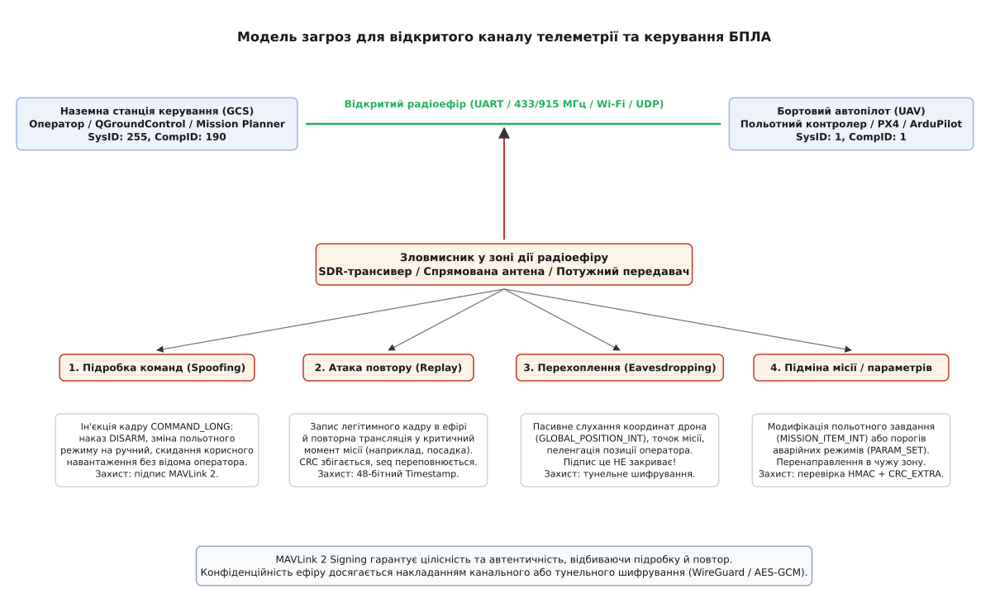
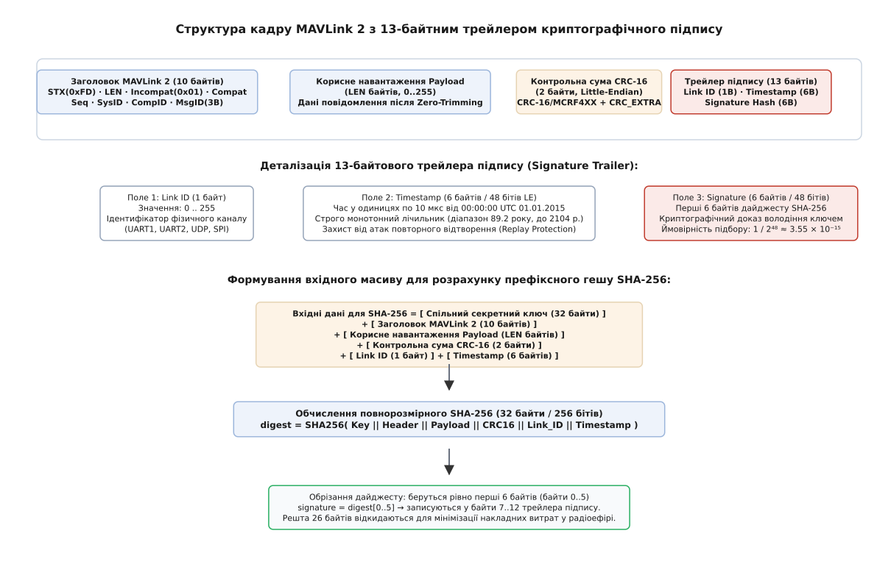
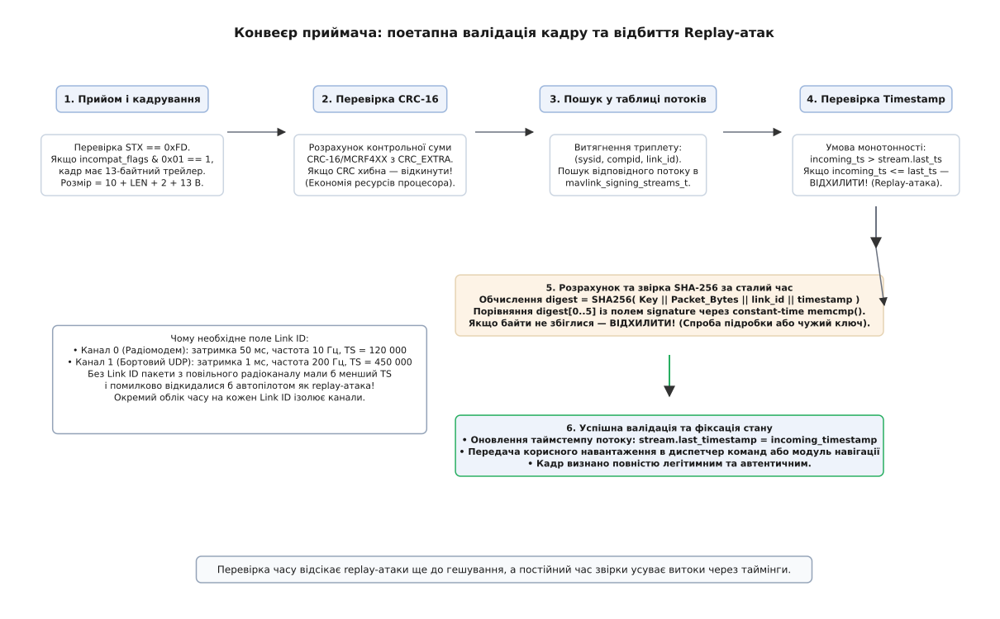
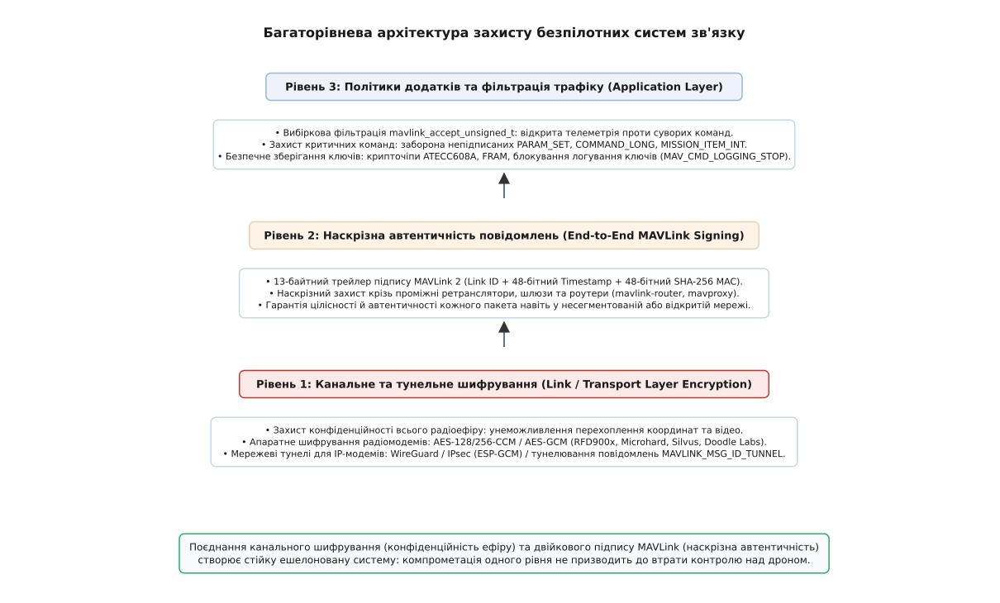

# Безпека MAVLink: автентифікація, захист від підробки та наскрізне шифрування

<preknowlist>
- [Пакет MAVLink](topic:sys-dron/mavlink-packet) — будова двійкового кадру v1/v2, поля заголовка, ідентифікатор типу повідомлення та контрольна сума CRC.
- [Контрольна сума CRC](topic:com-modulation/crc) — алгоритми виявлення випадкових помилок каналу та відмінність перевірки цілісності від криптографічного захисту.
- [HMAC і коди автентичності повідомлень](topic:sf-security/hmac) — механізм гешування з ключем для перевірки автентичності та цілісності даних.
- [Криптографія з відкритим ключем](topic:sf-security/public-key-crypto) — асиметричні ключі, цифровий підпис та схеми узгодження секретів.
</preknowlist>

Безпілотний літак виконує політ за автономним маршрутом на висоті 1500 метрів, передаючи координати й приймаючи корекцію курсу через радіомодем на частоті 915 МГц. Сторонній спостерігач на відстані кількох кілометрів підключає радіотрансивер потужністю 1 Вт і випромінює в ефір 42-байтний двійковий кадр MAVLink із повідомленням `COMMAND_LONG` (`MAV_CMD_DO_SET_MODE`), наказуючи автопілоту перейти в ручний режим без сигналу керування. Оскільки стандартний протокол розрахований на довірений канал і захищає байти лише 16-бітною контрольною сумою CRC для фільтрації випадкового шуму, польотний контролер беззастережно виконує отриману інструкцію, втрачає керування й розбивається.

У відкритому радіоефірі відсутність криптографічного захисту перетворює лінію передачі даних на вектор критичних загроз: від дистанційного перехоплення апарата до розкриття позиції наземного пункту керування.

### Модель загроз для каналів керування безпілотниками

Радіоканал між наземною станцією керування (GCS) та безпілотним літальним апаратом (БПЛА) функціонує в умовах прямої видимості радіохвиль, де будь-який приймач відповідного діапазону здатний перехоплювати або випромінювати сигнали.


*Модель загроз відкритого радіоефіру: чотири класи атак на лінію керування безпілотником та розподіл механізмів протидії між рівнями захисту.*

Аналіз безпеки безпілотних каналів зв'язку виділяє чотири фундаментальні класи атак:

1. **Підробка команд та ін'єкція пакетів (Spoofing / Command Injection):**
   Зловмисник формує довільні кадри MAVLink із коректною контрольною сумою CRC і надсилає їх на бортову адресу автопілота. Приклади руйнівних дій: вимкнення моторів у польоті (`MAV_CMD_COMPONENT_ARM_DISARM`), примусове скидання корисного навантаження або активація аварійної посадки в зоні дії супротивника.

2. **Атака повторного відтворення (Replay Attack):**
   Зловмиснику не потрібно розшифровувати вміст кадрів або змінювати їхні поля. Достатньо записати дамп радіоефіру в момент, коли оператор віддає наказ на повернення додому або знеструмлення дрона, а потім повторно випромінити записану послідовність байтів в ефір на вищій потужності під час виконання важливого етапу місії. У класичному протоколі лічильник послідовності `seq` має розмір лише 8 бітів і циклічно повторюється кожні 256 пакетів (що за темпу 20 Гц триває менше 13 секунд), тому приймач не здатний відрізнити вчорашній наказ від щойно надісланої команди.

3. **Підміна параметрів та польотних завдань (Parameter & Mission Tampering):**
   Модифікація повідомлень транзакцій `PARAM_SET` та `MISSION_ITEM_INT`. Перехоплюючи канал, зловмисник може дистанційно вимкнути захисні геозони (Geofence), змінити критичні пороги аварійних режимів відмови живлення (Failsafe) або непомітно змінити координати точок маршруту, скерувавши апарат у перешкоду.

4. **Пасивне радіоперехоплення та радіопеленгація (Eavesdropping / Traffic Analysis):**
   Зчитування відкритих повідомлень телеметрії `GLOBAL_POSITION_INT` та `GPS_RAW_INT`. Отримані координати дозволяють супротивнику в реальному часі бачити район виконання розвідки, розраховувати траєкторію польоту та визначати точне місцезнаходження антени оператора на землі для завдання артилерійського чи ракетного удару.

Історичні передумови виникнення цих загроз та перші задокументовані випадки перехоплення нешифрованих каналів детально описано у [історії перехоплення каналів БПЛА та народження захищеного MAVLink](topic:sf-security/mavlink-security/hist-uav-security.md).

### Чому контрольна сума CRC-16 не захищає від зловмисника

Поширена інженерна помилка полягає у спробі покластися на штатну контрольну суму [CRC-16/MCRF4XX](topic:com-modulation/crc) як на засіб перевірки цілісності.

Контрольна сума CRC розраховується за лінійним поліноміальним алгоритмом над відкритими байтами кадру:
```
CRC(x ⊕ y) = CRC(x) ⊕ CRC(y)
```

Алгоритм CRC не містить жодного секретного параметра (ключа). Якщо зловмисник змінює значення широти або довготи у структурі повідомлення, йому достатньо витратити менше однієї мікросекунди процесорного часу для перерахунку нового 16-бітного значення CRC. Бортовий розбірник MAVLink перевіряє лише відповідність математичного полінома і беззастережно передає модифіковані дані польотному стеку.

Для гарантування захисту протокол зв'язку зобов'язаний спиратися на криптографічний код автентифікації повідомлення (MAC), обчислення якого неможливе без володіння секретним ключем.

### Двійковий підпис MAVLink 2 (Message Signing)

Для усунення загроз підробки та повторного відтворення у специфікацію MAVLink версії 2 було закладено апаратний та програмний механізм двійкового криптографічного підпису (MAVLink 2 Message Signing).


*Кадр MAVLink 2 з прапорцем MAVLINK_IFLAG_SIGNED містить 13-байтний трейлер підпису: ідентифікатор каналу Link ID, 48-бітний монотонний таймстемп і 48-бітний усічений геш SHA-256 від секретного ключа та байтів пакета.*

Механізм базується на прапорці несумісності `MAVLINK_IFLAG_SIGNED` (байт 2 кадру, біт `0x01` у полі `incompat_flags`). Коли цей біт піднято:
- До кадру після 2 байтів контрольної суми додається спеціальний блок — 13-байтовий трейлер підпису (Signature Trailer).
- Розмір повного фізичного пакета на дроті становить `10 + LEN + 2 + 13 = 25 + LEN` байтів.
- Старі розбірники покоління MAVLink 1 або приймачі без підтримки криптографії негайно відкидають такий кадр за правилом невідомих прапорців несумісності, не дозволяючи сміттєвим байтам потрапити в чергу обробки.

### Анатомія 13-байтового трейлера підпису

Трейлер підпису має суворо фіксовану внутрішню розкладку з трьох полів:

```
+----------+-----------------------------+-----------------------------+
| Link ID  |    Timestamp (48 бітів)     |    Signature (48 бітів)     |
|  1 байт  |  6 байтів (Little-Endian)   |  6 байтів (обрізаний SHA)   |
+----------+-----------------------------+-----------------------------+
  байт 0      байти 1 .. 6                  байти 7 .. 12
```

#### 1. Ідентифікатор інтерфейсу: Link ID (1 байт)
Поле `link_id` займає 1 байт (значення `0 .. 255`) і позначає конкретний фізичний канал передачі даних (UART1 радіомодема, UART2 резервного зв'язку, UDP міст супутнього комп'ютера). Це поле ізолює облік часу між каналами з різною пропускною здатністю та затримками.

#### 2. Монотонний лічильник часу: Timestamp (6 байтів / 48 бітів)
Поле `timestamp` містить 48-бітне ціле число без знака у форматі Little-Endian, яке вимірює час в одиницях по **10 мікросекунд** (тактова частота 100 кГц) від спеціально обраної базової точки відліку — опівночі 1 січня 2015 року за Гринвічем (00:00:00 UTC 01.01.2015).

Діапазон 48-бітного лічильника при кванті 10 мкс становить:
```
T_max = (2⁴⁸ - 1) × 10⁻⁵ с ≈ 2 814 749 767 секунд ≈ 89.2 року
```
Діапазону 89.2 року вистачає для неперервної роботи без переповнення лічильника аж до 2104 року.

Для кожного каналу `link_id` передавач зобов'язаний дотримуватися строгого правила:
```
Timestamp[N] > Timestamp[N - 1]
```
Якщо годинник передавача зазнав затримки чи збою, бібліотека примусово додає щонайменше 1 одиницю (10 мкс) перед підписом кожного наступного пакета.

#### 3. Криптографічний підпис: Signature (6 байтів / 48 бітів)
Поле `signature` містить перші 6 байтів дайджесту геш-функції SHA-256, що слугує криптографічним доказом володіння спільним секретним ключем.

Повний опис структур, констант кадрування та бінарних таблиць наведено у [специфікації та форматах структур підпису MAVLink](topic:sf-security/mavlink-security/api-signing-spec.md).

### Алгоритм розрахунку підпису: префіксний геш SHA-256

Для обчислення поля `signature` протокол MAVLink 2 формує лінійний вхідний масив байтів загальною довжиною `51 + LEN` байтів:

```
Вхідний масив SHA-256 =
    [ Спільний секретний ключ: 32 байти ]
  + [ Заголовок MAVLink 2: 10 байтів (від STX 0xFD до кінця MSG ID) ]
  + [ Корисні дані Payload: LEN байтів (після Zero-Trimming) ]
  + [ Контрольна сума CRC-16: 2 байти (Little-Endian) ]
  + [ Link ID: 1 байт ]
  + [ Timestamp: 6 байтів ]
```

Порядок обчислення:
1. Виконується гешування вхідного масиву алгоритмом SHA-256 (стандарт FIPS 180-4). Отримується 32-байтовий дайджест `digest[32]`.
2. Перші 6 байтів (`digest[0..5]`) копіюються в байти `7..12` трейлера підпису.
3. Решта 26 байтів дайджесту відкидаються.

Включення двох байтів CRC-16 у вхідний масив SHA-256 створює криптографічний захист від атак підміни XML-схеми повідомлення (Schema Confusion Attack). Оскільки байт `CRC_EXTRA` залежить від розташування полів у діалекті MAVLink, підпис стає математично прив'язаним до точної структури типу даних.

### Взаємодія з механізмом Zero-Trimming

Протокол MAVLink 2 містить механізм обтинання нулів (Zero-Trimming): передавач переглядає кінець корисного навантаження повідомлення і відтинає всі нульові байти (`0x00`), відповідно зменшуючи значення поля довжини `LEN` у заголовку кадру.

Вплив Zero-Trimming на розрахунок підпису має критичне інженерне значення:
- **Підпис обчислюється над скороченим масивом:** вхідний блок SHA-256 містить рівно `LEN` байтів реального корисного навантаження, переданого в ефір, а не повну C-структуру.
- **Незмінність на дроті:** якщо проміжний маршрутизатор або проксі-сервер (такий як `mavlink-router`) спробує десеріалізувати повідомлення, відновити нульові байти до повної довжини структури та запакувати його знову, поле `LEN` зміниться, і підпис на кінцевому приймачі стане недійсним.
- Будь-який проміжний вузол зв'язку зобов'язаний пересилати підписані кадри як прозорі двійкові послідовності без модифікації їхнього байтового представлення.

### Математичний аналіз: атаки подовження та ентропія обтинання

У теоретичній криптографії відомо, що проста префіксна конструкція `H(Key || Message)` для геш-функцій сімейства MD5, SHA-1 та SHA-256 (побудованих на структурі Меркла-Дамґорда) є вразливою до атаки подовження повідомлення (Length Extension Attack): знаючи `H(Key || M)` та довжину `M`, зловмисник може додати суфікс `M'` і розрахувати валідний геш `H(Key || M || Padding || M')` без знання ключа.

Чому MAVLink 2 не страждає від цієї атаки:
1. **Жорстка фіксація довжини в заголовку:** розмір корисного навантаження задається 8-бітним полем `LEN` у заголовку пакета, який розташовано на початку кадру і який входить у хешований блок до корисних даних. Приймач зчитує рівно `LEN` байтів.
2. **Розташування таймстемпу та Link ID у хвості:** за корисними даними слідують 2 байти CRC, 1 байт `link_id` та 6 байтів `timestamp`. Зловмисник не може додати байти до середини хешованого масиву, оскільки структура кадру має суворо визначений кінцевий формат.
3. **Обтинання дайджесту:** передача лише 48 бітів відкидає 208 бітів внутрішнього стану SHA-256, що робить неможливим відновлення проміжних векторів ініціалізації для продовження хешування.

Оцінимо ймовірність випадкового підбору 48-бітного підпису:
- Простір станів становить `2⁴⁸ = 281 474 976 710 656 ≈ 2.81 × 10¹⁴`.
- Ймовірність вгадати підпис для одного окремого пакета дорівнює:
  ```
  P = 1 / 2⁴⁸ ≈ 3.55 × 10⁻¹⁵
  ```

Уявимо атаку методом повного перебору безпосередньо в радіоефірі:
- Радіомодем телеметрії на швидкості 57600 бод фізично пропускає не більше 100 пакетів на секунду.
- За максимальної швидкості трансляції підроблених пакетів (100 спроб/с) середній час, необхідний для підбору одного єдиного валідного підпису, становить:
  ```
  T_brute = 2⁴⁷ / (100 спроб/с) ≈ 1.407 × 10¹² секунд ≈ 44 600 років
  ```

Враховуючи, що будь-який підібраний пакет буде прийнято лише у тому випадку, якщо його підбір завершиться до того, як легітимний таймстемп випередить вгадане значення, онлайн-атака підбору стає фізично неможливою. Водночас економія 26 байтів на кожному пакеті (порівняно з повним 32-байтовим HMAC) зменшує накладні витрати на 25–40%, що залишає радіосмугу вільною для польотної телеметрії.

Розрахуємо накладні витрати на смугу пропускання при частоті телеметрії 20 Гц:
```
Накладні байти = 20 пакетів/с × 13 байтів = 260 байтів/с
Бітова швидкість UART = 260 × 10 біт (включно зі старт/стоп бітами) = 2600 біт/с (2.6 кбіт/с)
Частка каналу 57600 бод = 2600 / 57600 ≈ 4.5%
```
Накладні витрати у 4.5% є мінімальною платою за повну гарантію автентичності польоту.

### Конвеєр верифікації та відбиття атак повторного відтворення

Приймач (автопілот або наземна станція) валідує вхідні пакети за суворою конвеєрною схемою.


*Послідовність перевірки вхідного пакета: відсікання пошкоджених кадрів за CRC-16, перевірка монотонності часу потоку та звірка підпису за сталий час.*

#### Етапи конвеєра:

1. **Перевірка CRC-16:** якщо байти пошкоджено завадами радіоефіру, пакет відкидається на першому кроці, що запобігає марнуванню процесорного часу на обчислення SHA-256.
2. **Ідентифікація потоку сесії:** приймач витягує адресу відправника `sysid`, `compid` та поле `link_id`. У внутрішній таблиці стану `mavlink_signing_streams_t` здійснюється пошук відповідного запису.
3. **Перевірка на Replay-атаку:** витягується `incoming_timestamp`. Якщо потік уже активний, перевіряється умова:
   ```
   incoming_timestamp > stream.last_timestamp
   ```
   Якщо `incoming_timestamp <= stream.last_timestamp`, пакет вважається застарілим або повторно випроміненим зловмисником. Пакет **негайно відкидається**, а лічильник помилок кадрування позначається як `MAVLINK_FRAMING_BAD_SIGNATURE`.
4. **Обчислення та звірка SHA-256 за сталий час:**
   Приймач бере збережений 32-байтовий ключ `secret_key`, обчислює SHA-256 над прийнятим пакетом і порівнює перші 6 байтів із полем `signature` трейлера через функцію постійного часу `secure_memcmp()`.
5. **Фіксація стану:**
   Після успішного збігу підписів значення `stream.last_timestamp` оновлюється числом `incoming_timestamp`, а корисні дані передаються польотному диспетчеру.

Повний сирцевий код автомата перевірки та функцій постійного часу наведено у [практичній реалізації рушія підпису та захищеного тунелю](topic:sf-security/mavlink-security/proj-secure-mavlink.md).

### Багатоканальність та роль Link ID

Безпілотник зазвичай має декілька фізичних каналів зв'язку:
- **Канал 0 (Радіомодем 915 МГц):** затримка 50 мс, темп передачі 10 Гц.
- **Канал 1 (Бортовий Ethernet/UDP):** затримка менше 1 мс, темп обміну 200 Гц.

Якби поле `link_id` було відсутнє, виникло б блокування повільного каналу:
1. Бортовий комп'ютер через швидкий UDP збільшує значення `last_timestamp` на автопілоті до великої величини (наприклад, `Timestamp = 500 000`).
2. Одночасно наземна станція надсилає легітимну команду через повільний радіомодем із таймстемпом `Timestamp = 120 000`.
3. Отримавши пакет із радіомодема, автопілот порівнює `120 000` із `500 000`, помилково вважає команду застарілою атакою повтору і **відкидає валідну команду пілота**!

Завдяки розділенню за `link_id` кожен фізичний канал отримує ізольований запис у таблиці потоків, що виключає взаємні блокування.

### Втрата пакетів та зміна порядку доставки (Packet Loss & Reordering)

Реальний радіоефір характеризується завадами, завмираннями сигналу та випадковою втратою пакетів:

1. **Втрата послідовності пакетів:** припустімо, що через завади було втрачено 15 підряд пакетів телеметрії або команд. Коли надходить наступний легітимний пакет, його `incoming_timestamp` є значно більшим за збережений `stream.last_timestamp`. Умова `incoming_timestamp > stream.last_timestamp` успішно виконується, і зв'язок продовжується без затримок.
2. **Зміна порядку пакетів (Out-of-Order Delivery):** якщо через буферизацію в апаратних модемах пакет `N+1` випередив пакет `N`, автопілот успішно приймає пакет `N+1` і фіксує його таймстемп `T[N+1]`. Коли запізнілий пакет `N` із таймстемпом `T[N] < T[N+1]` нарешті надходить, він відхиляється. Для контурів реального часу це правильна системна поведінка: польотний контролер не повинен виконувати застарілі команди, якщо вже надійшли свіжіші інструкції навігації.

### Дрейф годинників та обробка збоїв синхронізації

У польотних контролерах відлік монотонного часу ведеться апаратними таймерами мікроконтролера або годинником реального часу (RTC). Кварцові резонатори в умовах польоту зазнають температурного дрейфу частоти (типове відхилення становить від ±20 до ±50 ppm, що накопичує похибку до 1.7–4.3 секунди на добу).

Особливості обробки дрейфу в MAVLink 2:
1. **Відсутність вимоги глобальної синхронізації UTC:** на відміну від протоколів Kerberos або TLS, де вузли зобов'язані мати однаковий абсолютний час з точністю до секунд, MAVLink 2 вимагає виключно **локальної монотонності відправника**. Приймач не порівнює `incoming_timestamp` зі своїм локальним годинником — він порівнює його лише з останнім отриманим значенням від *цього конкретного відправника* (`stream.last_timestamp`). Навіть якщо годинник наземної станції відстає від годинника автопілота на 5 годин, підпис працює бездоганно, доки станція монотонно нарощує свій таймстемп.
2. **Аварійний перезапуск автопілота в польоті (In-flight Reboot):** якщо польотний контролер перезавантажується внаслідок збою живлення, його оперативна пам'ять обнуляється. Якщо збережене в енергонезалежній пам'яті значення часу буде меншим за таймстемп станції, зв'язок відновиться миттєво. Якщо ж автопілот після старту виставить завеликий час, станція може виконати скидання сесії відправкою підписаного повідомлення `SETUP_SIGNING`.

### Захист критичних транзакцій місій та параметрів

Особливу небезпеку становлять атаки на протоколи завантаження польотних місій та конфігурації параметрів:

#### 1. Захист протоколу місій (Mission Protocol)
Транзакція завантаження маршруту складається з послідовності обміну повідомленнями `MISSION_COUNT` -> `MISSION_REQUEST` -> `MISSION_ITEM_INT` -> `MISSION_ACK`. Якщо підпис активовано, кожна точка маршруту `MISSION_ITEM_INT` завіряється унікальним зростаючим таймстемпом. Зловмисник не може підкинути фальшиву проміжну точку або підмінити висоту польоту, оскільки розбіжність підпису призводить до негайної відправки відповіді `MISSION_ACK` із кодом помилки `MAV_MISSION_INVALID_PARAM` та переривання всієї транзакції.

#### 2. Захист конфігурації параметрів (Parameter Protocol)
Команди зміни параметрів `PARAM_SET` містять 16-символьний ідентифікатор параметра та нове числове значення (наприклад, поріг напруги батареї для повернення додому `FS_BATT_VOLTAGE`). Обов'язковий підпис повідомлень `PARAM_SET` гарантує, що жоден коефіцієнт ПІД-регулятора чи режим відмови failsafe не може бути змінений стороннім передавачем. При цьому запити на читання параметрів `PARAM_REQUEST_READ` можуть залишатися відкритими для вільного моніторингу статусу систем.

### Межа захисту: чому підпис не захищає конфіденційність

Двійковий підпис MAVLink 2 гарантує **автентичність** та **цілісність**, але **не забезпечує конфіденційності**:

```
Повідомлення MAVLink 2 з підписом:
[ Заголовок (відкрито) ] [ Корисні дані Payload (ВІДКРИТО) ] [ CRC ] [ Трейлер підпису ]
```

Корисне навантаження передається відкритим текстом. Сторонній спостерігач із радіоприймачем не може змінити байти або повторити команду, але може вільно читати:
- Координати, висоту та швидкість дрона (`GLOBAL_POSITION_INT`);
- Точки розвідувального маршруту (`MISSION_ITEM_INT`);
- Телеметрію заряду батареї та статус систем (`SYS_STATUS`);
- Команди керування камерою та напрямок огляду оптичного сенсора.

Для захисту від радіоелектронної розвідки необхідне накладання канального та тунельного шифрування.

### Накладання канального та тунельного шифрування

Для захисту конфіденційності ефіру застосовують концепцію **ешелонованої оборони (Defense-in-Depth)**.


*Ешелонування захисту: поєднання канального шифрування радіоефіру, наскрізного підпису MAVLink 2 та вибіркових політик додатків.*

#### 1. Мережеві тунелі для цифрових радіомодемів: WireGuard та IPsec
Сучасні цифрові радіостанції та SDR-модеми (Microhard, Silvus StreamCaster, Doodle Labs Smart Radio) створюють прозору IP-мережу між дроном та наземною станцією. Поверх цієї мережі розгортається криптографічний тунель:
- **WireGuard:** забезпечує автентифіковане шифрування на базі ChaCha20-Poly1305 із мінімальними накладними витратами на заголовок (32 байти на UDP-пакет) та високою швидкістю на вбудованих Linux-модулях.
- **IPsec (ESP-GCM):** стандартне тунелювання трафіку з апаратним прискоренням AES-GCM.

#### 2. Апаратне канальне шифрування послідовних модемів
На низькошвидкісних телеметрійних модемах (RFD900x, SiK) шифрування виконується безпосередньо мікроконтролером радіомодема за алгоритмом **AES-128-CTR** або **AES-256-CCM**. Радіомодем шифрує всі байти UART перед модуляцією в радіоефір і розшифровує їх на приймальному боці.

#### 3. Протокольне тунелювання MAVLink TUNNEL (#385)
Якщо радіолінія використовує стандартні ретранслятори MAVLink, зашифрований пакет пакується в повідомлення `TUNNEL`:

:::tabs
```c
typedef struct __mavlink_tunnel_t {
    uint16_t payload_type;    // 100 = Користувацький AES-256-GCM
    uint8_t  target_system;   // Номер цільового апарата
    uint8_t  target_component;// Номер цільового компонента
    uint8_t  payload_length;  // Довжина шифротексту + IV + Tag (до 128 байтів)
    uint8_t  payload[128];    // IV (12B) + Ciphertext + Auth Tag (16B)
} mavlink_tunnel_t;
```
```cpp
struct MavlinkTunnel {
    uint16_t payload_type{0};
    uint8_t  target_system{0};
    uint8_t  target_component{0};
    uint8_t  payload_length{0};
    std::array<uint8_t, 128> payload{};
};
```
:::

Ретранслятори передають повідомлення `TUNNEL` без розшифрування, а кінцевий польотний контролер розпаковує та верифікує автентифікований шифротекст AES-GCM.

### Життєвий цикл ключів, спарювання та безпечне оновлення

Безпека всієї системи залежить від якості та порядку збереження 256-бітного симетричного секретного ключа.

#### Генерація ключів
Ключі генеруються криптографічно стійкими генераторами випадкових чисел (CSPRNG):
- У Linux/macOS: системний виклик `getrandom()` або читання `/dev/urandom`.
- У Windows: виклик `BCryptGenRandom()`.

#### Процедура первинного спарювання (Pairing)
Оскільки передача відкритого ключа через радіоефір неприпустима, початкове завантаження ключа в автопілот виконується:
1. Через прямий кабель USB на сервісному стенді перед польотом.
2. Через бездротовий інтерфейс ближнього поля (NFC) або зчитування оптичного QR-коду бортовою камерою.

#### Повідомлення SETUP_SIGNING (#256)
Для передачі ключа протокол визначає службове повідомлення:

:::tabs
```c
typedef struct __mavlink_setup_signing_t {
    uint64_t initial_timestamp; // Початковий час станції (48 бітів, одиниці 10 мкс)
    uint8_t  target_system;     // Бортовий номер цільового дрона
    uint8_t  target_component;  // Номер цільового вузла (1 = автопілот)
    uint8_t  secret_key[32];    // 256-бітний симетричний ключ
} mavlink_setup_signing_t;
```
```cpp
struct MavlinkSetupSigning {
    uint64_t initial_timestamp{0};
    uint8_t  target_system{0};
    uint8_t  target_component{0};
    std::array<uint8_t, 32> secret_key{};
};
```
:::

Якщо виникає потреба змінити ключ під час місії, нове повідомлення `SETUP_SIGNING` передається як **підписаний пакет**, завірений старим дійсним ключем.

#### Динамічне узгодження сесійних ключів (Ephemeral ECDH)
У передових безпілотних комплексах застосовується схема узгодження тимчасових ключів сесії на базі протоколу Діффі-Геллмана на еліптичних кривих (ECDH X25519). Наземна станція та автопілот генерують одноразові пари ключів (Ephemeral Key Pairs), обмінюються 32-байтними відкритими точками через повідомлення `TUNNEL`, розраховують спільний секрет і виводять 256-бітний ключ за допомогою функції HKDF (HMAC-based Extract-and-Expand Key Derivation Function). Це забезпечує властивість **досконалої прямої секретності (Perfect Forward Secrecy)**: навіть компрометація довгострокового ключа дрона після завершення польоту не дозволяє розшифрувати записані дампи радіоефіру минулих місій.

#### Захист від витоку через логи: MAV_CMD_LOGGING_STOP
Перед операціями з ключами та конфіденційними налаштуваннями наземна станція надсилає команду `MAV_CMD_LOGGING_STOP` (код 261), щоб унеможливити запис відкритого ключа у польотний журнал на карті пам'яті microSD. У разі втрати апарата накопичувач не міститиме секретних параметрів зв'язку.

#### Енергонезалежне збереження ключів та апаратний захист від зламу (Anti-Tamper)
На польотному контролері ключ зберігається у захищеній пам'яті:
- В енергонезалежній пам'яті FRAM або EEPROM із захистом від запису.
- В апаратних криптографічних чипах безпеки (Secure Element ATECC608A / TPM), які блокують зчитування ключа через апаратний налагоджувач SWD/JTAG.
- Апаратний захист мікроконтролера STM32: активація режиму блокування зчитування Flash-пам'яті RDP Level 2 (Readout Protection), що назавжди відключає інтерфейс налагодження SWD на кристалі.
- Активні лінії стирання ключів (Zeroization): підключення датчиків розтину корпусу до спеціальних апаратних пінів `TAMP` мікроконтролера. У разі фізичного захоплення та спроби демонтажу корпусу збитого БПЛА блок резервного живлення миттєво затирає регістри з секретними ключами за кілька тактів процесора.

### Продуктивність та енергетичний бюджет обчислень на борту

Впровадження криптографічного захисту порушує питання ресурсомісткості та витрати заряду бортового акумулятора:

Профілювання обчислень SHA-256 на мікроконтролерах ARM:
- **STM32F427 (Cortex-M4F, 168 МГц):** виконання функції SHA-256 над 60-байтним блоком займає ~880 тактів ядра, що відповідає **5.24 мікросекунди**.
- **STM32H743 (Cortex-M7, 480 МГц):** програмний розрахунок займає ~620 тактів (**1.29 мікросекунди**), а з використанням апаратного блоку `HASH` — лише **0.38 мікросекунди**.

Оцінка енергетичного бюджету:
- При темпі 20 підписаних пакетів на секунду процесор витрачає на криптографію: `20 × 5.24 мкс = 104.8 мкс на секунду` (тобто **0.0105% процесорного часу**).
- Струм споживання мікроконтролера становить близько 100 мА при 3.3 В (потужність 0.33 Вт). Частка потужності, що витрачається на розрахунок підписів, становить мізерні `0.33 Вт × 0.000105 ≈ 0.035 мВт`.
- Порівняно з енергоспоживанням силової установки дрона (400–2000 Вт) витрати енергії на криптографію складають менше `0.00001%` ємності акумулятора. Криптографічний підпис не скорочує час польоту апарата.

### Гібридна безпека та вибіркова фільтрація трафіку

Повне підписання всього без винятку трафіку не завжди доцільне. Відкрита трансляція загальних повідомлень телеметрії (`HEARTBEAT`, цивільний Remote ID) дозволяє стороннім спостерігачам бачити апарат у повітряному просторі без знання секретного ключа.

Для гнучкого налаштування бібліотека MAVLink підтримує функцію зворотного виклику `mavlink_accept_unsigned_t`:

:::tabs
```c
typedef bool (*mavlink_accept_unsigned_t)(const mavlink_status_t *status, uint32_t msgid);
```
```cpp
using AcceptUnsignedCallback = bool(*)(const mavlink_status_t* status, uint32_t msgid);
```
:::

Політика гібридної безпеки:
- **Непідписані повідомлення дозволено:** `HEARTBEAT`, `SYS_STATUS`, `ATTITUDE`, `GPS_RAW_INT`.
- **Суворий обов'язковий підпис:** `COMMAND_LONG` (озброєння моторів, зміна режимів), `PARAM_SET` (зміна параметрів failsafe), `MISSION_ITEM_INT` (завантаження точок маршруту).

Якщо наказ із критичного списку надходить без валідного підпису, автопілот негайно відхиляє його, запобігаючи несанкціонованому втручанню в керування польотом.

### Практичний приклад: складання та верифікація підписаної команди

Розглянемо повний цикл формування та перевірки підписаної команди в польотному коді. Наземна станція (`sysid = 255`, `compid = 190`) надсилає наказ `MAV_CMD_COMPONENT_ARM_DISARM` на автопілот (`sysid = 1`, `compid = 1`):

:::tabs
```c
#include <mavlink.h>
#include <string.h>

// 1. Спільний 256-бітний ключ
static const uint8_t g_secret_key[32] = {
    0x1A, 0x2B, 0x3C, 0x4D, 0x5E, 0x6F, 0x70, 0x81,
    0x92, 0xA3, 0xB4, 0xC5, 0xD6, 0xE7, 0xF8, 0x09,
    0x11, 0x22, 0x33, 0x44, 0x55, 0x66, 0x77, 0x88,
    0x99, 0xAA, 0xBB, 0xCC, 0xDD, 0xEE, 0xFF, 0x00
};

// 2. Формування та відправка підписаної команди
uint16_t send_signed_arm_command(uint8_t *send_buf, uint8_t channel) {
    mavlink_message_t msg;
    mavlink_command_long_t cmd = {0};

    cmd.target_system    = 1;
    cmd.target_component = 1;
    cmd.command          = MAV_CMD_COMPONENT_ARM_DISARM;
    cmd.confirmation     = 0;
    cmd.param1           = 1.0f; // 1.0 = Озброїти мотори (ARM)

    mavlink_msg_command_long_encode(255, 190, &msg, &cmd);

    // Налаштовуємо структуру підпису
    mavlink_status_t *status = mavlink_get_channel_status(channel);
    mavlink_signing_t signing_ctx = {0};
    mavlink_signing_streams_t streams = {0};

    signing_ctx.flags = MAVLINK_SIGNING_FLAG_SIGN_OUTGOING;
    signing_ctx.link_id = 0;
    signing_ctx.timestamp = 150000000ULL; // Монотонний час станції
    memcpy(signing_ctx.secret_key, g_secret_key, 32);
    signing_ctx.streams = &streams;

    status->signing = &signing_ctx;

    // Пакуємо підписане повідомлення у буфер
    return mavlink_msg_to_send_buffer(send_buf, &msg);
}
```
```cpp
#include <mavlink.h>
#include <array>
#include <span>
#include <vector>
#include <cstring>

class SignedCommander {
public:
    using KeyArray = std::array<uint8_t, 32>;

    explicit SignedCommander(const KeyArray& secret_key, uint8_t link_id = 0)
        : key_(secret_key), link_id_(link_id) {
        signing_ctx_ = {};
        streams_ = {};

        signing_ctx_.flags = MAVLINK_SIGNING_FLAG_SIGN_OUTGOING;
        signing_ctx_.link_id = link_id_;
        signing_ctx_.timestamp = 150000000ULL;
        std::memcpy(signing_ctx_.secret_key, key_.data(), key_.size());
        signing_ctx_.streams = &streams_;
    }

    [[nodiscard]] std::vector<uint8_t> createSignedArmCommand(
        uint8_t channel,
        uint8_t target_sys,
        uint8_t target_comp
    ) {
        mavlink_message_t msg;
        mavlink_command_long_t cmd{};
        cmd.target_system    = target_sys;
        cmd.target_component = target_comp;
        cmd.command          = MAV_CMD_COMPONENT_ARM_DISARM;
        cmd.confirmation     = 0;
        cmd.param1           = 1.0f; // ARM

        mavlink_msg_command_long_encode(255, 190, &msg, &cmd);

        auto* status = mavlink_get_channel_status(channel);
        status->signing = &signing_ctx_;

        std::vector<uint8_t> buffer(MAVLINK_MAX_PACKET_LEN);
        const uint16_t len = mavlink_msg_to_send_buffer(buffer.data(), &msg);
        buffer.resize(len);

        return buffer;
    }

private:
    KeyArray                  key_{};
    uint8_t                   link_id_{0};
    mavlink_signing_t         signing_ctx_{};
    mavlink_signing_streams_t streams_{};
};
```
:::

### Інженерний чеклист розгортання криптографічного захисту

Для успішного запуску захищеного каналу MAVLink у промислових та військових безпілотних комплексах розробникам рекомендується дотримуватися наступного регламенту:

1. **Генерація унікальних ключів на кожен борт:** неприпустимо використовувати однаковий заводський ключ для серії дронів. Компрометація одного збитого апарата не повинна відкривати доступ до решти парку БПЛА.
2. **Активація біта SIGN_OUTGOING на обох кінцях:** станція та автопілот зобов'язані підписувати весь вихідний трафік керування та підтверджень.
3. **Налаштування суворої функції `accept_unsigned`:** заборонити будь-які непідписані пакети `COMMAND_LONG`, `PARAM_SET` та `MISSION_ITEM_INT`.
4. **Вимкнення логування ключів (`MAV_CMD_LOGGING_STOP`):** гарантувати відсутність відкритих секретів на Flash-картах пам'яті польотних реєстраторів.
5. **Апаратне блокування зчитування RDP Level 2:** захистити прошивку та пам'ять польотного контролера від апаратного копіювання через інтерфейс SWD.

Поєднання двійкового підпису на рівні MAVLink 2, ізоляції фізичних інтерфейсів за допомогою Link ID, апаратного шифрування радіоліній, контролю доступу до пам'яті та вибіркової фільтрації команд забезпечує надійний захист каналів керування безпілотними літальними апаратами у найскладніших умовах радіоелектронного протистояння.
