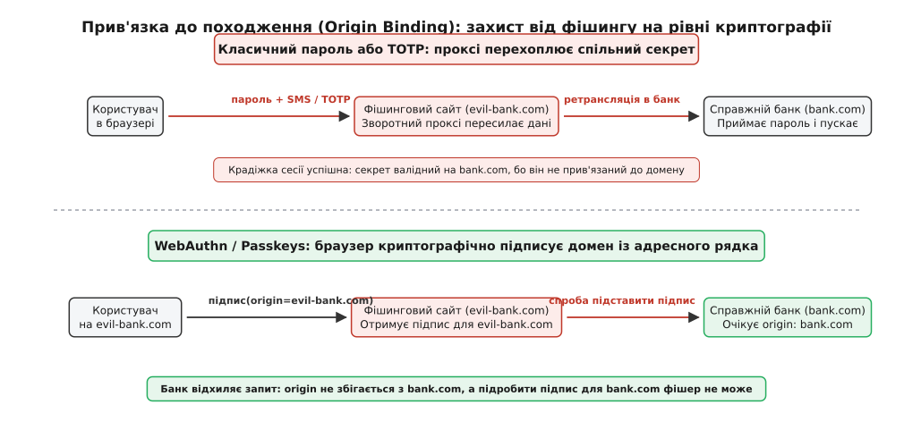
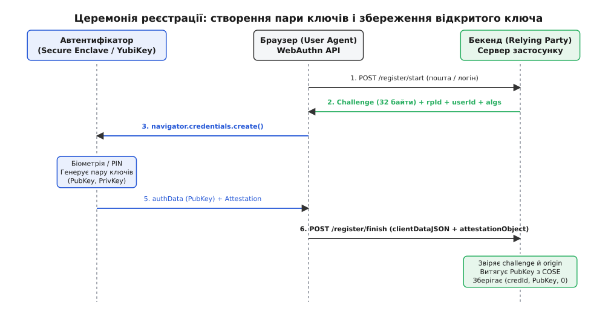
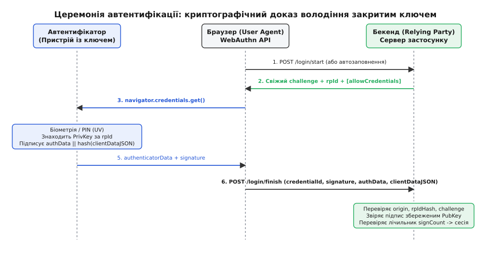
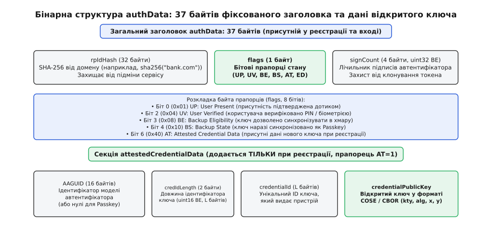
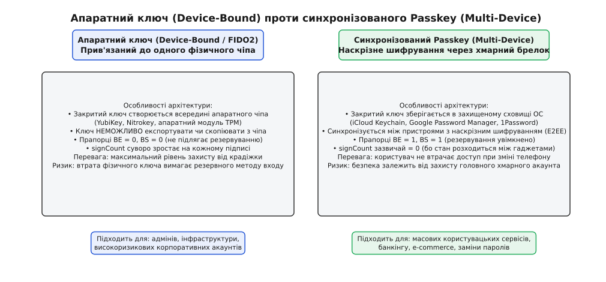

# Passkeys і WebAuthn

<preknowlist>
- [Автентифікація](root:sf-security/authentication) — базові принципи перевірки особи, чому сервер змушений розпізнавати незнайомця на іншому кінці дроту та чому спільні секрети витікають.
- [Хеш і цифровий підпис](root:sf-security/hash-and-digital-signature) — математична асиметрія: як закритий ключ доводить авторство повідомлення без розкриття самого секрету, а відкритий ключ дозволяє будь-кому це перевірити.
- [Багатофакторна автентифікація](root:sf-security/mfa) — фактори «знаєш», «маєш», «є», та чому захист двома незалежними кошиками доказів ламається під час фішингу в реальному часі.
- [TLS](root:sf-security/tls) — шифрування транспортного каналу та поняття походження (origin) у веб-безпеці.
</preknowlist>

Зловмисник реєструє домен `bank-secure-login.com`, копіює дизайн сторінки входу справжнього банку `bank.com` і налаштовує зворотний проксі-сервер (такий як Evilginx). Коли жертва переходить за посиланням із фішингового листа і вводить свій 20-значний складний пароль, проксі-сервер миттєво пересилає його справжньому банку. Банк надсилає на телефон користувача 6-значний SMS-код або запитує одноразовий пароль із додатка-автентифікатора (TOTP). Користувач слухняно вписує цей код у підроблену форму, проксі в ту саму секунду ретранслює його в банк, отримує чинний сесійний токен і залишає користувача з порожніми руками. Жодна довжина пароля, жоден солений повільний хеш у базі даних і жоден другий фактор на базі одноразових кодів не захистили акаунт: доки доказ особи передається відкритим або зашифрованим текстом крізь руки посередника, система лишається беззахисною перед фішингом у реальному часі.

Ця вразливість випливає не з помилок програмістів, а з самої природи спільного симетричного секрету: щоразу, коли користувач передає серверу рядок, який обидві сторони мусять знати для перевірки, цей рядок можна підгледіти або виманити. Щоб зламати цю парадигму, веб-індустрія створила стандарт **WebAuthn** (W3C Web Authentication) та ключі доступу **Passkeys** (англ. *passkey* — ключ доступу, відмичка). Замість пересилання таємниць система спирається на асиметричну криптографію, захищені апаратні чіпи та математичну прив'язку підпису до адреси сайту в браузері.

## Корінь проблеми: чому спільні секрети приречені на витік

У класичній моделі входу сервер і клієнт ділять спільну таємницю. Навіть якщо сервер сумлінно зберігає не відкритий пароль, а його повільний однобічний хеш, під час кожної спроби входу сирий пароль мусить пройти крізь клавіатуру, пам'ять браузера, мережевий сокет і маршрутизатори до сервера.

У цій ланцюговій конструкції найслабшим місцем завжди є людина. Зловмиснику не потрібно зламувати 256-бітний шифр TLS чи шукати колізії в хеш-функції: йому достатньо змусити людину повірити, що вона перебуває на справжньому сайті.

Спроба захиститися другим фактором (MFA) через одноразові коди SMS або TOTP лише скоротила вікно атаки до 30–60 секунд, але не змінила принцип: 6-значний код TOTP — це такий самий спільний секрет короткої дії. Якщо людина здатна прочитати секрет очима і ввести його пальцями у форму, посередник може перехопити його так само швидко, як і звичайний пароль.

Потрібен був механізм із трьома принципово іншими властивостями:
1. **Неможливість викрадення секрету з сервера:** База даних сервера не повинна містити жодної інформації, за допомогою якої можна увійти в акаунт, навіть якщо всю базу буде повністю вкрадено.
2. **Неможливість викрадення секрету з пристрою:** Секретний ключ користувача не повинен передаватися мережею чи експортуватися у відкритому вигляді.
3. **Криптографічна прив'язка до домену (Origin Binding):** Доказ автентифікації повинен автоматично включати точну адресу сайту з адресного рядка браузера, щоб підпис, згенерований для сайту `evil-bank.com`, був математично недійсним для `bank.com`.

Саме на цих трьох засадах альянс FIDO та консорціум W3C збудували архітектуру WebAuthn. Повну хронологію цієї інженерної трансформації — від перших апаратних USB-ключів 2014 року до сучасних стандартів — розкрито у вставці про [історію еволюції від U2F-флешок до Passkeys](root:sf-security/passkeys/hist-fido-evolution.md).

## Архітектурний трикутник WebAuthn

Взаємодія у стандарті WebAuthn відбувається між трьома чітко розмежованими учасниками:

```
[Автентифікатор] <──CTAP2──> [Клієнт / Браузер] <──HTTPS──> [Relying Party / Сервер]
(Touch ID / YubiKey)          (User Agent)                   (Бекенд застосунку)
```

1. **Relying Party (RP):** Сервер вебзастосунку, який перевіряє особу користувача та надає доступ. Сервер зберігає лише **відкриті ключі** користувачів і ніколи не має доступу до їхніх закритих ключів.
2. **Клієнт (Client / User Agent):** Веб-браузер або операційна система. Клієнт керує взаємодією між вебом та апаратурою, контролює захищений адресний рядок, перевіряє походження сторінки (Origin) та формує об'єкт контексту `clientDataJSON`.
3. **Автентифікатор (Authenticator):** Захищений апаратний чіп (Apple Secure Enclave, Android Titan M, модуль TPM або зовнішній USB-токен YubiKey) чи криптографічно захищений менеджер паролів. Автентифікатор генерує асиметричні пари ключів, надійно ізолює закриті ключі від операційної системи та виконує криптографічний підпис лише після локального підтвердження присутності користувача (дотик, сканування відбитка пальця чи розпізнавання обличчя).

Зв'язок між браузером і сервером відбувається через стандартні виклики HTTPS. Зв'язок між браузером та зовнішнім апаратним автентифікатором стандартизовано бінарним протоколом **CTAP2** (Client to Authenticator Protocol) поверх USB HID, NFC або Bluetooth Low Energy.

## Як Origin Binding робить фішинг неможливим

Головна суперсила WebAuthn — вбудована стійкість до фішингу на рівні криптографічного протоколу. Розгляньмо, як система поводиться в момент атаки із застосуванням зворотного проксі-сервера.


*Механізм захисту від фішингу: браузер самостійно підставляє домен із адресного рядка в підписуваний блок даних. Справжній банк миттєво виявляє підміну походження і відхиляє запит, унеможливлюючи атаку посередника.*

Коли користувач потрапляє на підроблений сайт `https://evil-bank.com`, шкідлива сторінка виконує виклик JavaScript `navigator.credentials.get()`.

Далі розгортається автоматичний ланцюг захисту:
1. Браузер бере адресу з адресного рядка (`https://evil-bank.com`) і самостійно записує її в поле `origin` службового об'єкта `clientDataJSON`. Шкідливий JavaScript не має технічної можливості підробити або змінити це поле.
2. Браузер обчислює SHA-256 хеш від домену `evil-bank.com` і передає його автентифікатору як `rpIdHash`.
3. Автентифікатор шукає у своїй захищеній пам'яті закритий ключ, прив'язаний до домену `evil-bank.com`. Оскільки ключ користувача створювався для домену `bank.com`, автентифікатор або взагалі не знаходить відповідного ключа (і відхиляє запит), або (якщо користувач реєструвався і на підробленому сайті) підписує виклик закритим ключем, випущеним суто для `evil-bank.com`.
4. Зловмисник отримує цей підпис і намагається переслати його справжньому серверу `bank.com`.
5. Бекенд `bank.com` розпаковує отриманий `clientDataJSON` і звіряє поле `origin`. Сервер бачить `origin: "https://evil-bank.com"`, тоді як очікується `origin: "https://bank.com"`.
6. Сервер миттєво відхиляє автентифікацію.

Атака зазнає краху. Підробити підпис для справжнього банку зловмисник не здатний, бо закритий ключ для `bank.com` замкнений усередині апаратного чіпа і видає підписи лише тоді, коли в адресному рядку стоїть справжній домен `bank.com`.

### Безпека суфіксів домену: захист на межі eTLD+1

Прив'язка до походження спирається на суворе правило: `rpId` має бути або точним доменом сторінки, або його суфіксом, що входить до зони реєстрації (effective Top-Level Domain plus one, eTLD+1).

Якщо ваш сервіс працює на адресі `https://auth.login.example.com`:
- Дозволені значення `rpId`: `"auth.login.example.com"`, `"login.example.com"`, `"example.com"`.
- Заборонені значення: `"com"`, `"net"`, `"co.uk"` (публічні суфікси загального користування).

Браузер звіряє запитаний `rpId` із міжнародним реєстром Public Suffix List (PSL). Це блокує небезпечні сценарії на хостингах спільного користування. Наприклад, якщо користувач має сайт на `https://alice.github.io`, він не може встановити `rpId: "github.io"`, щоб спробувати перехопити ключі сусіднього сайту `https://bob.github.io`. Браузер знає, що `github.io` є публічним суфіксом у списку PSL, і негайно блокує такий виклик винятком `SecurityError`.

## Церемонія реєстрації: народження пари ключів

Реєстрація у WebAuthn називається **церемонією створення облікових даних** (Attestation Ceremony; лат. *attestari* — свідчити, підтверджувати). Її мета — згенерувати на пристрої нову пару асиметричних ключів, передати відкритий ключ на сервер і зберегти зв'язку між користувачем та новим ідентифікатором ключа.


*Послідовність реєстрації: Relying Party видає разовий челендж, автентифікатор генерує пару ключів всередині захищеного чіпа, а сервер зберігає відкритий ключ та ідентифікатор.*

Процес реєстрації складається з таких послідовних кроків:

1. **Запит опцій реєстрації:** Клієнт повідомляє сервер про намір створити новий ключ. Бекенд генерує 32 байти криптографічно випадкового челенджу, зберігає його в тимчасовій сесії та повертає браузеру об'єкт `PublicKeyCredentialCreationOptions`. Якщо у користувача вже є раніше зареєстровані ключі, сервер передає їхні ідентифікатори в масиві `excludeCredentials`: це підказує браузеру не створювати дублікат ключа, якщо користувач торкнеться того самого апаратного токена, який уже прив'язаний до цього акаунта.
2. **Виклик апаратного API:** Браузер викликає функцію `navigator.credentials.create({ publicKey: options })`. Операційна система відкриває системний діалог і запитує у користувача підтвердження (відбиток пальця Touch ID, сканування обличчя Face ID або введення PIN-коду апаратного токена).
3. **Генерація пари ключів:** Захищений криптопроцесор перевіряє біометрію і генерує свіжу пару ключів на еліптичній кривій NIST P-256 (алгоритм ES256 / ECDSA). Закритий ключ записується у захищену пам'ять чіпа і ніколи її не покидає.
4. **Формування відповіді автентифікатора:** Автентифікатор формує двійковий блок даних `authData`, куди поміщає хеш домену сайту, прапорці стану, лічильник підписів та згенерований відкритий ключ разом із його новим ідентифікатором `credentialId`.
5. **Формування клієнтських даних:** Браузер упаковує походження сайту та початковий челендж у JSON-структуру `clientDataJSON`.
6. **Відправка на бекенд:** Браузер передає серверу двійковий об'єкт `attestationObject` (що містить `authData`) та `clientDataJSON`.
7. **Серверна валідація:** Бекенд розбирає структури даних, перевіряє збіг челенджу, походження сторінки, валідність прапорців присутності користувача, видобуває відкритий ключ із двійкового формату COSE і зберігає трійку `(userId, credentialId, publicKey)` у базі даних.

Усі параметри конфігурації виклику `create()` та поля двійкових відповідей систематизовано у [довіднику двійкових структур, полів та алгоритмів верифікації](root:sf-security/passkeys/api-webauthn-ceremonies.md).

## Церемонія автентифікації: доказ володіння без передачі секрету

Коли користувач повертається на сайт, виконується **церемонія автентифікації** (Assertion Ceremony; лат. *asserere* — стверджувати, заявляти). Це математичний доказ того, що клієнт володіє закритим ключем, без розкриття самого ключа.


*Послідовність входу: сервер надсилає свіжий випадковий челендж, автентифікатор підписує його закритим ключем, а сервер перевіряє підпис відкритим ключем із бази даних.*

Кроки церемонії входу:

1. **Запит челенджу входу:** Браузер запитує у сервера параметри входу. Сервер генерує новий випадковий 32-байтний челендж і повертає `PublicKeyCredentialRequestOptions`.
2. **Виклик автентифікації:** Браузер викликає `navigator.credentials.get({ publicKey: options })`.
3. **Локальна верифікація:** Автентифікатор вимагає від користувача підтвердити присутність (дотик або біометрія). Після успішної перевірки автентифікатор знаходить закритий ключ, прив'язаний до домену `rpId`.
4. **Створення цифрового підпису:** Автентифікатор формує блок `authData` (де оновлює лічильник підписів `signCount`) і обчислює цифровий підпис ECDSA над конкатенацією:
   ```
   SignedData = authData || SHA-256(clientDataJSON)
   ```
5. **Перевірка на бекенді:** Сервер знаходить раніше збережений відкритий ключ за `credentialId`, обчислює `SHA-256(clientDataJSON)` і перевіряє валідність підпису над `authData || hash`.
6. **Контроль лічильника підписів:** Якщо отриманий лічильник `signCount` більший за збережений у базі, сервер оновлює лічильник і створює сесію. Якщо ж новий лічильник менший або дорівнює збереженому (для фізичних токенів), це вказує на ймовірне клонування апаратного чіпа, і сесія блокується.

## Анатомія двійкових даних: структура authData та формат COSE

На відміну від звичних веб-форматів на базі JSON, ядро WebAuthn оперує компактними двійковими структурами для сумісності з мікроконтролерами смарт-карток та обмеженою пам'яттю апаратних токенів. Головним буфером є `authData` (дані автентифікатора).


*Розкладка буфера authData: перші 37 байтів фіксовані для всіх операцій; секція даних відкритого ключа додається лише під час реєстрації.*

Структура `authData` містить обов'язковий заголовок довжиною рівно 37 байтів:

1. **`rpIdHash` (байти 0..31):** 32-байтний SHA-256 хеш доменного імені сайту. Захищає від підміни домену.
2. **`flags` (байт 32):** 8-бітова маска станів автентифікатора:
   - Біт 0 (`0x01`, **UP — User Present**): користувач підтвердив присутність фізичним дотиком до сенсора.
   - Біт 2 (`0x04`, **UV — User Verified**): користувача верифіковано локальним PIN-кодом або біометрією.
   - Біт 3 (`0x08`, **BE — Backup Eligibility**): прапорець придатності ключа до резервного копіювання (Passkey).
   - Біт 4 (`0x10`, **BS — Backup State**): ключ у даний момент синхронізовано з хмарою.
   - Біт 6 (`0x40`, **AT — Attested Credential Data**): наявність секції новоствореного ключа (присутній тільки під час реєстрації).
3. **`signCount` (байти 33..36):** 32-бітне беззнакове ціле число (uint32 Big-Endian) — монотонно зростаючий лічильник згенерованих підписів.

### Відкритий ключ у форматі COSE (RFC 9052)

Під час реєстрації всередині `authData` передається відкритий ключ, закодований у бінарному форматі CBOR / COSE (CBOR Object Signing and Encryption). Для еліптичної кривої NIST P-256 (алгоритм ES256) словник COSE містить числові ключі замість рядків:

```
{
   1: 2,           # kty: EC2 (тип ключа — еліптична крива)
   3: -7,          # alg: ES256 (ECDSA з SHA-256)
  -1: 1,           # crv: P-256 (ідентифікатор кривої)
  -2: <32 байти>,  # x: координата точки X на еліптичній кривій
  -3: <32 байти>   # y: координата точки Y на еліптичній кривій
}
```

Серверний обробник зчитує ці 32-байтні координати X та Y, додає префікс `0x04` (позначка нестисненої точки) та стандартний ASN.1 заголовок кривої `prime256v1`, отримуючи стандартний сертифікатний відкритий ключ SubjectPublicKeyInfo (SPKI DER), сумісний із криптографічними модулями Node.js `crypto`, WebCrypto чи OpenSSL. Повноцінний вихідний код парсера та верифікатора наведено у [повній практичній реалізації верифікатора на бекенді](root:sf-security/passkeys/proj-passkey-verification.md).

## Криптографічна стійкість підпису: захист від витоку ентропії

Цифровий підпис ECDSA вимагає для кожного нового повідомлення генерації унікального секретного випадкового числа `k` (nonce). Якщо генератор випадкових чисел автентифікатора видасть однакове значення `k` для двох різних підписів або якщо `k` буде зміщеним через слабкий генератор, зловмисник зможе за допомогою простого модульного віднімання обчислити закритий ключ пристрою (класична катастрофа 2010 року, коли через повтор `k` у консолях Sony PlayStation 3 було викрито головний закритий ключ підпису коду).

Щоб унеможливити такі атаки, сучасні чіпи WebAuthn реалізують **детермінований ECDSA** (RFC 6979) або перехід на алгоритм **Ed25519** (EdDSA). У RFC 6979 значення `k` обчислюється детерміновано через криптографічний HMAC від закритого ключа та хешу повідомлення. Таким чином, випадкова помилка апаратного генератора ентропії більше не може скомпрометувати закритий ключ облікового запису.

## Апаратні ключі проти синхронізованих Passkeys

З появою стандарту WebAuthn виникло два принципово різні підходи до керування закритими ключами, кожен із яких орієнтований на свій клас загроз і зручності.


*Порівняння моделей: апаратний фізичний токен забезпечує максимальну ізоляцію закритого ключа, тоді як синхронізований Passkey усуває проблему втрати доступу при зміні пристрою.*

### 1. Прив'язані до пристрою ключі (Device-Bound Credentials)
Це класична модель безпеки апаратних токенів (YubiKey, смарт-картки, апаратні модулі TPM). Закритий ключ генерується всередині захищеного кремнієвого чіпа і фізично не може бути скопійований або експортований за межі цього чіпа.

- **Переваги:** Абсолютний захист від викрадення через злам операційної системи чи хмарного акаунта. Навіть якщо комп'ютер повністю скомпрометовано вірусом, зловмисник не може скопіювати ключ на іншу машину. Лічильник `signCount` строго зростає при кожному вході, гарантуючи виявлення будь-яких спроб клонування.
- **Недоліки:** Якщо користувач загубив фізичний USB-ключ, доступ до акаунта втрачається назавжди, якщо заздалегідь не було додано резервний ключ.

### 2. Синхронізовані ключі доступу (Multi-Device Passkeys)
Це споживча революція, реалізована спільними зусиллями Apple, Google та Microsoft у 2022 році. Закритий ключ зберігається в захищеному сховищі операційної системи та автоматично синхронізується між усіма пристроями користувача через хмарний брелок (iCloud Keychain, Google Password Manager, Windows Hello).

- **Переваги:** Безшовний користувацький досвід. Купивши новий iPhone або ноутбук і увійшовши у свій Apple ID чи Google Account, користувач миттєво отримує доступ до всіх своїх сайтів без потреби заново налаштовувати вхід.
- **Криптографічний захист:** Синхронізація захищена **наскрізним шифруванням (E2EE)**. Хмарні сервери Apple або Google зберігають лише зашифровані шифротексти, ключі розшифрування до яких обчислюються локально на пристроях користувача на базі апаратного пароля розблокування екрана та ключів Secure Enclave.
- **Особливості:** Оскільки один і той самий ключ використовується паралельно на кількох пристроях без постійного зв'язку між ними, лічильник підписів `signCount` у синхронізованих Passkeys зазвичай повертає 0. Бекенд розпізнає такі ключі за прапорцями `BE = 1` (Backup Eligibility) та `BS = 1` (Backup State) у байті `flags`.

> 🔧 **Навіщо це.** Обираючи стратегію автентифікації для веб-сервісу, архітектор враховує профіль ризику. Для масового споживчого сектору (інтернет-магазини, соціальні мережі, фінтех) синхронізовані Passkeys є ідеальним рішенням: вони усувають фішинг і водночас позбавляють службу підтримки від мільйонних витрат на відновлення забутих паролів. Для критичної інфраструктури (серверні консолі AWS/GCP, адміністративні панелі банків, доступ до продакшн-баз) політики безпеки вимагають виключно Device-Bound ключі на фізичних токенах із забороною хмарного резервування (`BE = 0`).

## Міжпристроєвий вхід через QR-код і BLE (Транспорт Hybrid)

Часто виникає ситуація, коли користувач хоче увійти у свій обліковий запис на комп'ютері колеги або на смарт-телевізорі, де немає біометричного датчика і куди не підключено його особистий хмарний брелок.

Для цього стандарт WebAuthn визначає міжпристроєвий транспорт **Hybrid** (відомий як caBLE — Client to Authenticator over BLE):

1. **Показ QR-коду:** Браузер на комп'ютері генерує одноразову пару ключів на кривій P-256 і показує на екрані QR-код, що містить відкритий ключ та випадковий секрет тунелю.
2. **Сканування камерою:** Користувач сканує код камерою свого смартфона.
3. **Радіоперевірка близькості:** Телефон і комп'ютер починають транслювати та приймати короткі сигнали Bluetooth Low Energy (BLE). Якщо комп'ютер бачить радіосигнал телефону, це підтверджує фізичну присутність смартфона поруч із комп'ютером. Цей крок критично важливий: він захищає від атак, коли зловмисник транслює екран із QR-кодом жертві через інтернет.
4. **Зашифрований WebSocket-тунель:** Обидва пристрої підключаються до захищеного релею FIDO Relay і встановлюють наскрізне шифрування за протоколом Noise.
5. **Виконання підпису:** Телефон запитує Face ID або відбиток пальця, знаходить збережений Passkey, підписує виклик і передає `authData` назад на комп'ютер крізь зашифрований тунель.

## Розширення PRF: шифрування клієнтських даних на базі Passkey

WebAuthn використовується не лише для входу, але й для захисту конфіденційних даних за моделлю Zero-Knowledge. Розширення **PRF (Pseudo-Random Function)** дозволяє отримувати детерміновані симетричні ключі шифрування безпосередньо з апаратного чіпа автентифікатора.

Під час кожної операції бекенд або клієнтський JavaScript передає автентифікатору фіксовану сіль (наприклад, рядок `"vault-encryption-salt"`). Автентифікатор обчислює однобічну функцію HMAC-SHA-256 від цієї солі та внутрішнього секрету ключа:

```
DerivedKey = HMAC-SHA-256(PasskeySecret, Salt)
```

Отриманий 256-бітний симетричний ключ використовується клієнтським застосунком для шифрування локальної бази даних (наприклад, сховища паролів у 1Password чи медичних записів у захищеному сховищі) за алгоритмом AES-256-GCM. Якщо сервер буде зламано, зловмисник отримає лише зашифровані блоки, розшифрувати які можна лише маючи фізичний доступ до Passkey користувача.

## Discoverable Credentials та умовний інтерфейс (Conditional UI)

У ранніх версіях двофакторної автентифікації користувач мусив спочатку ввести свій логін у форму, щоб сервер міг знайти його відкритий ключ і надіслати список дозволених ключів у полі `allowCredentials`.

Сучасні Passkeys використовують концепцію **Discoverable Credentials** (раніше відому як Resident Keys — резидентні ключі). Під час створення ключа автентифікатор зберігає всередині свого захищеного сховища не лише закритий ключ, але й ідентифікатор сайту `rpId` та бінарний дескриптор користувача `userId`.

Завдяки цьому стає можливим повністю безпарольний вхід в один дотик:

1. На сторінці входу поле логіна має спеціальний HTML-атрибут:
   ```html
   <input type="text" name="username" autocomplete="username webauthn" />
   ```
2. JavaScript на сторінці викликає `navigator.credentials.get()` з опцією `mediation: "conditional"` та порожнім масивом `allowCredentials`:
   ```javascript
   const credential = await navigator.credentials.get({
     publicKey: {
       challenge: serverChallenge,
       rpId: "example.com",
       userVerification: "preferred",
     },
     mediation: "conditional",
   });
   ```
3. Щойно користувач ставить курсор у поле логіна, браузер виводить стандартну системну випадаючу підказку менеджера паролів із пропозицією увійти за допомогою збереженого Passkey.
4. Користувач торкається сканера відбитка пальця, пристрій підписує челендж і разом із підписом повертає `userHandle` (бінарний ID користувача).
5. Сервер отримує відповідь, за `userHandle` знаходить акаунт у базі даних, перевіряє підпис і миттєво відкриває сесію.

Користувачеві більше не потрібно згадувати, під якою поштою чи логіном він реєструвався: пристрій сам повідомляє серверу, кому належить підпис.

## Крайові випадки, відновлення доступу та безпечні дефолти

Перехід на безпарольну архітектуру змінює правила проектування життєвого циклу облікового запису:

### 1. Підтримка кількох ключів на один акаунт
Користувач повинен мати можливість додати кілька незалежних ключів доступу (наприклад, робочий ноутбук під керуванням Windows Hello та особистий телефон на iOS). Видалення одного ключа з особистого кабінету не повинно впливати на решту пристроїв.

### 2. Відновлення доступу без зниження планки безпеки
Найпоширеніша помилка впровадження WebAuthn — створення ідеального криптографічного захисту на формі входу із одночасним залишенням дірявих дверей поруч у вигляді класичного «Скинути пароль через SMS-код». Якщо зловмисник може перехопити SMS через атаку SIM-Swapping і скинути доступ до акаунта, наявність Passkey не захистить користувача.

Безпечні альтернативи відновлення:
- Вимога наявності щонайменше двох зареєстрованих Passkeys або одного апаратного токена та одного хмарного брелока;
- Одноразові аварійні коди відновлення (Recovery Codes), згенеровані під час реєстрації, які користувач зберігає у безпечному місці (роздруковані або у сейфі);
- Делеговане відновлення через довірених контактів (Social Recovery) або підтвердження особи через верифікований документ у службі підтримки.

### 3. Захист від атак повтору (Replay Attacks)
Кожен криптографічний челендж має бути згенерований джерелом криптографічно стійких псевдовипадкових чисел (CSPRNG), мати довжину не менше 32 байтів, термін життя не більше 2 хвилин і знищуватися в базі даних негайно після першої ж спроби перевірки — незалежно від того, успішним був підпис чи ні.

## Що лишається в сухому залишку

Passkeys та WebAuthn — це не косметичне покращення паролів, а повна зміна парадигми веб-безпеки.

Замість передачі симетричного тексту, який знають обидві сторони і який можна перехопити чи виманити, система використовує математично доведений принцип: довести володіння закритим ключем через цифровий підпис разового виклику. Завдяки криптографічній прив'язці підпису до адреси в браузері (Origin Binding) фішинг у реальному часі стає неможливим, а зламана база даних Relying Party більше не дає зловмисникам нічого, крім непотрібних їм відкритих ключів.

Поєднання апаратної ізоляції ключів усередині захищених чіпів із наскрізним шифруванням у хмарних брелоках дозволило вперше в історії обчислювальної техніки поєднати абсолютну математичну стійкість до мережевих атак із бездоганною зручністю входу в один дотик.
