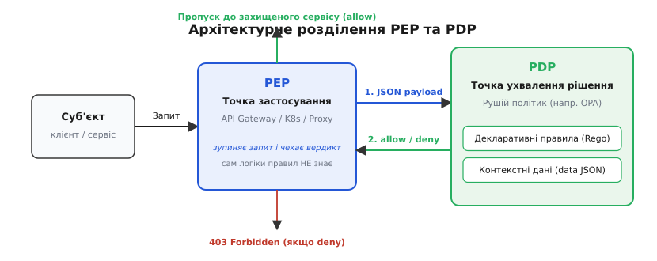
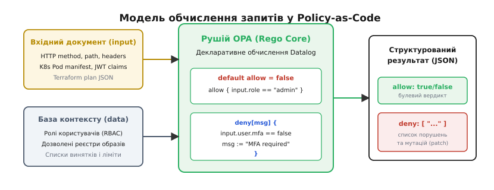
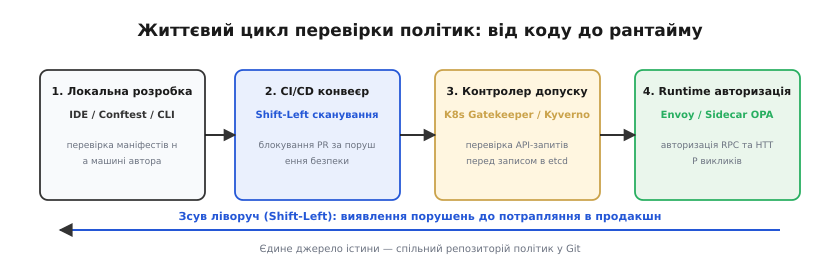
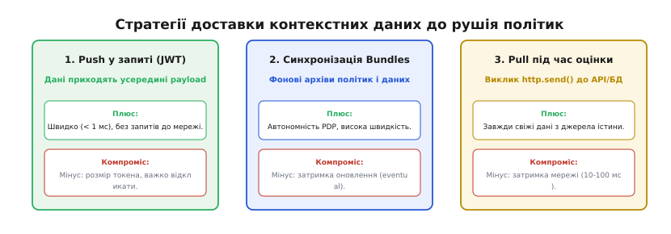

# Політики безпеки як код (Policy-as-Code, OPA / Rego)

<preknowlist>
- [Моделі авторизації](topic:sf-security/authorization-models) — як влаштоване розмежування прав (RBAC, ABAC, ReBAC) і чому доступ перевіряють окремо від автентифікації.
- [Інфраструктура як код](topic:sf-release/infrastructure-as-code) — декларативний опис ресурсів у вигляді конфігурацій та стан відтворення.
- [Принцип найменших привілеїв](topic:sf-security/least-privilege) — надання лише необхідного мінімуму прав та заборона за замовчуванням (*deny-by-default*).
- [Декларативне й імперативне](topic:sf-lang/declarative-vs-imperative) — опис цільового стану замість послідовності кроків виконання.
- [Аудит-лог як вузол](topic:sf-security/audit-logging) — фіксація кожного запиту й ухваленого рішення для невідворотності перевірки.
</preknowlist>

У ніч на п'ятницю черговий інженер оновлює конфігурацію кластера Kubernetes: у маніфесті розгортання фонового сервісу обробки зображень випадково залишаються прапорці `hostNetwork: true` та `privileged: true`. Корпоративний регламент безпеки на шістдесят сторінок у форматі PDF суворо забороняє запуск привілейованих контейнерів у виробничому контурі, проте конвеєр автоматичного розгортання застосовує зміни за сорок п'ять секунд. Синтаксис файлу YAML бездоганний, інструменти статичного аналізу коду мовчать, а співробітники відділу безпеки не чергують о третій ночі для ручної перевірки кожного запиту на злиття змін. Через дві години скомпрометована через уразливу сторонню бібліотеку програма отримує прямий доступ до пам'яті сусідніх процесів вузла та ключів шифрування бази даних.

Ця аварія розкриває фундаментальний розрив між швидкістю сучасної розробки та традиційними методами забезпечення безпеки. Коли інфраструктура розгортається сотні разів на добу за допомогою декларативних конфігурацій, паперові інструкції, чеклісти та ручні узгодження стають головним гальмом або просто ігноруються. 

Єдиний спосіб подолати цей розрив — перетворити самі правила безпеки на програмний код (англ. *Policy-as-Code*, PaC; грец. *πολιтеία* — державний устрій, порядок). Правила описуються декларативними мовами, зберігаються у системі контролю версій Git, тестуються модульними тестами та автоматично обчислюються незалежним програмним рушієм перед кожною зміною інфраструктури чи виконанням API-запиту.

---

### Чому вшиті перевірки розвалюються на масштабі

Найпоширеніша спроба автоматизувати правила без виділеного рушія — це вбудовування перевірок умов безпосередньо у вихідний код кожного окремого сервісу через імперативні оператори розгалуження `if/else`. 

Така схема здається простою лише для перших двох мікросервісів, але в розподіленій системі з десятків поліглотних компонентів вона швидко породжує чотири непереборні проблеми:

1. **Дублювання та розсинхронізація правил**: Якщо правило вимагає наявності багатофакторної автентифікації для операцій понад десять тисяч гривень, його доводиться реалізовувати окремо мовою Go у платіжному шлюзі, мовою Python у бекенді мобільного клієнта, мовою TypeScript у вебпорталі та мовою C++ у внутрішній торговельній черзі. Щойно поріг суми або вимоги до криптографічного алгоритму змінюються, інженери мусять одночасно модифікувати чотири різні кодові бази, проходити чотири цикли регресійного тестування та узгоджувати розгортання. У проміжку між цими релізами виникає «вікно розсинхронізації», коли частина системи працює за старими вразливими правилами.
2. **Неможливість зсуву перевірок ліворуч (*Shift-Left*)**: Якщо логіка авторизації сидить глибоко всередині скомпільованого бінарного коду сервісу, неможливо перевірити конфігурацію хмарного ресурсу або маніфест Kubernetes на етапі створення запиту на злиття (*Pull Request*). Щоб дізнатися, чи дозволена операція, доводиться запускати весь стек сервісів у тестовому середовищі, що робить зворотний зв'язок повільним і дорогим.
3. **Відсутність централізованого аудиту**: Коли інспектор запитує: «Хто саме та на яких підставах мав доступ до фінансових звітів у вівторок о 14:00?», доводиться збирати розрізнені текстові логи десятків застосунків, які форматують записи по-різному або взагалі не фіксують причину ухвалення рішення.
4. **Змішування бізнес-логіки та вимог безпеки**: Програміст, який пише сервіс генерації PDF-звітів, змушений тримати в голові сотні корпоративних нормативів щодо рівнів доступу користувачів, географічних обмежень IP-адрес та термінів дії сертифікатів. Це ускладнює код і призводить до помилок під час рефакторингу.

Щоб вийти з цієї пастки, необхідно ізолювати логіку правил від механізму їхнього технічного виконання.

---

### Архітектурний розподіл: Точка застосування (PEP) та Точка рішення (PDP)

Фундаментальний принцип парадигми «Політики як код» полягає в суворому розділенні відповідальності між двома системними вузлами: точкою застосування політики (англ. *Policy Enforcement Point*, PEP) та точкою ухвалення рішення (англ. *Policy Decision Point*, PDP).


*Архітектурне розв'язання точки застосування (PEP) та точки ухвалення рішень (PDP): перевірка безпеки виноситься в окремий стандартизований виклик.*

**Точка застосування (PEP)** — це компонент інфраструктури, через який безпосередньо проходить мережевий трафік або запит на зміну стану:
- Зворотний проксі-сервер або API-шлюз (Envoy, Nginx, Traefik);
- Контролер допуску Kubernetes (*Kubernetes Admission Webhook*);
- Захищений бінарний сервіс або бекенд-додаток;
- Конвеєр неперервної інтеграції (GitHub Actions, GitLab CI).

Головна властивість PEP: він **не містить жодної бізнес-логіки правил**. Його завдання — зупинити запит, сформувати стандартний структурований документ із контекстом операції (у форматі JSON) і надіслати його до PDP. Отримавши від PDP чітку відповідь — «дозволити» (`allow`), «заборонити» (`deny`) або «застосувати зміни» (`mutate`), — PEP виконує технічну дію: або пропускає запит далі, або повертає клієнту статус `403 Forbidden`, або відхиляє злиття гілки в репозиторії.

**Точка ухвалення рішення (PDP)** — це автономний рушій обчислення правил (наприклад, Open Policy Agent, OPA):
- Він не знає нічого про специфіку мережевих сокетів, протоколи HTTP/gRPC чи структури даних конкретного бізнес-додатку;
- Він отримує на вхід абстрактне синтаксичне дерево або документ JSON `input`, зіставляє його з базою декларативних правил і завантажених статичних даних `data`, після чого обчислює результат.

Такий поділ дає змогу змінити правила безпеки для всієї організації за лічені секунди — достатньо оновити репозиторій політик у Git. Точки PEP автоматично почнуть отримувати нові вердикти від PDP, без перезапуску, перекомпіляції чи перерозгортання жодного клієнтського сервісу. Детальніше про те, як ця архітектура викристалізувалася у боротьбі з громіздкими корпоративними стандартами початку 2000-х років, можна прочитати в [історії переходу від паперових регламентів та XACML до декларативних обчислюваних правил](topic:sf-security/policy-as-code/hist-pac-evolution.md).

---

### Чому декларативна логіка Datalog: Рушій Rego

Для реалізації PDP мови загального призначення (Python, JavaScript, Ruby чи Lua) непридатні через принципові обмеження. Якщо дати інженерам можливість писати правила довільною імперативною мовою, неминуче виникне нескінченний цикл `while(true)`, звернення до нестабільного зовнішнього сокета або недетерміністична поведінка, залежна від поточного стану оперативної пам'яті. Якщо перевірка авторизації зависає на дві секунди, це призводить до повної відмови всього API-шлюзу.

Тому сучасні рушії політик, зокрема Open Policy Agent, спираються на декларативну логічну парадигму (лат. *declarare* — проголошувати, пояснювати), а саме на підмножину мови логічного програмування Prolog — **Datalog**.


*Модель декларативного обчислення OPA: правила Rego зіставляють довільний вхідний документ із контекстом і генерують детерміністичний вердикт.*

Мова **Rego** була спроєктована для роботи з ієрархічними документами JSON. У ній відсутні явні цикли керування, побічні ефекти та довільна рекурсія, завдяки чому гарантується математична властивість **зупинки обчислень** за передбачуваний час (лат. *determinare* — обмежувати, визначати).

#### Анатомія правил та обчислення у Rego

Усі правила в Rego є логічними твердженнями, що обчислюють значення змінних або множин на основі предикатів (лат. *praedicatum* — заявлене, стверджуване). 

Розглянемо фундаментальні принципи мови:

1. **Кон'юнкція всередині тіла правила (Логічне «І»)**:
Усі вирази всередині фігурних дужок тіла правила обчислюються послідовно. Якщо хоча б один вираз оцінюється як хибний (`false`) або звертається до неіснуючого поля в JSON (що повертає `undefined`), усе правило негайно припиняє виконання та вважається нездійсненним:
```rego
# Правило спрацює лише тоді, коли СПРАВДЖУЮТЬСЯ ВСІ три умови одночасно
allow {
    input.method == "GET"
    input.path == ["api", "v1", "finance"]
    input.user.role == "auditor"
}
```

2. **Диз'юнкція через кілька визначень правила (Логічне «АБО»)**:
Якщо оголосити кілька правил з однаковим ім'ям, вони працюють як логічне «АБО». Результат буде істинним, якщо хоча б одне з тіл правил виконалося успішно:
```rego
# Варіант 1: Доступ має адміністратор
allow {
    input.user.role == "admin"
}

# Варіант 2: Доступ має власник ресурсу
allow {
    input.user.id == input.resource.owner_id
}
```

3. **Заборона за замовчуванням (*Deny-by-Default*)**:
Найважливіший інваріант безпеки: якщо жодне правило не підтвердило дозвіл, доступ має бути суворо заблокований. У Rego це реалізується ключовим словом `default`:
```rego
default allow := false
```

4. **Генерація списків порушень замість простого «так/ні»**:
У реальних системах безпеки недостатньо просто заблокувати дію — необхідно надати розробнику вичерпне пояснення, що саме він порушив. Для цього використовуються інкрементні правила генерації множин `deny[msg]`:
```rego
package terraform.security

default allow := false

allow {
    count(deny) == 0
}

# Перевірка обов'язкового шифрування дисків
deny[msg] {
    resource := input.resource_changes[_]
    resource.type == "aws_ebs_volume"
    not resource.change.after.encrypted == true
    msg := sprintf("EBS том '%v' повинен мати увімкнене шифрування (encrypted = true)", [resource.address])
}

# Заборона відкритих портів у Security Groups
deny[msg] {
    rule := input.resource_changes[_]
    rule.type == "aws_security_group_rule"
    rule.change.after.cidr_blocks[_] == "0.0.0.0/0"
    rule.change.after.from_port <= 22
    rule.change.after.to_port >= 22
    msg := sprintf("Правило '%v' відкриває доступ до порту SSH (22) для всього світу (0.0.0.0/0)", [rule.address])
}
```

У цьому прикладі, якщо розробник спробує створити п'ять незашифрованих дисків та один відкритий порт SSH, OPA за один прохід сформує масив із шести детальних повідомлень про помилки, зекономивши інженеру години на налагодження. 

#### Стратифіковане заперечення та відсутність циклів

У логічному програмуванні комбінація заперечення `not` та рекурсії може призвести до парадоксів, коли значення виразу неможливо визначити однозначно (наприклад, правило `p { not q }` разом із правилом `q { not p }`).

Щоб гарантувати детермінізм, рушій Rego використовує **стратифіковане заперечення** (*stratified negation*). Під час компіляції політики OPA будує орієнтований граф залежностей між правилами. Якщо в графі виявляється цикл, що містить хоча б одне ребро заперечення `not`, компілятор відхиляє таку політику з помилкою компіляції. Це гарантує, що всі предикати, які заперечуються, обчислюються на попередніх шарах (стратах) до того, як їхній результат буде інвертовано.

#### Префіксна індексація правил у пам'яті (*Trie Indexing*)

У великих організаціях кількість правил безпеки може досягати десятків тисяч. Якщо перевіряти кожне правило лінійно, перебираючи масив від початку до кінця, час ухвалення рішення зростатиме пропорційно кількості правил, тобто становитиме `O(N)`.

Для забезпечення стабільного мікросекундного часу відгуку OPA під час завантаження модулів аналізує константні предикати в головах правил (наприклад, `input.method == "POST"`, `input.path[0] == "api"`) та будує в оперативній пам'яті префіксне дерево (англ. *Trie Index*). 

Коли надходить реальний запит, OPA за `O(1)` миттєво відсікає 99% невідповідних гілок правил, обчислюючи лише ті правила, які безпосередньо стосуються поточного шляху та методу операції. Завдяки цьому рушій демонструє однакову затримку оцінки як для бази з десяти правил, так і для промислового репозиторію з п'ятдесяти тисяч правил.

Повний синтаксис мови, стандартні функції роботи з криптографією та час, а також структуру форматів бандлів наведено у [детальному інтерфейсному контракті REST API та синтаксичній поверхні Rego](topic:sf-security/policy-as-code/api-rego-contract.md), а покрокове створення правил та тестів описано в [практиці розробки та вбудовування політик у C++ та Go](topic:sf-security/policy-as-code/proj-rego-eval.md).

---

### Часткове обчислення (*Partial Evaluation*)

Одна з найпотужніших концепцій OPA, що походить із теорії оптимізації баз даних — це **часткове обчислення** (англ. *Partial Evaluation*). 

Уявімо задачу: користувач надсилає запит на отримання списку документів: `GET /documents`. У системі зберігається десять мільйонів записів. Політика безпеки вимагає: «Користувач може бачити лише документи свого підрозділу або ті, де він призначений рецензентом».

Якби точка PEP працювала «в лоб», їй довелося б прочитати всі десять мільйонів рядків із бази даних SQL, перетворити їх на гігантський масив JSON, надіслати до OPA, де OPA профільтрував би кожен запис і повернув назад триста дозволених документів. Це призвело б до миттєвого вичерпання пам'яті та гігантської мережевої затримки.

Часткове обчислення розв'язує цю проблему елегантно:
1. Застосунок надсилає запит до OPA, де вказує лише відомі параметри запиту (наприклад, `input.user = "alice"`, `input.department = "finance"`), а самі дані документів `input.document` позначає як *невідомі* (*unknowns*).
2. OPA компілює політику Rego, підставляє всі відомі константи, спрощує булеві вирази й замість вердикту `true/false` повертає залишковий логічний предикат:
```
(document.department = "finance") OR (document.reviewers CONTAINS "alice")
```
3. Сервіс автоматично транслює цей вираз у клаузулу `WHERE` для SQL-запиту:
```sql
SELECT * FROM documents 
WHERE department = 'finance' OR 'alice' = ANY(reviewers);
```
4. База даних виконує запит за індексами за кілька мілісекунд, повертаючи виключно дозволені рядки.

Таким чином, політика безпеки залишається описаною в одному централізованому файлі Rego, але фізичне виконання правил делегується оптимізованому рушію бази даних.

---

### Життєвий цикл перевірок: Концепція Shift-Left

Політики безпеки як код не обмежуються авторизацією під час роботи програми (*runtime*). Вони діють уздовж усього життєвого циклу розробки програмного забезпечення, виявляючи вразливості на найбільш ранніх етапах.


*Конвеєр перевірки політик від робочої станції інженера до продакшн-рантайму: валідація на кожному етапі за єдиною базою правил.*

Розглянемо чотири рубежі оборони:

#### 1. Робоча станція інженера (IDE та Pre-commit)
Розробник пише конфігурацію Terraform або маніфест Kubernetes локально. Утиліта `conftest` або плагін до редактора перевіряє код проти локальних політик Rego ще до відправки змін у репозиторій. Якщо в конфігурації пропущено обов'язковий тег власності сервісу (`owner`), не вказано контакт відповідальної команди або перевищено ліміт оперативної пам'яті, інженер отримує попередження за частку секунди прямо у вікні термінала.

#### 2. Конвеєр CI/CD (Pull Request Gates)
Під час відкриття запиту на злиття конвеєр CI генерує план виконання змін інфраструктури:
```bash
terraform plan -out=tfplan.binary
terraform show -json tfplan.binary > tfplan.json
opa eval --data policies/ --input tfplan.json "data.terraform.security.deny"
```
Якщо план передбачає видалення виробничої бази даних, відкриття публічного доступу до приватного сховища S3 або використання неперевіреного образу контейнера, злиття автоматично блокується. Відділу безпеки не потрібно перевіряти кожен PR вручну — конвеєр гарантує дотримання правил математично.

#### 3. Контролер допуску Kubernetes (Admission Controller)
Навіть якщо розробник має прямий адміністративний доступ до кластера через `kubectl` і спробує обійти конвеєр CI/CD, спрацьовує runtime-захист платформи — **OPA Gatekeeper** або **Kyverno**. 

Механізм контролю допуску в Kubernetes складається з двох послідовних фаз:
- **Фаза мутації (*Mutating Webhook*)**: викликається першою. Вона може автоматично додавати обов'язкові параметри (наприклад, додавати системні мітки безпеки, монтувати сервісні сертифікати чи підставляти безпечні значення за замовчуванням для `securityContext`).
- **Фаза валідації (*Validating Webhook*)**: викликається після завершення всіх мутацій. Вона аналізує фінальний маніфест і ухвалює категоричне рішення `allow/deny`. Якщо маніфест порушує інваріанти, запит відхиляється, і ресурс взагалі не записується у розподілене сховище стану `etcd`.

В OPA Gatekeeper політики описуються за допомогою двох декларативних користувацьких ресурсів (CRD):
1. `ConstraintTemplate`: містить сирцевий код на Rego та JSON-схему параметрів;
2. `Constraint`: екземпляр застосування шаблону до конкретних ресурсів (наприклад, застосувати заборону привілеїв до всіх просторів імен, окрім `kube-system`).

Крім того, Gatekeeper підтримує режим **аудиту** (*Audit Mode*): політика не блокує створення ресурсів, а лише фіксує наявні порушення в полі `status.violations` ресурсу Constraint. Це дає змогу безпечно протестувати нові правила на працюючому кластері перед переведенням їх у режим жорсткого блокування (*Enforcement Mode*).

#### 4. Сервісна сітка та API-шлюзи (Service Mesh Authz)
Під час виконання кожного HTTP чи gRPC виклику між мікросервісами проксі-сервер Envoy звертається до локального процесу OPA через протокол зовнішньої авторизації `envoy.filters.http.ext_authz`.

Envoy зупиняє вхідний потік байтів, серіалізує заголовки HTTP та криптографічні метадані mTLS-з'єднання у повідомлення protobuf `CheckRequest` і надсилає його через локальний Unix-сокет до OPA. Рушій ухвалює рішення за частки мілісекунди та повертає `CheckResponse`. 

Якщо доступ дозволено, OPA може передати список додаткових HTTP-заголовків (наприклад, `x-authenticated-user: alice`, `x-user-roles: finance-admin`), які Envoy автоматично інжектує в запит до цільового мікросервісу. Завдяки цьому внутрішній сервіс отримує вже верифікований та очищений контекст користувача, повністю звільняючись від необхідності розбирати токени JWT чи звертатися до бази даних облікових записів.

---

### Стратегії доставки контекстних даних (Data Distribution)

Рушію політик для ухвалення рішення часто потрібні зовнішні контекстні дані: таблиця ролей користувачів із корпоративного каталогу LDAP, список заблокованих IP-адрес або перелік активних організацій із бази даних Postgres.

Існує три основні архітектурні патерни доставки цих даних до PDP:


*Три стратегії надання контексту рушію політик: компроміс між швидкістю, свіжістю даних та автономністю.*

#### 1. Push у складі вхідного запиту (JWT Claims Injection)
Точка застосування (PEP) сама витягує необхідні атрибути користувача з підписаного криптографічного токена JWT (або додає їх у заголовки) і передає всередині об'єкта `input`:
- **Переваги**: Нульова мережева затримка для OPA; абсолютна автономність рушія.
- **Обмеження**: Токен має обмежений розмір (кілька кілобайтів); складно передавати великі списки ролей або динамічні зв'язки сутностей; затримка під час відкликання прав до закінчення терміну дії токена.

#### 2. Реплікація через архіви (Bundles Synchronization)
OPA періодично (наприклад, кожні 30 секунд) завантажує стиснений архів `.tar.gz` із центрального сховища або системи управління. Цей бандл містить скомпільовані файли правил `.rego` та статичний зліпок даних `data.json`.
- **Переваги**: Швидкість оцінки становить мікросекунди, оскільки всі дані заздалегідь розгорнуті в оперативній пам'яті процесу; якщо центральний сервер управління виходить із ладу, локальний демон OPA продовжує безперебійно працювати на останній відомій версії даних.
- **Обмеження**: Дані оновлюються з певною затримкою (*eventual consistency*); обсяг кешованих даних обмежений розміром доступної оперативної пам'яті процесу OPA (зазвичай до кількох гігабайтів).

#### 3. Запит на льоту під час оцінки (Pull via `http.send`)
Усередині правила Rego використовується вбудована функція `http.send()`, яка робить прямий HTTP-запит до зовнішньої бази даних або сервісу під час обчислення вердикту.
- **Переваги**: Дані завжди гарантовано свіжі та актуальні на момент перевірки.
- **Обмеження**: Додає мережеву затримку (від 5 до 100 мілісекунд) до кожного клієнтського запиту; створює жорстку залежність від доступності стороннього сервісу: якщо база даних перевантажена, OPA не зможе ухвалити рішення.

---

### Виконання у WebAssembly (Wasm) та оптимізація критичного шляху

Коли політики авторизації виконуються на критичному шляху обробки мільйонів мережевих пакетів на секунду, навіть затримка у 2 мілісекунди на мережевий виклик до локального процесу OPA стає неприпустимою. 

Для розв'язання цієї проблеми компілятор OPA підтримує пряму трансляцію правил Rego у двійковий байткод **WebAssembly (Wasm)**:
```bash
opa build -t wasm -e authz/allow policies/
```

Скомпільований файл `policy.wasm` завантажується безпосередньо у віртуальну машину Wasm, інтегровану всередину проксі Envoy, вебсервера Nginx або додатка на Rust/C++/Go. 

#### Архітектура пам'яті Wasm модуля OPA

Модуль Wasm оперує ізольованим лінійним масивом пам'яті (*linear memory*):
1. **Ініціалізація**: Хостова програма один раз завантажує двійковий файл `policy.wasm` в пам'ять і викликає експортовану функцію `opa_eval_ctx_new()`.
2. **Передача даних**: Хост копіює JSON-документ `input` у лінійну пам'ять модуля за адресою, отриманою від `opa_malloc()`, і викликає функцію десеріалізації `opa_json_parse()`.
3. **Обчислення**: Виклик функції `opa_eval()` виконує скомпільований байткод правил. Час обчислення становить **від 5 до 20 мікросекунд** (у 100 разів швидше, ніж HTTP-виклик через сокет).
4. **Отримання вердикту**: Результат витягується з пам'яті через `opa_json_dump()`, після чого контекст очищується викликом `opa_eval_ctx_free()`.

Це перетворює політику безпеки на швидкісну функцію, що виконується в тому ж процесі без перемикання контексту ядра операційної системи.

---

### Управління життєвим циклом політик в організації (*Policy Governance*)

У великих розподілених інженерних організаціях репозиторій політик безпеки підлягає таким самим правилам інженерної культури, як і ядро бізнес-додатків:

1. **Організація репозиторію (Monorepo проти Polyrepo)**:
   - **Monorepo**: Усі політики безпеки компанії зберігаються в єдиному репозиторії Git. Спільні бібліотеки допоміжних функцій (валідація IP-підмереж, розбір специфікацій JWT, перевірка регулярних виразів) виносяться в пакет `data.lib.*`. Окремі продуктові команди додають свої правила через механізм обов'язкових власників коду (*CODEOWNERS*), де злиття змін вимагає підпису представника команди безпеки.
   - **Polyrepo**: Кожен мікросервіс містить власні файли правил поруч із вихідним кодом. Під час складання образу контейнера конвеєр CI підтягує глобальні корпоративні правила у вигляді підписаного бандла.
2. **Семантичне версіонування та плавна депрекація правил**:
   - Жорстка заборона нового патерну (наприклад, відмова від застарілих версій протоколу TLS) ніколи не повинна вмикатися раптово.
   - Стандартний цикл депрекації: нове правило спочатку розгортається у статусі `audit/warning`. Команда безпеки протягом двох тижнів моніторить метрики та логи порушень, допомагаючи продуктовим командам виправити конфігурації. Лише після того, як лічильник попереджень падає до нуля, правило перемикається у статус блокування `deny`.
3. **Матриця відповідності нормативним стандартам**:
   - Кожне правило Rego маркується структурованими метаданими за допомогою директив опису:
   ```rego
   # METADATA
   # title: Обов'язкове шифрування дисків
   # description: Вимога стандарту PCI-DSS 3.4
   # custom:
   #   compliance: ["PCI-DSS-3.4", "ISO-27001-A.10.1"]
   #   severity: HIGH
   ```
   Спеціальні генератори документації автоматично збирають ці анотації з вихідного коду Rego і формують звіт про відповідність стандартам для зовнішніх аудиторів.

---

### Порівняння рушіїв: OPA, AWS Cedar та Kyverno

Хоча Open Policy Agent є найбільш універсальним стандартом у Cloud Native середовищі, в індустрії існують альтернативні системи, оптимізовані під конкретні архітектурні ніші:

| Критерій порівняння | Open Policy Agent (OPA / Rego) | AWS Cedar | Kyverno |
| :--- | :--- | :--- | :--- |
| **Основне призначення** | Універсальний рушій для будь-яких JSON-структур (K8s, CI/CD, Envoy, Terraform). | Дрібнозерниста авторизація користувачів у додатках (ABAC/RBAC). | Контроль допуску та мутація виключно всередині Kubernetes. |
| **Парадигма мови** | Декларативна логіка Datalog (Rego). | Спеціалізована мова дозволів (Permit/Forbid). | Декларативні патерни YAML без окремої мови програмування. |
| **Формальна верифікація** | Відсутня (динамічне обчислення AST). | Вбудована математична верифікація за допомогою SMT-солверів (Z3). | Відсутня. |
| **Зсув ліворуч (CI/CD)** | Повний (утиліти `opa test`, `conftest`). | Частковий (через SDK та валідатор схем). | Обмежений (CLI для тестування маніфестів K8s). |
| **Швидкість обчислення** | 0.1–1 мс (Wasm: 5–20 мкс). | < 0.1 мс (нативна реалізація на Rust). | 2–10 мс (вебхуки Kubernetes). |

OPA залишається лідером там, де потрібна єдина мова правил для всього технологічного стека: від конфігурацій інфраструктури до бізнес-авторизації API. Cedar переважає у задачах додаткової авторизації з високими вимогами до формального математичного доведення несуперечливості правил. Kyverno обирають команди, які працюють виключно з Kubernetes і не бажають вивчати нову мову програмування Rego, віддаючи перевагу рідному синтаксису YAML.

---

### Відмовостійкість та вибір стратегії відмови: Fail-Closed проти Fail-Open

Що повинна робити точка застосування (PEP), якщо демон PDP не відповідає через мережевий збій, вичерпання пам'яті або перезавантаження контейнера?

Це класичний компроміс між **безпекою** та **доступністю**:

| Режим відмови | Поведінка системи під час збою PDP | Плюси | Ризики | Сфера застосування |
| :--- | :--- | :--- | :--- | :--- |
| **Fail-Closed (Заборона за замовчуванням)** | Будь-який запит безумовно відхиляється (`403 Forbidden` / `503 Service Unavailable`). | Зловмисник не може скористатися аварією PDP для несанкціонованого доступу. | Збій одного сервісу авторизації зупиняє роботу всієї системи (*outage*). | Фінансові транзакції, медичні системи, видалення ресурсів, конвеєри розгортання. |
| **Fail-Open (Пропуск за замовчуванням)** | Запит пропускається до цільового сервісу без перевірки безпеки. | Система залишається працездатною для користувачів навіть за повної відмови PDP. | Критична діра в безпеці: зловмисник може навмисно викликати DoS-атаку на PDP для обходу контролю. | Нечутливі публічні ресурси, читання каталогів товарів, аналітика. |

Для мінімізації ризику відмови точки PDP розгортають за схемою **Sidecar** (локальний контейнер у тому самому мережевому просторі `localhost`) або компілюють політики Rego у двійковий формат **WebAssembly (Wasm)**, вбудовуючи їх безпосередньо в адресний простір процесу Envoy чи бекенд-сервера. Це повністю усуває мережевий стек між PEP та PDP, скорочуючи час обчислення політики до кількох мікросекунд.

#### Моніторинг та спостережуваність рушія

Експлуатація PDP у промисловому середовищі вимагає безперервного моніторингу за допомогою систем збору метрик (Prometheus). Ключовими показниками стану є:

1. `http_request_duration_seconds`: гістограма загального часу обробки запитів на оцінку;
2. `rego_eval_duration_seconds`: чистий час обчислення правил у наносекундах;
3. `rego_rule_evaluations_total`: лічильник кількості обчислених правил, що дозволяє виявити непередбачене ускладнення правил після релізу нової версії бандла;
4. `bundle_loading_status`: статус завантаження та синхронізації архівів правил із центральним сервером.

У поєднанні з автоматичним збереженням [аудит-логів ухвалення рішень](topic:sf-security/audit-logging) це гарантує повну прозорість системи авторизації та дозволяє миттєво розслідувати будь-які інциденти безпеки.

---

> 🔧 **Навіщо це в реальній розробці.**
> Політики як код звільняють інженерів від виснажливої необхідності писати й підтримувати сотні дубльованих перевірок `if/else` у різних сервісах. Замість того, щоб сподіватися на пам'ять колег під час рев'ю коду, команда описує всі правила організації (від вимог до шифрування дисків до прав на виконання фінансових транзакцій) в єдиному репозиторії у вигляді декларативних правил. Це дає змогу виявляти дефекти безпеки за мілісекунди в локальному терміналі та конвеєрі CI/CD задовго до потрапляння коду в робоче середовище.
