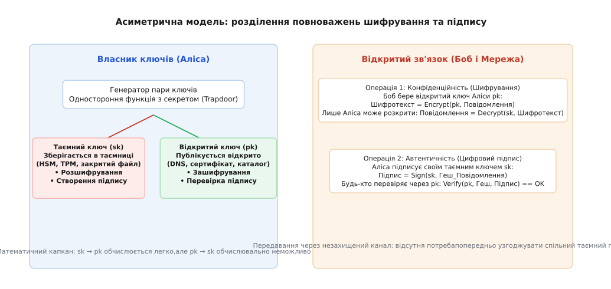
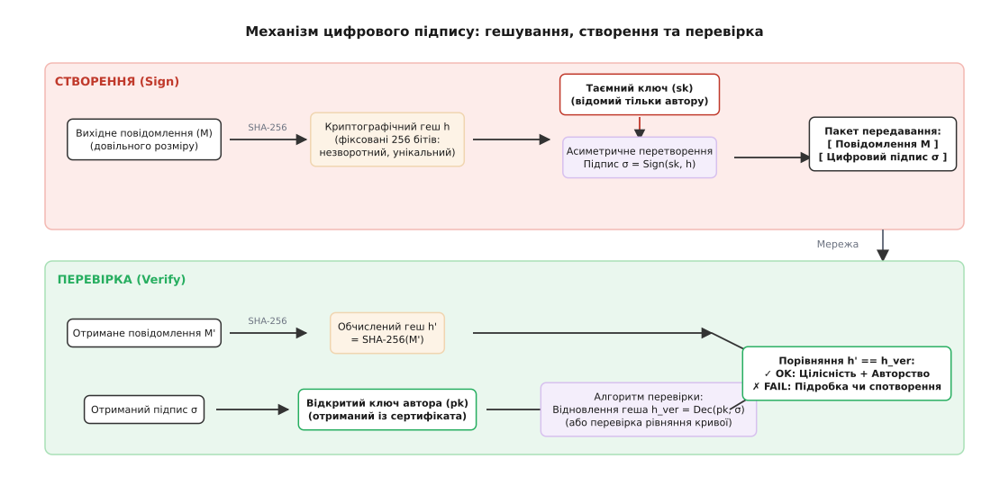
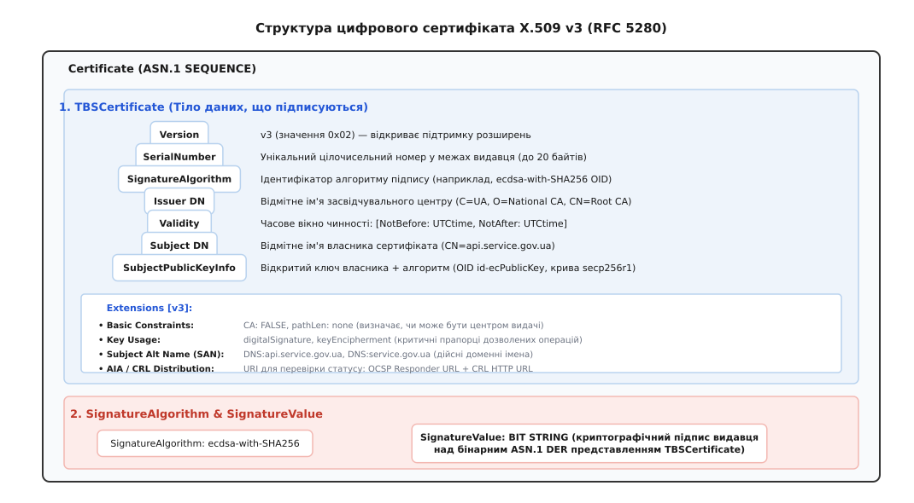
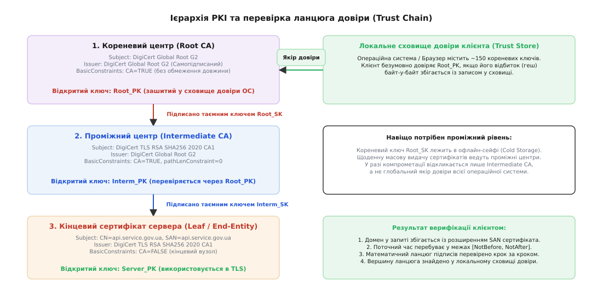
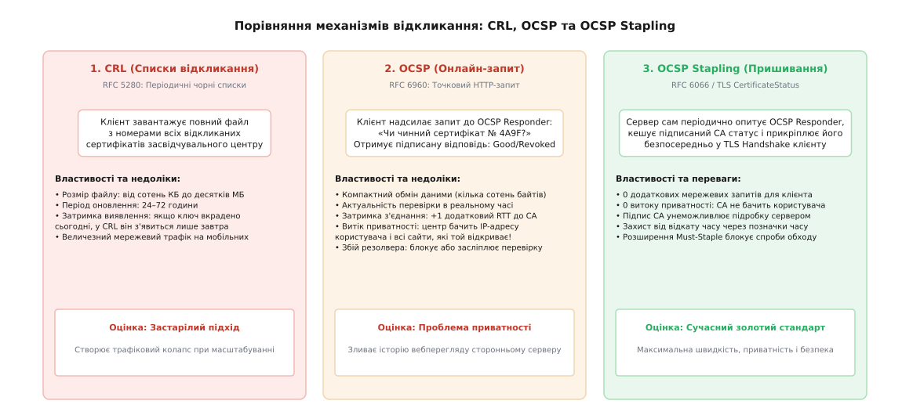

# Криптографія з відкритим ключем: ключі, підпис, ланцюг сертифікатів

<preknowlist>
- [Блоковий шифр](root:sf-security/block-cipher) — симетричне шифрування під спільним таємним ключем фіксованими блоками.
- [Модульна арифметика](root:math-number-theory/modular-arithmetic) — обчислення за модулем цілого числа, кільця лишків та конгруенції.
- [Модульне піднесення до степеня](root:math-number-theory/modular-exponentiation) — швидке обчислення степенів у скінченних кільцях методом бінарного квадрування.
- [Обернений елемент за модулем](root:math-number-theory/modular-inverse) — розв'язання рівняння обернення за допомогою розширеного алгоритму Евкліда.
- [Дискретний логарифм](root:math-number-theory/discrete-logarithm) — складність знаходження показника степеня у мультиплікативних групах скінченних полів.
- [Еліптичні криві](root:math-number-theory/elliptic-curves) — алгебраїчні рівняння над скінченними полями та геометрія групового закону додавання точок.
- [Дайджест-автентифікація](root:sf-security/digest-authentication) — автентифікація через криптографічні геші без передавання відкритого пароля.
</preknowlist>

Користувач відкриває у браузері банківський додаток або термінал надсилає запит до віддаленого шлюзу телеметрії. Клієнт і сервер ніколи раніше не бачилися, не мають спільних секретних паролів і зв'язуються через відкриту мережу, у якій будь-який проміжний маршрутизатор може слухати, модифікувати або перехоплювати пакети. Якби захист будувався суто на симетричних шифрах на зразок AES, для захищеного зв'язку сторони мусили б якимось чином заздалегідь передати одна одній секретний 256-бітний ключ.

Передавати цей ключ відкритим каналом не можна — його миттєво скопіює перехоплювач. Фізично доставляти ключ кур'єром чи розвозити на флешках неможливо: для мережі з мільярда пристроїв кількість необхідних парних секретів становить приблизно `5 · 10¹⁷`, що робить симетричну схему непридатною для глобального масштабування.

Вихід із цього глухого кута дає криптографія (дав.-гр. *kryptos* — «прихований» + *grapho* — «пишу») з відкритим ключем: математичний апарат, що дозволяє встановити надійний зашифрований канал між незнайомими абонентами та надати математичну гарантію автентичності (дав.-гр. *authentikos* — «справжній, первісний») джерела даних.

---

### Принцип асиметрії: одностороння функція з секретом

В основі симетричного захисту лежить єдиний ключ, який однаково добре зачиняє і відчиняє замок. Асиметрична криптографія (грец. *asymmetria* — «невідповідність, нерівність») розділяє ці повноваження між парою математично пов'язаних ключів:

1. **Таємний ключ (`sk` або `private key`):** генерується локально, ніколи не залишає пристрою власника і зберігається в захищеному апаратному сховищі (TPM, HSM або зашифрованому файлі).
2. **Відкритий ключ (`pk` або `public key`):** обчислюється з таємного ключа і публікується у відкритому доступі для всього світу.

Математичним фундаментом такого розділення є одностороння функція з секретом (англ. *trapdoor one-way function*). Це перетворення `y = f(x)`, яке в прямому напрямку обчислюється за частки мікросекунди, але його зворотне перетворення `x = f⁻¹(y)` є обчислювально нерозв'язним для стороннього спостерігача за прийнятний час (потребує мільйонів років роботи суперкомп'ютерів). Проте якщо спостерігач володіє додатковою таємною інформацією — математичним «капканом» або секретом — обернення функції виконується так само швидко, як і пряма дія.

Завдяки цьому асиметрична пара виконує дві фундаментальні операції мережевого захисту:

- **Захист конфіденційності (Шифрування):** Будь-який вузол мережі бере відкритий ключ адресата `pk` і зашифровує повідомлення: `C = Encrypt(pk, M)`. Отриманий шифротекст `C` є відкритим для перехоплювачів, але відновити вихідний текст `M = Decrypt(sk, C)` здатний виключно законний власник відповідного закритого ключа `sk`.
- **Захист автентичності та цілісності (Цифровий підпис):** Власник закритого ключа створює цифровий підпис над повідомленням: `σ = Sign(sk, M)`. Будь-хто у світі, маючи відкритий ключ `pk`, перевіряє рівність: `Verify(pk, M, σ) == TRUE`. Підробити такий підпис без знання `sk` математично неможливо, а зміна хоча б одного біта у вихідному повідомленні `M` робить підпис недійсним.


*Розділення ключів: відкритий ключ дозволяє будь-кому зашифрувати дані або перевірити підпис, тоді як розшифрування та створення підпису вимагають таємного ключа.*

Детальна історія подолання проблеми розподілу ключів — від перших головоломок Ральфа Меркла та відкриття Діффі-Геллмана до секретних розробок британської спецслужби GCHQ — викладена у [революції відкритого ключа](root:sf-security/public-key-crypto/hist-public-key-revolution.md).

---

### Математичні родини односторонніх функцій

Стійкість сучасних асиметричних алгоритмів спирається на три головні класи важковирішуваних алгебраїчних задач:

```
                               Класи асиметричних задач
                                           │
         ┌─────────────────────────────────┼─────────────────────────────────┐
         ▼                                 ▼                                 ▼
1. Факторизація цілих чисел    2. Дискретний логарифм у F_p     3. Дискретний логарифм на кривих
   RSA (N = p · q)                Diffie-Hellman / DSA             ECDH / ECDSA / Ed25519
   Стійкість 128 біт: 3072 біти   Стійкість 128 біт: 3072 біти     Стійкість 128 біт: 256 бітів
```

#### 1. Факторизація великих складених чисел (RSA)
Алгоритм RSA (Рівест — Шамір — Адлеман, 1977) обирає два великі прості числа `p` і `q` та обчислює їхній добуток `N = p · q`. Мультиплікативна група кільця лишків за модулем `N` має порядок, що визначається функцією Ейлера `φ(N) = (p - 1)·(q - 1)` або функцією Кармайкла `λ(N) = lcm(p - 1, q - 1)`.

Відкритий ключ складається з пари `(e, N)`, де `e` — відкрита експонента (зазвичай `65537`). Секретний ключ `d` обчислюється як модульно обернений елемент `d ≡ e⁻¹ mod λ(N)` за допомогою розширеного алгоритму Евкліда. Обчислення `M^e mod N` виконується швидко за поліноміальний час, але знайти `d` без знання дільників `p` і `q` неможливо без розкладання числа `N` на прості множники (факторизації).

#### 2. Дискретне логарифмування у скінченних полях (Diffie-Hellman / DSA)
У скінченному полі Галуа `F_p` з великим простим модулем `p` та первісним коренем (генератором) `g` обчислення значення `y = g^x mod p` виконується методом швидкого піднесення до степеня за логарифмічний час `O(log x)`. Зворотна задача знаходження показника степеня `x = log_g(y) mod p` (дискретний логарифм) вимагає суб-експоненційного часу при використанні методу решета числового поля (GNFS).

#### 3. Еліптичні криві (ECDH / ECDSA / Ed25519)
Еліптична крива над скінченним полем `F_p` задається рівнянням Вейєрштрасса `y² ≡ x³ + a·x + b (mod p)` або скрученим рівнянням Едвардса `-x² + y² = 1 + d·x²·y²`. Точки на кривій разом із нейтральним елементом утворюють абелеву групу.

Операція скалярного множення точки `Q = [k]G` (додавання базової точки `G` до себе `k` разів) обчислюється швидко за алгоритмом «подвоєння та додавання» або через сходи Монтгомері. Зворотна задача (ECDLP — знаходження скаляра `k` за відомими `G` та `Q`) не піддається атакам решета числового поля: найшвидші відомі класичні алгоритми мають повну експоненційну складність `O(√n)`.

**Порівняння ефективності RSA та еліптичних кривих:**

| Рівень симетричної стійкості | Довжина ключа RSA / DH | Довжина ключа ECC (ECDSA / Ed25519) | Економія розміру / обчислень |
|---|---|---|---|
| 80 бітів (застарілий) | 1024 біти | 160 бітів | 6.4× менший ключ |
| 112 бітів (мінімальний) | 2048 бітів | 224 біти | 9.1× менший ключ |
| 128 бітів (сучасний стандарт) | 3072 біти | 256 бітів (NIST P-256, Ed25519) | 12× менший ключ, ~10× швидший підпис |
| 192 біти (підвищений захист) | 7680 бітів | 384 біти (NIST P-384) | 20× менший ключ |
| 256 бітів (максимальний) | 15360 бітів | 512 бітів (NIST P-521, Ed448) | 30× менший ключ |

Повні математичні доведення коректності розшифрування RSA, властивостей групового закону еліптичних кривих та формул Ed25519 наведені у вставці про [математичні засади односторонніх функцій із секретом](root:sf-security/public-key-crypto/math-trapdoor-functions.md).

---

### Механізм цифрового підпису: Sign і Verify

Асиметричне шифрування забезпечує таємницю, але в мережевих протоколах найчастішим завданням є підтвердження авторства та незмінності даних. Цю роль виконує цифровий підпис (англ. *digital signature*).

#### Парадигма «Гешуй і підписуй» (Hash-then-Sign)
Підписувати повідомлення `M` довільної довжини безпосередньо асиметричним алгоритмом не можна:
1. Асиметричні операції обчислювально важкі: шифрування гігабайтного файлу через RSA зайняло б десятки секунд і перевантажило процесор.
2. Алгебраїчна гомоморфність «сирих» операцій створює вразливість до математичної генерації підроблених підписів.

Тому стандартний конвеєр підпису завжди складається з двох послідовних кроків:
1. Повідомлення `M` пропускається крізь криптографічну геш-функцію (наприклад, SHA-256), яка перетворює вхідні дані будь-якого розміру на фіксований 256-бітний дайджест `h = Hash(M)`.
2. Асиметрична функція підпису застосовується виключно до короткого фіксованого значення дайджесту: `σ = Sign(sk, h)`.


*Цикл цифрового підпису: відправник обчислює геш та підписує його закритим ключем; отримувач незалежно обчислює геш повідомлення та звіряє його з результатом перевірки підпису.*

#### Властивості цифрового підпису:
- **Автентичність джерела (Authenticity):** Отримувач має математичний доказ того, що підпис створено особою, яка володіє відповідним закритим ключем `sk`.
- **Цілісність даних (Integrity):** Зміна навіть одного біта в повідомленні `M` змінює його геш `h'`, через що перевірка `Verify(pk, h', σ)` гарантовано повертає помилку.
- **Невідмовність від авторства (Non-repudiation):** Власник закритого ключа не може заявити, що повідомлення надіслав хтось інший, оскільки закритий ключ відомий лише йому.

---

### Проблема зв'язування ключа та потреба в сертифікатах

Уявімо атаку «людина посередині» (Man-in-the-Middle, MITM). Клієнт звертається до сервера `bank.gov.ua`. Зловмисник на маршрутизаторі перехоплює трафік, генерує власну пару ключів `(sk_bad, pk_bad)` і віддає клієнту відкритий ключ `pk_bad`, стверджуючи: «Це відкритий ключ банку». 

Клієнт зашифровує конфіденційні дані ключем `pk_bad`. Зловмисник перехоплює шифротекст, розшифровує його своїм `sk_bad`, читає номер рахунку, зашифровує дані справжнім відкритим ключем банку `pk_bank` і відправляє банку. Зв'язок працює, дані зашифровані асиметрично, але безпека повністю зруйнована.

Звідси випливає фундаментальний інженерний висновок: **сам по собі відкритий ключ не має сенсу без доведеної прив'язки до особи його власника**. 

Щоб вирішити цю проблему, було створено цифровий сертифікат (лат. *certifico* — «засвідчую, стверджую»). Сертифікат — це стандартизований електронний документ, у якому авторитетна третя сторона (засвідчувальний центр) ставить свій цифровий підпис під твердженням: «Відкритий ключ `pk` справді належить суб'єкту з доменним ім'ям `bank.gov.ua`».

---

### Анатомія цифрового сертифіката X.509 v3

Міжнародним стандартом для цифрових сертифікатів у мережах зв'язку є специфікація **X.509 версії 3** (IETF RFC 5280). Бінарна структура сертифіката кодується за правилами ASN.1 DER (послідовність тегів, довжин і значень) або зберігається у текстовому форматі PEM (Base64-масив, загорнутий між мітками `-----BEGIN CERTIFICATE-----` та `-----END CERTIFICATE-----`).

Сертифікат складається з трьох головних складових частин:

```asn1
Certificate ::= SEQUENCE {
    tbsCertificate          TBSCertificate,     -- Тіло сертифіката (To Be Signed)
    signatureAlgorithm      AlgorithmIdentifier,-- Алгоритм підпису видавця
    signatureValue          BIT STRING          -- Цифровий підпис видавця над TBS
}
```


*Контейнер X.509 v3: ядро TBSCertificate містить авторизаційні атрибути, розширення та відкритий ключ, захищені цифровим підписом видавця.*

#### Головні поля структури TBSCertificate:
1. **`Version`:** Версія формату. Для X.509 v3 значення дорівнює `2` (нумерація з нуля).
2. **`SerialNumber`:** Унікальне додатне ціле число (до 20 байтів), видане засвідчувальним центром для ідентифікації сертифіката в реєстрах.
3. **`Signature`:** Ідентифікатор алгоритму підпису видавця (наприклад, `ecdsa-with-SHA256` або `sha256WithRSAEncryption`).
4. **`Issuer DN` (Distinguished Name):** Відмітне ім'я засвідчувального центру (країна `C`, організація `O`, спільне ім'я `CN`).
5. **`Validity`:** Часове вікно чинності сертифіката, задане двома мітками часу: `NotBefore` (початок дії) та `NotAfter` (закінчення строку чинності).
6. **`Subject DN`:** Відмітне ім'я суб'єкта (власника сертифіката).
7. **`SubjectPublicKeyInfo`:** Відкритий ключ власника сертифіката разом з ідентифікатором алгоритму та параметрами еліптичної кривої.
8. **`Extensions` (Розширення версії v3):** Механізм гнучкого налаштування прав і обмежень сертифіката.

#### Критичні розширення стандарту X.509 v3:
- **`Basic Constraints` (OID `2.5.29.19`):** Визначає тип вузла. Прапорець `cA = TRUE` вказує, що сертифікат належить центру сертифікації та має право підписувати інші сертифікати. Параметр `pathLenConstraint` обмежує максимальну глибину дочірніх проміжних центрів. Для кінцевих серверів встановлюється `cA = FALSE`.
- **`Key Usage` (OID `2.5.29.15`):** Бітова маска дозволених криптографічних операцій: `digitalSignature` (створення підписів), `keyCertSign` (підпис інших сертифікатів), `cRLSign` (підпис списків відкликання).
- **`Extended Key Usage` (EKU, OID `2.5.29.37`):** Прикладне призначення ключа: `serverAuth` (автентифікація вебсервера TLS), `clientAuth` (клієнтські сертифікати mTLS), `codeSigning` (підпис коду).
- **`Subject Alternative Name` (SAN, OID `2.5.29.17`):** Список дійсних доменних імен (`dNSName`) та IP-адрес (`iPAddress`), для яких випущено сертифікат (наприклад, `api.service.gov.ua`, `service.gov.ua`). Сучасні вебклієнти виконують валідацію виключно за SAN, повністю ігноруючи застаріле поле `Subject.CommonName`.
- **`Authority Information Access` (AIA, OID `1.3.6.1.5.5.7.1.1`):** Містить мережеві адреси для онлайн-перевірки статусу сертифіката через протокол OCSP та URL-посилання для завантаження сертифіката батьківського видавця.

Повна специфікація синтаксису ASN.1, таблиці числових OID та побайтовий розбір бінарних DER-структур наведені у [специфікації структури X.509 v3 та розширень ASN.1](root:sf-security/public-key-crypto/api-x509-asn1.md).

---

### Ієрархія інфраструктури відкритих ключів (PKI) та ланцюги довіри

Якщо кожен сервер має сертифікат, підписаний іншим сервером, виникає питання: кому довіряти спочатку? Відповіддю є ієрархічна інфраструктура (лат. *infra* — «нижче, під» + *structura* — «будова») відкритих ключів — **PKI** (англ. *Public Key Infrastructure*).

Довіра в PKI будується у вигляді піраміди:

```
                  ┌────────────────────────────────────────┐
                  │          Кореневий центр (Root CA)     │  ◄── Вшитий у сховище довіри ОС
                  │     (Самопідписаний, офлайн-сейф)      │      (Trust Store)
                  └───────────────────┬────────────────────┘
                                      │ підписує Root_SK
                                      ▼
                  ┌────────────────────────────────────────┐
                  │       Проміжний центр (Intermediate CA)│  ◄── Щоденна автоматизована
                  │           (CA: TRUE, pathLen: 0)       │      видача (Let's Encrypt R3)
                  └───────────────────┬────────────────────┘
                                      │ підписує Interm_SK
                                      ▼
                  ┌────────────────────────────────────────┐
                  │       Кінцевий сертифікат (Leaf)       │  ◄── Встановлений на вебсервері
                  │         (CA: FALSE, serverAuth)        │      (api.service.gov.ua)
                  └────────────────────────────────────────┘
```


*Ланцюг довіри PKI: перевірка виконується знизу вгору; кожен сертифікат валідується відкритим ключем вищого рівня аж до довіреного якоря в ОС.*

#### Рівні ієрархії:
1. **Кореневий засвідчувальний центр (Root CA):** Вершина ієрархії. Кореневий сертифікат є **самопідписаним** (його поле `Issuer` збігається з `Subject`, а підпис перевіряється його власним відкритим ключем). Закритий ключ Root CA генерується на спеціальній церемонії ключів і зберігається на ізольованому комп'ютері без мережевого підключення в сейфі з біометричним доступом (Cold Storage).
2. **Локальне сховище довіри (Trust Store):** Операційна система (Linux, Windows, Android) або браузер (Firefox) містить попередньо встановлений список із приблизно 150 публічних сертифікатів кореневих центрів. Клієнт довіряє цим центрам за замовчуванням.
3. **Проміжні засвідчувальні центри (Intermediate CA):** Кореневий центр підписує один або кілька проміжних центрів. Саме проміжні центри ведуть повсякденну автоматизовану роботу з обробки запитів та видачі сертифікатів. Якщо закритий ключ проміжного центру буде скомпрометовано, кореневий центр відкликає лише цей конкретний Intermediate CA, не вимагаючи перевстановлення кореневих сертифікатів у мільйонів користувачів.
4. **Кінцеві сертифікати (Leaf / End-Entity):** Сертифікати вебсайтів, серверів або клієнтів. Вони мають прапорець `cA = FALSE` і не можуть використовуватися для підпису інших сертифікатів.

#### Покроковий алгоритм перевірки ланцюга (Chain Validation Walk):
Коли клієнт підключається до сервера, сервер надсилає свій кінцевий сертифікат разом із ланцюгом проміжних сертифікатів. Клієнт виконує такі кроки:
1. **Пошук якоря довіри:** Клієнт шукає видавця верхнього сертифіката у своєму локальному сховищі Trust Store за збігом поля `Issuer` та відбитка відкритого ключа (SKI/AKI).
2. **Перевірка термінів чинності:** Для кожного сертифіката в ланцюгу перевіряється, що поточний час потрапляє в інтервал `[NotBefore, NotAfter]`.
3. **Перевірка базових обмежень:** Клієнт переконується, що всі проміжні вузли мають `cA = TRUE`, кількість проміжних центрів не перевищує `pathLenConstraint`, а кінцевий вузол має `cA = FALSE`.
4. **Математична верифікація підписів:** Клієнт послідовно бере відкритий ключ кожного батьківського сертифіката і перевіряє цифровий підпис підпорядкованого сертифіката.
5. **Валідація імені хоста:** Клієнт перевіряє, що доменне ім'я запиту строго відповідає запису в розширенні `SubjectAlternativeName` кінцевого сертифіката.

Повна програмна реалізація алгоритму верифікації на мовах C та C++20 разом із практичним аналізом помилок наведена у [алгоритмі та імплементації перевірки ланцюга сертифікатів](root:sf-security/public-key-crypto/proj-cert-chain-verify.md).

---

### Перевірка статусу та відкликання сертифікатів

Якщо закритий ключ сервера було викрадено, співробітника звільнено або компанія змінила доменне ім'я до закінчення строку дії сертифіката, виникає потреба дострокового анулювання сертифіката. Цей процес називається відкликанням (англ. *revocation*, лат. *revocatio* — «відкликання назад»).

Існують три покоління технологій перевірки статусу відкликання:


*Еволюція відкликання: від важких монолітних списків CRL та повільних онлайн-запитів OCSP до швидкого й приватного механізму OCSP Stapling.*

#### 1. Списки відкликання сертифікатів (CRL, RFC 5280)
Засвідчувальний центр періодично (раз на 24–72 години) формує і підписує файл **CRL** (англ. *Certificate Revocation List*) — список серійних номерів усіх анульованих сертифікатів із мітками часу та причинами відкликання (`keyCompromise`, `superseded` тощо).

- *Проблема:* Файли CRL великих центрів досягають десятків мегабайтів. Завантаження такого обсягу даних клієнтом перед відкриттям кожного сайту паралізує роботу мобільних мереж. Крім того, існує затримка оновлення: скомпрометований ключ залишається активним до моменту випуску наступного свіжого списку CRL.

#### 2. Протокол онлайнового статусу сертифікатів (OCSP, RFC 6960)
Протокол **OCSP** (англ. *Online Certificate Status Protocol*) дозволяє клієнту надіслати точковий HTTP-запит до спеціального сервера видавця (OCSP Responder): «Чи дійсний сертифікат із серійним номером `0x4A9F`?». Сервер повертає підписану відповідь: `Good`, `Revoked` або `Unknown`.

- *Проблеми OCSP:*
  - **Затримка (Latency):** Кожне нове TLS-з'єднання вимагає додаткового мережевого запиту до сервера CA (+1 RTT, 100–300 мс).
  - **Витік приватності (Privacy Leak):** Засвідчувальний центр у реальному часі бачить IP-адреси користувачів і всі сайти, які вони відвідують.
  - **Проблема м'якого збою (Soft-Fail):** Якщо OCSP Responder недоступний або атакуючий блокує до нього доступ, браузери за замовчуванням ігнорують помилку і відкривають сайт (режим Soft-Fail), що дозволяє зловмиснику обійти перевірку.

#### 3. Механізм пришивання статусу (OCSP Stapling, RFC 6066 / RFC 6961)
Золотим стандартом сучасної інженерії є **OCSP Stapling** (англ. *stapling* — «скріплення степлером»). Вебсервер самостійно періодично опитує OCSP Responder свого центру сертифікації, отримує підписану відповідь про власний статус, кешує її у своїй оперативній пам'яті й під час рукостискання TLS Handshake передає її клієнту безпосередньо у повідомленні `CertificateStatus`.

- *Переваги:*
  - Клієнт не робить жодних додаткових мережевих запитів (нульова затримка).
  - Повна приватність: центр сертифікації взагалі не знає, хто підключається до вебсервера.
  - Підробити пришитий статус неможливо, оскільки він завірений цифровим підписом CA та містить обмежений часовий інтервал дії.
  - **Розширення Must-Staple (RFC 7633):** Власник домену може включити в сертифікат обов'язкову вимогу наявності пришитого OCSP-статусу. Якщо клієнт не отримає пришитого статусу, він жорстко заблокує з'єднання (Hard-Fail), унеможливлюючи атаки блокування перевірки.

---

### Автоматизація життєвого циклу: протокол ACME та Let's Encrypt

Історично випуск та оновлення сертифікатів X.509 були ручними процесами: системний адміністратор генерував запит CSR, завантажував його через вебінтерфейс комерційного засвідчувального центру, оплачував рахунок, чекав на ручну перевірку особи або підтверджував контрольний електронний лист. Сертифікати випускалися на 1–3 роки.

Такий підхід мав критичну системну ваду: людський фактор. Адміністратори забували про дату закінчення сертифіката, що регулярно спричиняло глобальні збої великих сервісів. Крім того, тривалий строк дії (1–3 роки) означав, що скомпрометований закритий ключ міг використовуватися зловмисниками місяцями, оскільки механізми відкликання CRL/OCSP не давали 100% захисту.

Для повної автоматизації життєвого циклу робоча група IETF стандартизувала протокол **ACME** (англ. *Automated Certificate Management Environment*, RFC 8555), який ліг в основу роботи засвідчувального центру Let's Encrypt.

```
Клієнт ACME (Certbot / Caddy)                 Засвідчувальний центр (Let's Encrypt)
             │                                                 │
             │──── 1. Запит на випуск для api.service.gov.ua ─►│
             │                                                 │
             │◄─── 2. Виклик (Challenge: токен + правила) ─────│
             │                                                 │
             │ [ Розміщення токена у HTTP /.well-known/ ]      │
             │ [ або створення TXT-запису в DNS ]              │
             │                                                 │
             │──── 3. Повідомлення: «Виклик виконано» ────────►│
             │                                                 │
             │                     [ Перевірка ресурсу CA ] ───┤
             │                     HTTP GET http://.../token   │
             │                     або DNS TXT lookup          │
             │                                                 │
             │◄─── 4. Дозвіл підтверджено ─────────────────────│
             │                                                 │
             │──── 5. Відправлення CSR з відкритим ключем ────►│
             │                                                 │
             │◄─── 6. Випуск та завантаження сертифіката ──────│
```

#### Механізми підтвердження володіння доменом (Challenges):
1. **`HTTP-01 Challenge`:** Сервер CA видає клієнту випадковий токен. Клієнтський демон (наприклад, Certbot або вбудований модуль Nginx/Caddy) розміщує файл із цим токеном за фіксованим шляхом `http://<domain>/.well-known/acme-challenge/<token>`. Засвідчувальний центр надсилає незалежні HTTP-запити з кількох географічно розподілених точок світу і переконується у наявності файлу.
2. **`DNS-01 Challenge`:** Центр сертифікації вимагає створити тимчасовий текстовий запис `_acme-challenge.<domain>` у службі DNS. Клієнт через API DNS-провайдера публікує геш токена. Цей спосіб є єдиним для випуску сертифікатів із груповими масками (Wildcard, наприклад, `*.service.gov.ua`).
3. **`TLS-ALPN-01 Challenge`:** Перевірка здійснюється безпосередньо під час рукостискання TLS за допомогою спеціального ідентифікатора прикладного протоколу `acme-tls/1`.

Завдяки ACME строк дії сучасних сертифікатів вдалося скоротити до **90 днів** (з автоматичним оновленням кожні 60 днів), що радикально зменшило вікно загроз у разі витоку ключів.

---

### Аудит та прозорість: Certificate Transparency (CT)

До 2011 року слабким місцем моделі PKI залишалася абсолютна довіра до будь-якого з сотень акредитованих кореневих центрів. У серпні 2011 року голландський засвідчувальний центр **DigiNotar** було зламано: хакери отримали доступ до закритого ключа Root CA і випустили понад 500 підроблених сертифікатів для сервісів Google, Yahoo, Tor та інших. За допомогою цих сертифікатів спецслужби здійснювали масштабну атаку «людина посередині» над мільйонами користувачів, і атака залишалася непоміченою понад місяць, оскільки браузери законно довіряли підпису DigiNotar.

Для запобігання прихованому випуску фальшивих сертифікатів компанія Google розробила технологію **Certificate Transparency** (RFC 6962).

```
                      ┌────────────────────────────────────────┐
                      │    Засвідчувальний центр (CA)          │
                      └───────────────────┬────────────────────┘
                                          │ 1. Надсилає Pre-Certificate
                                          ▼
                      ┌────────────────────────────────────────┐
                      │ Публічні логи аудиту (CT Logs)         │
                      │ (Криптографічне дерево Меркла)         │
                      └───────────────────┬────────────────────┘
                                          │ 2. Повертають підписану мітку часу
                                          ▼    SCT (Signed Certificate Timestamp)
                      ┌────────────────────────────────────────┐
                      │ Готовий сертифікат X.509 v3            │
                      │ з вшитим розширенням SCT               │
                      └────────────────────────────────────────┘
```

#### Принципи функціонування Certificate Transparency:
1. **Публічні журнали аудиту (Append-Only CT Logs):** Сертифікаційні центри зобов'язані реєструвати кожен випущений сертифікат у незалежних публічних журналах, що підтримуються різними організаціями (Google, Cloudflare, Let's Encrypt). Журнали організовані у вигляді незмінного криптографічного дерева Меркла. Додати запис можна, видалити чи змінити заднім числом — неможливо.
2. **Підписана позначка часу (SCT, Signed Certificate Timestamp):** Журнал CT повертає криптографічну квитанцію (SCT), яка вбудовується безпосередньо в розширення сертифіката X.509 (OID `1.3.6.1.4.1.11129.2.4.2`).
3. **Контроль браузерами:** Сучасні браузери відхиляють з'єднання з будь-яким сайтом, сертифікат якого не містить щонайменше двох валідних міток SCT від незалежних журналів аудиту.
4. **Моніторинг власниками доменів:** Власник домену (наприклад, банку) налаштовує систему моніторингу журналів CT. Якщо будь-який центр сертифікації у світі випустить сертифікат для його домену без його відома, служба безпеки дізнається про це за лічені секунди та негайно ініціює процедуру відкликання.

---

### Взаємна автентифікація mTLS у сучасних розподілених системах

У класичному вебі автентифікація є односторонньою: клієнт перевіряє сертифікат сервера, а сервер ідентифікує користувача через логін і пароль або сесійний токен. Проте в архітектурі мікросервісів (Microservices), хмарних кластерах Kubernetes та корпоративних мережах нульової довіри (**Zero Trust**) такий підхід є недостатнім: кожен внутрішній сервіс повинен гарантувати автентичність кожного вхідного запиту.

Цю задачу вирішує протокол **mTLS** (англ. *Mutual TLS*, двостороння автентифікація):

```
Клієнтський мікросервіс (Auth Service)          Серверний мікросервіс (Payment API)
             │                                                 │
             │─── 1. ClientHello ─────────────────────────────►│
             │                                                 │
             │◄── 2. ServerHello + Server Certificate ─────────│
             │    + CertificateRequest (Запит сертифіката)     │
             │                                                 │
             │─── 3. Client Certificate ──────────────────────►│
             │    + CertificateVerify (Підпис на Client_SK)    │
             │    + Finished                                   │
             │                                                 │
             │ [ Сервер валідує Client Certificate за CA ]────┤
             │ [ Видобуває ID: CN=auth-service.cluster.local ] │
             │ [ Перевіряє права доступу за політикою RBAC ]  │
             │                                                 │
             │◄── 4. Finished ─────────────────────────────────│
             │                                                 │
             │════════ Захищений двосторонній тунель ══════════│
```

#### Переваги mTLS у Service Mesh:
- **Повна відсутність паролів і статичних API-ключів:** Усі сервіси автентифікуються криптографічними ключами, згенерованими локально у пам'яті контейнера.
- **Автоматична ротація:** Сервісні сітки (Istio, Linkerd) автоматично випускають короткоживучі сертифікати X.509 (із терміном дії 24 години) через протоколи на зразок SPIFFE/SPIRE, усуваючи ризик витоку довготривалих секретів.
- **Шифрування транспортного рівня (In-Transit Encryption):** Захищає міжсервісний трафік від підслуховування навіть усередині скомпрометованого кластера.

---

> 🔧 **Навіщо це.**
> 
> Криптографія з відкритим ключем та інфраструктура X.509 лежать в основі всіх захищених з'єднань сучасної цифрової інфраструктури:
> 1. **Протокол TLS/HTTPS (Веб та API):** Забезпечує автентифікацію серверів та безпечний обмін сесійними симетричними ключами (ECDHE) для банківських транзакцій, вебперегляду та хмарних мікросервісів.
> 2. **Взаємна автентифікація mTLS у сервісних мережах (Service Mesh):** У хмарних кластерах Kubernetes мікросервіси використовують клієнтські та серверні сертифікати X.509 для взаємної безпарольної автентифікації та шифрування міжсервісного трафіку за принципом нульової довіри (Zero Trust).
> 3. **Безпека прошивок та захищене завантаження (Secure Boot):** Завантажувач процесора містить відкритий ключ виробника у захищеній пам'яті (ROM) і перевіряє цифровий підпис (Ed25519 чи RSA-PSS) образу операційної системи перед запуском, блокуючи виконання модифікованого шкідливого коду.
> 4. **Керування доступом SSH та захист репозиторіїв Git:** Цифрові підписи на основі ключів Ed25519 замінюють вразливі паролі при доступі до серверів та забезпечують непідробне криптографічне підписування комітів розробників.

---

### Постквантовий перехід та майбутнє PKI

Класичні асиметричні алгоритми (RSA, ECDSA, Ed25519) мають спільну фундаментальну вразливість перед майбутніми масштабованими квантовими комп'ютерами. Квантовий **алгоритм Шора** (Peter Shor, 1994) розв'язує задачі факторизації цілих чисел та дискретного логарифмування за поліноміальний квантовий час `O(n³)`. Це означає, що квантовий комп'ютер із кількома тисячами логічних кубітів зможе зламати 2048-бітний ключ RSA або 256-бітний ключ ECDSA за лічені хвилини.

У відповідь на цю загрозу Національний інститут стандартів і технологій США (NIST) стандартизував постквантові алгоритми цифрового підпису на основі математики багатовимірних алгебраїчних ґраток:
- **ML-DSA (Dilithium):** основний квантово-стійкий алгоритм загального призначення для підписів у нових версіях протоколів TLS та сертифікатах X.509.
- **SLH-DSA (SPHINCS+):** безґратковий підпис на основі геш-дерев, стійкість якого базується виключно на стійкості геш-функцій (SHA-2/SHAKE).

Сучасний мережевий зв'язок перебуває у стані плавного гібридного переходу: сертифікати X.509 комбінують класичні підписи ECDSA з постквантовими підписами ML-DSA, гарантуючи захист як від сучасних класичних атак, так і від збереження перехопленого трафіку зловмисниками з метою його подальшого розшифрування на квантових машинах майбутнього (стратегія «Збережи зараз, розшифруй потім», Harvest Now, Decrypt Later).
