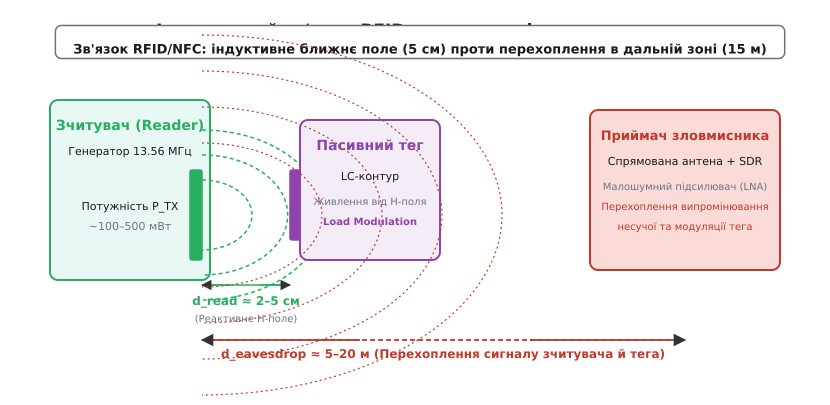
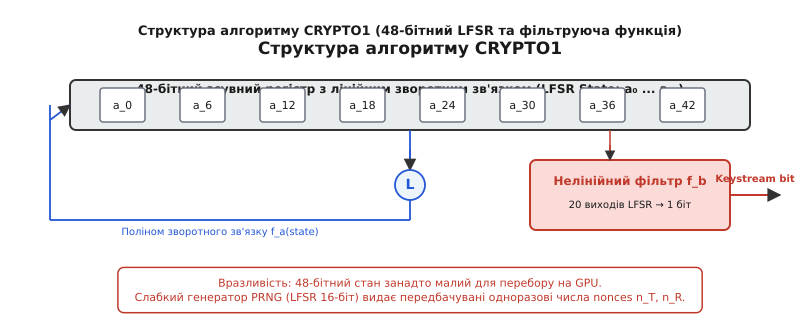
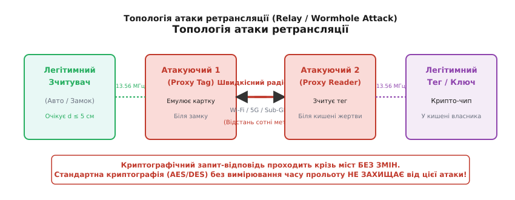
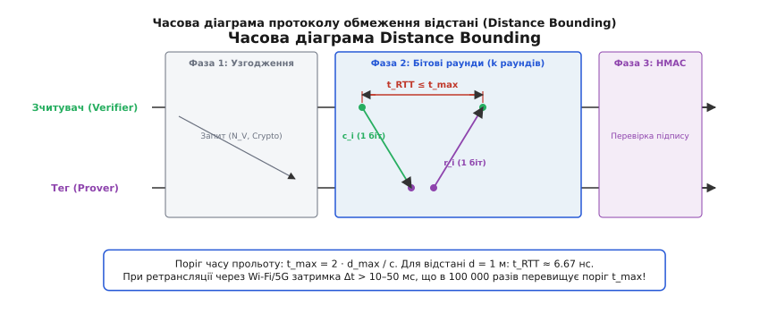
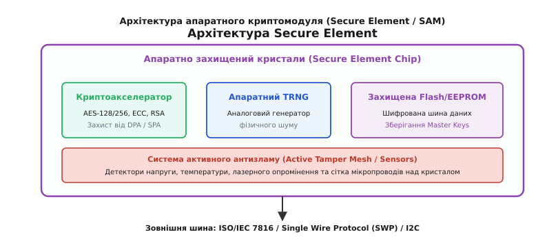

# Безпека NFC/RFID: атаки та захист

<preknowlist>
- [Протоколи NFC: ISO 14443, NDEF і режими роботи](topic:com-modulation/nfc-protocols) — радіочастотний фізичний шар, кодування та каскад антиколізії.
- [Контрольні суми](topic:com-modulation/checksums) — перевірка цілісності кадрів за допомогою поліномів CRC16.
</preknowlist>

Безконтактна картка у кишені пасажира або безключовий брелок автомобіля розраховані на роботу впритул — на відстані не більше 2–5 см від зчитувача. Проте якщо зловмисник розташує в радіусі 15 метрів чутливу спрямовану антену з малошумним підсилювачем та цифровим аналізатором спектра (SDR), він зможе безперешкодно перехопити високочастотний сигнал несучої 13.56 МГц разом із модульованими даними відповіді картки. Якщо безпека системи спирається лише на хибну думку про «малий радіус дії» або на застарілий пропрієтарний шифр, зловмисник клонує ідентифікатор або здійснює ретрансляцію сесії автентифікації на сотні кілометрів через мережу 5G, поки власник ключа спокійно тримає його в кишені.

Забезпечення безпеки безконтактних радіочастотних систем охоплює весь стек технологій — від фізичного рівня радіовипромінювання й електродинаміки індуктивного зв'язку до математики криптографічних протоколів та апаратного захисту силіконового кристала.

---

### Фізичний шар RFID/NFC: індукція, навантажувальна модуляція та зона перехоплення

Більшість систем NFC та HF RFID працюють на виділеній ISM-частоті **13.56 МГц** (довжина хвилі в повітрі `λ ≈ 22.1 м`). Оскільки фізичний розмір котушки антени смартфона чи пластикової картки (близько 5×8 см) є нескінченно малим порівняно з довжиною хвилі `λ`, така система не випромінює ефективної біжучої електромагнітної хвилі в простори.

Зв'язок між зчитувачем (Reader) та пасивним тегом (Tag) здійснюється в **реактивній ближній зоні** за допомогою реактивного індуктивного зв'язку (*Near-Field Magnetic Induction*). Котушка зчитувача створює змінне магнітне поле `H`, яке пронизує витки котушки тега та індукує в ній електрорушійну силу (ЕРС) за законом електромагнітної індукції Фарадея. Отримана змінна напруга випрямляється діодним мостом тега та заряджає накопичувальний конденсатор, забезпечуючи живленням мікроконтролер тега.

```
Зчитувач (Генератор 13.56 МГц) ──[H-поле (1/r³)]──> Котушка тега (ЕРС Індукції) ──> Випрямляч ──> VDD чипа
```

Пасивний тег не має власного активного радіопередавача. Для передачі даних зчитувачу тег використовує принцип **навантажувальної модуляції** (*Load Modulation*). Внутрішній ключ (транзистор) тега почергово підключає та відключає додаткове навантаження (резистор або конденсатор) паралельно до власного резонансного LC-контуру. Зміна навантаження у вторинному контурі через взаємну індуктивність `M` змінює імпеданс котушки зчитувача, що викликає мікроскопічні амплітудні або фазові коливання струму в первинній котушці зчитувача.

Для виділення слабкої відповіді тега на тлі потужної несучої використовується піднесуча частота `f_sub = f_c / 16 ≈ 847 кГц`. Відповідь тега моделюється методом фазової маніпуляції (BPSK) або амплітудної модуляції піднесучої.

#### Чому малий радіус дії не гарантує конфіденційності

Пасивний тег спроможний живитися від H-поля лише на відстані `d_read`, де напруженість поля спадає пропорційно кубу відстані:

```
H_near ∝ 1 / r³
```

Через це спадання енергії на відстані понад 10 см недостатньо для активації чипа тега. Проте зчитувач є активним пристроєм, який випромінює в ефір потужність `P_TX` від 100 мВт до 1 Вт. Хоча більша частина енергії залишається в реактивному ближньому полі, невелика частка випромінюється у вигляді дипольного радіовипромінювання дальної зони (*Far-Field Radiation*), де напруженість поля спадає значно повільніше:

```
E_far ∝ 1 / r
```


*Індуктивний зв'язок у ближній зоні забезпечує живлення тега на відстані кількох сантиметрів, але радіовипромінювання несучої та навантажувальної модуляції витокає в дальню зону, де може бути перехоплене SDR-приймачем.*

Зловмисник, оснащений рамочною чи спрямованою антеною з високим коефіцієнтом підсилення та малошумним підсилювачем (LNA), здатний демодулювати сигнал зчитувача на відстані до **15–20 метрів**, а слабкий сигнал навантажувальної модуляції тега — на відстані до **1–2 метрів**. Отже, фізичний шар NFC сам по собі не забезпечує пасивної конфіденційності.

---

### Вразливості ідентифікації та атаки на UID (Cloning & Emulation)

Найпростіші системи RFID (наприклад, низькочастотні перепустки 125 кГц стандарту EM4100 або базові картки ISO/IEC 14443-A Mifare Ultralight) використовують для контролю доступу лише **унікальний ідентифікатор** (*Unique Identifier*, UID) чипа. 

UID — це зафіксована при виготовленні послідовність розміром 4 байти (Single UID), 7 байтів (Double UID) або 10 байтів (Triple UID). Зчитувач турнікета або дверного замка запитує UID під час каскаду антиколізії, порівнює його з білим списком у своїй базі даних і приймає рішення про відкриття дверей.

#### Механізм бітового розв'язання колізій

У момент прикладання кількох карток до зчитувача їхні відповіді накладаються в ефірі. Зчитувач фіксує колізію за допомогою аналізу манчестерського кодування: якщо в одному бітовому інтервалі спостерігається одночасно низький і високий рівень сигналу, зчитувач фіксує колізію в позиції `NVB` (Number of Valid Bits).

```
Запит зчитувача (SEL CL1 + NVB) ──> Виділення бітів UID0...UID_k ──> Розділення тегів
```

Зчитувач надсилає команду `SELECT` із вказуванням уже відомої частини UID, змушуючи мовчати всі теги, біти яких не збігаються. Ця процедура є повністю відкритою й не вимагає знання криптографічних ключів.

#### Помилка архітектури: UID не є секретом

Принципова прогалина такої системи полягає у змішуванні поняття *ідентифікатора* (публічного імені) та *автентифікатора* (секрету). Під час каскаду антиколізії ISO/IEC 14443-3 UID передається у відкритому незашифрованому вигляді. Будь-який кишеньковий зчитувач або смартфон із підтримкою NFC може непомітно зчитати UID картки жертви за частку секунди. Структуру кадрів антиколізії детально зведено в [довіднику кадрів ISO/IEC 14443 та криптографічних APDU](topic:sf-security/rfid-security/api-iso14443-crypto-frame.md).

#### Чорний ринок UID-змінних тегів (Magic Cards)

Згідно зі стандартом ISO/IEC 14443, UID записується у заводський сектор 0 (Block 0) EEPROM на етапі виробництва напівпровідникової пластини та захищається від перезапису на апаратному рівні. Проте для потреб тестування й задоволення сірого ринку були випущені спеціалізовані клоновані мікросхеми, відомі як **Magic Cards**:

* **Generation 1 (Gen1a / UID Changeable):** Підтримують запис у Блок 0 за допомогою низькорівневих пропрієтарних команд (наприклад, надсилання бэкдор-команд `0x50` або `0x40` до ініціалізації каскаду антиколізії). Перезаписуються інструментами на кшталт Proxmark3.
* **Generation 2 (CUID / Direct Write):** Дозволяють перезаписувати Сектор 0 звичайними стандартними командами запису `WRITE` (0xA0), що робить їх сумісними зі звичайними Android-смартфонами, але дозволяє просунутим зчитувачам виявляти їх шляхом спроби тестового запису в Блок 0.
* **Generation 3 / 4 (GDM / Ultimate Magic Card):** Повністю емулюють поведінку оригінального кремнію NXP, підтримують апаратне блокування перезапису та не відгукуються на бэкдор-команди, роблячи клоновану картку невідмінною від оригінальної на рівні протоколу.

Для протидії клонуванню сучасні системи контролю доступу категорично відмовляються від автентифікації за UID, переходячи на перевірку криптографічного підпису сектора пам'яті за допомогою симетричних або асиметричних ключів.

---

### Криптографічні атаки: від пропрієтарних шифрів до аналізу побічних каналів

Спроба закрити вразливості клонування за допомогою криптографії довго впиралася в обмеження обчислювальної потужності пасивних смарт-карток. Це призвело до масового впровадження пропрієтарних шифрів.

#### Крах пропрієтарної криптографії CRYPTO1 та Hitag2

Картки Mifare Classic (1k/4k), випущені мільярдними тиражами, використовували закритий 48-бітний потоковий шифр **CRYPTO1**. Безпека системи базувалася на секретності алгоритму. Проте після зворотного інженерного розтину кристала мікроскопами в 2007 році криптографічна стійкість алгоритму впала до нуля. Детальний хронологічний опис цієї віхи наведено в [історії зламу алгоритму CRYPTO1 у картках Mifare Classic](topic:sf-security/rfid-security/hist-mifare-crypto1.md).


*Схема CRYPTO1: 48-бітний регістр LFSR з нелінійним фільтром. Слабкість генератора PRNG дозволяє відновити секретний ключ сектора за кілька секунд.*

Аналогічна доля спіткала пропрієтарний 48-бітний шифр **Hitag2**, який масово застосовувався в автомобільному бездротовому бесключовому доступі (RKE) та іммобілайзерах 2000-х років. Слабкий генератор гами Hitag2 дозволяє відновити 48-бітний Master-ключ ключа авто за 4 сесії автентифікації менше ніж за 1 хвилину обчислень на ноутбуці.

Основними причинами фундаментального зламу CRYPTO1 та Hitag2 стали:
1. **Мала довжина ключа (48 бітів):** Простір у `2⁴⁸` комбінацій легко долається прямим перебором (Brute-Force) за допомогою сучасних графічних процесорів (GPU).
2. **Слабкість псевдовипадкового генератора (PRNG):** 16-бітний LFSR генератор тега генерував передбачувані одноразові числа (`nonces`), які прямо залежали від часу тактування.
3. **Алгоритмічні атаки (Nested та Darkside):** Дозволили відновлювати Master-ключі всіх секторів картки за кілька секунд без знання вихідних даних.

#### Атаки по побічних каналах (Side-Channel & Fault Injection)

Навіть коли в смарт-картки та NFC-чипи було впроваджено стійкий міжнародний стандарт **AES-128**, виник новий клас атак на фізичний рівень реалізації — **Side-Channel Attacks (SCA)**.

Зловмисник підключає осцилограф до шини живлення зчитувача або вимірює рівень електромагнітного випромінювання чипа тега під час обчислення AES:

```
Атака SPA / DPA:
Вимірювання струму I(t) під час обчислення AES ──> Кореляційний аналіз (DPA) ──> Відновлення байтів ключа AES
```

* **Простий аналіз потужності (SPA — Simple Power Analysis):** Дозволяє візуально відрізнити операції множення від додавання в алгоритмах RSA/ECC за піками споживання струму.
* **Диференціальний аналіз потужності (DPA — Differential Power Analysis):** Використовує статистичну кореляцію між виміряними кривими споживання струму `I(t)` та гіпотетичними значеннями оброблюваних бітів. Аналіз кількох тисяч сесій дозволяє витягнути 128-бітний ключ AES без розкриття самого чипа.
* **Ін'єкція збоїв (Fault Injection / Glitching):** Короткочасне зниження напруги живлення (*Voltage Glitch*) або спалах інфрачервоного лазера в кристал під час виконання інструкцій змушує ALU мікроконтролера пропустити умовний перехід перевірки PIN-коду чи згенерувати спотворений підпис, з якого методом бейтівської диференціальної помилки (DFA) обчислюється секретний ключ.

#### Відмова в обслуговуванні (Denial of Service) та Фазинг NCI-стека

Сучасні NFC-контролери смартфонів взаємодіють з операційною системою за допомогою стандартизованого протоколу **NCI** (*NFC Controller Interface*). Оскільки парсинг складних структур NDEF-повідомлень (URI, MIME-типи, Bluetooth-паринги) виконується системними службами ОС з привілеями `system/root`, надсилання спеціально сформованого аномального кадру (*NFC Fuzzing*) дозволяє викликати переповнення буфера та Denial of Service у NFC-стеку смартфонів.

---

### Атака ретрансляції (Relay / Wormhole Attack): подолання відстані без зламу ключа

Найнебезпечнішою атакою на сучасні захищені системи NFC та RFID є **атака ретрансляції** (*Relay Attack*, або атака «кротової нори» *Wormhole Attack*). Вона не вимагає зламу криптографічних алгоритмів AES чи ECC і повністю ігнорує наявність найсуворіших підписів.

#### Механізм роботи атаки ретрансляції

Атака реалізується за допомогою двох зловмисників, з'єднаних швидкісним цифровим радіомостом (Wi-Fi 6, 5G, або виділений Sub-GHz канал):


*Топологія атаки ретрансляції: криптографічні кадри передаються між Proxy Tag та Proxy Reader через цифровий радіоміст. Зчитувач вважає, що справжній тег знаходиться поруч.*

1. **Атакуючий 1 (Proxy Tag):** Знаходиться біля легітимного зчитувача (наприклад, біля дверного замка автомобіля з системою PKES / Keyless Go). Він емулює безконтактну картку.
2. **Атакуючий 2 (Proxy Reader):** Наближається до кишені або сумки жертви, в якій лежить справжній брелок чи картка.
3. **Процес ретрансляції:**
   - Зчитувач видає криптографічний запит `Challenge` (nonce `N_R`).
   - Proxy Tag перехоплює запит і миттєво транслює його через 5G-міст на Proxy Reader.
   - Proxy Reader випромінює запит `N_R` убік картки жертви.
   - Справжня картка обчислює легітимний криптографічний підпис `Response = AES_K(N_R)` і відповідає.
   - Proxy Reader передає відповідь назад по радіомосту на Proxy Tag.
   - Proxy Tag транслює відповідь зчитувачу.

Оскільки всі криптографічні підписи згенеровані справжнім чипом із використанням секретного Master-ключа `K`, зчитувач успішно перевіряє підпис і відкриває двері. Атака успішно виконується на відстані сотень метрів або навіть між різними континентами.

---

### Апаратний та протокольний захист: Distance Bounding та Secure Elements

Для протидії всьому спектру атак сучасна радіоінженерія використовує два фундаментальні апаратні механізми: **протоколи обмеження відстані (Distance Bounding)** на фізичному рівні та **захищені елементи (Secure Elements)** на системному рівні.

#### Протоколи обмеження відстані (Distance Bounding)

Оскільки швидкість поширення електромагнітної хвилі обмежена швидкістю світла `c ≈ 3·10⁸ м/с`, будь-яка ретрансляція через цифрові мережі (Wi-Fi, 5G) неминуче додає часову затримку `Δt` на пакетизацію та передачу даних (від 5 до 50 мікросекунд).

Протоколи Distance Bounding (вперше запропоновані Брандсом і Шомом) вимірюють точний час подвійного прольоту сигналів (*Round-Trip Time*, RTT). Математичні розрахунки ймовірностей та часових меж наведено в [математичній моделі затримок та ймовірності в протоколах Distance Bounding](topic:sf-security/rfid-security/math-relay-distance-bounding.md).

```
t_RTT = (2 · d / c) + t_proc
```


*Часова діаграма протоколу Distance Bounding: серія швидких наносекундних бітових раундів c_i / r_i дозволяє виміряти RTT з точністю до наносекунд та відсікти ретранслятор.*

У надширокосмугових системах **UWB** (Ultra-Wideband / IEEE 802.15.4z), які замінюють класичний NFC у смарт-ключах автомобілів, вимірювання затримок здійснюється за допомогою коротких пікосекундних імпульсів із використанням кодованих послідовностей STS (*Scrambled Timestamp Sequence*). Затримка обробки `t_proc` на чипі фіксується на апаратному рівні. Якщо виміряний `t_RTT` перевищує поріг `t_max = 6.67 нс` (що відповідає відстані 1 метр), зчитувач безумовно відхиляє автентифікацію.

Практичний приклад програмного вимірювання затримок кадрів та блокування сесій показано в [проєкті емулятора тега й вимірювача затримок кадрів](topic:sf-security/rfid-security/proj-nfc-relay-emulator.md).

> 🔧 **Навіщо це у розробці.** При розробці безконтактних платіжних терміналів чи систем безключового доступу недопустимо спиратися лише на високорівневі бібліотеки API, які повертають статус «підпис вірний». Розробник повинен налаштувати апаратні таймери NFC-контролера на переривання при перевищенні порогу FWT/RTT (Frame Waiting Time), відсікаючи будь-які спроби ретрансляції на рівні драйвера.

#### Апаратні Secure Elements (SE) та SAM-модулі

Для захисту від криптоаналізу, витоків по побічних каналах (DPA) та фізичного розтину кристала в смартфонах, банківських картках та зчитувачах застосовуються спеціалізовані мікроконтролери — **Secure Elements (SE)**. Повний опис внутрішньої структури цих компонентів зведено в [архітектуру апаратного захищеного елемента (Secure Element)](topic:sf-security/rfid-security/comp-nfc-secure-element.md).


*Внутрішня архітектура Secure Element: криптоакселератор сталого часу execution, апаратний TRNG, шифрована шина та активна захисна сітка (Tamper Mesh).*

Головні інженерні риси Secure Element:
* **Активна захисна сітка (Active Shield):** Верхній шар кремнієвого кристала вкритий сіткою мікропровідників. Спроба фізичного спилювання корпусу або зондування розриває коло й викликає стирання ключів.
* **Виконання за сталий час (Constant-Time Crypto):** Криптоакселератор AES/ECC виконує операції за строго фіксовану кількість тактів незалежно від значень ключів, унеможливлюючи таймінгові атаки.
* **Внутрішній генератор шуму:** Маскує струм споживання для захисту від DPA-атак.

---

### Архитектура EMV Contactless та динамічні криптограми

У безконтактних платіжних систем (EMV Contactless / Visa payWave / Mastercard PayPass) безпека будується на використанні сесійних криптограм. Замість передачі статичного номера картки (PAN) та терміну дії, картка генерує для кожної транзакції одноразову динамічную криптограму **ARQC** (*Authorization Request Cryptogram*).

```
ARQC = AES_K(PAN || ATC || Amount || Nonce_Terminal)
```

де `ATC` (*Application Transaction Counter*) — це 16-бітний лічильник транзакцій, який нарощується у захищеній пам'яті Secure Element при кожній оплаті. Сервер еквайєра перевіряє ARQC за допомогою Master-ключа випуску. Спроба повторного надсилання тієї самої криптограми (Replay Attack) відхиляється, оскільки лічильник ATC на сервері вже збільшився.

---

### Інструменти аналізу безпеки та аудиту RFID/NFC

Для практичного аудіювання захищеності безконтактних систем в інженерній практиці застосовують три класи апаратно-програмних засобів:

1. **Proxmark3 RDV4:** Спеціалізована FPGA-система з двома незалежними високодобротними антенами 125 кГц та 13.56 МГц. Дозволяє здійснювати низькорівневе перехоплення радіоефіру (Sniffing), емуляцію тегів (Emulation), розвідку бэкдорів та проведення атак Hardnested/Darkside безпосередньо на апаратному рівні.
2. **Software Defined Radio (SDR / HackRF / RTL-SDR):** Застосовується для аналізу фізичного рівня, вимірювання коефіцієнта амплітудної модуляції, рівнів бічних пелюсток випромінювання та аналізу витоків у дальню зону.
3. **Flipper Zero / ChameleonUltra:** Портативні аналізатори для швидкої перевірки стійкості UID-автентифікації, дальності прочитування та підтримки безконтактних протоколів ISO 14443 та ISO 15693.

---

### Підсумкове інженерне зведення захисту

Побудова захищеної безконтактної системи RFID/NFC вимагає комплексного дотримання чотирьох рубежів оборони:

| Рівень стек | Типова атака | Інженерний механізм захисту |
| :--- | :--- | :--- |
| **Фізичний шар (RF)** | Радіоперехоплення (Eavesdropping) | Динамічна зміна потужності P_TX, екранування (чохли з кліткою Фарадея) |
| **Протокольний шар** | Клонування UID, атака повторення | Динамічний UID, взаємна автентифікація ISO 14443-4 (AES-128 / ECC) |
| **Просторовий шар** | Атака ретрансляції (Relay Attack) | Вимірювання часу RTT (Distance Bounding), UWB імпульсне дальномірство |
| **Апаратний шар** | DPA, Fault Injection, клонування chip | Захищені елементи (Secure Element / SAM), активна сітка Tamper Mesh |
