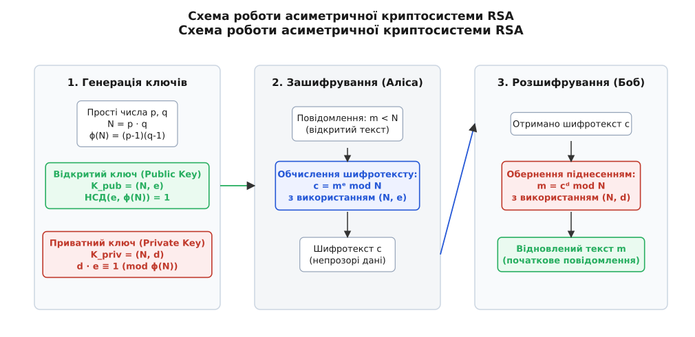
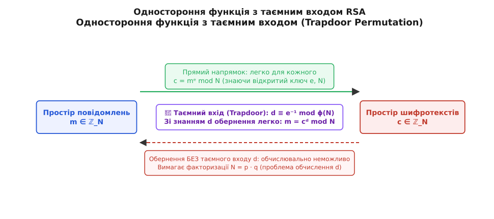
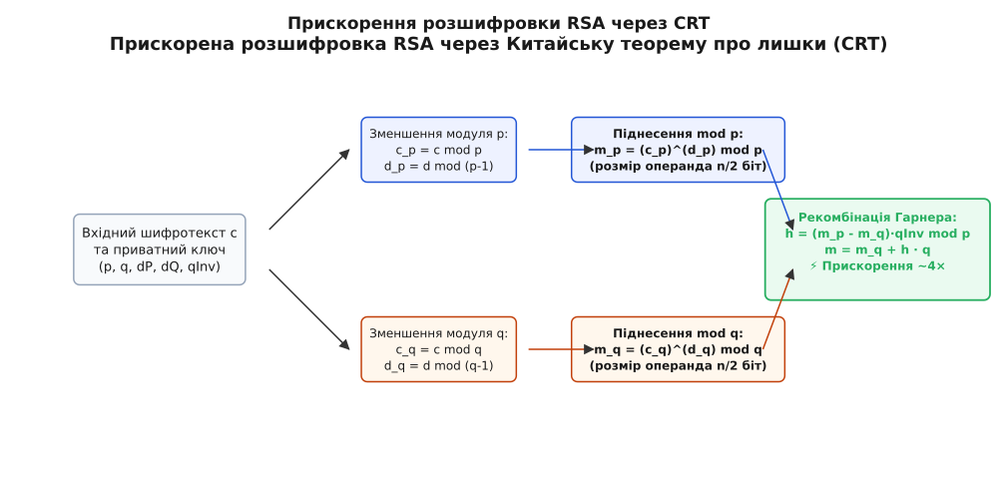
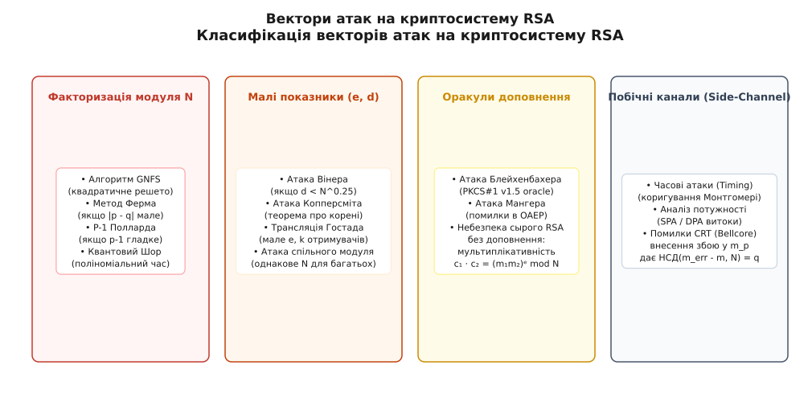

# Криптосистема RSA

<preknowlist>
- [Функція Ейлера](topic:math-number-theory/euler-totient) — порядок мультиплікативної групи залишків та піднесення до степеня за модулем.
- [НСД і алгоритм Евкліда](topic:math-number-theory/gcd-euclidean) — найбільший спільний дільник та поняття взаємної простоти.
- [Розширений алгоритм Евкліда та співвідношення Безу](topic:math-number-theory/bezout-identity) — обчислення мультиплікативно оберненого елемента за модулем.
- [Китайська теорема про лишки](topic:math-number-theory/chinese-remainder-theorem) — розкладання обчислень за взаємно простими модулями.
- [Мала теорема Ферма](topic:math-number-theory/fermat-little-theorem) — мультиплікативні властивості в скінченних полях.
- [Прості числа](topic:math-number-theory/prime-numbers) — фундаментальна теорема арифметики та складність факторизації.
</preknowlist>

Коли два дипломатичні відомства на протилежних боках земної кулі прагнуть налагодити захищений канал зв'язку за допомогою симетричного шифрування, вони потрапляють у глухий кут. Для зашифрування першого ж файлу їм потрібен спільний секретний ключ, але передати цей ключ по відкритих каналах інтернету неможливо, адже будь-який спостерігач скопіює його і зможе прочитати все подальше листування. Відправлення кур'єра з броньованою валізою вирішує задачу для двох військових штабів, але стає повністю непридатним, коли мільйони користувачів щосекунди відкривають нові зашифровані вебсторінки або купують товари в інтернет-магазинах із незнайомими серверами.

Розв'язати цю фундаментальну суперечність дозволяє криптосистема RSA — перший практичний асиметричний алгоритм шифрування та цифрового підпису, розроблений у 1977 році Рональдом Рівестом, Аді Шаміром та Леонардом Адлеманом. Замість одного спільного секрету RSA використовує пару математично пов'язаних ключів: відкритий ключ зашифровує дані і може бути опублікований у загальнодоступному довіднику, а приватний ключ зберігається в таємниці у власника і слугує єдиним інструментом для розшифрування.


*Схема асиметричного зашифрування та розшифрування RSA: відкритий ключ зашифровує, приватний ключ відновлює повідомлення.*

Глибинний історичний шлях від теоретичної концепції «несекретного шифрування» у британській розвідці GCHQ до нічного осяяння Рона Рівеста та публікації у журналі *Scientific American* розкрито у вставці [📜 Історія винайдення RSA та таємниця GCHQ](topic:sf-security/rsa-cryptosystem/hist-rsa-genesis.md).

---

## Одностороння функція з таємним входом

В основі всієї асиметричної криптографії лежить концепція **односторонньої функції з таємним входом** (Trapdoor One-Way Permutation). Це таке математичне перетворення `f`, яке задовольняє три жорсткі вимоги:

1. **Легкість обчислення в прямому напрямку:** Для будь-якого вхідного повідомлення `m` обчислення значення `c = f(m)` виконується за поліноміальний час від довжини вхідних даних.
2. **Нездійсненність обернення без секрету:** Знаючи лише значення `c` та публічний опис функції `f`, знайти початкове `m` за прийнятний час обчислювально неможливо (потрібні мільйони років роботи найпотужніших суперкомп'ютерів).
3. **Легкість обернення із таємним входом:** Існує спеціальний додатковий параметр `d` (таємний вхід чи trapdoor), володіння яким дозволяє легко знайти обернену функцію `m = f⁻¹(c)` за той самий поліноміальний час.


*Принцип односторонньої функції з таємним входом (Trapdoor Permutation): обернення легко тільки за наявності приватного показника d.*

У криптосистемі RSA роль такої односторонньої функції виконує піднесення до степеня за складеним модулем `N = p · q`, де `p` та `q` — це два великих простих числа. Прямим напрямком є піднесення повідомлення `m` до відкритого степеня `e` mod `N`. Оберненим напрямком є добування кореня `e`-го степеня за модулем `N`. Без знання розкладу модуля `N` на множники `p` та `q` добування кореня еквівалентне за складністю факторизації числа `N`. Проте знаючи `p` та `q`, можна обчислити порядок мультиплікативної групи `ϕ(N)` та знайти секретний показник `d`, який миттєво обертає операцію.

---

## Алгебраїчна структура кільця ℤ_N та порядок групи

Для розуміння причин, з яких алгоритм RSA вимагає використання саме складеного модуля `N = p · q`, необхідно розглянути алгебраїчні властивості кільця залишків `ℤ_N`.

Множина елементів `ℤ_N = {0, 1, 2, ..., N − 1}` відносно операцій додавання та множення за модулем `N` утворює комутативне кільце. Проте не кожен елемент цього кільця має мультиплікативно обернений елемент. Множина елементів, що володіють оберненим за множенням, називається **мультиплікативною групою залишків** і позначається `ℤ_N*`:

```
ℤ_N* = { a ∈ ℤ_N ∣ НСД(a, N) = 1 }
```

Кількість елементів у цій групі за визначенням дорівнює значенню функції Ейлера `ϕ(N)`. Оскільки модуль `N` є добутком двох різних простих чисел `p` та `q`, кожне число від `1` до `N − 1`, яке ділиться на `p` (іх всього `q − 1` штук) або на `q` (їх `p − 1` штук), не потрапляє до групи `ℤ_N*`. Віднімаючи ці елементи від загальної кількості `N − 1`, отримуємо:

```
ϕ(N) = (p · q − 1) − (q − 1) − (p − 1) = p · q − p − q + 1 = (p − 1) · (q − 1)
```

За теоремою Ейлера для будь-якого елемента `a ∈ ℤ_N*` його піднесення до степеня `ϕ(N)` повертає одиницю:

```
a^ϕ(N) ≡ 1 (mod N)
```

Саме ця періодичність показників степеня за модулем `N` з періодом `ϕ(N)` дозволяє згортати та розгортати степені при зашифруванні та розшифруванні.

---

## Алгебраїчна конструкція та генерація ключів

Математичний простір RSA будується у кільці залишків `ℤ_N`. Для створення пари ключів виконується послідовний каскад із п'яти кроків:

### 1. Вибір простих чисел

Випадково обираються два великих простих числа `p` та `q` приблизно однакової бітової довжини (наприклад, по 1024 біти кожне для отримання 2048-бітного ключа). Для генерації використовуються імовірнісні тести простоти, такі як тест Міллера — Рабіна. Для забезпечення стійкості числа `p` та `q` повинні відповідати додатковим криптографічним вимогам:

- Числа `p` та `q` мають бути таємними і незалежно згенерованими за допомогою стійкого генератора псевдовипадкових чисел (CSPRNG).
- Різниця `|p − q|` повинна бути великою (порядку `2^(n/2)`), інакше модуль `N` легко розкладається на множники за допомогою алгоритму Ферма.
- Значення `p − 1` та `q − 1` повинні мати великі прості дільники, щоб запобігти атаці `P − 1` Полларда.

### 2. Обчислення модуля та функції Ейлера

Обчислюється модуль шифрування `N`:

```
N = p · q
```

Число `N` є публічним. За фундаментальною теоремою арифметики розклад `N` на прості множники є єдиним. Значення функції Ейлера `ϕ(N)` обчислюється як:

```
ϕ(N) = (p − 1) · (q − 1)
```

Збереження значення `ϕ(N)` у таємниці є критичним: будь-хто, хто дізнається `ϕ(N)`, зможе негайно обчислити приватний ключ `d`.

### 3. Вибір відкритого показника e

Обирається ціле число `e` (Public Exponent), яке задовольняє умову взаємної простоти з `ϕ(N)`:

```
1 < e < ϕ(N)   та   НСД(e, ϕ(N)) = 1
```

У сучасній криптографічній практиці майже завжди обирають число `e = 65537` (`2¹⁶ + 1`). Воно є простим і містить у двійковому записі лише дві одиниці (`10000000000000001₂`), що робить піднесення до степеня надзвичайно швидким — всього 16 квадратів та 1 множення.

### 4. Обчислення приватного показника d

За допомогою розширеного алгоритму Евкліда знаходиться мультиплікативно обернений елемент до `e` за модулем `ϕ(N)`:

```
d ≡ e⁻¹ (mod ϕ(N))   ⇔   d · e ≡ 1 (mod ϕ(N))
```

Це означає існування такого цілого числа `k`, що `d · e = 1 + k · ϕ(N)`. Число `d` є приватним показником (Private Exponent).

### 5. Формування результуючих ключів

- **Відкритий ключ (Public Key):** Пара чисел `K_pub = (N, e)`.
- **Приватний ключ (Private Key):** Пара чисел `K_priv = (N, d)` (або повний кортеж із `p, q, d_p, d_q, q_{inv}`).

Після генерації ключів значення `p`, `q` та `ϕ(N)` мають бути або знищені, або збережені всередині захищеного контейнера приватного ключа.

---

## Числовий приклад генерації ключів та шифрування

Щоб простежити математику RSA в дії, розглянемо числовий приклад із малими простими числами.

**Крок 1: Вибір простих чисел**
Візьмемо `p = 61` та `q = 53`.

**Крок 2: Обчислення модуля та функції Ейлера**
```
N = 61 · 53 = 3233
ϕ(N) = (61 − 1) · (53 − 1) = 60 · 52 = 3120
```

**Крок 3: Вибір відкритого показника**
Оберемо `e = 17`. Перевіримо взаємну простоту: `НСД(17, 3120) = 1`.

**Крок 4: Обчислення приватного показника**
Знаходимо `d ≡ 17⁻¹ mod 3120` за допомогою розширеного алгоритму Евкліда:
```
17 · d ≡ 1 (mod 3120)
17 · 2753 = 46801 = 15 · 3120 + 1   ⇒   d = 2753
```

Отримали пари ключів: відкритий `K_pub = (3233, 17)` та приватний `K_priv = (3233, 2753)`.

**Крок 5: Зашифрування повідомлення**
Нехай відкритий текст це код символу `m = 65` (літера 'A').
```
c = mᵉ mod N = 65¹⁷ mod 3233
65¹ = 65
65² = 4225 ≡ 992 (mod 3233)
65⁴ = 992² = 984064 ≡ 1374 (mod 3233)
65⁸ = 1374² = 1887876 ≡ 2978 (mod 3233)
65¹⁶ = 2978² = 8868484 ≡ 992 (mod 3233)
c = 65¹⁷ = 65¹⁶ · 65¹ ≡ 992 · 65 = 64480 ≡ 2790 (mod 3233)
```
Отримано шифротекст `c = 2790`.

**Крок 6: Розшифрування повідомлення**
Володар приватного ключа обчислює `m = cᵈ mod N`:
```
m = 2790²⁷⁵³ mod 3233 ≡ 65 (mod 3233)
```
Початковий текст `m = 65` повністю відновлено.

---

## Операції шифрування та розшифрування

Нехай Аліса хоче надіслати Бобу зашифроване повідомлення. Вона дістає з публічного довідника відкритий ключ Боба `(N, e)`.

### Зашифрування

1. Повідомлення подається у вигляді цілого числа `m` у діапазоні `0 ≤ m < N`. Якщо повідомлення перевищує `N`, його розбивають на блоки або використовують гібридне шифрування.
2. Аліса обчислює шифротекст `c`:

```
c = mᵉ mod N
```

Операція піднесення до степеня виконується ефективно за допомогою алгоритму бінарного піднесення (Square-and-Multiply).

### Розшифрування

Отримавши шифротекст `c`, Боб застосовує свій приватний ключ `(N, d)`:

```
m = cᵈ mod N
```

Завдяки спеціально підібраному зв'язку `d · e ≡ 1 (mod ϕ(N))` результатом піднесення шифротексту `c` до степеня `d` за модулем `N` стає початкове відкрите повідомлення `m`.

---

## Чому це працює: огляд математичної коректності

Коректність розшифрування RSA зводиться до доведення тотожності:

```
(mᵉ)ᵈ ≡ m^(e·d) ≡ m (mod N)
```

Якщо повідомлення `m` взаємно просте з модулем `N` (`НСД(m, N) = 1`), доведення прямує безпосередньо з **теореми Ейлера**. Оскільки `e · d = 1 + k · ϕ(N)`, маємо:

```
m^(e·d) = m^(1 + k·ϕ(N)) = m · (m^ϕ(N))^k ≡ m · (1)^k ≡ m (mod N)
```

Проте якщо `m` має спільні дільники з `N` (тоді `m` ділиться на `p` або на `q`), теорема Ейлера непридатна, бо `m not∈ ℤ_N*`. У такому разі доведення будується через розкладання за модулями `p` та `q` окремо із застосуванням **Малої теореми Ферма** та подальшим об'єднанням через **Китайську теорему про лишки**.

Строге математичне виведення для всіх можливих значень `m`, а також розбір атак Вінера, Гостада та спільного модуля містяться у вставці [🧮 Математичне доведення коректності та аналіз атак на RSA](topic:sf-security/rsa-cryptosystem/math-rsa-correctness-and-attacks.md).

---

## Односторонність проти факторизації: на чому тримається стійкість

Стійкість криптосистеми RSA базується на обчислювальній складності **проблеми факторизації великих цілих чисел** (Integer Factorization Problem).

Якщо спостерігач знає відкритий ключ `(N, e)`, для знаходження приватного ключа `d` йому необхідно розв'язати порівняння `d · e ≡ 1 (mod ϕ(N))`. Щоб знайти `ϕ(N) = (p − 1)(q − 1)`, йому необхідно знайти дільники `p` та `q` з рівняння `N = p · q`.

На сьогодні не відомо жодного класичного алгоритму, здатного розкласти довільне складене число `N` на прості множники за поліноміальний час. Найефективнішим загальним алгоритмом факторизації для великих чисел є **алгоритм загального решета числового поля** (General Number Field Sieve — GNFS). Його обчислювальна складність є субекспоненціальною:

```
L_N [1/3, c] = exp( (c + o(1)) · (ln N)^(1/3) · (ln ln N)^(2/3) )
```

Збільшення довжини модуля `N` призводить до вибухового зростання кількості операцій, необхідних для факторизації:

| Довжина ключа N | Складність факторизації (в операціях) | Еквівалентна симетрична стійкість |
| :--- | :--- | :--- |
| **1024 біти** | `≈ 2⁸⁰` операцій | Вражена (зломана у 2020-х для державних лабораторій) |
| **2048 бітів** | `≈ 2¹¹²` операцій | Стандартний захист (безпечно до 2030 року) |
| **3072 біти** | `≈ 2¹²⁸` операцій | Довгостроковий захист (еквівалент AES-128) |
| **4096 бітів** | `≈ 2¹⁵⁶` операцій | Максимальний рівень цивільного захисту |

Проте поява повномасштабного квантового комп'ютера змінить правила гри. **Алгоритм Шора**, розроблений Пітером Шором у 1994 році, розв'язує задачу факторизації та дискретного логарифмування на квантовому комп'ютері за поліноміальний час `O((log N)³)`. Це означає, що квантовий комп'ютер достатньої потужності зможе зламати ключ RSA-2048 за кілька хвилин.

> 🔧 **Навіщо це.**
> Розуміння субекспоненціальної здатності алгоритму GNFS та загрози алгоритму Шора пояснює сучасний глобальний перехід криптографічної галузі до постквантових стандартів (Post-Quantum Cryptography — PQC), таких як криптографія на решітках (Lattice-based cryptography), які заступають RSA у нових версіях протоколів.

---

## Небезпека «сирого» (Textbook) RSA та оракули доповнення

У підручниках з математики шифрування RSA описується у чистому вигляді як `c = mᵉ mod N`. Використання такого «сирого» (Textbook RSA) у реальних програмних системах є смертельно небезпечним з кількох причин:

1. **Детермінованість:** Якщо відправити одне й те саме повідомлення `m` двічі, отримаємо абсолютно однакові шифротексти `c`. Це дозволяє спостерігачу відстежувати повтори та перевіряти гіпотези.
2. **Мультиплікативна гомоморфність:** Для двох шифротекстів `c₁ = m₁ᵉ mod N` та `c₂ = m₂ᵉ mod N` їхній добуток дає:

```
c₁ · c₂ mod N = (m₁ᵉ) · (m₂ᵉ) mod N = (m₁ · m₂)^e mod N
```

Це дозволяє атакуючому модифікувати шифротекст у дорозі (наприклад, помножити зашифровану суму транзакції на 2), не знаючи вмісту!
3. **Малі значення m:** Якщо повідомлення `m` таке мале, що `mᵉ < N`, то модульне зменшення не відбудеться зовсім, і шифротекст буде звичайним цілим числом `c = mᵉ`. Атакуючий відновлює `m` звичайним добуванням кореня `e`-го степеня над цілими числами!

Для усунення цих вразливостей перед шифруванням відкритий текст обов'язково піддається випадковому **доповненню** (Padding).

Сучасним стандартом є схема **OAEP** (Optimal Asymmetric Encryption Padding). Вона поєднує відкритий текст із випадковим вектором (salt) за допомогою двох мереж Фейстеля та криптографічних геш-функцій (MGF1). Це перетворює RSA на ймовірнісну криптосистему, стійку до атак на основі підібраного шифротексту (IND-CCA2).

---

## Прискорення розшифрування через CRT

Найповільнішою операцією в RSA є розшифрування `m = cᵈ mod N`, оскільки приватний показник `d` має таку ж бітову довжину, як і модуль `N` (наприклад, 2048 біт). 

Для прискорення процесів у серверах та смарткартах використовують **Китайську теорему про лишки** (CRT). Замість одного піднесення за модулем `N` розрядністю 2048 біт виконуються два незалежні піднесення за модулями `p` та `q` розрядністю 1024 біти.


*Розкладання обчислень за модулями p та q через CRT дає чотирикратне прискорення розшифрування.*

Для цього у приватному ключі зберігаються три допоміжні константи:

```
d_p = d mod (p − 1)
d_q = d mod (q − 1)
q_{inv} = q⁻¹ mod p
```

Обчислення виконуються у чотири кроки:
1. Зменшення шифротексту: `c_p = c mod p` та `c_q = c mod q`.
2. Швидкі піднесення до степенів: `m_p = (c_p)^(d_p) mod p` та `m_q = (c_q)^(d_q) mod q`.
3. Рекомбінація Гарнера: `h = q_{inv} · (m_p − m_q) mod p`.
4. Відновлення повідомлення: `m = m_q + h · q`.

Оскільки тригонометрична складність множення за модулем пропорційна кубу довжини операнда, зменшення розрядності вдвічі прискорює кожне піднесення у 8 разів. Два таких піднесення разом виконуються приблизно у **4 рази швидше**, ніж один вихідний розрахунок `cᵈ mod N`.

---

## Вектори атак та класифікація вразливостей

Протягом десятиліть дослідження RSA криптографи сформулювали чітку класифікацію векторів атак:


*Класифікація векторів атак: факторизація модуля, малі показники, оракули доповнення та витоки побічними каналами.*

Детальний аналіз реалізації алгоритмів у коді, порівняння програмних втілень C та C++, а також захисту від витоків побічними каналами наведено у матеріалі [⚙️ Практична реалізація RSA: генерація, CRT-прискорення та доповнення OAEP](topic:sf-security/rsa-cryptosystem/proj-rsa-implementation.md).

Повний опис структур ASN.1 (DER/PEM), форматів PKCS #1 та PKCS #8, а також інструкції з використання консольного інструментарію OpenSSL CLI доступні у вставці [📋 Специфікація форматів ключів, ASN.1 та інструментарій OpenSSL](topic:sf-security/rsa-cryptosystem/api-rsa-keys-and-formats.md).

---

## Цифровий підпис RSA

Крім зашифрування даних, криптосистема RSA природним чином підтримує створення **цифрового підпису** (Digital Signature).

Оскільки піднесення до степеня `e` та `d` є взаємно оберненими операціями, їх можна застосувати у зворотному порядку:

1. **Створення підпису (Аліса):** Аліса обчислює криптографічний геш повідомлення `h = H(m)`. Потім вона підносить геш до свого *приватного* степеня:

```
s = hᵈ mod N
```

Число `s` є цифровим підписом.

2. **Перевірка підпису (Боб):** Отримавши повідомлення `m` та підпис `s`, Боб підносить `s` до *відкритого* ключа Аліси `(N, e)`:

```
h' = sᵉ mod N
```

Боб самостійно обчислює `H(m)`. Якщо `h' == H(m)`, підпис вважається дійсним. Це гарантує як цілісність даних, так і незаперечність авторства (non-repudiation), адже створити `s` міг лише володар приватного ключа `d`. Для захисту підписів від атак оракулів використовують спеціальне доповнення **PSS** (Probabilistic Signature Scheme).
