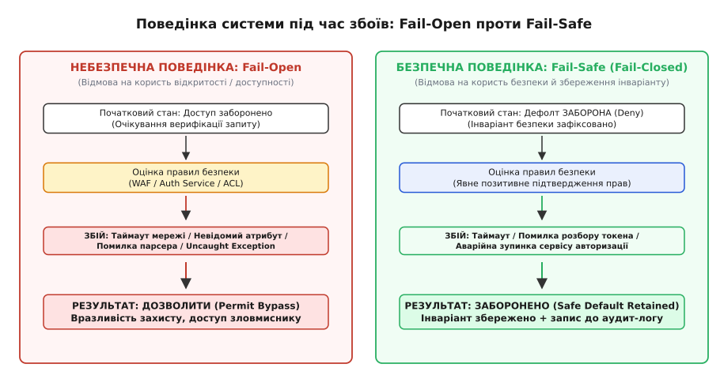
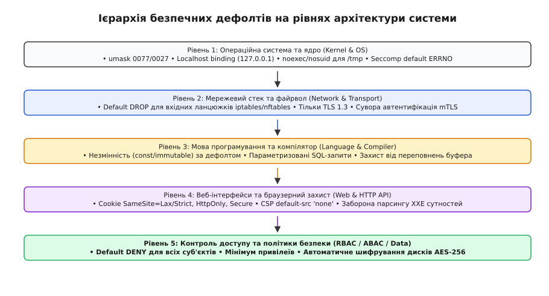
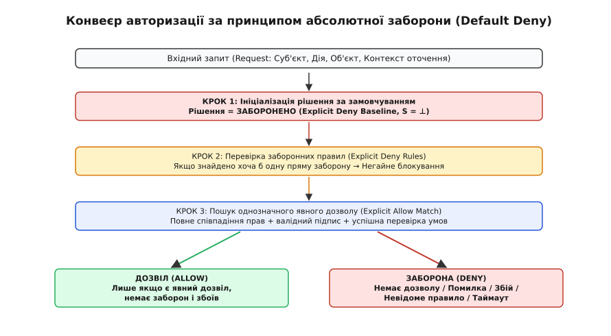

# Безпечні дефолти та відмова захисту (Fail-Safe Defaults)

<preknowlist>
- [Принцип найменших привілеїв](topic:sf-security/least-privilege) — мінімізація прав суб'єкта до строго необхідного для конкретної задачі.
- [Межі довіри](topic:sf-security/trust-boundaries) — лінії розмежування між компонентами системи з різними рівнями прав і довіри.
- [Поверхня атаки](topic:sf-security/attack-surface) — повна сукупність доступних точок входу, каналів зв'язку та неконтрольованих станів.
- [Моделювання загроз](topic:sf-security/threat-modeling) — ідентифікація векторів компрометації, активів та сценаріїв впливу зловмисника.
- [Системний виклик](topic:hw-arch/system-call) — інтерфейс взаємодії процесу користувача з ядром операційної системи.
</preknowlist>

У високонавантаженому хмарному платіжному шлюзі мікросервіс авторизації перевіряє право користувача на списання коштів із банківського рахунку. Під час раптового пікового сплеску транзакцій черга запитів до розподіленого кешу Redis переповнюється, і внутрішній клієнт авторизаційного проксі-сервера генерує мережевий таймаут (Socket Timeout Exception). 

Розробники шлюзу прагнули забезпечити безперервність бізнесу та високу доступність сервісу (High Availability), тому в коді обробки винятків залишили логіку: «якщо кеш недоступний, пропустити транзакцію як тимчасово дозволену, щоб не дратувати клієнта затримкою платежу».

Зловмиснику не потрібно підробляти криптографічні підписи, викрадати приватні ключі чи зламувати складні алгоритми автентифікації. Йому достатньо згенерувати потік паралельних "важких" запитів, який перевантажує мережевий інтерфейс бази даних авторизації та викликає таймаут. Щойно сервіс перевірки прав стикається зі збоєм, він автоматично відкриває доступ, і неавторизовані запити успішно списують кошти. 

Цей сценарій ілюструє класичну катастрофу проектування: **система обрала відкритість за замовчуванням під час збою (Fail-Open), зруйнувавши базовий інваріант безпеки заради локальної доступності**. 

**Безпечні дефолти** (англ. *fail-safe defaults*, від лат. *deficere* — «відмовляти, бракувати» та англ. *default* — «стан за замовчуванням») — це фундаментальний архітектурний принцип комп'ютерної безпеки, згідно з яким базовим початковим станом будь-якого компонента є абсолютна заборона доступу (Default Deny), а будь-яка непередбачена помилка, таймаут, пошкодження вхідних даних чи аварійна зупинка обов'язково переводять систему в максимально закритий та захищений стан (Fail-Closed).

## Чому модель Opt-In безпеки завжди програє

У розробці програмних систем існує два діаметрально протилежних підходи до конфігурації захисних механізмів:
1. **Opt-In безпека (Default Open / Захист на вимогу)**: система постачається у максимально відкритому та функціональному стані. Усі порти відкриті, мережевий доступ дозволений, перевірки прав вимкнені, а шифрування є опціональним. Щоб захистити систему, інженер має власноруч знайти потрібні параметри у документації та увімкнути їх;
2. **Opt-Out безпека (Default Deny / Secure by Default)**: система постачається у максимально ізольованому стані. Усі зовнішні інтерфейси заблоковані, доступ до ресурсів заборонений, шифрування увімкнене примусово, а виконання стороннього коду заблоковане. Щоб відкрити доступ, інженер має явно оголосити виняток і надати конкретні привілеї.

Протягом десятиліть індустрія віддавала перевагу підходу Opt-In через бажання мінімізувати тертя для розробника та надати привабливий досвід першого запуску («працює прямо з коробки»). Проте практика довела: **Opt-In модель є гарантованим джерелом вразливостей через фундаментальні властивості людської психіки та складність сучасних систем**.

```
[Людський фактор: дефіцит уваги] → [Пропуск необов'язкових опцій] → [Відкрита діра за дефолтом]
[Принцип безпечних дефолтів]     → [Система закрита «з коробки»]  → [Явне усвідомлене відкриття]
```

### 1. Когнітивне навантаження та втома від вибору
Сучасна операційна система, веб-фреймворк або хмарна інфраструктура містять тисячі параметрів конфігурації. Жоден розробник чи системний адміністратор фізично не здатний досконало вивчити кожне налаштування. 

Якщо захист вимагає активної дії (наприклад, встановлення прапорця `enable_csrf_protection = true` або виклику функції `sanitize_input()`), розробник у стані дедлайну або втоми неминуче пропустить цей крок. За безпечних дефолтів захист працює автоматично, доки його не вимкнуть свідомо.

### 2. Принцип найменшого здивування (Principle of Least Astonishment)
Поведінка програмного інтерфейсу (API) має відповідати очікуванням інженера щодо безпеки. Якщо бібліотека роботи з базами даних надає метод `executeQuery(query)`, інженер очікує, що метод безпечно обробляє параметри. 

Якщо ж за замовчуванням метод виконує сиру інтерполяцію рядків, створюючи вразливість SQL-ін'єкції, а для безпечного виконання потрібно викликати спеціальний окремий метод `executePreparedStatement()`, інтерфейс провокує помилку на рівні самого свого дизайну.

### 3. Ерозія конфігурацій (Configuration Drift) та оновлення
З часом програмний комплекс розвивається: додаються нові модулі, розширюються схеми баз даних, оновлюються сторонні бібліотеки. 
- Якщо у системі діє політика чорного списку (Blacklist / Opt-In заборона), додавання нового ендпоінта автоматично робить його відкритим для всього світу, доки хтось не згадає додати його до списку захищених;
- Якщо діє політика білого списку (Whitelist / Default Deny), новий ендпоінт є заблокованим за замовчуванням. Програміст змушений явно надати права, що виключає випадкову публікацію конфіденційного інтерфейсу.

### 4. Асиметрія детекції дефектів
Найважливіша інженерна перевага безпечних дефолтів полягає у зміні характеру прояву помилок:

| Характеристика | Помилка в системі Default Open (Fail-Open) | Помилка в системі Default Deny (Fail-Safe) |
| :--- | :--- | :--- |
| **Характер прояву** | **Тиха вразливість (Silent Breach)**: система працює штатно, але зловмисник отримує несанкціонований доступ. | **Гучний збій (Loud Failure)**: легітимний користувач отримує помилку `403 Forbidden` або `Access Denied`. |
| **Час виявлення** | Місяці або роки (часто лише після аудиту або витоку бази даних). | Секунди (під час першого модульного або інтеграційного тесту). |
| **Хто помічає першим** | Зловмисник або зовнішній сканер уразливостей. | Розробник або тестувальник під час розробки. |
| **Ціна виправлення** | Катастрофічні фінансові та репутаційні збитки. | Кілька хвилин на додавання явного правила дозволу в конфігурацію. |

## Анатомія автоматів станів: Fail-Closed проти Fail-Open

Будь-яка функція або підсистема контролю доступу може бути представлена як автомат станів, що приймає вхідний запит і здійснює переходи на основі оцінки правил безпеки.


*Поведінка системи під час збоїв: у моделі Fail-Open будь-який непередбачений виняток призводить до несанкціонованого пропуску, тоді як модель Fail-Safe гарантує перехід у стан абсолютної ізоляції.*

Розглянемо три критичні стадії роботи авторизаційного конвеєра:

### 1. Ініціалізація внутрішнього стану
У захищеному рушії початковий стан змінної вердикту завжди встановлюється в значення `DENY` (або `false` для булевих прапорців). 

Порівняємо два підходи до ініціалізації булевого стану авторизації:

:::tabs
```c
/* НЕБЕЗПЕЧНО: Оптимістичний дефолт */
bool check_access_insecure(const User* user, const char* ip) {
    bool access_granted = true;
    if (user_is_banned(user)) access_granted = false;
    if (ip_is_blacklisted(ip)) access_granted = false;
    return access_granted;
}

/* БЕЗПЕЧНО: Песимістичний дефолт */
bool check_access_secure(const User* user, const char* resource, const char* ip) {
    bool access_granted = false;
    if (user_is_authenticated(user) && 
        user_has_explicit_permission(user, resource) && 
        ip_in_allowed_subnet(ip)) {
        access_granted = true;
    }
    return access_granted;
}
```
```cpp
#include <string_view>
#include <optional>

struct UserContext {
    bool is_authenticated{false};
    bool is_banned{false};
};

/* БЕЗПЕЧНО: C++20 ідіоматичний підхід із Default Deny за замовчуванням */
[[nodiscard]] bool check_access_secure(const UserContext& user, 
                                       std::string_view resource, 
                                       std::string_view client_ip) noexcept {
    if (!user.is_authenticated || user.is_banned) {
        return false;
    }

    // Дозвіл вимагає явного виконання всіх критеріїв безпеки
    const bool has_permission = (resource == "/public/status");
    const bool is_allowed_ip = (client_ip == "127.0.0.1");

    return has_permission && is_allowed_ip;
}
```
:::

У небезпечній реалізації будь-яка нова загроза (наприклад, прострочений термін дії пароля чи відсутність MFA) вимагає додавання нової перевірки. Якщо умова пропущена або під час виконання сталася помилка, функція поверне дозвіл. У безпечній реалізації доступ блокується за замовчуванням.

### 2. Обробка часткових та пошкоджених станів
У розподілених архітектурах вхідні дані часто виявляються неповними: токен авторизації пошкоджено при передачі через HTTP-проксі, поле ролі користувача відсутнє у відповіді мікросервісу автентифікації, або сервіс перевірки підпису повертає код помилки `ERR_INVALID_ASN1_ENCODING`.

У парадигмі Fail-Safe відсутність інформації прирівнюється до заборони доступу. Строге математичне обґрунтування цієї властивості через алгебру решіток та функцію редукції стану невизначеності наведено у [математичній формалізації автоматів безпечної відмови та решіток доступу](topic:sf-security/secure-defaults/math-failsafe-automata.md).

### 3. Таймаути та аварії залежностей
Коли компонент безпеки звертається до зовнішньої підсистеми (LDAP-сервера, віддаленої бази даних OIDC, сервісу оцінки ризиків WAF), обов'язково встановлюється жорсткий граничний таймаут (Bounded Execution Window). 

Якщо відповідь не надійшла за відведений проміжок часу (наприклад, 50 мілісекунд), конвеєр перериває очікування і повертає `DENY`. Система жертвує локальною доступністю конкретного запиту, але зберігає глобальний інваріант безпеки всього комплексу.

## Історичний контекст та уроки індустрії

Концепція безпечних дефолтів виникла не як абстрактна математична теорія, а як вимушена відповідь на серію катастрофічних аварій ранніх відкритих систем. 

Перші операційні системи 1960–1970-х років проектувалися для взаємної довіри науковців. Лише після серії масштабних криз та публікації фундаментальної праці Джерома Зальцера і Майкла Шредера 1975 року індустрія усвідомила необхідність принципу Fail-Safe Defaults. Детальна хроніка цих подій, епідемії хробаків Code Red і SQL Slammer 2000-х років, меморандум Білла Гейтса Trustworthy Computing та сучасні вимоги CISA описані в [історичному нарисі еволюції безпечних дефолтів](topic:sf-security/secure-defaults/hist-saltzer-schroeder-defaults.md).

### Три повчальні катастрофи небезпечних дефолтів XXI століття

1. **Епідемія відкритих баз даних MongoDB (2017 рік)**:
   Історично СКБД MongoDB встановлювалася з прив'язкою до всіх мережевих інтерфейсів `0.0.0.0` та з повністю відключеною автентифікацією за замовчуванням. Розробники вважали, що це полегшує локальне тестування. Коли тисячі серверів розгорнули у хмарах без зміни дефолтів, автоматизовані боти-вимагачі стерли та зашифрували понад 45 000 баз даних по всьому світу за кілька днів;

2. **Масові витоки даних зі сховищ AWS S3 (2017–2023 роки)**:
   У ранніх версіях консолі Amazon Web Services створення нового S3-бакета дозволяло випадкове призначення публічних прав доступу (`Public Read`). Корпоративні резервні копії, персональні дані виборців та вихідні коди сотень транснаціональних корпорацій опинилися у відкритому доступі. Лише у 2023 році AWS примусово увімкнула політику `Block Public Access` та шифрування SSE-S3 для всіх нових бакетів за замовчуванням;

3. **Перехід від ABAC до RBAC у Kubernetes (версія 1.6)**:
   Ранній оркестратор контейнерів Kubernetes використовував застарілу модель контролю доступу ABAC, де будь-який под у кластері за дефолтом отримував повний доступ до API-сервера через автоматично змонтований сервісний токен. З версії 1.6 стандартним дефолтом став механізм RBAC із суворою ізоляцією та нульовими правами для нових ServiceAccount.

## Безпечні дефолти на рівнях системного стека

Забезпечення безпечних дефолтів не може бути обмежене лише прикладним кодом програми. Це наскрізний інженерний принцип, який повинен суворо виконуватися на кожному рівні обчислювального стека.


*Ієрархія безпечних дефолтів: від системних викликів ядра ОС до прикладних інтерфейсів авторизації.*

---

### Рівень 1: Ядро операційної системи та системні ресурси

Операційна система є фундаментом ізоляції процесів. Помилка у дефолтних налаштуваннях ОС нівелює будь-який захист прикладного рівня.

#### 1. Файлові маски створення (umask)
Коли процес створює новий файл через системний виклик `open(..., O_CREAT, 0666)`, фінальні бітові права доступу обчислюються шляхом накладання маски процесу: `mode & ~umask`. 

Застарілий стандартний дефолт багатьох дистрибутивів Linux `umask 0022` створює файли з правами `0644` (`rw-r--r--`), роблячи їх доступними для читання будь-яким іншим локальним користувачем системи. 

У захищеному середовищі стандартним дефолтом для серверних процесів є `umask 0027` (заборона доступу всім, окрім групи власника) або `umask 0077` (доступ виключно власнику процесу, `0600` / `rw-------`).

#### 2. Мережева прив'язка локальних сокетів (Bind Address)
За замовчуванням створення TCP-сокета без явної вказівки IP-адреси прив'язує його до широкомовного псевдоінтерфейсу `0.0.0.0` (INADDR_ANY), роблячи сервіс доступним на всіх фізичних мережевих картах. 

Безпечний дефолт вимагає явної прив'язки сервісів, які не є публічними веб-серверами (бази даних Redis, PostgreSQL, внутрішні gRPC-демони), виключно до адреси локальної петлі `127.0.0.1` (або `::1`).

#### 3. Політика фільтрації фаєрвола (Default DROP)
У мережевих фільтрах Linux (iptables, nftables) базові ланцюжки пакетів (`INPUT`, `FORWARD`, `OUTPUT`) можуть мати політику за замовчуванням `ACCEPT` або `DROP`. 
- Конфігурація з дефолтним `ACCEPT` дозволяє будь-який трафік, доки не спрацює конкретне правило блокування;
- Безпечний дефолт встановлює політику ланцюжка `INPUT` у `DROP`. Дозволяються лише пакети, які явно відповідають правилам білого списку або належать до вже встановлених з'єднань (`ct state established,related accept`).

#### 4. Обмеження системних викликів (Seccomp-BPF)
За замовчуванням будь-який процес у просторі користувача має доступ до понад 450 системних викликів ядра Linux. Якщо процес скомпрометовано, зловмисник може викликати `ptrace`, `bpf`, `mount` або `execve` для підвищення привілеїв. 

Безпечний дефолт передбачає застосування фільтра Seccomp, дія за замовчуванням якого — аварійне завершення процесу (`SECCOMP_RET_KILL_PROCESS`) або повернення помилки доступу `SECCOMP_RET_ERRNO(EPERM)`. Процесу дозволяється лише мінімальний перерахований список викликів (`read`, `write`, `exit_group`, `futex`).

Розглянемо практичну реалізацію безпечного налаштування створення файлів та ініціалізації Seccomp-фільтра:

:::tabs
```c
#include <stdio.h>
#include <stdlib.h>
#include <fcntl.h>
#include <unistd.h>
#include <sys/stat.h>
#include <sys/prctl.h>
#include <linux/seccomp.h>
#include <linux/filter.h>
#include <linux/audit.h>
#include <stddef.h>
#include <errno.h>

/* Встановлення безпечної маски та захищене створення файлу конфігурації */
int create_secure_config_file(const char* filepath) {
    /* 1. Безпечний дефолт umask: лише власник має права читання й запису */
    mode_t old_mask = umask(0077);

    /* 2. Створення з явними прапорцями безпеки: O_EXCL запобігає перетиранню симлінків */
    int fd = open(filepath, O_WRONLY | O_CREAT | O_EXCL | O_CLOEXEC, 0600);
    
    /* Відновлення системної маски */
    umask(old_mask);

    if (fd < 0) {
        return -1;
    }
    return fd;
}

/* Ініціалізація Seccomp-BPF з політикою Default Deny (KILL) */
int apply_strict_seccomp_sandbox(void) {
    /* Заборона отримання нових привілеїв через execve */
    if (prctl(PR_SET_NO_NEW_PRIVS, 1, 0, 0, 0) != 0) {
        return -1;
    }

    struct sock_filter filter[] = {
        /* Завантаження номера системного виклику: BPF_LD | BPF_W | BPF_ABS, offset 0 */
        BPF_STMT(BPF_LD | BPF_W | BPF_ABS, (offsetof(struct seccomp_data, nr))),

        /* Дозволені виклики: явний білий список */
        BPF_JUMP(BPF_JMP | BPF_JEQ | BPF_K, __NR_read, 0, 1),
        BPF_STMT(BPF_RET | BPF_K, SECCOMP_RET_ALLOW),

        BPF_JUMP(BPF_JMP | BPF_JEQ | BPF_K, __NR_write, 0, 1),
        BPF_STMT(BPF_RET | BPF_K, SECCOMP_RET_ALLOW),

        BPF_JUMP(BPF_JMP | BPF_JEQ | BPF_K, __NR_exit_group, 0, 1),
        BPF_STMT(BPF_RET | BPF_K, SECCOMP_RET_ALLOW),

        /* БЕЗПЕЧНИЙ ДЕФОЛТ: Будь-який інший системний виклик негайно вбиває процес */
        BPF_STMT(BPF_RET | BPF_K, SECCOMP_RET_KILL_PROCESS),
    };

    struct sock_fprog prog = {
        .len = (unsigned short)(sizeof(filter) / sizeof(filter[0])),
        .filter = filter,
    };

    if (prctl(PR_SET_SECCOMP, SECCOMP_MODE_FILTER, &prog) != 0) {
        return -1;
    }

    return 0;
}
```
```cpp
#include <iostream>
#include <string_view>
#include <filesystem>
#include <expected>
#include <span>
#include <vector>
#include <fcntl.h>
#include <unistd.h>
#include <sys/stat.h>
#include <sys/prctl.h>
#include <linux/seccomp.h>
#include <linux/filter.h>
#include <linux/audit.h>
#include <cstddef>

namespace security {

class [[nodiscard]] SecureFileDescriptor {
public:
    explicit SecureFileDescriptor(int fd) noexcept : fd_(fd) {}
    ~SecureFileDescriptor() noexcept {
        if (fd_ >= 0) {
            ::close(fd_);
        }
    }

    SecureFileDescriptor(const SecureFileDescriptor&) = delete;
    SecureFileDescriptor& operator=(const SecureFileDescriptor&) = delete;

    SecureFileDescriptor(SecureFileDescriptor&& other) noexcept : fd_(other.fd_) {
        other.fd_ = -1;
    }

    SecureFileDescriptor& operator=(SecureFileDescriptor&& other) noexcept {
        if (this != &other) {
            if (fd_ >= 0) ::close(fd_);
            fd_ = other.fd_;
            other.fd_ = -1;
        }
        return *this;
    }

    [[nodiscard]] int get() const noexcept { return fd_; }
    [[nodiscard]] bool is_valid() const noexcept { return fd_ >= 0; }

private:
    int fd_{-1};
};

[[nodiscard]] std::expected<SecureFileDescriptor, int> create_secure_config_file(std::string_view filepath) noexcept {
    // Встановлення безпечної маски для ізоляції файлу
    const mode_t old_mask = ::umask(0077);

    const int fd = ::open(filepath.data(), O_WRONLY | O_CREAT | O_EXCL | O_CLOEXEC, 0600);
    ::umask(old_mask);

    if (fd < 0) {
        return std::unexpected(errno);
    }
    return SecureFileDescriptor(fd);
}

[[nodiscard]] std::expected<void, int> apply_strict_seccomp_sandbox() noexcept {
    if (::prctl(PR_SET_NO_NEW_PRIVS, 1, 0, 0, 0) != 0) {
        return std::unexpected(errno);
    }

    const std::vector<sock_filter> filter = {
        BPF_STMT(BPF_LD | BPF_W | BPF_ABS, (offsetof(struct seccomp_data, nr))),

        // Явний білий список системних викликів
        BPF_JUMP(BPF_JMP | BPF_JEQ | BPF_K, __NR_read, 0, 1),
        BPF_STMT(BPF_RET | BPF_K, SECCOMP_RET_ALLOW),

        BPF_JUMP(BPF_JMP | BPF_JEQ | BPF_K, __NR_write, 0, 1),
        BPF_STMT(BPF_RET | BPF_K, SECCOMP_RET_ALLOW),

        BPF_JUMP(BPF_JMP | BPF_JEQ | BPF_K, __NR_exit_group, 0, 1),
        BPF_STMT(BPF_RET | BPF_K, SECCOMP_RET_ALLOW),

        // Дефолтна дія: знищення процесу при спробі несанкціонованого виклику
        BPF_STMT(BPF_RET | BPF_K, SECCOMP_RET_KILL_PROCESS),
    };

    const sock_fprog prog = {
        .len = static_cast<unsigned short>(filter.size()),
        .filter = const_cast<sock_filter*>(filter.data()),
    };

    if (::prctl(PR_SET_SECCOMP, SECCOMP_MODE_FILTER, &prog) != 0) {
        return std::unexpected(errno);
    }

    return {};
}

} // namespace security
```
:::

---

### Рівень 2: Мови програмування та компілятори

Архітектура мови програмування та прапорці компілятора формують фундаментальні дефолти безпеки коду.

#### 1. Незмінність за замовчуванням (Immutability by Default)
У класичних мовах C/C++ змінна є модифікованою за замовчуванням, якщо не вказано специфікатор `const`. Це призводить до ненавмисних мутацій стану в багатопотоковому коді та стану перегонів (Race Conditions). 

Сучасні мови програмування (Rust, Swift) інвертували цей дефолт: будь-яка змінна є незмінною (`let x = 5;`), а для дозволу модифікації вимагається явне ключове слово `mut`.

#### 2. Захист від переповнення буфера та ініціалізація пам'яті
У мові C виділення пам'яті на стеку `int buffer[100];` залишає масив заповненим сміттям з пам'яті процесу, що призводить до витоку секретів або невизначеної поведінки (UB). 

Сучасні компілятори (GCC 12+, Clang 14+) надають прапорці безпечних дефолтів:
- `-ftrivial-auto-var-init=zero`: примусове автоматичне занулення всіх локальних змінних на стеку;
- `-fstack-protector-strong`: автоматичне розміщення канарок стека (Stack Canaries) для виявлення переповнень буфера;
- `-D_FORTIFY_SOURCE=3`: динамічна перевірка довжини буферів у функціях `memcpy`, `strcpy`, `snprintf`.

#### 3. Параметризовані SQL-запити проти інтерполяції рядків
Найпоширеніша вразливість баз даних — SQL-ін'єкція — виникає тоді, коли інтерфейс роботи з БД дозволяє розробнику склеювати рядки запиту та користувацькі дані. 

Безпечний дефолт бібліотек ORM вимагає використання виключно параметризованих підготовлених виразів (Prepared Statements):
```
SELECT * FROM users WHERE email = ? AND status = ?
```
Драйвер бази даних передає SQL-код інструкції та користувацькі параметри різними мережевими пакетами або окремими дескрипторами протоколу. Інтерпретатор SQL на сервері баз даних принципово не здатний виконати дані як код, ліквідуючи вразливість на структурному рівні.

---

### Рівень 3: Веб-інфраструктура та API

У веб-розробці безпечні дефолти захищають браузер клієнта та сервер від атак міжсайтового виконання скриптів (XSS), підробки запитів (CSRF) та несанкціонованого парсингу.

#### 1. Дефолтні атрибути сесійних куків (SameSite, Secure, HttpOnly)
Історично файли cookie створювалися без прапорців безпеки, що дозволяло надсилати їх у будь-яких сторонніх міжсайтових запитах (Cross-Site Requests) і читати через клієнтський JavaScript.

Сучасний нормативний дефолт вимагає обов'язкового встановлення трьох прапорців:
- `SameSite=Lax` (або `Strict`): куки не передаються при міжсайтових POST-запитах чи AJAX-викликах, що унеможливлює атаки CSRF;
- `HttpOnly`: браузер блокує доступ до `document.cookie` з JavaScript, захищаючи токен сесії від крадіжки у разі XSS-атаки;
- `Secure`: передача куків дозволена виключно через шифрований протокол HTTPS.

#### 2. Політика захисту контенту (CSP: Content-Security-Policy)
За замовчуванням браузер завантажує та виконує скрипти, стилі та зображення з будь-яких доменів, вказаних у HTML-розмітці. 

Безпечний дефолт CSP починається з повної заборони всіх джерел:
```http
Content-Security-Policy: default-src 'none'; script-src 'self'; style-src 'self'; img-src 'self'; frame-ancestors 'none';
```
Директива `default-src 'none'` блокує всі типи ресурсів, після чого розробник явно дозволяє лише довірені власні скрипти та стилі.

#### 3. Безпека парсерів XML та десеріалізації
Класичні парсери XML за замовчуванням дозволяли резолвінг зовнішніх сутностей (External Entities), що призводило до катастрофічних уразливостей XXE (читання локальних файлів `/etc/passwd` та сканування внутрішньої мережі через `<!ENTITY xxe SYSTEM "file:///etc/passwd">`).

Безпечний дефолт вимагає повної заборони DTD-декларацій та зовнішніх сутностей під час ініціалізації парсера:

:::tabs
```c
#include <libxml/parser.h>

/* Безпечна ініціалізація парсера libxml2 з відключенням мережі та сутностей */
xmlParserCtxtPtr create_secure_xml_parser(void) {
    xmlParserCtxtPtr ctxt = xmlNewParserCtxt();
    if (!ctxt) return NULL;
    
    /* Заборона завантаження зовнішніх DTD та резолвінгу сутностей */
    int options = XML_PARSE_NONET | XML_PARSE_NODICT | XML_PARSE_NOENT;
    xmlCtxtUseOptions(ctxt, options);
    return ctxt;
}
```
```cpp
#include <memory>
#include <libxml/parser.h>

struct XmlParserDeleter {
    void operator()(xmlParserCtxtPtr ptr) const noexcept {
        if (ptr) xmlFreeParserCtxt(ptr);
    }
};

using UniqueXmlCtxt = std::unique_ptr<xmlParserCtxt, XmlParserDeleter>;

[[nodiscard]] UniqueXmlCtxt create_secure_xml_parser() noexcept {
    UniqueXmlCtxt ctxt(xmlNewParserCtxt());
    if (ctxt) {
        constexpr int options = XML_PARSE_NONET | XML_PARSE_NODICT | XML_PARSE_NOENT;
        xmlCtxtUseOptions(ctxt.get(), options);
    }
    return ctxt;
}
```
:::

Вичерпний перелік параметрів, значень за замовчуванням та конфігураційних вимог для всіх рівнів інфраструктури зведено у [контракті та матриці безпечних дефолтів системного стека](topic:sf-security/secure-defaults/api-secure-defaults-checklist.md).

---

### Рівень 4: Контроль доступу та авторизація

На рівні бізнес-логіки безпечні дефолти реалізуються через архітектурну модель **Default Deny Authorization Pipeline**.


*Конвеєр перевірки прав доступу: ініціалізація рішення повною забороною, пріоритет явних правил Deny, дозвіл лише за наявності чіткого збігу.*

Головні правила побудови авторизаційного конвеєра:
1. **Ініціалізація забороною**: перед початком перевірки будь-яких умов змінна рішення містить `DENY`;
2. **Пріоритет прямої заборони (Explicit Deny Overrides Everything)**: якщо хоча б одне правило забороняє дію (наприклад, акаунт заблоковано або користувач перебуває у санкційному списку), конвеєр негайно зупиняється і повертає `DENY`, навіть якщо інші правила дозволяють доступ;
3. **Позитивне зіставлення (Explicit Allow Match)**: дозвіл `ALLOW` повертається лише тоді, коли знайдено точне правило, яке явно надає суб'єкту право на виконання конкретної дії над цільовим ресурсом;
4. **Заборона неконтрольованих шаблонів (Wildcard Minimization)**: використання підстановочних символів на зразок `"action": "*"` або `"resource": "*"` заборонено для виробничих ролей;
5. **Fail-Closed при збоях**: будь-яка помилка пам'яті, збій парсера токена або таймаут зв'язку з базою даних правил призводить до негайного повернення `DENY`.

Робоча еталонна реалізація такого конвеєра на мовах C та C++ представлена у [практичному проекті авторизаційного рушія з гарантованою безпечною відмовою](topic:sf-security/secure-defaults/proj-failsafe-auth-engine.md).

---

### Рівень 5: Криптографія та захист сховищ

У сфері криптографічного захисту безпечні дефолти виключають можливість використання застарілих та скомпрометованих алгоритмів.

1. **Сучасні шифронабори (AEAD Only)**: за дефолтом дозволені лише автентифіковані шифри з автентифікацією асоційованих даних — AES-256-GCM та ChaCha20-Poly1305. Застарілі режими зчеплення блоків (CBC без HMAC) заборонені через уразливість до атак типу Padding Oracle;
2. **Криптографічно стійкі генератори випадкових чисел (CSPRNG)**: використання псевдовипадкових функцій типу `rand()` або `random()` для генерації токенів чи ключів заборонено. Дефолтним інтерфейсом є системні виклики ядра `getrandom()` у Linux або `arc4random_buf()` у BSD;
3. **Занулення секретів у пам'яті (Secure Memory Zeroization)**: звичайний виклик `memset(key, 0, size)` наприкінці функції оптимізується компілятором як мертвий код (Dead Code Elimination), залишаючи ключ відкритим у пам'яті. Безпечний дефолт вимагає використання функцій, які гарантовано не вирізаються компілятором: `explicit_bzero()` або `SecureZeroMemory()`.

## Компроміс безпеки та доступності: коли Fail-Closed спричиняє DoS

Хоча принцип Fail-Closed є єдиним надійним захистом від компрометації даних, його неконтрольоване застосування може створити серйозний побічний ефект — **самоіндуковану відмову в обслуговуванні (Self-Inflicted Denial of Service)**.

Якщо критичний компонент системи повністю блокує всі бізнес-операції при будь-якому тимчасовому збої зовнішнього сервісу авторизації чи валідації сертифікатів, зловмисник може навмисно спричинити аварію цього сервісу, щоб паралізувати всю організацію.

### Класичний приклад: Перевірка відкликання сертифікатів (CRL / OCSP)
Під час встановлення захищеного з'єднання TLS клієнт (браузер) повинен перевірити, чи не був сертифікат сервера відкликаний через протокол OCSP (Online Certificate Status Protocol):
- **Суворий Fail-Closed**: якщо OCSP-сервер центру сертифікації недоступний через перевантаження або таймаут, браузер відмовляється завантажувати веб-сайт. Якщо OCSP-сервер виходить з ладу, мільйони користувачів втрачають доступ до інтернету;
- **Небезпечний Fail-Open**: браузер ігнорує недоступність OCSP і продовжує з'єднання. Зловмисник, який викрав скомпрометований сертифікат, може заблокувати OCSP-трафік і здійснити атаку Man-in-the-Middle (MitM).

### Архітектурні шаблони вирішення дилеми безпеки та доступності

Щоб зберегти принцип безпечних дефолтів і водночас уникнути каскадних відмов доступності, застосовують чотири інженерні патерни:

```
[Аварія зовнішнього Auth-сервісу]
        ↓
[Патерн вирішення] → 1. Короткоживучий криптографічний кеш (Signed Assertions)
                   → 2. Автономна локальна валідація токенів (Public Key JWT)
                   → 3. Деградація до режиму "Тільки читання" (Degraded Read-Only)
                   → 4. Захисний запобіжник із лімітом (Rate-Limited Circuit Breaker)
```

1. **OCSP Stapling з попередньою валідацією**:
   Замість того, щоб змушувати кожного клієнта опитувати сторонній OCSP-сервер, веб-сервер періодично отримує підписаний центром сертифікації OCSP-відгук і прикріплює («степлює») його безпосередньо до свого TLS Handshake. Клієнт миттєво перевіряє криптографічний підпис без виконання зовнішніх мережевих запитів.

2. **Автономна валідація токенів без мережевих викликів (Stateless Assertions)**:
   Замість звернення до централізованої бази даних сесій на кожен HTTP-запит, сервіси використовують криптографічно підписані токени (JWT / PASETO) з асиметричним підписом (Ed25519 / RSA). Кожен мікросервіс перевіряє права локально за допомогою публічного ключа, що унеможливлює таймаути мережі.

3. **Короткоживучий кеш рішень авторизації з обмеженим TTL**:
   Якщо зовнішній сервер політик (OPA / LDAP) стає тимчасово недоступним, PDP може використовувати локально закешовані вердикти з дуже коротким терміном життя (наприклад, 30–60 секунд). Якщо кеш застарів, система повертається до суворого `DENY`.

4. **Граціозна деградація до безпечного режиму «Тільки читання» (Degraded Read-Only Mode)**:
   При відмові сервісу складних авторизаційних перевірок система повністю блокує будь-які модифікуючі та фінансові операції (POST, PUT, DELETE, переказ коштів), але дозволяє безпечне читання публічних або попередньо верифікованих даних.

> 🔧 **Навіщо це.**
> 
> У реальній розробці принцип безпечних дефолтів рятує компанії від багатомільйонних збитків, викликаних людськими помилками. 
> 
> Коли новачок у команді створює новий мікросервіс і забуває прописати правила безпеки, система Default Deny заблокує всі запити під час першого ж тесту, змусивши розробника налаштувати права правильно. Якщо ж система побудована на Default Open, забутий захист непомітно вийде у виробниче середовище, відкривши базу даних клієнтів для першого ж сканера вразливостей. 
> 
> Безпечні дефолти перетворюють захист із суб'єктивної відповідальності окремого програміста на об'єктивну властивість самої системної архітектури.
