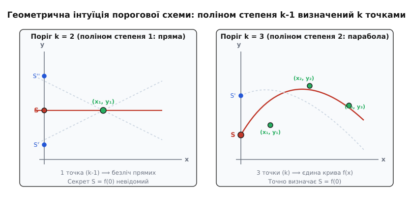
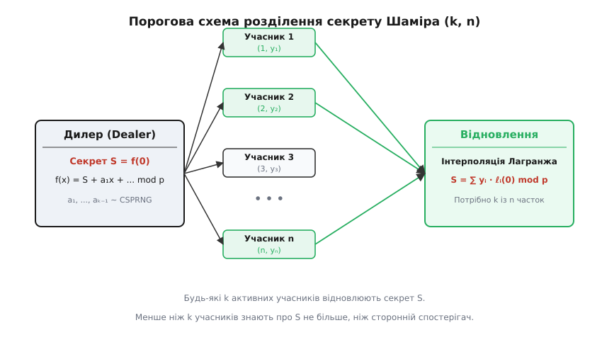
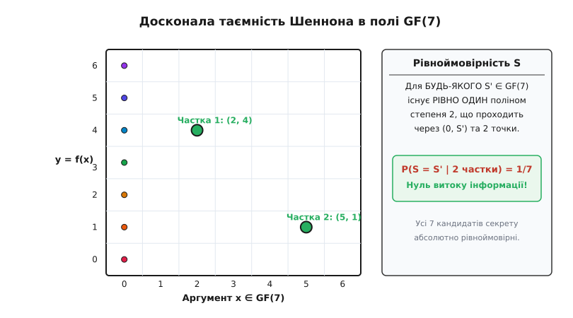

# Розділення секрету Шаміра

<preknowlist>
- [Поліноми](root:math-algebra/polynomials) — степені поліномів, коефіцієнти та обчислення значень у точці.
- [Модульна арифметика](root:math-number-theory/modular-arithmetic) — додавання, множення та обчислення оберненого елемента за модулем простого числа p.
- [Скінченні поля](root:math-algebra/finite-fields) — алгебраїчна структура GF(p) та GF(2ᵐ), де кожна ненульова величина має обернений елемент.
- [Досконала таємність](root:sf-security/perfect-secrecy) — поняття інформаційно-теоретичної безпеки за Шенноном.
</preknowlist>

Уявіть банківське сховище, корпоративний сервер розблокування баз даних або центральний вузол сертифікації ключів інтернету (Root CA), де головний майстер-ключ забезпечує підпис усіх цифрових сертифікатів або захищає мільйонні статки. Якщо довірити цей ключ одній людині, виникає критична точка відмови: у разі її хвороби, зради або шантажу вся система стає беззахисною чи повністю заблокованою. Якщо ж виготовити п'ять дублікатів ключа й роздати п'яти топменеджерам, виникає зворотна проблема — точка компрометації: для викрадення секрету нападнику достатньо зламати пристрій лише одного із п'яти зберігачів.

Класичне компромісне рішення полягає у створенні **порогової схеми** `(k, n)`. Секрет `S` математично розбивається на `n` окремих часток між зберігачами таким чином, що:

1. Будь-яка група з `k` або більше учасників, об'єднавши свої частки, може легко й однозначно відновити початковий секрет `S`.
2. Будь-яка група з `k - 1` або меншої кількості учасників, навіть володіючи необмеженою обчислювальною потужністю суперкомп'ютерів, не може дізнатися про секрет `S` **жодної бітової інформації**.

У 1979 році видатний ізраїльський математик і криптограф Аді Шамір запропонував дивовижно елегантне розв'язання цієї задачі, яке спирається на базову геометрію поліноміальних рівнянь над скінченними полями.

---

### Чому наївні підходи до розбиття даних зазнають краху

Перш ніж розглядати геометрію Шаміра, важливо зрозуміти, чому простіші й наочніші ідеї розділення даних не забезпечують порогової безпеки.

Перша наївна ідея полягає у **простому нарізанні бітів ключа**. Нехай 256-бітовий ключ ділиться на 4 рівні частини по 64 біти для 4 учасників, і для відновлення потрібні всі 4 частини. Це схема `(4, 4)`. Проте якщо троє учасників об'єднаються (маючи `k - 1 = 3` частини), вони будуть знати 192 біти ключа. Їм залишиться підібрати лише 64 біти, що легко робиться повним перебором за допомогою сучасних графічних процесорів. Отже, кожен отриманий фрагмент лінійно зменшує невизначеність (ентропію) секрету за формулою:

```
H(S | k-1 часток) = H(S) · (1 - (k-1)/n)
```

Це лінійне зменшення ентропії означає, що часткові коаліції зловмисників поступово накопичують знання про секрет, наближаючись до його повного викрадення.

Друга ідея спирається на **просте модульне додавання**. Нехай секрет `S` ділиться між `n` учасниками за правилом: випадковим чином обираються `s₁, s₂, ..., sₙ₋₁`, а остання частка обчислюється як:

```
sₙ = (S - s₁ - s₂ - ... - sₙ₋₁) mod M
```

У такій системі сума всіх часток `(s₁ + s₂ + ... + sₙ) mod M` точно дає `S`. Якщо не вистачає хоча б однієї частки, значення `S` є абсолютно невідомим, бо втрачена частка відіграє роль одноразового блокнота (One-Time Pad). Проте ця система є строго **однопороговою схемою `(n, n)`**: для відновлення потрібні суворо **всі** `n` учасників. 

Якщо надійність кожного зберігача дорівнює `p_rel` (імовірність того, що він доступний і не втратив ключ), то загальна надійність системи відновлення дорівнює `(p_rel)ⁿ`. Зі зростанням кількості учасників `n` імовірність безповоротної втрати секрету прямує до одиниці. Якщо бодай один зберігач втратить свій ключ чи відмовиться співпрацювати, секрет буде втрачено назавжди без можливості відновлення.

Виникає фундаментальне алгебраїчне питання: як побудувати гнучку систему `(k, n)`, де поріг `k` регулюється довільним чином (наприклад, 3 із 5, 5 із 9), а відсутність `k`-ї частки залишає інформаційний витік на рівні строгого нуля?

---

### Геометрична інтуїція: поліноми та степені свободи

В основі порогової схеми Шаміра лежить просте геометричне правило, відоме зі шкільного курсу алгебри:

- Через 1 точку на площині можна провести нескінченно багато прямих (поліномів 1-го степеня). Щоб фіксувати єдину пряму, потрібно **2 точки**.
- Через 2 точки на площині можна провести нескінченно багато парабол (поліномів 2-го степеня). Щоб фіксувати єдину параболу, потрібно **3 точки**.
- Загалом: для однозначного визначення полінома степеня `d` необхідно знати строго **`d + 1` точок**.


*Зліва: при порозі k = 2 поліном має степінь 1 (пряма). Одна відома точка (k - 1) залишає пряму вільною обертатися навколо неї, перетинаючи вісь y у будь-якому значенні S. Справа: при порозі k = 3 поліном має степінь 2 (парабола). Дві точки залишають один вільний параметр, і лише третя точка повністю фіксує криву й перетин S = f(0).*

Щоб побудувати порогову схему `(k, n)`, дилер створює випадковий поліном `f(x)` степеня `d = k - 1`:

```
f(x) = a₀ + a₁ x + a₂ x² + ... + aₖ₋₁ xᵏ⁻¹
```

У цьому поліномі роль самого секрету грає вільний член `a₀ = f(0)` — точка перетину полінома з віссю ординат `y`. Коефіцієнти `a₁, a₂, ..., aₖ₋₁` обираються випадковим чином. 

Після цього дилер обчислює `n` точок на цій кривій: `(1, f(1)), (2, f(2)), ..., (n, f(n))` і віддає по одній точці кожному з `n` учасників. Зверніть увагу: значення `x = 0` не видається жодному з учасників, бо точка `f(0)` є самим секретом. Ідентифікатори учасників `xᵢ` обов'язково обираються ненульовими й попарно різними (`xᵢ ∈ [1, n]`).

Якщо об'єднаються `k` учасників, вони отримають `k` точок. Оскільки поліном має степінь `k - 1`, за цими `k` точками вони зможуть однозначно відновити увесь поліном `f(x)` і обчислити секрет `S = f(0)`. Якщо ж об'єднаються лише `k - 1` учасників, вони матимуть `k - 1` точок. Для полінома степеня `k - 1` це залишає рівно один вільний параметр свободи: крива може проходити через **будь-яку** точку на осі `y`, роблячи будь-яке значення секрету однаково ймовірним.

Розберемо це на прикладі порогу `k = 2` (пряма `y = a₁ x + a₀`). Якщо зловмисник знає лише 1 точку `(x₁, y₁)`, рівняння кривої має вигляд:

```
y₁ = a₁ x₁ + a₀  ⟹  a₀ = y₁ - a₁ x₁
```

Оскільки коефіцієнт `a₁` зловмиснику невідомий і обирався рівномірно з усього поля, для будь-якого бажаного значення секрету `S′` існує єдине значення `a₁ = (y₁ - S′) / x₁`, яке дає саме це `S′`. Отже, жодне значення секрету не є ймовірнішим за інші.

Більше про передумови та наукові дискусії навколо цієї ідеї розповідно у [стислій довідці з історії створення схеми](root:sf-security/shamir-secret-sharing/hist-shamir-secret-sharing.md).

---

### Математична побудова схеми над скінченними полями GF(p)

Якби ми реалізували поліном `f(x)` над звичайними дійсними числами `ℝ` або раціональними числами `ℚ`, схема мала б серйозні вади:
1. **Обчислювальна неточність:** Дробові числа з плаваючою комою втрачають точність під час округлення та ділення.
2. **Витік інформації через нерівномірність:** На звичайній числовій прямій знання `k - 1` точок звужує діапазон можливих значень кутового коефіцієнта та вільного члена `a₀`. Зловмисник міг би відкинути занадто великі або занадто малі значення секрету, що порушує досконалу таємність.

Щоб усунути ці вади, арифметика переноситься у **скінченне поле лишків `GF(p)`** за модулем великого простого числа `p`. Просте число `p` обирається так, щоб воно було більшим за кількість учасників (`p > n`) і більшим за сам секрет (`p > S`).


*Схема роботи: дилер будує поліном f(x) mod p, де вільним членом є секрет S, і роздає частки (i, f(i)) n учасникам. Будь-яка група з k активних учасників об'єднує частки у блоці відновлення, де через інтерполяцію Лагранжа обчислюється S = f(0) mod p.*

#### Алгоритм розділення секрету (Дилер)

1. **Вибір поля:** Обирається просте число `p > max(S, n)`.
2. **Формування полінома:** Дилер обирає `k - 1` випадкових коефіцієнтів `a₁, a₂, ..., aₖ₋₁` із діапазону `[0, p - 1]` за допомогою криптографічно стійкого генератора випадкових чисел (CSPRNG). Секрет установлюється як вільний член `a₀ = S`. Побудовано поліном:
   ```
   f(x) = (S + a₁ x + a₂ x² + ... + aₖ₋₁ xᵏ⁻¹) mod p
   ```
3. **Генерація часток:** Для кожного учасника `i` від `1` до `n` обчислюється частка:
   ```
   xᵢ = i
   yᵢ = f(i) mod p
   ```
   Пара `(xᵢ, yᵢ)` передається учасникові `i` захищеним каналом. Після роздачі часток дилер знищує сам поліном `f(x)` та коефіцієнти `aⱼ`.

---

### Відновлення секрету через інтерполяцію Лагранжа

Нехай будь-які `k` учасників із номерами `x₁, x₂, ..., xₖ` зібралися для відновлення секрету, надавши свої частки `(x₁, y₁), (x₂, y₂), ..., (xₖ, yₖ)`.

Для відновлення значення полінома у точці `x = 0` застосовують **інтерполяційну формулу Лагранжа**. За цією формулою сам поліном `f(x)` виражається як сума базисних поліномів:

```
f(x) = ∑ yᵢ · ℓᵢ(x) mod p   [для всіх i від 1 до k]
```

де `ℓᵢ(x)` — базисний поліном Лагранжа, який дорівнює `1` при `x = xᵢ` та `0` при `x = xⱼ` (`j ≠ i`):

```
ℓᵢ(x) = ∏ (x - xⱼ) / (xᵢ - xⱼ) mod p   [для всіх j ≠ i]
```

Оскільки нам не потрібен увесь поліном `f(x)`, а лише його вільний член `S = f(0)`, підставимо `x = 0` у формулу базисного полінома:

```
ℓᵢ(0) = ∏ (-xⱼ) / (xᵢ - xⱼ) mod p = ∏ xⱼ / (xⱼ - xᵢ) mod p   [для всіх j ≠ i]
```

Тоді секрет `S` обчислюється за прямою формулою:

```
S = f(0) = ∑ yᵢ · ℓᵢ(0) mod p
```

Важливо пам'ятати, що ділення у формулі `xⱼ / (xⱼ - xᵢ) mod p` означає множення чисельника `xⱼ` на **мультиплікативний обернений елемент** знаменника `(xⱼ - xᵢ)⁻¹ mod p`. Цей обернений елемент обчислюється за допомогою розширеного алгоритму Евкліда або за малою теоремою Ферма як `(xⱼ - xᵢ)ᵖ⁻² mod p`.


*Розподіл кандидатів секрету в полі GF(7) при порозі k = 3 при володінні лише 2 частками. Для кожного можливого значення S' від 0 до 6 існує рівно один параболічний поліном, який проходить через це S' у точці x = 0 та дві відомі точки часток. Отже, ймовірність кожного кандидата дорівнює 1/7, що дає нуль витоку інформації.*

Докладний математичний вивід єдиності інтерполяційного полінома та строгий доказ досконалої таємності винесено у [вставку математичного доведення](root:sf-security/shamir-secret-sharing/math-shamir-proof.md).

---

### Детальний числовий приклад розрахунку

Розглянемо практичний приклад із маленькими числами, щоб простежити кожен крок математики без застосування комп'ютера.

#### Крок 1: Ініціалізація та генерація часток
- Задамо порогову схему: `k = 3` (потрібно 3 частки), `n = 5` (усього 5 учасників).
- Обрано просте число: `p = 19`.
- Нехай секрет дорівнює: `S = 11`.
- Степінь полінома `d = k - 1 = 2`. Дилер обирає `k - 1 = 2` випадкові коефіцієнти: `a₁ = 7`, `a₂ = 3`.
- Сформовано поліном над `GF(19)`:
  ```
  f(x) = (11 + 7x + 3x²) mod 19
  ```

Обчислимо частки для 5 учасників (`x = 1, 2, 3, 4, 5`):

```
x₁ = 1:  f(1) = 11 + 7(1) + 3(1)²  = 21 ≡ 2 mod 19     ⟹ Частка 1: (1, 2)
x₂ = 2:  f(2) = 11 + 7(2) + 3(4)  = 37 ≡ 18 mod 19    ⟹ Частка 2: (2, 18)
x₃ = 3:  f(3) = 11 + 7(3) + 3(9)  = 59 ≡ 2 mod 19     ⟹ Частка 3: (3, 2)
x₄ = 4:  f(4) = 11 + 7(4) + 3(16) = 87 ≡ 11 mod 19    ⟹ Частка 4: (4, 11)
x₅ = 5:  f(5) = 11 + 7(5) + 3(25) = 121 ≡ 7 mod 19    ⟹ Частка 5: (5, 7)
```

#### Крок 2: Відновлення секрету за 3 частками
Припустимо, що учасники 1, 2 та 4 об'єдналися для відновлення секрету. Вони мають 3 частки: `(1, 2)`, `(2, 18)` та `(4, 11)`.

Обчислимо базисні коефіцієнти Лагранжа `ℓᵢ(0) mod 19` для наборів `x ∈ {1, 2, 4}`:

**1. Обчислення `ℓ₁(0)` для `x₁ = 1`:**
```
ℓ₁(0) = (x₂ / (x₂ - x₁)) · (x₄ / (x₄ - x₁)) mod 19   [формула базису Лагранжа для x₁=1]
      = (2 / (2 - 1)) · (4 / (4 - 1)) mod 19          [підстановка вузлів x₁=1, x₂=2, x₄=4]
      = (2 / 1) · (4 / 3) mod 19                      [віднімання в знаменниках]
      = 8 / 3 mod 19                                  [перемноження чисельників]
```
Знайдемо обернений елемент до `3 mod 19`: шукаємо таке `y`, що `3 · y ≡ 1 mod 19`. Оскільки `3 · 13 = 39 = 2 · 19 + 1 ≡ 1 mod 19`, оберненим є `13`.
```
ℓ₁(0) = 8 · 13 = 104 = 5 · 19 + 9 ≡ 9 mod 19          [множення на обернений елемент 13 mod 19]
```

**2. Обчислення `ℓ₂(0)` для `x₂ = 2`:**
```
ℓ₂(0) = (x₁ / (x₁ - x₂)) · (x₄ / (x₄ - x₂)) mod 19   [формула базису Лагранжа для x₂=2]
      = (1 / (1 - 2)) · (4 / (4 - 2)) mod 19          [підстановка вузлів x₁=1, x₂=2, x₄=4]
      = (1 / -1) · (4 / 2) mod 19                     [віднімання в знаменниках]
      = (-1) · 2 = -2 ≡ 17 mod 19                     [скорочення дробу та зсув на модуль 19]
```

**3. Обчислення `ℓ₄(0)` для `x₄ = 4`:**
```
ℓ₄(0) = (x₁ / (x₁ - x₄)) · (x₂ / (x₂ - x₄)) mod 19   [формула базису Лагранжа для x₄=4]
      = (1 / (1 - 4)) · (2 / (2 - 4)) mod 19          [підстановка вузлів x₁=1, x₂=2, x₄=4]
      = (1 / -3) · (2 / -2) mod 19                    [віднімання в знаменниках]
      = (1 / -3) · (-1) = 1/3 mod 19                  [скорочення 2 / -2 = -1]
      = 13 mod 19                                     [обернений елемент 3⁻¹ ≡ 13 mod 19]
```

**4. Підсумовування часток:**
```
S = (y₁ · ℓ₁(0) + y₂ · ℓ₂(0) + y₄ · ℓ₄(0)) mod 19     [формула комбінації часток Лагранжа]
  = (2 · 9 + 18 · 17 + 11 · 13) mod 19                 [підстановка значень yᵢ та ℓᵢ(0)]
  = (18 + 306 + 143) mod 19                            [перемноження кожної пари]
  = 467 mod 19                                         [сумування та зведення за модулем 19]
```
Знайдемо остачу від ділення `467` на `19`:
```
467 = 19 · 24 + 11 ≡ 11 mod 19                        [ділення з остачею: 467 = 19 · 24 + 11]
```
Секрет `S = 11` відновлено абсолютно точно!

#### Перевірка іншої комбінації часток (учасники 2, 3 та 5)
Щоб остаточно переконатися у незалежності від обраної трійки, перевіримо відновлення за частками `(2, 18)`, `(3, 2)` та `(5, 7)`:

1. `ℓ₂(0) = (3 / (3 - 2)) · (5 / (5 - 2)) = (3 / 1) · (5 / 3) = 15 / 3 = 5 mod 19`.
2. `ℓ₃(0) = (2 / (2 - 3)) · (5 / (5 - 3)) = (-2) · (5 / 2) = -5 ≡ 14 mod 19`.
3. `ℓ₅(0) = (2 / (2 - 5)) · (3 / (3 - 5)) = (2 / -3) · (3 / -2) = (6 / 6) = 1 mod 19`.
4. Обчислимо `S`:
   ```
   S = (18 · 5 + 2 · 14 + 7 · 1) mod 19   [формула комбінації часток 2, 3, 5]
     = (90 + 28 + 7) mod 19               [перемноження кожної пари]
     = 125 mod 19                         [сумування трьох доданків]
   ```
   Оскільки `125 = 19 · 6 + 11`, маємо `125 ≡ 11 mod 19`. Будь-яка трійка дає точний секрет `11`.

---

### Асимптотична складність та просторові витрати

Під час проектування високопродуктивних криптографічних систем важливо аналізувати алгоритмічну складність створення та відновлення часток:

1. **Просторові витрати пам'яті:** Схема Шаміра є **просторово-оптимальною**. Розмір кожної з `n` часток `(xᵢ, yᵢ)` точно дорівнює розміру самого початкового секрету `|S|` плюс невеликі накладні витрати на номер `xᵢ`. На відміну від геометрії гіперплощин Блеклі, обсяг необхідної пам'яті не зростає при збільшенні порогу `k`.
2. **Обчислювальна складність генерації часток:** Створення `n` часток вимагає обчислення значення полінома степеня `k - 1` у `n` точках. За схемою Горнера це потребує `O(n · k)` операцій множення та додавання в полі `GF(p)`.
3. **Обчислювальна складність відновлення секрету:** Пряме обчислення інтерполяції Лагранжа для `k` часток вимагає `O(k²)` операцій у полі. Для невеликих порогів (наприклад, `k ≤ 10`) це виконується за частки мікросекунди. Якщо поріг `k` сягає тисяч елементів, використовують швидкі алгоритми інтерполяції на основі Швидкого перетворення Фур’є (FFT / NTT) над скінченними полями зі складністю `O(k log² k)`.

---

### Розширені властивості та модифікації схеми

Схема Шаміра — це не просто статичний алгоритм, а гнучкий алгебраїчний каркас, який підтримує кілька унікальних операційних властивостей:

#### 1. Динамічне оновлення часток без зміни секрету (Share Renewal)
Якщо частки зберігаються тривалий час, існує ризик мобільної атаки: зловмисник може послідовно зламати одного зберігача цього року, а другого — наступного. 

Щоб нейтралізувати цю загрозу, зберігачі можуть періодично **оновлювати свої частки**, не змінюючи сам секрет `S`. Для цього дилер (або самі учасники) генерує новий випадковий поліном `g(x)` степеня `k - 1` з вільним членом `g(0) = 0`. Кожному учаснику видається додаткове значення `g(i)`. Учасник обчислює нову частку:

```
yᵢ_new = (yᵢ + g(i)) mod p
```

Оскільки `g(0) = 0`, новий сумарний поліном `h(x) = f(x) + g(x)` задовольняє умову `h(0) = f(0) + 0 = S`. Значення секрету залишається незмінним, проте всі старі частки стають абсолютно несумісними з новими. Зловмисник, що перехопив 1 стару частку й 2 нові, не зможе відновити секрет.

#### 2. Зважені та ієрархічні частки
У реальних організаціях не всі зберігачі мають однаковий статус. Наприклад, директор компанії повинен мати більший вплив, ніж рядовий адміністратор.

Схема Шаміра природно підтримує **зважені частки**: учаснику з вищим рівнем довіри видають кілька часток для різних значень `x` (наприклад, директору видають 3 точки `f(1), f(2), f(3)`, а інженеру — лише 1 точку `f(4)`). У результаті директор може самостійно задовольнити поріг `k = 3`, тоді як інженерам потрібно об'єднатися втрьох.

#### 3. Адитивна гомоморфність
Якщо маємо два секрети `S₁` та `S₂`, розбиті поліномами `f(x)` та `g(x)` з однаковим порогом `k`, то додавання часток `wᵢ = (f(i) + g(i)) mod p` дає частки для сумарного секрету `S₁ + S₂ mod p`. Це дозволяє обчислити суми секретних даних у розподілених мережах без розкриття самих секретів.

> 🔧 **Навіщо це.** Схема розділення секрету Шаміра є фундаментальним криптографічним механізмом, який використовується в апаратних модулях безпеки (HSM) для розблокування головного майстер-ключа, захисту корінних ключів систем підпису DNSSEC та SSL/TLS центрів сертифікації, а також у сучасних розподілених криптогаманцях (Threshold ECDSA / BLS) та протоколах MPC (Multi-Party Computation) для здійснення підписів без зберігання повного приватного ключа на одному пристрої.

---

### Сучасні стандарти та застосування в криптовалютах і HSM

У сучасній криптографічній інженерії схема Шаміра вийшла далеко за межі суто академічної концепції і стала основою міжнародних промислових стандартів:

1. **Стандарт SLIP-0039 (Shamir's Secret Sharing for Mnemonic Codes):** Цей стандарт, розроблений компанією SatoshiLabs (творцями апаратних гаманців Trezor), адаптує схему Шаміра для розбиття мнемонічних сід-фраз (BIP-39). Ключ відновлення криптовалютного гаманця ділиться на кілька списків із 20 слів. Кожен список містить власну контрольну суму (CRC/SHA256) та ідентифікатор групи, що запобігає випадковому змішуванню часток від різних сід-фраз.
2. **Порогові підписи (Threshold ECDSA / Ed25519 / BLS):** У сучасних кастодіальних криптосистемах (Fireblocks, Coinbase Custody) приватний ключ блокчейн-гаманця взагалі **ніколи не існує в одному місці**. За допомогою комбінації схеми Шаміра та порогових протоколів цифрового підпису вузли мережі обчислюють математичний підпис транзакції під час багатостороннього консенсусу, додаючи свої частки полінома без відновлення самого приватного ключа на жодному з серверів.
3. **Хмарні сховища та сервери HashiCorp Vault:** Під час запуску інстансу HashiCorp Vault майстер-ключ шифрування знаходиться у заблокованому стані (*sealed*). Для виведення сховища в робочий стан (*unseal*) оператори повинні ввести `k` із `n` часток Шаміра. Лише у пам'яті сервера RAM розшифровується головний ключ розкодування даних.

---

### Практичні пастки та захист від атак

Попри математичну досконалість, пряма реалізація схеми Шаміра «з підручника» містить кілька інженерних уразливостей, які необхідно враховувати під час розробки реальних систем.

1. **Відсутність цілісності (Активні зловмисники):** Класична схема Шаміра передбачає, що всі учасники чесні (*semi-honest model*). Якщо один із `k` учасників надасть фальшиву частку `y′ᵢ = yᵢ + Δ`, відновлений секрет перетвориться на сміття. Щоб виявити зрадника, застосовують **верифіковане розділення секрету (VSS, Feldman VSS)**, де дилер публікує криптографічні зобов'язання до коефіцієнтів у групі з дискретним логарифмуванням:
   ```
   Cⱼ = g^{aⱼ} mod q
   ```
   Це дозволяє кожному учаснику самостійно перевірити чесність отриманої частки `yᵢ` до початку відновлення.

2. **Залежність від ентропії CSPRNG:** Якщо генератор випадкових чисел для коефіцієнтів `a₁, ..., aₖ₋₁` виявиться передбачуваним або матиме низьку ентропію, зловмисники зможуть звузити простір пошуку поліномів, зруйнувавши досконалу таємність.

3. **Вибір поля GF(256) проти GF(p):** Для обробки довільних бінарних файлів та ключів фіксованої довжини обчислення виконують над полем Галуа `GF(256)` або `GF(2²⁵⁶)`, де додавання замінюється на `XOR`, а множення реалізується через таблиці логарифмів.

Повну реалізацію алгоритму розділення та відновлення часток у полі `GF(256)` наведено у [практичній вставці коду мовами C та C++](root:sf-security/shamir-secret-sharing/proj-shamir-secret-sharing.md).
