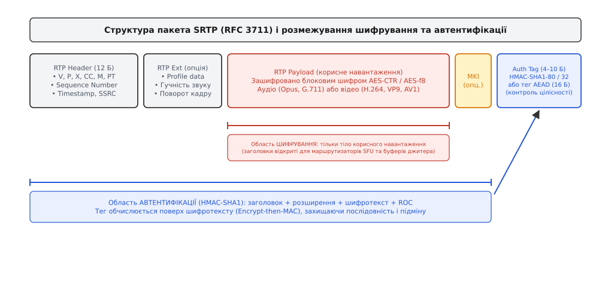
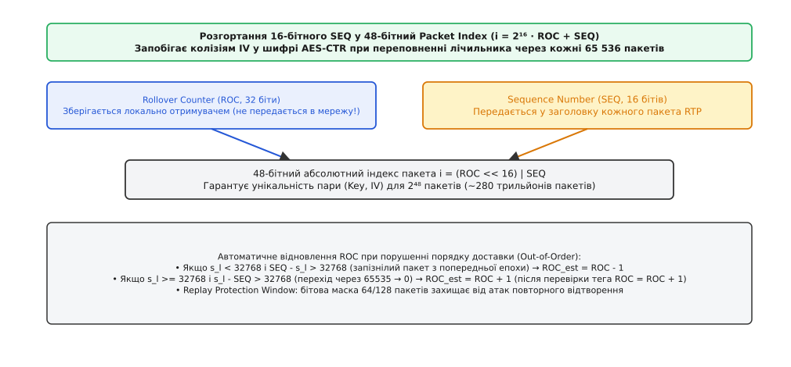
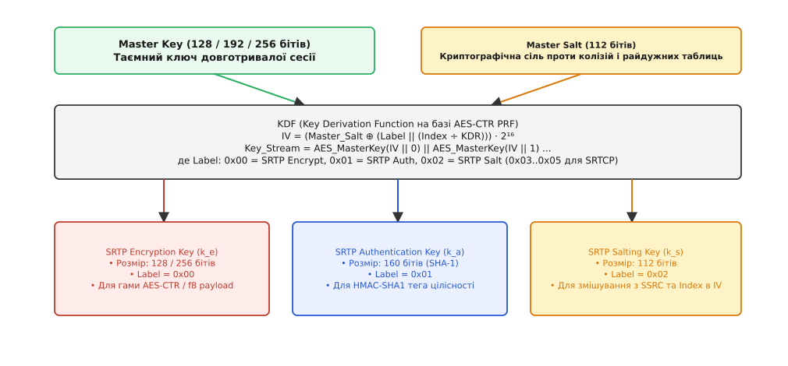
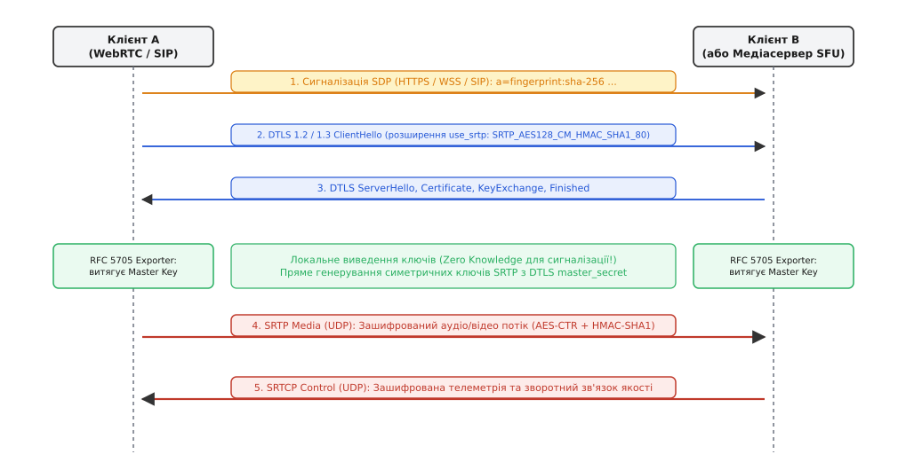

# SRTP: шифрування й автентичність медіапотоку

<preknowlist>
- [RTP і RTCP](topic:com-protocol/rtp-rtcp) — протоколи передачі медіапотоків у реальному часі та моніторингу якості зв'язку поверх UDP.
- [Блоковий шифр](topic:sf-security/block-cipher) — оборотне перетворення фіксованого 16-байтового блоку під таємним ключем (AES).
- [Потоковий шифр](topic:sf-security/stream-cipher) — генерація псевдовипадкової гами та накладання її на відкриті дані без зміни довжини повідомлення.
- [TCP проти UDP](topic:com-transport/tcp-vs-udp) — відмінності між надійним потоковим транспортом і датаграмною передачею без гарантії порядку й доставки.
- [SIP: сигналізація виклику](topic:com-protocol/sip) — протокол встановлення, модифікації та завершення мультимедійних сесій зв'язку.
</preknowlist>

Звичайний голосовий дзвінок у форматі Opus генерує 50 пакетів [UDP](topic:com-transport/tcp-vs-udp) на секунду: кожні 20 мілісекунд у мережу відправляється порція стисненого аудіо вагою близько 160 байтів. У бездротових або завантажених каналах від 1% до 5% цих пакетів губляться, а частина приходить із порушенням початкового порядку або з різною затримкою (джитером). Якщо загорнути цей потік у звичайний [TLS](topic:sf-security/tls) поверх TCP, будь-який втрачений пакет повністю заблокує відтворення звуку до моменту повторної доставки, перетворивши живу розмову на суцільні паузи й перебивання. Якщо ж передавати голос відкритим [RTP](topic:com-protocol/rtp-rtcp), розмову перехопить будь-який транзитний маршрутизатор.

Для захисту інтерактивного мультимедіа потрібен протокол, який шифрує байти з нульовими накладними витратами на довжину, перевіряє справжність кожного кадру без залежності від сусідніх датаграм і дозволяє маршрутизаторам спрямовувати пакети без доступу до вмісту розмови. Цим стандартом став **SRTP** (англ. *Secure Real-time Transport Protocol* — «безпечний протокол передачі в реальному часі», RFC 3711).

---

### Чому класичні засоби захисту не підходять для медіапотоку

Щоб зрозуміти конструкцію SRTP, необхідно простежити, чому стандартні інструменти криптографії Інтернету виявилися непридатними для медіа реального часу.

Транспортний протокол [TLS](topic:sf-security/tls) створювався для захисту надійних байтових потоків TCP. Його робота спирається на жорстку послідовність: якщо в мережі випадає один TCP-сегмент, приймальний стек блокує чергу (англ. *head-of-line blocking*), доки відправник не надішле втрачений фрагмент повторно. Але в інтерактивній телефонії запізнілий на 300 мілісекунд голосовий фрейм не має жодної цінності — слухач уже проїхав цей момент розмови, а декодер звуку просто маскує коротку втрату тишею або інтерполяцією. Зупиняти весь потік заради повторної доставки — означає знищити інтерактивність.

Мережевий протокол IPsec у режимі ESP (RFC 4303) здатний шифрувати довільні UDP-пакети, але він створює дві інші непереборні перешкоди. По-перше, для 160-байтового голосового кадру службові заголовки IPsec разом із вектором ініціалізації та криптографічним вирівнюванням додають понад 40 байтів, марнуючи до 25% пропускної здатності каналу. По-друге, IPsec шифрує весь UDP-пакет цілком, приховуючи від мережі службові поля [RTP](topic:com-protocol/rtp-rtcp). Проміжні медіасервери (SFU), буфери компенсації джитера та комутатори більше не можуть прочитати мітки часу (Timestamp), номери послідовності (Sequence Number) та ідентифікатори джерел (SSRC), що унеможливлює впорядкування пакетів і маршрутизацію групових відеоконференцій.

Звідси виникли фундаментальні вимоги до спеціалізованого протоколу захисту медіа:
1. **Збереження розміру корисного навантаження:** зашифрований аудіо- або відеокадр повинен мати точно таку саму довжину в байтах, як і відкритий (ніякого доповнення блоків padding).
2. **Прозорість заголовків:** стандартний 12-байтовий заголовок RTP має передаватися відкритим текстом, щоб мережева інфраструктура бачила метадані потоку.
3. **Автономність обробки:** розшифрування та перевірка автентичності кожного пакета повинні спиратися виключно на сам цей пакет і локальний стан отримувача, не вимагаючи повторних запитів через мережу.
4. **Нерозривний захист цілісності:** відкритий заголовок і зашифроване тіло мають бути криптографічно зв'язані підписом, щоб зловмисник не міг змінити номери пакетів або підмінити медіадані.

Історію того, як інженери Cisco та Ericsson долали суперечності між телефонними операторами та криптографами IETF, докладно описано в нарисі [як створювався SRTP](topic:sf-security/srtp/hist-srtp-evolution.md).

---

### Анатомія пакета SRTP: розмежування відкритого та зашифрованого

Пакет SRTP не створює нового транспортного формату: він бере стандартний кадр [RTP](topic:com-protocol/rtp-rtcp) і накладає на нього криптографічні межі.


*Заголовок RTP залишається відкритим для маршрутизаторів SFU та буферів джитера; шифрується виключно корисне навантаження, а тег автентифікації HMAC-SHA1 обчислюється поверх усього пакета за схемою Encrypt-then-MAC.*

Розгляньмо, як розподіляються обов'язки між полями пакета:

1. **Відкритий заголовок RTP (12 байтів):** Містить версію протоколу (`V=2`), прапорці розширень (`X`) і маркерів (`M`), тип кодека (`PT`), 16-бітний порядковий номер (`Sequence Number`), 32-бітну мітку часу (`Timestamp`) та 32-бітний ідентифікатор джерела (`SSRC`). Ці поля передаються відкритими. Медіасервер або приймальний буфер читає їх без дешифрування, миттєво впорядковуючи пакети за часом і відправляючи їх потрібному абоненту.
2. **Розширення заголовка (опційні):** За замовчуванням передаються відкритими, але конфіденційні метадані (наприклад, рівень гучності аудіо або поворот кадру відео) можуть шифруватися за стандартом RFC 6904 без приховання їхніх технічних ідентифікаторів.
3. **Зашифроване корисне навантаження (Encrypted Payload):** Тіло аудіо- або відеокадру, оброблене симетричним шифром. Довжина шифротексту байт-у-байт дорівнює довжині відкритого тексту.
4. **Ідентифікатор майстер-ключа (MKI, 0..N байтів, опційно):** Необов'язкова мітка, яка вказує, який саме майстер-ключ було застосовано, якщо в активній сесії відбувається зміна ключів.
5. **Тег автентифікації (Authentication Tag, 4 або 10 байтів):** Контрольний підпис, розміщений у трейлері пакета.

Критичний принцип безпеки SRTP полягає у використанні схеми **Encrypt-then-MAC**: спочатку корисне навантаження зашифровується, а потім криптографічний хеш HMAC обчислюється **поверх відкритого заголовка та отриманого шифротексту**.

Коли отримувач приймає пакет, він спершу перевіряє тег автентифікації. Якщо хоча б один біт у заголовку або шифротексті було спотворено, пакет негайно відкидається. Блок дешифрування навіть не запускається, що повністю виключає атаки на основі оракулів дешифрування. Повний двійковий контракт полів, довжин і бітових масок наведено у [специфікації двійкових форматів SRTP](topic:sf-security/srtp/api-srtp-packet.md).

---

### Розрахунок бюджету обробки та накладних витрат

Оцінімо обчислювальний бюджет і накладні витрати типового відеопотоку 1080p60 у кодеку H.264 або VP9:

```text
Бітрейт відеопотоку           = 4.5 Мбіт/с
Частота кадрів                = 60 кадрів/с
Середній розмір пакета (MTU)  = 1200 Б
Кількість пакетів на секунду  = (4.5 · 10⁶) ÷ (1200 · 8) ≈ 470 пакетів/с
Інтервал між пакетами         = 1 000 000 мкс ÷ 470 ≈ 2127 мкс
```

На обробку одного пакета (генерація IV, розгортання ROC, перевірка вікна антиповтору, AES-CTR розшифрування 1188 байтів і перевірка HMAC-SHA1) сучасний процесор із підтримкою векторних інструкцій AES-NI витрачає близько 3–5 мікросекунд. Це становить менше 0.25% процесорного часу одного ядра, що дозволяє одному медіасерверу одночасно обслуговувати тисячі паралельних медіапотоків.

Службові накладні витрати SRTP зводяться виключно до 10 байтів тега автентифікації (або 16 байтів для GCM):
- Для аудіопакета Opus (160 Б): накладні витрати складають `10 / 160 = 6.25%`.
- Для відеопакета (1200 Б): накладні витрати складають `10 / 1200 = 0.83%`.

---

### 16-бітний Sequence Number і проблема лічильника переповнень (ROC)

Усі сучасні потокові шифри та режими лічильника вимагають залізного правила: **пара (Ключ, Вектор ініціалізації) ніколи не повинна повторюватися**. Якщо згенерувати однакову гаму для двох різних повідомлень, конфіденційність руйнується миттєво.

У заголовку RTP номер пакета `SEQ` займає лише 16 бітів, тобто приймає значення від `0` до `65 535`. Для відеопотоку 1080p або 4K із бітрейтом 10 Мбіт/с цей діапазон вичерпується менш ніж за 40 секунд. Коли лічильник переповнюється, номер `SEQ` скидається в `0` і починає рахунок спочатку.

Якби вектор ініціалізації шифру базувався лише на полі `SEQ`, через кожні 65 536 пакетів генерувалася б та сама гама, що призвело б до повного злому шифрування.

Щоб запобігти цьому, не збільшуючи розмір заголовка в мережі, SRTP вводить концепцію **Rollover Counter (ROC)** — 32-бітного лічильника переповнень, який зберігається виключно в пам'яті кінцевих пристроїв і ніколи не передається через мережу.


*16-бітний номер послідовності з заголовка поєднується з локальним 32-бітним лічильником ROC у 48-бітний абсолютний індекс пакета, забезпечуючи унікальність векторів ініціалізації на 280 трильйонів пакетів.*

Абсолютний 48-бітний індекс пакета `i` обчислюється як:

```text
i = 2¹⁶ · ROC + SEQ
```

Діапазон у `2⁴⁸` пакетів (понад 281 трильйон пакетів) вичерпати неможливо: навіть при безперервній передачі 100 000 пакетів на секунду цього запасу вистачить на 89 років безперервної розмови під одним ключем.

### Як отримувач вгадує ROC при втраті й перестановці пакетів

Оскільки поле `ROC` живе лише локально, отримувач повинен динамічно визначати, до якої саме епохи переповнення належить щойно отриманий пакет.

Уявімо ситуацію на межі переповнення:
1. Отримувач зафіксував найвищий порядковий номер `s_l = 65 534` при поточному `ROC = 0`.
2. Наступним надходить пакет із номером `SEQ = 1`. Оскільки `s_l >= 32768`, а новий номер різко зменшився (`65534 - 1 = 65533 > 32768`), отримувач розуміє: відбулося переповнення лічильника, і для цього пакета слід тимчасово взяти `ROC_est = ROC + 1 = 1`.
3. Одразу після цього приходить запізнілий пакет `SEQ = 65 535`. Тепер стан отримувача вже `s_l = 1`, `ROC = 1`. Оскільки `s_l < 32768`, а отриманий номер `SEQ` значно більший (`65535 - 1 = 65534 > 32768`), отримувач розпізнає запізнілий пакет із попередньої епохи й оцінює `ROC_est = ROC - 1 = 0`.

Після успішної перевірки автентичності підтверджений стан оновлюється. Якщо ж автентифікація провалилася, лічильник `ROC` не змінюється, що захищає отримувача від навмисної розсинхронізації підробленими пакетами.

> 🔧 **Навіщо це.** Додавання 32-бітного лічильника `ROC` прямо в заголовок кожного UDP-пакета коштувало б додаткових 4 байтів на пакет. При мільярдах хвилин трафіку в масштабах таких систем, як WebRTC, відмова від передачі `ROC` по мережі заощаджує терабайти магістрального трафіку без жодних компромісів для безпеки.

---

### Захист від повторного відтворення: ковзне бітове вікно

Якщо зловмисник не може розшифрувати аудіопакет, він може спробувати атаку повторного відтворення (Replay Attack): перехопити валідний зашифрований пакет (наприклад, голосову команду «Так, підтверджую») і надіслати його повторно через кілька секунд або хвилин. Оскільки пакет зашифрований легітимним ключем і має дійсний підпис HMAC, приймач міг би прийняти його за нове повідомлення.

Для блокування повторів SRTP реалізує **ковзне вікно антиповтору (Replay Window)**.

Отримувач підтримує 64-бітну (або 128-бітну) бітову маску відносно найвищого успішно обробленого індексу `max_index`:
- Коли приходить пакет з індексом `i > max_index`, бітова маска зсувається ліворуч на різницю `i - max_index`, молодший біт виставляється в `1`, а `max_index` оновлюється.
- Коли приходить пакет з індексом `i <= max_index`, обчислюється запізнення `diff = max_index - i`. Якщо `diff >= 64`, пакет вважається безнадійно застарілим і відкидається. Якщо `diff < 64`, перевіряється відповідний біт маски: якщо він уже дорівнює `1`, пакет є дублікатом і негайно скидається; якщо `0` — пакет приймається, і біт виставляється в `1`.

Цей механізм працює за фіксований час `O(1)` і потребує лише 8 байтів оперативної пам'яті на медіапотік. Алгоритмічний код вікна антиповтору наведено в [практичному посібнику з реалізації ядра SRTP](topic:sf-security/srtp/proj-srtp-crypto.md).

---

### Алгоритми шифрування: як блоковий AES стає потоковим шифром

Базовим алгоритмом шифрування в SRTP є [блоковий шифр](topic:sf-security/block-cipher) AES зі 128- або 256-бітним ключем, який працює в **режимі лічильника (Counter Mode, AES-CTR)** або в телекомунікаційному режимі **AES-f8**.

У режимі CTR блоковий шифр не перетворює самі дані безпосередньо. Замість цього AES шифрує послідовність 16-байтових блоків лічильника, виробляючи неперервний псевдовипадковий потік байтів — криптографічну гаму:

```text
Блок_гами_j = AES_k_e(IV ⊕ j)
Шифротекст  = Відкритий_текст ⊕ Блок_гами
```

Оскільки накладання гами виконується операцією порозрядного додавання за модулем 2 (`XOR`), довжина зашифрованих даних точно дорівнює довжині відкритого аудіо- чи відеокадру. Якщо голосовий пакет Opus містить 87 байтів, шифр бере рівно 87 байтів гами, а решту згенерованого 16-байтового блоку просто відкидає. Жодного доповнення padding до фіксованого розміру 16 байтів не додається.

### Формування вектора ініціалізації IV

Для кожного пакета 128-бітний початковий вектор `IV` обчислюється апаратно з трьох компонентів сесії:

```text
IV = (k_s · 2¹⁶) ⊕ (SSRC · 2⁶⁴) ⊕ (i · 2¹⁶)
```

Де:
- `k_s` — 112-бітна сесійна сіль (Session Salting Key).
- `SSRC` — 32-бітний ідентифікатор джерела потоку.
- `i` — 48-бітний абсолютний індекс поточного пакета.
- Молодші 16 бітів вектора `IV` спочатку заповнені нулями (`0x0000`) і слугують внутрішнім лічильником блоків AES всередині одного пакета.

Ця математична формула гарантує абсолютну ізоляцію:
- Якщо в одній сесії передаються аудіо й відео від одного пристрою, вони мають різні `SSRC`, і їхні гами ніколи не перетнуться, навіть при однакових номерах пакетів.
- Якщо різні пристрої використовують однаковий порядок номерів, випадкова сесійна сіль `k_s` розводить їхні вектори в різні криптографічні простори.
- Коли номер пакета переповнюється через 65 536 кадрів, 48-бітний індекс `i` змінює вектор `IV`, унеможливлюючи повтор гами.

### Режим AES-f8: спадщина мобільних мереж UMTS/3GPP

Окрім режиму лічильника CTR, стандарт RFC 3711 визначає альтернативний алгоритм **AES-f8**, створений для уніфікації з криптографічними модулями базових станцій мобільного зв'язку 3GPP.

У режимі f8 внутрішній стан шифру базується на варіанті зворотного зв'язку за виходом (Output Feedback, OFB) із застосуванням спеціальної внутрішньої маски `m = AES_k_e'(IV)`. Кожен наступний 16-байтовий блок гами формується як `S_j = AES_k_e(S_{j-1} ⊕ j ⊕ m)`. Вектор `IV` формується безпосередньо з 12-байтового заголовка RTP. Хоча режим f8 забезпечував відмінну сумісність зі спеціалізованими апаратними прискорювачами стільникових мереж початку 2000-х, він виявився менш зручним для процесорів загального призначення, оскільки генерація гами в ньому є послідовною ланцюговою операцією й не розпаралелюється так легко, як у режимі CTR. Тому в сучасному інтернеті (WebRTC та SIP) майже 100% трафіку використовує AES-CTR або AES-GCM.

### Сучасний перехід на AEAD AES-GCM (RFC 7714)

У класичному профілі SRTP шифрування та автентифікація виконувалися послідовно у два проходи: спочатку процесор генерував гаму AES-CTR і шифрував тіло, а потім окремий алгоритм HMAC-SHA1 обчислював підпис поверх заголовка й шифротексту.

Стандарт RFC 7714 ввів у SRTP автентифіковане шифрування з прив'язаними даними — **AEAD AES-GCM** (Galois/Counter Mode). У режимі GCM шифрування даних і обчислення 128-бітного підпису GMAC виконуються паралельно за один прохід конвеєра процесора. Відкритий заголовок RTP передається блоку шифрування як додаткові автентифіковані дані (AAD, Additional Authenticated Data): заголовок не шифрується, але його байти безпосередньо впливають на фінальний тег GMAC. Це скорочує навантаження на процесор сервера більш ніж удвічі.

---

### Генерація сесійних ключів: KDF та ізоляція криптографічних просторів

Однією з найдосконаліших архітектурних частин SRTP є функція виведення ключів (KDF, Key Derivation Function).

Учасники сесії ніколи не використовують отриманий під час сигналізації майстер-ключ для безпосереднього шифрування медіа. Замість цього майстер-ключ (`master_key`, 128 або 256 бітів) та майстер-сіль (`master_salt`, 112 бітів) передаються функції KDF, яка виробляє шість незалежних робочих ключів.


*Функція KDF запускає AES у режимі лічильника над майстер-ключем і майстер-сіллю, використовуючи 1-байтові мітки Label для генерації окремих ключів шифрування, автентифікації та солі для SRTP і SRTCP.*

Функція KDF працює як псевдовипадкова функція (PRF) на базі того ж алгоритму AES у режимі лічильника:

```text
Ключовий_потік = AES_MasterKey(IV_kdf)
IV_kdf         = (Master_Salt · 2¹⁶) ⊕ (Label · 2⁸⁸) ⊕ ((Index ÷ KDR) · 2¹⁶)
```

Де `Label` — 8-бітний ідентифікатор цільового ключа:
- `0x00`: Ключ шифрування медіа SRTP (`k_e`, 128 або 256 бітів).
- `0x01`: Ключ автентифікації SRTP (`k_a`, 160 бітів для HMAC-SHA1).
- `0x02`: Сесійна сіль SRTP (`k_s`, 112 бітів).
- `0x03`: Ключ шифрування звітів SRTCP (`k_e_rtcp`).
- `0x04`: Ключ автентифікації звітів SRTCP (`k_a_rtcp`).
- `0x05`: Сесійна сіль SRTCP (`k_s_rtcp`).

Параметр `KDR` (Key Derivation Rate) визначає швидкість оновлення ключів: через кожні `KDR` надісланих пакетів робочі сесійні ключі автоматично перераховуються наново без будь-якої сигналізації по мережі. У телекомунікаційних магістралях зі сталими потоками це дозволяло регулярно освіжати ключі `k_e` та `k_a`. У динамічному середовищі WebRTC параметр `KDR` зазвичай дорівнює нулю, а зміна ключів за потреби здійснюється через нове коротке рукостискання DTLS.

Така схема гарантує повну криптографічну ізоляцію: навіть якщо зловмисник зможе скомпрометувати робочий ключ шифрування відео `k_e`, він не отримає доступу до ключа автентифікації `k_a`, не зможе підробити підпис і не зможе розшифрувати паралельний потік керування SRTCP.

---

### Захист каналу керування: специфіка SRTCP

Паралельно з основним медіапотоком RTP завжди передаються службові пакети [RTCP](topic:com-protocol/rtp-rtcp), які містять статистику втрат, розрахунок кругової затримки (RTT), джитер та ідентифікатори користувачів (SDES CNAME).

Захищений протокол **SRTCP** має кілька важливих відмінностей від SRTP:

1. **Явний 31-бітний індекс пакета:** Пакети RTCP відправляються рідко (раз на кілька секунд) і не мають монотонного 16-бітного номера `SEQ` у заголовку. Тому SRTCP додає в кінець пакета явний 31-бітний лічильник `SRTCP Index`, який передається відкритим текстом.
2. **Прапорець шифрування (E-flag, 1 біт):** Старший біт 32-бітного трейлера вказує, чи було зашифроване тіло RTCP. Це дозволяє за потреби передавати відкриті діагностичні пакети через проміжні телеком-шлюзи.
3. **Обов'язкова автентифікація:** На відміну від SRTP, де перевірка цілісності теоретично може бути вимкнена (профіль NULL-Auth), у протоколі SRTCP **тег автентифікації є суворо обов'язковим**.

Якщо зловмисник спробує підробити пакет RTCP (наприклад, надіслати фальшивий звіт `BYE` для розриву зв'язку або сфальсифікувати статистику втрат для штучного зниження бітрейту відеокодека), приймальний вузол негайно виявить підробку за незбігом підпису HMAC-SHA1 і проігнорує фальшивку.

---

### Довжина тега автентифікації: 80 бітів проти 32 бітів

У стандарті RFC 3711 визначено два розміри підпису HMAC-SHA1:
- **HMAC-SHA1-80 (10 байтів):** Рекомендований стандарт за замовчуванням. Ймовірність випадкового вгадування підпису становить `1 / 2⁸⁰ ≈ 8.2 · 10⁻²⁵`. Навіть якщо зловмисник генеруватиме мільярд підроблених пакетів на секунду, йому знадобляться мільйони років для успішної підробки одного пакета.
- **HMAC-SHA1-32 (4 байти):** Ощадливий режим для вузькосмугових каналів (супутниковий або радіозв'язок). Ймовірність підробки становить `1 / 2³² ≈ 2.3 · 10⁻¹⁰`.

Хоча 32 біти виглядають скромно для криптографії, в контексті передачі голосу реального часу цей захист є надійним: зловмисник не може атакувати систему в автономному режимі (Offline Attack), оскільки кожен підроблений пакет повинен бути надісланий через мережу. Отримувач, зафіксувавши кілька невдалих спроб автентифікації поспіль, негайно реєструє аномалію та блокує IP-адресу джерела атаки.

---

### Узгодження ключів: від катастрофи SDES до стандарту DTLS-SRTP

Протокол SRTP визначає, як шифрувати байти в мережі, але навмисно не описує, як абоненти домовляються про спільний `master_key`.

У середині 2000-х років найпопулярнішим методом був протокол **SDES (RFC 4568)**: 128-бітний майстер-ключ просто кодувався в Base64 і передавався відкритим текстом усередині протоколу [SIP](topic:com-protocol/sip) в тілі опису сесії SDP:

```text
a=crypto:1 AES_CM_128_HMAC_SHA1_80 inline:W3fTBahr+SRS1L011V/ZqOGkmSnkkWDKvmRMjt0A
```

Оскільки сигналізація SIP у більшості мереж передавалася через незахищений UDP, будь-який транзитний вузол або оператор зв'язку міг прочитати ключ і розшифрувати весь аудіопотік. Це повністю дискредитувало ідею конфіденційного зв'язку.

Вирішенням проблеми став стандарт **DTLS-SRTP (RFC 5764)**, який є обов'язковим для всіх браузерів і мобільних клієнтів у [WebRTC](topic:com-transport/webrtc).


*Сигналізація SDP передає лише публічний відбиток сертифіката; симетричні майстер-ключі SRTP генеруються локально всередині рукостискання DTLS через механізм RFC 5705 Key Exporter, унеможливлюючи перехоплення на сигнальних серверах.*

Конвеєр DTLS-SRTP працює у чотири кроки:
1. **Обмін відбитками в сигналізації:** Клієнти створюють самопідписані сертифікати й обмінюються їхніми криптографічними хешами (SHA-256 Fingerprint) через захищений вебсервер (HTTPS/WSS).
2. **Рукостискання DTLS на медіапорті:** Клієнти встановлюють з'єднання UDP прямо між собою (або через TURN/SFU) і проводять рукостискання DTLS, верифікуючи сертифікати за отриманими раніше відбитками. Під час ClientHello передається розширення `use_srtp`, де узгоджується бажаний профіль шифрування (наприклад, `SRTP_AES128_CM_HMAC_SHA1_80` або `SRTP_AEAD_AES_128_GCM`).
3. **Псевдовипадковий експорт ключів (RFC 5705):** Після завершення рукостискання функція `SSL_export_keying_material()` з міткою `"EXTRACTOR-dtls_srtp"` витягує з внутрішнього секрету DTLS 60 байтів ключового матеріалу:
   - 16 байтів — Client Master Key;
   - 16 байтів — Server Master Key;
   - 14 байтів — Client Master Salt;
   - 14 байтів — Server Master Salt.
4. **Перехід на SRTP:** Стек DTLS припиняє передачу даних, а всі наступні медіапакети шифруються за допомогою легкого SRTP на виведених симетричних ключах.

Жоден майстер-ключ ніколи не передається через сигнальні сервери або мережу. Навіть адміністратор телефонної станції або провайдер сигналізації бачить лише зашифрований шум.

---

### Архітектура групових викликів: медіасервери SFU проти E2EE

У групових відеоконференціях (Zoom, Google Meet, Microsoft Teams, Telegram) клієнти не можуть відправляти відеопотоки кожному учаснику напряму (P2P Mesh), оскільки вихідного каналу домашнього інтернету не вистачить на 20–50 копій відео одночасно.

Порівняймо три базові топології розподілу медіа:
- **P2P Mesh:** Кожен учасник шифрує й відправляє потік кожному іншому учаснику напряму. Повне наскрізне шифрування (E2EE), але топологія не масштабується більше ніж на 4–6 учасників через вичерпання вихідної смуги відправника (`N · (N - 1)` потоків у мережі).
- **MCU (Multipoint Control Unit):** Центральний сервер декодує всі відеопотоки, міксує їх у єдину мозаїчну картинку, кодує наново й відправляє єдиний потік кожному абоненту. Потребує колосальних обчислювальних ресурсів сервера й повністю руйнує E2EE.
- **SFU (Selective Forwarding Unit):** Сучасний стандарт. Сервер не декодує медіа, а вибірково пересилає готові зашифровані RTP-пакети потрібним одержувачам відповідно до активності голосу та розміру вікон у додатку.

```text
[Аліса] ──(SRTP Ключ A)──> [Сервер SFU] ──(SRTP Ключ B)──> [Боб]
                                   │
                                   └──(SRTP Ключ C)──> [Чарлі]
```

Оскільки SFU повинен адаптувати якість за допомогою [адаптивного бітрейту](topic:com-transport/adaptive-bitrate) та підміняти порядкові номери пакетів, клієнт Аліси встановлює з'єднання DTLS-SRTP **безпосередньо з сервером SFU**.

Це означає, що SFU повністю розшифровує вхідний потік SRTP Аліси, аналізує заголовок, за потреби перепаковує кадри й зашифровує їх наново на окремому ключі для Боба і Чарлі. З погляду безпеки це забезпечує шифрування «клієнт-сервер», але **руйнує наскрізне шифрування (E2EE, End-to-End Encryption)**: оператор медіасервера технічно має доступ до незашифрованого звуку та відео.

Для вирішення цієї дилеми консорціум IETF та розробники WebRTC створили стандарт **SFrame (RFC 9605)** у поєднанні з технологією WebRTC Insertable Streams:
- Браузер Аліси спочатку шифрує сирі закодовані кадри Opus/H.264 наскрізним ключем кімнати за допомогою легкого фреймворку SFrame. При цьому використовується швидкий AEAD-шифр (AES-GCM або ChaCha20-Poly1305), а 64-бітний лічильник кадрів запобігає атакам повтору між абонентами.
- Потім стандартний стек WebRTC запаковує зашифровані байти в пакет RTP і накладає зверху транспортний шар SRTP для зв'язку з SFU.
- Сервер SFU розшифровує зовнішній шар SRTP, читає заголовки для динамічної маршрутизації та керування бітрейтом, але бачить корисне навантаження у вигляді непроникного шифротексту SFrame, який здатні розшифрувати лише кінцеві учасники конференції, що володіють спільним ключем виклику.

Така дворівнева схема поєднує масштабованість сучасних хмарних серверів SFU з абсолютною криптографічною конфіденційністю наскрізного зв'язку, дозволяючи будувати конференції на тисячі учасників із гарантією захисту від перехоплення на серверній інфраструктурі.
