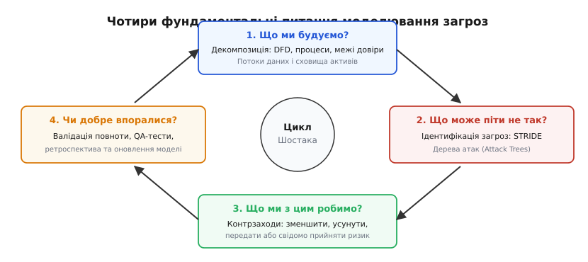
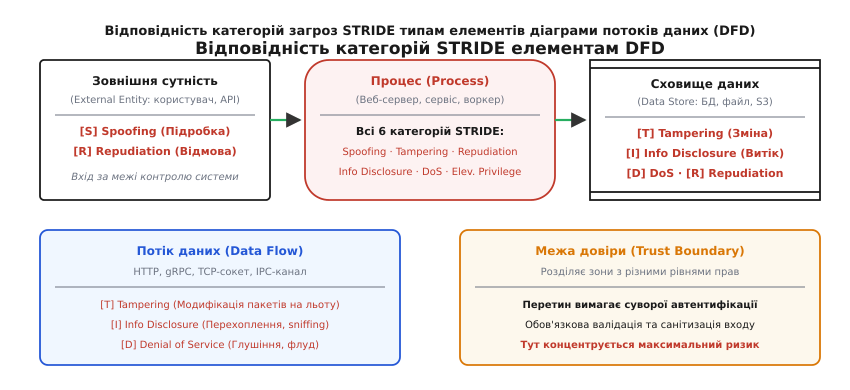
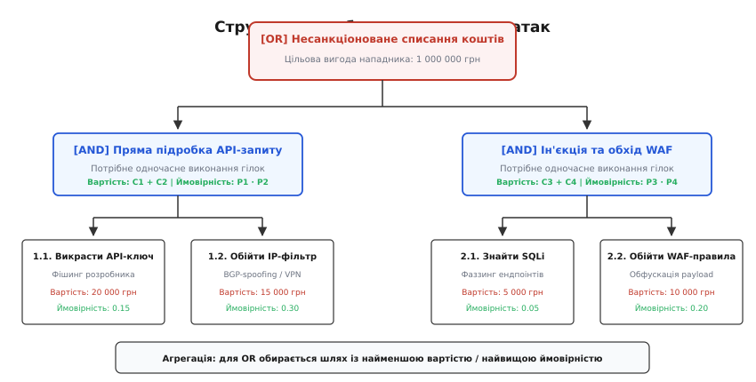
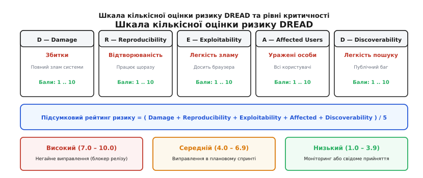

# Моделювання загроз: STRIDE, DREAD та дерева атак (Threat Modeling)

<preknowlist>
- [Межі довіри](topic:sf-security/trust-boundaries) — виокремлення периметрів виконання з різними рівнями привілеїв та контроль перетину кордонів.
- [Поверхня атаки](topic:sf-security/attack-surface) — сукупність усіх доступних ззовні точок входу, інтерфейсів, портів та протоколів взаємодії.
- [Принцип найменших привілеїв](topic:sf-security/least-privilege) — надання кожному процесу та користувачеві виключно мінімально необхідних прав доступу.
- [Аудит-лог як захищений вузол](topic:sf-security/audit-logging) — організація невідпорного запису системних подій для розслідування інцидентів.
- [Захист від атак повторного відтворення](topic:sf-security/replay-protection) — прив'язка повідомлень до часового вікна, одноразових чисел (nonce) та стану лічильника.
</preknowlist>

Команда фінтех-стартапу завершує розробку платіжного шлюзу. Керівництво виділяє 95% бюджету безпеки на зовнішні атрибути: купує дорогий хмарний брандмауер веб-додатків (WAF), налаштовує взаємне шифрування трафіку через TLS 1.3 на всіх шлюзах та встановлює сканери вразливостей вихідного коду. Проте під час незалежного тестування на проникнення сторонній аудитор за п'ятнадцять хвилин отримує повний доступ до балансів користувачів. Зловмиснику не знадобилося ламати криптографію або шукати помилки переповнення буфера: він просто відправив запит на діагностичний HTTP-ендпоінт внутрішнього мікросервісу обробки чеків, який розробники винесли на публічний порт без автентифікації, вважаючи, що «цей URL ніде не задокументований, отже його ніхто не знайде».

Ця класична ситуація ілюструє фундаментальну інженерну помилку: **безпека не є властивістю, яку можна докупити або накласти поверх готової системи у вигляді набору плагінів та брандмауерів**. Захищеність виникає лише тоді, коли стійкість до зловмисних дій закладається в саму структуру програми на етапі проектування.

**Моделювання загроз** (англ. *threat modeling*, від *threat* — «загроза, небезпека» та лат. *modellus* — «зразок, міра») — це систематична інженерна дисципліна аналізу архітектури програмного комплексу, спрямована на раннє виявлення потенційних векторів атак, визначення структурних слабкостей, оцінку ризиків та проектування пропорційних контрзаходів ще до написання першого рядка коду.

Історія виникнення цієї інженерної дисципліни — від перших спроб структурувати мислення нападника наприкінці 1990-х років до масштабного впровадження у життєвий цикл розробки безпечного коду (Microsoft SDL) — докладно описана в [історичному нарисі зародження моделювання загроз](topic:sf-security/threat-modeling/hist-origins-of-threat-modeling.md).

## Чотири фундаментальні запитання моделювання загроз

Усі сучасні методології аналізу безпеки базуються на фреймворку Адама Шостака (Adam Shostack), який зводить складний процес моделювання загроз до чотирьох послідовних запитань:


*Цикл моделювання загроз за Адамом Шостаком: декомпозиція системи, пошук загроз, проектування контрзаходів та верифікація якості.*

1. **Що ми будуємо? (Декомпозиція системи):** Інженерна команда складає детальну структурну схему взаємодії компонентів — діаграму потоків даних (DFD). Тут фіксуються всі процеси, зовнішні сервіси, сховища та канали зв'язку.
2. **Що може піти не так? (Ідентифікація загроз):** До кожного елемента архітектури застосовується систематичний класифікатор (STRIDE) або будується дерево атак (Attack Tree), щоб знайти всі теоретично можливі дії зловмисника.
3. **Що ми з цим робимо? (Проектування контрзаходів):** Для кожної знайденої загрози обирається інженерне рішення: зменшення ризику архітектурними засобами, повне усунення небезпечної функції, передача ризику сторонньому сервісу або його усвідомлене прийняття.
4. **Чи добре ми впоралися? (Валідація та ретроспектива):** Перевірка повноти моделі, оцінка залишкового ризику, створення автоматизованих тестів безпеки та оновлення моделі при кожній архітектурній мутації.

> 🔧 **Навіщо це.** Виправлення архітектурної помилки на фазі проектування коштує умовно 1x (кілька годин роботи архітектора). Виправлення тієї самої помилки після релізу в продуктивне середовище коштує від 30x до 100x: воно вимагає екстреного рефакторингу, зупинки сервісу, зміни API для клієнтів, міграції бази даних і компенсації збитків від компрометації. Моделювання загроз переносить витрати на безпеку на найдешевший етап життєвого циклу — концептуальний дизайн (підхід *Shift-Left*).

## Декомпозиція системи: Діаграми потоків даних (DFD)

Неможливо захистити систему, будова якої не зафіксована однозначно. Для моделювання загроз архітектура системи представляється у вигляді **діаграми потоків даних** (Data Flow Diagram, DFD). На відміну від блок-схем алгоритмів (flowcharts) або UML-діаграм класів, DFD фокусується виключно на русі та трансформації інформації крізь межі контролю.

Канонічна DFD-модель містить рівно чотири типи елементів та один критичний топологічний роздільник:

1. **Зовнішня сутність (External Entity):** Джерело або споживач даних, що перебуває поза межами контролю поточної системи. Це може бути кінцевий користувач у веб-браузері, мобільний додаток, сторонній платіжний шлюз або датчик IoT. Зовнішня сутність є потенційно ворожим середовищем.
2. **Процес (Process):** Обчислювальний вузол, що виконує інструкції та перетворює вхідні потоки даних на вихідні. Це веб-сервер, мікросервіс у контейнері Docker, безсерверна функція AWS Lambda або фоновий воркер черги. Процес володіє певними системними привілеями (наприклад, правами користувача ОС чи роллю IAM).
3. **Сховище даних (Data Store):** Пасивне місце довготривалого чи тимчасового збереження байтів, яке не змінює дані самостійно. Це реляційна база даних PostgreSQL, кеш-сервер Redis, об'єктне сховище S3, конфігураційний файл на диску чи пам'ять спільного доступу (shared memory).
4. **Потік даних (Data Flow):** Спрямований канал передачі інформації між двома елементами. Це мережевий HTTP/gRPC-запит, IPC-сокет, труба (pipe), системний виклик або черга повідомлень Kafka.
5. **Межа довіри (Trust Boundary):** Найважливіший концепт безпеки. Це лінія або контур на діаграмі, який розділяє сутності з різними рівнями привілеїв, доступу або фізичного контролю.

Кожен потік даних, який перетинає межу довіри, стає об'єктом максимальної уваги: приймаюча сторона зобов'язана ставитися до вхідних байтів як до потенційно скомпрометованих, виконувати повну валідацію схеми, автентифікацію джерела та авторизацію прав.

## Класифікація загроз STRIDE: систематичний аналіз елементів

Коли діаграму DFD побудовано, інженер повинен перевірити кожен її вузол на наявність специфічних векторів атак. Щоб аналіз не перетворився на безсистемний штурм, використовують мнемонічну модель **STRIDE**, розроблену в Microsoft.

STRIDE групує всі комп'ютерні загрози у шість ортогональних класів, кожен з яких є антиподом фундаментальної властивості безпечної системи:


*Канонічна матриця відповідності загроз STRIDE типам елементів діаграми потоків даних (DFD) та роль меж довіри.*

### 1. S — Spoofing (Підробка особи та ідентичності)

- **Суть загрози:** Нападник видає себе за іншого суб'єкта або сервіс, отримуючи доступ до не призначених йому функцій чи даних.
- **Цільові елементи DFD:** Зовнішні сутності (External Entity), Процеси (Process).
- **Приклади в коді:** Підробка ідентифікатора клієнта `user_id` у відкритому cookie-файлі; фішинг облікових даних; BGP-спуфінг; відправка запиту від імені іншого мікросервісу у внутрішній мережі без перевірки сертифіката.
- **Архітектурні контрзаходи:** Впровадження суворої криптографічної автентифікації на основі відкритих ключів (mTLS), підписані асиметричним алгоритмом JWT-токени (RS256/EdDSA) з обов'язковою верифікацією підпису, механізми FIDO2/WebAuthn та відмова від довіри до IP-адрес як джерела ідентифікації.

### 2. T — Tampering (Фальсифікація та модифікація даних)

- **Суть загрози:** Несанкціонована зміна інформації під час її передачі мережею, збереження на носії або обробки в пам'яті.
- **Цільові елементи DFD:** Потоки даних (Data Flow), Сховища даних (Data Store), Процеси (Process).
- **Приклади в коді:** Атака людини посередині (Man-in-the-Middle) на незашифрованому HTTP-трафіку; пряме редагування балансу в базі даних без авторизованої транзакції; підміна параметрів командного рядка чи конфігураційного файлу на диску.
- **Архітектурні контрзаходи:** Використання протоколів із гарантією автентифікованого шифрування (TLS 1.3 з шифрами AEAD), застосування кодів автентифікації повідомлень (HMAC-SHA256), цифрові підписи транзакцій, контрольні суми SHA-256 для артефактів та конфігурацій, апаратно захищені журнали запису (WORM / append-only logs).

### 3. R — Repudiation (Відмова від авторства дій)

- **Суть загрози:** Суб'єкт виконує критичну або зловмисну дію, а потім заперечує свою причетність, оскільки система не має юридично чи технічно неспростовних доказів його авторства.
- **Цільові елементи DFD:** Зовнішні сутності (External Entity), Процеси (Process), Сховища даних (Data Store).
- **Приклади в коді:** Клієнт стверджує, що не робив грошовий переказ, а сервер логував лише рядок `Transaction processed` без прив'язки до підпису користувача; адміністратор видаляє таблицю з бази даних і зачищає системний текстовий лог у `/var/log`.
- **Архітектурні контрзаходи:** Асиметричні цифрові підписи для фінансових і чутливих операцій, криптографічно зв'язані аудит-журнали (на базі дерев Меркла), відправка логів у режимі реального часу на ізольований сервер аудиту без права перезапису чи видалення (write-once audit service).

### 4. I — Information Disclosure (Розкриття конфіденційної інформації)

- **Суть загрози:** Неавторизований доступ до таємних або приватних даних особами, які не мають відповідного дозволу.
- **Цільові елементи DFD:** Сховища даних (Data Store), Потоки даних (Data Flow), Процеси (Process).
- **Приклади в коді:** Перехоплення незашифрованого трафіку в публічній Wi-Fi мережі; збереження паролів у відкритому вигляді у базі даних; виведення повного стек-трейсу помилки БД з обліковими даними у відповідь клієнту веб-сервера (Error Leakage); доступ до публічно відкритого S3-бакета з паспортами користувачів.
- **Архітектурні контрзаходи:** Наскрізне шифрування каналів (in-transit encryption), шифрування дисків і баз даних за допомогою ключів KMS (at-rest encryption), токенізація чутливих реквізитів, фільтрація та маскування чутливих полів у системних логах, мінімізація виводу діагностичних повідомлень клієнту.

### 5. D — Denial of Service (Відмова в обслуговуванні)

- **Суть загрози:** Навмисне вичерпання апаратних чи програмних ресурсів системи (процесорного часу, оперативної пам'яті, дискового простору, пулу з'єднань з базою, дескрипторів сокетів), що робить сервіс недоступним для легітимних клієнтів.
- **Цільові елементи DFD:** Процеси (Process), Сховища даних (Data Store), Потоки даних (Data Flow).
- **Приклади в коді:** SYN-флуд мережевого адаптера; надсилання складних регулярних виразів, що викликають катастрофічний бектрекінг (ReDoS); запит на генерацію гігантського PDF-звіту без пагінації; вичерпання дискового простору шляхом безконтрольного завантаження файлів.
- **Архітектурні контрзаходи:** Впровадження багаторівневого обмеження швидкості запитів (Rate Limiting на рівні API Gateway), валідація максимального розміру вхідного payload до початку парсингу, ліміти ресурсів контейнерів (cgroups / CPU quotas), черги з обмеженою довжиною та механізмами відхилення запитів при перевантаженні (Backpressure / Circuit Breakers), використання пулів з'єднань із суворими таймаутами.

### 6. E — Elevation of Privilege (Підвищення привілеїв)

- **Суть загрози:** Неавторизоване отримання користувачем або скомпрометованим процесом вищих прав доступу, ніж було надано початково (наприклад, перехід зі звичайного користувача в статус адміністратора системи чи виконання довільного коду на сервері).
- **Цільові елементи DFD:** Процеси (Process).
- **Приклади в коді:** Переповнення буфера в утиліті з бітом SUID root; вразливість Remote Code Execution (RCE) через небезпечну десеріалізацію об'єктів; ін'єкція SQL-команд, що дозволяє виконати функцію `xp_cmdshell` від імені системного користувача СУБД; вразливість заплутаного заступника (Confused Deputy).
- **Архітектурні контрзаходи:** Принцип найменших привілеїв (Least Privilege), відмова від запуску процесів від імені root/Administrator, ізоляція процесів у пісочницях (Linux namespaces, seccomp, AppArmor), перевірка повноважень (RBAC/ABAC) на кожному шарі бізнес-логіки перед виконанням мутацій, використання типобезпечних мов програмування з автоматичним контролем меж пам'яті.

### Матриця відповідності STRIDE елементам DFD

Кожен тип елемента DFD має унікальну комбінацію вразливостей, що формалізується в нормативній матриці:

| Тип елемента DFD | Spoofing | Tampering | Repudiation | Info Disclosure | Denial of Service | Elevation of Privilege |
| :--- | :---: | :---: | :---: | :---: | :---: | :---: |
| **Зовнішня сутність** (External Entity) | **ТАК** | НІ | **ТАК** | НІ | НІ | НІ |
| **Процес** (Process) | **ТАК** | **ТАК** | **ТАК** | **ТАК** | **ТАК** | **ТАК** |
| **Сховище даних** (Data Store) | НІ | **ТАК** | **ТАК** | **ТАК** | **ТАК** | НІ |
| **Потік даних** (Data Flow) | НІ | **ТАК** | НІ | **ТАК** | **ТАК** | НІ |

*Зовнішня сутність не може зазнати Elevation of Privilege всередині нашої системи, оскільки ми не контролюємо її код; але вона може підробити ідентичність (Spoofing) або відмовитися від виконаної дії (Repudiation).*

## Спеціалізовані класифікатори загроз: LINDDUN та PASTA

Окрім класичного STRIDE, який фокусується на технічній безпеці інформації (Security), інженерна практика розробила спеціалізовані моделі для суміжних аспектів:

### LINDDUN: Моделювання загроз приватності

Якщо STRIDE захищає систему від зламу, то модель **LINDDUN** (розроблена дослідницькою групою DistriNet) фокусується на захисті персональних даних користувачів від несанкціонованого профілювання та деанонімізації:
- **L**inkability (Зв'язуваність): Можливість пов'язати дві окремі дії користувача в єдиний профіль.
- **I**dentifiability (Ідентифікованість): Можливість розкрити реальну особу суб'єкта за непрямими ознаками.
- **N**on-repudiation (Неможливість заперечення): Відсутність механізмів правдоподібного заперечення участі в сесії.
- **D**etectability (Виявність): Здатність спостерігача визначити сам факт присутності даних або активності.
- **D**isclosure of information (Розкриття інформації): Прямий витік персональних ідентифікаторів.
- **U**nawareness (Необізнаність): Обробка даних без явної згоди або інформування суб'єкта.
- **N**on-compliance (Невідповідність нормативам): Порушення регламентів GDPR, CCPA або HIPAA.

### PASTA: Ризик-орієнтований процес моделювання

**PASTA** (Process for Attack Simulation and Threat Analysis) — це семиетапна методологія моделювання загроз, яка пов'язує технічні вразливості архітектури безпосередньо з фінансовими цілями та ризиками бізнесу:
1. Визначення бізнес-цілей та регуляторних вимог.
2. Визначення технічного обсягу системи (Scope Definition).
3. Декомпозиція системи на DFD та карти залежностей.
4. Аналіз загроз на основі даних розвідки кіберзагроз (Threat Intelligence).
5. Аналіз вразливостей та слабкостей архітектури.
6. Моделювання сценаріїв атак за допомогою дерев атак.
7. Оцінка залишкового ризику та впливу на бізнес (Impact Analysis).

## Дерева атак (Attack Trees): мислення категоріями цілей нападника

STRIDE дозволяє знайти вразливості окремих компонентів, але не дає відповіді на запитання: «як саме нападник скомбінує ці вразливості, щоб досягти своєї стратегічної мети?». Для моделювання цілісних сценаріїв зламу застосовують **дерева атак** (Attack Trees), концептуалізовані Брюсом Шнаєром.

Дерево атак — це багаторівнева ієрархічна структура, де:
- **Корінь дерева:** Головна мета зловмисника (наприклад, «Викрасти 1 000 000 гривень із банківського шлюзу»).
- **Проміжні вузли:** Підцілі та тактичні етапи атаки.
- **Листки дерева:** Атомарні дії, які нападник безпосередньо виконує (фішинг, експлуатація SQLi, підкуп оператора).


*Дерево атак з операторами AND/OR: декомпозиція мети нападника, агрегація витрат, ймовірностей та пошук критичного шляху.*

Вузли дерева поєднуються двома фундаментальними типами логічних операторів:
- **Оператор АБО (OR-node):** Мета досягається, якщо спрацює **хоча б один** із дочірніх векторів (альтернативні шляхи).
- **Оператор І (AND-node):** Мета досягається лише за умови, що зловмисник успішно виконає **всі дочірні кроки одночасно** (ланцюг обов'язкових умов).

Присвоюючи листкам числові атрибути (вартість атаки в гривнях, ймовірність успіху від 0 до 1, вимоги до спеціального обладнання), архітектор може математично розрахувати найдешевший вектор зламу та визначити критичний розріз системи (Minimal Cut Set) — мінімальний набір контрзаходів, який гарантовано блокує корінь атаки.

Повний математичний апарат розрахунку ймовірностей, функції корисності нападника та пошуку мінімального розрізу винесено в [математичний аналіз дерев атак](topic:sf-security/threat-modeling/math-attack-tree-evaluation.md).

Практичний програмний код обчислювача дерев атак мовами C, C++ та Python представлено в [проектній реалізації рушія обчислення дерев атак](topic:sf-security/threat-modeling/proj-attack-tree-evaluator.md).

## Кількісна оцінка ризиків: модель DREAD та її еволюція

Після ідентифікації сотень потенційних загроз інженерна команда постає перед проблемою тріажу: які діри слід закривати негайно, а які можуть зачекати наступних релізів.

Для кількісної пріоритезації загроз використовують модель **DREAD**, яка оцінює кожну загрозу за п'ятьма параметрами за шкалою від 1 до 10 балів:


*П'ять вимірів ризику за моделлю DREAD, формула агрегації та розподіл за рівнями критичності.*

1. **Damage Potential (Потенційний збиток):** Масштаб наслідків успішної атаки. 1 — незначні незручності; 10 — повна компрометація всієї інфраструктури, витік конфіденційних баз даних, зупинка бізнесу.
2. **Reproducibility (Відтворюваність):** Наскільки надійно спрацьовує експлойт. 1 — атака вимагає збігу рідкісних умов і спрацьовує раз на тисячу спроб; 10 — атака детерміновано спрацьовує щоразу при відправці одного HTTP-запиту.
3. **Exploitability (Легкість експлуатації):** Необхідний рівень кваліфікації та інструментів. 1 — потрібна робота команди криптографів і суперкомп'ютер; 10 — атаку може виконати будь-який користувач через звичайний веб-браузер без спеціальних знань.
4. **Affected Users (Частка уражених користувачів):** Охоплення аудиторії. 1 — поодинокий ізольований акаунт; 10 — всі зареєстровані клієнти та адміністратори сервісу.
5. **Discoverability (Легкість виявлення):** Ймовірність того, що зловмисник самостійно знайде цю вразливість. 1 — діра захована в недокументованому внутрішньому бінарному протоколі; 10 — діра лежить у публічному відкритому API або формі входу.

Підсумковий рейтинг ризику обчислюється як середнє арифметичне:

```
Risk_Score = (Damage + Reproducibility + Exploitability + Affected_Users + Discoverability) / 5
```

За підсумковим балом загрози ділять на три рівні критичності:
- **Високий (7.0 – 10.0):** Критичні загрози. Блокують випуск релізу (блокери) і вимагають негайного архітектурного захисту.
- **Середній (4.0 – 6.9):** Значні загрози. Плануються до виправлення в найближчих інженерних спринтах.
- **Низький (1.0 – 3.9):** Незначні або дорогі в експлуатації загрози. Можуть бути свідомо прийняті як залишковий ризик або поставлені на моніторинг.

### Критика DREAD та сучасна альтернатива

Головним об'єктом критики в індустрії став параметр *Discoverability*. Оцінюючи його, інженери часто схиляються до суб'єктивного самозаспокоєння: «ми нікому не скажемо про цей ендпоінт, отже бал Discoverability дорівнює 1». Це прямо порушує фундаментальний принцип безпеки — **принцип Керкгоффза** (система має бути стійкою, навіть якщо зловмиснику відомі всі деталі її внутрішньої будови).

Тому в сучасній практиці інженери часто використовують модифікований підхід: фіксують параметр Discoverability на максимальному значенні 10 (припускаючи, що нападник знає про систему все) або переходять на індустріальні метрики **CVSS** (Common Vulnerability Scoring System).

## Стратегії обробки загроз

Коли загрозу виявлено та оцінено, архітектор обирає одну з чотирьох стратегій реагування:

1. **Зменшення ризику (Mitigate / Reduce):** Впровадження технічного або архітектурного контрзаходу, який ліквідує загрозу або знижує її показники DREAD до прийнятного рівня (наприклад, додавання mTLS проти спуфінгу чи параметризація запитів проти SQLi). Це основна інженерна реакція (покриває 80–90% випадків).
2. **Усунення загрози (Eliminate / Avoid):** Зміна дизайну системи таким чином, щоб повністю відмовитися від небезпечного функціоналу чи компонента (наприклад, замість зберігання реквізитів банківських карток на власному сервері повністю делегувати їх обробку iframe-віджету платіжного провайдера).
3. **Передача ризику (Transfer):** Делегування фінансової чи операційної відповідальності третій стороні (наприклад, покупка кіберстраховки чи перенесення збереження файлів у кероване хмарне сховище з юридично закріпленим SLA).
4. **Прийняття ризику (Accept):** Усвідомлена фіксація залишкового ризику без впровадження технічного захисту, якщо вартість розробки контрзаходу багаторазово перевищує потенційний збиток від його реалізації.

> 🔧 **Навіщо це.** Прийняття ризику ніколи не може бути негласним чи випадковим. Воно оформлюється письмовим документом (Risk Acceptance Sign-off) за підписом технічного директора (CTO) або офіцера інформаційної безпеки (CISO), де фіксується точний опис загрози, причина відмови від захисту та погоджений рівень можливих збитків.

## Моделювання загроз як код (Threat Modeling as Code)

Сучасні інженерні команди відмовляються від ведення моделей загроз у вигляді ручних таблиць Excel або діаграм у Visio на користь підходу **Threat Modeling as Code (TMaC)**. Архітектура описується у вигляді структурованих маніфестів YAML/JSON прямо в репозиторії проекту.

Автоматизовані лінтери (наприклад, OWASP Threat Dragon, PyTM) запускаються в пайплайнах CI/CD та виконують формальну валідацію:
- Чи кожен новий мікросервіс включений у DFD-діаграму?
- Чи зашифрований кожен потік даних, який перетинає межу довіри?
- Чи присутній хоча б один відкритий (unmitigated) ризик із балом DREAD ≥ 7.0? Якщо так — збірка блокується з ненульовим кодом повернення.

Детальна JSON Schema, структура маніфестів та правила валідації в CI/CD представлені в [специфікації моделі загроз як коду](topic:sf-security/threat-modeling/api-threat-model-schema.md).

## Наскрізний архітектурний приклад: Платіжний сервіс оформлення замовлень

Розглянемо практичний процес моделювання загроз на прикладі типової архітектури мікросервісу оформлення покупок (Checkout Service).

### Крок 1. Побудова DFD та виділення меж довіри

Система складається з чотирьох компонентів, розділених трьома межами довіри:
1. `EE1` (Клієнтський браузер) у межі `TB1` (Публічний інтернет, рівень довіри 0).
2. `PR1` (API Gateway / зворотний проксі) у межі `TB2` (DMZ сервісу, рівень довіри 50).
3. `PR2` (Checkout Core Service) у межі `TB3` (Внутрішній захищений контур, рівень довіри 90).
4. `DS1` (База даних замовлень PostgreSQL) у межі `TB3`.
5. `EE2` (Зовнішній банківський шлюз Visa/Mastercard) за межами нашої інфраструктури.

### Крок 2. Аналіз загроз за методом STRIDE

Проведемо аналіз ключових потоків та елементів:

| Елемент / Потік | Категорія STRIDE | Опис загрози | Потенційний сценарій атаки |
| :--- | :--- | :--- | :--- |
| **Потік Browser → Gateway** | **T** (Tampering) | Підміна суми платежу в JSON-пакеті | Користувач надсилає запит на купівлю товару вартістю 10 000 грн, змінивши поле `amount` на `1.00`. |
| **Потік Gateway → Checkout** | **S** (Spoofing) | Прямий виклик внутрішнього RPC без автентифікації | Зловмисник з внутрішньої підмережі відправляє фальшивий gRPC-виклик напряму на Checkout, оминаючи перевірку сесії на Gateway. |
| **Вузол Checkout Service** | **E** (Elevation of Privilege) | Виконання коду через RCE | Зловмисник експлуатує вразливість у бібліотеці десеріалізації та отримує оболонку bash від імені користувача процесу. |
| **Сховище PostgreSQL** | **I** (Information Disclosure) | Витік реквізитів карток через SQLi | Несанітизований рядок пошуку в замовленнях дозволяє виконати `UNION SELECT` і прочитати чужі транзакції. |
| **Потік Checkout → Bank** | **R** (Repudiation) | Відмова клієнта від авторизації списання | Клієнт стверджує, що шлюз списав гроші без його згоди; система не зберегла криптографічний токен сесії 3D-Secure. |
| **Вузол API Gateway** | **D** (Denial of Service) | Вичерпання з'єднань через HTTP/2 флуд | Ботнет надсилає 100 000 одночасних запитів, переповнюючи пул воркерів проксі-сервера. |

### Крок 3. Оцінка за шкалою DREAD та вибір контрзаходів

1. **Підміна суми платежу (Tampering):**
   - `D = 9`, `R = 10`, `E = 10`, `A = 10`, `D = 9` → `DREAD = 9.6/10` (Критичний).
   - *Архітектурний контрзахід:* Серверний розрахунок вартості. Клієнт передає лише ідентифікатор товару `product_id` та кількість `quantity`. Сервіс Checkout самостійно витягує актуальну ціну з авторитетної бази даних товарів. Будь-які числові поля цін від клієнта відкидаються.
2. **Прямий виклик внутрішнього RPC (Spoofing):**
   - `D = 10`, `R = 9`, `E = 6`, `A = 10`, `D = 6` → `DREAD = 8.2/10` (Критичний).
   - *Архітектурний контрзахід:* Впровадження Service Mesh із обов'язковою взаємною автентифікацією (mTLS) між Gateway та Checkout Service. Checkout Service відхиляє будь-які TCP-з'єднання без валідного X.509 сертифіката Gateway.
3. **SQL-ін'єкція в базу PostgreSQL (Elevation / Info Disclosure):**
   - `D = 10`, `R = 8`, `E = 6`, `A = 10`, `D = 5` → `DREAD = 7.8/10` (Критичний).
   - *Архітектурний контрзахід:* Повна заборона динамічної конкатенації рядків SQL у репозиторії коду на рівні статичного аналізатора (SAST). Використання виключно параметризованих prepared statements в драйвері бази даних та виділення для сервісу облікового запису БД з мінімальними правами (без доступу до системних таблиць).

## Підсумок: Безпека як неперервна інженерна властивість

Моделювання загроз не є разовою бюрократичною формальністю, яку виконують на початку проекту й забувають після проходження аудиту. Будь-яка архітектурна зміна — додавання нового стороннього API, перенесення сховища в хмару чи поділ моноліту на мікросервіси — змінює контури меж довіри та відкриває нові вектори атак за класифікацією STRIDE.

Справжня захищеність програмного комплексу виникає з культури системного мислення:
- Постійно ставити чотири запитання Шостака перед реалізацією будь-якої складної функції;
- Ніколи не довіряти даним, які перетинають межу довіри, незалежно від протоколу;
- Вимірювати безпеку не суб'єктивним відчуттям спокою, а економічною невигідністю атаки для нападника в дереві атак.
