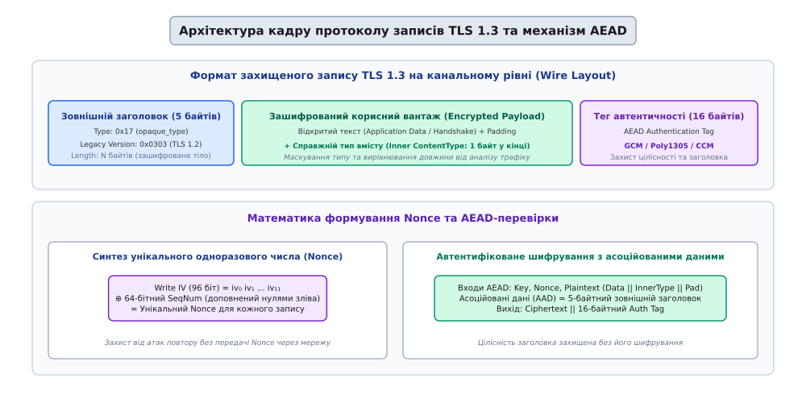
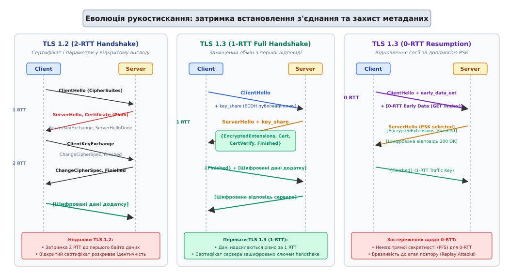
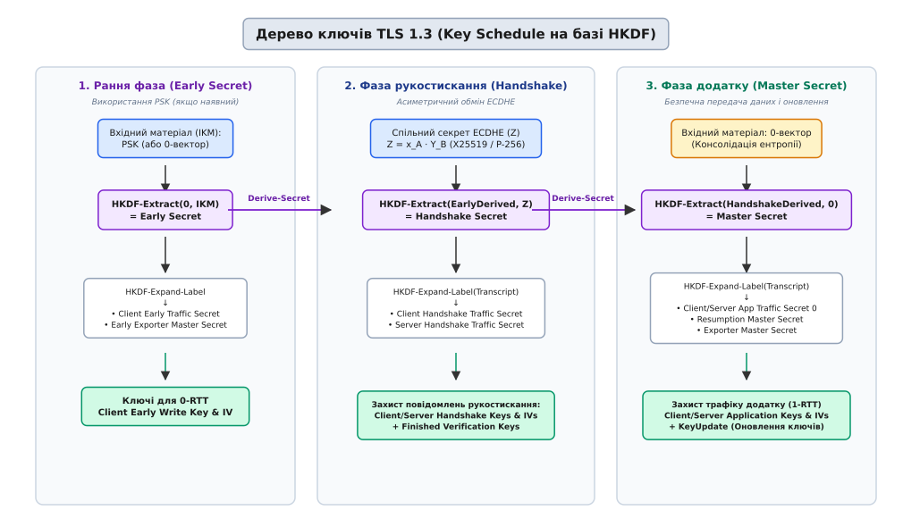

# TLS: протокол захисту транспортного рівня

<preknowlist>
- [Криптографія з відкритим ключем](topic:sf-security/public-key-crypto) — асиметричні ключі, цифровий підпис та сертифікати X.509.
- [Обмін ключами Діффі — Геллмана](topic:sf-security/diffie-hellman) — узгодження спільного секрету відкритим каналом.
- [Ключований хеш HMAC](topic:sf-security/hmac) — автентифікація повідомлень та псевдовипадкові функції.
- [Кадрування повідомлень TCP](topic:com-protocol/tcp-message-framing) — передача дискретних блоків у безперервному байтовому потоці.
</preknowlist>

Байтовий потік, відкритий через сокет TCP між клієнтом і сервером, долає десятки проміжних маршрутизаторів, комутаторів автономних систем і точок обміну трафіком (IXP). Жоден із транзитних вузлів не є довіреним: будь-який маршрутизатор на шляху може пасивно читати передані байти, копіювати конфіденційні паролі й банківські реквізити, або активно підміняти TCP-сегменти, впроваджуючи шкідливий виконуваний код у відповідь вебсервера. 

Саме транспортний рівень мережевого стеку вимагає надійного криптографічного каркаса, який перетворює ненадійну фізичну лінію зв'язку на захищений віртуальний тунель. Цю задачу вирішує протокол TLS (Transport Layer Security, від латинського *transportare* — переносити та англійського *security* — безпека), який функціонує безпосередньо над транспортним протоколом TCP і надає прикладним протоколам (HTTP/2, HTTP/3, SMTP, WebSocket) три невіддільні гарантії:
1. **Конфіденційність (Confidentiality):** захист від пасивного прослуховування за допомогою симетричного шифрування.
2. **Цілісність (Integrity):** захист від активної модифікації, вставки або видалення даних за допомогою автентифікаційного тегу.
3. **Автентичність (Authenticity):** суворе підтвердження ідентичності сервера (а за потреби й клієнта) через ланцюжок цифрових сертифікатів X.509 та асиметричний цифровий підпис.

Сучасний веб спирається на третє покоління стандарту — TLS 1.3 (RFC 8446), який став результатом повного переосмислення уроків двадцятирічної експлуатації протоколів SSL 3.0 та TLS 1.2. Детальний хронологічний шлях розвитку та аналіз атак на попередні стандарти розглянуто в матеріалі [історія розвитку та хвиль криптографічних атак від SSL 2.0 до TLS 1.3](topic:sf-security/tls/hist-ssl-to-tls13.md).

## Архітектурне розшарування протоколу

Протокол TLS не є єдиним монолітним алгоритмом: він побудований як двошарова ієрархічна система, де нижній рівень забезпечує захищене кадрування байтів, а верхній — керує станом криптографічного з'єднання.

```
+-------------------------------------------------------------------------------+
| Прикладний рівень (Application Layer: HTTP/2, HTTP/1.1, WebSocket, WebRTC)    |
+-------------------------------------------------------------------------------+
| Протоколи вищого рівня TLS:                                                   |
|  ├── Протокол рукостискання (Handshake Protocol) — узгодження параметрів      |
|  ├── Протокол сигналів тривоги (Alert Protocol) — сповіщення про збої/закриття|
|  └── Протокол фіктивного стану (ChangeCipherSpec Protocol) — сумісність       |
+-------------------------------------------------------------------------------+
| Протокол записів TLS (Record Protocol)                                        |
|  ├── Фрагментація на кадри (до 16 КБ)                                         |
|  ├── Автентифіковане шифрування (AEAD: AES-GCM, ChaCha20-Poly1305)            |
|  └── Захист від повтору та перевпорядкування (монотонний лічильник SeqNum)    |
+-------------------------------------------------------------------------------+
| Транспортний рівень (Transport Layer: TCP / сокет підключення)                |
+-------------------------------------------------------------------------------+
```

Нижній шар представлений **протоколом записів (Record Protocol)**. Він розбиває безперервний потік прикладних даних на дискретні кадри (записи, records), додає до них метадані, шифрує корисний вантаж і перевіряє цілісність кожного отриманого блоку.

Верхній шар складається з трьох підпротоколів:
- **Handshake Protocol (протокол рукостискання):** виконує первинне узгодження версії протоколу, криптографічних шифрокомплектів, здійснює асиметричний обмін ключами за алгоритмом Діффі — Геллмана, перевіряє сертифікат віддаленої сторони та генерує спільні сесійні ключі.
- **Alert Protocol (протокол сигналів тривоги):** стандартизує передачу службових сповіщень між сторонами — від штатного закриття сеансу (`close_notify`) до фатальних криптографічних помилок (невідповідність сертифіката, збій перевірки тегу автентичності).
- **ChangeCipherSpec Protocol:** застарілий протокол перемикання ключів з TLS 1.2, збережений у TLS 1.3 виключно як 1-байтний заповнювач для проходження крізь застарілі міжмережеві екрани.

## Протокол записів (Record Protocol) та захист кадру

Усі повідомлення вищих протоколів та корисні дані додатку передаються каналом у вигляді записів TLS. Кожен запис починається з фіксованого 5-байтного заголовка сумісності, за яким слідує зашифрований корисний вантаж та 16-байтний суфікс автентифікації.


*Структура бінарного кадру запису TLS 1.3: зовнішній заголовок сумісності, зашифрований блок із прихованим внутрішнім типом і нульовою набивкою, та конвеєр синтезу Nonce для AEAD-шифрування.*

### Зовнішній заголовок та маскування типу вмісту

У TLS 1.2 заголовок запису відкрито вказував реальний тип вмісту (`0x16` для повідомлень рукостискання, `0x17` для даних додатку, `0x15` для сигналів тривоги). Це дозволяло пасивному спостерігачеві точно знати, коли саме клієнт передає зашифровані облікові дані, а коли обмінюється службовими повідомленнями.

У TLS 1.3 застосовано маскування типу (Type Masking):
1. Зовнішній заголовок захищеного запису **завжди** має поле `opaque_type = 0x17` (`application_data`) та версію `legacy_record_version = 0x0303` (TLS 1.2).
2. Справжній тип вмісту (`InnerContentType`) перенесено **всередину зашифрованого блоку**, де він розміщується в останньому байті відкритого тексту безпосередньо перед формуванням автентифікаційного тегу.
3. Між корисними даними та `InnerContentType` дозволено вставляти довільну кількість нульових байтів набивки (Padding). Це дозволяє маскувати точний розмір HTTP-запитів і відповідей, зводячи нанівець спроби аналізу трафіку за розміром мережевих пакетів.

Повний бінарний опис полів заголовків і кодів записів наведено у вставці [специфікація бінарних заголовків, розширень та шифрокомплектів](topic:sf-security/tls/api-record-wire.md).

### Заборона компресії даних

У попередніх версіях стандарту рівень записів підтримував опціональне стиснення корисного навантаження алгоритмом DEFLATE. У 2012–2013 роках атаки CRIME та BREACH довели фундаментальну небезпеку поєднання компресії з шифруванням: якщо зловмисник може контролювати частину відкритого тексту (наприклад, параметри URL) і змушувати браузер надсилати таємні заголовки (`Cookie`), ступінь стиснення видає правильність підбору символів таємниці за зміною загальної довжини шифротексту.

У TLS 1.3 стиснення на рівні протоколу записів **повністю і безповоротно заборонено**. Поле методів компресії в `ClientHello` зафіксоване значенням `0x00` (`null`).

### Конвеєр автентифікованого шифрування (AEAD)

TLS 1.3 відмовився від застарілих конструкцій «спочатку хеш, потім шифрування» (MAC-then-Encrypt) та потокових шифрів без автентичності (RC4). Стандарт вимагає використання виключно алгоритмів автентифікованого шифрування з асоційованими даними (Authenticated Encryption with Associated Data — AEAD), такими як AES-GCM (Galois/Counter Mode), ChaCha20-Poly1305 або AES-CCM.

Конвеєр AEAD забезпечує одночасне шифрування відкритого тексту та криптографічний захист від підміни метаданих:
- **Відкритий текст (Plaintext):** `Data || InnerContentType || ZeroPadding`.
- **Асоційовані дані (Associated Data, AAD):** 5 байтів зовнішнього заголовка запису (`0x17 0x03 0x03 Length`). Хоча заголовок передається відкритим текстом для коректного кадрування сокетом, будь-яка спроба проміжного вузла змінити байт типу або довжини кадру призведе до збою перевірки тегу.
- **Вектор ініціалізації (Nonce):** унікальний 96-бітний вектор, що синтезується безпосередньо відправником і отримувачем без передачі по мережі.

```
Синтез Nonce для запису номер N:
Static Write IV :  iv₀  iv₁  iv₂  iv₃  iv₄  iv₅  iv₆  iv₇  iv₈  iv₉  iv₁₀ iv₁₁  (96 бітів)
Sequence Number :  0x00 0x00 0x00 0x00 seq₀ seq₁ seq₂ seq₃ seq₄ seq₅ seq₆ seq₇  (доповнений до 96 бітів)
─────────────────────────────────────────────────────────────────────────────
AEAD Nonce      :  iv₀  iv₁  iv₂  iv₃ (iv₄⊕seq₀) ... (iv₁₁⊕seq₇)
```

Обидві сторони підтримують внутрішній 64-бітний лічильник послідовності `seq_num`, який ініціалізується нулем після кожного оновлення ключів і збільшується на одиницю після кожного відправленого чи прийнятого запису. 

Це дає дві критичні переваги:
1. **Захист від повторного відтворення (Anti-Replay):** якщо зловмисник перехопить валідний зашифрований пакет і надішле його повторно, приймач спробує розшифрувати його з новим значенням `seq_num`. Неправильний `Nonce` призведе до неспівпадіння 16-байтного тегу автентичності та негайного розриву з'єднання.
2. **Економія пропускної здатності:** 8 байтів лічильника не передаються лінією зв'язку, заощаджуючи мережевий оверхед для кожного пакета.

Практичну програмну реалізацію повного циклу захисту та дешифрування записів наведено у вставці [практична реалізація розбору та шифрування записів TLS 1.3](topic:sf-security/tls/proj-record-codec.md).

## Протокол рукостискання (Handshake Protocol)

Протокол рукостискання є інтелектуальним ядром TLS: він відповідає за автентифікацію сторін, узгодження параметрів шифрування та безпечне виведення криптографічних ключів через незахищений канал зв'язку.


*Часова діаграма обміну повідомленнями рукостискання: 2-RTT у TLS 1.2 з відкритими сертифікатами проти 1-RTT у TLS 1.3 з оптимістичним обміном ключами та ранніми даними 0-RTT.*

### Еволюція затримок: перехід від 2-RTT до 1-RTT

У протоколі TLS 1.2 процедура повного рукостискання вимагала двох послідовних кругових обходів (2-RTT) до того, як клієнт міг надіслати перший байт даних:
1. Клієнт пропонував список шифрів (`ClientHello`), сервер обирав шифр і надсилав відкритий сертифікат (`ServerHello`, `Certificate`, `ServerHelloDone`).
2. Клієнт генерував асиметричний обмін, надсилав свій публічний ключ (`ClientKeyExchange`) і перемикав шифрування (`ChangeCipherSpec`, `Finished`). Лише після зустрічного `Finished` від сервера канал ставав готовим для даних.

У масштабах глобального інтернету, де затримка RTT між континентами становить 100–200 мс, очікування двох RTT створювало помітну паузу перед завантаженням будь-якої вебсторінки.

TLS 1.3 скорочує затримку повного рукостискання до **1-RTT**:
- **Політ 1 (Client → Server):** Клієнт надсилає повідомлення `ClientHello`. Оскільки в сучасному вебі домінує алгоритм Діффі — Геллмана на еліптичних кривих (ECDHE), клієнт оптимістично генерує ефемерну пару ключів (наприклад, для кривої X25519) і передає свій відкритий ключ безпосередньо у першому повідомленні за допомогою розширення `key_share`. Одночасно передається список підтримуваних шифрокомплектів AEAD та алгоритмів підпису.
- **Політ 2 (Server → Client):** Отримавши `ClientHello`, сервер обирає шифрокомплект, бере відкритий ключ клієнта, генерує власну ефемерну пару ключів для тієї самої кривої та формує `ServerHello` з власним `key_share`.
  Маючи обидва публічні ключі, сервер миттєво обчислює спільний секрет Діффі — Геллмана і виводить тимчасові **ключі рукостискання (Handshake Keys)**. 
  Усі наступні повідомлення цього польоту передаються **вже зашифрованими**:
  - `EncryptedExtensions`: параметри сервера, не пов'язані з ключами (наприклад, узгоджений протокол ALPN).
  - `Certificate`: зашифрований ланцюжок сертифікатів X.509 сервера (пасивний спостерігач більше не бачить ідентичності сервера).
  - `CertificateVerify`: цифровий підпис сервера (наприклад, RSA-PSS або ECDSA) над хешем усіх надісланих до цього моменту повідомлень транскрипту. Це доводить, що сервер володіє приватним ключем від сертифіката.
  - `Finished`: автентифікаційний код HMAC над усім транскриптом рукостискання, що гарантує відсутність підміни жодного байта.
- **Політ 3 (Client → Server):** Клієнт перевіряє сертифікат, валідує підпис `CertificateVerify` та перевіряє `Finished`. Після цього клієнт надсилає власний зашифрований `Finished` і **в тому самому пакеті** починає передавати зашифровані корисні дані додатку (1-RTT).

#### Взаємна автентифікація сторін (Mutual TLS / mTLS)

Якщо сервер вимагає криптографічної перевірки особи клієнта (сценарій корпоративних API, банківських шлюзів та сервісних сіток Kubernetes), сервер додає повідомлення `CertificateRequest` у другий політ. 

У відповідь клієнт у третьому польоті перед повідомленням `Finished` надсилає власні зашифровані повідомлення:
- `Certificate`: клієнтський сертифікат X.509;
- `CertificateVerify`: цифровий підпис клієнта над повним транскриптом (включно з `ServerFinished`).

Це дозволяє обом сторонам переконатися в ідентичності одна одної без передачі паролів і без розкриття сертифіката клієнта зовнішнім спостерігачам у мережі.

#### Обробка невідповідності груп: HelloRetryRequest

Якщо клієнт оптимістично згенерував `key_share` для кривої X25519, а сервер вимагає виключно криву NIST P-256 (наприклад, через регуляторні вимоги FIPS), сервер не розриває з'єднання. Натомість сервер надсилає спеціальне службове повідомлення `HelloRetryRequest` (яке має структуру `ServerHello` зі спеціальним фіксованим значенням `random`), вказуючи бажану групу `secp256r1`.

Клієнт генерує новий відкритий ключ для правильної кривої, надсилає оновлений `ClientHello`, і рукостискання успішно завершується з додатковою затримкою в 1 RTT (перетворюючись на 2-RTT). У сучасному інтернеті понад 98% клієнтів за замовчуванням пропонують криву X25519, тому ймовірність виникнення `HelloRetryRequest` є вкрай низькою.

Порівняльний структурний аналіз обох підходів наведено у вставці [порівняльний аналіз архітектурних змін між TLS 1.2 та TLS 1.3](topic:sf-security/tls/comp-tls12-vs-tls13.md).

> 🔧 **Навіщо це.**
> Зменшення затримки встановлення з'єднання з 2-RTT до 1-RTT скорочує час завантаження мобільних додатків і вебсайтів на сотні мілісекунд у стільникових мережах 4G/5G, де радіозатримка початкового доступу є основним фактором відчутної швидкодії.

### Режим відновлення сесії та нульова затримка (0-RTT Early Data)

Якщо клієнт уже підключався до сервера раніше, сервер може надіслати йому після завершення рукостискання зашифрований квиток сесії — повідомлення `NewSessionTicket` (RFC 5077). Квиток містить зашифрований внутрішнім ключем сервера стан сесії та пов'язаний із ним попередньо узгоджений ключ (Pre-Shared Key — PSK).

При повторному підключенні клієнт може використати режим **0-RTT (Early Data)**:
1. Клієнт додає квиток `PSK` до повідомлення `ClientHello` разом із розширенням `early_data`.
2. На базі збереженого ключа PSK клієнт виводить ранні ключі шифрування (`Client Early Traffic Secret`) і шифрує перший прикладний запит (наприклад, `GET /api/v1/profile`).
3. Зашифровані ранні дані надсилаються **в першому ж TCP-пакеті разом із ClientHello**. Затримка становить 0 RTT.

#### Загроза атак повторного відтворення (Replay Attacks) у 0-RTT

Режим 0-RTT має принциповий криптографічний компроміс: **він не має властивості Perfect Forward Secrecy для ранніх даних і фундаментально вразливий до атак повторного відтворення (Replay Attacks)**.

Оскільки `ClientHello` та ранні дані зашифровані статичним ключем PSK без участі свіжого випадкового числа від сервера, зловмисник, що перехопив TCP-пакет 0-RTT, може повторно надіслати його на сервер через годину або надіслати його копію на десять сусідніх серверів кластера. Якщо в тілі запиту містилася неідемпотентна дія (наприклад, `POST /api/pay?amount=100`), сервер виконає операцію списання коштів повторно.

Для захисту від атак повтору стандарт RFC 8446 висуває суворі вимоги:
- Протоколи прикладного рівня **повинні використовувати 0-RTT лише для строго ідемпотентних операцій** (безпечних HTTP-методів `GET`, `HEAD`, де повторний виклик не змінює стан системи). Будь-які запити `POST`, `PUT`, `DELETE` у ранніх даних заборонені.
- Сервери розгортають механізми захисту від повторів: одноразові сесійні квитки (Single-Use Tickets), ведення розподіленого кешу нещодавно використаних ідентифікаторів квитків (Anti-Replay Cache) та строгу перевірку часових вікон валідності квитка (Client/Server Ticket Age).

## Дерево ключів TLS 1.3 (Key Schedule на базі HKDF)

Усі криптографічні ключі в TLS 1.3 породжуються детермінованим ієрархічним автоматом — деревом ключів, побудованим на базі стандарту HKDF (RFC 5869). Конструкція спирається на криптографічні функції `HKDF-Extract` (стиснення нерівномірної ентропії у псевдовипадковий ключ) та `HKDF-Expand-Label` (розширення ключа з прив'язкою до унікального текстового мітки-контексту).


*Ієрархічна структура дерева ключів TLS 1.3: перехід від Early Secret через змішування з ефемерним секретом ECDHE до Handshake Secret та фінального Master Secret.*

Процес розгортання дерева ключів складається з трьох послідовних фаз:

1. **Фаза раннього секрету (Early Secret):**
   - Вхід: попередньо узгоджений ключ `PSK` (якщо використовується) або нульовий вектор.
   - Обчислюється `Early Secret = HKDF-Extract(0, PSK)`.
   - З нього виводяться `Client Early Traffic Secret` (для шифрування ранніх даних 0-RTT) та `Early Exporter Master Secret`.

2. **Фаза секрету рукостискання (Handshake Secret):**
   - До дерева підмішується свіжа асиметрична ентропія: спільний секрет еліптичної кривої `Z = x_A · Y_B`, отриманий у результаті обміну `key_share`.
   - Обчислюється `Handshake Secret = HKDF-Extract(Derive-Secret(Early Secret, "derived"), Z)`.
   - З цього секрету генеруються ключі для захисту службових повідомлень рукостискання: `Client Handshake Traffic Secret` та `Server Handshake Traffic Secret`.

3. **Фаза головного секрету додатку (Master Secret):**
   - Дерево завершує поглинання ентропії: обчислюється `Master Secret = HKDF-Extract(Derive-Secret(Handshake Secret, "derived"), 0)`.
   - Виводяться робочі ключі прикладного трафіку: `Client Application Traffic Secret 0` та `Server Application Traffic Secret 0`.
   - Також обчислюється `Resumption Master Secret`, який використовується для генерації майбутніх сесійних квитків `NewSessionTicket`.

Кожен крок розширення ключів обов'язково включає в себе хеш транскрипту всіх надісланих до цього моменту повідомлень рукостискання (`Transcript-Hash`). Це гарантує математичну властивість зв'язування сесії: навіть якщо дві сесії випадково використають однакові вхідні секрети, відмінність у випадкових числах `ClientHello.random` або порядку розширень створить абсолютно різні сесійні ключі.

### Оновлення ключів у довготривалих з'єднаннях (KeyUpdate Ratchet)

Якщо TCP-з'єднання залишається активним годинами або передає сотні гігабайтів файлового трафіку (наприклад, резервне копіювання баз даних або потокове відео високої чіткості), виникає ризик компрометації сесійного ключа або наближення до безпечної межі кількості зашифрованих блоків для алгоритму GCM (яка не повинна перевищувати `2³²` блоків на один ключ).

Для вирішення цієї проблеми TLS 1.3 запроваджує односторонню ротацію ключів (Forward Secrecy Ratchet) за допомогою повідомлення `KeyUpdate`:
1. Будь-яка сторона може надіслати повідомлення `KeyUpdate`.
2. На базі поточного секрету `Application Traffic Secret N` за допомогою `HKDF-Expand-Label` обчислюється наступний секрет `Application Traffic Secret N+1`.
3. З нового секрету виводяться свіжі симетричний ключ `Key` та вектор `IV`, а внутрішній лічильник `seq_num` скидається в нуль.
4. Попередній секрет негайно стирається з пам'яті.

Завдяки одностороннім властивостям хеш-функції, зловмисник, який скомпрометує процес після ротації, не зможе обчислити старі ключі та розшифрувати попередні гігабайти трафіку.

Детальний математичний вивід формул HKDF, опис структур та покроковий числовий розрахунок наведено у вставці [математичний апарат HKDF та покрокове розгортання дерева ключів](topic:sf-security/tls/math-hkdf-keyschedule.md).

## Усунення застарілих алгоритмів та Perfect Forward Secrecy

Головною причиною вразливості старих версій TLS була наявність у стандарті застарілих криптографічних примітивів, які зберігалися десятиліттями заради зворотної сумісності. TLS 1.3 провів радикальну чистку:

### 1. Повна заборона статичного обміну ключами RSA
У TLS 1.2 клієнт міг згенерувати випадковий секрет, зашифрувати його публічним ключем RSA із сертифіката сервера і надіслати через мережу. 

Це створювало критичну вразливість: якщо спецслужба або зловмисник записував зашифрований трафік компанії протягом років, а потім (через злам сервера, рішення суду чи витік персоналу) отримував приватний RSA-ключ сервера, **весь збережений історичний трафік за всі роки розшифровувався миттєво**.

TLS 1.3 забороняє статичний RSA для обміну ключами. Усі з'єднання зобов'язані використовувати ефемерні ключі Діффі — Геллмана (ECDHE / DHE). Кожне з'єднання генерує свіжі тимчасові ключі, які видаляються з оперативної пам'яті одразу після виведення сесійних секретів. Це забезпечує обов'язкову **пряму секретність (Perfect Forward Secrecy — PFS)**: навіть повна компрометація довгострокового приватного ключа сервера в майбутньому не дозволяє розшифрувати жодної минулої сесії.

### 2. Відмова від блокових шифрів у режимі CBC та потокового RC4
Режим CBC (Cipher Block Chaining) у поєднанні зі схемою MAC-then-Encrypt породив нескінченну серію часових атак на набивку (BEAST, Lucky Thirteen, POODLE). Потоковий шифр RC4 мав статистичні зміщення, що дозволяли відновлювати сесійні куки.

У TLS 1.3 режими CBC та шифр RC4 повністю видалені. Дозволені лише сучасні шифри AEAD, у яких процедура перевірки цілісності математично об'єднана з процедурою дешифрування.

### 3. Відмова від хеш-функцій MD5 та SHA-1
Старі алгоритми хешування MD5 та SHA-1, у яких знайдено практичні колізії, повністю заборонені для використання в цифрових підписах сертифікатів та транскриптів. Стандарт вимагає сімейство SHA-2 (SHA-256, SHA-384, SHA-512) або SHA-3.

## Розширення TLS: адаптація до сучасного вебу

Гнучкість протоколу TLS забезпечується механізмом розширень (Extensions), які передаються всередині повідомлень рукостискання.

```
Структура розширень у сучасному вебстеку:

ClientHello ──► server_name (SNI / ECH) ──► Маршрутизація на віртуальний хост (CDN / Хмара)
            ──► ALPN                    ──► Вибір протоколу без додаткового RTT (h2 / h3)
            ──► supported_versions      ──► Узгодження TLS 1.3 без закам'янілості версій
            ──► key_share               ──► Оптимістичний обмін ключами ECDHE (X25519)
```

### 1. Server Name Indication (SNI) та захист метаданих через ECH

Коли на одній фізичній IP-адресі та одному TCP-порті 443 розміщуються тисячі різних сайтів (типова архітектура хмарних провайдерів і CDN), сервер повинен знати, сертифікат якого саме домену потрібно надати клієнту ще до початку розшифрування HTTP-запиту.

Для цього розширення **SNI (Server Name Indication, RFC 6066)** передає доменне ім'я цільового вузла (наприклад, `example.com`) у відкритому вигляді всередині `ClientHello`.

Оскільки відкритий SNI дозволяє інтернет-провайдерам і цензорам відстежувати, які саме сайти відвідує користувач, еволюція стандарту створила технологію **ECH (Encrypted Client Hello)**:
- Клієнт отримує відкритий ключ шифрування ECH через захищений DNS-запис (DoH / DNS over HTTPS) типу HTTPS (Type 65).
- Клієнт створює два повідомлення `ClientHello`: зовнішнє відкрите `Outer ClientHello` (із нейтральним публічним SNI провайдера CDN, наприклад, `cloudflare.com`) та внутрішнє зашифроване `Inner ClientHello` (зі справжнім таємним доменним ім'ям).
- Тільки кінцевий сервер CDN може розшифрувати внутрішній `ClientHello`, повністю приховуючи відвідуваний ресурс від сторонніх спостерігачів.

### 2. Application-Layer Protocol Negotiation (ALPN)

Розширення **ALPN (RFC 7301)** дозволяє клієнту та серверу узгодити прикладний протокол безпосередньо під час TLS-рукостискання без потреби у додаткових мережевих запитах.

Клієнт передає у `ClientHello` пріоритетний список протоколів: `["h2", "http/1.1"]`. Сервер обирає найвищий спільний протокол і повертає його значення (`"h2"`) у зашифрованому повідомленні `EncryptedExtensions`. Одразу після завершення рукостискання сторони починають обмін мультиплексованими фреймами HTTP/2 без затримки на погодження версії.

### 3. Сумісність із посередниками (Middlebox Compatibility Mode)

Через наявність мільйонів застарілих міжмережевих екранів у корпоративних мережах, які блокували з'єднання без звичного для TLS 1.2 повідомлення `ChangeCipherSpec`, клієнти та сервери TLS 1.3 використовують стандартизований режим сумісності:
- Відправник надсилає фіктивний 1-байтний пакет `ChangeCipherSpec` (байт `0x14`) одразу після `ClientHello` або `ServerHello`.
- Отримувач TLS 1.3 тихо ігнорує це повідомлення, але застарілі фаєрволи сприймають його як коректну зміну ключів і пропускають подальший шифрований трафік без розриву з'єднання.

## Взаємодія TLS 1.3 з протоколами нового покоління: QUIC та HTTP/3

У традиційному стеку HTTP/2 поверх TCP протокол TLS працює як класичний проміжний шар між сокетом і додатком. Проте поява протоколу нового покоління QUIC (RFC 9000), на якому базується стандарт HTTP/3, змінила архітектурні взаємозв'язки.

У стеку QUIC протокол TLS 1.3 використовується виключно як **генератор криптографічних ключів та кінцевий автомат рукостискання**, тоді як власний протокол записів TLS повністю відкидається:
1. Повідомлення рукостискання TLS 1.3 інкапсулюються безпосередньо у спеціальні фрейми `CRYPTO` протоколу QUIC, що передаються поверх ненадійного транспорту UDP.
2. Протокол QUIC бере на себе функції надійного доставляння, впорядкування та фрагментації повідомлень рукостискання.
3. Коли TLS 1.3 виводить сесійні ключі (`Handshake Keys` та `Application Keys`), він передає їх рушію QUIC.
4. QUIC самостійно шифрує власні UDP-пакети за алгоритмом AEAD, захищаючи не лише корисні дані додатку, але й номери пакетів та транспортні прапорці в заголовках.

Завдяки такій інтеграції, об'єднання рукостискання QUIC та TLS 1.3 дозволяє встановити повністю зашифроване мультиплексоване з'єднання HTTP/3 за 1 RTT без проблеми блокування початку черги (Head-of-Line Blocking), властивої TCP.

## Інженерна вартість та межі захисту

Впровадження TLS забезпечує високий рівень безпеки, але накладає визначені інженерні витрати:
1. **Обчислювальний оверхед:** Асиметричні операції еліптичної криптографії (генерація скалярів, множення точок) та цифрового підпису навантажують процесор сервера при високій частоті нових підключень (Connection Rate). Сучасні сервери вирішують це використанням апаратних інструкцій векторного прискорення AES-NI та AVX-512, оптимізованих асемблерних реалізацій кривої Curve25519 та пулу передініціалізованих сесійних квитків.
2. **Накладні витрати пам'яті та каналу:** Кожен TLS-запис додає щонайменше 5 байтів заголовка та 16 байтів тегу автентичності. Передача великих ланцюжків сертифікатів X.509 (іноді 4–8 КБ) у першому польоті збільшує розмір початкового вікна TCP (TCP Initial Congestion Window).

### Межі захисту та вектор аналізу трафіку
TLS захищає вміст повідомлень, але не приховує факт самого зв'язку:
- IP-адреси та порти відправника й отримувача залишаються відкритими на мережевому рівні IP.
- Частота та розміри переданих зашифрованих записів можуть піддаватися статистичному аналізу трафіку (Traffic Analysis), дозволяючи аналітичним системам здогадуватися про характер активності користувача. Захистом від цього є використання нульової набивки (Padding) та об'єднання кількох прикладних запитів в один потік HTTP/2 чи HTTP/3.

### Постквантові перспективи
Класичні алгоритми ECDHE та RSA базуються на складності задач дискретного логарифмування та факторизації цілих чисел, які можуть бути зламані квантовим комп'ютером достатньої потужності за допомогою алгоритму Шора. 

Відповіддю інженерної спільноти стає впровадження **гібридних постквантових шифрокомплектів у TLS 1.3** (наприклад, комбінація класичної кривої `X25519` з решітковим алгоритмом інкапсуляції ключів `ML-KEM-768` / Kyber). У такому режимі клієнт і сервер обчислюють спільний секрет обома методами одночасно, гарантуючи, що сесія залишиться конфіденційною, навіть якщо один із двох криптографічних фундаментів буде скомпрометовано в майбутньому.
