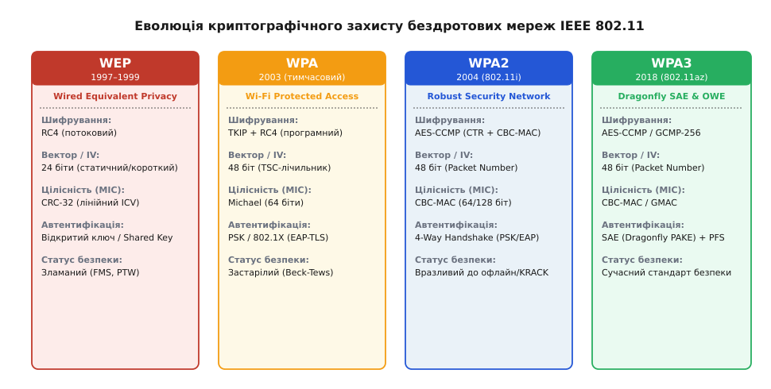
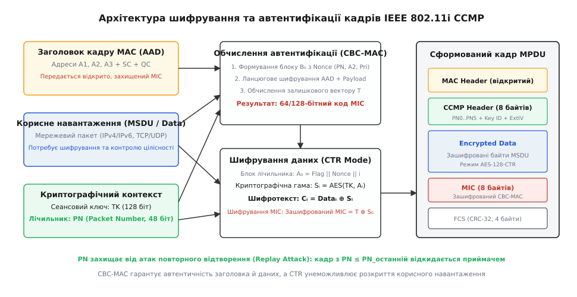
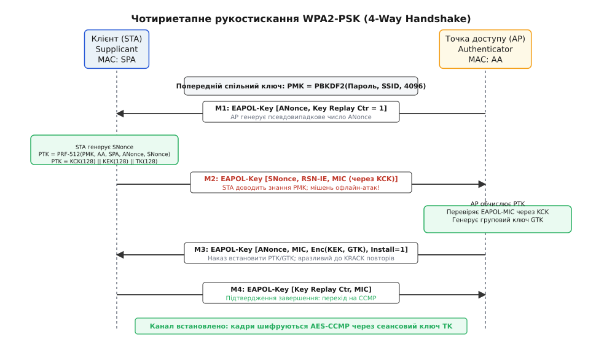
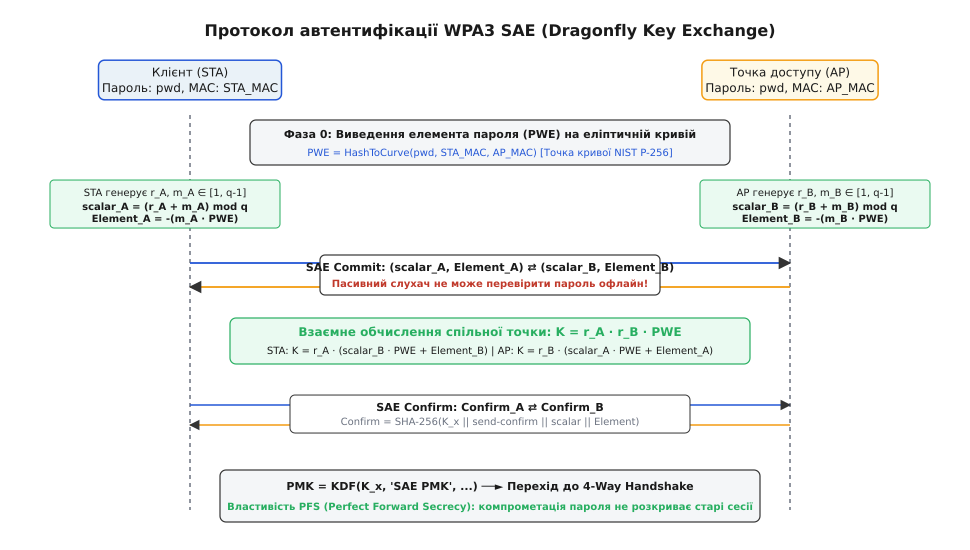

# WPA2 і WPA3: захист бездротового ефіру

<preknowlist>
- [Стандарти Wi-Fi](topic:com-transport/wifi) — радіоканал 802.11, кадри керування та передачі даних, робота точки доступу й клієнта.
- [Криптографічний код автентифікації HMAC](topic:sf-security/keyed-hash-mac) — побудова імітовставки на основі геш-функції та секретного ключа для контролю цілісності.
- [Криптосистема Діффі — Геллмана](topic:sf-security/diffie-hellman) — узгодження спільного таємного ключа у відкритому каналі зв'язку.
- [Еліптичні криві](topic:math-number-theory/elliptic-curves) — групові операції додавання точок та множення точки на скаляр як основа асиметричної криптографії.
</preknowlist>

Коли бездротовий вузол стандарту 802.11 випромінює радіосигнал у діапазонах 2.4 або 5 ГГц, електромагнітна хвиля поширюється у вільному просторі в усіх напрямках зі швидкістю 300 000 км/с, безперешкодно перетинаючи капітальні стіни, перекриття та вікна будівель. Будь-який радіоприймач із копійчаним чипсетом у радіусі ста метрів, переведений у режим моніторингу (Monitor Mode), безперешкодно фіксує кожен переданий біт фізичного рівня. Якщо протокол безпеки використовує статичний пароль або вразливе рукостискання, нападник перехоплює 4 службові кадри обміну за 15 мілісекунд і запускає паралельний словниковий перебір зі швидкістю до 20 мільйонів паролів на секунду на звичайній споживчій відеокарті, не надсилаючи в ефір жодного радіоімпульсу. Захист принципово ворожого широкомовного середовища вимагає багатошарової криптографічної ізоляції: поєднання блокового симетричного шифрування, захисту від атак повторення, динамічного виведення сеансових ключів та переходу від симетричних паролів до протоколів нульового розголошення на еліптичних кривих.

---

### 1. Еволюція безпеки радіоефіру та спадщина IEEE 802.11i

Перша спроба захистити радіоефір — протокол WEP (Wired Equivalent Privacy, у перекладі з англійської — «конфіденційність, еквівалентна дротовій мережі»), стандартизований у 1997 році, — завершилася повною криптографічною катастрофою. Щоб зменшити собівартість перших бездротових адаптерів, розробники обрали потоковий симетричний шифр RC4 (Rivest Cipher 4). Для запобігання повторному використанню криптографічної гами (keystream) до статичного пароля додавався 24-бітний відкритий вектор ініціалізації (Initialization Vector, IV).

Розмірність IV у 24 біти надавала лише `2²⁴ ≈ 16.7` мільйона унікальних комбінацій. У завантаженій мережі зі швидкістю 1000 кадрів/с простір IV вичерпувався за 4.6 години, а через парадокс днів народження перші колізії гами з'являлися вже через кілька секунд роботи. Оскільки додавання двох шифротекстів, отриманих на одній гамі, повністю знищує ключ (`C₁ ⊕ C₂ = P₁ ⊕ P₂`), перехоплювач миттєво розкривав відкритий текст.

Ситуацію погіршила знайдена у 2001 році атака FMS (Fluhrer, Mantin, Shamir): через математичні дефекти алгоритму ініціалізації ключів KSA у шифрі RC4 спеціальні «слабкі» вектори ініціалізації викривали байти секретного пароля. Для перевірки цілісності WEP застосовував звичайну контрольну суму CRC-32 (Integrity Check Value, ICV), лінійність якої дозволяла зловмиснику маніпулювати бітами зашифрованого пакета без знання пароля (Bit-flipping attack) та інжектувати підроблені кадри в мережу.

```
+───────────────────────────────────────────────────────────────────────────────────+
|                           ПРИЧИНИ КРАХУ ПРОТОКОЛУ WEP                             |
|                                                                                   |
|  • Короткий 24-бітний IV ──► Швидке вичерпання простору та повтор гами RC4        |
|  • Слабкі IV в алгоритмі KSA ──► Атака FMS: відновлення пароля за 1–5 млн пакетів  |
|  • Лінійний CRC-32 (ICV) ──► Ін'єкція довільних пакетів і модифікація бітів       |
|  • Відсутність перевірки автентичності ──► Неможливість верифікації відправника   |
+───────────────────────────────────────────────────────────────────────────────────+
```

Як екстрений захід консорціум Wi-Fi Alliance у 2003 році випустив тимчасовий стандарт WPA (Wi-Fi Protected Access) з протоколом TKIP (Temporal Key Integrity Protocol). TKIP працював на наявному апаратному забезпеченні RC4, але розширив простір IV до 48-бітного лічильника TSC (TKIP Sequence Counter), запровадив двофазне перемішування ключів (Key Mixing) для кожного пакета та додав 64-бітну імітовставку Michael MIC.

Повноцінне розв'язання проблеми відбулося у червні 2004 року з ратифікацією стандарту **IEEE 802.11i** (комерційна назва — **WPA2** або Robust Security Network, RSN). Стандарт повністю відкинув застарілий шифр RC4 і закріпив обов'язкове апаратне використання стійкого блокового шифру AES.

Детальний історичний контекст зламу RC4 та створення проміжних контрзаходів TKIP висвітлено у вставці [📜 Еволюція безпеки Wi-Fi: від краху WEP до створення WPA і 802.11i](topic:sf-security/wpa-security/hist-wep-to-wpa.md).


*Хронологія розвитку стандартів безпеки IEEE 802.11: від вразливого WEP на базі RC4 до сучасного WPA3 на базі протоколу SAE та стійкої криптографії.*

---

### 2. Архітектура WPA2: протокол CCMP та блоковий шифр AES

Основою захисту WPA2 став протокол **CCMP** (Counter Mode with Cipher Block Chaining Message Authentication Code Protocol, у перекладі з англійської — «протокол лічильникового режиму з кодом автентифікації повідомлень на основі зчеплення блоків шифру»).

CCMP базується на симетричному блоковому шифрі **AES** (Advanced Encryption Standard) із фіксованим розміром блока 128 бітів (16 байтів) та ключем довжиною 128 бітів. Він поєднує два криптографічні режими в єдиний механізм автентифікованого шифрування з прив'язаними даними (AEAD):

1. **Режим лічильника (CTR Mode) — забезпечення конфіденційності:**
   Корисне навантаження кадру (MSDU / Data Payload) шифрується шляхом накладання операцією `XOR` псевдовипадкової гами, згенерованої блоковим шифром AES над послідовністю лічильників:
   ```
   Блок_лічильника_i = Прапорці || Nonce || i
   Гама_i = AES(TK, Блок_лічильника_i)
   Шифротекст_i = Відкритий_текст_i ⊕ Гама_i
   ```
   Режим CTR перетворює блоковий шифр на потоковий без затримок на доповнення (padding) і дозволяє паралельну обробку блоків на багатиядерних мережевих процесорах.

2. **Режим CBC-MAC — автентифікація та контроль цілісності:**
   Для запобігання підробці відкритих полів кадру обчислюється 64-бітний або 128-бітний код автентичності повідомлення (Message Integrity Code, MIC). Алгоритм послідовно пропускає через ланцюг шифрування AES:
   - **Додаткові автентифіковані дані (AAD — Additional Authentication Data):** критичні поля заголовка кадру MAC (адреси відправника, отримувача, точки доступу, поля керування послідовністю Sequence Control та біти пріоритету QoS Control). Заголовок передається в ефір відкрито, але захищається від підміни.
   - **Відкритий текст корисного навантаження (Payload):** мережевий пакет.

```
+───────────────────────────────────────────────────────────────────────────────────+
|                             ФОРМУВАННЯ КАДРУ CCMP MPDU                            |
|                                                                                   |
|   1. Формування AAD із полів MAC-заголовка кадру 802.11                          |
|   2. Обчислення CBC-MAC над (AAD || Payload) ──► Отримання вектору T (MIC)        |
|   3. Генерація блоків лічильника CTR з унікальним 48-бітним Packet Number (PN)    |
|   4. Шифрування AES-CTR:                                                          |
|      • Зашифрований Payload = Payload ⊕ CTR_Keystream(1..N)                       |
|      • Зашифрований MIC     = T ⊕ CTR_Keystream(0)                                |
|   5. Збирання вихідного кадру:                                                    |
|      [MAC Header] [CCMP Header: PN0..PN5 + KeyID] [Encrypted Payload] [MIC] [FCS] |
+───────────────────────────────────────────────────────────────────────────────────+
```

#### Структура заголовка CCMP та одноразового вектора Nonce
Для кожного зашифрованого кадру формується 8-байтний службовий заголовок **CCMP Header**, що розміщується між MAC-заголовком та зашифрованим корисним навантаженням:
```
+───────┬───────┬──────────┬──────────────┬───────┬───────┬───────┬───────+
| Байт 0| Байт 1| Байт 2   | Байт 3       | Байт 4| Байт 5| Байт 6| Байт 7|
+───────┼───────┼──────────┼──────────────┼───────┼───────┼───────┼───────+
| PN0   | PN1   | Reserved | KeyID / ExtIV| PN2   | PN3   | PN4   | PN5   |
+───────┴───────┴──────────┴──────────────┴───────┴───────┴───────┴───────+
```
Байт 3 містить біт `ExtIV = 1` (який вказує на наявність розширеного 8-байтного заголовка) та біти `KeyID` (ідентифікатор ключа, що дозволяє безшовно перемикати сеансові та групові ключі під час планової ротації). Байти `PN0..PN5` зберігають 48-бітне значення лічильника пакетів `Packet Number`.

Криптографічний вектор **Nonce** довжиною 13 байтів формується за суворою специфікацією:
```
Nonce = Прапорець пріоритету (1 байт) || MAC-адреса передавача A2 (6 байтів) || PN (6 байтів)
```
Початковий блок автентифікації `B₀` для режиму CBC-MAC будується з вектора `Nonce` та бітів довжини:
```
B₀ = 0x59 || Nonce(13 байтів) || Довжина корисного навантаження L (2 байти)
```
Прапорець `0x59` кодує наявність поля AAD та 64-бітну довжину підсумкового коду MIC. Це гарантує, що жоден вектор `Nonce` та початковий стан CBC-MAC не збіжаться для двох різних передавачів або двох різних кадрів однієї сесії.

#### Захист від атак повторного відтворення через Packet Number (PN)
- Для кожного нового кадру, що надсилається з використанням поточного сеансового ключа `TK`, передавач строго інкрементує лічильник: `PN = PN + 1`.
- Номер `PN` входить до складу криптографічного одноразового числа `Nonce`, гарантуючи, що для одного ключа `TK` вектор `Nonce` ніколи не повториться протягом `2⁴⁸ ≈ 2.8 · 10¹⁴` пакетів.
- Приймач підтримує локальний регістр останнього успішно прийнятого значення `PN_last`. Якщо станція отримує кадр із номером `PN_recv ≤ PN_last`, кадр **негайно відкидається** без передачі на верхні рівні стека. Це повністю унеможливлює атаки повторного відтворення (Replay Attacks), за яких зловмисник записує легітимний зашифрований кадр (наприклад, команду переказу коштів) і повторно транслює його в радіоефір.


*Архітектура протоколу CCMP: поєднання лічильникового режиму AES-CTR для шифрування та режиму зчеплення блоків AES-CBC-MAC для обчислення імітовставки.*

---

### 3. Чотириетапне рукостискання (4-Way Handshake) та ієрархія ключів

Для взаємної автентифікації станції (Supplicant / STA) та точки доступу (Authenticator / AP) без прямої передачі пароля в ефір стандарт IEEE 802.11i ввів протокол **4-Way Handshake**.

#### Ієрархія ключів WPA2
1. **PSK (Pre-Shared Key):** текстовий пароль користувача (Passphrase) довжиною 8–63 символи.
2. **PMK (Pairwise Master Key):** 256-бітний майстер-ключ зв'язку, що розраховується через функцію формування ключів PBKDF2 (Password-Based Key Derivation Function 2):
   ```
   PMK = PBKDF2(HMAC-SHA1, Passphrase, SSID, Iterations = 4096, Length = 256 бітів)
   ```
   У корпоративному режимі WPA2-Enterprise (802.1X / EAP-TLS) ключ `PMK` генерується динамічно сервером автентифікації RADIUS для кожної сесії та безпечно доставляється на точку доступу через захищений тунель TLS.
3. **PTK (Pairwise Transient Key):** 512-бітний сеансовий блок індивідуальних ключів, який розраховується псевдовипадковою функцією PRF-512 над ключем `PMK`, MAC-адресами сторін та двома випадковими числами:
   ```
   Sorted_MACs   = min(AP_MAC, STA_MAC)   || max(AP_MAC, STA_MAC)
   Sorted_Nonces = min(ANonce, SNonce)     || max(ANonce, SNonce)
   PTK = PRF-512(PMK, "Pairwise key expansion", Sorted_MACs || Sorted_Nonces)
   ```
   Блок `PTK` розщеплюється на три функціональні ключі:
   - **`KCK` (Key Confirmation Key, байти 0..15, 128 біт):** використовується для розрахунку та верифікації імітовставки EAPOL-Key MIC.
   - **`KEK` (Key Encryption Key, байти 16..31, 128 біт):** використовується точкою доступу для шифрування групового ключа GTK алгоритмом AES Key Wrap (RFC 3394) у повідомленні 3.
   - **`TK` (Temporal Key, байти 32..47, 128 біт):** завантажується в апаратний модуль шифрування радіоадаптера для захисту користувацького трафіку за протоколом CCMP.
4. **GTK (Group Temporal Key):** спільний груповий ключ (128 або 256 бітів), який генерується точкою доступу для захисту широкомовного та багатоадресного трафіку (Broadcast / Multicast).

```
+───────────────────────────────────────────────────────────────────────────────────+
|                  ПОСЛІДОВНІСТЬ ОБМІНУ КАДРАМИ 4-WAY HANDSHAKE                     |
|                                                                                   |
|  Крок 1 (AP ──► STA):  Повідомлення M1                                            |
|  Вміст: ANonce, Key Replay Counter = 1                                            |
|  Дія:   Точка доступу генерує випадкове число ANonce і відправляє клієнту.        |
|         Клієнт генерує власне випадкове число SNonce і розраховує PTK.            |
|                                                                                   |
|  Крок 2 (STA ──► AP):  Повідомлення M2                                            |
|  Вміст: SNonce, RSN Information Element, EAPOL MIC (через KCK)                    |
|  Дія:   Клієнт передає SNonce та підписує кадр імітовставкою MIC.                 |
|         AP розраховує PTK і перевіряє MIC. Збіг MIC доводить, що клієнт володіє   |
|         правильним PMK.                                                           |
|                                                                                   |
|  Крок 3 (AP ──► STA):  Повідомлення M3                                            |
|  Вміст: ANonce, EAPOL MIC, Зашифрований GTK (через KEK), Install Flag = 1         |
|  Дія:   AP доводить клієнту володіння PMK, передає груповий ключ GTK та наказує   |
|         завантажити PTK в апаратний рушій шифрування.                             |
|                                                                                   |
|  Крок 4 (STA ──► AP):  Повідомлення M4                                            |
|  Вміст: Key Replay Counter, EAPOL MIC                                             |
|  Дія:   Клієнт підтверджує готовність перейти на зашифрований канал CCMP.         |
+───────────────────────────────────────────────────────────────────────────────────+
```

#### Ротація групових ключів (Group Key Handshake) та швидкий роумінг (802.11r)
Після завершення 4-Way Handshake точка доступу періодично оновлює ключ `GTK` (наприклад, кожні 3600 секунд або під час відключення будь-якого клієнта від мережі, щоб запобігти розшифруванню широкомовного трафіку колишніми учасниками). Для цього застосовується скорочене двоетапне рукостискання **Group Key Handshake**:
1. **Повідомлення 1 (AP ──► STA):** точка доступу надсилає новий ключ `GTK`, зашифрований сеансовим `KEK` клієнта, підписаний `MIC` через `KCK` та з новим значенням `Key Replay Counter`.
2. **Повідомлення 2 (STA ──► AP):** клієнт підтверджує отримання та успішне встановлення нового `GTK` за допомогою кадру з актуальним `MIC`.

У корпоративних мережах із високими вимогами до мобільності (наприклад, для голосового зв'язку VoWiFi або мобільних промислових роботів) повне проходження 4-Way Handshake під час переходу між точками доступу створює затримку у 100–200 мс, що спричиняє обрив аудіопотоку. Стандарт **IEEE 802.11r (Fast BSS Transition, FT)** оптимізує цей процес за допомогою ієрархії ключів:
```
PMK ──► PMK-R0 (на центральному контролері WLC)
          │
          └──► PMK-R1 (безпечно передається на сусідні точки доступу AP)
                 │
                 └──► PTK-R1 (розраховується за 2 кадри Reassociation)
```
Швидкий роумінг скорочує процедуру перепідключення до менш ніж 30–50 мілісекунд без повторного запуску тривалого процесу автентифікації.

Детальну програмну реалізацію алгоритмів PBKDF2, PRF-512 та перевірки EAPOL MIC мовами C і C++ наведено у вставці [⚙️ Практика розрахунку PTK та верифікації EAPOL MIC](topic:sf-security/wpa-security/proj-wpa2-ptk-derivation.md).


*Послідовність обміну EAPOL-Key кадрами у чотириетапному рукостисканні WPA2 та етапи розрахунку сеансових ключів PTK і GTK.*

---

### 4. Вразливості WPA2-PSK: офлайн-перебір та атака перевстановлення ключів KRACK

Незважаючи на високу математичну стійкість алгоритму AES-CCMP, архітектура WPA2-PSK містить дві критичні концептуальні вразливості на рівні протокольної взаємодії.

#### 1. Офлайн словникова атака (Offline Dictionary Attack)
У протоколі WPA2-PSK слабкий спільний пароль користувача безпосередньо формує майстер-ключ `PMK`. Під час чотириетапного рукостискання всі параметри, необхідні для виведення сеансових ключів, транслюються через радіоефір у незахищеному вигляді:
- `AP_MAC` та `STA_MAC` — відкриті в заголовках кадрів.
- `ANonce` — відкрито передається в повідомленні 1.
- `SNonce` — відкрито передається в повідомленні 2.
- `EAPOL MIC` — контрольний підпис клієнта, переданий у повідомленні 2.

Зловмиснику не потрібно контактувати з точкою доступу після запису рукостискання. Для прискорення захоплення кадрів нападник надсилає підроблений кадр деавтентифікації (Deauthentication Frame Injection) від імені точки доступу з адресою клієнта. Клієнт миттєво втрачає зв'язок і автоматично виконує повторне підключення, генеруючи всі 4 кадри EAPOL.

Маючи перехоплені кадри, атакуючий запускає локальний перебір на власному обладнанні:
```
Для кожного слова зі словника Passphrase_candidate:
    1. PMK_cand = PBKDF2(Passphrase_candidate, SSID, 4096)
    2. PTK_cand = PRF-512(PMK_cand, Sorted_MACs, Sorted_Nonces)
    3. KCK_cand = PTK_cand[0..15]
    4. MIC_cand = HMAC-SHA1(KCK_cand, EAPOL_M2_Data_Zeroed_MIC)[0..15]
    5. Якщо MIC_cand == Intercepted_MIC ──► ПАРОЛЬ МЕРЕЖІ ЗНАЙДЕНО!
```

Оскільки операція виконується повністю локально (офлайн), зловмисник не обмежений пропускною здатністю радіоканалу та не ризикує бути виявленим системами моніторингу WIDS (Wireless Intrusion Detection System).

#### 2. Атака перевстановлення ключів KRACK (Key Reinstallation Attack, 2017)
У 2017 році бельгійський дослідник Маті Ванхоф (Mathy Vanhoef) опублікував вразливість **KRACK**, яка вразила саму специфікацію стандарту IEEE 802.11i.

Проблема полягала в логіці скінченного автомата Supplicant при обробці повідомлення 3 (M3). Стандарт вимагає, щоб у разі втрати підтвердження M4 через радіозавади точка доступу повторно надсилала кадр M3. Отримуючи повторний кадр M3, клієнт був зобов'язаний знову обробити його і **перевстановити** (reinstall) вже активний сеансовий ключ `TK` в апаратний драйвер мережевого адаптера.

Під час перевстановлення ключа `TK` внутрішній лічильник номерів пакетів **`PN` (Packet Number) та лічильник `Nonce` скидалися у нуль**.

```
+───────────────────────────────────────────────────────────────────────────────────+
|                              СЦЕНАРІЙ АТАКИ KRACK                                 |
|                                                                                   |
|  1. Клієнт успішно завершує 4-Way Handshake, встановлює TK і лічильник PN = 1.    |
|  2. Клієнт передає зашифровані пакети даних (PN зростає: 1, 2, 3, 4...).          |
|  3. Нападник (Man-in-the-Middle) блокує доставку кадру M4 до точки доступу.      |
|  4. AP надсилає повтор повідомлення 3 (M3 Retransmission).                       |
|  5. Клієнт повторно інсталює той самий ключ TK і скидає лічильник: PN = 0!        |
|  6. Крах режиму CTR: нові пакети шифруються на ТОМУ САМОМУ NONCE, що й старі:     |
|     C₁ = P₁ ⊕ Keystream(Nonce_0)                                                  |
|     C₂ = P₂ ⊕ Keystream(Nonce_0)  ──►  C₁ ⊕ C₂ = P₁ ⊕ P₂                         |
+───────────────────────────────────────────────────────────────────────────────────+
```

Повторне використання лічильника `Nonce` у лічильниковому режимі AES-CTR повністю руйнує властивості одноразового шифроблокнота. Зловмисник отримує змогу розшифровувати пакети TCP/IP, відновлювати файли cookie сесій HTTP та інжектувати довільні пакети даних усередину встановлених TCP-з'єднань. У деяких операційних системах (зокрема Linux та Android 6.0 через баг у бібліотеці `wpa_supplicant`) перевстановлення ключа взагалі призводило до занулення ключа `TK` в оперативній пам'яті (all-zero encryption key), що дозволяло розшифровувати трафік тривіальним додаванням нулів.

Патч для усунення KRACK змінив поведінку клієнтського стека: Supplicant запам'ятовує факт інсталяції ключа `TK` і під час отримання повторних кадрів M3 лише повторно відправляє підтвердження M4, категорично ігноруючи біт `Install` та зберігаючи поточні значення лічильників `PN` незмінними.

---

### 5. Протокол WPA3: автентифікація через SAE та алгоритм Dragonfly

Щоб назавжди ліквідувати офлайн-перебір словників та вразливість перевстановлення ключів, консорціум Wi-Fi Alliance у 2018 році представив стандарт **WPA3**.

Головною інновацією WPA3-Personal стала заміна фіксованого розрахунку `PMK = PBKDF2(Passphrase)` на криптографічний протокол **SAE** (Simultaneous Authentication of Equals, у перекладі з англійської — «одночасна автентифікація рівноправних вузлів») на основі алгоритму обміну ключами **Dragonfly** (RFC 7664).

Dragonfly належить до класу протоколів **PAKE** (Password-Authenticated Key Exchange): він використовує спільний пароль як маскувальний елемент геометричних перетворень на еліптичній кривій, не розкриваючи математичних слідів пароля у відкритому ефірі.

```
+───────────────────────────────────────────────────────────────────────────────────+
|                         ПРОТОКОЛ WPA3 SAE (DRAGONFLY)                             |
|                                                                                   |
|  1. Фаза 0: Виведення точки пароля PWE на еліптичній кривій NIST P-256:          |
|     PWE = HashToCurve(Passphrase, min(MAC) || max(MAC))  ──► Точка (x, y)        |
|                                                                                   |
|  2. Фаза 1: Обмін Commit (генерація випадкових r, m ∈ [1, q-1]):                  |
|     • Клієнт ──► AP:  scalar_A = (r_A + m_A) mod q,   Element_A = -(m_A · PWE)    |
|     • AP ──► Клієнт:  scalar_B = (r_B + m_B) mod q,   Element_B = -(m_B · PWE)    |
|                                                                                   |
|  3. Взаємне обчислення спільного таємного секрету K:                              |
|     K = r_A · (scalar_B · PWE + Element_B) = (r_A · r_B) · PWE                    |
|                                                                                   |
|  4. Фаза 2: Обмін Confirm (перевірка знання K через HMAC-SHA256):                 |
|     Confirm_A ⇄ Confirm_B ──► Генерація динамічного PMK ──► 4-Way Handshake       |
+───────────────────────────────────────────────────────────────────────────────────+
```

#### Чому офлайн-перебір у WPA3 математично неможливий
Пасивний спостерігач в ефірі бачить лише скаляри `scalar_A, scalar_B` та точки `Element_A, Element_B`. 
- Якщо зловмисник бере кандидатський пароль `pwd'` і розраховує кандидатську точку `PWE'`, додавання `Element_A + scalar_A · PWE'` дає значення `r_A · PWE'`.
- Оскільки приватний скаляр `r_A` обирається клієнтом суто випадково для кожного нового підключення, отримана точка є рівномірно розподіленим випадковим елементом групи.
- Перевірити коректність гіпотези `pwd'` можна лише розрахувавши кінцеву точку `K = (r_A · r_B) · PWE`, що вимагає розв'язання обчислювальної задачі Діффі — Геллмана (Computational Diffie-Hellman, CDH).

Для кривої NIST P-256 задача CDH вимагає `2¹²⁸` операцій. У перехоплених кадрах немає жодного рівняння зв'язку, яке можна верифікувати локально на GPU. Єдиний спосіб перевірити пароль — надіслати підроблений кадр `Confirm` до точки доступу, перетворивши атаку на повільний онлайн-підбір, який блокується політиками обмеження частоти спроб (Rate Limiting).

#### Досконала пряма секретність (Perfect Forward Secrecy, PFS)
Оскільки під час кожної процедури автентифікації генеруються одноразові ефемерні скаляри `r_A` та `r_B`, результуючий сеансовий ключ `PMK` є унікальним для кожної сесії. Навіть якщо зловмисник записував гігабайти бездротового трафіку роками, а потім дізнався пароль мережі (наприклад, через витік бази даних чи примусове вилучення обладнання), **розшифрувати минулий трафік неможливо**, оскільки випадкові скаляри `r_A` та `r_B` були стерті з пам'яті пристроїв одразу після підключення.

#### Еволюція SAE: вразливості Dragonblood (2019) та перехід на Hash-to-Curve
У 2019 році дослідники Маті Ванхоф та Еяль Ронен виявили комплекс атак **Dragonblood** на початкову реалізацію WPA3:
1. **Атаки побічними каналами (Side-Channel Timing & Cache Attacks):**
   Оригінальний алгоритм виведення точки `PWE` (Hunting-and-Pecking) перебирав значення лічильника `iter` у циклі та зупинявся після першого успішного знаходження точки на кривій. Час виконання циклу та звернення до кеш-пам'яті CPU залежали від перших символів пароля. Вимірюючи мікросекундні коливання часу відповіді точки доступу, нападник звужував простір перебору пароля до кількох сотень варіантів.
2. **Атаки на зниження стійкості (Security Downgrade):**
   У перехідному режимі (Transition Mode) точка доступу підтримувала одночасно клієнтів WPA2 та WPA3 на одному радіоканалі. Зловмисник, перебуваючи посередині каналу зв'язку, підробляв кадри встановлення з'єднання та примушував навіть новітні смартфони підключатися через вразливий 4-Way Handshake WPA2.

Для остаточного усунення Dragonblood консорціум Wi-Fi Alliance оновив специфікацію WPA3, зробивши алгоритм **Hash-to-Curve (SSWU, RFC 9380)** обов'язковим стандартом (`sae_pwe=2`). Алгоритм SSWU виконує пряме детерміноване відображення гешу пароля в точку кривої за фіксовану кількість алгебраїчних операцій у константному часі, повністю виключаючи побічні канали витоку даних.

Повний алгебраїчний апарат алгоритмів Hunting-and-Pecking, Hash-to-Curve SSWU та доведення стійкості наведено у вставці [🧮 Математика протоколу Dragonfly: криптографічне виведення SAE у WPA3](topic:sf-security/wpa-security/math-dragonfly-sae.md).


*Діаграма обміну повідомленнями Commit і Confirm у протоколі WPA3 SAE (Dragonfly) із формуванням одноразового PMK без розкриття пароля в ефір.*

---

### 6. Додаткові режими WPA3: PMF, WPA3-Enterprise 192-bit та OWE

Окрім протоколу SAE, специфікація WPA3 запровадила три обов'язкові криптографічні стандарти для комплексного захисту бездротової інфраструктури.

#### 1. Обов'язковий захист службових кадрів керування (PMF / IEEE 802.11w)
У стандартах WEP, WPA та класичному WPA2 службові кадри керування (Management Frames — Deauthentication, Disassociation, Action Frames) передавалися у відкритому вигляді без криптографічного підпису. Це дозволяло атакувальнику інжектувати кадри роз'єднання з підробленою MAC-адресою точки доступу.

У стандарті WPA3 механізм **PMF (Protected Management Frames)** є суворо обов'язковим:
- Індивідуальні службові кадри шифруються сеансовим ключем `TK` через протокол CCMP.
- Широкомовні службові кадри захищаються протоколом **BIP** (Broadcast Integrity Protocol) за допомогою 128-бітного групового ключа цілісності **IGTK** (Integrity Group Temporal Key) на основі алгоритму `AES-128-CMAC` (NIST SP 800-38B). Кадри деавтентифікації від сторонніх генераторів відкидаються мережевим стеком, що робить бездротовий зв'язок стійким до радіоглушіння на логічному рівні.

У нових ревізіях WPA3 додано також захист Beacon Protection, який підписує широкомовні маякові кадри точки доступу за допомогою ключа **BIGTK** (Beacon Integrity Group Temporal Key), блокуючи підміну параметрів радіоканалу та фальшиві повідомлення про зміну робочої частоти (Channel Switch Announcement Attacks).

#### 2. Режим надвисокої безпеки WPA3-Enterprise 192-bit (CNSA Suite)
Для захисту державних та військових мереж WPA3 визначає 192-бітний режим безпеки, що відповідає вимогам Комерційного комплексу національної безпеки США (Commercial National Security Algorithm, CNSA Suite):
- **Автентифікація EAP-TLS:** сертифікати X.509 на базі еліптичної кривої **NIST P-384** (secp384r1) з цифровими підписами ECDSA або RSA-3072.
- **Генерація ключів:** алгоритми гешування `SHA-384` та псевдовипадкові функції `PRF-384` / `HMAC-SHA384`.
- **Шифрування даних:** автентифікований блоковий шифр **GCMP-256** (Galois/Counter Mode Protocol) з 256-бітним ключем або посилений режим **CCMP-256**. Режим GCMP використовує множення в полі Галуа `GF(2¹²⁸)` для генерації імітовставки GMAC, забезпечуючи швидкість обробки понад 10–40 Гбіт/с в апаратних маршрутизаторах стандарту Wi-Fi 6/7.

#### 3. Захист відкритих мереж OWE (Opportunistic Wireless Encryption / Enhanced Open)
Історично відкриті публічні мережі (у кав'ярнях, аеропортах, готелях) працювали взагалі без шифрування (Open System Authentication). Будь-який відвідувач закладу міг перехоплювати HTTP-сесії, DNS-запити та незахищені пакети своїх сусідів по залу.

Стандарт **OWE** (Opportunistic Wireless Encryption, стандартизований у RFC 8110 та специфікації Wi-Fi Certified Enhanced Open) вирішив цю проблему:
1. Мережа залишається відкритою: користувачеві **не потрібно вводити пароль**.
2. Під час початкового обміну кадрами асоціації (Association Request / Response) клієнт і точка доступу здійснюють анонімний обмін ефемерними ключами Діффі — Геллмана на еліптичних кривих (ECDH над кривою P-256).
3. Обидві сторони незалежно розраховують парний майстер-ключ `PMK = HKDF-Extract(ECDH_Secret)`.
4. Сторони виконують стандартний 4-Way Handshake і шифрують весь наступний трафік через AES-CCMP з унікальним індивідуальним ключем `TK`.

OWE унеможливлює пасивне прослуховування сусідського трафіку у відкритих мережах: кожен клієнт отримує персональний зашифрований радіотунель до точки доступу.

#### 4. Безпечне підключення IoT-пристроїв (Device Provisioning Protocol / Wi-Fi Easy Connect)
Для безекранних периферійних пристроїв Інтернету речей (розумних ламп, камер, промислових контролерів) консорціум створив протокол **DPP** (Device Provisioning Protocol, Wi-Fi Easy Connect). Замість небезпечного стандарту WPS (Wi-Fi Protected Setup) із вразливим 8-значним PIN-кодом, DPP використовує сканування відкритого ключа пристрою (через QR-код або мітку NFC) з подальшим захищеним асиметричним обміном ECDH, який передає мережеві конфігурації без ризику радіоперехоплення.

---

> 🔧 **Навіщо це.**
>
> 1. **Конфігурація виробничих точок доступу (hostapd):**
>    Для переведення мережі на WPA3-Personal без підтримки застарілих вразливих клієнтів конфігураційний файл `hostapd.conf` налаштовується з вимкненням WPA2 та обов'язковим PMF:
>    ```ini
>    wpa=2
>    wpa_key_mgmt=SAE
>    rsn_pairwise=CCMP
>    ieee80211w=2       # 2 = PMF Required (обов'язково для WPA3)
>    sae_pwe=2          # 2 = Hash-to-Curve (H2C, блокує атаки Dragonblood)
>    sae_password=ДужеСкладнийПароль123!
>    ```
> 2. **Перехідний режим (WPA2/WPA3 Mixed Mode) та захист від відкоту (Transition Disable):**
>    Параметр `wpa_key_mgmt=WPA-PSK SAE` дозволяє старим смартфонам підключатися через WPA2, а новим — через WPA3. Однак активний зловмисник може інжектувати фальшиві кадри Beacon зі зниженими прапорцями безпеки (Downgrade Attack), змушуючи сучасний клієнт відкотитися до вразливого рукостискання WPA2 4-Way Handshake.
>    Для захисту від відкатів сучасний стандарт 802.11ax ввів інформаційний елемент **Transition Disable KDE**: коли клієнт успішно підключається через WPA3, точка доступу надсилає спеціальну мітку, яка змушує клієнтську операційну систему назавжди заблокувати використання WPA2 для цього SSID.
> 3. **Керування клієнтськими демонами в Linux (iwd та wpa_supplicant):**
>    Сучасний легковагий демон `iwd` (Intel Wireless Daemon) містить повністю апаратну підтримку SAE та OWE за замовчуванням. Для `wpa_supplicant` конфігурація мережі OWE виглядає так:
>    ```ini
>    network={
>        ssid="Airport_Free_WiFi"
>        key_mgmt=OWE
>        ieee80211w=2
>    }
>    ```
>    Це гарантує встановлення індивідуального сеансового шифрування навіть у публічних точках доступу без взаємодії з користувачем.

---

### Підсумок: порівняльний аналіз архітектур безпеки Wi-Fi

```
+──────────────────────────┬──────────────┬──────────────┬──────────────┬──────────────+
| Характеристика           | WEP          | WPA (TKIP)   | WPA2 (RSN)   | WPA3-SAE     |
+──────────────────────────┼──────────────┼──────────────┼──────────────┼──────────────+
| Базовий шифр             | RC4          | RC4 + Mixing | AES-128      | AES / GCMP   |
| Тип шифрування           | Потоковий    | Потоковий    | Блоковий     | Блоковий CTR |
| Контроль цілісності      | CRC-32 (ICV) | Michael MIC  | CBC-MAC      | CBC-MAC/GMAC |
| Розмір вектора Nonce/IV  | 24 біти      | 48 бітів TSC | 48 бітів PN  | 48 бітів PN  |
| Автентифікація PSK       | Спільний ключ| 4-Way EAPOL  | 4-Way EAPOL  | Dragonfly SAE|
| Офлайн-перебір словника  | Не потрібен  | Вразливий    | Вразливий    | Неможливий   |
| Пряма секретність (PFS)  | Відсутня     | Відсутня     | Відсутня     | Гарантована  |
| Захист кадрів (PMF)      | Відсутній    | Відсутній    | Опціональний | Обов'язковий |
| Захист відкритих мереж   | Відсутній    | Відсутній    | Відсутній    | OWE (ECDH)   |
+──────────────────────────┴──────────────┴──────────────┴──────────────┴──────────────+
```

Розвиток стандартів безпеки Wi-Fi пройшов шлях від наївних компромісів 1990-х років на базі потокового шифрування RC4 до математично вивірених криптосистем сучасного рівня. Стандарт WPA2 забезпечив надійну конфіденційність трафіку за допомогою блокового шифру AES-CCMP, однак залишив вразливість до локального перебору паролів під час чотириетапного рукостискання. Стандарт WPA3 усунув цей останній фундаментальний недолік: впровадження протоколу одночасної автентифікації рівноправних вузлів SAE на базі асиметричної математики еліптичних кривих, обов'язковий захист службових кадрів PMF, безпечне підключення IoT-пристроїв через DPP та шифрування відкритих мереж OWE перетворили бездротовий ефір на криптографічно ізольоване середовище, стійке до всіх відомих класів атак пасивного та активного криптоаналізу.
