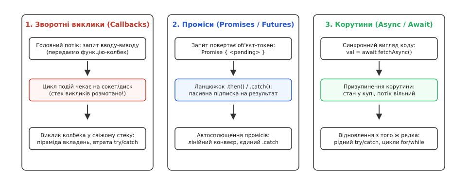
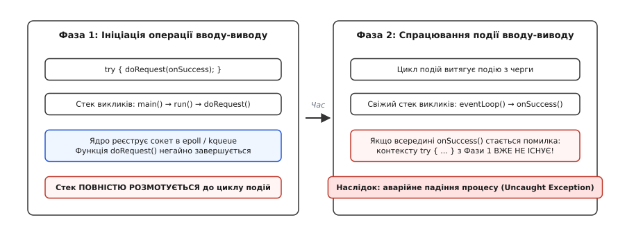
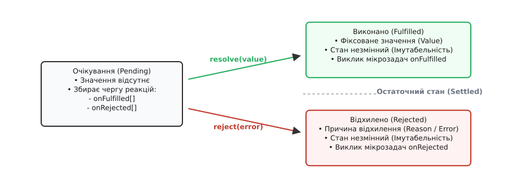
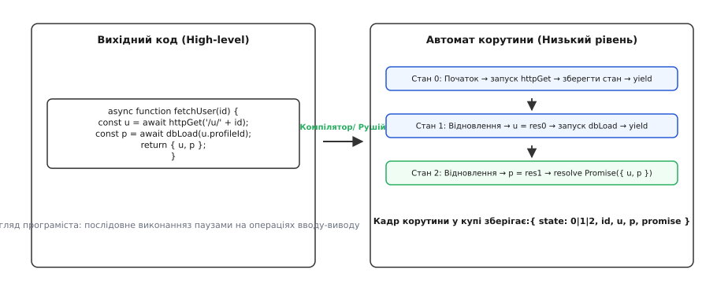

# Колбеки → проміси → async/await

<preknowlist>
- [Блокуючий і неблокуючий ввід-вивід](topic:sf-tasks/blocking-vs-nonblocking-io) — чому очікування на сокет зупиняє системний потік і як неблокуючі виклики повертають керування негайно.
- [Цикл подій](topic:sf-tasks/event-loop) — черги задач, мультиплексування дескрипторів та диспетчеризація реакцій в одному потоці.
- [Стек викликів](topic:sf-lang/stack-lifo) — фрейми локальних змінних, адреси повернення та розмотування стеку при помилках.
</preknowlist>

Коли вебсервер одночасно обслуговує десять тисяч клієнтських з'єднань, класична модель «один потік операційної системи на одного клієнта» вичерпує ресурси апаратного забезпечення за лічені секунди. Системний потік потребує виділення фіксованого стеку пам'яті (зазвичай від 1 до 8 мегабайтів у Linux), а перемикання контексту ядра між тисячами потоків змушує процесор витрачати більше часу на скидання кешів і збереження регістрів, ніж на корисні обчислення. Якщо кожен клієнт робить запит до бази даних і чекає на відповідь 50 мілісекунд, потік майже весь час простоює у заблокованому стані, утримуючи гігабайти оперативної пам'яті.

Щоб подолати це обмеження, системні архітектури перейшли на неблокуючий ввід-вивід (non-blocking I/O) та мультиплексування дескрипторів за допомогою системних викликів `epoll`, `kqueue` чи `io_uring`. У цій моделі єдиний потік операційної системи за допомогою [циклу подій](topic:sf-tasks/event-loop) може обслуговувати сотні тисяч відкритих з'єднань. Коли сокет не готовий віддати дані, ядро негайно повертає керування програмі, а потік переходить до обробки інших готових сокетів.

Проте перехід на цикл подій породив глибоку архітектурну кризу в мовах програмування: **руйнування послідовної моделі виконання**. Якщо операція читання з мережі більше не зупиняє потік до отримання результату, програма не може просто зберегти значення у локальну змінну наступним рядком коду. Виконання алгоритму розривається на окремі часові фрагменти, розділені непередбачуваними паузами. Еволюція від зворотних викликів (колбеків) через проміси до синтаксису `async/await` — це сорокарічний шлях подолання цього розриву: спроба повернути програмісту зручний лінійний синтаксис, зберігши максимальну ефективність неблокуючого вводу-виводу.


*Три парадигми асинхронного коду: вкладена передача функцій, лінійні ланцюжки об'єктів-токенів та корутини з призупиненням виконання.*

---

## Покоління 1: Зворотні виклики (Callbacks)

Найпростіший спосіб зв'язати ініціацію операції з її завершенням полягає в тому, щоб передати наступний крок обчислення у формі вказівника на функцію або замикання. Цей підхід отримав назву **зворотного виклику** або **колбека** (від англ. *callback* — зворотний виклик).

Викликаючи асинхронну операцію, програма передає аргументи та функцію-обробник. Системний виклик ініціює операцію в ядрі й негайно завершується. Головний потік продовжує крутити цикл подій. Коли мережева карта чи диск закінчують передачу даних, ядро генерує подію, цикл подій витягує збережену функцію-колбек і викликає її з отриманими даними.

```ts
// Класичний патерн зворотного виклику з обробкою помилок першим аргументом
function loadUserData(userId: string, callback: (err: Error | null, data?: User) => void): void {
  db.findUser(userId, (err, user) => {
    if (err) {
      callback(err);
      return;
    }
    fetchPermissions(user.roleId, (err, perms) => {
      if (err) {
        callback(err);
        return;
      }
      callback(null, { ...user, permissions: perms });
    });
  });
}
```

На перший погляд, механізм повністю розв'язує задачу: потік ніколи не блокується, а ресурси вивільняються. Проте в реальних промислових системах колбеки виявили критичні дефекти, які зробили побудову великих систем надзвичайно крихкою.

### Інверсія керування та втрата довіри

У синхронному коді той, хто викликає функцію, зберігає повний контроль над потоком виконання: він знає, що виклик відбудеться рівно один раз, у поточному стеку, і поверне керування лише після завершення.

Колбек повністю змінює цей контракт, створюючи **інверсію керування** (англ. *Inversion of Control*). Ви віддаєте приватне замикання сторонній процедурі (бібліотеці, драйверу або мережевому клієнту) і більше не можете контролювати:
1. Чи буде колбек викликано взагалі (наприклад, якщо бібліотека мовчки проковтнула внутрішній збій або зависла на мертвому сокеті).
2. Скільки разів його викличуть. Якщо через логічну помилку в бібліотеці колбек спрацює двічі замість одного разу, платіжна операція спише кошти клієнта повторно, або подвоїться запис у системному лозі.
3. Чи виклик станеться синхронно, чи асинхронно. Якщо функція за одних умов викликає колбек негайно (наприклад, коли дані вже є в локальному кеші пам'яті), а за інших — через чергу циклу подій (при читанні з диска), порядок виконання стає недетермінованим.

Ця третя проблема отримала в інженерній спільноті назву **«випуск Залго»** (англ. *Unleashing Zalgo*). Якщо контракт функції не гарантує суворої асинхронності, код, що слідує за викликом, може виконатися або до, або після тіла колбека:

```ts
let isReady = false;

// Небезпечна функція: синхронна при попаданні в кеш, асинхронна при промаху
fetchCachedData(key, (data) => {
  console.log("Дані отримано, стан готовності:", isReady);
});

isReady = true; // Якщо колбек спрацював синхронно, він побачить isReady = false!
```

Щоб запобігти цьому хаосу, розробникам доводилося вручну загортати виклики в `process.nextTick()` або `setTimeout(..., 0)`, що створювало додаткові накладні витрати й вимагало граничної уважності.

### Руйнування стеку викликів і блоків обробки винятків

Головна небезпека колбеків криється у фізиці роботи [стеку викликів](topic:sf-lang/stack-lifo). У синхронній системі конструкція `try / catch` перехоплює будь-які винятки, оскільки адреси обробників зберігаються вище по стеку: якщо дочірня функція кидає помилку, процесор автоматично розмотує стек до найближчого блоку `catch`.

У моделі зворотних викликів функція, яка встановила блок `try / catch`, завершує свою роботу за частку мікросекунди — щойно операцію зареєстровано в ядрі. Стек викликів повністю розмотується назад до циклу подій.


*Фаза 1: ініціація операції завершується розмотуванням стеку. Фаза 2: виклик колбека відбувається у свіжому стеку, де вихідного блоку try/catch уже не існує.*

Коли через 50 мілісекунд приходить мережевий пакет, цикл подій запускає функцію-колбек у **абсолютно новому, порожньому стеку викликів**. Якщо всередині колбека стається виняток, над ним немає жодного блоку `catch` із точки виклику. Помилка або падає безпосередньо в цикл подій, спричиняючи аварійну зупинку всього процесу (Uncaught Exception), або губиться назавжди.

Саме через це у платформах на зразок Node.js довелося запровадити сувору домовленість: кожен колбек першим аргументом повинен приймати об'єкт помилки `(err, result) => ...`. Проте ця домовленість тримається виключно на дисципліні програміста: якщо розробник забуде перевірити `if (err)` на четвертому рівні вкладеності, збій залишиться непоміченим, а програма перейде в некоректний стан.

### Витік пам'яті через ланцюжки замикань

Кожен вкладений колбек є лексичним замиканням (closure). Це означає, що функція зберігає неявне посилання на область видимості свого батька. Якщо зовнішня функція створила великий тимчасовий буфер (наприклад, сирий масив байтів розміром 50 МБ), а внутрішній колбек на третьому рівні вкладеності використовує лише одне текстове поле `user.id`, увесь 50-мегабайтний буфер залишається заблокованим у динамічній пам'яті доти, доки не відпрацює останній зворотний виклик. У системах з тисячами паралельних запитів такі неявні замикання призводять до виснаження оперативної пам'яті.

### Піраміда вкладень (Callback Hell)

Будь-який послідовний алгоритм з `N` кроків при використанні зворотних викликів змушений вкладати кожну наступну дію всередину тіла попередньої. Це створює характерну форму коду, відому як «піраміда приреченості» (англ. *Pyramid of Doom*):

```ts
// Піраміда вкладень: горизонтальне розростання замість вертикального
loadConfig((err, config) => {
  if (err) return handleError(err);
  connectDatabase(config.dbUrl, (err, db) => {
    if (err) return handleError(err);
    authenticateUser(db, token, (err, user) => {
      if (err) return handleError(err);
      fetchAccount(db, user.id, (err, account) => {
        if (err) return handleError(err);
        sendResponse({ user, account });
      });
    });
  });
});
```

Код розростається вправо швидше, ніж униз. Стандартні конструкції мови — цикли `for`, `while`, розгалуження `switch`, оператори `break`, `continue` та `return` — стають повністю непридатними. Щоб організувати послідовний цикл над масивом асинхронних операцій з колбеками, програмісту доводиться вручну писати рекурсивні функції або лічильники завершення.

Детальніше про те, як індустрія шукала вихід із цієї кризи наприкінці 1980-х і на початку 2000-х років, можна дізнатися у вставці [Від акторів і RPC до синтаксичного цукру: як народилися проміси та async/await](topic:sf-tasks/async-await/hist-promises-origins.md).

---

## Покоління 2: Проміси (Promises / Futures)

Фундаментальний прорив відбувся тоді, коли інженери усвідомили: щоб повернути контроль над асинхронною операцією, функція повинна **не приймати функцію продовження, а повертати об'єкт**.

Цей об'єкт отримав назву **проміс** (від лат. *promissum* крізь англ. *promise* — обіцянка) або **ф'ючерс** (від англ. *future* — майбутнє). Проміс виступає матеріалізованим дескриптором значення, яке стане відомим пізніше.

Замість того, щоб віддавати свій код чужій функції, ви негайно отримуєте від неї токен обіцянки й самі вирішуєте, як і коли підписатися на результат.

### Автомат станів проміса

Проміс — це строго детермінований скінченний автомат, який протягом свого життя може перебувати рівно в одному з трьох взаємовиключних станів:

1. **`pending` (очікування)** — початковий стан. Операція триває, результат або причина відхилення ще не визначені.
2. **`fulfilled` (виконано успішно)** — операція завершилася успішно. Проміс містить зафіксоване значення (`value`).
3. **`rejected` (відхилено з помилкою)** — операція завершилася збоєм. Проміс містить причину відхилення (`reason`).


*Життєвий цикл проміса: стан очікування може перейти в один із двох фінальних станів. Перехід незворотний.*

Головна архітектурна гарантія проміса — **імутабельність фінального стану** (англ. *immutability of settlement*). Щойно проміс перейшов у стан `fulfilled` або `rejected`, він назавжди «застигає». Жоден повторний виклик `resolve` чи `reject` всередині асинхронної операції не здатен змінити його значення. Якщо ви підпишетеся на проміс через годину після того, як він завершився, він миттєво віддасть вам той самий збережений результат. Це повністю розв'язує проблему подвійного виклику або пропущених подій, властиву колбекам.

Внутрішня структура об'єкта `Promise` у рушії V8 містить:
- Поле `[PromiseState]`: `0` (pending), `1` (fulfilled), `2` (rejected).
- Поле `[PromiseResult]`: вихідне значення або об'єкт помилки.
- Масив `[PromiseFulfillReactions]`: черга функцій, що очікують на успіх.
- Масив `[PromiseRejectReactions]`: черга функцій, що очікують на збій.

### Ланцюжки підписок та автосплющення

Взаємодія з результатом проміса відбувається за допомогою методу `.then(onFulfilled, onRejected)`. Цей метод не просто реєструє обробники, а **завжди повертає новий проміс**, утворюючи лінійний обчислювальний конвеєр.

```ts
// Лінійний ланцюжок промісів замість піраміди вкладень
loadConfig()
  .then((config) => connectDatabase(config.dbUrl))
  .then((db) => authenticateUser(db, token))
  .then((user) => fetchAccount(user.id))
  .then((account) => sendResponse(account))
  .catch((err) => handleError(err));
```

Ключовим механізмом, завдяки якому ланцюжок залишається плоским, є **автоматичне сплющення промісів** (англ. *promise chaining and unwrapping*). Якщо функція всередині `.then()` повертає звичайне значення, наступний проміс негайно переходить у стан `fulfilled` із цим значенням. Якщо ж вона повертає інший проміс, зовнішній проміс «чекає» на внутрішній і переймає його стан.

З погляду абстрактної алгебри цей механізм реалізує поведінку монади продовжень. Детальний математичний доказ монадичних законів та категоріальні властивості розгортання оператора `.then()` наведено у вставці [Алгебра промісів: монада продовжень та автосплющення](topic:sf-tasks/async-await/math-monadic-promises.md).

### Черга мікрозадач (Microtask Queue) та ризик голодування

Проміси раз і назавжди ліквідували проблему непередбачуваного порядку виконання («Залго»). За стандартом, усі реакції, передані в `.then()`, `.catch()` або `.finally()`, **ніколи не виконуються синхронно**, навіть якщо проміс уже давно завершений.

Вони завжди поміщаються в спеціальну **чергу мікрозадач** (англ. *Microtask / Job Queue*). Цикл подій гарантує суворий пріоритет: коли поточний стек викликів завершується, рушій зобов'язаний повністю спорожнити чергу мікрозадач перед тим, як перейти до наступної макрозадачі (таймерів, мережевих подій чи рендерингу).

```ts
console.log("1. Синхронний старт");

Promise.resolve().then(() => {
  console.log("3. Мікрозадача з проміса");
});

console.log("2. Синхронний фінал");

// Вивід завжди детермінований: 1 -> 2 -> 3
```

Проте пріоритет мікрозадач несе в собі інженерну небезпеку — **голодування циклу подій** (англ. *Microtask Starvation*). Якщо мікрозадача рекурсивно породжує нові мікрозадачі (наприклад, через нескінченний ланцюжок `Promise.resolve().then(loop)`), черга мікрозадач ніколи не вичерпується. Головний потік на 100% завантажується процесором і жодного разу не доходить до фази опитування дескрипторів `epoll`. Усі мережеві з'єднання та таймери сервера повністю зависають.

### Централізоване спливання помилок

Проміси відновили фундаментальну властивість синхронних винятків — **спливання помилок** (англ. *error propagation* або *exception bubbling*).

Якщо на третьому кроці десятиланкового ланцюжка стається збій або викидається виняток `throw new Error()`, виконання всіх наступних обробників `.then()` пропускається. Помилка автоматично каскадує вниз за ланцюгом до першого знайденого обробника `.catch()`.

```ts
// Єдина точка перехоплення збоїв для всього конвеєра
fetchOrder(orderId)
  .then((order) => validateStock(order))
  .then((order) => chargeCard(order))      // Якщо тут збій...
  .then((receipt) => sendReceipt(receipt)) // ...цей крок буде пропущено...
  .catch((err) => {
    // ...а керування одразу перейде сюди!
    logError("Операція зірвалася:", err);
  });
```

### Конкурентні комбінатори

Проміси вперше надали стандартні примітиви для координації множини одночасних операцій. Замість ручного підрахунку лічильників з'явилися декларативні комбінатори:
- `Promise.all([p1, p2, p3])` — паралельний запуск; очікує успіху **всіх** операцій, або падає негайно при падінні **першої** (стратегія All-or-Nothing).
- `Promise.allSettled([p1, p2])` — чекає повного завершення всіх операцій незалежно від помилок.
- `Promise.race([p1, p2])` — перемагає той, хто завершився першим (успішно або з помилкою).
- `Promise.any([p1, p2])` — повертає перший успішний результат, ігноруючи поодинокі збої.

Повний опис контрактів, таблиці поведінки при порожніх входах та шаблони скасування через `AbortController` зібрані у вставці [Специфікація та контракти комбінаторів: Promise API](topic:sf-tasks/async-await/api-promise-concurrency.md).

### Чому промісів виявилося недостатньо

Попри колосальний крок уперед, проміси залишили кілька суттєвих проблем:

1. **Пастка областей видимості (Scope Leaks)**. Якщо кроку №3 потрібні одночасно результати кроку №1 (`user`) та кроку №2 (`account`), плоский ланцюжок ламається:
   ```ts
   // Щоб прокинути user на наступні кроки, доводиться або створювати зовнішні змінні,
   // або передавати кортежі-нагромаджувачі, або повертатися до вкладеності:
   let savedUser: User;
   loadUser(id)
     .then((u) => { savedUser = u; return loadAccount(u); })
     .then((acc) => render(savedUser, acc));
   ```
2. **Неможливість використання нативних циклів**. Якщо вам потрібно послідовно обробити масив елементів із затримкою між ними, ви не можете написати звичайний цикл `for`. Доводиться конструювати ланцюжок через `array.reduce()` або рекурсивні проміси:
   ```ts
   items.reduce((chain, item) => {
     return chain.then(() => processItem(item));
   }, Promise.resolve());
   ```
3. **Фрагментовані стектрейси**. Якщо помилка виникає глибоко в надрах `.then()`, стек викликів показує лише чергу мікрозадач рушія, часто втрачаючи інформацію про те, яка саме функція вищого рівня ініціювала цей запит.

---

## Покоління 3: Синтаксичний цукор Async / Await

Остаточним кроком в еволюції стало стирання синтаксичної різниці між синхронним та асинхронним кодом. Конструкція `async / await` дозволила писати неблокуючий асинхронний код так, ніби він є абсолютно синхронним і лінійним.

```ts
// Сучасний вигляд: лінійний потік, нативний try/catch, прозорі змінні
async function handleUserRequest(userId: string): Promise<Response> {
  try {
    const config = await loadConfig();
    const db = await connectDatabase(config.dbUrl);
    const user = await authenticateUser(db, token);
    const account = await fetchAccount(db, user.id);
    
    return { status: 200, body: { user, account } };
  } catch (err) {
    logger.error("Помилка обробки запиту:", err);
    return { status: 500, body: { error: "Внутрішній збій" } };
  }
}
```

Змінні `user` та `account` залишаються доступними в межах однієї лексичної області видимості; блок `try / catch` природно ловить помилки на будь-якому з етапів; цикл `for (const item of items) { await process(item); }` виконується послідовно, без жодних рекурсивних хаків.

### Механізм: корутини та компіляторна трансформація

Як це працює під капотом? Чи не повертає `await` блокування системного потоку?

Ні. Ключове слово `await` **ніколи не блокує системний потік**. Воно є точкою призупинення **безстекової корутини** (англ. *stackless coroutine*).


*Компілятор розрізає функцію в точках await на окремі стани автомата, а локальні змінні піднімає в об'єкт у купі.*

Коли компілятор бачить функцію, позначену `async`, він виконує операцію **децукрування** (англ. *lowering / desugaring*):

1. **Виділення кадру корутини (Heap Frame)**: створюється спеціальний об'єкт у купі, куди копіюються аргументи функції та всі її локальні змінні (`config`, `db`, `user`, `account`).
2. **Розбиття графа потоку на стани**: тіло функції розрізається в кожному місці зустрічі оператора `await`. Кожен шматок коду між двома очікуваннями стає окремою гілкою `case` у внутрішньому скінченному автоматі (`State 0`, `State 1`, `State 2`).
3. **Призупинення (Suspension)**: коли виконання доходить до `await expr`, корутина перевіряє стан проміса. Якщо проміс ще не готовий:
   - Стан автомата зберігається у кадрі (наприклад, `state = 1`).
   - Автомат підписує сам себе (свій метод `resume`) на завершення цього проміса через `.then(resume)`.
   - Функція виконує миттєвий вихід (`return`), повертаючи викликачу зовнішній `Promise { <pending> }`. Системний потік звільняється і повертається до виконання циклу подій.
4. **Відновлення (Resumption)**: коли очікуваний проміс вирішується, цикл подій викликає метод `resume`. Перемикач `switch(state)` відновлює виконання саме з `State 1`, витягує обчислене значення і продовжує роботу до наступного `await` або фінального `return`.

Повний код компіляторного автомата станів, ручне децукрування та реалізацію безстекових корутин мовами TypeScript та C++ показано у практичній вставці [Децукрування async/await: побудова скінченного автомата корутини](topic:sf-tasks/async-await/proj-state-machine-desugaring.md).

### Безстекові проти стекових корутин

Важливо розуміти принципову різницю між двома типами корутин у системному програмуванні:

1. **Безстекові корутини (Stackless Coroutines)** — реалізовані в JavaScript/TypeScript, C# (`async/await`), C++20 (`co_await`), Python (`asyncio`) та Rust (`async fn`). Функція не має власного стеку пам'яті. При призупиненні зберігається лише компактний кадр локальних змінних у купі (зазвичай від 32 до 256 байтів). Це дозволяє тримати в пам'яті мільйони одночасних асинхронних задач. Проте призупинятися можна лише безпосередньо всередині самої `async`-функції, де стоїть оператор `await`.
2. **Стекові корутини (Stackful Coroutines / Fibers / Green Threads)** — реалізовані в Go (горутини), Erlang (процеси BEAM) та Java (Project Loom Virtual Threads). Кожна задача має власний невеликий динамічний стек (від 2 до 8 КБ), який може автоматично розширюватися. Функція може призупинитися на будь-якій глибині вкладеності викликів без явного синтаксичного маркування. Платою за це є складніший планувальник середовища виконання та вищі накладні витрати пам'яті на кожну задачу.

### Пастка випадкової послідовності (Accidental Serialization)

Зручність `await` створює одну з найпоширеніших архітектурних помилок — випадкову послідовну зупинку незалежних дій.

Якщо серверу для формування сторінки потрібно отримати профіль користувача і список свіжих новин, ці операції не залежать одна від одної. Проте недосвідчений розробник часто пише:

```ts
// ❌ АНТИПАТЕРН: випадкова послідовність (сумарний час = T1 + T2)
const profile = await fetchProfile(userId); // чекаємо 100мс
const news = await fetchTopNews();          // чекаємо ще 100мс (разом 200мс)
```

Другий запит починається лише після того, як повністю завершився перший. Щоб зберегти паралелізм, запити слід ініціювати одночасно, а `await` застосовувати до комбінатора `Promise.all`:

```ts
//  ПРАВИЛЬНО: конкурентне виконання (сумарний час = max(T1, T2) ≈ 100мс)
const profilePromise = fetchProfile(userId);
const newsPromise = fetchTopNews();

const [profile, news] = await Promise.all([profilePromise, newsPromise]);
```

> 🔧 **Навіщо це.** Застосування `Promise.all` у точках композиції незалежних мікросервісних запитів скорочує час затримки (latency) відповіді сервера в рази, повністю використовуючи можливості мультиплексованого мережевого з'єднання.

### Обмеження конкурентності: патерн пулу задач

Хоча `Promise.all` забезпечує паралелізм, безконтрольний запуск тисяч операцій одночасно є небезпечним антипатерном:

```ts
// ❌ НЕБЕЗПЕКА: запуск 50 000 файлових читань одночасно вичерпає файлові дескриптори ядра (EMFILE)
await Promise.all(fileList.map((file) => readFileAsync(file)));
```

Операційна система має ліміти на кількість відкритих дескрипторів сокетів і файлів (`ulimit -n`), а база даних — ліміт пулу з'єднань. Щоб запобігти збою системи, застосовують патерн **обмеженої конкурентності** (англ. *Bounded Concurrency Pool*), де фіксована кількість асинхронних воркерів розбирає спільну чергу задач:

```ts
async function runWithConcurrencyLimit<T, R>(
  items: T[],
  limit: number,
  worker: (item: T) => Promise<R>
): Promise<R[]> {
  const results: R[] = new Array(items.length);
  let currentIndex = 0;

  const runWorker = async () => {
    while (currentIndex < items.length) {
      const index = currentIndex++;
      results[index] = await worker(items[index]);
    }
  };

  // Запускаємо строго фіксовану кількість паралельних воркерів
  const workers = Array.from({ length: Math.min(limit, items.length) }, () => runWorker());
  await Promise.all(workers);
  return results;
}
```

### Проблема «кольорових функцій» (Function Coloring)

Архітектура `async / await` принесла з собою одне фундаментальне компромісне обмеження, відоме в комп'ютерних науках як **проблема червоних та синіх функцій** (англ. *What Color is Your Function?*, термін Боба Ністрома, 2015).

У мовах з явною асинхронністю всі функції поділяються на два «кольори»:
- **Сині (синхронні)** — виконуються лінійно на системному стеку, повертають чисте значення `T`.
- **Червоні (асинхронні)** — позначені `async`, повертають `Promise<T>`, можуть використовувати `await`.

Головне правило взаємодії кольорів: **червона функція заражає червоним усе дерево викликів вище по стеку**. Ви не можете викликати «червону» функцію зсередини «синьої» і отримати результат синхронно, не заблокувавши потік або не зробивши викликаючу функцію також «червоною». Це змушує асинхронність підніматися вгору по всій ієрархії викликів застосунку аж до точки входу `main()`.

Різні середовища виконання вирішують це по-різному:
- **JavaScript / TypeScript, C#, Python, Rust**: приймають явний поділ на кольори. Це гарантує нульові накладні витрати на синхронізацію та повну прозорість точок можливого перемикання контексту (розробник точно бачить кожне місце призупинення за ключовим словом `await`).
- **Go, Erlang / Elixir**: використовують механізм зелених потоків (горутин / процесів BEAM) із власними керованими стеками. У них кожна функція виглядає як «синя», а перемикання на чергу планувальника при операціях вводу-виводу здійснюється рушієм неявно під капотом. Ця модель усуває вірусність `async`, але вимагає важчого системного середовища виконання (Runtime) з власним витісняльним планувальником.

### Відновлення асинхронних стектрейсів (Zero-Cost Async Stack Traces)

Однією з найбільших перемог сучасних віртуальних машин (зокрема V8 у Node.js 12+) стало відновлення логічних стектрейсів помилок.

У класичних промісах та колбеках фізичний стек викликів скидався в момент виходу в цикл подій. Якщо помилка ставалася на четвертому кроці, звіт про збій містив лише рядок внутрішнього коду `node:internal/process/task_queues`.

У моделі `async/await` компілятор і рушій знають зв'язок між очікуючим промісом і кадром корутини. Коли стається виняток, налагоджувач та рушій проходять вгору по ланцюжку кадрів корутин, що чекають у купі, і безкоштовно (без накладних витрат у звичайному режимі) реконструюють повний логічний стек викликів:

```
Error: Відмовлено в доступі
    at fetchAccount (server.ts:45:11)
    at async handleUserRequest (server.ts:18:21)  <-- Логічний виклик відновлено!
    at async routerMiddleware (server.ts:5:9)
```

---

## Порівняльний синтез трьох парадигм

Еволюція асинхронності є наочним прикладом того, як інженерна думка вирішує конфлікт між машинною продуктивністю та обмеженнями людського сприйняття:

| Критерій | Зворотні виклики (Callbacks) | Проміси (Promises) | Асинхронні корутини (Async/Await) |
| :--- | :--- | :--- | :--- |
| **Синтаксична форма** | Глибоко вкладена піраміда | Лінійний ланцюжок підписок | Звичайний імперативний код |
| **Збереження стану** | Вкладені замикання (Closures) | Повернення об'єктів-токенів | Автоматичний кадр корутини в купі |
| **Обробка винятків** | Ручна перевірка `err` на кожному кроці | Спливання до єдиного `.catch()` | Рідна конструкція `try / catch / finally` |
| **Управління потоком** | Ручні рекурсивні виклики | Функційні комбінатори (`reduce`) | Нативні цикли `for`, `while`, розгалуження |
| **Контроль виконання** | Інверсія контролю, ризик дублікатів | Імутабельний стан `settled` | Прозорі точки призупинення `await` |
| **Ціна в пам'яті** | Мінімум (окремі замикання) | Об'єкт `Promise` на кожну ланку | Об'єкт кадру корутини на кожен виклик |
| **Діагностика збоїв** | Втрата вихідного стеку | Фрагментований стек мікрозадач | Повний асинхронний стектрейс |

Асинхронний синтаксис `async/await` не скасував проміси — він став логічною надбудовою над ними. Проміс залишається фундаментальним типом даних, що виражає відкладене значення на рівні інтерфейсів та міжмодульних контрактів, тоді як `async/await` надає найвищу ергономіку для послідовної алгоритмічної обробки цих значень усередині бізнес-логіки.
