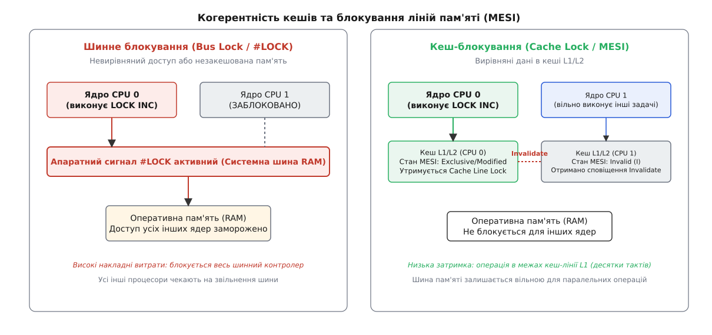
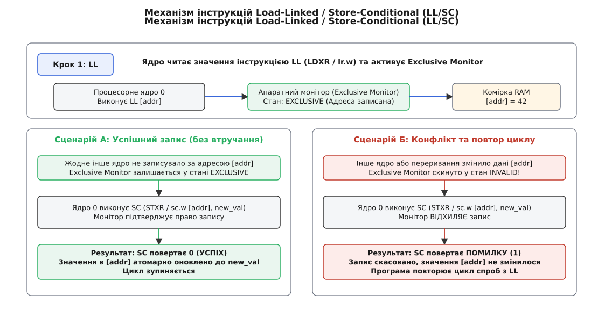

# Атомарні операції

<preknowlist>
- [Ядро й простір користувача](topic:sys-unix/kernel-and-userspace) — межа режимів виконання, простори адресації та контексти ядра.
- [Замки в ядрі й атомарний контекст](topic:sys-unix/kernel-locking) — чому атомарний контекст забороняє перепланування та засинання.
</preknowlist>

Коли два процесорні ядра в багатоядерній системі одночасно виконують `sysctl_net_packets++` над спільною змінною в оперативній пам'яті, звичайна C-операція модифікації розпадається на три окремі процесорні інструкції: зчитування значення з пам'яті в регістр CPU, збільшення значення в регістрі та запис результату назад у RAM. Якщо перший процесор прочитав значення 10, і в цей же момент другий процесор також прочитав 10, обидва ядра збільшать значення до 11 і послідовно запишуть 11 у пам'ять. Замість двох збільшень лічильник зросте лише на одиницю, а один запис буде мовчки втрачено через стан перегонів (Race Condition).

Для усунення цих дефектів без використання важких примітивів взаємного виключення ядро Linux надає спеціалізовані типи даних `atomic_t`, `atomic64_t` та набір функцій атомарних операцій. Вони спираються на апаратну підтримку процесора та гарантують, що зчитування, зміна та запис відбуваються як єдина нероздільна операція на рівні системних шин і кешів.

## Апаратна суть атомарності: MESI та блокування ліній пам'яті

На найнижчому системному рівні нероздільність модифікації пам'яті забезпечується спільною роботою контролера кешу процесора та протоколів когерентності кешів, таких як MESI (Modified, Exclusive, Shared, Invalid) або MOESI.

Коли процесорне ядро виконує атомарну операцію над адресою в пам'яті (на архітектурі x86/x86_64 це інструкції з апаратним префіксом `LOCK`, такі як `LOCK XADD`, `LOCK INC` або `LOCK CMPXCHG`), кеш-контролер застосовує один із двох апаратних механізмів:

1. **Кеш-блокування (Cache Line Locking):** Якщо цільова адреса пам'яті вже перебуває в кеші L1 або L2 даного ядра у стані `Exclusive` або `Modified`, процесор не звертається до зовнішньої системної шини. Замість цього ядро CPU захоплює внутрішній замок лінії кешу (Cache Line Lock). Протокол MESI гарантує, що жодне інше процесорне ядро не зможе прочитати чи змінити цю 64-байтову лінію кешу, поки поточна атомарна інструкція не завершить запис.
2. **Шинне блокування (Bus Locking):** Якщо адреса пам'яті незакешована або дані розташовані невирівняно і перетинають межу двох 64-байтових ліній кешу (Unaligned Split Lock), процесор змушений виставити апаратний низькорівневий сигнал на шині пам'яті (`#LOCK`). Сигнал шинного блокування фізично заморожує будь-який доступ до оперативної пам'яті (RAM) для всіх інших процесорних ядер та контролерів прямого доступу до пам'яті (DMA) на час виконання всієї інструкції.


*Принципова різниця між важким шинним блокуванням (Bus Lock) та швидким кеш-блокуванням (Cache Lock) за протоколом MESI.*

Використання кеш-блокування дозволяє виконувати атомарні операції за кілька десятків тактів CPU, якщо дані знаходяться у кеші L1. Однак невирівняний доступ до пам'яті руйнує цю оптимізацію і переходить до шинного блокування, що викликає тривалі простої всієї системи.

Мікроархітектурно на багатопроцесорних NUMA-серверах із декількома сокетами (наприклад, Intel Xeon або AMD EPYC) виконання невирівняного шинного блокування передається міжсокетними магістралями Ultra Path Interconnect (UPI) або Infinity Fabric. Сигнал блокування змушує всі сокети анулювати вхідні черги зчитування з пам'яті, що збільшує затримку атомарної операції з одиниць наносекунд (≈20 тактів на попаданні в L1) до 250–400 наносекунд.

Детальний процес еволюції апаратних інструкцій від префікса `LOCK` у перших процесорах Intel 8086 до сучасних протоколів когерентності описано в [Історія апаратної підтримки атомарності](topic:sf-tasks/atomic-ops/hist-atomic-instructions.md).

## Архітектурні розбіжності: x86 (LOCK) проти RISC (LL/SC)

Спосіб забезпечення атомарності на апаратному рівні фундаментально відрізняється залежно від архітектури процесора.

Архітектура x86-64 належить до моделі CISC і надає прямі атомарні інструкції з префіксом `LOCK`. Префікс `LOCK` може передувати інструкціям `ADD`, `ADC`, `AND`, `BTC`, `BTR`, `BTS`, `DEC`, `INC`, `NEG`, `NOT`, `OR`, `SBB`, `SUB`, `XOR`, `XADD` та `CMPXCHG`. При цьому інструкція обміну `XCHG` має вбудоване шинне або кеш-блокування за замовчуванням, навіть якщо префікс `LOCK` не вказано явно.

На противагу цьому, класичні архітектури RISC (ARM, MIPS, PowerPC, RISC-V) не мають у мікрокоді складних атомарних інструкцій Read-Modify-Write. Замість цього вони застосовують гнучкішу пару інструкцій: **Load-Linked (LL)** та **Store-Conditional (SC)**.

1. **Load-Linked (`LDXR` в ARM64, `LDREX` у 32-бітному ARM, `lr.w` у RISC-V):** Зчитує значення з пам'яті в регістр і одночасно активує апаратний монітор ексклюзивного доступу (Exclusive Monitor) для даного ядра та адреси.
2. **Store-Conditional (`STXR` в ARM64, `STREX` у 32-бітному ARM, `sc.w` у RISC-V):** Намагається записати нове значення за цією ж адресою. Запис відбудеться **лише за умови**, що Exclusive Monitor знаходиться у стані `EXCLUSIVE` — тобто жодне інше ядро процесора не редагувало цю комірку і в системі не відбулося переривання.

Якщо за час між `LL` та `SC` конфліктів не виникло, `SC` виконує запис і повідомляє про успіх; якщо зафіксовано втручання іншого ядра — скасовує запис і повідомляє про невдачу. Домовленість про код повернення залежить від архітектури: в ARM64 (`STXR`) і RISC-V (`sc.w`) регістр результату дістає 0 при успіху й ненульове значення при невдачі, тоді як у MIPS та Alpha — навпаки, успіх позначено одиницею. Програма перевіряє код повернення у циклі й повторює спробу.


*Робота апаратного монітора ексклюзивного доступу (Exclusive Monitor) при виконанні інструкцій LL/SC.*

Розглянемо, як функція `atomic_inc(&v)` транслюється на рівні дизасембльованого асемблерного коду для обох архітектур:

```
; Архітектура x86-64 (CISC) — єдина атомарна інструкція з кеш-блокуванням:
lock incl (%rdi)   ; Атомарно збільшує 32-бітне значення за адресою в RDI

; Архітектура ARM64 (RISC) — цикл LL/SC над монітором ексклюзивності:
1:  ldxr  w1, [x0]     ; LL: читаємо значення з адреси X0 в регістр W1, ставимо монітор
    add   w1, w1, #1   ; Модифікація: W1 = W1 + 1
    stxr  w2, w1, [x0] ; SC: пробуємо записати W1 за адресою X0, результат повертається у W2
    cbnz  w2, 1b       ; Якщо W2 != 0 (конфлікт/помилка), повертаємось на мітку 1b
```

У сучасних високопаралельних серверах на базі ARM64 (таких як Neoverse чи Graviton) з десятками ядер постійні повтори циклів LL/SC при високій конкуренції викликали простої. Тому починаючи з архітектури ARMv8.1 розробники додали атомарні розширення LSE (Large System Extensions), повернувши прямі інструкції `LDADD` та `CAS` на доповнення до LL/SC:

```
; Архітектура ARMv8.1 LSE — пряма атомарна інструкція додавання:
ldadd  w1, w2, [x0]   ; Атомарно додає W1 до адреси X0 та повертає старе значення у W2
```

## Абстракції ядра Linux: типи `atomic_t`, `atomic64_t` та `atomic_long_t`

Використання базового типу `int` у мові C є небезпечним для атомарного доступу, оскільки мова C дозволяє вільно застосовувати оператор присвоєння `=` або оператори `++` та `--` до звичайних змінних `int`, які компілятор перетворює на неатомарні послідовності інструкцій. Обгортання в структуру з єдиним полем `counter` є принциповим рішенням розробників ядра: вона викликає помилку компіляції при спробі написати `v = 5` або `v++`, змушуючи розробників явно використовувати тільки функції з ядерного API атомарних операцій. У вихідному коді ядра Linux атомарні цілі числа представлені окремими C-структурами-обгортками:

```c
// Визначення типів у заголовковому файлі include/linux/types.h
typedef struct {
    int counter;
} atomic_t;

#ifdef CONFIG_64BIT
typedef struct {
    s64 counter;
} atomic64_t;
#endif

// include/linux/atomic/atomic-long.h — не окрема структура, а псевдонім:
// #ifdef CONFIG_64BIT
typedef atomic64_t atomic_long_t;
// #else
// typedef atomic_t atomic_long_t;
```

Змінна `atomic_t` працює з 32-бітними цілими числами зі знаком. Змінна `atomic64_t` реалізує 64-бітну атомарну арифметику. Змінна `atomic_long_t` адаптується під розрядність системи: на 64-бітних архітектурах вона еквівалентна `atomic64_t`, на 32-бітних — `atomic_t`.

Суворою вимогою для всіх атомарних типів є правильне вирівнювання (Alignment) у пам'яті. Змінна `atomic_t` повинна зберігатися за адресою, кратною 4 байтам, а `atomic64_t` — кратною 8 байтам. Якщо розробник спробує створити упаковану структуру (`__attribute__((packed))`), де атомарна змінна виявиться невирівняною, на x86 це призведе до катастрофічного падіння швидкодії через шинні блокування, а на ARM64 — до апаратного виключення ядра (Alignment Fault Panic).

На 32-бітних архітектурах, де відсутні 64-бітні атомарні інструкції, ядро реалізує `atomic64_t` через емуляцію за допомогою масиву з 16 внутрішніх спінлоків (`CONFIG_GENERIC_ATOMIC64`, файл `lib/atomic64.c`). Адреса змінної зсувається на `L1_CACHE_SHIFT`, згортається кількома XOR-ами і за молодшими бітами обирає один із 16 замків — щоб дві сусідні змінні не билися за той самий спінлок. Емуляція лишається придатною і в контексті апаратного переривання: замок береться разом із `local_irq_save()`, тож перервати утримувача на тому самому ядрі неможливо. Ціна — не атомарність однієї інструкції, а звичайна критична секція з вимкненими перериваннями.

## Базовий та розширений інтерфейс API

Ядро Linux надає багатий набір уніфікованих функцій для роботи з атомарними змінними.

### Ініціалізація та чисті операції читання й запису

Функції `atomic_read()` та `atomic_set()` спираються на внутрішні макроси `READ_ONCE()` та `WRITE_ONCE()`. Вони гарантують, що компілятор C не буде оптимізувати виклики (наприклад, не буде кешувати значення `v` у регістрі CPU під час виконання циклу `while`) і згенерує інструкції читання та запису вирівняного машинного слова без проміжних станів:

```c
// Статична ініціалізація
atomic_t v = ATOMIC_INIT(0);

// Атомарне зчитування та запис
int val = atomic_read(&v);
atomic_set(&v, 42);
```

### Атомарні модифікації без повернення значення (Read-Modify-Write)

Операції без повернення значення діють за принципом «виконав і забув». Компілятор генерує найкоротший апаратний код (наприклад, `LOCK INC` на x86), оскільки процесору не потрібно повертати прапорці чи результат операції у регістри:

```c
atomic_inc(&v);        // v++ (атомарне збільшення на 1)
atomic_dec(&v);        // v-- (атомарне зменшення на 1)
atomic_add(10, &v);    // v += 10 (атомарне додавання)
atomic_sub(5, &v);     // v -= 5 (атомарне віднімання)
atomic_and(0xFF, &v);  // v &= 0xFF (побітове AND)
atomic_or(0x01, &v);   // v |= 0x01 (побітове OR)
atomic_xor(0x02, &v);  // v ^= 0x02 (побітове XOR)
```

### Модифікації з поверненням значення

На відміну від функцій без повернення, усі виклики `*_return` та `fetch_*` вимагають суворого впорядкування пам'яті і діють як повні бар'єри пам'яті (Full Memory Barriers), гарантуючи впорядкування операцій читання й запису до і після виклику:

```c
int new_val = atomic_inc_return(&v);   // Збільшує v на 1 і повертає НОВЕ значення
int new_val = atomic_add_return(5, &v); // Додає 5 і повертає НОВЕ значення
int old_val = atomic_fetch_add(5, &v);  // Додає 5 і повертає СТАРЕ значення
int old_val = atomic_xchg(&v, 100);     // Безумовно записує 100 і повертає СТАРЕ значення
```

### Перевірочні та умовні операції

Щоб звільнити ресурс, треба точно виявити останнього його володаря. Саме це робить `atomic_dec_and_test()`: якщо після зменшення лічильника значення стало рівним 0, поточний потік утримував останню претензію на об'єкт і може безпечно звільнити пам'ять. Одразу застереження, до якого стаття повертається нижче: для справжніх лічильників посилань цей ідіом у сучасному ядрі витіснив захищений `refcount_t`, а `atomic_dec_and_test()` лишається для лічильників, які лічать не посилання, — незавершені запити, активні буфери, невиконані завдання:

```c
if (atomic_dec_and_test(&v)) {
    // Зменшує v на 1 і повертає true, якщо новий результат став дорівнювати 0
    kfree(my_object);
}
```

### Порівняння з обміном: `atomic_cmpxchg` та `atomic_try_cmpxchg`

Функціональним фундаментом безблокувальних алгоритмів є операція Compare-And-Swap (CAS). Її механізм полягає у зіставленні очікуваного значення зі збереженим у пам'яті: якщо вони збігаються, здійснюється умовний запис нового значення, а якщо ні — запис скасовується і повертається дійсний стан:

```c
// Класичний CAS
int old_val = atomic_cmpxchg(&v, expected_old, new_val);

// Оптимізований CAS (доступний починаючи з ядра Linux 4.12)
bool success = atomic_try_cmpxchg(&v, &expected_old, new_val);
```

Функція `atomic_cmpxchg()` порівнює поточне значення `v` з `expected_old`. Якщо вони рівні, вона замінює значення `v` на `new_val` і повертає `expected_old`. Якщо значення відрізняються, зміна не відбувається, а функція повертає дійсне поточне значення `v`.

Новіший макрос `atomic_try_cmpxchg()` приймає `expected_old` по посиланню (вказівник). Якщо порівняння вдале, він повертає `true`. Якщо порівняння невдале, він повертає `false` і **автоматично оновлює** вміст змінної `expected_old` поточним значенням `v`.

На x86 макрос `atomic_try_cmpxchg()` генерує ефективніший код у циклах безблокувальних спроб:

```c
int old = atomic_read(&v);
do {
    new_val = calculate_next_state(old);
} while (!atomic_try_cmpxchg(&v, &old, new_val));
```

Цей цикл транслюється безпосередньо в інструкцію `CMPXCHG` та перевірку прапорця нуля `ZF` у регістрі прапорців CPU, позбавляючи компілятор потреби генерувати додаткову інструкцію порівняння після CAS.

Порівняймо згенерований асемблерний код двох варіантів у C-компіляторі GCC:

```
; Варіант із класичним atomic_cmpxchg (потребує додаткового порівняння в циклі):
1:  movl  %eax, %ecx       ; Копіюємо старе значення
    movl  %ebx, %edx       ; Новий розрахований стан
    lock cmpxchgl %edx, (%rsi) ; CAS: порівнюємо EAX із (%RSI)
    cmpl  %eax, %ecx       ; ДОДАТКОВА ІНСТРУКЦІЯ: перевіряємо чи EAX == ECX
    jne   1b               ; Якщо не рівні — переходимо на повтор

; Варіант із сучасним atomic_try_cmpxchg (пряме використання прапорців CPU):
1:  movl  %ebx, %edx       ; Новий розрахований стан
    lock cmpxchgl %edx, (%rsi) ; CAS: оновлює EAX та прапорець ZF
    jnz   1b               ; Безпосередній перехід за прапорцем ZF=0 (EFLAGS.ZF)
```

Завдяки усуненню інструкції `CMPL` та ліквідації повторного перезавантаження регістрів `atomic_try_cmpxchg` скорочує розмір гарячого циклу й підвищує пропускну здатність безблокувальних алгоритмів ядра.

Для 128-бітних подвійних атомарних операцій на 64-бітних архітектурах ядро надає виклики `cmpxchg128()` і `try_cmpxchg128()` (до ядра 6.7 — `cmpxchg_double()`), які на x86_64 транслюються в інструкцію `LOCK CMPXCHG16B`, а доступність перевіряється макросом `system_has_cmpxchg128()`. Вони дозволяють атомарно оновлювати вказівник разом із 64-бітним лічильником модифікацій (Generational Sequence Tag), що є класичним розв'язанням проблеми ABA для подвійно-зв'язаних безблокувальних списків.

Повний вичерпний перелік усіх функцій, таблиці сигнатур та суфікси впорядкування пам'яті наведено у [Довідник API атомарних операцій ядра](topic:sf-tasks/atomic-ops/api-kernel-atomic-ops.md).

## Атомарність у підсистемі eBPF (Extended Berkeley Packet Filter)

Сучасний мережевий стек та інструменти спостережуваності (Observability) ядра Linux інтенсивно використовують віртуальну машину eBPF. Програми eBPF завантажуються в ядро і виконуються у відповідь на події мережевих пакетів або трасування.

Для оновлення лічильників у таблицях пам'яті eBPF (eBPF Maps) набір інструкцій eBPF має власний клас атомарних операцій — модифікатор `BPF_ATOMIC` над інструкціями `BPF_STX`:

```c
// eBPF C-код для оновлення лічильника пакетів у мапі
SEC("xdp")
int xdp_packet_counter(struct xdp_md *ctx)
{
    u32 key = 0;
    u64 *count = bpf_map_lookup_elem(&pkt_count_map, &key);
    if (count) {
        // Компілятор породжує BPF-інструкцію BPF_ADD із модифікатором BPF_ATOMIC
        __sync_fetch_and_add(count, 1);
    }
    return XDP_PASS;
}
```

Верифікатор ядра (eBPF Verifier) суворо перевіряє, що атомарний виклик виконується над вирівняною адресою пам'яті у мапі, запобігаючи краху ядра від split locks. JIT-компілятор ядра транслює `BPF_ATOMIC` безпосередньо в апаратну інструкцію `LOCK XADD` на x86-64 або `LDADD` на ARM64 з розширенням LSE (а на давніших ARM64 без LSE — у короткий цикл `LDXR`/`STXR`): лічильник коштує саму атомарну модифікацію, без жодного виклику допоміжної функції — саме це й дозволяє XDP тримати десятки мільйонів пакетів на секунду на ядро.

## Співвідношення з атомарними типами C11 та C++11

У просторі користувача стандарти C11 (`<stdatomic.h>`) та C++11 (`<atomic>`) пропонують власні стандартизовані атомарні примітиви (`_Atomic(int)` та `std::atomic<int>`).

Варто розуміти, чому ядро Linux не використовує безпосередньо `_Atomic` з C11:
1. **Історична сумісність:** Ядро Linux розробило свій атомарний API за роки до появи стандарту C11, і мільйони рядків коду драйверів спираються на `atomic_t`.
2. **Точний контроль над згенерованим кодом:** порядки `memory_order_relaxed`, `_acquire` та `_release` у C11/C++11 теж є — річ не в їхній відсутності, а в тому, що стандарт лишає компіляторові свободу підставити суворіший (аж до `seq_cst`) варіант і має право «вигадувати» звернення до пам'яті. Модель пам'яті ядра (`Documentation/memory-barriers.txt`) додатково спирається на те, чого мовна модель не гарантує взагалі, — на впорядкування за **залежністю адреси**, тобто на той самий безкоштовний бар'єр, яким живе `rcu_dereference()`. Тому ядро тримає власні суфікси `_relaxed`/`_acquire`/`_release` та макроси `smp_mb()` на явному асемблері.

Проте на рівні ABI типи `atomic_t` у ядрі та `std::atomic<int>` у C++ на однаковій платформі збігаються за розміром і вирівнюванням і транслюються в ті самі процесорні інструкції `LOCK` або `LL/SC`.

## Взаємодія атомарних вказівників із підсистемою RCU

У підсистемах ядра Linux з високими вимогами до паралельного читання (наприклад, таблицях маршрутизації IP, таблицях dentry VFS чи мережевих фільтрах netfilter) атомарна заміна вказівників комбінується з механізмом **RCU (Read-Copy-Update)**.

Коли потік оновлює структуру даних у пам'яті, він створює нову копію об'єкта, заповнює поля і атомарно публікує вказівник через `rcu_assign_pointer()`:

```c
struct my_route_entry *new_route = kmalloc(sizeof(*new_route), GFP_KERNEL);
// Заповнення полів нової маршрутної структури
new_route->gateway = in_aton("192.168.1.1");

// Атомарна публікація вказівника з семантикою Release
rcu_assign_pointer(global_route_ptr, new_route);
```

Макрос `rcu_assign_pointer()` гарантує виконання атомарного запису вказівника з бар'єром пам'яті Release (`smp_store_release`). Читач же платить іще менше: `rcu_dereference()` — це звичайний `READ_ONCE(p)` без жодного бар'єра. Упорядкування тут тримає не інструкція, а **залежність за адресою**: щоб прочитати `new_route->gateway`, процесор мусить спершу мати сам вказівник, тож зчитати поля раніше за вказівник він фізично не може. Саме тому читальний бік RCU не коштує жодної додаткової інструкції понад сам `LDR`, тоді як `smp_load_acquire()` на ARM64 змусив би поставити `LDAR`.

Таке поєднання атомарних викликів із виключно читальним контекстом `rcu_read_lock()` дозволяє ядрам CPU зчитувати складні структури даних абсолютно без блокувань і без атомарних приростів лічильників посилань.

## Зв'язок із користувацькими м'ютексами: Системний виклик `futex`

Атомарні операції простору користувача є фундаментом високоефективної синхронізації POSIX-потоків (pthreads). У користувацькому просторі реалізація `pthread_mutex_lock()` не викликає ядро при відсутності змагання (Uncontended Case).

Замість цього програма виконує атомарний CAS (`__atomic_compare_exchange_n()` у GCC/Clang, `LOCK CMPXCHG` на x86-64) безпосередньо у просторі користувача. Якщо замок вільний (стан 0), потік атомарно змінює стан на 1 і продовжує виконання без жодного системного виклику, витрачаючи лише декілька наносекунд.

Лише у випадку, коли замок уже захоплений іншим потоком (стан 1 або 2), потік звертається до ядра через системний виклик **`futex()` (Fast Userspace Mutex)** з операцією `FUTEX_WAIT`. Ядро занурює потік у сон до появи сигналу `FUTEX_WAKE` від потоку, що звільняє замок. Таким чином, атомарні операції прибирають системний виклик із усього незмагального шляху — а в типовому навантаженні саме на нього припадає переважна більшість захоплень замка.

## Гарантії впорядкування пам'яті: Fully-Ordered, Acquire, Release та Relaxed

Виконання атомарних інструкцій у багатоядерному середовищі вимагає розуміння моделей впорядкування пам'яті (Memory Ordering Models). Сучасні CPU можуть змінювати порядок виконання інструкцій читання й запису, якщо між ними немає явних апаратних залежностей.

Ядро Linux надає чотири категорії атомарних операцій за семантикою впорядкування:

1. **Fully-Ordered (Повністю впорядковані операції):** Усі стандартні виклики атомарних функцій із поверненням значення (такі як `atomic_inc_return()` або `atomic_cmpxchg()`) діють як повні бар'єри пам'яті (`mb()`). Жодна операція читання чи запису до виклику не може бути переставлена після нього, і жодна операція після виклику не може виконатися раніше.
2. **Acquire Semantics (Суфікс `_acquire`):** Гарантує, що жодне наступне читання чи запис не буде переставлене раніше атомарної операції. Наприклад, `atomic_read_acquire()` застосовується при вході у критичну секцію або захопленні прапорця.
3. **Release Semantics (Суфікс `_release`):** Гарантує, що всі попередні записи й читання завершаться до виконання атомарної інструкції. Наприклад, `atomic_set_release()` використовується при публікації нових даних або виході з безблокувального алгоритму.
4. **Relaxed Semantics (Суфікс `_relaxed`):** Функції виду `atomic_inc_return_relaxed()` або `atomic_fetch_add_relaxed()` гарантують лише атомарність самої модифікації в пам'яті, але не надають жодних апаратних бар'єрів пам'яті. Це дозволяє процесору вільно переставляти суміжні звернення до пам'яті для досягнення максимальної швидкодії. Пари `atomic_read_relaxed()`/`atomic_set_relaxed()` в API немає й ніколи не було: `atomic_read()` та `atomic_set()` уже є relaxed-операціями за визначенням, суфікс дописувати нема до чого.

Проілюструємо передачу даних між двома процесорними ядрами за допомогою семантики Acquire-Release:

```c
// Ядро CPU 0 (Producer / Публікатор):
data_structure.payload = 100; // Крок 1: Запис даних у пам'ять
atomic_set_release(&ready_flag, 1); // Крок 2: Публікація прапорця з семантикою Release

// Ядро CPU 1 (Consumer / Споживач):
if (atomic_read_acquire(&ready_flag) == 1) { // Крок 3: Читання прапорця з Acquire
    use(data_structure.payload); // Крок 4: Гарантовано читає 100, а не сміття
}
```

Використання `atomic_set_release` на Ядрі 0 гарантує, що `payload = 100` стане видимим іншим ядрам до того, як `ready_flag` стане рівним 1. Використання `atomic_read_acquire` на Ядрі 1 блокує передчасне зчитування `payload` до підтвердження `ready_flag == 1`.

Якщо розробник помилково застосує варіанти `_relaxed` у цьому патерні, позачерговий конвеєр процесора ARM64 має право виконати читання `payload` на Ядрі 1 раніше, ніж оновлений `ready_flag` надійде до кешу, що спричинить прочитання застарілих даних.

## Порозрядні атомарні операції над бітовими масками

Окрім цілочисельної арифметики, ядро Linux надає атомарні операції для роботи з окремими бітами в бітових масках (Bitmaps). Код драйвера підключає їх через `<linux/bitops.h>`, який уже сам підтягує архітектурну реалізацію з `<asm/bitops.h>`.

Бітові операції приймають порядковий номер біта `nr` (який може перевищувати 32 або 64) та вказівник на масив `unsigned long`:

```c
unsigned long flags = 0;

set_bit(0, &flags);              // Атомарно встановлює біт 0 в 1
clear_bit(0, &flags);            // Атомарно скидає біт 0 в 0
change_bit(1, &flags);           // Атомарно інвертує біт 1

if (test_and_set_bit(2, &flags)) {
    // Встановлює біт 2 в 1 і повертає true, якщо біт ВЖЕ був встановлений раніше
}
```

Атомарні бітові операції широко використовуються в ядрі для керування прапорцями станів процесів (`struct task_struct.flags`), прапорцями сторінок пам'яті (`struct page.flags`) та розподілом ресурсів у бітмапах системних PID.

На архітектурі x86 операція `set_bit()` транслюється безпосередньо в інструкцію `LOCK BTS` (Bit Test and Set), яка атомарно копіює значення обраного біта у прапорець переносу `CF` і встановлює біт у 1.

Для випадків, коли бітова маска вже захищена зовнішнім спінлоком, ядро надає неатомарні аналоги з префіксом `__` (наприклад, `__set_bit()`), які виконуються значно швидше за рахунок відсутності інструкцій `LOCK`.

## Захищений лічильник посилань: `refcount_t`

У ранніх версіях ядра Linux керування лічильниками посилань об'єктів виконувалося через звичайний тип `atomic_t`. Однак це створювало важку вразливість безпеки: переповнення цілого числа (Integer Overflow).

Якщо зловмисник міг ініціювати мільярди викликів створення посилань на об'єкт, значення 32-бітного `atomic_t` збільшувалося до `INT_MAX` (2 147 483 647), після чого переповнювалося, ставало від'ємним і зрештою поверталося до 0. Коли лічильник досягав 0, ядро вважало, що об'єкт більше не має власників, і викликало `kfree()`. Однак у програмі залишалися дійсні вказівники на цей об'єкт, що призводило до атаки типу Use-After-Free (UAF) та виконання довільного коду в контексті ядра (як у відомій вразливості CVE-2016-0728).

Для повного усунення цього класу вразливостей у ядрі Linux було запроваджено спеціалізований тип `refcount_t` (`#include <linux/refcount.h>`):

```c
#include <linux/refcount.h>

struct kernel_device_data {
    refcount_t refcount;
    char buffer[128];
};

struct kernel_device_data *device_alloc(void)
{
    struct kernel_device_data *dev = kmalloc(sizeof(*dev), GFP_KERNEL);
    if (!dev)
        return NULL;

    // Ініціалізація початкового значення refcount = 1
    refcount_set(&dev->refcount, 1);
    return dev;
}

void device_get(struct kernel_device_data *dev)
{
    // Безпечне збільшення лічильника посилань
    refcount_inc(&dev->refcount);
}

void device_put(struct kernel_device_data *dev)
{
    // Зменшує і перевіряє на 0
    if (refcount_dec_and_test(&dev->refcount)) {
        kfree(dev);
    }
}
```

Тип `refcount_t` реалізовано як обгортку над `atomic_t`, але з додаванням захисних апаратних перевірок:

1. **Захист від переповнення (Overflow Saturation):** щойно приріст виводить лічильник за `REFCOUNT_MAX` (це `INT_MAX`, 2 147 483 647), спрацьовує `refcount_warn_saturate()`: він примусово записує в лічильник константу `REFCOUNT_SATURATED` (`INT_MIN / 2`) і друкує `WARN_ONCE` у `dmesg`. Зі значення `INT_MIN / 2` жоден наступний інкремент чи декремент уже не виведе лічильник ні на 0, ні за `INT_MAX` — об'єкт більше ніколи не буде звільнений, і Use-After-Free не станеться. Витік пам'яті тут — свідомо обрана менша біда.
2. **Захист від Use-After-Free (Zero Protection):** спроба виконати `refcount_inc()` над лічильником, який уже досяг 0, означає воскресіння звільненого об'єкта. Той самий `refcount_warn_saturate()` заганяє лічильник у `REFCOUNT_SATURATED` і пише в журнал `refcount_t: addition on 0; use-after-free`.
3. **Безпечне відновлення (`refcount_inc_not_zero`):** Дозволяє атомарно збільшити лічильник посилань лише за умови, що об'єкт ще не почав процес деалокації (`refcount != 0`).

Розглянемо реальні приклади підсистем ядра, де застосовується `refcount_t`:
- **Мережевий стек (`struct sock`):** Виклики `sock_hold()` та `sock_put()` безпечно збільшують і зменшують лічильник `sk_refcnt` сокета.
- **Підсистема процесів (`struct task_struct`):** Поле `usage` керує життєвим циклом дескриптора процесу.
- **Файлові дескриптори (`struct file`):** тут ядро пішло ще далі — з версії 6.13 замість `atomic_long_t f_count` стоїть окремий тип `file_ref_t f_ref` із власними `file_ref_get()`/`file_ref_put()`. Ідея та сама, що в `refcount_t` (насичення замість переповнення), але лічильник зміщено так, щоб гаряча дорога `fget()`/`fput()` обходилася одним `LOCK XADD` без перевірки на нуль.

У сучасному коді ядра Linux розробникам категорично заборонено використовувати звичайний `atomic_t` для керування життєвим циклом об'єктів — усі лічильники посилань зобов'язані застосовувати `refcount_t`.

> 🔧 **Навіщо це.** Без захищеного `refcount_t` переповнення лічильника посилань дозволяє зловмиснику штучно обнулити лічильник утримуваного об'єкта ядра, змушивши ядро деалокувати пам'ять під час роботи іншого потоку і захопити контроль над викликами через фальшиву таблицю вказівників.

## Вибір примітиву синхронізації: Дерево рішень

Атомарні операції є найшвидшими, але не єдиними інструментами синхронізації у ядрі. Інженер повинен обирати примітив залежно від характеру даних та контексту виконання:

| Механізм | Складність операції | Дозволено в апаратному ISR | Дозволяє засинання (Sleep) | Основне призначення |
| :--- | :--- | :--- | :--- | :--- |
| `atomic_t` / `refcount_t` | Поодиноке ціле число | Так | Ні | Лічильники, прапорці, refcounts |
| `percpu_counter` | Масив лічильників per-CPU | Так | Ні | Високочастотна глобальна статистика |
| `spinlock_t` | Мала критична секція | Так | Ні | Захист складних структур у контексті переривань |
| `mutex` / `rw_semaphore` | Довгі критичні секції | Ні | Так | Захист структури даних при роботі з диском/пам'яттю |
| `RCU` (Read-Copy-Update) | Паралельне читання | Так | Ні (в спин-блоках) | Масове читання з рідкісним оновленням дерев/списків |

## Продуктивність, міжкешеві зсуви та підводні камені

Попри виняткову швидкість атомарних операцій порівняно з м'ютексами, неналежне використання `atomic_t` може серйозно уповільнити систему.

### Проблема міжкешевого змагання (Cache Line Bouncing)

Коли 64 процесорних ядра в серверній системі одночасно виконують `atomic_inc()` над одним і тим же глобальним лічильником пакетів, лінія кешу, в якій розташована ця змінна, постійно переходить у стан `Invalid` на всіх ядрах і циркулює між кешами L1/L2 через системну шину.

Витрати часу на пересилання лінії кешу між ядрами (Cache Line Bouncing) можуть сягати 100–200 тактів на кожну операцію, створюючи важке заторне явище в шині когерентності.

Для лічильників високої частоти (наприклад, статистики мережевих інтерфейсів) замість одного `atomic_t` застосовують змінні **per-CPU** (`percpu_counter` або `this_cpu_inc`). Кожне процесорне ядро модифікує свою власну локальну змінну без будь-яких блокувань і атомарних інструкцій, а загальна сума обчислюється лише під час запиту користувача.

### Пастка невирівняного доступу (Split Lock Penalty) та середовища віртуалізації

Якщо атомарна змінна розташована в пам'яті таким чином, що її 4 або 8 байтів перетинають межу двох 64-байтових ліній кешу, процесор не може застосувати кеш-блокування. Система переходить до важкого шинного блокування (Bus Lock), виставляючи сигнал `#LOCK` на фізичній шині оперативної пам'яті.

Шинне блокування зупиняє виконання інструкцій на всіх процесорних ядрах системи. У сучасних ядрах Linux включено механізм моніторингу split locks: режим задається завантажувальним параметром `split_lock_detect=off|warn|fatal|ratelimit:N`, і в режимі `fatal` ядро надсилає порушникові `SIGBUS`, а в `warn` — лише пише зауваження в журнал. Окремого sysfs-файла зі станом цього режиму немає — ядро повідомляє про нього рядком у `dmesg` під час завантаження:

```bash
# Який режим виявлення split lock обрало ядро
dmesg | grep -i "split lock"
# → x86/split lock detection: #AC: crashing the kernel on kernel split_locks
#   and warning on user-space split_locks

# Чим параметр було задано під час завантаження
grep -o 'split_lock_detect=[^ ]*' /proc/cmdline
```

Для систем віртуалізації (KVM / QEMU) split lock у гостьовій операційній системі (Guest OS) провокує важкі VM-Exit переходи в гіпервізор (Host OS). Гіпервізор змушений пом'якшувати затримки через sysctl-налаштування `kernel.split_lock_mitigate = 1`, сповільнюючи гостьовий процес для захисту сусідніх віртуальних машин від заморожування шини RAM.

Професійна діагностика змагань за атомарні лінії кешу у реальному часі виконується за допомогою підсистеми `perf c2c` (Cache-to-Cache Analyzer):

```bash
# Запис подій змагання за кеш-лінії
perf stat -e L1-dcache-loads,L1-dcache-load-misses ./my_atomic_workload
perf c2c record -F 60000 -- exec_my_kernel_workload

# Побудова звіту гарячих атомарних ліній пам'яті
perf c2c report --stdio
```

Використання інструменту `perf c2c` дозволяє точково локалізувати структури даних, у яких атомарні змінні розташовані занадто близько до суміжних полів даних, і додати специфікатор `____cacheline_aligned` для ізоляції їх у власній лінії кешу L1.

## Інспектування асемблерних інструкцій `LOCK` через `gdb` та `objdump`

Під час налагодження модулів ядра розробники перевіряють трансльовані атомарні інструкції за допомогою утиліт `objdump` та відлагоджувача `gdb`:

```bash
# Дисасемблювання об'єктного файла модуля ядра для пошуку LOCK-інструкцій
objdump -d -M intel my_kernel_module.o | grep -A 5 "lock"
```

Команда `objdump` підтверджує наявність префікса `lock` перед інструкціями `inc`, `dec` або `cmpxchg`, дозволяючи переконатися, що компілятор C не оптимізував атомарний виклик у звичайну неатомарну модифікацію пам'яті.

## Діагностика помилок `refcount_t` та трасування `kprobes`

Для системних інженерів, які аналізують аварійні зупинки ядра (Kernel Crash Dumps), ядро Linux пропонує вбудовані підсистеми трасування викликів `refcount_t`.

При виникненні спроби переповнення або приросту нульового лічильника спрацьовує сторожова функція ядра `refcount_warn_saturate()`. Для перехоплення цих подій у реальному часі застосовується динамічна підсистема `kprobes` через інструмент `bpftrace`:

```bash
# Трасування спроб порушення цілісності refcount_t у ядрі через eBPF
bpftrace -e 'kprobe:refcount_warn_saturate { printf("Refcount saturation: %s\n", kstack); }'
```

Цей eBPF-скрипт динамічно підключається до викликів перевірок `refcount_t` без перезавантаження ядра і миттєво друкує стеки викликів процесів, що намагаються порушити правила безпечної деалокації пам'яті. Завдяки цьому діагностичному інструментарію розробники драйверів отримують точний графік викликів деалокації та усувають витоки пам'яті на ранніх стадіях тестування високопродуктивних мережевих систем у середовищах Linux.

Підсумовуючи, атомарні операції є базовим будівельним блоком системного програмування Linux. Вони забезпечують узгодженість багатопотокового виконання без використання важких блокувань.

Практичний приклад створення високонавантаженої черги без використання блокувань розглянуто в [Практична реалізація безблокувального кільцевого буфера](topic:sf-tasks/atomic-ops/proj-lockfree-ringbuffer.md).
