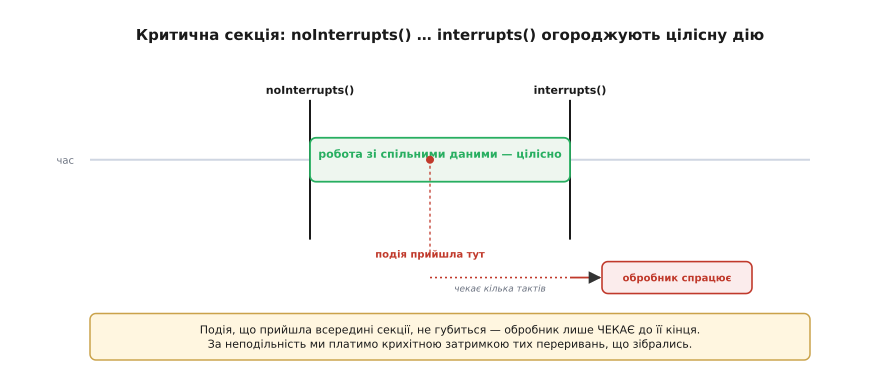
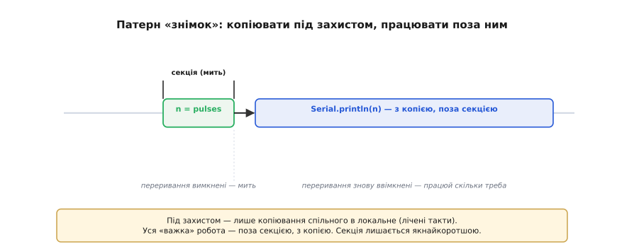
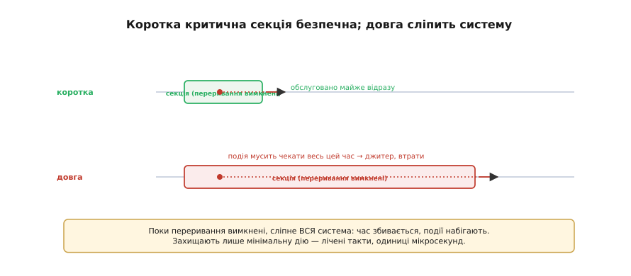
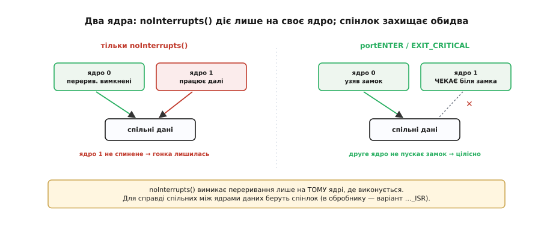

# Атомарність і гонки даних (критичні секції)

Ключове слово [`volatile`](root:sf-lang/volatile) дає спільним даним **свіжість** — але не **неподільність**. І це лишає тоншу половину проблеми спільних даних відкритою: що буде, коли переривання втрутиться **посеред** багатокрокової дії зі спільними даними? Ця тема — про **гонки даних** (коли результат залежить від випадкового збігу в часі), про поняття **атомарності** (неподільності дії) і про **критичну секцію** — інструмент, що робить дію цілісною. Це найважливіша цеглина в умінні безпечно обмінюватися даними з обробником.

### Гонка даних: коли результат залежить від «хто коли встиг»

Розгляньмо невинну на вигляд дію — збільшити лічильник: `count++`. Здавалося б, одна операція. Та насправді процесор виконує її в **три** кроки: прочитати поточне значення, додати одиницю, записати назад. А тепер уявімо, що `count++` роблять **і** основний код, **і** обробник. Якщо переривання застане основний код між «прочитати» і «записати», станеться халепа.


*`count` дорівнює 5. `loop()` прочитав 5 — і тут його перебив обробник: прочитав 5, додав, записав 6. Коли `loop()` продовжив, він записав своє «5 + 1 = 6», спираючись на застаріле значення. Було два `+1`, а `count` став лише 6 замість 7 — одне оновлення зникло.*

Це і є **гонка даних** (race condition): результат залежить не від логіки, а від того, **хто коли встиг** — від випадкового збігу моментів. Найгидкіше, що проявляється вона **зрідка** й непередбачувано: лічильник «недобирає» одиницю раз на тисячу подій, програма поводиться майже завжди правильно — а потім раптом ні. Такі баги мучать місяцями, бо їх майже неможливо відтворити навмисно. І `volatile` тут не порятунок: він зробив кожен крок свіжим, але не зробив **усі три** кроки неподільними.

Інкремент — лише найпростіший приклад. Та сама пастка чигає в схемі «**перевірити, тоді діяти**»: код читає спільну змінну, ухвалює за нею рішення — а обробник між перевіркою й дією встигає її змінити, і рішення стає хибним. Скажімо, `loop()` бачить, що в буфері є дані, та поки збирається їх узяти, обробник буфер уже спорожнив. Цей різновид гонки навіть має назву — «**час перевірки проти часу дії**» (TOCTOU). Спільне в усіх цих бідах одне: між кількома кроками над спільними даними не має втручатися ніхто чужий.

Зрима аналогія — двоє редагують одну табличку. Перший прочитав «5», задумався вписати «6»; тим часом другий теж прочитав «5» і вписав «6». Перший, не помітивши, теж вписує своє «6». Двоє щось зробили — а в клітинці лише одна зміна: друга «затерла» першу. Точнісінько так переривання й основний код «затирають» одне одного, коли діють над спільним числом без черги.

> 📜 **Коли гонка вбивала.** Це не лише абстракція про «затерте число». У 1980-х гонка даних у керуванні апаратом променевої терапії **Therac-25** призвела до смертельних передозувань. Сувора, але важлива історія — у вставці [Therac-25](root:sf-tasks/atomicity-races/hist-therac25.md).

### Що таке атомарність

Корінь біди — у **неатомарності**. Дію називають **атомарною** (від грецького *ἄτομος*, *átomos* — «неподільний», те саме слово, що дало назву атому), якщо її не можна застати на півдорозі: вона виконується вся повністю або не починається зовсім, і перерватися «всередині» їй ніде. Багатокрокова ж дія — як наш `count++` із трьох кроків, як читання 64-бітного числа двома половинами чи як оновлення кількох полів структури — **подільна**, і переривання може розрізати її посередині.


*`count++` — це три кроки (прочитати → додати → записати), і між ними може втрутитися обробник: звідси гонка. Натомість одне читання чи запис вирівняного слова неподільне — перервати його «всередині» ніде. Захищати треба саме багатокрокові дії.*

Тут діє точне уточнення: неподільне саме собою те, що вкладається в **машинне слово** ядра, — на 32-бітному ядрі (ESP32, Cortex-M у STM32) читання чи запис одного вирівняного 32-бітного значення атомарні, а на 8-бітному AVR навіть `uint16_t` береться двома командами. Тому простий прапорець чи лічильник, який обробник лише **пише**, а `loop()` лише **читає**, гонки не утворює — там досить [`volatile`](root:sf-lang/volatile). Гонка виникає, щойно з'являється **багатокрокова** дія над спільними даними: `count++` з обох боків, читання значення ширшого за слово, узгоджене оновлення кількох змінних. Саме ці випадки й треба захищати.

Варто наголосити, що гонки даних — не примха ESP32 чи мікроконтролерів узагалі. Це **фундаментальна** проблема будь-якої системи, де кілька «виконавців» ділять спільну пам'ять: обробник і основний код, два потоки на настільному комп'ютері, два ядра, два процеси. Слово «атомарність» і прийшло саме звідти — з теорії паралельних обчислень. Тож, опанувавши гонки на простому прикладі лічильника, ви здобуваєте знання, що стане в пригоді далеко за межами Arduino — скрізь, де щось діється водночас.

### Критична секція: на мить вимкнути переривання

Як зробити багатокрокову дію неподільною? Найпростіший і найнадійніший спосіб — на час цієї дії **заборонити перериванням втручатися**. Ділянку коду, на якій переривання тимчасово вимкнені, називають **критичною секцією**. У будь-якому мікроконтролері за це відповідає біт глобального дозволу переривань, тож секцію огороджують парою «заборонити — дозволити»: у Arduino це `noInterrupts()` / `interrupts()`, на Cortex-M (STM32) — `__disable_irq()` / `__enable_irq()`, у ESP-IDF — `portENTER_CRITICAL(&mux)` / `portEXIT_CRITICAL(&mux)`. Усе, що між ними, виконується **цілісно** — обробник не може врізатися посередині.


*Між `noInterrupts()` і `interrupts()` переривання вимкнені, тож робота зі спільними даними виконується цілісно, без втручань. Подія, що прийшла всередині секції, не губиться — обробник просто чекає кілька тактів, поки секція скінчиться, і спрацьовує одразу по тому.*

Важливо зрозуміти: критична секція нічого не «викидає». Переривання, що надійшло, поки переривання вимкнені, не зникає — воно лише **притримується** й спрацьовує, щойно ми ввімкнемо переривання назад. Тобто ми платимо за неподільність крихітною затримкою тих переривань, що зібралися під час секції, — і ця плата прийнятна, якщо секція коротка.

> 🔧 **Навіщо це.** Тримайте в голові розподіл ролей: **[`volatile`](root:sf-lang/volatile) — щоб бачити свіже, критична секція — щоб дія була цілісною**. Прапорець, що його лише ставить ISR, потребує тільки `volatile`. А щойно ви робите над спільними даними щось багатокрокове — інкремент з обох боків, читання-обнулення лічильника, копіювання структури — додавайте критичну секцію. Це найнадійніший спосіб прибрати гонку даних, і саме його ви бачитимете в бібліотеках.

Технічно є й тонший спосіб, ніж глушити **всі** переривання, — заборонити лише те **одне** джерело, що чіпає спільні дані. Та на практиці глобальні `noInterrupts()`/`interrupts()` майже завжди зручніші: вони прості, гарантовано покривають усі джерела, а на короткій секції їхня «грубість» не шкодить. Точкове маскування одного джерела беруть хіба що в дуже чутливих до затримок місцях, де глушити геть усе неприйнятно навіть на кілька тактів. Для перших кроків глобальної пари цілком досить.

### Патерн «знімок»: копіювати під захистом, працювати поза ним

З критичною секцією є спокуса огорнути нею забагато — і тим самим надовго заглушити переривання. Правильний прийом інший: під захистом зробити **мінімум** — швидко «сфотографувати» спільні дані в локальну змінну, — а одразу по тому ввімкнути переривання й працювати вже з **копією**, скільки треба. Цей прийом звуть **знімком** (snapshot).


*У критичній секції — лише копіювання спільної змінної в локальну (мить); уся «важка» робота (друк, обчислення) діється вже поза секцією, з копією, коли переривання знову ввімкнені. Так критична секція лишається якнайкоротшою, а обробка — необмеженою в часі.*

Саме цей патерн стоїть за класичним лічильником імпульсів, де [обробник](root:hw-arch/isr) лише нарощує `pulses`: `noInterrupts(); n = pulses; pulses = 0; interrupts();` — а вже вивід (`Serial.println(n)`, `ESP_LOGI`, `printf`) роблять **після**, з локальним `n`. Усередині секції — два присвоєння, лічені такти; назовні — повільний друк, що нікому не заважає. Знімок — це золоте правило роботи зі спільними даними: захищай **копіювання**, а не обробку.

А коли критична секція взагалі **не** потрібна? Якщо спільні дані вкладаються в **одне** вирівняне слово і ви лише читаєте їх (а пише — лише обробник), то одне читання атомарне саме собою, і `volatile` достатньо — секцію можна не ставити. Тобто критична секція потрібна не «завжди про всяк випадок зі спільними даними», а саме для **багатокрокових** дій: інкремент з обох боків, читання ширшого за слово, узгоджене оновлення кількох змінних. Простий «обробник пише — `loop()` читає одне слово» обходиться без неї.

### Критичну секцію тримати короткою

Тут діє рівно те саме правило, що й для [обробника](root:hw-arch/isr): критична секція має бути **якнайкоротшою**. Адже поки переривання вимкнені, **сліпне вся система** — жодне переривання не обслуговується, точний час збивається, події накопичуються. По суті критична секція на ті такти, що вона триває, перетворює ваш код на «суперобробник», який не можна перебити, — з усіма наслідками довгого ISR.


*Угорі коротка секція: подія, що прийшла, обслуговується майже відразу. Унизу довга: переривання вимкнені надовго, і подія мусить чекати весь цей час, набігає джитер, можливі втрати. Захищають лише мінімальну дію — не більше.*

Звідси практичні висновки. Ніколи не кладіть у критичну секцію нічого повільного — ні затримки (`delay`, `HAL_Delay`, `vTaskDelay`), ні виводу в консоль (`Serial.println`, `ESP_LOGI`, `printf`), ні обчислень: тільки коротке копіювання чи інкремент. Чим менше тактів переривання вимкнені, тим менше страждає чуйність решти системи. Критична секція — потужний, але «важкий» інструмент: користуйтеся ним точково й коротко.

Наскільки коротко? Орієнтир той самий, що для обробника: лічені такти, одиниці мікросекунд. Скопіювати слово, інкрементувати, переставити пару значень — гаразд; цикл, виклик бібліотеки, очікування — зась. Якщо помічаєте, що під захистом опинилося щось довше за кілька простих присвоєнь, майже напевно це можна винести назовні через «знімок».

### Два ядра ESP32: коли потрібен спінлок

І остання, специфічна для ESP32 тонкість. У ESP32 **два** ядра, а `noInterrupts()` вимикає переривання лише на **тому** ядрі, де виконується. Якщо спільні дані ділять код і обробник на **одному** ядрі (звичайний випадок Arduino: `loop()` і ISR на тому самому ядрі), `noInterrupts()` цілком достатньо. Та якщо дані справді спільні між **різними** ядрами, друге ядро тим часом не спить — і гонка лишається.


*Ліворуч `noInterrupts()` вимкнув переривання на ядрі 0, але ядро 1 працює собі далі — і теж лізе у спільні дані, тож гонка не зникла. Праворуч пара `portENTER_CRITICAL(&mux)` / `portEXIT_CRITICAL(&mux)` бере спінлок, що не пускає й друге ядро, поки триває секція (в обробнику — варіант `…_ISR`).*

Для справжньої багатоядерної безпеки в ESP32 беруть **спінлок** — `portMUX_TYPE` разом із `portENTER_CRITICAL`/`portEXIT_CRITICAL` (а в обробнику — їхні `_ISR`-варіанти). Спінлок не лише вимикає переривання на поточному ядрі, а й змушує інше ядро **зачекати** біля захищеної ділянки. Звучить складно, та для перших кроків запам'ятайте просте: для звичайного «один `loop()` плюс обробник на тому ж ядрі» досить `noInterrupts()`; спінлок дістають, лише коли свідомо ділять дані між ядрами. Глибше багатоядерність розкривається там, де працюють кілька [задач під операційною системою](root:sf-devices/freertos).

> ⚙️ **Три інструменти за ціною.** Вимкнути переривання — лише один спосіб; між [задачами](root:sf-tasks/task-ipc) беруть **м'ютекс**, між ядрами — спінлок. У кожного своя ціна (затримка, блокування, заборона з ISR). Хто за що відповідає — у вставці [Критичні секції на практиці](root:sf-tasks/atomicity-races/proj-critical-sections.md).

**Безпечне читання спільного лічильника.**

:::tabs
```arduino
volatile uint32_t pulses = 0;          // volatile — свіжість значення

void IRAM_ATTR onPulse() { pulses++; } // обробник лише рахує

void loop() {
  noInterrupts();                      // ← критична секція: цілісно
  uint32_t n = pulses;                 //   «знімок» спільних даних
  pulses = 0;
  interrupts();                        // ← переривання знову ввімкнені
  // ... далі працюємо з локальним n, поза секцією ...
  Serial.println(n);                   // повільний друк — НЕ в секції
}
```
```esp-idf
#include "driver/gpio.h"
#include "esp_log.h"
#include "freertos/FreeRTOS.h"
#include "freertos/task.h"

static portMUX_TYPE mux = portMUX_INITIALIZER_UNLOCKED;
static volatile uint32_t pulses = 0;   // volatile — свіжість значення

static void IRAM_ATTR on_pulse(void *arg) {   // обробник лише рахує
    portENTER_CRITICAL_ISR(&mux);
    pulses++;
    portEXIT_CRITICAL_ISR(&mux);
}

void pulse_task(void *arg) {
    while (1) {
        portENTER_CRITICAL(&mux);      // ← критична секція: цілісно (й проти 2-го ядра)
        uint32_t n = pulses;           //   «знімок» спільних даних
        pulses = 0;
        portEXIT_CRITICAL(&mux);       // ← переривання знову ввімкнені
        // ... далі працюємо з локальним n, поза секцією ...
        ESP_LOGI("pulse", "%u", (unsigned) n);   // повільний лог — НЕ в секції
        vTaskDelay(pdMS_TO_TICKS(1000));
    }
}
```
```stm32
volatile uint32_t pulses = 0;          // volatile — свіжість значення

void HAL_GPIO_EXTI_Callback(uint16_t pin) {   // обробник лише рахує
  if (pin == GPIO_PIN_0) pulses++;
}

void read_pulses(void) {
  __disable_irq();                     // ← критична секція: цілісно
  uint32_t n = pulses;                 //   «знімок» спільних даних
  pulses = 0;
  __enable_irq();                      // ← переривання знову ввімкнені
  // ... далі працюємо з локальним n, поза секцією ...
  printf("%lu\r\n", (unsigned long) n);  // повільний вивід — НЕ в секції
}
```
:::

Цей крихітний фрагмент поєднує все: [`volatile`](root:sf-lang/volatile) дає свіжість, критична секція робить пару «зчитати-обнулити» неподільною, а патерн «знімок» виносить повільний друк назовні. Так гонка даних усунена, а система лишається чуйною.

> 🔧 **Навіщо це.** Практичне рішення в один рядок думки: пишеш звичайну однопотокову програму (один головний цикл плюс обробники на тому самому ядрі) — досить глобальної заборони переривань (`noInterrupts()` у Arduino, `__disable_irq()` на Cortex-M). Свідомо ділиш дані між задачами на різних ядрах — береш `portMUX`-спінлок. Не вгадуй наперед: почни з простого `noInterrupts()`, а спінлок додавай, лише коли реально розносиш роботу по ядрах.

І найголовніша осторога наостанок: критичну секцію **обов'язково треба закрити**. Викликали `noInterrupts()` — мусите згодом викликати `interrupts()`, інакше переривання лишаться вимкненими **назавжди**, і система просто «оглухне», зависнувши без видимої причини. Особливо легко забути про це, коли в секції є кілька шляхів виходу (`return` чи помилка посередині). Тому секцію роблять короткою й прямою, без розгалужень, щоб `interrupts()` гарантовано виконався. Незакрита критична секція — підступний спосіб «повісити» цілий пристрій.

Як же запідозрити гонку на практиці? Прикмети характерні: баг рідкісний і «плаває», зникає під налагоджувачем (бо той міняє таймінг), а в коді є спільна змінна, яку чіпають і обробник, і `loop()`. Побачили такий набір — перевіряйте дві речі поспіль: чи стоїть [`volatile`](root:sf-lang/volatile) і чи захищена багатокрокова дія критичною секцією. Майже всі «привиди» переривань ховаються саме тут.

Отже, гонка даних виникає, коли переривання розрізає **багатокрокову** дію зі спільними даними, і результат стає залежним від випадкового збігу в часі. Лікують її **критичною секцією** — `noInterrupts()`/`interrupts()`, що на мить роблять дію неподільною; тримають її **якнайкоротшою** (патерн «знімок»), бо на цей час сліпне вся система; а на двох ядрах ESP32 для справді спільних даних беруть **спінлок**. Разом із [`volatile`](root:sf-lang/volatile) це повний набір для безпечного обміну з обробником. А коли цей обмін уже налагоджено, лишається стратегічне питання — **коли взагалі обирати переривання, а коли [опитування](root:embedded/polling-vs-interrupts)**.
