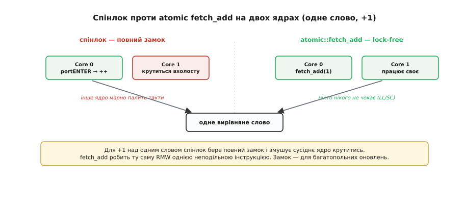
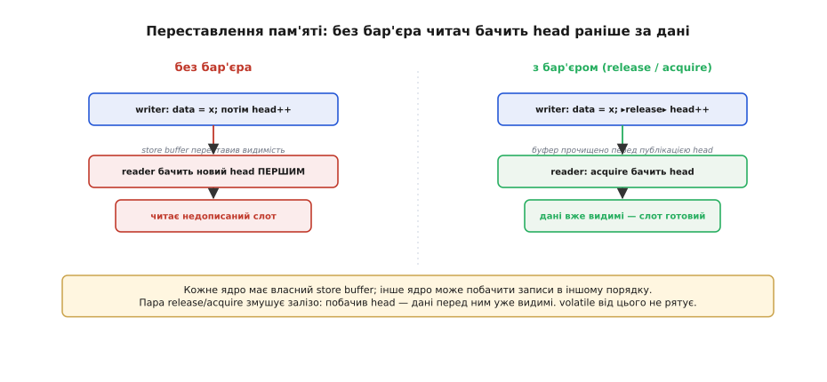

# ⚙️ Атомарні типи й бар'єри пам'яті: спільні дані на двох ядрах

Коли спільні дані — це одне слово на двох ядрах, повний замок-спінлок надмірний; є дешевший шлях — **атомарний тип**. А ще тут чигає рідкісний звір, від якого не рятує ні `volatile`, ні навіть правильний порядок коду, — **переставлення пам'яті** між ядрами.

## Задача

ESP32 має два Xtensa-ядра, які справді працюють одночасно. Уявіть типовий розподіл: core 0 займається мережею й збором даних (FreeRTOS-задача або фонова прошивка Wi-Fi), core 1 крутить `loop()` і відображає стан. Між ними — один лічильник `uint32_t events` або «свіжий» вимір, що core 0 записує, а core 1 читає.

Тут виникають два болючі питання. Перше: core 0 хоче зробити `events++`. На одному ядрі глушіння переривань захистило б доступ, але воно ж само не зупинить core 1 — той продовжує бігти незалежно. Спінлок (`portENTER_CRITICAL`) працює, але це повний замок для всієї системи заради одного інкременту; чи є щось дешевше? Друге питання тонше. Уявіть кільцевий буфер «один пише — один читає»: writer спочатку записує дані у слот, а потім зрушує індекс `head` — кладе [перемикач останнім](topic:sf-data/write-integrity), щоб читач, побачивши новий `head`, мав уже готові дані. На одному ядрі порядок інструкцій у коді і є порядком виконання. Але коли writer — core 0, а reader — core 1, чи ГАРАНТОВАНО core 1 побачить нові дані РАНІШЕ, ніж новий `head`? Чи можна це порушити? Саме тут заховане переставлення пам'яті. Про ціну замків і взаємодію між ядрами — детально у вставці [Критичні секції](topic:sf-tasks/atomicity-races/proj-critical-sections.md); тут наш фокус — інструмент для **одного слова** між **двома ядрами**.

## Ідея: атомарний тип — неподільність без замка

**Атомарний тип** (*atomic type*, `std::atomic<T>` у C++; у C — `_Atomic` або `atomic_uint32_t`) — це не просто «позначений» примітив. Компілятор і залізо разом гарантують: читання, запис і операції **read-modify-write** (RMW: `fetch_add`, `fetch_sub`, `compare_exchange`) над таким словом виконуються як **одна неподільна операція**, яку не розріже ні переривання, ні інше ядро. Це не контракт між програмістами — це апаратна обіцянка.

Відмінність від спінлока принципова. Критична секція або спінлок роблять неподільним **будь-який блок коду** заради будь-якої кількості об'єктів, але платять за це повним замком. Атомік же робить неподільною **одну операцію над одним словом** — і для цього на Xtensa та RISC-V ESP32 є апаратні інструкції: **LL/SC** (load-linked / store-conditional) або **CAS** (compare-and-swap). Якщо між `load-linked` і `store-conditional` хтось інший змінив значення, `SC` просто не спрацьовує, і процесор повторює цикл усередині — без участі ядра-суперника, без очікування, без системного замка. Це і є **lock-free**: жодне ядро не блокується в очікуванні іншого.

Чому це краще за спінлок саме тут? Вставка [Критичні секції](topic:sf-tasks/atomicity-races/proj-critical-sections.md) пояснює: спінлок на час очікування **крутить** інше ядро вхолосту, витрачаючи тактові цикли й нагріваючи кеш. Атомарний `fetch_add` не змушує нікого чекати — він або одразу вдається, або апаратно повторюється всередині однієї інструкції. Але є чесна межа: атомік рятує лише для **одного вирівняного слова** чи невеликого набору стандартних атомарних операцій. Як тільки треба узгоджено оновити **два пов'язані поля** разом — це вже багатокрокова дія, і знову потрібен замок або критична секція. Не намагайтеся зробити структуру атомарною набором `atomic`-полів — це не те саме.


*Для `+1` над одним словом спінлок бере повний замок і змушує Core 1 крутитися вхолосту, поки Core 0 виконує інкремент під `portENTER/EXIT_CRITICAL`. `atomic::fetch_add` робить ту саму RMW однією неподільною апаратною інструкцією — lock-free, без очікування. Замок залишається виправданим для багатопольних оновлень; атомік — для одного слова.*

## Робочий код: атомарний лічильник між ядрами

**`std::atomic<uint32_t>` — інкремент і читання між двома ядрами**

:::tabs
```cpp
#include <atomic>

// Оголошення: глобальний, видний обом ядрам
std::atomic<uint32_t> events{0};

// Core 0 — збір/мережа: інкремент (relaxed — потрібна лише атомарність, не порядок)
void onDataReady() {
    events.fetch_add(1, std::memory_order_relaxed); // неподільна RMW без замка
}

// Core 1 — loop(): читання свіжого значення
void loop() {
    uint32_t n = events.load(std::memory_order_relaxed); // атомарне читання
    display(n);

    // Для порівняння — те саме спінлоком (надмірно для одного слова):
    // portENTER_CRITICAL(&mux); n = events++; portEXIT_CRITICAL(&mux);
}
```
```rust
use core::sync::atomic::{AtomicU32, Ordering};

// Оголошення: глобальний, видний обом ядрам
static EVENTS: AtomicU32 = AtomicU32::new(0);

// Core 0 — збір/мережа: інкремент (Relaxed — потрібна лише атомарність, не порядок)
fn on_data_ready() {
    EVENTS.fetch_add(1, Ordering::Relaxed); // неподільна RMW без замка
}

// Core 1 — loop(): читання свіжого значення
fn loop_iter() {
    let n = EVENTS.load(Ordering::Relaxed); // атомарне читання
    display(n);

    // Для порівняння — те саме спінлоком (надмірно для одного слова):
    // let _g = MUX.lock(); n = EVENTS.load(Ordering::Relaxed) + 1;
}
```
:::

Атомік замінив цілий спінлок одним словом. Немає нічого, що можна «забути закрити»: на відміну від критичної секції, де незакритий замок зависає назавжди, атомарна операція або вдалась, або ні — і в обох випадках система продовжує роботу. Тут ми використовуємо `relaxed`-order: лічильнику потрібна лише неподільність самої операції, без будь-яких гарантій порядку відносно інших записів у пам'яті. Коли ж порядок між ядрами важливий — потрібен бар'єр.

## Ідея 2: бар'єр пам'яті — коли навіть правильний порядок коду бреше

Згадане кільце «один пише — один читає» тримається на чіткому контракті: writer спочатку записує дані у слот, і лише потім зрушує `head`. Читач перевіряє `head` — і якщо він просунувся, дані вже точно готові. Це і є [перемикач останнім](topic:sf-data/write-integrity): порядок коду нібито гарантує порядок видимості.

На одному ядрі так і є. Але між двома ядрами цей контракт може тихо зламатися без жодної помилки в коді. Причина — **буфер запису** (*store buffer*): кожне ядро має власний буфер, через який записи йдуть у кеш/пам'ять асинхронно. З точки зору самого ядра порядок правильний — воно виконало `data[i] = x`, потім `head++`. Але **інше** ядро може побачити ці зміни в іншому порядку: `head` потрапив у спільну пам'ять швидше за `data[i]`, бо так вийшло у store buffer. Читач перевірив `head` — він уже новий; читач звертається до `data[i]` — а там ще стара або взагалі непроініціалізована величина. Класичний збій від переставлення пам'яті (*memory reordering*), і відтворити його на конкретній платі буде важко — він проявляється рідко та нестабільно.

Тут [`volatile`](topic:sf-lang/volatile) безсилий. Так, він змушує компілятор читати й писати пам'ять щоразу, не тримаючи значення в регістрі. Але `volatile` ані не забороняє компілятору переставляти ці звернення між собою, ані не синхронізує store buffer між ядрами. «Перечитуй з пам'яті» — не те ж саме, що «у такому порядку й для іншого ядра». `volatile` — про свіжість; **бар'єр пам'яті** — про порядок.

**Бар'єр пам'яті** (*memory barrier* або *fence*) — інструкція-роздільник для store buffer: «всі записи, зроблені до мене, стають видимими іншим ядрам перш, ніж будь-який запис після мене». Ми ставимо `head` лише після бар'єра — і залізо змушене «прочистити» буфер, перш ніж просунути `head`. C++ не вимагає писати `fence` явно: потрібний ефект вбудований у параметр `memory_order` атомарного типу. **`memory_order_release`** на боці writer-а означає: «всі записи до цього рядка видимі тому, хто прочитає з `acquire`». **`memory_order_acquire`** на боці reader-а означає: «побачив нове значення — усе, що writer написав перед своїм `release`, вже видиме мені». Пара `release`+`acquire` і є тим замком порядку без блокування: побачив новий `head` (acquire) — значить, дані, записані перед його публікацією (release), вже видимі. Можна й грубіший молоток: `__sync_synchronize()` або `std::atomic_thread_fence(std::memory_order_seq_cst)` — повний двосторонній бар'єр. Це той самий принцип [«перемикач останнім»](topic:sf-data/write-integrity), тільки тепер ми мусимо **захищати** цей порядок бар'єром, бо залізо двох ядер само по собі цю обіцянку не тримає.


*Між двома ядрами store buffer може переставити видимість: Core 1 побачить новий `head` раніше за дані й прочитає недописаний слот. Бар'єр (release при публікації `head` + acquire при читанні) гарантує: побачив `head` — дані перед ним вже видимі. Той самий [«перемикач останнім»](topic:sf-data/write-integrity), тепер захищений апаратно. [`volatile`](topic:sf-lang/volatile) від цього не рятує.*

## Складність і пастки на МК

- **Один на одному ядрі — бар'єр не потрібен.** ISR↔main на одному ядрі: порядку інструкцій досить. Бар'єр і `memory_order` — це ціна саме різних ядер. Не ускладнюйте одноядерний код без причини.
- **Атомік — для одного слова.** Узгоджене оновлення двох і більше пов'язаних полів атоміком не зробити — це знову багатокрокова дія, і потрібен замок. Не намагайтеся «зробити структуру атомарною» набором `atomic`-полів.
- **`memory_order` за замовчуванням дорогий.** Без аргументу `std::atomic` застосовує `seq_cst` — найсуворіший і найповільніший бар'єр. Для лічильника — `relaxed`; для публікації даних — пара `release`/`acquire`. Не лишайте дефолт у гарячому коді, але й не «оптимізуйте» `relaxed` там, де порядок критичний.
- **`volatile` — не заміна.** Найчастіша помилка: вважати, що [`volatile`](topic:sf-lang/volatile) дає атомарність або бар'єр. Він забезпечує лише свіжість. Для двох ядер — атомік або явний бар'єр.
- **Розрив (tearing) нікуди не зник.** Атомарна гарантія діє на вирівняне слово машинної ширини; невирівняне або ширше за слово значення може все одно рватися. Тримайте атомарні дані вирівняними й не ширшими за машинне слово.
- **Спінлок усе ще потрібен — інколи.** Атомік не витісняє замок: коли операція багатокрокова або зачіпає кілька об'єктів — повертайтеся до `portENTER_CRITICAL`. Детально про ціну та вибір інструмента — у вставці [Критичні секції](topic:sf-tasks/atomicity-races/proj-critical-sections.md).

## Підсумок

Для одного слова між двома ядрами атомарний тип робить операцію неподільною без замка — lock-free, завдяки апаратним LL/SC-інструкціям. Правильний `memory_order` вбудовує в публікацію **бар'єр**, що змушує залізо поважати наш порядок «дані → head». Атомік+бар'єр доповнюють спінлок: замок — для багатопольних оновлень, атомік+бар'єр — для одного слова. Глибшу синхронізацію ядер — черги між задачами, повідомлення, семафори — дає вже RTOS.
