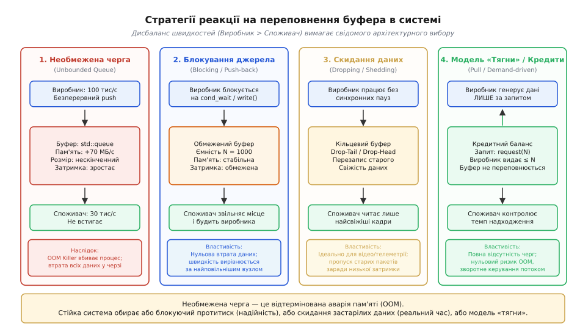
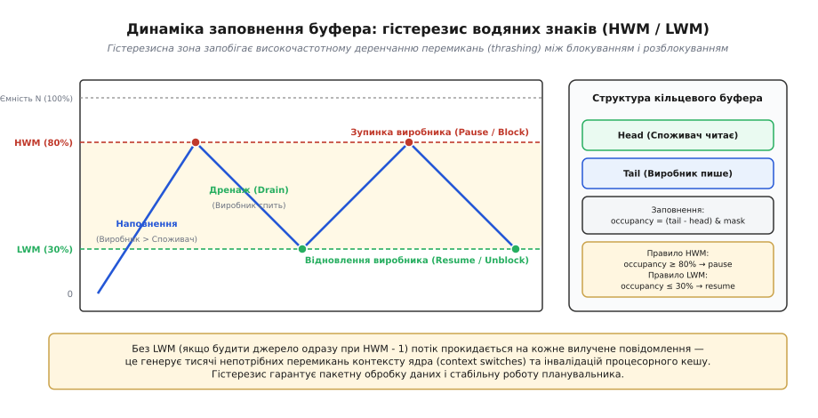
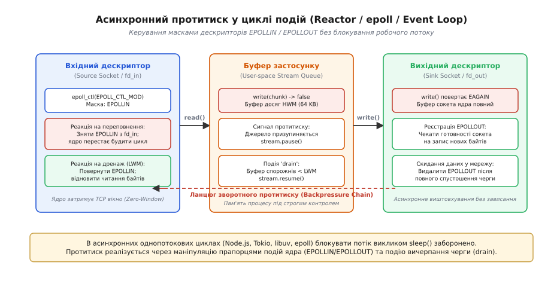
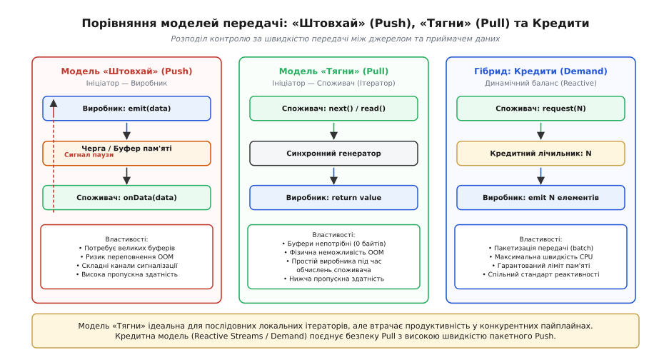

# Протитиск у локальних системах (Backpressure)

<preknowlist>
- [Виробник–споживач](topic:sf-tasks/producer-consumer) — базова схема передачі даних між двома компонентами через буфер.
- [Блокуючий і неблокуючий ввід-вивід](topic:sf-tasks/blocking-vs-nonblocking-io) — поведінка системних викликів під час заповнення дескрипторів та повернення `EAGAIN`.
- [Цикл подій](topic:sf-tasks/event-loop) — асинхронна диспетчеризація операцій у просторі користувача.
- [Перегони даних і замки](topic:sf-tasks/data-races-locks) — синхронізація доступу до спільних структур за допомогою м'ютексів та умовних змінних.
</preknowlist>

Коли високошвидкісна мережева карта або сенсор захоплює 100 000 пакетів за секунду (100 МБ/с), а локальний робочий потік на сусідньому ядрі процесора встигає розпарсити та зберегти на диск лише 30 000 пакетів за секунду (30 МБ/с), між компонентами виникає нездоланний дефіцит пропускної здатності. Якщо проміжна черга між потоками є необмеженою (`std::queue` або динамічний зв'язний список), обсяг зайнятої пам'яті зростає на 70 МБ щосекунди. Менш ніж за дві хвилини черга поглинає 8.4 ГБ оперативної пам'яті, системний демон `oom-killer` аварійно вбиває весь процес, а накопичені дані безповоротно втрачаються.

Ця аварія демонструє фізичний закон будь-яких обчислювальних систем: оперативна пам'ять завжди є скінченною. Буфер призначений виключно для згладжування короткочасних пікових сплесків навантаження (bursts), але він не здатен компенсувати систематичну різницю швидкостей. Якщо вхідний потік стабільно перевищує можливості обробника, єдиним способом порятунку системи від колапсу є передача керівного сигналу в напрямку, протилежному до руху даних, з вимогою до джерела сповільнити або призупинити генерацію.

Такий фундаментальний механізм регулювання темпу отримав назву **протитиск** (від англійського *backpressure* — «зворотний тиск», де *back* — «назад», а *pressure* — «тиск», з латинського *pressura* — «тиснення, натиск»).

### Анатомія протитиску: чотири фундаментальні стратегії

Коли проміжний буфер заповнюється до критичної позначки, система змушена зробити вибір між чотирма несумісними архітектурними стратегіями поведінки.


*Чотири стратегії реакції на переповнення буфера: необмежена черга веде до аварійного вичерпання пам'яті OOM, блокування джерела зберігає всі дані ціною сповільнення конвеєра, скидання відкидає пакети заради свіжості, а модель «тягни» запобігає перевантаженню за рахунок ініціативи споживача.*

Кожна зі стратегій вирішує конфлікт між надійністю, затримкою та простотою реалізації:

1. **Необмежене накопичення (Unbounded Queue):** Відсутність будь-якого регулювання. Виробник додає елементи в нескінченний список. Це призводить не лише до гарантованого OOM, а й до катастрофічного роздуття буфера (*bufferbloat*): час очікування пакета в черзі зростає з мікросекунд до десятків секунд. Дані застарівають ще до початку обробки.
2. **Блокування джерела (Blocking / Push-back):** Виробник примусово зупиняється на умовній змінній ядра (`pthread_cond_wait`), блокуючому системному виклику `write()` або семафорі, доки споживач не звільнить місце. Гарантує нульову втрату даних, однак швидкість усього конвеєра вирівнюється за найповільнішим вузлом.
3. **Скидання та витіснення даних (Dropping / Shedding):** Якщо виробник не може або не повинен зупинятися (наприклад, апаратний АЦП або потік аудіо/відео з камери), система жертвує повнотою даних заради збереження контролю над пам'яттю та затримкою:
   - *Drop-Tail (відкидання нових):* при заповненні буфера всі нові вхідні пакети негайно відхиляються.
   - *Drop-Head (витіснення застарілих):* новий пакет записується в кільцевий буфер, перезаписуючи найстаріший елемент, до якого споживач ще не дійшов. Це зберігає мінімальну затримку для телеметрії та робототехніки.
   - *Злиття станів (Conflation / Coalescing):* проміжні оновлення для одного ключа об'єднуються (наприклад, збереження лише останнього котирування акції або останньої координати курсора миші).
4. **Модель «Тягни» та кредити (Pull / Demand-driven):** Принцип інверсії керування: виробник взагалі не має права генерувати дані, доки споживач явно не запросить порцію елементів через запит або ліміт кредитів (`request(N)`).

Історичний розвиток цих ідей — від відцентрових регуляторів Джеймса Ватта та гідравлічних переливних клапанів до перших системних пайпів у дослідницькій Unix Кена Томпсона — викладено у вставці про [історію виникнення зворотного зв'язку та протитиску від парових регуляторів до Unix-пайпів](topic:sf-tasks/backpressure-local/hist-backpressure-origins.md).

### Локальні механізми синхронізації: від м'ютексів до гістерезису водяних знаків

У багатопотокових програмах зі спільною пам'яттю найпростішою реалізацією обмеженої черги є кільцевий масив, захищений м'ютексом та двома умовними змінними: `not_empty` (черга містить дані для споживача) та `not_full` (у черзі є вільне місце для виробника).

Однак наївна перевірка єдиного порогу (наприклад, зупинка при `count == Capacity` і пробудження при `count == Capacity - 1`) породжує явище **деренчання перемикань** (*thrashing / high-frequency oscillation*). Тільки-но черга заповнюється, виробник блокується. Споживач вилучає рівно один елемент і негайно сповіщає виробника через `signal()`. Планувальник ОС здійснює перемикання контексту ядра (context switch), виробник прокидається, записує один елемент, знову впирається в ліміт і знову блокується.

Якщо система опрацьовує 50 000 операцій за секунду, наївний поріг змушує ядра CPU виконувати до 15 000 перемикань контексту щосекунди. Кожне перемикання скидає конвеєр інструкцій процесора, вимагає оновлення таблиць сторінок TLB та призводить до вимивання L1/L2 кешу даних (cache bouncing).

#### Стабілізація потоку через водяні знаки (High / Low Watermark)

Для розриву паразитарного циклу застосовують концепцію двох **водяних знаків** (від англійського *watermark* — «позначка рівня води»), які утворюють зону **гістерезису** (від грецького *hysteresis* — «запізнення, відставання»):
- **Верхній водяний знак (High Watermark, HWM):** критичний рівень заповнення буфера (зазвичай 75–85% від повної ємності). При досягненні HWM джерело переводиться в стан паузи.
- **Нижній водяний знак (Low Watermark, LWM):** рівень глибокого дренажу (зазвичай 20–35% від повної ємності). Поки черга не опуститься нижче LWM, сигнал на розблокування виробника не надсилається.


*Динаміка заповнення буфера з гістерезисом водяних знаків: виробник зупиняється на позначці HWM (80%) і спить увесь час, поки споживач дренує чергу до LWM (30%), що усуває деренчання та забезпечує пакетну обробку даних.*

Гістерезис перетворює роботу системи з хаотичних мікроперемикань на циклічну пакетну обробку:
1. Виробник безперервно пише дані великою порцією від `LWM` до `HWM`, повністю утилізуючи кеш процесора.
2. Досягнувши `HWM`, виробник засинає на системній умовній змінній.
3. Споживач спокійно вичитує великий пакет даних від `HWM` до `LWM`, не витрачаючи час на блокування виробника та захоплення спільних замків на кожному кроці.
4. Тільки при перетині `LWM` споживач надсилає системний сигнал пробудження.

Математичне виведення частоти перемикань, закону Літтла для черг пам'яті та розрахунок стабільності гістерезису детально розібрано у вставці про [математичний апарат динаміки черг та гістерезису](topic:sf-tasks/backpressure-local/math-queue-latency-dynamics.md). Повний потокобезпечний код реалізації кільцевого буфера мовами C та C++ наведено у вставці [реалізація кільцевого буфера з протитиском та гістерезисом](topic:sf-tasks/backpressure-local/proj-ring-buffer-backpressure.md).

### Протитиск на межі ядра та процесів: пайпи, сокети та дескриптори POSIX

Коли обмін даними відбувається не між потоками одного процесу, а між незалежними процесами операційної системи, організацію протитиску бере на себе безпосередньо ядро ОС.

Головним примітивом виступають анонімні пайпи (`pipe(2)`), іменовані канали FIFO (`mkfifo(3)`), локальні сокети домену Unix (`AF_UNIX`) та локальні мережеві сокети loopback (`AF_INET`, `127.0.0.1`).

```
[Процес A: Генератор] ──write()──> [Буфер ядра (SO_SNDBUF: 64 КБ)] ──read()──> [Процес B: Обробник]
          │                                  │
          └── TASK_INTERRUPTIBLE / EAGAIN ───┘ (протитиск ядра при заповненні)
```

Ядро Linux виділяє під кожен пайп кільцевий буфер розміром у 16 сторінок пам'яті (за замовчуванням **64 КБ**). Робота механізму ядра залежить від режиму дескриптора:

1. **Блокуючий режим (Blocking I/O, за замовчуванням):**
   - Якщо процес-виробник викликає `write(fd, buffer, 131072)` (128 КБ), а буфер пайпа заповнений, ядро переводить процес зі стану `TASK_RUNNING` у стан очікування `TASK_INTERRUPTIBLE` і вилучає його з черги планувальника CPU.
   - Процес не споживає жодного такту процесора.
   - Як тільки процес-споживач зчитує хоча б одну сторінку байтів через `read(fd, ...)`, переривання ядра генерує подію пробудження, і виробник дописує залишок даних.
2. **Неблокуючий режим (Non-blocking I/O, прапорець `O_NONBLOCK`):**
   - Якщо буфер ядра переповнений, системний виклик `write()` не зупиняє потік, а негайно повертає значення `-1`, встановлюючи змінну помилки `errno` у значення `EAGAIN` або `EWOULDBLOCK`.
   - Це слугує для процесу прямим системним сигналом протитиску: буфер заповнений, запис неможливий, необхідно призупинити надсилання даних.

Конфігурацію розмірів буферів пайпів через `fcntl(fd, F_SETPIPE_SZ)`, інспекцію черг сокетів через `ioctl(SIOCOUTQ)` та маніпуляцію опціями `SO_SNDBUF`/`SO_RCVBUF` систематизовано в [довіднику системних інтерфейсів та контрактів протитиску](topic:sf-tasks/backpressure-local/api-local-backpressure.md).

:::tabs
```c
#include <unistd.h>
#include <fcntl.h>
#include <errno.h>
#include <stdio.h>

/* Обробка неблокуючого протитиску на рівні дескриптора POSIX */
ssize_t safe_write_with_backpressure(int fd, const void *buf, size_t count) {
    size_t written = 0;
    const char *ptr = (const char *)buf;

    while (written < count) {
        ssize_t res = write(fd, ptr + written, count - written);
        if (res > 0) {
            written += res;
            continue;
        }
        if (res == -1) {
            if (errno == EINTR) continue; /* Сигнал ОС: повторити спробу */
            if (errno == EAGAIN || errno == EWOULDBLOCK) {
                /* Спрацював протитиск: буфер ядра повний.
                   Повертаємо кількість реально записаних байтів */
                return (written > 0) ? (ssize_t)written : -EAGAIN;
            }
            return -errno; /* Фатальна помилка дескриптора */
        }
    }
    return (ssize_t)written;
}
```
```cpp
#include <unistd.h>
#include <fcntl.h>
#include <cerrno>
#include <span>
#include <expected>
#include <system_error>

enum class IoStatus {
    Backpressure, // Буфер ядра повний (EAGAIN/EWOULDBLOCK)
    BrokenPipe,   // Канал закрито на стороні читача (EPIPE)
    SysError      // Інша помилка ОС
};

// Ідіоматична обробка неблокуючого протитиску засобами сучасного C++
std::expected<size_t, IoStatus> safe_write_with_backpressure(int fd, std::span<const std::byte> data) {
    size_t written = 0;

    while (written < data.size()) {
        ssize_t res = ::write(fd, data.data() + written, data.size() - written);
        if (res > 0) {
            written += static_cast<size_t>(res);
            continue;
        }
        if (res == -1) {
            if (errno == EINTR) continue;
            if (errno == EAGAIN || errno == EWOULDBLOCK) {
                if (written > 0) return written;
                return std::unexpected(IoStatus::Backpressure);
            }
            if (errno == EPIPE) {
                return std::unexpected(IoStatus::BrokenPipe);
            }
            return std::unexpected(IoStatus::SysError);
        }
    }
    return written;
}
```
:::

### Асинхронний протитиск у циклі подій (Event Loop & Reactor)

В однопотокових асинхронних архітектурах (Node.js, Tokio у Rust, Netty в Java, `libuv`, Nginx на базі `epoll`/`kqueue`) блокування системного потоку категорично заборонене. Якщо потік викликає блокуючий `sleep()` або чекає на м'ютексі, він паралізує цикл подій, зупиняючи обробку десятків тисяч паралельних клієнтських з'єднань.

Протитиск у циклі подій реалізується за допомогою **динамічного керування масками інтересів дескрипторів ядра**.


*Асинхронний протитиск у циклі подій: при переповненні проміжної черги цикл подій знімає прапорець EPOLLIN зі вхідного сокета (зупиняючи читання), а при отриманні EAGAIN на виході реєструє EPOLLOUT і чекає сигналу дренажу від ядра.*

Ланцюг асинхронного протитиску працює за трьома правилами:

1. **Вхідний потік (Source Socket):** Цикл подій слухає вхідний дескриптор із прапорцем `EPOLLIN`. Коли байти надходять, вони записуються у проміжний буфер застосунку.
2. **Сигнал переповнення черги:** Якщо проміжний буфер досягає позначки `HWM`, застосунок викликає `epoll_ctl(epfd, EPOLL_CTL_MOD, fd_in, &ev)` і **видаляє прапорець `EPOLLIN`**. Ядро Linux бачить, що процес більше не зацікавлений у читанні байтів із сокета:
   - Ядро перестає будити цикл подій.
   - Буфер прийому сокета ядра (`SO_RCVBUF`) швидко заповнюється.
   - Протокол TCP автоматично надсилає відправнику пакет із нульовим розміром вікна прийому (**TCP Zero-Window Announcement**).
   - Віддалений клієнт або сусідній процес фізично призупиняє відправку даних на рівні власного стека ОС.
3. **Дренаж та відновлення (Drain Event):** Споживач відправляє накопичені байти у вихідний дескриптор (`fd_out`). Якщо `write()` повертає `EAGAIN`, дескриптор реєструється на подію готовності до запису `EPOLLOUT`. Коли ядро звільняє місце в буфері сокета, генерується подія `EPOLLOUT`, черга застосунку вичитується нижче порогу `LWM`, після чого:
   - Прапорець `EPOLLOUT` знімається з дескриптора виходу.
   - Прапорець `EPOLLIN` повертається на дескриптор джерела, відновлюючи надходження нових пакетів.

Цей елегантний неблокувальний контур гарантує, що пам'ять застосунку не розростається понад ліміт `HWM`, а потік циклу подій продовжує без затримок обслуговувати інші клієнтські сесії.

### Дві парадигми передачі даних: «Штовхай» (Push) проти «Тягни» (Pull)

Усі програмні архітектури передачі даних поділяються на дві фундаментальні моделі за тим, **хто володіє ініціативою передачі**.


*Порівняння моделей потоку даних: у моделі Push виробник домінує і вимагає складних сигналів зупинки, у моделі Pull споживач контролює темп ціною можливого простою виробника, а кредитна модель Reactive Streams досягає максимальної швидкості пакетної обробки без ризику переповнення буфера.*

#### 1. Модель «Штовхай» (Push Model)
Ініціатором виступає виробник: він викликає функцію зворотного виклику (`callback`), надсилає подію `emit(data)` або записує повідомлення в поштову скриньку актора.
- *Перевага:* Максимальна пропускна здатність, оскільки дані передаються без попереднього узгодження, а виробник не витрачає час на очікування дозволу.
- *Недолік:* Вимагає складних буферів, умовних змінних та систем сигналізації зворотного тиску для захисту від переповнення пам'яті.

#### 2. Модель «Тягни» (Pull Model / Demand-driven)
Ініціатором виступає споживач: він викликає методи `next()`, `read()` або отримує значення з генератора чи корутини.
- *Перевага:* Фізична неможливість переповнення черги або аварії пам'яті OOM, оскільки новий елемент створюється виключно тоді, коли споживач готовий його прийняти. Проміжні буфери взагалі не потрібні (обсяг пам'яті дорівнює 0 байтів).
- *Недолік:* Виробник повністю простоює, доки споживач виконує довге обчислення над попереднім елементом. Це унеможливлює паралельне використання кількох ядер процесора в конвеєрі обробки.

#### 3. Гібридна кредитна модель (Credit-based / Reactive Streams)
Сучасний інженерний компроміс: споживач видає виробнику квоту (кредит) на відправку фіксованої кількості елементів: `request(N)`.
- Виробник генерує рівно `N` елементів на максимальній швидкості (пакетний Push) і автоматично зупиняється.
- Споживач опрацьовує отриману порцію і надсилає нову порцію кредитів.
- Це поєднує 100% захист пам'яті моделі Pull із максимальною швидкістю паралельної роботи моделі Push.

### Системна ціна та крайові випадки протитиску

Впровадження протитиску не є безкоштовним: воно вимагає ретельного інженерного аналізу компромісів між затримкою, пропускною здатністю та складністю архітектури.

#### 1. Розрахунок оптимальної ємності буфера
Розмір буфера між потоками розраховується на основі локального добутку затримки на пропускну здатність:

```
Buffer_Capacity = \mu · RTT_{local}
```

де `\mu` — пікова пропускна здатність споживача, а `RTT_{local}` — час затримки реакції (пробудження потоку планувальником ядра, зазвичай 10–50 мікросекунд).
- Якщо зробити буфер занадто малим (`Capacity < BDP`), споживач спорожнить чергу раніше, ніж виробник встигне прокинутися після паузи, що призведе до просідання утилізації процесорних ядер.
- Якщо зробити буфер занадто великим (`Capacity >> BDP`), виникає ефект роздуття буфера (bufferbloat), і затримка обробки критично зростає.

#### 2. Каскадне блокування та блокування голови черги (Head-of-Line Blocking)
Якщо один виробник роздає дані кільком споживачам (патерн Fan-Out / Publish-Subscribe), виникає небезпека **каскадного гальмування**:
- Якщо один зі споживачів сповільнюється (наприклад, виконує важкий запис у базу даних або зависає на блокуючому замку), його черга переповнюється.
- Якщо система застосовує блокуючий протитиск до спільного виробника, виробник зупиняється.
- У результаті всі інші швидкі споживачі конвеєра припиняють отримувати дані й починають простоювати через одного повільного сусіда.

*Розв'язання:* ізоляція черг для кожного споживача окремо, використання неблокуючих кільцевих буферів із політикою скидання застарілих даних (`DropOldest`) або відключення повільних клієнтів за тайм-аутом (Slow Consumer Ejection).

#### 3. Взаємне блокування у циклічних конвеєрах (Deadlock)
Якщо у складному графі обробки даних (DAG) виникає циклічна залежність (вузол A надсилає запити вузлу B, а вузол B надсилає проміжні результати вузлу A через блокуючі обмежені канали), переповнення обох черг одночасно призводить до класичного взаємного блокування (**дедлоку**). Обидва потоки переходять у стан нескінченного очікування звільнення буферів.

*Розв'язання:* проєктування ациклічних потоків даних, виділення окремих пріоритетних каналів для керуючих повідомлень або використання неблокуючих операцій запису з перенаправленням відхилених пакетів у резервне тимчасове сховище на диску.

#### 4. Беззамкові кільцеві буфери (Lock-Free Ring Buffers та LMAX Disruptor)
Коли затримка м'ютексів та перемикань контексту стає неприйнятною (наприклад, у торговельних системах ультранизької затримки HFT або мережевих драйверах DPDK), замість замків застосовують беззамкові структури на базі атомарних операцій процесора (`std::atomic`).

В архітектурі **Disruptor** виробник і споживач спілкуються через монотонно зростаючі 64-бітні послідовності (*sequences*). Протитиск реалізується без умовних змінних:
- Виробник перед записом перевіряє умову: `producer_seq - consumer_seq < Capacity`.
- Якщо буфер переповнений, виробник виконує спін-очікування (`_mm_pause()` на x86) або викликає кооперативне перемикання `std::this_thread::yield()`.
- Це виключає накладні витрати ядра ОС, забезпечуючи передачу мільйонів повідомлень за секунду із затримкою до кількох десятків наносекунд.

Правильно налаштований локальний протитиск перетворює тендітну систему, яка розвалюється від першого нерівномірного сплеску трафіку, на саморегульовану гідравлічну мережу, де кожен вузол працює на піку власної стабільності без ризику вичерпання оперативної пам'яті.
