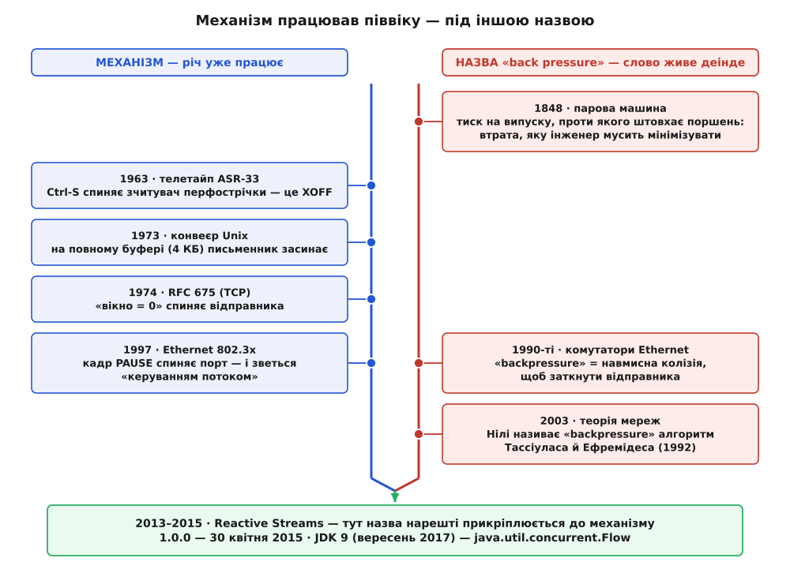
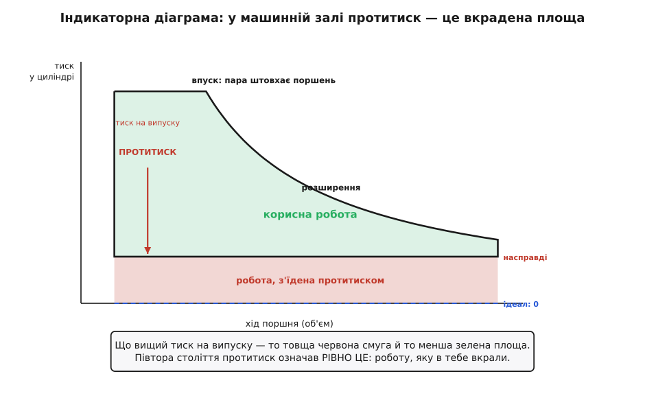

# 📜 Біографія слова: як протитиск дістав своє ім'я

З цим поняттям сталася дивна річ, на яку зазвичай не зважають. Механізм — обмежений буфер, що спиняє джерело, коли повний, — працював у справжньому коді вже 1973 року, а в мережевому протоколі 1974-го. Але **протитиском** його не називав ніхто десь до 2014-го. Сорок років річ робила свою роботу під іншим іменем.

А саме слово *backpressure* усі ці сорок років жило в іншому будинку — у машинній залі, де означало не чесноту, а **ваду**: втрату, яку інженер мусить мінімізувати. Ніхто ніколи не будував машини, щоб протитиск **створити**.

Отже, історія тут не про винахід. Вона про те, як слово перебралося з вихлопного патрубка парової машини в баг-трекер Java-бібліотеки — і дорогою перевернуло свій знак з мінуса на плюс.


*Механізм і назва йшли нарізно. Ліворуч — доріжка речі: вона працює вже з 1963-го, і щоразу її звуть якось інакше. Праворуч — доріжка слова: воно мандрує з парової машини в комутатори й у теорію мереж, щоразу означаючи щось трохи інше. Сходяться доріжки аж унизу, коли слово нарешті прикріплюють саме до того механізму, який на нього чекав півстоліття.*

## 1848: слово, що означало вкрадену роботу

Почнімо з того, звідки слово взагалі взялося, бо його первісне значення пояснює половину подальшого.

Словник Merriam-Webster датує першу зафіксовану появу *back pressure* **1848 роком** і подає таке означення: залишковий тиск на випускному боці поршня парової машини, проти якого мусить працювати пара на боці впуску. Статус дати — **приблизний**: словники між собою розходяться (Merriam-Webster дає 1848-й, Dictionary.com — проміжок 1860–65). Певне лише загальне: середина XIX століття, розпал парової доби.

Тепер фізика, бо саме вона робить слово таким, яким воно є. Поршень парової машини за цикл робить дві різні речі. На робочому ході пара штовхає його — це те, за що машину купили. А на зворотному ході поршень мусить **виштовхати відпрацьовану пару геть** — у конденсатор або просто в повітря. Якби випускний тракт був нескінченно широким, а конденсатор — ідеальною порожнечею, це не коштувало б нічого. Але патрубки вузькі, золотники неповороткі, і відпрацьована пара **опирається**. Оцей опір і є протитиск. І кожна його частка — це робота, яку машина робить **сама проти себе**, замість того щоб робити її для верстата, насоса чи колеса.

Найцікавіше — що цю крадіжку навчилися **бачити на око**. Близько **1796 року** Джон Сазерн (англ. *John Southern*), співробітник фірми Boulton & Watt, придумав хитрий пристрій: до штока поршня чіпляли дощечку з папером, і вона їздила разом із ним — так виходила вісь об'єму; а перо, з'єднане з манометром, ходило впоперек — так виходила вісь тиску. Перо саме малювало замкнену петлю — **індикаторну діаграму**. Площа петлі дорівнювала роботі за цикл. Уперше в історії роботу машини можна було не порахувати, а **побачити й обвести пальцем**.

Фірма тримала цей прилад **у таємниці** й довіряла лише своїм людям: діаграма показувала, де саме конкретна машина марнує пару, а це була конкурентна перевага, за яку платили гроші. (Іноді винахід приписують особисто Джеймсові Ватту й датують 1785 роком; ця рання дата **спірна** — є фахова праця, що розбирає «індикатор Ватта 1785 року» саме як підробку або як легенду. Усталене — авторство Сазерна й 1796 рік.)


*Що бачив інженер XIX століття, коли чув слово «протитиск». Зелена петля — корисна робота за цикл. Синя пунктирна лінія внизу — ідеальний випуск, який не коштує нічого. Червона смуга між нею і справжньою лінією випуску — робота, яку поршень витратив на те, щоб пропхати відпрацьовану пару крізь завузький тракт. Ця смуга не «плата за безпеку» і не «корисне гальмо». Це просто вкрадене.*

Далі слово успадкував двигун внутрішнього згоряння, і там воно означало те саме: колектор, глушник, каталізатор — кожен додає протитиску, кожен забирає потужність. Ціла галузь вихлопних систем ціле століття продавала одну-єдину обіцянку — **менше протитиску**.

Ось що варто винести з цієї частини й тримати до кінця. Півтора століття *back pressure* називав **ворога**. Уся робота інженера полягала в тому, щоб зробити його меншим. Саме це слово — з таким шлейфом — програмісти згодом візьмуть, щоб назвати ним свій головний засіб безпеки.

> 🔧 **Навіщо це.** Первісний знак слова — не історична дрібничка, а причина, чому назва так добре лягла й водночас так плутає новачків. Лягла — бо картинка правильна: щось на виході опирається, і опір біжить назад до джерела. Плутає — бо в машинній залі цей опір був **чистою втратою**, а в програмі він **рятує**. Кожен, хто вперше чує «додай протитиску», спершу чує це як «додай гальмівної колодки в справну машину». І має рацію в картинці — та помиляється в оцінці. Чому саме знак перевернувся, стане видно наприкінці.

## Ctrl-S: перший протитиск був механічним гальмом

Тепер перейдімо на доріжку механізму — і побачимо, що там слова не було зовсім.

**1963 року** фірма Teletype випустила на ринок модель 33 — телетайп, розроблений спершу на замовлення флоту США. Варіант ASR (*Automatic Send and Receive*) мав при собі зчитувач і перфоратор паперової стрічки. Машина була дешева й від народження розмовляла щойно створеним ASCII, тож саме вона стала терміналом до перших мінікомп'ютерів — а її звички стали фактичним стандартом.

І от задача, стара як світ. Зчитувач перфострічки крутиться собі рівним темпом і сипле символи в лінію. А той бік, що приймає, може не встигати. Що робити?

Відповідь була груба й прекрасна: **зупинити мотор**. Приймач шле назад символ Ctrl-S (це ASCII-код DC3) — і зчитувач стрічки **фізично спиняється**. Шле Ctrl-Q (код DC1) — і той знову крутиться.

Придивися, що тут відбувається. Повільна сторона дотягується назад по дроту й **гальмує механізм** швидкої. Це протитиск у чистому, майже буквальному вигляді — з тією різницею, що опирається не пара, а сталева собачка в зчитувачі. А як це назвали? **XOFF і XON** — від *transmit off* / *transmit on*, «передачу вимкнено» / «передачу ввімкнено». Ім'я описує, що стається з **передавачем**. Про тиск ніхто не думав: думали про мотор.

І ця конвенція пережила все. Ctrl-S досі підвішує твій термінал посеред сеансу — і це не примха, а скам'янілість: гальмо зчитувача перфострічки з 1963 року, вмерзле в кожну ssh-сесію.

## 1973: письменник засинає

Далі — момент, коли механізм переходить із заліза в програму.

Дуглас Макілрой (англ. *Douglas McIlroy*) у Bell Labs носився з ідеєю ще з **1964 року**. У внутрішній записці він написав фразу, за яку його цитують досі: програми треба вміти з'єднувати **як садовий шланг** — прикрутив наступний відтинок, коли треба обробити дані ще раз.

Затримайся тут на секунду. **Гідравлічна метафора з'явилася 1964-го** — за півстоліття до гідравлічної назви. Але Макілрой тягнув шланг, щоб пояснити **з'єднання**, а не тиск. Метафора вже лежала на столі; ниточку «а що там тече назад» ніхто не смикнув.

Друге видання Unix (червень 1972-го) конвеєрів ще не мало. А станом на **15 січня 1973 року** вони вже були: їх зробив Кен Томпсон (англ. *Ken Thompson*). (За переказом — за один вечір, разом із правками в ядрі, оболонці й купці стандартних програм; це саме **переказ**, хоч і з перших вуст.)

І ось серце цієї речі — шлях письменника в ядрі шостого видання (суть; дрібниці блокування inode опущено):

```c
#define PIPSIZ 4096                 /* стеля буфера конвеєра — 4 КБ */

loop:
    /* Буфер повний? Тоді письменник ЗАСИНАЄ — і не прокинеться,
       доки читач не вибере дані й не гукне wakeup() на цю адресу. */
    if (ip->i_size1 == PIPSIZ) {
        ip->i_mode |= IWRITE;       /* позначка: хтось чекає, щоб писати */
        sleep(ip+1, PPIPE);         /* заснути; читач розбудить */
        goto loop;                  /* прокинувся — перевірити ще раз */
    }
    /* ... є місце — пишемо ... */
```

Прочитай це очима сьогоднішнього дня. Стеля місткості — 4096 байтів. Перевірка на повноту. `sleep()` на повному буфері. Пробудження від читача. Це **обмежена черга, що блокує** — та сама, з точністю до назв змінних. Вона в ядрі. Вона 1973 року. І звуть її **«конвеєр»** (англ. *pipe*).

Макілрой, до речі, роками обстоював саме неієрархічний потік керування — той, що властивий корутинам; конвеєр і був способом дати цю форму звичайним програмам, які про жодні корутини не знали.

> 🔧 **Що треба знати.** [Корутина](root:sys-plang-cpp/coroutines) — підпрограма, яка вміє **спинитися посеред себе**, віддати керування іншій і згодом продовжити рівно з того місця, зберігши свій стан. На відміну від звичайного виклику, тут немає «головного» й «підлеглого»: дві корутини по черзі передають керування одна одній як рівні. Саме цю форму мав на увазі Макілрой, і саме до неї повернуться 2014-го, коли шукатимуть, як приробити протитиск до Rx.

І найкраще в цьому — що воно стало невидимим. Коли ти пишеш `find . | grep foo | head`, ти дістаєш протитиск **задарма**: `head` вийде, `grep` упреться в повний буфер і засне, `find` слідом. Ніхто про це не думає. Мабуть, це і є найвища оцінка механізмові — коли він працює так добре, що півстоліття не потребує навіть імені.

## 1974: «вікно мусить упасти до нуля»

Через рік після конвеєра той самий механізм з'явився там, де ставки були вищі.

Спершу — **ідея**. У травні **1974-го** Вінтон Серф (англ. *Vinton Cerf*) і Роберт Кан (англ. *Robert Kahn*) друкують у *IEEE Transactions on Communications* статтю «A Protocol for Packet Network Intercommunication» — ту саму, з якої виріс TCP.

Потім — **специфікація**. У грудні **1974-го** виходить RFC 675, «Specification of Internet Transmission Control Program». Автори — Вінтон Серф, **Йоґен Далал** (англ. *Yogen K. Dalal*) і Карл Саншайн (англ. *Carl Sunshine*). На Далала варто зважити окремо: він **індієць** — закінчив IIT Бомбей 1972-го, звідти поїхав до Стенфорда, де й став співавтором першої в історії специфікації TCP. Він ще зустрінеться нам нижче.

І в цьому документі, у першій же писаній специфікації TCP, стоїть правило, від якого досі залежить кожне з'єднання на планеті:

> If the user at the receiving side is not accepting data, the window should be reduced to zero. In particular, if all TCP incoming packet buffers for a connection are filled with received packets, the window **must** go to zero to prevent retransmissions until the user accepts some packets.
>
> *Якщо користувач на боці приймача не забирає дані, вікно слід зменшити до нуля. Зокрема, якщо всі вхідні буфери TCP для з'єднання заповнені отриманими пакетами, вікно **мусить** упасти до нуля, щоб не було повторних передач, доки користувач не забере хоч щось.*

Зверни увагу на слово **must**. Це не порада й не оптимізація — це обов'язок, записаний 1974 року. Механізм повністю сформований: 16-бітове поле вікна в заголовку, і жорстке правило, що повільний застосунок мусить стиснути це вікно до нуля.

Далі — **впроваджена система**: у вересні **1981-го** виходить RFC 793 за редакцією Джона Постела (англ. *Jon Postel*), і саме він стає TCP, яким ми користуємося. Механізм керування потоком переїхав туди майже недоторканим — і відтоді майже не змінився.

Одна дрібниця, що показує зрілість задуму. Коли вікно впало до нуля, відправник мовчить і чекає на звістку «вже можна». А якщо саме та звістка загубиться? Обидва чекатимуть вічно. Тому відправник тримає окремий таймер і час від часу штурхає приймача крихітним зондом. Тупик — рідний брат будь-якого блокувального протитиску — знайшли й закрили ще на світанку.

А тепер головне для нашої історії. **Як це назвали?**

> 🔧 **Що треба знати.** [Керування потоком](root:com-transport/flow-control) — механізм, яким **приймач** обмежує темп **відправника**, щоб не переповнити свій буфер. У TCP приймач у кожному підтвердженні оголошує вікно — скільки вільного місця лишилося, — і відправник не сміє тримати «в польоті» більше. Це не те саме, що керування перевантаженням, яке захищає мережу посередині.

Назва — **керування потоком**, *flow control*. Не протитиск.

І придивись, що ця назва робить із поняттям. «Керування потоком» — це канцелярський зворот: він повідомляє, що керування **існує**, але не каже ні хто його тримає, ні куди воно спрямоване. «Протитиск» каже головне одним словом: тиск іде **назад**, від споживача до джерела, проти течії. Перша назва ховає напрям, друга його **несе в собі**. Через сорок років саме це й вирішить справу.

## Коли «протитиск» таки означав навмисну аварію

Слово все-таки прийшло в мережі раніше — тільки означало воно там таке, від чого автора реактивних потоків пересмикнуло б.

Дія відбувається в комутаторах Ethernet **1990-х**, на півдуплексному сегменті — там, де станції ділять один дріт.

> 🔧 **Що треба знати.** [CSMA/CD](root:com-transport/csma-cd) — правило спільного дроту в класичному Ethernet: станція слухає лінію й починає говорити, лише коли тихо. Якщо двоє заговорили водночас, сигнали накладаються — це **колізія**. Станція, що її помітила, дошиває коротку глушильну послідовність (щоб колізію точно побачили всі), обидві замовкають і повторюють спробу через випадковий проміжок, який після кожної невдачі подвоюється. Колізія в такій мережі — не аварія, а штатний спосіб сказати «нас двоє, розійдімося».

Тепер уяви порт комутатора, чий приймальний буфер повний. Ввічливо сказати «стій» він **не може**: на півдуплексному сегменті зворотного каналу просто немає, дріт один на всіх. Тому інженери знайшли брутальний хід: **навмисно влаштувати колізію**. Приймальна станція вганяє глушильну послідовність просто в чужу передачу — і ламає її. Відправник бачить колізію, чесно відкочується за стандартним правилом і повторить пізніше. Результат: він замовк. Буфер віддихався.

Оцей прийом галузь у своїх патентах і паспортах мікросхем так і називала — **backpressure**.

Помилуйся, як точно це лягає на первісне значення. Це ж **втрата**: кадр знищено, час на дроті змарновано, відправника покарано. Протитиск рівно в сенсі 1848 року — річ, що коштує тобі грошей, застосована свідомо лише тому, що інший вихід гірший.

А **1997 року** з'являється IEEE 802.3x і стандартизує ввічливий варіант для повнодуплексних ліній — **кадр PAUSE**: приймач просить відправника помовчати рівно стільки-то (час рахують у порціях по 512 бітових інтервалів). Ніякої колізії, нічого не знищено, нічого не змарновано.

І ось де іронія, заради якої все це розказано: стандарт **не назвав** це протитиском. Він назвав це **керуванням потоком**. Тож ціле десятиліття Ethernet тримав обидва слова водночас: брутальний фокус звався *backpressure*, а цивілізований стандарт — *flow control*. Слово вперто трималося руйнівної речі.

(Ниточка, що замикається: той самий Йоґен Далал із RFC 675, перейшовши в Xerox PARC, працював над специфікацією 10-мегабітного Ethernet разом із DEC та Intel — тією, з якої виріс стандарт IEEE 802.3. Людина, що писала правило «вікно мусить упасти до нуля», доклалася й до мережі, де протитиском називали навмисну колізію.)

Був і третій, менш помітний ужиток: протитиск **від вузла до вузла**, він же кредитне керування потоком, — коли кожен вузол на шляху дозволяє попередньому слати рівно стільки, скільки має місця. Так робили в мережевій архітектурі IBM APPN і пропонували для ATM. Точна дата **першого** вжитку слова в обчисленнях у доступних джерелах **не задокументована**; документоване інше — що вже в 1990-х це була звичайна робоча лексика тих, хто робив комутатори.

## Однойменний двійник: протитиск, що маршрутизує

Тим часом та сама метафора виростила зовсім іншу машину. Знати про неї варто саме тому, що це **омонім**, і на ньому легко набити ґулю.

У грудні **1992-го** в *IEEE Transactions on Automatic Control* (том 37, №12, с. 1936–1948) вийшла праця «Stability Properties of Constrained Queueing Systems and Scheduling Policies for Maximum Throughput in Multihop Radio Networks». Автори — **Леандрос Тассіулас** (гр. *Leandros Tassiulas*) і **Ентоні Ефремідес** (гр. *Anthony Ephremides*), обидва греки.

Ідея така. У сітчастій мережі вузол вирішує, куди слати пакет, дивлячись на **різницю довжин черг** між собою і сусідами. Пакети течуть «під гору» — від довгої черги до коротшої. І доведено сильну річ: це локальне, жадібне правило, де ніхто не знає загальної картини трафіку, витягує **максимальну пропускну здатність, на яку мережа взагалі здатна**.

А тепер факт, заради якого це тут, і він задокументований напрочуд точно: **Тассіулас і Ефремідес свій алгоритм протитиском не називали**. У них ідеться про «тиски черг» і «різницевий доробок» (*differential backlog*). Назву *backpressure* причепили пізніше — у працях, що поширили метод на рухомі мережі: спершу в докторській дисертації **Майкла Нілі** (англ. *Michael J. Neely*, MIT, 2003) і в роботах Нілі, Модіано й Рорса. Тобто алгоритм — 1992-го, ім'я — 2003-го, і це **два різні вчинки різних людей**.

І це саме омонім, а не синонім. Протитиск реактивних потоків каже: «пригальмуй, я повний». Протитиск Тассіуласа–Ефремідеса каже: «неси **туди**, там вільніше». Картинка-метафора спільна — різниця тисків у мережі труб жене потік, — але машини різні: перша керує **темпом**, друга — **напрямком**.

> 🔧 **Навіщо це.** Практична користь від цього абзацу проста: якщо ти шукатимеш слово *backpressure* в науковій літературі з мереж, ти майже напевно потрапиш не туди. Пошук віддасть тобі теореми про стабільність черг у бездротових сітках і максимізацію пропускної здатності — і жодного слова про те, як повільному споживачеві вгамувати швидке джерело. Одне слово, дві школи, які одна одну майже не читають.

## 2013–2014: слово знаходить свій дім

І ось остання дія. Несподіванка в тому, що вона розігралася не в мережах і не в ядрі, а в Java-бібліотеці.

Передісторія коротка: бібліотека Rx чудово вміла **перетворювати** потік подій, але відповіді на «джерело швидше за споживача» не мала в принципі. Ця прогалина — окрема історія, і її вже розказано в іншому місці.

> 🔧 **Що треба знати.** [Реактивні потоки](root:sf-apps/reactive-programming) — спосіб описувати асинхронний потік подій як **значення**, до якого застосовують ланцюг операторів (`map`, `filter` тощо), замість плетива вкладених колбеків. Виросло з бібліотеки Rx, придуманої в Microsoft на прозрінні, що колекція, з якої тягнуть, і потік, який штовхає, — дзеркальні структури, тож оператори однієї механічно переносяться на другу.

Нас тут цікавить не механізм, а **слово**. Простежмо, звідки воно взялося в цій кімнаті.

**4 листопада 2013 року** стартує курс на Coursera «Principles of Reactive Programming» — його читають Мартін Одерський (нім. *Martin Odersky*), Ерік Меєр (нідерл. *Erik Meijer*) і Роланд Кун (нім. *Roland Kuhn*). І ось як Кун сам згадує зав'язку: записуючи відеолекції до цього курсу, він познайомився з Меєром, і вони «почали говорити про додавання протитиску до Rx».

Прочитай цю фразу уважно, бо вона — ключова для всієї нашої розповіді. **2013 року слово вже було**. Воно вже вживалося, воно вже було зрозуміле двом інженерам **без жодних пояснень**. Вони його не вигадали — вони по нього **потягнулися**. Воно лежало собі в загальноінженерній лексиці, і воно **підійшло**.

Далі події йдуть щільно. У **жовтні 2013-го** Віктор Кланг (швед. *Viktor Klang*) із Typesafe знайомиться з Беном Крістенсеном (англ. *Ben Christensen*) із Netflix; на першому дзвінку — ще й Роланд Кун та Джордж Кемпбелл (англ. *George Campbell*), і говорять вони саме про асинхронне неблокувальне керування потоком.

**28 березня 2014 року** Бен Крістенсен відкриває в репозиторії RxJava звернення №1000. Його заголовок — одне слово: **Backpressure**. А перші рядки чесніші, ніж заведено в інженерних документах:

> Thus far Rx has left backpressure solutions "an exercise for the user". It can be done via manual feedback loops and operators like `throttle`, `sample`, `window`, etc.
>
> *Досі Rx лишала розв'язки протитиску «як вправу для користувача». Це можна зробити руками — зворотними зв'язками й операторами на кшталт `throttle`, `sample`, `window`.*

І діагноз: якщо виробник швидкий, то легко стається «buffer-bloat (and eventually OutOfMemory)» — роздуття буфера й зрештою вичерпання пам'яті. А запропонований хід — «корутини з боку Observable-джерела, у якого підписник може запитувати дані порціями»: та сама форма, яку Макілрой обстоював для конвеєрів.

Затримайся на цьому одному реченні — у ньому вся наша історія в мініатюрі. **Backpressure** — з машинної зали 1848 року. **Buffer-bloat** — з мереж: слово вигадав Джим Ґеттіс (англ. *Jim Gettys*) **2010 року**, намірявши на власному домашньому каналі затримки до 1.2 секунди, і **2011-го** об'їздив із цією бідою галузь. **OutOfMemory** — з Java. Три словники, три десятиліття, один рядок у баг-трекері. Слово прибуло.

**На початку 2014-го** Кланг оформлює співпрацю під назвою **Reactive Streams**. І тут потрібна точність, бо її часто гублять: Кланг дав ім'я **ініціативі**, а не явищу. Слова *backpressure* він не вигадував — воно прийшло ззовні, готовим. Що зробила група — то це перетворила побутове інженерне слово на **термін із точним значенням**: не «якось гальмувати», а строго визначений зворотний попит із перевірюваними правилами.

За стіл сіли інженери Netflix, Typesafe (компанія перейменується на **Lightbend** 23 лютого 2016-го, тож пізніші джерела кличуть її саме так) і Pivotal, а далі долучилися Red Hat, Oracle, Twitter (звідти, зокрема, Маріус Еріксен — англ. *Marius Eriksen*), Kaazing і spray.io.

І остаточний доказ, що слово стало домашнім, — у тому, як група описала саму себе одним реченням: *«стандарт асинхронної обробки потоків із неблокувальним протитиском»*. Слово стоїть **просто в означенні проєкту**. Не в поясненні, не в примітці — у заголовній фразі.

## Прописка: 30 квітня 2015 і вересень 2017

Далі — коротко, бо докладна історія самої специфікації розказана окремо.

**30 квітня 2015-го** вийшла версія **1.0.0** Reactive Streams для JVM. У **серпні 2015-го** Даг Ліа (англ. *Doug Lea*) — багаторічний керівник JSR 166, тієї групи, що дала Java весь пакет `java.util.concurrent`, — подав пропозицію **JEP 266**: внести погоджені інтерфейси просто в стандартну бібліотеку. У **вересні 2017-го** вийшов **JDK 9**, і в ньому — клас `java.util.concurrent.Flow`.

> 🔧 **Що треба знати.** [Як складали `request(n)`](root:sf-apps/reactive-programming/hist-reactive-streams-spec.md) — окрема розповідь про те, як інженери компаній-суперниць погодили спільний контракт: чотири інтерфейси, зворотний попит `request(n)` у серці, текстовий звід правил і набір тестів сумісності (TCK), відданий у суспільне надбання. Там — про **специфікацію** та про те, чому в неї немає одного автора. Тут — лише про долю слова.

І ось деталь, якою ця історія закривається краще за будь-який підсумок. Документація JDK пояснює метод `request` такою фразою:

> Communication relies on a simple form of flow control through method `Subscription.request`, for communicating **back pressure**.
>
> *Обмін спирається на просту форму керування потоком через метод `Subscription.request` — щоб передавати протитиск.*

Перечитай. **Обидві назви в одному реченні.** Ім'я 1974 року (*flow control*) пояснює **механізм**; ім'я 1848-го (*back pressure*) пояснює **призначення**. Два словники, що сорок років блукали нарізно, зустрілися в коментарі до методу — у найконсервативнішому пакеті Java. Слово з машинної зали дістало постійну прописку.

## Що видно з біографії слова

Тепер, коли дуга ціла, з неї видно три речі, і жодна з них не про протитиск зокрема.

**Перше: механізм не чекав на назву.** Конвеєр Томпсона працював 1973-го, вікно Серфа–Далала–Саншайна — 1974-го, за сорок років до того, як хтось вимовив «протитиск». Якщо здається, що назва зробила річ можливою, то стрілка перевернута. Але назва зробила інше, і по-своєму більше: вона зробила річ **переносною**. Java-програміст, що 2010 року відкрив би RFC 793, не подумав би «та це ж моя біда» — «керування потоком» звучить як мережевий клопіт, чужий і вузький. «Протитиск» несе картинку, а картинка **ходить між доменами**. Назва не збудувала механізм — вона збудувала міст, яким механізм перейшов у чужі голови.

**Друге: слово прибуло з переверненим знаком, і причина перевороту точна.** У машинній залі протитиск був крадіжкою, у програмі — рятунком. Фізика та сама, оцінка протилежна. Чому? Бо поршень **не може почекати**. Машина мусить крутити верстат із заданою швидкістю; «зупинюся, доки випуск звільниться» для неї не варіант, тож кожна частка зустрічного тиску — чиста втрата, без жодної компенсації. А виробник даних **може почекати**, і це майже нічого не коштує. Щойно чекання дешевшає, зустрічний тиск перестає бути крадіжкою й стає **гальмом** — а гальмо не вада в машині, яка інакше злетіла б із дороги. Знак перевернувся не тому, що змінилася фізика, а тому, що змінилася **ціна чекання**.

**Третє: «хто винайшов протитиск» — питання без відповіді, бо воно склеює докупи з десяток різних вчинків.** Сазерн (1796) зробив прилад, який показав цю втрату на око. Хтось безіменний у 1840-х пустив у обіг саму фразу. Томпсон (1973) і Серф із Далалом та Саншайном (1974) збудували механізм — і назвали його інакше. Інженери Ethernet 1990-х причепили слово до навмисної колізії. Нілі (2003) причепив його до чужого алгоритму 1992 року. Меєр і Кун (2013) вимовили його вголос про потоки даних; Крістенсен (2014) виніс у заголовок звернення; Кланг звів за стіл суперників; Ліа (2017) поклав результат у стандартну бібліотеку. Жоден із них не винайшов протитиску. Кожен зробив **один вчинок** — прилад, фраза, механізм, перенесення, означення, канонізація, — і поняття, яким ми користуємося, є їхньою сумою.

Оце і є справжній вигляд «народження поняття», якщо перестати шукати героя: не спалах, а слово й механізм, що півстоліття блукали нарізно, доки хтось нарешті не помітив — та це ж одне й те саме.
