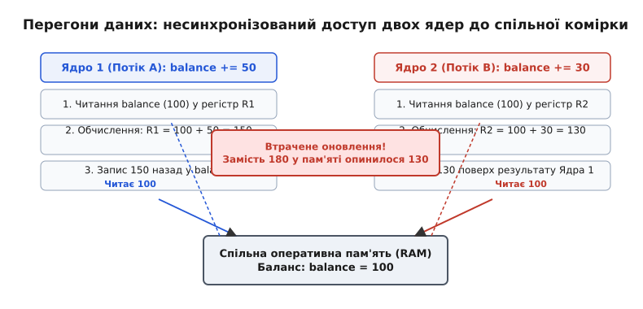
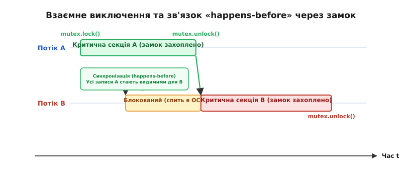
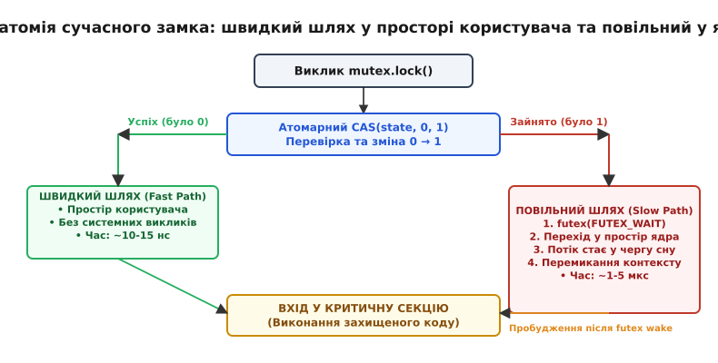
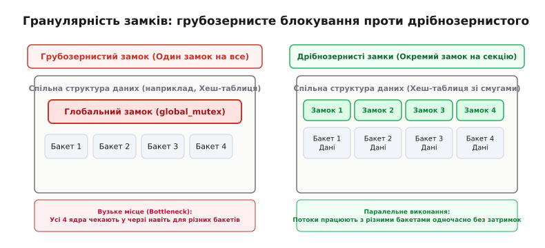

# Перегони даних і замки

<preknowlist>
- [Процеси й потоки](topic:sf-os/process-vs-thread) — спільний адресний простір, паралельне виконання інструкцій на різних ядрах та перемикання контексту.
- [Атомарність і гонки](topic:sf-tasks/atomicity-races) — неподільність машинних інструкцій та небезпека втручання переривань.
- [Вирівнювання даних у пам'яті](topic:sf-apps/memory-alignment) — межі слів у пам'яті та транзакції на шині процесора.
- [Упорядкованість пам'яті та барʼєри](topic:sf-tasks/memory-ordering-barriers) — перевпорядкування інструкцій компілятором і процесором, видимість змін між процесорними ядрами.
</preknowlist>

Коли програма переходить від одного потоку виконання до кількох, звична інтуїція послідовного коду повністю руйнується. Якщо два процесорні ядра одночасно звертаються до однієї комірки пам'яті і хоча б одне з них виконує запис, результат роботи перестає бути детермінованим. У системному програмуванні цю фундаментальну проблему називають **перегонами даних** (англ. *data race*), а головним інструментом приборкання хаосу виступає **замок** (англ. *lock*, або *м'ютекс* від лат. *mutua exclusio* — взаємне виключення).

Ця стаття розкриває фізичну та алгоритмічну природу перегонів даних на рівні апаратури й компілятора, механізм взаємного виключення, внутрішню будову сучасних гібридних замків від простору користувача до ядра операційної системи, а також інженерну дисципліну побудови стійких багатопотокових систем.

---

### Недетермінізм спільного доступу: як народжуються перегони даних

Розглянемо найпростішу дію у багатопотоковій програмі — збільшення спільного балансу банківського рахунку:

:::tabs
```c
balance += 50;
```
```cpp
balance += 50;
```
:::

Для програміста це один неподільний рядок вихідного коду. Проте для центрального процесора це складна послідовність із трьох окремих апаратних операцій на рівні машинного коду:
1. **Зчитування (Load):** поточне значення змінної `balance` копіюється з оперативної пам'яті через ієрархію кешів у внутрішній регістр конкретного ядра процесора (`R1`).
2. **Модифікація (Add):** арифметико-логічний пристрій ядра додає число `50` до значення в регістрі `R1`.
3. **Запис (Store):** результат із регістра `R1` записується назад у буфер збереження (Store Buffer) ядра та через протокол когерентності кешів оновлює комірку в пам'яті.

Якщо в цей самий час друге процесорне ядро паралельно виконує операцію `balance += 30`, інструкції двох ядер можуть довільно чергуватися на спільній шині пам'яті.


*Два ядра процесора зчитують початковий баланс 100 одночасно. Ядро 1 записує 150, але Ядро 2 миттєво перезаписує комірку своїм значенням 130. Оновлення першого ядра безповоротно втрачено.*

Якщо обидва ядра зчитають початкове значення `100` до того, як будь-яке з них встигне записати свій результат, Ядро 1 запише `150`, а Ядро 2 слідом за ним запише `130`. Замість правильної математичної суми `180` у пам'яті залишиться `130`. Одне оновлення просто розчинилося в часі.

Це явище називають **втраченим оновленням** (англ. *lost update*). Його головна підступність полягає в недетермінізмі: програма може бездоганно працювати під час мільйонів тестових прогонів на машині розробника, але дати збій під високим навантаженням на промисловому сервері.

> 📜 **Ціна перегонів даних у реальному світі.** Перегони даних — це не теоретичний курйоз мовних стандартів. У серпні 2003 року непомітні перегони даних у багатопотоковому C++ сервері диспетчерського моніторингу призвели до тихої відмови системи тривог і знеструмлення 50 мільйонів людей у США та Канаді. Детальний розбір аварії наведено у вставці [Аварія енергомережі 2003 року](topic:sf-tasks/data-races-locks/hist-blackout2003.md).

---

### Апаратний рівень: ієрархія кешів, протокол MESI та буфери запису

Щоб зрозуміти, чому паралельний доступ без синхронізації ламає систему, необхідно поглянути на фізичну будову сучасного багатоядерного процесора.

Кожне ядро має власні надшвидкі кеші першого та другого рівнів (L1 і L2), а також спільний для всіх ядер кеш третього рівня (L3) та оперативну пам'ять (RAM). Пам'ять передається між кешами не окремими байтами, а блоками фіксованого розміру — **кеш-лініями** (англ. *cache lines*), зазвичай розміром 64 байти.

```
+-------------------------------------------------------------------------------+
| АРХІТЕКТУРА БАГАТОЯДЕРНОЇ ПАМ'ЯТІ ТА КОГЕРЕНТНІСТЬ                            |
+-------------------------------------------------------------------------------+
|  +--------------------------+           +--------------------------+          |
|  | Ядро 1 (Core 1)          |           | Ядро 2 (Core 2)          |          |
|  | [Регістри] -> [Store Buf]|           | [Регістри] -> [Store Buf]|          |
|  |     |                    |           |     |                    |          |
|  | [Кеш L1 Data] (32 КБ)    |           | [Кеш L1 Data] (32 КБ)    |          |
|  |     |                    |           |     |                    |          |
|  | [Кеш L2] (512 КБ)        |           | [Кеш L2] (512 КБ)        |          |
|  +-------------+------------+           +-------------+------------+          |
|                |                                      |                       |
|                +------------------+-------------------+                       |
|                                   | (Між'ядерна шина / Інтерконект)           |
|                       +-----------+-----------+                               |
|                       | Спільний Кеш L3 (16 МБ) |                             |
|                       +-----------+-----------+                               |
|                                   |                                           |
|                       +-----------+-----------+                               |
|                       | Оперативна пам'ять RAM |                              |
|                       +-----------------------+                               |
+-------------------------------------------------------------------------------+
```

#### Протокол когерентності MESI
Щоб ядра не працювали із застарілими даними, апаратний контролер кешу підтримує протокол когерентності (найчастіше варіанти **MESI** або **MOESI**). Кожна кеш-лінія перебуває в одному з чотирьох станів:
- **M (Modified — Модифікована):** Лінія присутня лише в кеші цього ядра, її вміст змінено і він новіший за стан у RAM.
- **E (Exclusive — Ексклюзивна):** Лінія присутня лише в цьому кеші, але її вміст збігається з RAM.
- **S (Shared — Спільна):** Лінія присутня в кешах кількох ядер одночасно, дозволено лише читання.
- **I (Invalid — Недійсна):** Лінія містить застарілі дані й не може використовуватися.

Коли Ядро 1 хоче записати дані в змінну, кеш-лінія якої перебуває у стані `Shared` (присутня в інших ядрах), воно зобов'язане надіслати через між'ядерну шину широкомовний сигнал запиту власності (англ. *Request For Ownership, RFO*). Усі інші ядра, отримавши сигнал RFO, переказують стан своєї копії лінії в `Invalid`.

#### Буфери запису (Store Buffers) та перевпорядкування
Очікування підтвердження інвалідації від усіх інших ядер займає десятки тактів. Щоб ядро не простоювало, інженери додали **буфер запису (Store Buffer)**: процесор поміщає новий запис у чергу буфера і негайно продовжує виконання наступних інструкцій.

Через це виникає апаратне перевпорядкування пам'яті: інше ядро може побачити запис змінної `B` раніше, ніж запис змінної `A`, навіть якщо в коді запис `A` стояв першим! Без застосування спеціальних інструкцій синхронізації процесор не гарантує узгодженого порядку спостереження операцій між ядрами.

---

### Формальне визначення: перегони даних проти стану перегонів

У літературі часто виникає плутанина між двома схожими поняттями: **перегони даних** (англ. *data race*) та **стан перегонів** (англ. *race condition*). Вони описують принципово різні рівні дефектів у системі.

```
+-------------------------------------------------------------------------------+
| ДВА РІВНІ ДЕФЕКТІВ КОНКУРЕНТНОСТІ                                             |
+-------------------------------------------------------------------------------+
| 1. Перегони даних (Data Race) — фізичний рівень пам'яті та компілятора:        |
|    • Два або більше потоків одночасно звертаються до однієї адреси пам'яті.   |
|    • Хоча б одне звернення є записом.                                         |
|    • Між операціями відсутня синхронізація (немає відношення happens-before). |
|    => Результат: невизначена поведінка (Undefined Behavior, UB) у C/C++/Rust!|
+-------------------------------------------------------------------------------+
| 2. Стан перегонів (Race Condition) — логічний рівень алгоритму:               |
|    • Усі звернення до пам'яті можуть бути синхронізовані (без data race).     |
|    • Проте правильність результату залежить від порядку планування потоків.   |
|    => Результат: логічна помилка бізнес-рівня (наприклад, стан Check-Then-Act)|
+-------------------------------------------------------------------------------+
```

#### 1. Перегони даних (Data Race) і модель пам'яті C/C++
Згідно зі стандартами C11, C++11, Java, Go та Rust, **перегони даних** виникають тоді, коли два або більше потоків одночасно звертаються до однієї комірки пам'яті, хоча б одне зі звернень є записом, і між ними немає зв'язку випереджального упорядкування (англ. *happens-before ordering*).

У мовах C і C++ наявність перегонів даних є **невизначеною поведінкою (Undefined Behavior, UB)**. Оптимізувальний компілятор будує дерево оптимізацій на фундаментальній аксіомі: коректна програма не містить перегонів даних (теорема *DRF-SC: Data-Race-Free implies Sequential Consistency*).

Опираючись на цю аксіому, оптимізатор може:
- **Кешувати змінну в регістрі:** Якщо потік читає змінну в циклі `while (!stop_flag)`, компілятор завантажує `stop_flag` у регістр один раз перед циклом і перетворює його на вічний цикл `while (true)`, оскільки вважає, що ніхто ззовні не змінює змінну без синхронізації.
- **Видаляти «зайві» записи (Dead Store Elimination):** Якщо функція записує `x = 1`, а потім `x = 2`, запис одиниці може бути просто стертий, навіть якщо інший потік сподівався використати проміжний стан.
- **Здійснювати розривне читання (Torn Read/Write):** 64-бітне число на 32-бітній архітектурі записується двома 32-бітними машинними словами. Без замка інший потік може зчитати старшу половину від старого числа, а молодшу — від нового, отримавши цілковито спотворене сміття.

> 🔧 **Чому `volatile` не рятує від перегонів даних у C/C++?**
> Ключове слово `volatile` лише забороняє компілятору викидати операцію читання/запису чи кешувати змінну в регістрі. Проте воно **не робить операцію атомарною** (не рятує від розривного читання) і **не генерує апаратних бар'єрів пам'яті** для процесора. Змінна `volatile` у C/C++ призначена виключно для роботи з регістрами пристроїв (Memory-Mapped I/O) та сигналами, але не для міжпотокової синхронізації!

#### 2. Стан перегонів (Race Condition)
**Стан перегонів** (або логічні перегони) — це дефект алгоритмічної логіки, коли коректність результату залежить від того, який потік встигне виконати свою дію першим.

Класичний приклад — патерн «перевірка перед дією» (англ. *check-then-act*):

:::tabs
```c
// Навіть якщо окремі операції читання та запису атомарні,
// між перевіркою та списанням існує логічний стан перегонів!
if (account_get_balance(acc) >= 100) {
    // В цей мікросекундний інтервал інший потік може списати всі гроші!
    account_withdraw(acc, 100); 
}
```
```cpp
// Навіть якщо окремі методи потокобезпечні,
// складена операція без єдиного замка є вразливою
if (account.get_balance() >= 100) {
    // Інший потік встигає спустошити рахунок між рядками коду
    account.withdraw(100);
}
```
:::

У цьому прикладі немає фізичного пошкодження байтів пам'яті (перегонів даних), проте бізнес-інваріант порушено: баланс рахунку стає від'ємним.

---

### Принцип взаємного виключення (Mutual Exclusion)

Щоб захистити стан спільних даних і гарантувати неподільність складених операцій, набір дій перетворюють на **критичну секцію** (англ. *critical section*). Це ділянка коду, в якій одночасно дозволено перебувати **лише одному** виконавчому потоку.

Пристрій, що забезпечує взаємне виключення, називають **замком** (англ. *lock*) або **м'ютексом** (англ. *mutex*).

```
   Потік 1                     М'ЮТЕКС                     Потік 2
      |                           |                           |
      +---- mutex.lock() -------->| [Вільний -> Зайнятий]     |
      |   (Захоплення успішне)    |                           |
      |                           |                           |
   [КРИТИЧНА СЕКЦІЯ 1]            |                           |
   • Читання balance (100)        |<--- mutex.lock() ---------+
   • balance = 100 + 50           |   (Зайнято! Блокування)   |
   • Запис balance (150)          |                           | (Спить в ОС)
      |                           |                           |
      +---- mutex.unlock() ------>| [Звільнення + Сигнал]     |
                                  |-------------------------->+
                                  |   (Пробудження + Захоплено)
                                  |                           |
                                  |                   [КРИТИЧНА СЕКЦІЯ 2]
                                  |                   • Читання balance (150!)
                                  |                   • balance = 150 + 30
                                  |                   • Запис balance (180!)
                                  |                           |
                                  |<--- mutex.unlock() -------+
```

М'ютекс надає системі дві фундаментальні гарантії:

1. **Взаємне виключення (Mutual Exclusion):** Жодні два потоки не можуть одночасно виконувати критичні секції, захищені одним і тим самим м'ютексом. Усі паралельні звернення серіалізуються у строгу чергу.
2. **Синхронізація пам'яті (Memory Visibility & Happens-Before):** Виклик `unlock()` у Потоці 1 створює зв'язок випереджального упорядкування (*happens-before*) із наступним успішним викликом `lock()` у Потоці 2. Усі модифікації пам'яті, зроблені Потоком 1, гарантовано скидаються з буферів збереження ядер і стають повністю видимими для Потоку 2 у момент захоплення замка.


*Потік A захоплює замок і виконує критичну секцію. Потік B при спробі виклику lock() блокується і переходить у стан сну в планувальнику ОС. Виклик unlock() Потоком A звільняє замок, встановлює відношення happens-before і будить Потік B.*

> 🔧 **Головний принцип: Замок захищає ДАНІ та ІНВАРІАНТИ, а не КОД.**
> М'ютекс нічого не знає про функції чи рядки коду. Він існує для того, щоб підтримувати узгоджений внутрішній стан (інваріант) конкретної структури даних. Якщо один потік оновлює баланс під замком, а інший потік читає це ж поле напряму без захоплення замка, перегони даних виникають знову. Захист працює лише тоді, коли **кожна** операція доступу до спільних даних (як запис, так і читання) виконується суворо під замком.

#### Протокол передачі володіння (Transfer of Ownership)
Чи завжди потрібен замок для роботи з динамічними об'єктами? Ні. Якщо архітектура програми побудована на принципі **передачі ексклюзивного володіння** (англ. *transfer of ownership*), замок потрібен лише в точці передачі покажчика (наприклад, під час додавання повідомлення в потокобезпечну чергу):
1. Потік-виробник створює та наповнює об'єкт у власній локальній пам'яті без жодних замків.
2. Потім потік переміщує покажчик (`std::unique_ptr` у C++ або сирий покажчик у C) у спільну чергу під коротким замком.
3. Потік-споживач вилучає покажчик із черги і далі працює з ним суто монопольно.

Оскільки в будь-який момент часу до пам'яті звертається виключно один власник, дані захищені від перегонів самою архітектурою володіння.

Натомість поширеною пасткою є використання `std::shared_ptr`: хоча лічильник посилань у керуючому блоці оновлюється атомарно, сам вказівний об'єкт під ним **не захищений від перегонів даних**. Якщо два потоки паралельно викликають методи того самого екземпляра через різні копії `shared_ptr`, вони зобов'язані синхронізувати свої виклики власним замком.

---

### Анатомія сучасного замка: від атомарного прапорця до ядра ОС

Як улаштований сам замок? Чому не можна побудувати взаємне виключення простою булевою змінною `bool is_locked = false`?

Погляньмо на наївну спробу створення замка:

:::tabs
```c
// НАЇВНИЙ І НЕПРАЦЮЮЧИЙ ЗАМОК:
void bad_lock(bool *is_locked) {
    while (*is_locked) {
        // Очікуємо, поки замок звільниться
    }
    *is_locked = true; // ПЕРЕГОНИ ДАНИХ НА САМОМУ ЗАМКУ!
}
```
```cpp
// НАЇВНИЙ І НЕПРАЦЮЮЧИЙ ЗАМОК:
void bad_lock(bool& is_locked) {
    while (is_locked) {
        // Очікуємо звільнення
    }
    is_locked = true; // ПЕРЕГОНИ ДАНИХ НА САМОМУ ЗАМКУ!
}
```
:::

Якщо два потоки одночасно перевірять `is_locked` і побачать `false`, обидва вийдуть із циклу й одночасно запишуть `true`. Обидва потоки вважатимуть, що захопили замок, і одночасно увійдуть у критичну секцію. Замок сам став жертвою перегонів даних.

#### 1. Апаратний фундамент: Атомарний Compare-And-Swap (CAS)
Щоб реалізувати замок, процесор повинен вміти перевірити старе значення комірки і записати нове **за одну неподільну апаратну транзакцію**:
- На архітектурі x86: команда `lock cmpxchg`.
- На архітектурі ARM та RISC-V: пара команд Load-Linked / Store-Conditional (`ldrex`/`strex` або `lr`/`sc`).

Атомарна операція CAS (Compare-And-Swap) приймає очікуване значення (`0 — вільно`) та бажане нове значення (`1 — зайнято`). Якщо в комірці дійсно записано `0`, вона записує `1` і повертає успіх. Якщо інше ядро встигло змінити значення бодай на частку такту раніше, CAS повертає невдачу.

#### 2. Дилема: крутитися чи спати? (Spinlock vs Sleep Lock)
Що має робити потік, якщо замок виявився зайнятим?
- **Спін-замок (Spinlock):** Потік не віддає процесор, а крутиться в щільному циклі `while (CAS(...) == fail)`. Це надзвичайно ефективно, якщо критична секція триває лічені наносекунди (декілька інструкцій). Проте якщо замок тримають довго, спін-замок марно спалює 100% потужності процесорного ядра, відбираючи час у корисних задач.
- **Блокуючий замок ОС (Sleep Lock):** Потік робить системний виклик у ядро операційної системи. Планувальник переводить потік у стан очікування (`BLOCKED`) і перемикає ядро на виконання іншої задачі. Коли замок звільниться, ядро розбудить потік. Проте сам системний виклик і перемикання контексту коштують дорого — від 1 до 5 мікросекунд (тисячі тактів CPU).

#### 3. Гібридний замок користувацького простору (Futex / Fast Mutex)
Сучасні операційні системи (Linux через механізм **futex** — *Fast Userspace Mutex*, Windows через `WaitOnAddress`, macOS через `os_unfair_lock`) використовують двокрокову гібридну архітектуру:


*Швидкий шлях замка виконується повністю в просторі користувача за одну атомарну інструкцію (~10 нс). Лише за наявності змагання (contention) виконується системний виклик futex для переведення потоку в сон.*

Внутрішня логіка замка розбита на дві гілки:

1. **Швидкий шлях (Fast Path — простір користувача):**
   - За відсутності змагання потік викликає атомарний `CAS(state, 0, 1)`.
   - Якщо замок був вільний (`0`), стан стає `1`, і функція негайно повертає керування.
   - **Жодного системного виклику не відбувається!** Захоплення незайнятого замка триває близько `10–15 нс` (час однієї атомарної інструкції з бар'єром пам'яті).
2. **Повільний шлях (Slow Path — ядро ОС):**
   - Якщо `CAS` зазнає невдачі (замок уже захоплений іншим потоком), потік може виконати короткий адаптивний спін (кілька десятків ітерацій опитування кешу).
   - Якщо замок не звільнився, потік атомарно виставляє прапорець наявності очікувачів у слові стану замка (`state = 2`) і робить системний виклик `futex(addr, FUTEX_WAIT, 2)`.
   - Ядро операційної системи перевіряє, чи значення за адресою `addr` дійсно дорівнює `2`. Якщо так — ядро додає потік до черги очікування замка і перемикає процесор на іншу корисну задачу.
3. **Звільнення (Unlock):**
   - Потік скидає стан замка атомарною операцією: `CAS(state, 1, 0)`.
   - Якщо стан був `1` (очікувачів не було), замок звільнено без звернення до ядра.
   - Якщо стан був `2` (є сплячі очікувачі), потік викликає системний виклик `futex(addr, FUTEX_WAKE, 1)`, наказуючи ядру розбудити одного з очікувачів із черги.

Завдяки такій структурі програми не платять системними викликами за спокійні замки, але й не витрачають час процесора на даремне крутіння під час змагання.

> 📋 **Повний довідник системних викликів і типів замків.** Детальний опис сигнатур POSIX Threads (`pthread_mutex_t`), атрибутів безпеки (`PTHREAD_MUTEX_ERRORCHECK`, `PTHREAD_MUTEX_RECURSIVE`) та класів C++ наведено у вставці [Інтерфейс POSIX Threads Mutex і примітиви синхронізації C++](topic:sf-tasks/data-races-locks/api-pthread-mutex.md).

---

### Гранулярність і ціна замків: Контеншн і Закон Амдала

Будь-який замок має свою ціну. Ця ціна вимірюється не стільки наносекундами виконання інструкції `lock`, скільки втратою паралелізму.

#### Змагання за замок (Lock Contention)
Якщо десять потоків намагаються одночасно захопити один і той самий м'ютекс, виникає **контеншн** (англ. *contention* — змагання за ресурс). Дев'ять ядер зупиняються і чекають одне. Паралельна програма миттєво деградує до суто послідовного виконання, а постійні перемикання контексту спустошують кеш-пам'ять інструкцій і даних.

#### Закон Амдала: прихована межа масштабування
Закон Амдала математично доводить: прискорення багатопотокової програми обмежене часткою коду, що виконується послідовно.

Якщо критичні секції під замками займають лише **5%** від загального часу виконання задачі, то навіть на машині зі **128 ядрами** реальне прискорення складе не 128, а лише **17.4 раза**! А на нескінченній кількості ядер прискорення принципово не зможе перевищити `1 / 0.05 = 20 разів`.

> 🧮 **Математичне виведення закону Амдала та теорія черг.** Детальне математичне виведення межі Амдала та розрахунок середнього часу затримки в черзі контеншну моделі `M/M/1` наведено у вставці [Математика замків: закон Амдала та ймовірність змагання](topic:sf-tasks/data-races-locks/math-contention-scaling.md).

#### Грубозернисте проти Дрібнозернистого блокування

Щоб зменшити контеншн, архітектори обирають відповідну **гранулярність** (англ. *granularity*) замків:


*Ліворуч: грубозернистий замок блокує всю структуру даних, створюючи вузьке місце для всіх ядер. Праворуч: дрібнозернисте блокування виділяє окремий замок на кожну секцію, дозволяючи паралельну роботу з різними ключами.*

1. **Грубозернисте блокування (Coarse-grained locking):**
   - Один великий м'ютекс захищає всю підсистему (наприклад, усю базу даних у пам'яті чи всю хеш-таблицю).
   - *Переваги:* Проста логіка, відсутність ризику дедлоків між внутрішніми елементами структури.
   - *Недоліки:* Високий контеншн на багатьох ядрах, неможливість паралельної модифікації незалежних даних.
2. **Дрібнозернисте блокування (Fine-grained locking):**
   - Окремі незалежні замки захищають окремі бакети хеш-таблиці або вузли дерева чи зв'язного списку.
   - *Переваги:* Висока пропускна здатність, паралельні операції над різними ключами не заважають одна одній.
   - *Недоліки:* Складніший код, зростання витрат пам'яті на зберігання сотень замків, високий ризик виникнення дедлоків при операціях над кількома вузлами одночасно.

---

### Інженерна дисципліна: патерн RAII та володіння замками

У мові C ручне керування замками через прямі виклики `pthread_mutex_lock()` та `pthread_mutex_unlock()` є джерелом постійних дефектів. Якщо функція повертає керування раніше через помилку валідації або в коді виникає аварійна ситуація:

:::tabs
```c
// НЕБЕЗПЕЧНО В C:
bool process_transaction(Transaction *tx) {
    pthread_mutex_lock(&g_mutex);
    if (!validate_transaction(tx)) {
        return false; // КАТАСТРОФА: М'ютекс залишився заблокованим назавжди!
    }
    apply_transaction(tx);
    pthread_mutex_unlock(&g_mutex);
    return true;
}
```
```cpp
// НАЇВНО І НЕБЕЗПЕЧНО В C++:
bool process_transaction(Transaction& tx) {
    g_mutex.lock();
    if (!validate_transaction(tx)) {
        return false; // КАТАСТРОФА: Замок не звільнено!
    }
    apply_transaction(tx);
    g_mutex.unlock();
    return true;
}
```
:::

Будь-який наступний потік, який спробує захопити `g_mutex`, засне навічно. Програма зависне в глухому дедлоку.

#### Ідіоматичний підхід у C++: RAII та `std::scoped_lock`
У C++ синхронізація будується на принципі **RAII** (англ. *Resource Acquisition Is Initialization* — отримання ресурсу є ініціалізацією). Замок захоплюється в конструкторі спеціального об'єкта-обгортки на стеку і **гарантовано звільняється в його деструкторі** при виході з області видимості, навіть якщо виник виняток чи виконано `return`:

:::tabs
```c
#include <pthread.h>
#include <stdbool.h>

typedef struct {
    int value;
    pthread_mutex_t lock;
} Counter;

// У мові C використовують явне ручне звільнення або структурований вихід goto cleanup
bool counter_add_safe(Counter *c, int delta) {
    pthread_mutex_lock(&c->lock);
    
    if (delta < 0 && c->value < -delta) {
        pthread_mutex_unlock(&c->lock); // Ручне звільнення перед виходом
        return false;
    }
    
    c->value += delta;
    pthread_mutex_unlock(&c->lock);
    return true;
}
```
```cpp
#include <mutex>

class Counter {
public:
    bool add(int delta) {
        // std::lock_guard захоплює замок у конструкторі
        // і автоматично звільняє його в деструкторі при будь-якому return чи винятку!
        std::lock_guard<std::mutex> guard(mutex_);
        
        if (delta < 0 && value_ < -delta) {
            return false; // Замок звільняється автоматично!
        }
        
        value_ += delta;
        return true;
    }

private:
    int value_{0};
    mutable std::mutex mutex_;
};
```
:::

Якщо потрібно одночасно захопити кілька замків (наприклад, для переказу коштів між двома рахунками), стандарт C++17 надає шаблон `std::scoped_lock`, який автоматично впорядковує захоплення кількох м'ютексів за спеціальним алгоритмом уникнення дедлоків:

:::tabs
```c
#include <stdint.h>
#include <stdbool.h>
#include <pthread.h>

typedef struct {
    int64_t balance;
    pthread_mutex_t lock;
} Account;

bool transfer_c(Account *from, Account *to, int64_t amount) {
    // Впорядковуємо захоплення за фізичною адресою в пам'яті для уникнення дедлоку
    Account *first = from;
    Account *second = to;
    if ((uintptr_t)from > (uintptr_t)to) {
        first = to;
        second = from;
    }

    pthread_mutex_lock(&first->lock);
    pthread_mutex_lock(&second->lock);

    bool success = false;
    if (from->balance >= amount) {
        from->balance -= amount;
        to->balance += amount;
        success = true;
    }

    pthread_mutex_unlock(&second->lock);
    pthread_mutex_unlock(&first->lock);
    return success;
}
```
```cpp
#include <cstdint>
#include <mutex>

struct Account {
    int64_t balance{0};
    mutable std::mutex mtx;
};

bool transfer_cpp(Account& from, Account& to, int64_t amount) {
    // Одночасне захоплення двох замків без ризику дедлоку завдяки std::scoped_lock!
    std::scoped_lock lock(from.mtx, to.mtx);

    if (from.balance >= amount) {
        from.balance -= amount;
        to.balance += amount;
        return true;
    }
    return false;
}
```
:::

> ⚙️ **Практична реалізація банківського переказу.** Повний код банківської системи з тестуванням закону збереження грошей на C та C++ наведено у вставці [Конкурентний банківський рахунок: перегони даних і замки](topic:sf-tasks/data-races-locks/proj-mutex-bank.md).

---

### Апаратні пастки: Хибне розділення (False Sharing)

Навіть якщо кожен потік працює з власними незалежними даними і між ними немає логічних перегонів, програма може катастрофічно втрачати продуктивність через апаратну організацію кеш-пам'яті.

Це явище називають **хибним розділенням** (англ. *false sharing*). Воно виникає тоді, коли дві повністю незалежні змінні (або два незалежні м'ютекси), які модифікуються різними процесорними ядрами, опиняються в межах однієї 64-байтної кеш-лінії процесора.

```
+-------------------------------------------------------------------------------+
| АПРИКЛАД ХИБНОГО РОЗДІЛЕННЯ В ОДНІЙ КЕШ-ЛІНІЇ (64 БАЙТИ)                      |
+-------------------------------------------------------------------------------+
| [ Ядро 1 пише: counter_A (8 байт) ] | [ Ядро 2 пише: counter_B (8 байт) ]     |
| <------------------------- Спільна кеш-лінія 64 байти ----------------------> |
|  Ядро 1 змінює counter_A -> Протокол MESI інвалідує ВСЮ лінію в кеші Ядра 2!  |
+-------------------------------------------------------------------------------+
```

Коли Ядро 1 змінює `counter_A`, апаратний контролер кешу маркує всю 64-байтну лінію як `Invalid` у кеші Ядра 2. Коли Ядро 2 намагається оновити свій власний `counter_B`, воно отримує кеш-промах і змушене надсилати запит на передачу лінії пам'яті. Між ядрами починається виснажливий пінг-понг кеш-лініями (cache line bouncing), який забиває системну шину і сповільнює роботу в десятки разів.

#### Спосіб усунення: вирівнювання за межею кеш-лінії
Щоб розвести незалежні змінні по різних лініях пам'яті, застосовують явне апаратне вирівнювання:

:::tabs
```c
#include <stdint.h>
#include <stdalign.h>

// Кожна структура займає рівно окрему 64-байтну кеш-лінію
typedef struct {
    alignas(64) int64_t counter;
} ThreadCounter;
```
```cpp
#include <cstdint>
#include <new>

// У C++17 використовується стандартна апаратна константа
struct alignas(std::hardware_destructive_interference_size) ThreadCounter {
    int64_t counter{0};
};
```
:::

---

### Статичний аналіз і формальна верифікація (Clang Thread Safety Analysis)

Динамічні інструменти на зразок ThreadSanitizer перевіряють програму під час виконання, але вони можуть пропустити рідкісні гілки коду, які не були активовані вхідними тестами.

Сучасний компілятор Clang надає потужний механізм **статичного аналізу потокової безпеки (Thread Safety Analysis)** на основі анотацій типів (Capabilities). Компілятор перевіряє коректність блокувань прямо на етапі збирання програми:

:::tabs
```c
// У мові C подібні перевірки емулюють макросами атрибутів GCC/Clang
#define GUARDED_BY(lock) __attribute__((guarded_by(lock)))
#define REQUIRES(lock)   __attribute__((requires_capability(lock)))

typedef struct {
    pthread_mutex_t mtx;
    int data GUARDED_BY(mtx); // Компілятор забороняє чіпати data без захоплення mtx!
} ProtectedData;
```
```cpp
#include <mutex>

// Використання розширень безпеки Clang
class SafeStorage {
public:
    void update(int val) {
        std::lock_guard<std::mutex> lock(mutex_);
        data_ = val; // Компілятор перевіряє, що mutex_ захоплено!
    }

    int get() const {
        std::lock_guard<std::mutex> lock(mutex_);
        return data_;
    }

private:
    mutable std::mutex mutex_;
    int data_{0}; // Прив'язка даних до замка на рівні типів
};
```
:::

Якщо розробник спробує звернутися до захищеного поля `data_` без попереднього виклику `lock()`, компілятор видасть помилку збирання ще до запуску програми.

---

### Адаптивне блокування та оптимістичний спін у ядрі ОС

Чому класичний поділ на «спін-замок або сон» занадто грубий для високопродуктивних систем?

Якщо критична секція триває лише 20 наносекунд, відправляти потік у сон через системний виклик `futex` (що коштує 2000 наносекунд на перемикання контексту) — це катастрофічно нераціонально. З іншого боку, нескінченно крутитися в спін-замку небезпечно, якщо потік-власник заснув або витіснений планувальником.

Сучасні ядра операційних систем (зокрема підсистема м'ютексів ядра Linux) реалізують технологію **оптимістичного адаптивного спіну (Optimistic Spinning)**:
1. Коли потік намагається захопити м'ютекс ядра, він перевіряє вказівник на потік-власник (`owner`).
2. Якщо потік-власник прямо зараз **активно виконується на іншому фізичному процесорному ядрі** (`owner->on_cpu == true`), новий потік починає короткий адаптивний спін: висока ймовірність, що власник завершить свою секцію за лічені такти.
3. Якщо потік-власник припинив виконання (знятий планувальником або заснув на операції вводу-виводу), новий потік негайно припиняє спін і стає в чергу сну.

Такий адаптивний підхід дозволяє поєднати мікросекундну швидкість спін-замків на коротких секціях із надійністю та енергоефективністю блокуючих замків на довгих паузах.

---

### Чому не можна вірити звичайним тестам: динамічний аналіз із ThreadSanitizer

Найпідступніша властивість перегонів даних полягає в тому, що звичайне модульне тестування (Unit Testing) майже безсиле проти них. Перегони проявляються лише при певному випадковому мікросекундному розкладі потоків на ядрах.

Для гарантованого виявлення перегонів даних використовують динамічні аналізатори пам'яті, перш за все **ThreadSanitizer (TSan)**, інтегрований у компілятори GCC і Clang.

```bash
clang++ -fsanitize=thread -g -O1 bank_account.cpp -o bank_test
./bank_test
# Вивід ThreadSanitizer:
WARNING: ThreadSanitizer: data race (pid=41920)
  Write of size 8 at 0x7ffd9b8f2140 by thread T2:
    #0 Counter::increment() counter.cpp:14 (bank_test+0x49a120)
    #1 worker_thread(void*) counter.cpp:28 (bank_test+0x49a340)

  Previous Read of size 8 at 0x7ffd9b8f2140 by thread T1:
    #0 Counter::get_value() counter.cpp:18 (bank_test+0x49a180)
    #1 monitor_thread(void*) counter.cpp:35 (bank_test+0x49a3c0)

  Location is stack of main thread at 0x7ffd9b8f2140.
SUMMARY: ThreadSanitizer: data race counter.cpp:14 in Counter::increment()
```

#### Як працює ThreadSanitizer
ThreadSanitizer інструментує кожне звернення до пам'яті (читання і запис), а також усі виклики функцій синхронізації (`lock`, `unlock`, `atomic`). Для кожної комірки пам'яті TSan виділяє так звану **тіньову пам'ять** (англ. *shadow memory*), де фіксує векторні годинники (Vector Clocks) останніх операцій.

Якщо TSan виявляє, що два потоки звернулися до однієї адреси (і хоча б один виконав запис), не маючи між собою відношення *happens-before*, він негайно друкує повний стек викликів обох потоків у момент конфлікту, навіть якщо значення в пам'яті випадково не встигло зіпсуватися під час цього конкретного прогону.

Вмикання прапорця `-fsanitize=thread` у збірках для автоматизованого тестування (CI/CD) є обов'язковим інженерним стандартом для будь-якого багатопотокового програмного забезпечення.

---

### Підсумок: фундаментальні правила безпечної багатопотоковості

1. **Будь-який спільний змінюваний стан вимагає синхронізації.** Якщо дані читаються й модифікуються кількома потоками, доступ до них має здійснюватися виключно під захистом замка або через атомарні типи.
2. **Замок захищає інваріант структури даних, а не рядки коду.** Неможливо захистити дані, якщо один потік бере замок, а інший звертається до комірки без блокування.
3. **Критична секція має бути мінімальною.** Заборонено тримати м'ютекс під час операцій вводу-виводу (файли, сокети мережі), очікування дій користувача чи важких алокацій пам'яті. Довга критична секція спричиняє контеншн і знищує продуктивність програми за законом Амдала.
4. **Використовуйте RAII-обгортки.** Забудьте про ручні виклики `unlock()`. Завжди застосовуйте `std::scoped_lock`, `std::unique_lock` або `std::lock_guard`.
5. **Тестуйте під ThreadSanitizer.** Ніколи не вважайте багатопотокову програму правильною лише тому, що вона не падає під час звичайного запуску.
