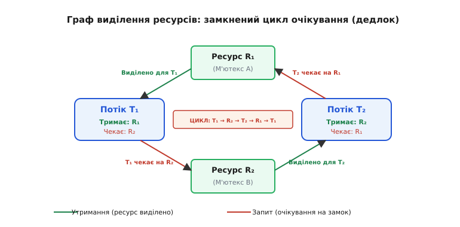
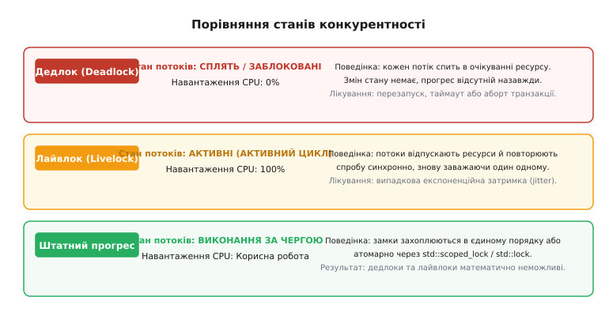
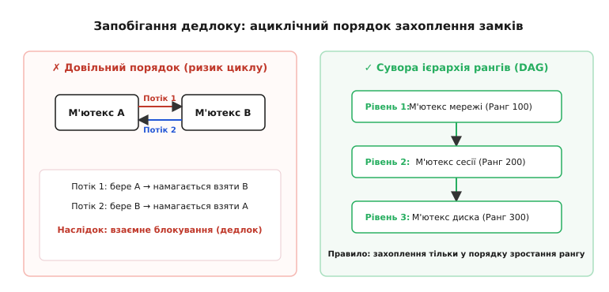

# Дедлок

<preknowlist>
- [Задачі](topic:sf-os/tasks) — незалежні нитки виконання в системі, кожна зі своїм контекстом та пріоритетом.
- [Атомарність і гонки](topic:sf-tasks/atomicity-races) — чому доступ до спільних змінних потребує замків і взаємного виключення.
- [Черги й семафори](topic:sf-tasks/task-ipc) — м'ютекс як замок: операції взяття (lock) та віддачі (unlock).
- [Інверсія пріоритетів](topic:sf-os/priority-inversion) — як замки можуть спотворювати порядок виконання задач планувальником.
</preknowlist>

Сервер обробки платежів у ту саму мікросекунду отримує дві транзакції: потік `A` переказує сто гривень із рахунку `42` на рахунок `99`, а потік `B` переказує п'ятдесят гривень із рахунку `99` на рахунок `42`. Потік `A` успішно захоплює м'ютекс рахунку `42` і звертається за замком рахунку `99`. У цей же момент потік `B` захоплює м'ютекс рахунку `99` і вимагає замок рахунку `42`. Обидва потоки миттєво застигають: потік `A` не може рушити далі, доки потік `B` не віддасть рахунок `99`, а потік `B` заблокований в очікуванні рахунку `42`, який тримає `A`. Навантаження на процесор падає до нуля, вхідна черга запитів стрімко наповнюється, пул потоків вичерпується, і платіжний шлюз перестає відповідати на будь-які зовнішні запити.

У цій ситуації жоден потік не припустився помилки в обчисленнях і не порушив логіку бізнесу. Обидва захищали спільний змінюваний стан за допомогою м'ютексів, як того вимагають правила захисту від перегонів даних. Проте програма повністю зупинила свою роботу. Такий стан системи, коли кілька потоків взаємно блокують один одного, утримуючи потрібні іншим ресурси й одночасно чекаючи на звільнення зайнятих, називається **дедлоком** (англ. *deadlock* — глухий кут, мертва хватка), або **взаємним блокуванням**.

Поки в програмі діє лише один спільний замок, дедлок неможливий: потік може чекати, але власник замка неодмінно виконає критичну секцію і звільнить дорогу. Щойно в архітектурі з'являється другий ресурс — незалежний м'ютекс, апаратний порт вводу-виводу, буфер повідомлень чи канал DMA, — виникає фундаментальна небезпека замкненого кола очікувань, яка проявляється однаково як у мікроконтролерах із кількома кілобайтами пам'яті, так і у великих розподілених кластерах баз даних.

## Анатомія мертвої хватки: чотири умови Кофмана

Щоб зрозуміти, чому виникає взаємне блокування і як йому протидіяти, потрібно розібрати його внутрішній механізм. 1971 року дослідники Едвард Кофман, Майкл Елфік та Арі Шошані довели, що дедлок виникає тоді й тільки тоді, коли в системі одночасно виконуються **чотири необхідні умови**:

1. **Взаємне виключення** (англ. *Mutual Exclusion*): ресурси є неподільними у часі. Якщо ресурс захоплено одним потоком, жоден інший потік не може отримати до нього доступ до моменту повного звільнення.
2. **Утримання й очікування** (англ. *Hold and Wait*): потік, який уже захопив хоча б один ресурс і тримає його, має можливість запитувати додаткові ресурси й блокуватися в очікуванні їхнього виділення, не відпускаючи того, що вже має.
3. **Невитісняльність** (англ. *No Preemption*): ресурс не можна примусово відібрати у потоку-власника адміністративними засобами або діями планувальника. Тільки сам потік за власним бажанням може звільнити захоплений ресурс після завершення роботи з ним.
4. **Циклічне очікування** (англ. *Circular Wait*): існує замкнений ланцюг потоків `T₁ → T₂ → ... → Tₙ → T₁`, у якому потік `T₁` чекає на ресурс, утримуваний `T₂`, потік `T₂` чекає на ресурс потоку `T₃`, а останній потік `Tₙ` чекає на ресурс, який тримає початковий потік `T₁`.

Ці чотири умови діють як ланки одного ланцюга. Якщо в системі присутні перші три умови (монопольні ресурси, утримання замків і відсутність примусового відбору), дедлок усе ще не гарантований — він залишається лише прихованою загрозою. Але щойно порядок виконання команд замикає четверту умову — циклічне очікування, — система неминуче впадає у взаємний клінч.

> 🔧 **Навіщо це.** Головний інженерний висновок із праці Кофмана полягає в тому, що для повної ліквідації дедлоків не потрібно переписувати всю програму чи відмовлятися від паралелізму. Достатньо на рівні архітектури **зруйнувати бодай одну з чотирьох умов**. Зробивши неможливою хоча б одну умову, ви математично гарантуєте, що система ніколи не застигне у дедлоку.

Як формувалися ці теоретичні засади, чому Едсгер Дейкстра назвав це явище «смертельними обіймами» і як ранні мейнфрейми IBM боролися з раптовими зависаннями операційної системи OS/360, докладно висвітлює [історія осмислення від «смертельних обіймів» до умов Кофмана](topic:sf-tasks/deadlock/hist-coffman-dijkstra.md).

## Графічне представлення: граф виділення ресурсів

Для наочного аналізу взаємодії потоків та ресурсів використовують формальний математичний апарат — **граф виділення ресурсів** (англ. *Resource Allocation Graph*, RAG), запропонований Річардом Гольцом 1972 року.

Граф складається з вершин двох типів:
- **Потоки** (процеси або задачі): позначаються кругами або прямокутниками із заокругленими кутами (`T₁`, `T₂`, ...).
- **Ресурси** (м'ютекси, семафори, апаратні канали, таблиці бази даних): позначаються прямокутниками (`R₁`, `R₂`, ...).

Між вершинами графа прокладаються орієнтовані ребра двох видів:
- **Ребро виділення** (утримання): веде від ресурсу до потоку `Rᵢ → Tⱼ`. Воно означає, що ресурс `Rᵢ` наразі захоплено потоком `Tⱼ`.
- **Ребро запиту** (очікування): веде від потоку до ресурсу `Tⱼ → Rᵢ`. Воно показує, що потік `Tⱼ` запросив ресурс `Rᵢ`, заблокований і чекає на його звільнення.



*Потік T₁ тримає ресурс R₁ і вимагає R₂; потік T₂ тримає R₂ і вимагає R₁ — формується замкнене коло очікування.*

Математична властивість графа виділення ресурсів має вирішальне значення для діагностики:
- Якщо кожен тип ресурсу має **рівно один екземпляр** (як у випадку звичайних м'ютексів), наявність орієнтованого циклу в графі є **необхідною і достатньою умовою дедлоку**. Є цикл — є дедлок; немає циклу — дедлок неможливий.
- Якщо ресурси мають **кілька екземплярів** (наприклад, пул із чотирьох однакових мережевих сокетів або лічильний семафор), наявність циклу є лише необхідною, але не достатньою умовою. У такому разі для точного вердикту застосовують [математичний апарат безпечних станів та алгоритм банкіра](topic:sf-tasks/deadlock/math-banker.md).

Спрощеною модифікацією цієї моделі є **граф очікування** (англ. *Wait-For Graph*, WFG), у якому ресурси приховано, а орієнтовані ребра проведено безпосередньо між потоками: ребро `T₁ → T₂` означає, що `T₁` чекає на звільнення замка, який тримає `T₂`. Саме такий редукований граф будують внутрішні диспетчери баз даних для пошуку взаємних блокувань.

## Внутрішній механізм ядра: як потік засинає на футексі

Щоб побачити, що фізично відбувається під час взаємного блокування в пам'яті та процесорі, простежимо шлях системного виклику в сучасних ОС сімейства POSIX та Linux.

Коли потік звертається до м'ютекса (`pthread_mutex_lock`), бібліотека `glibc` спочатку намагається захопити його у просторі користувача за допомогою атомарної інструкції процесора `atomic_compare_exchange` над 32-бітним цілим числом. Якщо замок вільний, операція завершується за лічені наносекунди без жодного системного виклику.

Але якщо замок зайнятий, потік не може крутитися у безкінечному циклі, марнуючи енергію процесора. Він робить системний виклик ядра:
```
sys_futex(uaddr, FUTEX_WAIT_PRIVATE, val, NULL, NULL, 0)
```

Усередині ядра Linux відбувається така послідовність дій:
1. Ядро бере глобальний спінлок хеш-таблиці черг футексів (`futex_queues`).
2. Перевіряє, чи значення за адресою `uaddr` усе ще дорівнює `val` (захист від гонки, коли замок могли звільнити прямо перед входом у ядро).
3. Поточний дескриптор задачі (`task_struct`) переводиться зі стану `TASK_RUNNING` у стан `TASK_UNINTERRUPTIBLE` або `TASK_INTERRUPTIBLE` і додається до двозв'язного списку очікування за цією адресою.
4. Ядро викликає планувальник `schedule()`, який перемикає процесор на виконання іншої готової задачі.

Якщо в системі виник дедлок між двома потоками `T₁` і `T₂`, обидва потоки потрапляють у черги футексів усередині ядра. Оскільки жоден із них більше не отримує процесорного часу, вони ніколи не виконають інструкцію звільнення замка `pthread_mutex_unlock` та не викличуть `futex(..., FUTEX_WAKE, 1)`. Вони залишаються в чергах ядра назавжди, не витрачаючи процесор, але утримуючи виділені ресурси пам'яті та стек.

## Дедлок, лайвлок, голодування та інверсія пріоритетів

У багатопотоковому програмуванні часто плутають чотири різні патологічні стани конкурентності. Вони однаково призводять до деградації системи, проте мають абсолютно різну фізичну природу, різну поведінку процесора та вимагають діаметрально протилежних методів лікування.



*При дедлоку потоки заблоковані й не витрачають процесор, при лайвлоку — марнують 100% CPU на безперервні відступи, а при правильній ієрархії робота йде без перешкод.*

### 1. Дедлок (Deadlock)
Потоки переходять у стан глибокого блокування (у ядрі Linux це стан `TASK_UNINTERRUPTIBLE` або `TASK_INTERRUPTIBLE`), виключаються з черги готових до виконання задач планувальника та засинають. Навантаження на процесор становить 0%. Жодної інструкції не виконується, жоден стан пам'яті не змінюється. Без зовнішнього втручання (аварійного завершення процесу, спрацьовування сторожового таймера або тайм-ауту) система ніколи не вийде з цього стану самостійно.

### 2. Лайвлок (Livelock)
Потоки не сплять: вони активні й споживають до 100% процесорного часу, постійно змінюючи свій внутрішній стан у відповідь на дії партнерів, проте **жодного корисного прогресу не відбувається**. 

Класична побутова аналогія лайвлоку — двоє людей, які зустрілися у вузькому коридорі: один робить крок праворуч, щоб дати дорогу, але другий одночасно робить крок у той самий бік; тоді перший робить крок ліворуч, і другий синхронно ступає ліворуч. Вони постійно рухаються, пітніють від напруги, але розминутися не можуть.

У коді лайвлок найчастіше виникає через наївну спробу уникнути дедлоку за допомогою неблокуючого виклику `try_lock`:
1. Потік `A` бере замок `1`, пробує взяти замок `2` через `try_lock`, отримує відмову, чемно відпускає замок `1` і чекає фіксовані 10 мілісекунд.
2. Потік `B` одночасно бере замок `2`, пробує взяти замок `1`, отримує відмову, відпускає замок `2` і чекає ті самі 10 мілісекунд.
3. Обидва потоки одночасно прокидаються через 10 мілісекунд і повторюють ту саму послідовність крок за кроком.

Лікуванням лайвлоку є **рандомізована експоненційна затримка** (англ. *exponential backoff with jitter*), коли час очікування перед повторною спробою обирається випадково, що розсинхронізує потоки.

### 3. Ресурсне голодування (Starvation)
Система загалом працює успішно, і більшість потоків виконують свої завдання. Проте один конкретний потік ніколи не отримує доступу до ресурсу через алгоритм диспетчеризації або невдалий збіг пріоритетів. Наприклад, якщо до замка безперервно звертаються потоки з високим пріоритетом, потік із низьким пріоритетом може простояти в черзі довільно довго. Голодування долається використанням чесних черг (FIFO) та замків із гарантією черговості (*fair locks*).

### 4. Інверсія пріоритетів (Priority Inversion)
Специфічна пастка систем реального часу, коли високопріоритетна задача виявляється опосередковано заблокованою задачею із середнім пріоритетом через те, що низькопріоритетна задача тримає спільний замок і не може його віддати через витіснення середняком. Механізм і протоколи лікування цієї проблеми детально розглядаються у статті [Інверсія пріоритетів](topic:sf-os/priority-inversion).

## Чотири стратегії подолання дедлоків

В інженерній практиці боротьба з дедлоками поділяється на чотири фундаментальні архітектурні стратегії.

| Стратегія | Коли діє | Основний механізм | Ціна / Накладні витрати |
|---|---|---|---|
| **Запобігання** (*Prevention*) | На етапі проектування / компіляції | Руйнування однієї з 4 умов Кофмана (ієрархія замків) | Обмеження структури коду |
| **Уникнення** (*Avoidance*) | Динамічно під час роботи програми | Оцінка безпеки майбутніх виділень (алгоритм банкіра) | Високий оверхед на кожен запит |
| **Виявлення та розрив** (*Detection & Recovery*) | Періодично після виникнення запитів | Пошук циклів у WFG-графі + аборт транзакції | Витрати на відкат операцій |
| **Страусиний алгоритм** (*Ostrich*) | Після фатального зависання | Ігнорування дефекту + перезапуск через watchdog | Втрата доступності сервісу |

### 1. Запобігання дедлокам (Deadlock Prevention)

Мета запобігання — спроектувати систему так, щоб хоча б одна з умов Кофмана не могла виникнути в принципі.

#### Руйнування циклічного очікування: ієрархія замків
Це найпотужніший і найпоширеніший метод у промисловому системному програмуванні. Кожному м'ютексу в програмі призначається глобальний числовий ранг (рівень в ієрархії). Вводиться залізне правило: **потік має право захоплювати м'ютекс лише тоді, коли його ранг строго вищий за ранги всіх м'ютексів, які потік уже утримує на цей момент**.



*Призначення кожному замку унікального рангу перетворює граф очікувань на орієнтований ациклічний граф (DAG), де цикл неможливий.*

Якщо потоку потрібні ресурси `A` (ранг 100) та `B` (ранг 200), він зобов'язаний спочатку захопити `A`, а потім `B`. Жоден інший потік у системі не має права спробувати взяти `B`, а потім `A`. Граф очікувань стає орієнтованим ациклічним графом (англ. *Directed Acyclic Graph*, DAG), у якому циклів не може існувати математично. Практичну реалізацію такого впорядкування та захист від подвійного взяття демонструє [практична реалізація ієрархії замків та безпечного захоплення](topic:sf-tasks/deadlock/proj-lock-hierarchy.md).

#### Руйнування утримання й очікування: атомарне виділення
Потоку забороняється просити ресурси по черзі. Якщо для операції потрібні три ресурси, потік повинен запросити всі три ресурси одночасно в єдиному неподільному виклику (*all-or-nothing*). Якщо хоча б один ресурс зайнятий, потік не отримує нічого й не утримує жодного замка. У стандартній бібліотеці C++17 це реалізовано за допомогою функції `std::lock()` та обгортки `std::scoped_lock`, які автоматично захоплюють множину м'ютексів за алгоритмом уникнення дедлоку.

#### Руйнування невитісняльності: вивільнення при відмові
Якщо потік тримає замок `A` і під час спроби взяти замок `B` через `try_lock` отримує відмову, він зобов'язаний негайно відпустити замок `A`, повернутися у вихідний стан, почекати випадковий проміжок часу й спробувати всю операцію спочатку. Це руйнує умову невитісняльності, переводячи ризик у площину лайвлоку, який нейтралізують джитер-затримками.

#### Руйнування взаємного виключення: неблокуючі структури
Якщо ресурс можна зробити роздільним, замок не потрібен взагалі. Замість блокування спільних змінних застосовують атомарні інструкції процесора (CAS — Compare-And-Swap), черги без замків ([Без замків](topic:sf-tasks/lock-free-basics)), незмінні структури даних (англ. *immutability*) або поділ доступу на читання та запис за допомогою [Багато читачів, один письменник](topic:sf-tasks/readers-writer-lock).

### 2. Уникнення дедлоків (Deadlock Avoidance)

Уникнення відрізняється від запобігання тим, що ресурси запитуються вільно й динамічно, проте операційна система або рантайм перед кожним реальним виділенням перевіряє, чи не призведе ця дія до переходу в **небезпечний стан**.

Найвідомішим методом є **алгоритм банкіра Дейкстри**. Система вимагає, щоб кожен процес на старті задекларував максимальну кількість ресурсів кожного типу, яка йому може знадобитися. Коли процес генерує запит, система моделює стан, який виникне після задоволення запиту:
- Якщо стан **безпечний** (існує хоча б один сценарій, за якого всі процеси зможуть по черзі завершитися, навіть якщо одночасно зажадають свій задекларований максимум) — ресурс виділяється.
- Якщо стан **небезпечний** — запит процесу відкладається, і потік блокується, хоча фізично вільні ресурси наразі є.

Детальний розбір структур даних, матриць потреб і математичне доведення теореми безпеки наведено у вставці [математичний апарат безпечних станів та алгоритм банкіра](topic:sf-tasks/deadlock/math-banker.md).

### 3. Виявлення та відновлення (Detection and Recovery)

Цей підхід використовується там, де запобігання занадто обмежує розробників, а уникнення неможливе через непередбачуваність запитів. Системі дозволяють виділяти ресурси наосліп, але періодично запускають фоновий процес моніторингу:

1. **Побудова графа очікувань (Wait-For Graph)**: аналізуються всі активні потоки та заблоковані запити на замки.
2. **Пошук циклів**: за допомогою алгоритму пошуку в глибину (DFS) або алгоритму Тар'яна для пошуку сильно зв'язних компонентів виявляються замкнені контури.
3. **Вибір жертви (Victim Selection)**: обирається один із потоків у циклі. Критеріями вибору зазвичай є:
   - Найменший час роботи (найдешевше скасувати);
   - Найменша кількість змінених даних;
   - Найнижчий пріоритет.
4. **Відновлення (Recovery)**: вибраний процес примусово переривається, його зміни відкочуються (*rollback*), а всі захоплені ним замки повертаються в систему, що дозволяє іншим учасникам циклу продовжити виконання.

Саме за цим принципом працюють майже всі сучасні реляційні СКБД (PostgreSQL, MySQL InnoDB, Microsoft SQL Server, Oracle). У PostgreSQL параметр конфігурації `deadlock_timeout` (за замовчуванням 1 секунда) визначає, як довго транзакція може чекати на замок перед тим, як запуститься важкий алгоритм пошуку циклів. Якщо цикл знайдено, одна з транзакцій переривається з системною помилкою `40P01: deadlock detected`.

> 🔧 **Навіщо це.** У розробці веб-сервісів та мікросервісів, які активно взаємодіють із базами даних, дедлоки рядків таблиць є нормальним наслідком високого навантаження. Замість того, щоб намагатися назавжди позбутися їх складними блокуваннями таблиць, архітектура клієнта повинна бути спроектована з розрахунком на помилку `40P01`: щойно клієнт отримує помилку дедлоку від бази даних, транзакційний шар автоматично повторює всю бізнес-операцію спочатку з невеликою випадковою затримкою.

### 4. Розподілені дедлоки у мікросервісах (Distributed Deadlocks)

У розподілених системах дедлоки часто виникають без жодного м'ютекса на рівні коду — через синхронні мережеві виклики RPC та HTTP:
- Сервіс `Auth` викликає `Billing` і чекає на відповідь.
- Сервіс `Billing` синхронно викликає `Notification`.
- Сервіс `Notification` для валідації токена робить синхронний запит до `Auth`.
- Усі три сервіси блокують свої робочі потоки, вичерпують пул з'єднань HTTP-сервера і зупиняються назавжди.

Для виявлення розподілених дедлоків застосовують **алгоритм розслідування ребер Чанді-Місри-Хааса** (англ. *Chandy-Misra-Haas probe algorithm / edge chasing*). Коли вузол `P` довго чекає на вузол `Q`, він надсилає спеціальне повідомлення-зонд `probe(initiator, sender, receiver)`. Вузол `Q` пересилає цей зонд усім серверам, на які він сам наразі чекає. Якщо зонд робить повне коло і повертається назад до `initiator`, це є суворим доказом існування розподіленого дедлоку, після чого ініціатор перериває свій ланцюжок запитів.

### 5. Страусиний алгоритм (Ostrich Algorithm)

Названий на честь популярного міфу про страуса, який ховає голову в пісок під час небезпеки. Стратегія полягає в тому, щоб **не робити нічого для запобігання чи виявлення дедлоків**, припускаючи, що вони трапляються вкрай рідко, а ціна їхнього постійного відстеження набагато перевищує збитки від перезапуску програми.

Більшість операційних систем загального призначення (зокрема класичні ядра Linux, Windows і macOS) застосовують страусиний алгоритм щодо замків користувацького простору. Якщо через помилку програміста два потоки графічного редактора заблокують один одного, операційна система не намагатиметься розірвати замок — користувач просто завершить завислий процес через диспетчер завдань (`kill -9`). 

Проте для систем критичного призначення (автопілоти, медичні апарати штучної вентиляції легень, системи керування атомними станціями) страусиний алгоритм є неприпустимим: там застигання потоку означає фізичну катастрофу, тому застосовують виключно формально верифіковану ієрархію замків та апаратні сторожові таймери (*watchdog*).

## Діагностика дедлоків у реальних системах

Коли сервер раптово перестав обробляти запити, а навантаження на процесор впало до нуля, системний інженер повинен швидко підтвердити або спростувати наявність дедлоку.

### 1. Аналіз за допомогою GDB та pstack
У середовищі Linux найшвидший спосіб побачити стан завислого процесу — підключитися до нього відладчиком `gdb` без перезапуску:

```bash
# Отримати стеки викликів усіх потоків одночасно
gdb -p <PID> -batch -ex "thread apply all bt"
```

Якщо кілька потоків знаходяться всередині викликів `__lll_lock_wait`, `pthread_mutex_lock` або системного виклику `futex`, це пряма ознака блокування. Зіставивши номери рядків у вихідному коді та адреси м'ютексів у бектрейсах, можна миттєво відновити замкнений контур.

### 2. Діагностика через віртуальну файлову систему /proc
Ядро Linux надає інформацію про очікування потоків через інтерфейс `/proc`:

```bash
# Перевірка стану потоку (S — interruptible sleep, D — uninterruptible disk sleep)
cat /proc/<PID>/task/<TID>/status | grep State

# Перевірка точки очікування в ядрі
cat /proc/<PID>/task/<TID>/wchan
```

Значення `futex_wait_queue_me` у файлі `wchan` прямо вказує на те, що потік спить на м'ютексі простору користувача.

### 3. Статичний аналіз компілятором Clang
Компілятор Clang містить вбудований механізм статичного аналізу безпеки потоків (*Thread Safety Analysis*). За допомогою спеціальних атрибутів розробник може наказати компілятору перевіряти порядок замків ще на етапі збирання програми:

```cpp
// Змінні захищені відповідними замками
int balance_a [[clang::guarded_by(mtx_a)]];
int balance_b [[clang::guarded_by(mtx_b)]];

// Функція вимагає утримання замка при виклику
void internal_update() [[clang::requires_capability(mtx_a)]];

// Функція гарантує, що замок НЕ утримується перед викликом (захист від повторного взяття)
void safe_entry() [[clang::locks_excluded(mtx_a)]];
```

### 4. Динамічний аналіз: ThreadSanitizer та lockdep
- **ThreadSanitizer (TSan)**: прапорець компілятора `-fsanitize=thread` у GCC та Clang вбудовує в бінарний файл відстеження всіх захоплень замків під час тестування. TSan будує граф блокувань і повідомляє про ризик виникнення дедлоку (*lock-order-inversion*), навіть якщо під час конкретного прогону тести не зависли.
- **lockdep**: внутрішній верифікатор ядра Linux, який відстежує коректність захоплення спінлоків у контексті переривань і виводить попередження в `dmesg` при першому ж порушенні ієрархії.

## Практичні патерни: від наївного коду до безпечного захоплення

Розглянемо практичний приклад: функцію обміну ресурсами між двома вузлами мережі. Подивимося на небезпечний варіант і на те, як він перетворюється на абсолютно надійний код.

**Умова задачі**: обміняти дані між вузлом `A` та вузлом `B`. Кожен вузол захищений власним м'ютексом.

### ✗ Небезпечний код (потенційний дедлок)

Якщо два потоки викличуть функцію `swap_nodes` одночасно з протилежним порядком аргументів (`swap_nodes(n1, n2)` та `swap_nodes(n2, n1)`), виникне взаємне блокування.

:::tabs
```c
// НЕБЕЗПЕЧНО: порядок взяття замків залежить від переданих аргументів!
void swap_nodes_unsafe(node_t *a, node_t *b) {
    pthread_mutex_lock(&a->mtx);
    pthread_mutex_lock(&b->mtx);

    int temp = a->value;
    a->value = b->value;
    b->value = temp;

    pthread_mutex_unlock(&b->mtx);
    pthread_mutex_unlock(&a->mtx);
}
```
```cpp
// НЕБЕЗПЕЧНО: блокування у порядку отримання параметрів
void swap_nodes_unsafe(Node& a, Node& b) {
    std::unique_lock<std::mutex> lock_a(a.mtx);
    std::unique_lock<std::mutex> lock_b(b.mtx);

    std::swap(a.value, b.value);
}
```
:::

### ✓ Безпечний код (ієрархічне впорядкування та std::scoped_lock)

У мові C безпека досягається порівнянням числових значень адрес вказівників (адреса меншого замка завжди береться першою). У C++17 застосовується `std::scoped_lock`, який за принципом RAII інкапсулює алгоритм безпечного множинного захоплення і гарантовано звільняє ресурси при виході з області видимості або при виникненні винятків.

:::tabs
```c
#include <pthread.h>
#include <stdint.h>
#include <stdbool.h>

typedef struct {
    int value;
    pthread_mutex_t mtx;
} node_t;

// БЕЗПЕЧНО: замки захоплюються в єдиному глобальному порядку за адресою в пам'яті
void swap_nodes_safe(node_t *a, node_t *b) {
    if (a == NULL || b == NULL || a == b) {
        return; // Захист від самоблокування (self-deadlock)
    }

    pthread_mutex_t *first = &a->mtx;
    pthread_mutex_t *second = &b->mtx;

    // Впорядкування адрес: ліквідація циклічного очікування
    if ((uintptr_t)first > (uintptr_t)second) {
        first = &b->mtx;
        second = &a->mtx;
    }

    pthread_mutex_lock(first);
    pthread_mutex_lock(second);

    int temp = a->value;
    a->value = b->value;
    b->value = temp;

    pthread_mutex_unlock(second);
    pthread_mutex_unlock(first);
}
```
```cpp
#include <mutex>
#include <utility>

struct Node {
    int value{0};
    mutable std::mutex mtx;
};

// БЕЗПЕЧНО: C++17 std::scoped_lock гарантує відсутність дедлоку для будь-якої кількості замків
void swap_nodes_safe(Node& a, Node& b) {
    if (&a == &b) {
        return; // Самовтягнення не потребує блокувань
    }

    // std::scoped_lock автоматично впорядковує захоплення замків
    // та звільняє їх у деструкторі за принципом RAII
    std::scoped_lock lock(a.mtx, b.mtx);

    std::swap(a.value, b.value);
}
```
:::

## Підсумковий синтез

Взаємне блокування — це не прикра випадковість, а суворий математичний наслідок неконтрольованої конкурентності за монопольні ресурси. Розуміння чотирьох умов Кофмана позбавляє необхідності боротися з наслідками за допомогою перезапусків:
- При проектуванні нових систем завжди встановлюйте **сувору ієрархію захоплення замків** або використовуйте стандартні інструменти типу `std::scoped_lock`.
- Там, де можливо, віддавайте перевагу **неблокуючим алгоритмам** та ізоляції пам'яті за допомогою каналів передачі повідомлень.
- У базах даних і розподілених чергах закладайте **тайм-аути та автоматичні повтори транзакцій** при виявленні циклів очікування.

Дотримання цих правил гарантує, що система залишатиметься живою, передбачуваною та стійкою до будь-яких навантажень у реальному часі.
