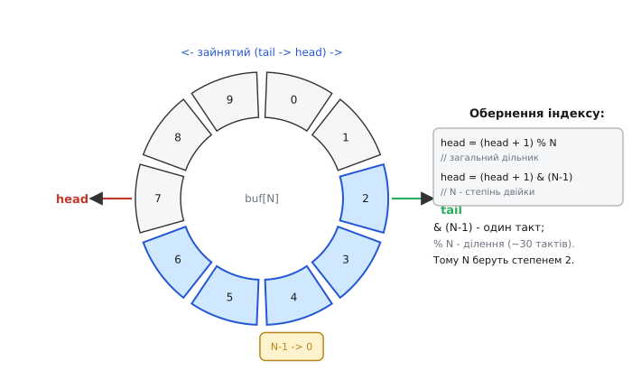
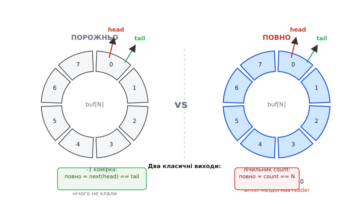

# ⚙️ Кільцевий буфер з нуля: індекси, межі, переповнення

[Контролер DMA](topic:hw-arch/dma-controller) ллє дані в пам'ять безперервно, своїм темпом, поки ядро обробляє ривками — і між ними стоїть кільцевий буфер: структура, що звучить тривіально, але ламається рівно в трьох місцях. Збудуймо її покроково й розберімося з кожним.

## Задача

[Контролер DMA](topic:hw-arch/dma-controller) наповнює буфер у SRAM безперервно, байт за байтом, не чекаючи ядра. Ядро, своєю чергою, забирає накопичені дані одним заходом — і лише тоді, коли має час. Між апаратним потоком і ривковою обробкою потрібен буфер, що приймає нове, поки старе ще не забрали; не має фіксованого «початку й кінця», бо потік нескінченний; і живе у скінченному шматку SRAM. Масив плюс два індекси звучать як тривіальне рішення — але саме на трьох межах (обернення індексу, «повно проти порожньо», блок через фізичний край масиву) ламається перша реалізація.

Коли тим самим кільцем користуються ISR і ядро водночас, виникають питання атомарності й порядку публікації — їх розбирає тема про [переривання](topic:hw-arch/interrupts). Тут зосередимося на самій структурі та її арифметиці.

## Ідея

Кільцевий буфер (ring buffer, circular buffer) — це лінійний масив `buf[N]`, замкнений по модулю: за останнім індексом іде нульовий. Стан буфера описують два індекси: голова (head, writer index) — куди класти наступний байт, і хвіст (tail, reader index) — звідки брати наступний байт.

Серцевина структури — обернення індексу. Два рівнозначних способи:

```
head = (head + 1) % N        // загальний дільник
head = (head + 1) & (N − 1)  // якщо N — степінь двійки (швидка маска)
```

На мікроконтролері ці два вирази нерівнозначні за ціною: `%` — це ціле ділення, яке на Cortex-M без апаратного дільника займає десятки тактів; `&` — один такт, і компілятор знає про це так само добре, як і ми. Саме тому розмір кільця завжди беруть степенем двійки: 64, 128, 256, 512... Та сама маска працює і в SPSC-черзі, яку використовують [переривання](topic:hw-arch/interrupts) для обміну з ядром — роль у неї там та сама, з тієї самої першопричини.



*Кільцевий буфер: масив із N комірок, замкнений у коло. head показує куди писати, tail — звідки читати; зайняте — діапазон tail→head. За індексом N−1 одразу йде 0 — це обернення (модуль N), що й робить буфер кільцем.*

Два індекси повністю описують поточний стан кільця — але є ситуація, де один і той самий стан відповідає двом різним умовам, і саме тут перша пастка.

## Пастка повно-проти-порожньо

> 🔧 **Навіщо це** — якщо не знати про цю неоднозначність, буфер або «затирає» свіжі дані поверх незчитаних, або зупиняє запис раніше ніж треба. Обидва сценарії тихі й підступні.

`head == tail` — це і «порожньо» (нічого не клали з моменту останнього читання), і «повно» (writer обійшов увесь масив і наздогнав reader). Сам по собі індекс не розрізняє ці два стани: конфігурація ідентична, зміст протилежний.



*Фундаментальна неоднозначність: head==tail означає і «порожньо», і «повно» — однакові індекси, протилежний зміст. Два класичні виходи: пожертвувати однією коміркою (стан читається з індексів) або тримати лічильник count зайнятих (доступна вся місткість).*

Неоднозначність знімають одним із двох способів — обидва робочі, вибір свідомий:

1. **Жертвуємо одну комірку.** «Повно» визначається як `next(head) == tail`, де `next(i) = (i + 1) & (N − 1)`. Максимальна місткість стає N − 1 (одна комірка завжди вільна як роздільник), але стан буфера читається з самих індексів без жодних додаткових змінних. Класичний вибір для чистого SPSC-кільця без лічильника.

2. **Тримаємо лічильник `count`.** Push збільшує `count`, pop зменшує; «повно» = `count == N`, «порожньо» = `count == 0`. Вся місткість N у грі, але з'являється спільна змінна — для ISR↔ядра вона вимагає [атомарності](topic:hw-arch/interrupts). Типовий вибір для DMA-кільця, де «скільки накопичилось» — окреме корисне питання.

Другий варіант зручніший, коли ядро хоче знати ступінь заповнення, а не лише факт «є / нема» — саме він потрібен для DMA-варіанта кільця.

## Робочий код

**Базовий модуль: кільце байтів із лічильником**

:::tabs
```c
#include <stdint.h>
#include <stddef.h>

#define RB_SIZE 256u                 // степінь двійки → швидка маска
#define RB_MASK (RB_SIZE - 1u)

typedef struct {
    uint8_t  buf[RB_SIZE];
    volatile uint16_t head;          // writer index
    volatile uint16_t tail;          // reader index
    volatile uint16_t count;         // зайнято байтів
} ring_t;

static inline void rb_init(ring_t *r) {
    r->head = r->tail = r->count = 0;
}

// writer: 1 = записано, 0 = повно (політика «відкинути новий»)
static inline int rb_push(ring_t *r, uint8_t b) {
    if (r->count == RB_SIZE) return 0;     // повно
    r->buf[r->head] = b;                   // 1) дані
    r->head = (r->head + 1u) & RB_MASK;    // 2) посунути голову
    r->count++;
    return 1;
}

// reader: 1 = є байт (в *out), 0 = порожньо
static inline int rb_pop(ring_t *r, uint8_t *out) {
    if (r->count == 0u) return 0;          // порожньо
    *out = r->buf[r->tail];
    r->tail = (r->tail + 1u) & RB_MASK;
    r->count--;
    return 1;
}
```
```cpp
#include <cstdint>
#include <cstddef>

class Ring {
    static constexpr uint16_t SIZE = 256;      // степінь двійки → швидка маска
    static constexpr uint16_t MASK = SIZE - 1;

    uint8_t buf_[SIZE];
    volatile uint16_t head_ = 0;               // writer index
    volatile uint16_t tail_ = 0;               // reader index
    volatile uint16_t count_ = 0;              // зайнято байтів

public:
    // writer: true = записано, false = повно (політика «відкинути новий»)
    bool push(uint8_t b) {
        if (count_ == SIZE) return false;      // повно
        buf_[head_] = b;                       // 1) дані
        head_ = (head_ + 1) & MASK;            // 2) посунути голову
        ++count_;
        return true;
    }

    // reader: true = є байт (в out), false = порожньо
    bool pop(uint8_t &out) {
        if (count_ == 0) return false;         // порожньо
        out = buf_[tail_];
        tail_ = (tail_ + 1) & MASK;
        --count_;
        return true;
    }
};
```
```python
RB_SIZE = 256                        # степінь двійки → швидка маска
RB_MASK = RB_SIZE - 1


class Ring:
    def __init__(self):
        self.buf = bytearray(RB_SIZE)
        self.head = 0                # writer index
        self.tail = 0                # reader index
        self.count = 0              # зайнято байтів

    # writer: True = записано, False = повно (політика «відкинути новий»)
    def push(self, b):
        if self.count == RB_SIZE:    # повно
            return False
        self.buf[self.head] = b                  # 1) дані
        self.head = (self.head + 1) & RB_MASK    # 2) посунути голову
        self.count += 1
        return True

    # reader: повертає байт або None, якщо порожньо
    def pop(self):
        if self.count == 0:          # порожньо
            return None
        b = self.buf[self.tail]
        self.tail = (self.tail + 1) & RB_MASK
        self.count -= 1
        return b
```
```go
const (
	rbSize = 256 // степінь двійки → швидка маска
	rbMask = rbSize - 1
)

type Ring struct {
	buf   [rbSize]byte
	head  uint16 // writer index
	tail  uint16 // reader index
	count uint16 // зайнято байтів
}

// writer: true = записано, false = повно (політика «відкинути новий»)
func (r *Ring) Push(b byte) bool {
	if r.count == rbSize { // повно
		return false
	}
	r.buf[r.head] = b            // 1) дані
	r.head = (r.head + 1) & rbMask // 2) посунути голову
	r.count++
	return true
}

// reader: повертає (байт, true) або (0, false), якщо порожньо
func (r *Ring) Pop() (byte, bool) {
	if r.count == 0 { // порожньо
		return 0, false
	}
	b := r.buf[r.tail]
	r.tail = (r.tail + 1) & rbMask
	r.count--
	return b, true
}
```
```js
const RB_SIZE = 256;                 // степінь двійки → швидка маска
const RB_MASK = RB_SIZE - 1;

class Ring {
  constructor() {
    this.buf = new Uint8Array(RB_SIZE);
    this.head = 0;                   // writer index
    this.tail = 0;                   // reader index
    this.count = 0;                  // зайнято байтів
  }

  // writer: true = записано, false = повно (політика «відкинути новий»)
  push(b) {
    if (this.count === RB_SIZE) return false;   // повно
    this.buf[this.head] = b;                     // 1) дані
    this.head = (this.head + 1) & RB_MASK;       // 2) посунути голову
    this.count++;
    return true;
  }

  // reader: повертає байт або null, якщо порожньо
  pop() {
    if (this.count === 0) return null;           // порожньо
    const b = this.buf[this.tail];
    this.tail = (this.tail + 1) & RB_MASK;
    this.count--;
    return b;
  }
}
```
:::

`volatile` на індексах і лічильнику позначає, що їх змінює інша сторона (докладно — у темах про [`volatile`](topic:sf-lang/volatile) та [переривання](topic:hw-arch/interrupts)); компілятор зобов'язаний перечитувати їх щоразу з пам'яті.

**Читання блоку через край масиву**

Ядро забирає не по одному байту, а великим шматком — бо саме так улаштоване передавання до наступного обробника. І тут виникає фізична пастка: блок може починатися поблизу кінця масиву й продовжуватися з його початку. Один логічний блок — два фізично несуміжних відрізки.

:::tabs
```c
#include <string.h>

// забрати до n байтів суцільним блоком; повертає скільки реально віддав
static size_t rb_pop_block(ring_t *r, uint8_t *dst, size_t n) {
    if (n > r->count) n = r->count;        // не більше, ніж є
    size_t first = RB_SIZE - r->tail;      // до фізичного краю масиву
    if (first > n) first = n;
    memcpy(dst,         &r->buf[r->tail], first);    // частина 1: tail..край
    memcpy(dst + first, &r->buf[0],       n - first); // частина 2: з початку
    r->tail  = (r->tail + n) & RB_MASK;
    r->count -= (uint16_t)n;
    return n;
}
```
```cpp
#include <cstring>

// забрати до n байтів суцільним блоком; повертає скільки реально віддав
size_t Ring::popBlock(uint8_t *dst, size_t n) {
    if (n > count_) n = count_;            // не більше, ніж є
    size_t first = SIZE - tail_;          // до фізичного краю масиву
    if (first > n) first = n;
    std::memcpy(dst,         &buf_[tail_], first);    // частина 1: tail..край
    std::memcpy(dst + first, &buf_[0],     n - first); // частина 2: з початку
    tail_  = (tail_ + n) & MASK;
    count_ -= static_cast<uint16_t>(n);
    return n;
}
```
```python
    # забрати до n байтів суцільним блоком; повертає bytes, реально відданий
    def pop_block(self, n):
        if n > self.count:                 # не більше, ніж є
            n = self.count
        first = RB_SIZE - self.tail        # до фізичного краю масиву
        if first > n:
            first = n
        out = bytes(self.buf[self.tail:self.tail + first])   # частина 1: tail..край
        out += bytes(self.buf[0:n - first])                   # частина 2: з початку
        self.tail = (self.tail + n) & RB_MASK
        self.count -= n
        return out
```
```go
// забрати до n байтів суцільним блоком; повертає скільки реально віддав
func (r *Ring) PopBlock(dst []byte, n int) int {
	if n > int(r.count) { // не більше, ніж є
		n = int(r.count)
	}
	first := rbSize - int(r.tail) // до фізичного краю масиву
	if first > n {
		first = n
	}
	copy(dst[:first], r.buf[r.tail:])       // частина 1: tail..край
	copy(dst[first:n], r.buf[0:n-first])    // частина 2: з початку
	r.tail = (r.tail + uint16(n)) & rbMask
	r.count -= uint16(n)
	return n
}
```
```js
  // забрати до n байтів суцільним блоком; повертає скільки реально віддав
  popBlock(dst, n) {
    if (n > this.count) n = this.count;    // не більше, ніж є
    let first = RB_SIZE - this.tail;       // до фізичного краю масиву
    if (first > n) first = n;
    dst.set(this.buf.subarray(this.tail, this.tail + first), 0);   // частина 1: tail..край
    dst.set(this.buf.subarray(0, n - first), first);               // частина 2: з початку
    this.tail = (this.tail + n) & RB_MASK;
    this.count -= n;
    return n;
  }
```
:::

Якщо блок не перетинає край — `n - first == 0`, другий `memcpy` копіює нуль байтів, і це цілком коректно. Але якщо забути про другий відрізок, результат — обрізаний блок або вихід за межі масиву. Саме ця «розірваність» відрізняє кільцевий буфер від лінійного: суцільне читання чи запис завжди потребує двох відрізків у запасі.

## DMA-твіст: коли «голову» рухає апаратура

У класичному кільці голову (head) просуває код — після кожного `rb_push`. У DMA-варіанті письменник — не код, а сам [контролер DMA](topic:hw-arch/dma-controller): він автономно переносить байти з периферії прямо в `buf`, не звертаючись до ядра.

Тоді `head` не збільшує ядро — його читають із регістра лічильника передач [каналу DMA](topic:hw-arch/dma-channels): скільки байтів контролер уже переніс або скільки лишилося в дескрипторі. «Скільки доступно для читання» = `(апаратний_head − tail) & RB_MASK` — похідна величина без жодного явного лічильника від DMA. Хвіст (tail) своєю чергою рухає ядро, забираючи блок через `rb_pop_block`.

Звідси й перевага: варіант із похідним head зручніший за варіант із явним `count`, який довелося б тримати синхронним з апаратурою. Саме так організовано потік даних від [АЦП через DMA](root:embedded/dma-adc) і [I2S/SPI-мікрофона](root:embedded/dma-spi-i2s); деталі периферії — у тих темах, тут — лише механіка індексів.

## Складність і пастки на МК

- **Степінь двійки.** N — степінь двійки → `& (N−1)` замість `% N`: один такт проти десятків. Якщо N — не степінь двійки, маска не працює — тоді чесний `%` або ручна перевірка `if (i == N) i = 0;`.

- **Повно проти порожньо — обирати свідомо.** «−1 комірка» (стан читається з самих індексів) або `count` (уся місткість, плюс спільна змінна). Мовчки сплутати ці стани — означає губити або перезаписувати дані без жодного попередження.

- **Політика переповнення.** Повно — відкинути новий байт (код вище) / затерти найстаріший (посунути ще й tail) / виставити прапорець помилки. Тихо губити байти підступно; для DMA-потоку переповнення означає «ядро не встигло за апаратурою» — це треба ловити явно.

- **Блок через край — два відрізки.** Будь-яке суцільне читання або запис, що перетинає фізичний край масиву, — це два `memcpy`. Забути другий — обрізаний блок або вихід за масив.

- **Вирівнювання й розмір під DMA.** Реальний DMA часто вимагає, щоб буфер починався на певній межі й мав розмір, кратний рядку кешу (деталі цілісності буфера — у темі про [гонки DMA й кеш](topic:sf-tasks/dma-cache-races)); тут достатньо знати, що геометрію буфера диктує не лише зручність коду.

- **Атомарність індексів і два контексти.** Якщо head і tail зачіпають різні контексти — ISR, друге ядро ESP32, або сам DMA через регістр — потрібні атомарність слова і бар'єри, які розбирає тема про [переривання](topic:hw-arch/interrupts); `count` як спільний лічильник тим паче потребує обережності.

Кільцевий буфер — це масив плюс модульна арифметика, і вся складність не в «писати по колу», а рівно в трьох місцях: обернення індексу, неоднозначність `head == tail` і блок, що розривається краєм масиву. Коли головою керує сам DMA, а ядро лише зчитує апаратний лічильник передач, кільце стає природним стиком між безперервним апаратним потоком і ривковою обробкою — без жодного зайвого копіювання проміжних даних.
