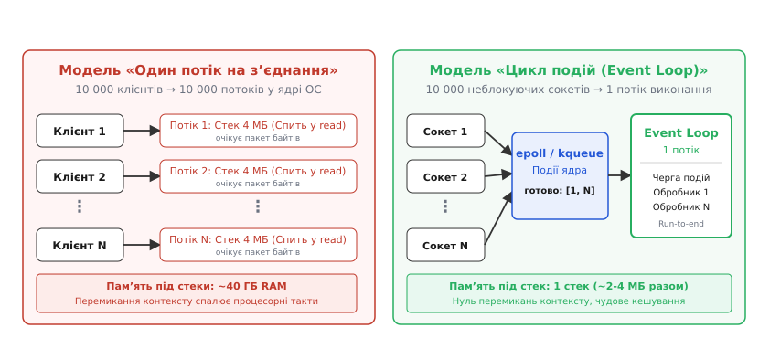
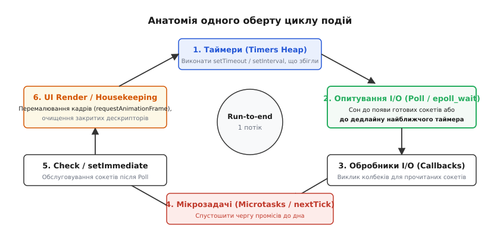
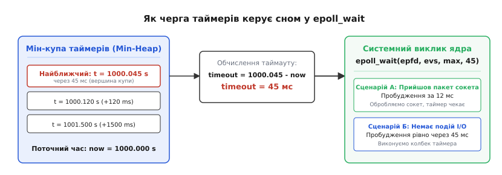
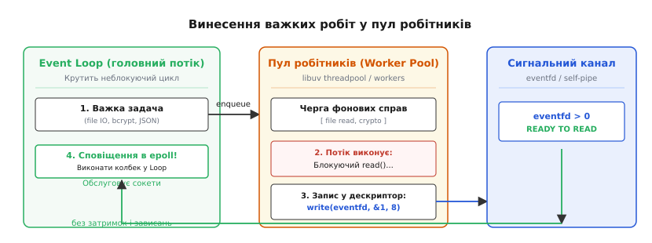

# 🔄 Цикл подій (Event Loop)

<preknowlist>
* [Блокуюче та неблокуюче введення-виведення](topic:sf-tasks/blocking-vs-nonblocking-io)
* [Процеси та потоки](topic:sf-os/process-vs-thread)
* [Планувальник операційної системи](topic:sf-os/scheduler)
* [Опитування проти подій](topic:sf-tasks/polling-vs-events)
</preknowlist>

Коли мережевий сервер виділяє окремий системний потік під кожного клієнта і намагається одночасно утримувати 10 000 з’єднань, операційна система виділяє під їхні стеки близько 40 ГБ оперативної пам’яті (із розрахунку типових 4 МБ на потік у 64-розрядних ОС). Навіть якщо 9 999 клієнтів не передають жодного байта, планувальник ядра змушений безупинно обходити тисячі дескрипторів і перемикати процесорні контексти, витрачаючи до 80% обчислювальних тактів процесора на службову метушню.

Заміна моделі «потік на з’єднання» на **цикл подій (Event Loop)** розв’язує цю кризу: один єдиний потік виконання послідовно обробляє готові мережеві пакети та таймери, делегуючи очікування системному демультиплексору ядра операційної системи.


*Зліва — класична багатопотокова модель, де кожен потік блокується на читанні та утримує дорогий стек. Справа — цикл подій, де єдиний потік обробляє події від ядра через epoll або kqueue без перемикань контексту.*

> 🔧 **Навіщо це.** Розуміння механіки циклу подій дозволяє писати високонавантажені сервери, вебзастосунки та мережеві мікросервіси, що витримують сотні тисяч одночасних з’єднань на одному процесорному ядрі без перевантаження оперативної пам’яті та взаємних блокувань.

---

### Першопричини та сутність демультиплексування

Класичне синхронне введення-виведення змушує потік засинати на час виконання операції. Коли потік викликає системний виклик `read(fd, buf, len)`, ядро ОС переводить його зі стану виконання (`TASK_RUNNING`) у стан очікування (`TASK_INTERRUPTIBLE`), доки контролер мережевої карти не отримає Ethernet-кадри та не згенерує апаратне переривання.

Кожен заблокований потік утримує в пам’яті виділені ядром структури: структуру `task_struct`, стек ядра (зазвичай 8–16 КБ), кеш регістрів процесора та користувацький стек. Коли тисячі потоків прокидаються одночасно, планувальник ядра (як-от CFS або EEVDF у Linux) витрачає гігантські ресурси на перемикання контексту, що призводить до скидання процесорних кешів L1/L2 та інвалідації буфера трансляції адрес (TLB).

Щоб обслуговувати тисячі відкритих каналів в одному потоці, операції переводять у **неблокуючий режим** (через прапорець `O_NONBLOCK` системного виклику `fcntl`). Спроба читання з порожнього неблокуючого сокета не зупиняє потік, а миттєво повертає помилку `EAGAIN` або `EWOULDBLOCK`.

Проте наївний неперервний обхід 10 000 сокетів у циклі опитування (`busy-wait polling`) спалює 100% потужності CPU на марні системні виклики: при 200 наносекундах на один системний виклик перевірка масиву сокетів займатиме 2 мілісекунди чистого процесорного часу навіть за повної відсутності трафіку.

Вирішенням є передача списку спостережуваних дескрипторів спеціальному **системному демультиплексору ядра**:

1. `epoll` у Linux (`epoll_create1`, `epoll_ctl`, `epoll_wait`).
2. `kqueue` у FreeBSD, macOS та iOS (`kevent`).
3. `I/O Completion Ports (IOCP)` у Microsoft Windows (`CreateIoCompletionPort`, `GetQueuedCompletionStatus`).
4. `io_uring` у новітніх ядрах Linux (асинхронні кільцеві буфери у спільній пам’яті).

Демультиплексор бере на себе сон потоку: процес засинає в ядрі рівно доти, доки на одному з зареєстрованих сокетів не з’являться дані або не спливе заданий таймаут. Завдяки цьому складність отримання подій знижується з лінійної `O(N)` до константної `O(1)`.

Детальний історичний шлях від перших обмежень `select()` до сучасного `epoll` та `io_uring` викладено у вставці [📜 Як проблема C10K породила сучасні реактори й epoll](topic:sf-tasks/event-loop/hist-c10k-and-demux.md).

---

### Анатомія одного оберту (Tick) циклу подій

Робота циклу подій є нескінченною послідовністю фіксованих фаз, що виконуються по колу. Кожна ітерація такого кола називається **обертом (tick)**.


*Послідовність виконання фаз одного оберту циклу подій: перевірка таймерів, очікування в демультиплексорі, виклик I/O-обробників, спустошення черги мікрозадач та перемалювання інтерфейсу.*

Розглянемо детально, які системні структури задіюються на кожній фазі оберту:

#### 1. Фаза таймерів (Timers Phase)
Цикл подій підтримує чергу таймерів у вигляді двійкової мін-купи (`min-heap`). На початку оберту потік зчитує поточний монотонний час системи (`clock_gettime(CLOCK_MONOTONIC)`). Якщо дедлайн таймера на вершині купи менший або дорівнює поточному часу (`deadline ≤ now`), цей таймер вилучається з купи, а його функція зворотного виклику виконується. Якщо таймер був періодичним (`setInterval`), його наступний дедлайн перераховується і знову поміщається в купу за час `O(log N)`.

#### 2. Фаза системного опитування (Poll / I/O Demultiplexing Phase)
Це єдина фаза циклу, де потік має право заснути. Цикл розраховує точний час дозволеного сну на основі найближчого таймера і передає його в системний виклик `epoll_wait()`. Потік звільняє ядра процесора для інших завдань операційної системи доти, доки мережева карта не надішле апаратне переривання про появу пакетів на сокеті або доки не спливе таймерний інтервал.

#### 3. Фаза обробників I/O (Pending I/O Callbacks Phase)
Усі події, повернені системним демультиплексором (надходження нових TCP-з’єднань у сокеті, що слухає, поява байтів для читання в сокеті клієнта, готовність буфера до запису або скидання зв’язку `EPOLLERR`/`EPOLLHUP`), передаються відповідним зареєстрованим функціям зворотного виклику.

#### 4. Фаза мікрозадач (Microtasks / nextTick Phase)
Між основними макрофазами цикл перевіряє спеціальну чергу високого пріоритету — чергу мікрозадач (обробники промісів `Promise.then`, `catch`, `finally`, функції `queueMicrotask` та `process.nextTick`). Черга мікрозадач **завжди спустошується до повного дна**, перш ніж потік зможе перейти до наступної фази або наступного оберту.

#### 5. Фаза перевірки (Check / Immediate Phase)
У цій фазі виконуються зворотні виклики, які мають гарантовано спрацювати негайно після завершення обробки введення-виведення фази Poll (наприклад, `setImmediate` у Node.js). Це дозволяє запускати задачі без додаткового очікування таймерного кроку в ядрі.

#### 6. Фаза очищення та рендерингу (Close Callbacks & UI Render Phase)
Виконуються закриття системних дескрипторів (`uv_close`), вивільнення пов’язаних буферів, а у графічних браузерних рушіях викликаються обробники анімації (`requestAnimationFrame`), виконується розрахунок стилів, побудова дерева компонування (Layout) та перемалювання пікселів (Paint) на екрані з частотою 60 або 120 кадрів на секунду.

---

### Узгодження черги таймерів із демультиплексором ядра

Головна інженерна задача циклу подій — не допустити ситуації, коли потік спить у системному виклику `epoll_wait()`, у той час як дедлайн встановленого таймера вже настав.

Для цього використовується строгий математичний розрахунок таймауту:

```
[Стан купи таймерів]
Вершина купи (найближчий таймер): T_min

[Розрахунок таймауту для epoll_wait]
1. Якщо купа порожня:
   timeout_ms = -1 (сон до появи першого сокетного пакета)

2. Якщо T_min ≤ now (дедлайн уже минув):
   timeout_ms = 0  (миттєва перевірка epoll без блокування)

3. Якщо T_min > now (таймер у майбутньому):
   timeout_ms = T_min - now
```


*Схема розрахунку таймауту: різниця між поточним часом і вершиною мін-купи задає точний час сну системного виклику epoll_wait.*

Завдяки цьому механізму ядро ОС автоматично розбудить потік рівно в момент спрацьовування найближчого таймера, якщо раніше не надійдуть мережеві пакети.

#### Дрейф таймерів (Timer Drift)
Важливо усвідомлювати, що встановлення таймера на 10 мілісекунд (`setTimeout(cb, 10)`) гарантує лише те, що функція спрацює **не раніше**, ніж через 10 мілісекунд, але не гарантує виконання точно в цей момент. Якщо обробник мережевого сокета в поточний момент зайнятий виконанням тривалої операції протягом 35 мілісекунд, таймер буде вилучено з купи та виконано лише через 35 мілісекунд.

Повну робочу реалізацію власного циклу подій на C та C++ з використанням `epoll` та мін-купи можна знайти у практичній вставці [⚙️ Власний цикл подій на epoll з таймерами та сокетами](topic:sf-tasks/event-loop/proj-mini-event-loop.md).

---

### Принцип Run-to-Completion та блокування головного потоку

Цикл подій гарантує фундаментальну властивість виконання: **Run-to-Completion (виконання до кінця)**. Обробник кожної події виконується атомарно від початку до кінця без переривання іншими подіями цього ж циклу.

```
Подія 1 ──► [ Обробник 1 (виконується неподільно) ] ──► Завершено
                                                          │
Подія 2 ──► [ Обробник 2 (чекає завершення 1-го)  ] ──► Завершено
```

Цей принцип дає величезну перевагу: бізнес-логіці всередині обробника не потрібні м’ютекси (`mutex`), блокування читання-запису чи критичні секції, оскільки стан пам’яті не може бути спотворений паралельним потоком.

#### Пастка блокування (Event Loop Lag)
Зворотним боком однопотокового виконання є вразливість до тривалих обчислень. Якщо один з обробників містить важкий цикл (наприклад, розрахунок криптографічного хешу bcrypt, парсинг гігабайтного JSON або синхронне читання з повільного диска), **весь цикл подій зупиняється**:

```
[Обробник клієнта A: важкий JSON на 2000 мс] ──► Зависання всього циклу!
                                                  Клієнти B, C, D чекають
                                                  Таймери не спрацьовують
                                                  Мережеві сокети відпадають за таймаутом
```

> 🔧 **Навіщо це.** Будь-яка синхронна пауза в головному потоці збільшує затримку (`latency`) для всіх інших підключених клієнтів. Важкі обчислення або дискові операції необхідно розбивати на кванти через `setImmediate` або виносити у фоновий пул потоків.

---

### Макрозадачі проти Мікрозадач і загроза голодування

У сучасних середовищах (браузерний JavaScript, V8, Node.js, Python asyncio) черги задач розділені за пріоритетом на дві категорії:

| Характеристика | Макрозадачі (Macrotasks) | Мікрозадачі (Microtasks) |
| :--- | :--- | :--- |
| **Джерела** | `setTimeout`, `setInterval`, сокетні події I/O, `setImmediate`, події UI. | `Promise.then`, `catch`, `finally`, `queueMicrotask`, `process.nextTick`. |
| **Порядок обробки** | По одній або пачками у відповідній фазі циклу. | Негайно після кожного колбека до повного спустошення черги. |
| **Пріоритет** | Звичайний. | Найвищий (блокує перехід до наступної макрофази). |

#### Ризик голодування циклу (Microtask Starvation)
Якщо всередині мікрозадачі рекурсивно створювати нові мікрозадачі, черга мікрозадач ніколи не спорожніє. Цикл подій застрягне у фазі спустошення, жоден мережевий сокет не буде прочитаний, а інтерфейс користувача зависне:

:::tabs
@tab C++
```cpp
// Концептуальна модель черги мікрозадач у C++
#include <iostream>
#include <queue>
#include <functional>

class MicrotaskScheduler {
public:
    void enqueue_microtask(std::function<void()> task) {
        microtasks_.push(std::move(task));
    }

    void drain_microtasks() {
        // УВАГА: Якщо таска додасть нову таску, цикл не вийде,
        // блокуючи основні фази I/O (Microtask Starvation)!
        while (!microtasks_.empty()) {
            auto task = std::move(microtasks_.front());
            microtasks_.pop();
            task();
        }
    }

private:
    std::queue<std::function<void()>> microtasks_;
};
```
@tab C
```c
// Концептуальна модель черги мікрозадач у C
#include <stdio.h>
#include <stdlib.h>

typedef void (*task_fn)(void *data);

typedef struct task_node {
    task_fn fn;
    void *data;
    struct task_node *next;
} task_node_t;

typedef struct {
    task_node_t *head;
    task_node_t *tail;
} microtask_queue_t;

void enqueue_microtask(microtask_queue_t *q, task_fn fn, void *data) {
    task_node_t *node = malloc(sizeof(task_node_t));
    node->fn = fn;
    node->data = data;
    node->next = NULL;
    if (q->tail) {
        q->tail->next = node;
        q->tail = node;
    } else {
        q->head = q->tail = node;
    }
}

void drain_microtasks(microtask_queue_t *q) {
    while (q->head) {
        task_node_t *node = q->head;
        q->head = node->next;
        if (!q->head) q->tail = NULL;

        node->fn(node->data);
        free(node);
    }
}
```
:::

---

### Винесення блокуючих операцій у пул робітників (Worker Offloading)

Оскільки файлове введення-виведення у багатьох операційних системах (зокрема класичному Linux) не підтримує справжній неблокуючий режим через системний демультиплексор, а операції хешування чи стиснення завантажують процесор на 100%, цикли подій інтегрують **багатопотоковий пул робітників (Worker Threadpool)**.


*Головний потік передає важку блокуючу задачу в чергу пулу робітників, продовжує обробляти легкі сокети, а після завершення задачі робітник будить головний потік через системний дескриптор eventfd.*

Механізм сповіщення базується на спеціальних сигнальних дескрипторах:

1. **Linux `eventfd`**: робочий потік записує 8-байтове число через `write(eventfd, &val, 8)`. Лічильник дескриптора збільшується, і `epoll` головного потоку миттєво фіксує подію `EPOLLIN`.
2. **POSIX `self-pipe`**: класичний пайп, де робочий потік записує один байт у кінець запису, а головний потік читає його через `epoll` або `kqueue`.
3. **Windows `PostQueuedCompletionStatus`**: робочий потік відправляє пакет завершення безпосередньо в порт IOCP.

Повний системний інтерфейс організації пулу потоків та керування дескрипторами в `libuv` описано у довіднику [📋 Інтерфейс та життєвий цикл libuv loop](topic:sf-tasks/event-loop/api-libuv-loop.md).

---

### Рівневе (Level-Triggered) проти Крайового (Edge-Triggered) сповіщення

При реєстрації сокетів у системному демультиплексорі `epoll` розробник обирає один із двох фундаментальних режимів сповіщення:

```
[Вхідний буфер сокета: 4096 байтів]
Користувач прочитав лише 1024 байти (залишилося 3072 байти)

1. Level-Triggered (EPOLLLT):
   epoll_wait() продовжуватиме прокидатися на кожній ітерації,
   бо в буфері досі є непрочитані дані (> 0).

2. Edge-Triggered (EPOLLET):
   epoll_wait() прокинеться ЛИШЕ коли надійдуть НОВІ байти з мережі.
   Якщо не вичитати весь буфер до кінця (до помилки EAGAIN),
   сокет назавжди зависне!
```

* **Level-Triggered (LT)** — безпечний режим за замовчуванням. Прощає часткове вичитування буфера, але генерує додаткові системні виклики перемикання контексту ядра.
* **Edge-Triggered (ET)** — високопродуктивний режим. Вимагає обов’язкового неблокуючого читання в циклі `while` до отримання помилки `EAGAIN` або `EWOULDBLOCK`. Якщо пропустити хоча б один байт, наступне сповіщення не надійде, і клієнтське з’єднання зависне.

#### Запобігання монополізації потоку (Starvation Prevention)
При використанні Edge-Triggered режиму виникає небезпека: якщо один активний клієнт передає безперервний потік даних зі швидкістю 10 Гбіт/с, цикл читання `while(read() > 0)` ніколи не отримає `EAGAIN`, захопивши весь потік і заморозивши решту тисяч з’єднань. Для захисту від цього високопродуктивні рушії (наприклад, NGINX чи Envoy) вводять **квоти читання**: сокет читається максимум на 64–128 КБ за ітерацію, після чого потік віддає керування іншим клієнтам.

---

### Архітектурні шаблони: Reactor, Proactor та Thread-per-Core

Цикли подій є основою для трьох провідних шаблонів проектування високопродуктивних систем:

```
                          ┌────────────────────────────┐
                          │    Моделі циклу подій      │
                          └──────────────┬─────────────┘
                 ┌───────────────────────┼───────────────────────┐
                 ▼                       ▼                       ▼
          ┌─────────────┐         ┌─────────────┐         ┌─────────────┐
          │   Reactor   │         │  Proactor   │         │ Thread-per- │
          │ (epoll/kqu) │         │ (IOCP/uring)│         │    Core     │
          └─────────────┘         └─────────────┘         └─────────────┘
```

1. **Шаблон Reactor (Реактор)**: Системний демультиплексор повідомляє про *готовність до операції* (сокет можна читати). Застосунок самостійно виконує системний виклик `read()` і забирає байти з ядра. Приклади: Node.js, Redis, Netty, Twisted.
2. **Шаблон Proactor (Проактор)**: Застосунок ініціює операцію введення-виведення наперед, передаючи буфер ядру. ОС самостійно наповнює буфер і повідомляє про *завершення операції*. Приклади: Windows IOCP, Boost.Asio, Linux `io_uring`.
3. **Модель Thread-per-Core (Потік на ядро)**: Запуск незалежного ізольованого циклу подій на кожне фізичне ядро процесора з жорсткою прив’язкою (`CPU pinning` через `pthread_setaffinity_np`) та розподілом мережевих з’єднань через прапорець ядра `SO_REUSEPORT`. Між ядрами відсутня спільна пам’ять та блокування (`Shared-Nothing Architecture`). Приклади: NGINX, Envoy Proxy, Seastar, ScyllaDB.

---

### Порівняльний вибір архітектури

| Критерій | Один потік на з’єднання (Thread-per-Conn) | Цикл подій (Event Loop / Reactor) | Потік на процесорне ядро (Thread-per-Core) |
| :--- | :--- | :--- | :--- |
| **Споживання пам’яті** | Високе (мегабайти на кожного клієнта). | Мінімальне (кілька кілобайтів на сокет). | Мінімальне, масштабується лінійно за ядрами. |
| **Перемикання контексту** | Дуже часте, створює високі накладні витрати CPU. | Відсутнє в межах потоку виконання. | Нульове, потік жорстко зафіксований на ядрі. |
| **Синхронізація (Locks)** | Обов’язкова (м’ютекси, атоміки, семафори). | Не потрібна в межах головного потоку. | Не потрібна (повна ізоляція пам’яті). |
| **Чутливість до блокувань** | Низька (блокується лише один потік клієнта). | **Критична** (зависання блокує всіх клієнтів). | Критична для конкретного процесорного ядра. |
| **Найкраще застосування** | Складні синхронні застосунки з важким CPU. | WebSockets, чати, API-шлюзи, мікросервіси. | Максимальне навантаження (NGINX, Envoy, ScyllaDB). |
